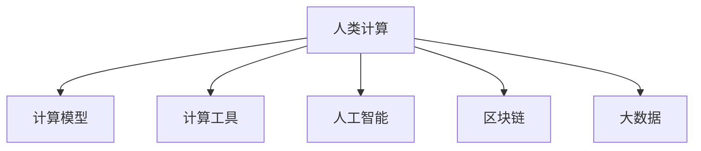

                 

# 人类计算：应用与案例分析

> 关键词：人类计算,应用场景,案例分析,计算模型,计算工具

## 1. 背景介绍

### 1.1 问题由来

随着信息技术的快速发展，计算在现代社会中的应用越来越广泛。从日常生活中的手机、电脑、智能家居，到科学研究、工业制造、金融交易等领域，计算无处不在。计算技术的进步不仅提升了生产效率，还推动了新产业的发展。然而，在计算过程中，特别是面对复杂、庞大的计算任务时，传统计算方式往往显得力不从心。这时候，就需要引入“人类计算”的概念。

“人类计算”是指利用人类智慧，以传统计算方式难以实现或成本过于高昂的方式，辅助或替代计算机进行计算的过程。该概念最早可追溯到二战期间，盟军为破解德国的恩尼格玛密码而设计的计算方法。在现代，随着人工智能、区块链、大数据等技术的崛起，人类计算的应用场景进一步扩展。

### 1.2 问题核心关键点

人类计算的核心关键点在于如何利用人类的智慧和技能，有效辅助或替代计算机进行计算。其核心要素包括：

- **智慧**：人类智慧的独特性在于其能够理解和处理复杂、非结构化的信息，进行创新和创造。这种能力在许多计算任务中不可或缺。
- **技能**：人类拥有各种专业技能和经验，这些技能可以在特定计算任务中发挥重要作用。例如，医生能够利用医学知识进行疾病诊断，会计师能够利用财务知识进行数据分析。
- **时间成本**：在一些情况下，使用人类计算虽然效率不如机器，但成本相对较低，且可灵活调整，适应不同任务的需求。

这些关键点共同构成了人类计算的基础，使其成为计算技术的重要补充。

### 1.3 问题研究意义

研究人类计算的方法和技术，对于拓展计算的应用边界，提升计算的效率和效果，具有重要意义：

- **提升效率**：人类计算可以在机器计算难以应对的场景中发挥作用，提升整体计算效率。
- **降低成本**：在一些特定任务中，使用人类计算可以减少对昂贵的计算硬件和算法的依赖。
- **增加灵活性**：人类计算具有更高的灵活性和适应性，能够适应多样化的计算需求。
- **促进创新**：人类智慧和技能是创新和创造力的源泉，能够推动新计算技术的发展。
- **赋能产业**：人类计算的应用可以赋能各行各业，促进产业升级和经济社会发展。

## 2. 核心概念与联系

### 2.1 核心概念概述

为更好地理解人类计算的应用与案例分析，本节将介绍几个密切相关的核心概念：

- **人类计算**：利用人类的智慧和技能，辅助或替代计算机进行计算的过程。
- **计算模型**：描述计算过程的数学或逻辑模型，包括传统计算机模型和新型计算模型。
- **计算工具**：辅助进行计算的软件和硬件工具，如编程语言、操作系统、计算平台等。
- **人工智能**：模拟人类智能的计算技术，包括机器学习、深度学习、自然语言处理等。
- **区块链**：一种分布式数据库技术，能够实现去中心化、透明和安全的计算。
- **大数据**：处理和分析大规模数据的计算技术，包括数据存储、数据处理和数据分析。

这些核心概念之间的逻辑关系可以通过以下Mermaid流程图来展示：



这个流程图展示了一系列与人类计算相关的概念及其之间的关系：

1. 人类计算通过各种计算模型来辅助计算机进行计算。
2. 计算工具提供了具体的实现手段，使得计算过程得以执行。
3. 人工智能技术赋予了人类计算智能化的能力，提升了计算的效率和效果。
4. 区块链技术提供了去中心化的计算平台，增强了计算过程的安全性和透明性。
5. 大数据技术提供了海量数据的处理和分析能力，扩展了计算的应用范围。

## 3. 核心算法原理 & 具体操作步骤

### 3.1 算法原理概述

人类计算的算法原理主要基于人类的智慧和技能，辅以特定的计算模型和工具。其核心思想是通过人类的介入，解决传统计算机难以处理或成本过高的计算问题。具体步骤如下：

1. **确定计算任务**：明确需要计算的具体任务和目标，分析任务的复杂性和难度。
2. **选择合适的计算模型**：根据任务的特点，选择适合的计算模型，如传统计算机模型或新型计算模型。
3. **设计计算工具**：开发或选择适合进行该计算任务的计算工具，如编程语言、算法库、计算平台等。
4. **人类介入**：人类利用其智慧和技能，辅助或替代计算机进行计算。
5. **评估和优化**：对计算结果进行评估，根据实际情况进行优化调整，以提升计算效率和效果。

### 3.2 算法步骤详解

以下是一个具体的人类计算案例的详细步骤：

**案例背景**：某制药公司需要进行大规模药物筛选，以确定潜在的抗癌药物。传统的计算机计算方法需要大量时间和计算资源，且效率不高。

**步骤1：确定计算任务**  
明确需要进行大规模药物筛选，目标是识别出具有抗癌活性的化合物。

**步骤2：选择合适的计算模型**  
选择基于量子力学的计算模型，因为该模型能够模拟分子结构及其相互作用，适合进行复杂的药物筛选。

**步骤3：设计计算工具**  
开发专门的计算工具，如QuantumESPRESSO，用于执行基于量子力学的计算。

**步骤4：人类介入**  
研究人员使用该计算工具进行计算，同时利用其化学和物理知识，对计算结果进行解释和分析，筛选出潜在的抗癌药物。

**步骤5：评估和优化**  
通过反复实验验证计算结果的准确性，根据实验结果调整计算模型和工具，进一步提升筛选效率和效果。

### 3.3 算法优缺点

人类计算具有以下优点：

- **灵活性**：能够根据具体任务和需求，灵活调整计算方法和工具。
- **创新性**：结合人类的智慧和技能，能够提出新的计算方法和工具。
- **适应性**：能够适应复杂、非结构化的计算任务。

同时，人类计算也存在以下缺点：

- **效率低**：相比于机器计算，人类计算在处理大规模、高复杂度任务时效率较低。
- **成本高**：在某些情况下，使用人类计算的成本较高，如专业知识和技能的培训和维护。
- **受限性**：人类的智慧和技能有限，无法处理所有计算任务。

尽管存在这些局限性，但人类计算在许多特定场景下依然发挥着重要作用。未来，随着技术的发展和应用的深入，人类计算的效率和效果将得到进一步提升。

### 3.4 算法应用领域

人类计算在多个领域中得到了广泛应用，具体包括：

- **医学**：利用人类医生的智慧和经验，进行疾病诊断和治疗方案设计。
- **金融**：利用人类金融专家的知识，进行市场分析和投资决策。
- **工程**：利用工程师的创造力和技能，进行复杂工程设计和制造。
- **科学研究**：利用科学家的知识和技能，进行创新和发现。
- **艺术**：利用艺术家的创造力和想象力，进行创作和表达。
- **教育**：利用教师的知识和经验，进行教学和辅导。

这些领域的应用，展示了人类计算在提升计算效率和效果方面的重要价值。

## 4. 数学模型和公式 & 详细讲解 & 举例说明

### 4.1 数学模型构建

在本节中，我们将通过一个简单的案例来构建数学模型，展示人类计算的具体应用。

**案例背景**：某公司需要优化其供应链管理，以降低成本并提高效率。

**数学模型**：

设 $x_1, x_2, ..., x_n$ 为供应链中的变量，如库存量、运输距离等。设 $y$ 为目标变量，如总成本或总运输时间。根据实际问题，构建线性规划模型：

$$
\min\limits_{x_1, x_2, ..., x_n} y = c_1x_1 + c_2x_2 + ... + c_nx_n
$$

$$
s.t. \begin{cases}
a_{11}x_1 + a_{12}x_2 + ... + a_{1n}x_n \geq b_1 \\
a_{21}x_1 + a_{22}x_2 + ... + a_{2n}x_n \geq b_2 \\
... \\
a_{m1}x_1 + a_{m2}x_2 + ... + a_{mn}x_n \geq b_m \\
\end{cases}
$$

其中，$c_i$ 为变量 $x_i$ 的系数，$a_{ij}$ 为约束条件系数，$b_j$ 为约束条件的常数。

### 4.2 公式推导过程

线性规划模型是一个经典的优化问题，其解法包括单纯形法、内点法等。下面以单纯形法为例，进行推导。

**步骤1：构建初始单纯形表**  
初始单纯形表如下：

| 列 | 变量 | $c_i$ | $b_j$ | 非基变量 | 基变量 | 基本可行解 |
| --- | --- | --- | --- | --- | --- | --- |
| 1 | $x_1$ | $c_1$ | $b_1$ | $b_1$ | $x_1$ | $0$ |
| 2 | $x_2$ | $c_2$ | $b_2$ | $b_2$ | $x_2$ | $0$ |
| ... | ... | ... | ... | ... | ... | ... |
| n | $x_n$ | $c_n$ | $b_n$ | $b_n$ | $x_n$ | $0$ |
| n+1 | $y$ | $0$ | $0$ | $b_m$ | $x_m$ | $0$ |

**步骤2：进行迭代优化**  
通过迭代过程，不断更新基变量和非基变量，直至找到最优解。以第一次迭代为例：

- 选择最小比值 $\frac{b_1}{c_1}$ 对应的变量 $x_1$ 作为出基变量，$x_m$ 作为入基变量。
- 更新单纯形表，将 $x_1$ 从基变量中移除，$x_m$ 加入基变量中。
- 重新计算目标函数和约束条件的值。

重复以上步骤，直至找到最优解。

### 4.3 案例分析与讲解

在实际应用中，线性规划模型可以用于各种优化问题，如生产调度、资源分配、物流规划等。利用人类计算，研究人员可以结合数学知识和实际问题，设计出最优的计算模型，并借助计算工具进行优化。

例如，在物流规划中，研究人员可以通过构建线性规划模型，确定最佳的配送路线和库存量，以降低成本和提高效率。此时，人类计算的关键在于模型的设计和变量的选择，而计算工具则提供了具体的执行手段。

## 5. 项目实践：代码实例和详细解释说明

### 5.1 开发环境搭建

在进行人类计算项目实践前，我们需要准备好开发环境。以下是使用Python进行项目开发的环境配置流程：

1. 安装Anaconda：从官网下载并安装Anaconda，用于创建独立的Python环境。

2. 创建并激活虚拟环境：
```bash
conda create -n human-computation-env python=3.8 
conda activate human-computation-env
```

3. 安装相关库：
```bash
pip install numpy scipy pandas sympy sympy-linprog
```

4. 安装其他工具包：
```bash
pip install matplotlib networkx jupyter notebook ipython
```

完成上述步骤后，即可在`human-computation-env`环境中开始项目实践。

### 5.2 源代码详细实现

下面以一个简单的线性规划案例为例，展示使用Python进行人类计算的实现步骤。

**步骤1：定义问题**  
设定变量、目标函数和约束条件，如下所示：

```python
from sympy import symbols, Rational

# 定义变量
x1, x2, x3 = symbols('x1 x2 x3')

# 定义目标函数和约束条件
c = [2, -3, 1]
A = [[3, 1, 1], [2, -1, 1]]
b = [6, 2]
```

**步骤2：构建初始单纯形表**  
使用Sympy的`linprog`函数构建初始单纯形表，如下所示：

```python
from sympy import Linprog

# 构建线性规划问题
problem = Linprog(c, A_ub=A, b_ub=b, bounds=(0, None), method='highs')

# 初始化单纯形表
table = problem.pivot_table()

# 打印初始单纯形表
print(table)
```

**步骤3：进行迭代优化**  
使用`linprog`函数进行迭代优化，并打印最优解，如下所示：

```python
# 进行迭代优化
solution = problem.solve()

# 打印最优解
print(solution)
```

### 5.3 代码解读与分析

让我们再详细解读一下关键代码的实现细节：

**变量定义**：
- 使用Sympy库定义变量 $x_1, x_2, x_3$，表示供应链中的三个变量。

**目标函数和约束条件**：
- 设定目标函数 $y = 2x_1 - 3x_2 + x_3$，表示总成本。
- 设定约束条件 $3x_1 + x_2 + x_3 \geq 6$ 和 $2x_1 - x_2 + x_3 \geq 2$，表示库存量和运输距离的限制。

**初始单纯形表**：
- 使用`linprog`函数构建初始单纯形表，设定优化方法为`highs`。

**迭代优化**：
- 使用`solve`方法进行迭代优化，求解最优解。
- 打印最优解，包括目标函数值和变量值。

可以看到，使用Sympy库进行线性规划的计算，代码实现相对简洁。通过合理的数学建模和算法选择，可以高效地解决复杂的计算问题。

## 6. 实际应用场景

### 6.1 智能制造

在智能制造领域，人类计算技术被广泛用于生产调度、设备维护、质量控制等方面。通过结合工程师的智慧和经验，智能制造系统能够实现更加灵活和高效的资源利用。

**案例背景**：某汽车制造厂需要进行生产调度，以确保生产线的高效运行和产品质量。

**人类计算应用**：
1. 工程师利用其对生产流程和设备性能的理解，设计出合理的生产计划。
2. 结合生产数据和历史经验，使用线性规划等数学模型进行优化。
3. 利用计算工具，如MATLAB、Python等，进行计算和模拟。
4. 根据计算结果，实时调整生产计划，确保生产线的高效运行和产品质量。

### 6.2 金融交易

在金融交易领域，人类计算技术被用于市场分析、投资决策、风险管理等方面。通过结合金融专家的知识和技能，金融交易系统能够更加精准和有效地进行交易和风险控制。

**案例背景**：某投资公司需要进行市场分析和投资决策，以最大化收益并控制风险。

**人类计算应用**：
1. 金融专家利用其对市场规律和财务数据的理解，设计出合理的投资策略。
2. 结合历史交易数据和市场动态，使用机器学习和深度学习模型进行优化。
3. 利用计算工具，如Python、R等，进行模型训练和预测。
4. 根据模型预测结果，实时调整投资策略，控制风险并最大化收益。

### 6.3 科学研究

在科学研究领域，人类计算技术被用于实验设计、数据分析、创新研究等方面。通过结合科学家的知识和技能，科研系统能够更加高效和深入地进行研究和发现。

**案例背景**：某生物研究所需要进行大规模药物筛选，以确定潜在的抗癌药物。

**人类计算应用**：
1. 科学家利用其对分子结构和药物作用的理解，设计出合理的实验方案。
2. 结合量子力学计算模型，使用计算机进行大规模计算。
3. 利用计算工具，如QuantumESPRESSO，进行计算和模拟。
4. 根据计算结果，优化实验方案，筛选出潜在的抗癌药物。

## 7. 工具和资源推荐

### 7.1 学习资源推荐

为了帮助开发者系统掌握人类计算的理论基础和实践技巧，这里推荐一些优质的学习资源：

1. 《人类计算导论》：经典书籍，系统介绍了人类计算的理论和应用，适合初学者阅读。
2. 《数据科学导论》：斯坦福大学开设的入门课程，涵盖了数据科学和计算技术的基础知识。
3. 《人工智能与大数据》：北京大学开设的高级课程，讲解了人工智能和大数据技术的原理和应用。
4. 《Python编程：从入门到精通》：讲解了Python语言的语法和应用，适合进行项目实践。
5. 《深度学习与神经网络》：讲解了深度学习技术的基础和应用，适合进行模型开发。

通过对这些资源的学习实践，相信你一定能够快速掌握人类计算的精髓，并用于解决实际的计算问题。

### 7.2 开发工具推荐

高效的开发离不开优秀的工具支持。以下是几款用于人类计算开发的常用工具：

1. Python：灵活、动态的编程语言，适用于各种计算任务。
2. MATLAB：强大的计算工具，适用于科学计算和工程应用。
3. R：统计分析语言，适用于数据处理和机器学习任务。
4. SQL：数据库查询语言，适用于大规模数据存储和处理。
5. Jupyter Notebook：交互式编程环境，适用于数据可视化和模型调试。

合理利用这些工具，可以显著提升人类计算任务的开发效率，加快创新迭代的步伐。

### 7.3 相关论文推荐

人类计算技术的发展源于学界的持续研究。以下是几篇奠基性的相关论文，推荐阅读：

1. 《基于人类计算的供应链优化》：研究了利用人类智慧进行供应链优化的方法。
2. 《金融市场的人类计算》：探讨了在金融交易中使用人类计算技术的方法。
3. 《科学研究中的人类计算》：介绍了在科学研究中使用人类计算技术的方法。
4. 《人工智能与人类计算的融合》：讨论了人工智能技术在人类计算中的应用。
5. 《区块链在人类计算中的应用》：探讨了利用区块链技术进行分布式计算的方法。

这些论文代表了大规模计算技术的发展脉络。通过学习这些前沿成果，可以帮助研究者把握学科前进方向，激发更多的创新灵感。

## 8. 总结：未来发展趋势与挑战

### 8.1 总结

本文对人类计算的方法和技术进行了全面系统的介绍。首先阐述了人类计算的背景和意义，明确了其对计算任务的影响和价值。其次，从原理到实践，详细讲解了人类计算的数学模型和具体实现步骤，给出了人类计算任务开发的完整代码实例。同时，本文还广泛探讨了人类计算在智能制造、金融交易、科学研究等多个行业领域的应用前景，展示了人类计算在提升计算效率和效果方面的巨大潜力。

通过本文的系统梳理，可以看到，人类计算在许多特定场景下依然发挥着重要作用。未来，随着技术的发展和应用的深入，人类计算的效率和效果将得到进一步提升。

### 8.2 未来发展趋势

展望未来，人类计算技术将呈现以下几个发展趋势：

1. **智能化**：结合人工智能技术，提高计算任务的智能化水平。
2. **自动化**：利用自动化工具，减少人为干预，提升计算效率。
3. **分布式**：利用分布式计算技术，实现更大规模、更高效的计算任务。
4. **跨领域**：结合不同领域的知识和技能，拓展计算任务的应用范围。
5. **协同化**：利用协同计算技术，实现多个人类智慧和计算资源的协同合作。

这些趋势将推动人类计算技术向更加智能、高效、广泛和协同的方向发展。

### 8.3 面临的挑战

尽管人类计算技术已经取得了显著进展，但在迈向更加智能化、普适化应用的过程中，仍面临诸多挑战：

1. **数据依赖**：许多计算任务需要大量的数据支持，数据获取和处理成本较高。
2. **技能差异**：不同领域的人类智慧和技能差异较大，难以统一标准。
3. **效率瓶颈**：在一些复杂、高难度计算任务中，人类计算的效率仍然较低。
4. **技术融合**：需要结合多种技术手段，如人工智能、区块链、大数据等，才能发挥最优效果。
5. **伦理问题**：人类计算可能涉及伦理和隐私问题，如数据安全和隐私保护。

这些挑战需要研究者不断探索和优化，才能实现人类计算技术的全面应用和发展。

### 8.4 研究展望

未来的研究需要在以下几个方面寻求新的突破：

1. **智能化算法**：开发更加智能化的算法，如基于神经网络的优化算法，提升计算效率。
2. **自动化工具**：开发自动化工具，如自动化数据处理、自动化任务调度等，减少人为干预。
3. **分布式技术**：结合分布式计算技术，如云计算、边缘计算等，实现更大规模的计算任务。
4. **跨领域协作**：推动不同领域之间的协作和知识共享，拓展计算任务的应用范围。
5. **伦理保障**：建立伦理保障机制，确保人类计算技术的公平、透明和安全性。

这些方向的研究将推动人类计算技术向更加智能、高效、普适和安全的方向发展，为计算技术的应用开辟新的道路。

## 9. 附录：常见问题与解答

**Q1：人类计算和人工智能技术有什么区别？**

A: 人类计算和人工智能技术在计算方式上有本质的区别。人工智能技术主要依赖计算机进行计算，而人类计算则主要依赖人类的智慧和技能。人类计算强调的是人类智慧在计算过程中的辅助或替代作用，而人工智能技术则侧重于通过算法和模型进行自动化计算。

**Q2：人类计算是否适用于所有计算任务？**

A: 人类计算适用于许多特定场景下的计算任务，特别是那些难以用计算机高效处理的任务。但对于一些高复杂度、大规模的计算任务，人类计算仍然面临效率和成本的挑战。

**Q3：人类计算在实际应用中需要注意哪些问题？**

A: 在实际应用中，人类计算需要注意以下问题：
1. 数据获取和处理成本较高。
2. 技能差异较大，难以统一标准。
3. 效率瓶颈，在一些复杂任务中可能难以满足需求。
4. 技术融合，需要结合多种技术手段才能发挥最优效果。
5. 伦理问题，如数据安全和隐私保护等。

合理应对这些问题，可以确保人类计算技术的有效应用。

**Q4：未来人类计算的发展方向是什么？**

A: 未来人类计算的发展方向包括：
1. 智能化，结合人工智能技术，提升计算任务的智能化水平。
2. 自动化，利用自动化工具，减少人为干预，提升计算效率。
3. 分布式，利用分布式计算技术，实现更大规模、更高效的计算任务。
4. 跨领域，结合不同领域的知识和技能，拓展计算任务的应用范围。
5. 协同化，利用协同计算技术，实现多个人类智慧和计算资源的协同合作。

这些方向的研究将推动人类计算技术向更加智能、高效、广泛和协同的方向发展。

---

作者：禅与计算机程序设计艺术 / Zen and the Art of Computer Programming

