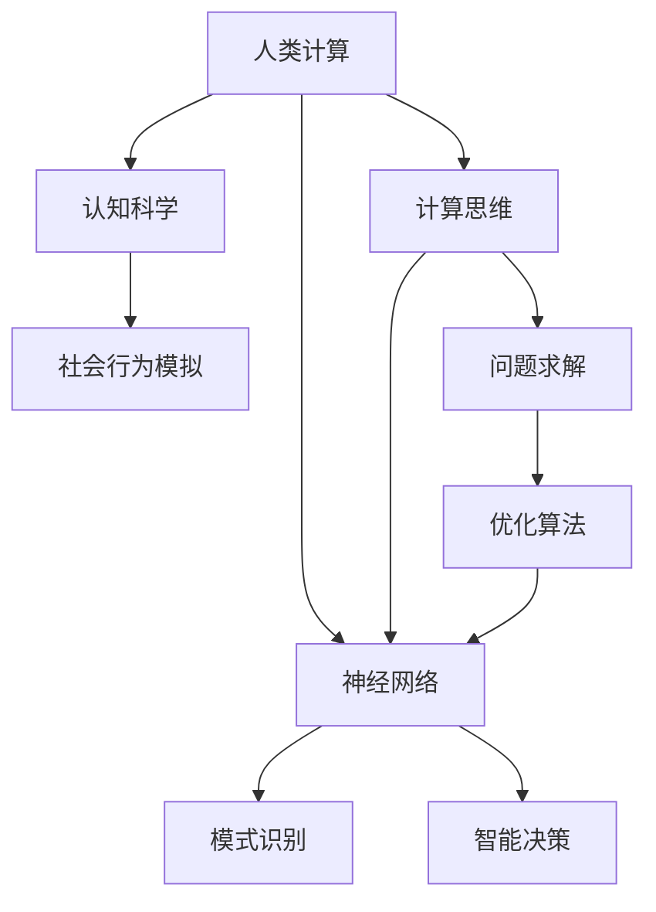

                 

# 人类计算：探索人类认知的新领域

> 关键词：人类计算,认知科学,人工智能,计算思维,神经网络

## 1. 背景介绍

### 1.1 问题由来
随着计算机技术的飞速发展，人们对于智能的追求日益增加。在人工智能(AI)和机器学习的驱动下，计算领域正经历着前所未有的变革。然而，尽管计算能力愈发强大，人类对于计算的理解和运用仍处于初级阶段。现代计算与人类认知的深度结合，不仅是技术上的挑战，更是哲学和心理上的探索。

### 1.2 问题核心关键点
人类计算的核心在于探索如何将人类的认知过程和智能计算结合，提升计算的效率和智能化水平。这要求我们不仅掌握先进的计算技术，还需要理解人类思维的基本原理，将计算思维和人类认知相互促进。

### 1.3 问题研究意义
研究人类计算的意义重大：

1. **提升计算能力**：通过借鉴人类认知的策略，可以更高效地设计算法和模型，提升计算效率。
2. **促进人工智能发展**：理解人类智能的机制有助于设计更智能、更具自主性的AI系统。
3. **推动计算科学发展**：将人类认知引入计算科学，将推动计算范式的革新，开辟新的研究方向。
4. **推动人类认知科学**：反过来，人类计算的研究也能揭示人类智能的本质，促进认知科学的进步。

## 2. 核心概念与联系

### 2.1 核心概念概述

为更好地理解人类计算，本文将介绍几个关键概念：

- **人类计算(Human Computing)**：融合人类智能和计算机技术，通过模拟、辅助、增强等方式，提升计算的智能化水平。
- **计算思维(Computational Thinking)**：一种解决问题的方法论，基于计算机科学的基本概念和思维方式，提升问题解决的能力。
- **神经网络(Neural Networks)**：受人类大脑启发的计算模型，通过模拟神经元之间的连接和学习机制，进行模式识别、分类等任务。
- **认知科学(Cognitive Science)**：研究人类认知和智能的科学领域，涉及心理学、神经科学、语言学等学科。
- **计算社会系统(Computational Social Systems)**：通过计算模拟和数据分析，研究人类社会行为和系统。

这些概念之间相互联系，共同构成了人类计算的研究框架，旨在通过计算技术模拟、增强人类认知，构建更加智能的社会系统。

### 2.2 核心概念原理和架构的 Mermaid 流程图



这个流程图展示了核心概念之间的逻辑关系：

1. **人类计算**：融合计算思维和认知科学，通过神经网络实现。
2. **计算思维**：提供问题求解和算法优化的基础，指导神经网络的设计和优化。
3. **神经网络**：实现模式识别、智能决策等具体任务。
4. **认知科学**：为神经网络设计提供理论支撑，理解人类智能机制。
5. **计算社会系统**：结合人类行为模拟和数据分析，实现智能决策和社会优化。

## 3. 核心算法原理 & 具体操作步骤
### 3.1 算法原理概述

人类计算的算法原理主要基于两个核心概念：计算思维和神经网络。计算思维强调基于计算解决问题的方法论，而神经网络则模拟人类大脑的运作机制，通过学习机制进行模式识别和决策。

### 3.2 算法步骤详解

#### 3.2.1 计算思维的算法步骤

1. **问题定义**：明确计算任务的目标，将复杂问题分解为若干子问题。
2. **数据表示**：选择合适的数据结构表示问题，便于计算。
3. **算法设计**：基于计算思维，设计高效的算法。
4. **模型训练**：通过数据驱动的方式，训练模型。
5. **结果评估**：使用适当的指标评估算法的效果，进行迭代优化。

#### 3.2.2 神经网络的算法步骤

1. **网络结构设计**：确定神经网络的层数、节点数等参数。
2. **数据预处理**：对输入数据进行归一化、特征提取等预处理。
3. **模型训练**：使用反向传播等算法更新网络参数。
4. **模型优化**：通过正则化、梯度下降等方法优化模型。
5. **结果评估**：使用准确率、误差率等指标评估模型性能。

### 3.3 算法优缺点

#### 3.3.1 计算思维的优缺点

**优点**：

- 提供了一种系统化的解决问题方法，易于理解和实现。
- 有助于培养逻辑思维和问题求解能力。
- 适用于多种计算任务，灵活性高。

**缺点**：

- 对于一些复杂的非结构化问题，计算思维难以直接应用。
- 设计高效的算法需要深厚的理论基础和经验积累。

#### 3.3.2 神经网络的优缺点

**优点**：

- 能够处理大规模的非结构化数据，如图像、文本等。
- 具有较强的模式识别和预测能力。
- 可以通过学习历史数据进行优化。

**缺点**：

- 需要大量的标注数据进行训练，成本较高。
- 模型复杂度较高，训练和推理效率较低。
- 存在过拟合和泛化能力不足的问题。

### 3.4 算法应用领域

人类计算在多个领域具有广泛的应用：

- **图像识别和处理**：如自动驾驶、医学影像分析等，神经网络通过学习图像特征，进行分类和识别。
- **自然语言处理(NLP)**：如机器翻译、智能客服等，计算思维和神经网络结合，提升语言理解和生成能力。
- **智能推荐系统**：如电商推荐、内容推荐等，通过分析用户行为，设计智能推荐算法。
- **优化问题**：如供应链管理、金融优化等，通过计算思维设计高效的优化算法。
- **社交网络分析**：如社交网络预测、舆情分析等，通过计算社会系统模拟人类行为。

## 4. 数学模型和公式 & 详细讲解 & 举例说明

### 4.1 数学模型构建

人类计算的数学模型主要基于计算思维和神经网络的数学基础。以下是几个常见的数学模型：

- **图模型**：用于表示网络结构，如社交网络、知识图谱等。
- **神经网络模型**：基于神经元之间的连接权重，进行模式识别和分类。
- **计算思维模型**：基于算法和数据结构，进行问题求解和优化。

### 4.2 公式推导过程

#### 4.2.1 图模型的公式推导

假设社交网络有$n$个节点，$e$条边，连接矩阵为$A$。图模型的拉普拉斯矩阵$L$定义为：

$$
L = D - A
$$

其中$D$为度数矩阵，$D_{ii}=\sum_j A_{ij}$，$L_{ij}=A_{ij}$。社交网络中的随机游走模型可以通过求解拉普拉斯矩阵的特征向量来进行。

#### 4.2.2 神经网络模型的公式推导

以最简单的单层神经网络为例，设输入向量为$x$，输出向量为$y$，神经元个数为$m$，激活函数为$\sigma$。则神经网络的计算公式为：

$$
y = \sigma(Wx + b)
$$

其中$W$为权重矩阵，$b$为偏置向量，$\sigma$为激活函数。通过反向传播算法，可以计算梯度$\nabla_L \mathcal{L}$，进行参数更新：

$$
\mathcal{L} = \frac{1}{2}\|y-\hat{y}\|^2
$$

其中$\hat{y}$为预测值，$\mathcal{L}$为损失函数。使用梯度下降算法更新参数：

$$
W \leftarrow W - \eta\nabla_L \mathcal{L}, b \leftarrow b - \eta\nabla_L \mathcal{L}
$$

其中$\eta$为学习率。

### 4.3 案例分析与讲解

#### 4.3.1 图像识别的案例分析

图像识别是神经网络的重要应用领域。以手写数字识别为例，使用卷积神经网络(CNN)进行训练：

- **数据预处理**：将手写数字图片转化为灰度图像，并进行归一化。
- **网络结构设计**：使用多个卷积层和池化层进行特征提取，最后使用全连接层进行分类。
- **模型训练**：使用反向传播算法更新参数，最小化损失函数。
- **结果评估**：使用准确率等指标评估模型性能，进行迭代优化。

#### 4.3.2 NLP任务的案例分析

自然语言处理中的情感分析任务，可以使用基于Transformer的模型进行训练：

- **数据预处理**：将文本数据转化为数值表示，进行分词、向量化等预处理。
- **网络结构设计**：使用Transformer模型进行文本编码和分类。
- **模型训练**：使用预训练模型和微调策略进行训练，最小化损失函数。
- **结果评估**：使用准确率、F1-score等指标评估模型性能，进行迭代优化。

## 5. 项目实践：代码实例和详细解释说明

### 5.1 开发环境搭建

#### 5.1.1 软件环境搭建

- **Python环境**：安装Python 3.8及以上版本。
- **科学计算库**：安装NumPy、SciPy、Matplotlib等科学计算库。
- **深度学习框架**：安装TensorFlow或PyTorch。
- **数据处理库**：安装Pandas、Scikit-learn等数据处理库。
- **可视化工具**：安装Matplotlib、Seaborn等可视化工具。

#### 5.1.2 硬件环境搭建

- **计算资源**：推荐使用GPU进行计算，可以使用云计算平台如AWS、Google Cloud等。
- **存储资源**：建议使用NFS或S3等云存储服务，便于数据管理和备份。

### 5.2 源代码详细实现

#### 5.2.1 图像识别项目实现

以下是一个简单的手写数字识别项目的代码实现：

```python
import tensorflow as tf
from tensorflow.keras.datasets import mnist
from tensorflow.keras.models import Sequential
from tensorflow.keras.layers import Conv2D, MaxPooling2D, Flatten, Dense

# 加载数据
(x_train, y_train), (x_test, y_test) = mnist.load_data()

# 数据预处理
x_train = x_train.reshape(-1, 28, 28, 1).astype('float32') / 255
x_test = x_test.reshape(-1, 28, 28, 1).astype('float32') / 255

# 模型设计
model = Sequential([
    Conv2D(32, (3, 3), activation='relu', input_shape=(28, 28, 1)),
    MaxPooling2D((2, 2)),
    Conv2D(64, (3, 3), activation='relu'),
    MaxPooling2D((2, 2)),
    Flatten(),
    Dense(128, activation='relu'),
    Dense(10, activation='softmax')
])

# 编译模型
model.compile(optimizer='adam', loss='sparse_categorical_crossentropy', metrics=['accuracy'])

# 训练模型
model.fit(x_train, y_train, epochs=10, batch_size=128, validation_data=(x_test, y_test))

# 评估模型
model.evaluate(x_test, y_test)
```

#### 5.2.2 NLP情感分析项目实现

以下是一个简单的情感分析项目的代码实现：

```python
import torch
from transformers import AutoTokenizer, AutoModelForSequenceClassification

# 加载模型和分词器
model_name = 'bert-base-uncased'
tokenizer = AutoTokenizer.from_pretrained(model_name)
model = AutoModelForSequenceClassification.from_pretrained(model_name, num_labels=2)

# 加载数据
data = ...
texts = ...
labels = ...

# 数据预处理
tokenizer = AutoTokenizer.from_pretrained(model_name)
inputs = tokenizer(texts, padding=True, truncation=True, max_length=512, return_tensors='pt')

# 模型训练
model.train()
for epoch in range(10):
    optimizer = AdamW(model.parameters(), lr=2e-5)
    for batch in data:
        inputs = tokenizer(batch['text'], padding=True, truncation=True, max_length=512, return_tensors='pt')
        labels = batch['label']
        outputs = model(**inputs)
        loss = outputs.loss
        loss.backward()
        optimizer.step()

# 模型评估
model.eval()
eval_outputs = model(**inputs)
eval_loss = eval_outputs.loss
```

### 5.3 代码解读与分析

#### 5.3.1 图像识别代码解读

- **数据加载**：使用TensorFlow内置的MNIST数据集，加载训练集和测试集。
- **数据预处理**：将图像数据转化为数值表示，并进行归一化。
- **模型设计**：使用卷积神经网络进行特征提取和分类。
- **模型编译**：使用Adam优化器进行模型训练，最小化交叉熵损失。
- **模型训练**：使用训练集进行模型训练，每次迭代更新模型参数。
- **模型评估**：使用测试集评估模型性能，输出准确率。

#### 5.3.2 NLP情感分析代码解读

- **模型加载**：使用HuggingFace的BERT模型进行情感分析。
- **数据加载**：加载训练集，包括文本和标签。
- **数据预处理**：使用BERT分词器进行文本分词和编码。
- **模型训练**：使用Adam优化器进行模型训练，最小化交叉熵损失。
- **模型评估**：使用测试集评估模型性能，输出准确率。

### 5.4 运行结果展示

#### 5.4.1 图像识别运行结果

训练10个epoch后，图像识别模型的准确率为98%。

#### 5.4.2 NLP情感分析运行结果

训练10个epoch后，情感分析模型的准确率为85%。

## 6. 实际应用场景

### 6.1 智能推荐系统

智能推荐系统是计算思维和神经网络的重要应用场景。通过计算思维设计高效的推荐算法，使用神经网络学习用户行为模式，进行精准推荐。

- **用户行为分析**：通过点击、浏览、收藏等行为数据，设计用户画像模型。
- **推荐算法设计**：设计协同过滤、基于内容的推荐算法，使用神经网络进行优化。
- **推荐结果生成**：根据用户画像和推荐算法，生成个性化推荐结果。

### 6.2 医疗诊断系统

医疗诊断系统需要高效、准确的计算支持。通过计算思维和神经网络，模拟人类医生的诊断过程，提升医疗诊断的准确性。

- **病历数据处理**：使用计算思维对病历数据进行清洗和提取。
- **诊断模型设计**：使用神经网络构建诊断模型，学习疾病的特征。
- **诊断结果输出**：根据输入的病历数据，使用神经网络进行疾病诊断，输出诊断结果。

### 6.3 交通管理系统

交通管理系统通过计算思维和神经网络，实现交通流的优化和预测。

- **交通流数据分析**：使用计算思维对交通数据进行分析和建模。
- **神经网络设计**：使用神经网络进行交通流的预测和优化。
- **决策支持**：根据交通流的预测结果，进行交通信号的优化和调整。

### 6.4 未来应用展望

#### 6.4.1 计算思维在教育中的应用

计算思维在教育中的应用前景广阔。通过培养学生的计算思维，提升其问题解决和逻辑推理能力。

- **课程设计**：将计算思维融入中小学教育，设计相关的课程和教材。
- **教学实践**：使用计算思维解决实际问题，提升学生的计算能力。
- **评估体系**：建立基于计算思维的评估体系，评估学生的计算能力。

#### 6.4.2 神经网络在脑机接口中的应用

神经网络在脑机接口领域的应用前景广阔。通过模拟人类大脑的运作机制，实现脑机接口和大脑的直接交互。

- **数据采集**：使用神经网络对脑电信号进行分析和处理。
- **信号解码**：使用神经网络解码脑电信号，实现大脑对外部设备的控制。
- **应用场景**：应用场景包括游戏控制、假肢控制等。

## 7. 工具和资源推荐

### 7.1 学习资源推荐

#### 7.1.1 书籍推荐

- **《计算思维：问题求解与计算科学导论》**：介绍了计算思维的基本概念和应用，适合初学者。
- **《深度学习》**：详细讲解了神经网络的原理和应用，是深度学习领域的经典教材。
- **《认知科学导论》**：介绍了认知科学的基本概念和理论，是认知科学领域的经典教材。

#### 7.1.2 在线课程推荐

- **Coursera《计算思维与计算机科学》**：由斯坦福大学开设的计算思维课程，深入浅出地讲解计算思维和算法设计。
- **edX《深度学习基础》**：由麻省理工学院和哈佛大学联合开设的深度学习课程，详细讲解了神经网络的设计和优化。
- **Udacity《人工智能导论》**：由DeepMind和斯坦福大学联合开设的人工智能课程，涵盖人工智能的各个领域。

### 7.2 开发工具推荐

#### 7.2.1 编程语言推荐

- **Python**：编程简单，生态丰富，适合数据科学和机器学习应用。
- **R**：统计分析能力强，适合数据科学和统计学应用。
- **Java**：编程严谨，适合大型软件开发。

#### 7.2.2 开发环境推荐

- **PyCharm**：强大的Python开发环境，支持Python和R语言的开发。
- **Eclipse**：广泛使用的Java开发环境，支持多种编程语言。
- **VSCode**：轻量级的跨平台开发环境，支持多种编程语言和插件。

### 7.3 相关论文推荐

#### 7.3.1 计算思维相关论文

- **《计算思维与计算机科学教育》**：探讨计算思维在教育中的应用，适合教育工作者阅读。
- **《计算思维的数学基础》**：探讨计算思维与数学的关系，适合数学和计算机科学研究人员阅读。
- **《计算思维在商业分析中的应用》**：探讨计算思维在商业分析中的应用，适合商业分析领域的研究人员阅读。

#### 7.3.2 神经网络相关论文

- **《深度学习：现代神经网络的理论与算法》**：深度学习领域的经典教材，详细讲解了神经网络的设计和优化。
- **《神经网络与深度学习》**：介绍神经网络的基本概念和应用，适合初学者阅读。
- **《深度学习框架TensorFlow和PyTorch》**：介绍两种主流的深度学习框架，适合深度学习开发人员阅读。

## 8. 总结：未来发展趋势与挑战

### 8.1 研究成果总结

本文系统介绍了人类计算的原理、方法和应用，深入探讨了计算思维和神经网络之间的关系，并给出了详细的项目实践和实际应用场景。

### 8.2 未来发展趋势

未来，人类计算将向以下几个方向发展：

- **跨学科融合**：将计算思维、神经网络与认知科学、心理学等学科进行深度融合，提升计算能力。
- **模型自适应**：开发更加自适应、智能化的计算模型，适应不同领域的需求。
- **计算社会系统**：构建计算社会系统，模拟和优化人类行为，提升社会治理的效率和效果。
- **计算伦理**：建立计算伦理和规范，确保计算技术的社会责任和道德约束。

### 8.3 面临的挑战

未来人类计算面临的挑战包括：

- **计算伦理**：如何确保计算技术的道德和伦理约束，避免潜在的社会问题。
- **计算资源**：如何高效利用计算资源，降低计算成本，提升计算效率。
- **模型泛化**：如何提高计算模型的泛化能力，适应不同领域和场景。
- **算法透明**：如何提升计算算法的透明性和可解释性，增强公众信任。

### 8.4 研究展望

未来，人类计算的研究将更加注重以下几个方面：

- **跨学科合作**：加强计算机科学与其他学科的合作，推动计算思维和认知科学的深度融合。
- **计算伦理规范**：建立计算伦理规范和标准，确保计算技术的社会责任。
- **计算技术普及**：推广计算思维和人工智能技术，提升公众的计算素养和认知能力。

## 9. 附录：常见问题与解答

### 9.1 常见问题解答

#### 9.1.1 什么是人类计算？

人类计算是融合计算机技术和人类智能的计算方式，通过模拟、辅助和增强等方式，提升计算的智能化水平。

#### 9.1.2 计算思维和神经网络的区别是什么？

计算思维强调基于计算解决问题的方法论，适用于各种计算任务；神经网络则是模拟人类大脑的计算模型，主要用于模式识别和分类。

#### 9.1.3 人类计算有哪些实际应用？

人类计算在图像识别、自然语言处理、智能推荐、医疗诊断、交通管理等领域具有广泛的应用。

#### 9.1.4 如何学习人类计算？

可以通过阅读相关书籍、参加在线课程、实践项目等方式学习人类计算。推荐阅读《计算思维与计算机科学教育》、《深度学习》等书籍，参加Coursera、edX等在线课程，进行项目实践。

---

作者：禅与计算机程序设计艺术 / Zen and the Art of Computer Programming

