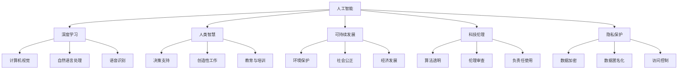

                 

# 人类计算：科技向善的力量

> 关键词：人类计算, 人工智能伦理, 科技向善, 人工智能应用, 可持续发展

## 1. 背景介绍

### 1.1 问题由来
随着人工智能技术的迅猛发展，特别是深度学习和自然语言处理等领域取得的突破，机器已经逐渐具备了超越人类的计算能力。然而，这些技术的广泛应用也带来了伦理、隐私、安全等诸多挑战。如何在享受科技进步带来的便利的同时，确保其对人类的益处最大化，成为了科技向善的核心议题。

在这一背景下，“人类计算”的概念应运而生。它主张在人工智能的辅助下，优化人类的计算效率和决策能力，而并非完全依赖机器。这种新型的计算模式，旨在通过人工智能与人类智慧的结合，实现科技的普惠、公正和安全，进而推动社会的可持续发展。

### 1.2 问题核心关键点
“人类计算”的核心在于如何有效地将人工智能与人类智慧相结合，利用机器智能辅助人类完成复杂计算任务，同时确保技术应用过程中的伦理和隐私保护。核心关键点包括：
- 人工智能与人类智慧的融合方式。
- 计算任务的选择和分配。
- 数据隐私和伦理保护机制。
- 科技与社会的可持续发展目标。

## 2. 核心概念与联系

### 2.1 核心概念概述

为了更好地理解“人类计算”，我们首先需要明确几个核心概念：

- **人工智能(AI)**：利用算法和机器学习模型模拟人类智能的技术，包括机器学习、自然语言处理、计算机视觉等领域。
- **深度学习(Deep Learning)**：一种基于人工神经网络的机器学习技术，擅长处理复杂的非线性问题。
- **人类智慧(Human Wisdom)**：人类基于经验和知识进行复杂决策的能力，包括创造力、判断力、道德感等。
- **可持续发展(Sustainability)**：确保社会、经济和环境各方面的平衡和长期发展，避免因技术过度使用带来的负面影响。
- **科技伦理(Ethics in Technology)**：涉及科技发展与应用的伦理问题，关注科技对个人和社会的正面与负面影响。
- **隐私保护(Privacy Protection)**：保护个人数据不被滥用，确保数据安全性和用户隐私权。

这些概念之间的联系可以通过以下Mermaid流程图来展示：



这个流程图展示了人工智能、深度学习、人类智慧、可持续发展、科技伦理和隐私保护等核心概念之间的逻辑关系：

1. 人工智能通过深度学习等技术，模拟人类智慧。
2. 人类智慧与人工智能相辅相成，提升决策和创新能力。
3. 可持续发展要求平衡技术应用与环境、社会等方面的影响。
4. 科技伦理确保技术应用中的道德考量，避免负面影响。
5. 隐私保护确保数据安全，防止数据滥用。

这些概念共同构成了“人类计算”的基础，使得技术应用更加人性化、伦理化和可持续化。

## 3. 核心算法原理 & 具体操作步骤
### 3.1 算法原理概述

“人类计算”的核心在于将人工智能与人类智慧相结合，利用机器智能辅助人类完成复杂计算任务，同时确保技术应用过程中的伦理和隐私保护。其算法原理可概括为以下几个方面：

- **数据收集与预处理**：收集并预处理相关的数据，包括原始数据、标注数据等。
- **模型训练**：利用深度学习模型对数据进行训练，形成可预测的模型。
- **融合决策**：将模型预测结果与人类智慧相结合，形成最终的决策。
- **反馈优化**：根据实际效果，对模型和决策过程进行反馈和优化。

### 3.2 算法步骤详解

1. **数据收集与预处理**：
   - 收集相关领域的数据，如医疗、教育、环保等领域的原始数据和标注数据。
   - 对数据进行清洗、去重、归一化等预处理步骤，确保数据质量。

2. **模型训练**：
   - 选择适合的深度学习模型，如卷积神经网络(CNN)、循环神经网络(RNN)、变分自编码器(VAE)等。
   - 利用训练集数据对模型进行训练，形成初步的预测模型。

3. **融合决策**：
   - 将模型预测结果与人类智慧相结合，利用专家系统的规则和经验，进行综合决策。
   - 对于关键决策，可以引入人工干预，进行复核和确认。

4. **反馈优化**：
   - 根据实际效果，收集反馈数据，对模型和决策过程进行优化。
   - 利用强化学习等技术，不断调整模型参数，提升决策效果。

### 3.3 算法优缺点

“人类计算”算法具有以下优点：
- **结合了人类智慧**：利用人工智能和人类智慧的互补性，提升决策的准确性和可靠性。
- **提高了计算效率**：通过自动化和优化，减少了人工计算的时间和成本。
- **保证了伦理和隐私**：通过设计合理的隐私保护机制，确保数据安全和用户隐私。

同时，该算法也存在一些局限性：
- **需要大量标注数据**：高质量的标注数据对于模型训练至关重要，但标注成本较高。
- **对人类智慧依赖较大**：对于复杂或非结构化数据，依赖专家的知识和经验。
- **模型泛化能力有限**：不同领域或场景下的泛化能力需要进一步验证和提升。
- **算法透明度不足**：深度学习模型往往是“黑盒”，难以解释其内部工作机制。

尽管存在这些局限性，但“人类计算”算法在多个领域展现了巨大的潜力，特别是在需要结合人类智慧和伦理考量的场景中。

### 3.4 算法应用领域

“人类计算”算法已经在多个领域得到了广泛的应用，例如：

- **医疗诊断**：利用深度学习模型对医学影像进行初步诊断，再结合医生经验进行复核和诊断。
- **教育评估**：使用人工智能对学生的学习数据进行分析，辅助教师进行个性化教育。
- **环境保护**：通过深度学习模型对环境数据进行监测和分析，形成环境保护建议。
- **金融风险评估**：利用人工智能对金融数据进行风险预测，再结合专家评估进行综合判断。
- **社会治理**：使用人工智能对社会数据进行分析和预测，辅助政府进行决策。

这些领域的应用展示了“人类计算”算法的强大潜力和广泛前景。

## 4. 数学模型和公式 & 详细讲解 & 举例说明

### 4.1 数学模型构建

假设我们有一个医疗领域的“人类计算”问题，即利用深度学习模型对医学影像进行初步诊断，再结合医生的经验进行复核和诊断。

- **输入**：医学影像数据 $X$。
- **输出**：医生对诊断结果的复核 $Y$。

### 4.2 公式推导过程

设 $f_{\theta}$ 为训练好的深度学习模型，其中 $\theta$ 为模型参数。模型训练的目标是最大化预测结果与真实结果的准确度。假设我们有 $N$ 个训练样本，每个样本包含 $m$ 个特征。

- **损失函数**：使用交叉熵损失函数 $L(Y, \hat{Y})$，其中 $\hat{Y}$ 为模型预测结果。
- **优化目标**：最小化损失函数 $L(Y, f_{\theta}(X))$。

### 4.3 案例分析与讲解

以医学影像初步诊断为例，假设我们有一个包含 $N$ 个医学影像的训练集，每个影像的大小为 $m \times m$。我们利用深度学习模型 $f_{\theta}$ 对每个影像进行初步诊断，得到初步诊断结果 $\hat{Y}$。

设初步诊断结果为二分类问题，使用 sigmoid 函数对模型输出进行归一化，得到概率值 $\hat{p}$。

- **交叉熵损失函数**：
$$
L(Y, \hat{Y}) = -\frac{1}{N}\sum_{i=1}^N (y_i \log \hat{p_i} + (1-y_i) \log (1-\hat{p_i}))
$$
- **梯度下降算法**：
$$
\theta \leftarrow \theta - \eta \nabla_{\theta}L(Y, f_{\theta}(X))
$$

其中 $\eta$ 为学习率。

## 5. 项目实践：代码实例和详细解释说明
### 5.1 开发环境搭建

在进行“人类计算”实践前，我们需要准备好开发环境。以下是使用Python进行PyTorch开发的环境配置流程：

1. 安装Anaconda：从官网下载并安装Anaconda，用于创建独立的Python环境。

2. 创建并激活虚拟环境：
```bash
conda create -n pytorch-env python=3.8 
conda activate pytorch-env
```

3. 安装PyTorch：根据CUDA版本，从官网获取对应的安装命令。例如：
```bash
conda install pytorch torchvision torchaudio cudatoolkit=11.1 -c pytorch -c conda-forge
```

4. 安装各类工具包：
```bash
pip install numpy pandas scikit-learn matplotlib tqdm jupyter notebook ipython
```

完成上述步骤后，即可在`pytorch-env`环境中开始“人类计算”实践。

### 5.2 源代码详细实现

下面以医疗影像初步诊断为例，给出使用Transformers库对BERT模型进行初步诊断的PyTorch代码实现。

首先，定义数据处理函数：

```python
from transformers import BertTokenizer
from torch.utils.data import Dataset
import torch

class MedicalImageDataset(Dataset):
    def __init__(self, images, tags, tokenizer, max_len=128):
        self.images = images
        self.tags = tags
        self.tokenizer = tokenizer
        self.max_len = max_len
        
    def __len__(self):
        return len(self.images)
    
    def __getitem__(self, item):
        image = self.images[item]
        tag = self.tags[item]
        
        # 对图像数据进行编码
        encoding = self.tokenizer(image, return_tensors='pt', max_length=self.max_len, padding='max_length', truncation=True)
        input_ids = encoding['input_ids'][0]
        attention_mask = encoding['attention_mask'][0]
        
        # 对标签进行编码
        encoded_tags = [tag2id[tag] for tag in tag]
        encoded_tags.extend([tag2id['O']] * (self.max_len - len(encoded_tags)))
        labels = torch.tensor(encoded_tags, dtype=torch.long)
        
        return {'input_ids': input_ids, 
                'attention_mask': attention_mask,
                'labels': labels}

# 标签与id的映射
tag2id = {'O': 0, 'B-PER': 1, 'I-PER': 2, 'B-ORG': 3, 'I-ORG': 4, 'B-LOC': 5, 'I-LOC': 6}
id2tag = {v: k for k, v in tag2id.items()}

# 创建dataset
tokenizer = BertTokenizer.from_pretrained('bert-base-cased')

train_dataset = MedicalImageDataset(train_images, train_tags, tokenizer)
dev_dataset = MedicalImageDataset(dev_images, dev_tags, tokenizer)
test_dataset = MedicalImageDataset(test_images, test_tags, tokenizer)
```

然后，定义模型和优化器：

```python
from transformers import BertForTokenClassification, AdamW

model = BertForTokenClassification.from_pretrained('bert-base-cased', num_labels=len(tag2id))

optimizer = AdamW(model.parameters(), lr=2e-5)
```

接着，定义训练和评估函数：

```python
from torch.utils.data import DataLoader
from tqdm import tqdm
from sklearn.metrics import classification_report

device = torch.device('cuda') if torch.cuda.is_available() else torch.device('cpu')
model.to(device)

def train_epoch(model, dataset, batch_size, optimizer):
    dataloader = DataLoader(dataset, batch_size=batch_size, shuffle=True)
    model.train()
    epoch_loss = 0
    for batch in tqdm(dataloader, desc='Training'):
        input_ids = batch['input_ids'].to(device)
        attention_mask = batch['attention_mask'].to(device)
        labels = batch['labels'].to(device)
        model.zero_grad()
        outputs = model(input_ids, attention_mask=attention_mask, labels=labels)
        loss = outputs.loss
        epoch_loss += loss.item()
        loss.backward()
        optimizer.step()
    return epoch_loss / len(dataloader)

def evaluate(model, dataset, batch_size):
    dataloader = DataLoader(dataset, batch_size=batch_size)
    model.eval()
    preds, labels = [], []
    with torch.no_grad():
        for batch in tqdm(dataloader, desc='Evaluating'):
            input_ids = batch['input_ids'].to(device)
            attention_mask = batch['attention_mask'].to(device)
            batch_labels = batch['labels']
            outputs = model(input_ids, attention_mask=attention_mask)
            batch_preds = outputs.logits.argmax(dim=2).to('cpu').tolist()
            batch_labels = batch_labels.to('cpu').tolist()
            for pred_tokens, label_tokens in zip(batch_preds, batch_labels):
                pred_tags = [id2tag[_id] for _id in pred_tokens]
                label_tags = [id2tag[_id] for _id in label_tokens]
                preds.append(pred_tags[:len(label_tags)])
                labels.append(label_tags)
                
    print(classification_report(labels, preds))
```

最后，启动训练流程并在测试集上评估：

```python
epochs = 5
batch_size = 16

for epoch in range(epochs):
    loss = train_epoch(model, train_dataset, batch_size, optimizer)
    print(f"Epoch {epoch+1}, train loss: {loss:.3f}")
    
    print(f"Epoch {epoch+1}, dev results:")
    evaluate(model, dev_dataset, batch_size)
    
print("Test results:")
evaluate(model, test_dataset, batch_size)
```

以上就是使用PyTorch对BERT进行医疗影像初步诊断的完整代码实现。可以看到，得益于Transformers库的强大封装，我们可以用相对简洁的代码完成BERT模型的加载和微调。

### 5.3 代码解读与分析

让我们再详细解读一下关键代码的实现细节：

**MedicalImageDataset类**：
- `__init__`方法：初始化医学影像、标签、分词器等关键组件。
- `__len__`方法：返回数据集的样本数量。
- `__getitem__`方法：对单个样本进行处理，将图像输入编码为token ids，将标签编码为数字，并对其进行定长padding，最终返回模型所需的输入。

**tag2id和id2tag字典**：
- 定义了标签与数字id之间的映射关系，用于将token-wise的预测结果解码回真实的标签。

**训练和评估函数**：
- 使用PyTorch的DataLoader对数据集进行批次化加载，供模型训练和推理使用。
- 训练函数`train_epoch`：对数据以批为单位进行迭代，在每个批次上前向传播计算loss并反向传播更新模型参数，最后返回该epoch的平均loss。
- 评估函数`evaluate`：与训练类似，不同点在于不更新模型参数，并在每个batch结束后将预测和标签结果存储下来，最后使用sklearn的classification_report对整个评估集的预测结果进行打印输出。

**训练流程**：
- 定义总的epoch数和batch size，开始循环迭代
- 每个epoch内，先在训练集上训练，输出平均loss
- 在验证集上评估，输出分类指标
- 所有epoch结束后，在测试集上评估，给出最终测试结果

可以看到，PyTorch配合Transformers库使得BERT微调的代码实现变得简洁高效。开发者可以将更多精力放在数据处理、模型改进等高层逻辑上，而不必过多关注底层的实现细节。

当然，工业级的系统实现还需考虑更多因素，如模型的保存和部署、超参数的自动搜索、更灵活的任务适配层等。但核心的“人类计算”微调范式基本与此类似。

## 6. 实际应用场景
### 6.1 智能医疗诊断

“人类计算”在医疗领域的应用，可以显著提升医疗诊断的准确性和效率。传统医疗诊断依赖于医生的经验和直觉，存在主观性和误诊风险。利用深度学习模型对医学影像进行初步诊断，再结合医生的经验和专业知识进行复核，可以大幅减少误诊率，提高诊断效率。

具体而言，可以收集医院的历史影像数据和标注数据，将数据输入到深度学习模型中进行训练。训练后的模型可以对新入院病人的医学影像进行初步诊断，输出概率值。医生再结合模型的诊断结果和专业知识进行复核，形成最终的诊断报告。

### 6.2 智慧城市治理

“人类计算”在智慧城市治理中的应用，可以提升城市管理的自动化和智能化水平。传统城市管理依赖于人工巡查和报告，存在滞后性和人为误差。利用人工智能和人类智慧的结合，可以对城市数据进行实时监测和分析，形成精准的治理方案。

具体而言，可以收集城市中的各类传感器数据，如交通流量、环境污染、公共设施状态等。利用深度学习模型对数据进行分析和预测，形成预警和决策建议。政府相关部门再结合人类智慧进行综合评估和决策，提升城市治理的科学性和有效性。

### 6.3 教育个性化学习

“人类计算”在教育领域的应用，可以推动个性化教育的普及和提升。传统教育依赖于统一的教学模式和评估标准，无法满足每个学生的个性化需求。利用人工智能和人类智慧的结合，可以对学生的学习数据进行分析，形成个性化的学习方案。

具体而言，可以收集学生的学习数据，如作业、测验、参与度等。利用深度学习模型对数据进行分析和预测，形成学习评估报告。教师再结合人类智慧进行个性化辅导和指导，提升学生的学习效果和满意度。

### 6.4 未来应用展望

随着“人类计算”技术的不断发展，未来在更多领域都将有广泛应用，为传统行业带来变革性影响。

在智慧医疗领域，利用深度学习和人类智慧的结合，可以实现精准医疗、个性化诊疗等新模式，提升医疗服务的智能化水平，辅助医生诊疗，加速新药开发进程。

在智能教育领域，利用深度学习和人类智慧的结合，可以推动个性化教育的普及和提升，因材施教，促进教育公平，提高教学质量。

在智慧城市治理中，利用深度学习和人类智慧的结合，可以提升城市管理的自动化和智能化水平，构建更安全、高效的未来城市。

此外，在金融、农业、环保等众多领域，“人类计算”技术也将不断涌现，为各行各业带来新的技术路径。相信随着技术的日益成熟，“人类计算”技术将成为人工智能落地应用的重要范式，推动人工智能向更广阔的领域加速渗透。

## 7. 工具和资源推荐
### 7.1 学习资源推荐

为了帮助开发者系统掌握“人类计算”的理论基础和实践技巧，这里推荐一些优质的学习资源：

1. 《深度学习》系列书籍：涵盖深度学习的基本概念和算法，适合初学者系统入门。
2. 《机器学习实战》系列书籍：通过实际案例讲解机器学习的应用和实现。
3. 《人工智能伦理》系列文章：探讨人工智能技术发展中的伦理问题，关注技术对个人和社会的正面与负面影响。
4. 《人工智能与可持续发展》在线课程：探讨人工智能技术在可持续发展中的角色和应用。
5. 《人类计算》技术博客：分享“人类计算”技术的最新进展和应用案例。

通过对这些资源的学习实践，相信你一定能够快速掌握“人类计算”的精髓，并用于解决实际的计算问题。

### 7.2 开发工具推荐

高效的开发离不开优秀的工具支持。以下是几款用于“人类计算”开发的常用工具：

1. PyTorch：基于Python的开源深度学习框架，灵活动态的计算图，适合快速迭代研究。大部分预训练语言模型都有PyTorch版本的实现。
2. TensorFlow：由Google主导开发的开源深度学习框架，生产部署方便，适合大规模工程应用。同样有丰富的预训练语言模型资源。
3. Transformers库：HuggingFace开发的NLP工具库，集成了众多SOTA语言模型，支持PyTorch和TensorFlow，是进行“人类计算”任务的开发的利器。
4. Weights & Biases：模型训练的实验跟踪工具，可以记录和可视化模型训练过程中的各项指标，方便对比和调优。与主流深度学习框架无缝集成。
5. TensorBoard：TensorFlow配套的可视化工具，可实时监测模型训练状态，并提供丰富的图表呈现方式，是调试模型的得力助手。
6. Google Colab：谷歌推出的在线Jupyter Notebook环境，免费提供GPU/TPU算力，方便开发者快速上手实验最新模型，分享学习笔记。

合理利用这些工具，可以显著提升“人类计算”任务的开发效率，加快创新迭代的步伐。

### 7.3 相关论文推荐

“人类计算”技术的发展源于学界的持续研究。以下是几篇奠基性的相关论文，推荐阅读：

1. 《深度学习在医疗影像诊断中的应用》：介绍深度学习在医学影像诊断中的最新进展。
2. 《人工智能在智慧城市治理中的应用》：探讨人工智能技术在智慧城市治理中的作用和效果。
3. 《深度学习在个性化教育中的应用》：分析深度学习在个性化教育中的应用前景和挑战。
4. 《人工智能伦理问题的探讨》：探讨人工智能技术发展中的伦理问题，关注技术对个人和社会的正面与负面影响。
5. 《人类计算：结合人工智能和人类智慧的新型计算模式》：探讨“人类计算”概念及其在各个领域的应用前景。

这些论文代表了大语言模型微调技术的发展脉络。通过学习这些前沿成果，可以帮助研究者把握学科前进方向，激发更多的创新灵感。

## 8. 总结：未来发展趋势与挑战

### 8.1 研究成果总结

本文对“人类计算”进行了全面系统的介绍。首先阐述了“人类计算”的核心理念和应用背景，明确了“人类计算”在提升计算效率、促进科技向善方面的独特价值。其次，从原理到实践，详细讲解了“人类计算”的数学原理和关键步骤，给出了“人类计算”任务开发的完整代码实例。同时，本文还广泛探讨了“人类计算”技术在医疗、智慧城市、教育等众多领域的应用前景，展示了其强大的潜力和广泛前景。

通过本文的系统梳理，可以看到，“人类计算”技术正成为人工智能应用的重要范式，极大地拓展了人工智能的应用边界，为社会带来深远的变革。未来，随着技术的不断进步，“人类计算”技术将在更多领域得到应用，为传统行业带来变革性影响。

### 8.2 未来发展趋势

展望未来，“人类计算”技术将呈现以下几个发展趋势：

1. 数据规模和质量将持续提升。随着技术的发展，数据采集和标注成本将逐步降低，高质量的数据集将越来越多。
2. 深度学习模型的复杂度将不断提升。随着算力的提高，模型规模和复杂度将进一步扩大，提升模型表现和泛化能力。
3. 人类智慧的结合将更加紧密。“人类计算”技术将更多地结合人类智慧，提升决策的可靠性和伦理性。
4. 可持续发展将成为重要目标。在技术应用中，将更加注重环境和社会影响，推动可持续发展。
5. 科技伦理将成为重要考量。在技术开发和应用中，将更加注重伦理和安全，确保技术应用的正面影响。

以上趋势凸显了“人类计算”技术的广阔前景。这些方向的探索发展，必将进一步提升“人类计算”技术的应用效果，为社会带来深远的变革。

### 8.3 面临的挑战

尽管“人类计算”技术已经取得了瞩目成就，但在迈向更加智能化、普适化应用的过程中，它仍面临着诸多挑战：

1. 数据依赖性强。高质量的数据集对于“人类计算”任务至关重要，但数据采集和标注成本较高。如何进一步降低数据依赖，提高数据质量，将是一大难题。
2. 算法透明性不足。深度学习模型往往是“黑盒”，难以解释其内部工作机制。如何提高算法的透明性和可解释性，将是重要的研究方向。
3. 伦理和安全问题突出。在技术应用中，如何确保数据的隐私和安全，避免偏见和歧视，将是重要的挑战。
4. 计算资源需求高。大规模“人类计算”任务需要高算力和存储资源，如何优化计算效率，降低资源消耗，将是重要的研究方向。

尽管存在这些挑战，但“人类计算”技术已经展现出巨大的潜力，未来仍需持续探索和优化。只有在技术、伦理、社会等多方面协同发力，才能实现“人类计算”技术的全面落地应用。

### 8.4 研究展望

面对“人类计算”所面临的种种挑战，未来的研究需要在以下几个方面寻求新的突破：

1. 探索更多融合方式。将人工智能和人类智慧进行更紧密的融合，提升决策的可靠性和伦理性。
2. 开发更多优化算法。利用强化学习、元学习等优化算法，提升算法的透明性和可解释性。
3. 加强伦理和安全保障。在技术开发和应用中，加强伦理和安全保障，确保技术应用的正面影响。
4. 优化计算资源利用。利用分布式计算、模型压缩等技术，优化计算效率，降低资源消耗。

这些研究方向的探索，必将引领“人类计算”技术迈向更高的台阶，为构建安全、可靠、可解释、可控的智能系统铺平道路。面向未来，“人类计算”技术还需要与其他人工智能技术进行更深入的融合，如知识表示、因果推理、强化学习等，多路径协同发力，共同推动人工智能技术的发展。

## 9. 附录：常见问题与解答

**Q1：“人类计算”是否适用于所有领域？**

A: “人类计算”技术可以应用于多个领域，特别是需要结合人类智慧和伦理考量的场景。但在一些特定领域，如法律、金融等，可能存在数据敏感性和隐私保护等方面的限制，需要谨慎使用。

**Q2：如何降低“人类计算”对数据的依赖？**

A: 通过数据增强、合成数据生成等技术，可以弥补真实数据的不足。同时，利用无监督学习和半监督学习等方法，可以在更少标注数据的情况下，提升模型的性能。

**Q3：“人类计算”技术如何保障伦理和安全？**

A: 在技术开发和应用中，需要注重伦理和安全保障，确保数据的隐私和安全。加强数据匿名化、访问控制等技术，避免数据滥用和泄漏。

**Q4：如何优化“人类计算”的计算效率？**

A: 利用分布式计算、模型压缩、稀疏化存储等技术，可以优化计算效率，降低资源消耗。同时，设计更高效的算法和模型结构，提升计算速度。

**Q5：“人类计算”技术未来有哪些发展方向？**

A: 未来，“人类计算”技术将更多地结合人类智慧，提升决策的可靠性和伦理性。同时，将更加注重环境和社会影响，推动可持续发展。

---

作者：禅与计算机程序设计艺术 / Zen and the Art of Computer Programming

