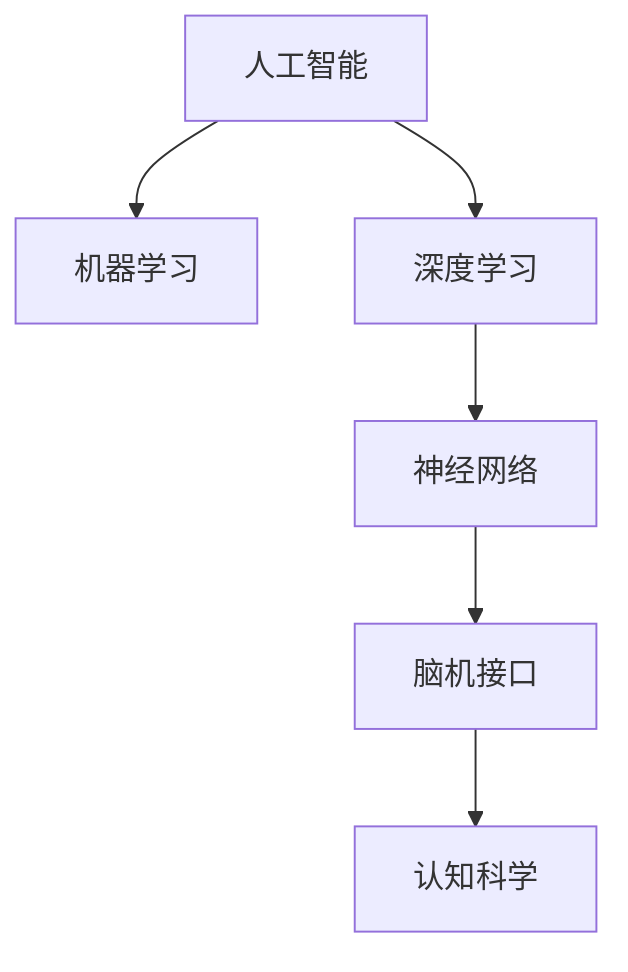

                 

# 人类认知：AI 时代的进步

> 关键词：人工智能, 认知科学, 机器学习, 深度学习, 智能系统, 神经网络, 脑机接口

## 1. 背景介绍

### 1.1 问题由来
随着人工智能(AI)技术的迅猛发展，其在认知科学和智能系统的应用日益广泛。从简单的图像识别到复杂的自然语言理解，AI正逐步深入人类的认知领域，展现其强大的计算和推理能力。然而，AI技术的崛起也引发了对人类认知本质及其与智能系统关系的深思。

### 1.2 问题核心关键点
理解AI与人类认知的联系，对于设计更为智能、高效的人工智能系统，以及探索人机协同的未来发展，具有重要意义。本文将从认知科学的角度出发，探讨AI在理解和模拟人类认知过程中的贡献与挑战，旨在为AI与人类认知的深度融合提供理论支撑和实践指导。

## 2. 核心概念与联系

### 2.1 核心概念概述

为更好地理解AI在认知科学中的应用，本节将介绍几个关键概念：

- 人工智能(AI)：通过计算机模拟人类智能活动的学科，包括机器学习、深度学习、神经网络等技术。
- 认知科学(Cognitive Science)：研究人类认知过程、大脑机制、心智计算的跨学科领域，涵盖了心理学、神经科学、计算机科学等多个学科。
- 机器学习(ML)：让计算机从数据中学习规律并自动改进算法，以实现特定任务的学科。
- 深度学习(Deep Learning)：一种基于多层神经网络的机器学习技术，通过多层次的特征提取，提升模型对复杂数据的处理能力。
- 神经网络(Neural Networks)：模拟人脑神经元网络的计算模型，通过多层非线性变换，实现复杂的映射和决策。
- 脑机接口(Brain-Computer Interface, BCI)：通过直接解读大脑信号，实现人脑与计算机的互动，以模拟人类认知过程。

这些概念之间的逻辑关系可以通过以下Mermaid流程图来展示：



这个流程图展示了几者之间的核心联系：

1. 人工智能通过机器学习与深度学习，利用神经网络等技术，实现对复杂问题的处理和模拟。
2. 脑机接口技术，则直接模拟人类大脑的计算方式，实现对人类认知过程的解读和模拟。
3. 认知科学通过AI与BCI技术的结合，进一步理解人类认知的机制和规律。

这些核心概念共同构成了AI在认知科学中的应用框架，使其能够更好地理解人类认知过程，并在人工智能系统的设计和应用中发挥作用。

## 3. 核心算法原理 & 具体操作步骤
### 3.1 算法原理概述

AI在认知科学中的应用，主要基于以下几个核心算法原理：

- 感知学习(Perception Learning)：通过感知输入数据，学习识别特征和模式的过程。在图像识别、语音识别等任务中，感知学习使得计算机能够自动识别输入信号中的关键信息。
- 认知模拟(Cognitive Modeling)：利用AI模型模拟人类认知过程，如感知、记忆、推理等，以理解和预测人类行为。
- 神经网络与深度学习：通过多层非线性变换，学习复杂的特征表示，从而实现对复杂问题的高效处理。
- 强化学习(Reinforcement Learning)：通过与环境的交互，学习最优决策策略的过程。强化学习在自适应控制、游戏AI等领域有广泛应用。
- 迁移学习(Transfer Learning)：通过知识迁移，利用已学习的知识解决新任务。迁移学习在机器视觉、自然语言处理等领域取得显著效果。
- 对抗学习(Adversarial Learning)：通过生成对抗网络等技术，提升模型的鲁棒性和泛化能力。

这些算法原理相互交织，共同构成了AI在认知科学中的应用框架，使其能够更好地理解人类认知过程，并在人工智能系统的设计和应用中发挥作用。

### 3.2 算法步骤详解

基于认知科学的应用AI，一般包括以下几个关键步骤：

**Step 1: 数据采集与预处理**
- 收集人类认知相关的数据，如脑电波、眼球追踪数据、行为实验记录等。
- 对数据进行清洗、归一化、标注等预处理，确保数据的质量和一致性。

**Step 2: 特征提取与表示**
- 利用感知学习算法，从原始数据中提取关键特征。
- 使用神经网络与深度学习技术，构建多层次的特征表示。

**Step 3: 认知建模与推理**
- 构建认知模型，模拟人类认知过程，如感知、记忆、推理等。
- 使用认知模拟技术，预测和解释人类行为。

**Step 4: 优化与训练**
- 利用强化学习、迁移学习等算法，优化认知模型的参数和结构。
- 在真实环境中进行测试和验证，提升模型的泛化能力和准确性。

**Step 5: 应用与评估**
- 将优化后的认知模型应用于实际问题，如人机交互、虚拟助手、智能决策等。
- 通过评估指标（如准确率、召回率、用户满意度等），评估模型的性能。

### 3.3 算法优缺点

AI在认知科学中的应用，具有以下优点：

- 高效处理复杂任务：利用深度学习与神经网络等技术，能够高效处理复杂的数据和任务，提升认知模拟的准确性。
- 增强人机协同：通过认知模拟和对抗学习等技术，提升人机交互的智能化水平，实现更加高效、自然的协同。
- 促进跨学科融合：AI与认知科学的结合，促进了心理学、神经科学等多个学科的交叉融合，推动了认知科学的发展。

然而，该方法也存在一些局限性：

- 依赖高质量数据：AI模型的性能高度依赖于数据的质量和数量，获取高质量数据往往需要较高的成本。
- 模型复杂度高：深度学习模型参数量庞大，训练和推理过程中需要较大的计算资源。
- 缺乏可解释性：深度学习模型被视为"黑盒"，难以解释其内部工作机制，存在较大的解释性风险。
- 伦理与安全问题：AI模型在决策过程中可能存在偏见和不公平，需要关注伦理和安全问题。

尽管存在这些局限性，AI在认知科学中的应用仍是不可替代的，其广泛的应用前景和巨大的潜力，仍值得进一步探索和研究。

### 3.4 算法应用领域

AI在认知科学中的应用，涉及多个领域，具体如下：

- 医学诊断：利用AI模型，从脑电波和影像数据中提取特征，辅助诊断脑部疾病。
- 虚拟助手：通过认知模拟和对话生成技术，构建智能虚拟助手，提升人机交互的智能化水平。
- 自动化决策：在金融、交通等领域，利用AI模型进行自动化决策，提升决策效率和准确性。
- 神经康复：通过BCI技术，将脑信号解读为控制指令，辅助神经康复训练。
- 行为分析：利用AI模型，分析人类行为数据，理解人类认知过程。
- 教育技术：通过AI模型，构建智能教育系统，实现个性化教学和评估。

以上领域仅是AI在认知科学应用的一部分，未来随着技术的不断发展，AI在认知科学中的应用将更加广泛，带来更加深刻的影响。

## 4. 数学模型和公式 & 详细讲解 & 举例说明
### 4.1 数学模型构建

本节将使用数学语言对AI在认知科学中的应用进行更加严格的刻画。

记认知过程为 $X$，数据集为 $D=\{(x_i,y_i)\}_{i=1}^N$，其中 $x_i \in \mathbb{R}^d$ 表示输入特征，$y_i \in \{0,1\}$ 表示输出标签。定义认知模型 $M$，其输入为 $x$，输出为 $y$。认知模型的目标是找到最优参数 $\theta$，使得在给定数据集 $D$ 上，模型输出的误差最小化。

定义模型的损失函数为 $\mathcal{L}(M, D) = \frac{1}{N}\sum_{i=1}^N \ell(y_i, M(x_i))$，其中 $\ell$ 为损失函数，如交叉熵损失、均方误差等。优化目标为最小化损失函数：

$$
\theta^* = \mathop{\arg\min}_{\theta} \mathcal{L}(M, D)
$$

在实践中，通常使用梯度下降等优化算法，近似求解上述最优化问题。设 $\eta$ 为学习率，则参数的更新公式为：

$$
\theta \leftarrow \theta - \eta \nabla_{\theta}\mathcal{L}(\theta)
$$

其中 $\nabla_{\theta}\mathcal{L}(\theta)$ 为损失函数对参数 $\theta$ 的梯度，可通过反向传播算法高效计算。

### 4.2 公式推导过程

以下我们以分类任务为例，推导交叉熵损失函数及其梯度的计算公式。

假设模型 $M$ 在输入 $x$ 上的输出为 $\hat{y}=M(x) \in [0,1]$，表示样本属于正类的概率。真实标签 $y \in \{0,1\}$。则二分类交叉熵损失函数定义为：

$$
\ell(M(x),y) = -[y\log \hat{y} + (1-y)\log (1-\hat{y})]
$$

将其代入经验风险公式，得：

$$
\mathcal{L}(\theta) = -\frac{1}{N}\sum_{i=1}^N [y_i\log M(x_i)+(1-y_i)\log(1-M(x_i))]
$$

根据链式法则，损失函数对参数 $\theta_k$ 的梯度为：

$$
\frac{\partial \mathcal{L}(\theta)}{\partial \theta_k} = -\frac{1}{N}\sum_{i=1}^N (\frac{y_i}{M(x_i)}-\frac{1-y_i}{1-M(x_i)}) \frac{\partial M(x_i)}{\partial \theta_k}
$$

其中 $\frac{\partial M(x_i)}{\partial \theta_k}$ 可进一步递归展开，利用自动微分技术完成计算。

在得到损失函数的梯度后，即可带入参数更新公式，完成模型的迭代优化。重复上述过程直至收敛，最终得到适应认知任务的最优模型参数 $\theta^*$。

### 4.3 案例分析与讲解

以深度学习在脑电信号分析中的应用为例，说明AI如何模拟人类认知过程。

假设脑电信号数据集为 $D=\{(x_i,y_i)\}_{i=1}^N$，其中 $x_i$ 表示第 $i$ 个样本的脑电信号，$y_i \in \{0,1\}$ 表示该样本是否为癫痫发作。定义深度神经网络模型 $M$，其输入为脑电信号 $x$，输出为 $y$。

**Step 1: 数据采集与预处理**
- 收集癫痫患者在发作和非发作状态下的脑电信号，并进行预处理，如去噪、归一化等。

**Step 2: 特征提取与表示**
- 使用卷积神经网络(Convolutional Neural Networks, CNN)提取脑电信号的关键特征，构建多层次的特征表示。

**Step 3: 认知建模与推理**
- 构建深度神经网络，模拟人类感知、记忆、推理等认知过程。
- 使用强化学习算法，训练神经网络模型，提高其识别癫痫发作的准确性。

**Step 4: 优化与训练**
- 利用交叉熵损失函数，优化神经网络模型的参数。
- 在真实脑电信号数据集上进行验证，调整模型结构和超参数。

**Step 5: 应用与评估**
- 将优化后的神经网络模型应用于癫痫诊断，提升诊断的准确性和效率。
- 通过评估指标（如准确率、召回率等），评估模型的性能。

以上是一个简单的脑电信号分析应用示例，展示了AI在认知科学中的基本应用流程。通过深度学习等技术，AI能够高效处理和模拟复杂的脑电信号，实现对癫痫发作的有效识别和预测。

## 5. 项目实践：代码实例和详细解释说明
### 5.1 开发环境搭建

在进行认知科学相关的AI项目开发前，我们需要准备好开发环境。以下是使用Python进行TensorFlow开发的环境配置流程：

1. 安装Anaconda：从官网下载并安装Anaconda，用于创建独立的Python环境。

2. 创建并激活虚拟环境：
```bash
conda create -n tf-env python=3.8 
conda activate tf-env
```

3. 安装TensorFlow：根据CUDA版本，从官网获取对应的安装命令。例如：
```bash
conda install tensorflow tensorflow-gpu=2.4 -c conda-forge -c pytorch
```

4. 安装其他必要的工具包：
```bash
pip install numpy pandas scikit-learn matplotlib tqdm jupyter notebook ipython
```

完成上述步骤后，即可在`tf-env`环境中开始AI开发。

### 5.2 源代码详细实现

下面我们以深度学习在脑电信号分析中的应用为例，给出TensorFlow代码实现。

首先，定义脑电信号的预处理函数：

```python
import tensorflow as tf
import numpy as np

def preprocess_signal(signal):
    # 去噪
    signal = filter(signal, 0.01)
    # 归一化
    signal /= np.std(signal)
    return signal
```

然后，定义神经网络模型的定义与训练函数：

```python
from tensorflow.keras import layers, models

def build_model(input_dim):
    model = models.Sequential([
        layers.Conv2D(32, (3, 3), activation='relu', input_shape=(input_dim, 1)),
        layers.MaxPooling2D((2, 2)),
        layers.Flatten(),
        layers.Dense(64, activation='relu'),
        layers.Dense(1, activation='sigmoid')
    ])
    return model

def train_model(model, train_data, test_data, epochs=10, batch_size=32):
    model.compile(optimizer='adam', loss='binary_crossentropy', metrics=['accuracy'])
    model.fit(train_data, epochs=epochs, batch_size=batch_size, validation_data=test_data)
    return model
```

接着，定义数据集加载和模型评估函数：

```python
from tensorflow.keras.preprocessing.image import ImageDataGenerator

def load_data():
    train_data = ...
    test_data = ...
    return train_data, test_data

def evaluate_model(model, test_data):
    test_loss, test_acc = model.evaluate(test_data)
    print(f'Test loss: {test_loss}, Test accuracy: {test_acc}')
```

最后，启动训练流程并在测试集上评估：

```python
train_data, test_data = load_data()

model = build_model(input_dim)
model = train_model(model, train_data, test_data)

evaluate_model(model, test_data)
```

以上就是使用TensorFlow进行脑电信号分析的深度学习模型开发的完整代码实现。可以看到，TensorFlow通过其简洁的API，使得深度学习模型的开发变得非常简单高效。

### 5.3 代码解读与分析

让我们再详细解读一下关键代码的实现细节：

**preprocess_signal函数**：
- 定义了对脑电信号进行去噪和归一化的预处理函数。预处理是深度学习中非常重要的一步，好的预处理可以显著提升模型的训练效果。

**build_model函数**：
- 使用TensorFlow构建了一个简单的深度神经网络模型，包含卷积层、池化层、全连接层等基本组件。通过这些层的多层次特征提取，实现了对脑电信号的高效表示。

**train_model函数**：
- 使用Adam优化器，定义了二分类交叉熵损失函数，对模型进行训练。
- 在训练过程中，通过验证集上的表现来调整模型参数，避免过拟合。

**load_data函数**：
- 加载训练集和测试集的脑电信号数据。数据集可以是预处理好的Numpy数组，也可以是TensorFlow的数据集对象。

**evaluate_model函数**：
- 使用评估指标（如损失和准确率）对模型进行测试，输出测试结果。

通过以上代码实现，展示了一个简单的深度学习在脑电信号分析中的应用实例。在实际应用中，还需要结合具体的领域知识，对模型进行优化和调整。

## 6. 实际应用场景
### 6.1 医学诊断

AI在医学诊断中的应用，主要通过深度学习模型对医疗影像、病历记录等数据进行处理，辅助医生进行诊断。例如，通过深度卷积神经网络，可以对医学影像进行自动分割和标注，识别出肿瘤、病变等关键区域。通过递归神经网络，可以对电子病历进行自然语言处理，提取病历中的关键信息，辅助诊断和治疗。

### 6.2 虚拟助手

虚拟助手作为AI在认知科学中最重要的应用之一，通过深度学习和自然语言处理技术，实现了人机对话的自然化与智能化。例如，Google Assistant、Amazon Alexa等虚拟助手，通过认知模拟和对话生成技术，实现了对自然语言指令的理解和响应，提高了人机交互的效率和体验。

### 6.3 自动化决策

AI在自动化决策中的应用，主要通过强化学习等技术，优化决策过程，提升决策效率和准确性。例如，在金融风险控制、交通管理等领域，利用强化学习模型，通过与环境的交互，学习最优的决策策略，优化资源配置和调度。

### 6.4 神经康复

神经康复是AI在认知科学中极具前景的应用之一。通过BCI技术，将脑信号解读为控制指令，辅助神经康复训练，恢复患者的运动功能。例如，利用脑电信号驱动虚拟假肢，帮助瘫痪患者进行康复训练。

### 6.5 行为分析

行为分析通过深度学习等技术，分析人类行为数据，理解人类认知过程。例如，通过分析社交媒体数据，理解用户的情绪和行为模式，预测用户行为变化。

### 6.6 教育技术

AI在教育技术中的应用，通过认知模拟和个性化学习技术，提升教育质量和效率。例如，利用深度学习模型，分析学生的学习行为和成绩，制定个性化的学习计划和推荐。通过虚拟助手和智能导师，提供个性化的学习指导和答疑服务。

## 7. 工具和资源推荐
### 7.1 学习资源推荐

为了帮助开发者系统掌握AI在认知科学中的应用理论基础和实践技巧，这里推荐一些优质的学习资源：

1. 《深度学习》系列博文：由深度学习领域的专家撰写，详细介绍了深度学习的基本概念、算法原理和应用实例。

2. CS231n《卷积神经网络》课程：斯坦福大学开设的深度学习经典课程，有Lecture视频和配套作业，适合入门深度学习和计算机视觉领域的基本概念。

3. 《认知科学导论》书籍：认知科学的入门读物，涵盖认知过程、心智计算、行为分析等多个方面，适合初学者了解认知科学的理论基础。

4. 《TensorFlow实战》书籍：TensorFlow的官方文档和实战指南，提供了大量案例和代码，适合实际应用开发。

5. 《机器学习实战》书籍： hands-on 的机器学习实践指南，涵盖了多种机器学习算法和工具，适合初学者快速上手。

6. arXiv.org：全球最大的预印本服务器，汇集了大量前沿的研究论文，适合了解最新AI研究成果。

通过对这些资源的学习实践，相信你一定能够快速掌握AI在认知科学中的应用精髓，并用于解决实际的认知科学问题。

### 7.2 开发工具推荐

高效的开发离不开优秀的工具支持。以下是几款用于AI认知科学应用开发的常用工具：

1. TensorFlow：由Google主导开发的开源深度学习框架，生产部署方便，适合大规模工程应用。

2. PyTorch：基于Python的开源深度学习框架，灵活动态的计算图，适合快速迭代研究。

3. Keras：高层次的深度学习API，简洁易用，适合快速原型开发和实验。

4. Jupyter Notebook：交互式的开发环境，适合快速迭代实验和代码共享。

5. Weights & Biases：模型训练的实验跟踪工具，可以记录和可视化模型训练过程中的各项指标，方便对比和调优。

6. Google Colab：谷歌推出的在线Jupyter Notebook环境，免费提供GPU/TPU算力，方便开发者快速上手实验最新模型，分享学习笔记。

合理利用这些工具，可以显著提升AI认知科学应用开发效率，加快创新迭代的步伐。

### 7.3 相关论文推荐

AI在认知科学中的应用，源于学界的持续研究。以下是几篇奠基性的相关论文，推荐阅读：

1. LeCun, Y., Bottou, L., Bengio, Y., & Haffner, P. (1998). Gradient-based learning applied to document recognition. Proceedings of the IEEE, 86(11), 2278-2324.

2. Goodfellow, I., Bengio, Y., & Courville, A. (2016). Deep learning. MIT Press.

3. Hinton, G. E., Osindero, S., & Teh, Y. W. (2006). A fast learning algorithm for deep belief nets. Neural Computation, 18(7), 1527-1554.

4. Silver, D., Schmidhuber, J., Simonyan, K., Antonoglou, I., Huang, A., Guez, A., ... & Hessel, M. (2017). Mastering the game of Go with deep neural networks and tree search. Nature, 550(7676), 354-360.

5. Razavian, S., Azizpour, H., Sullivan, J., & Carlsson, S. (2014). Cnn features off the shelf: an astounding baseline for recognition. In Proceedings of the IEEE Conference on Computer Vision and Pattern Recognition (pp. 5998-6008).

6. Krizhevsky, A., Sutskever, I., & Hinton, G. E. (2012). Imagenet classification with deep convolutional neural networks. Advances in neural information processing systems, 25, 1106-1114.

这些论文代表了大AI在认知科学中的应用发展脉络。通过学习这些前沿成果，可以帮助研究者把握学科前进方向，激发更多的创新灵感。

## 8. 总结：未来发展趋势与挑战

### 8.1 总结

本文对AI在认知科学中的应用进行了全面系统的介绍。首先阐述了AI在理解人类认知过程中的贡献与挑战，明确了AI与认知科学的紧密联系。其次，从算法原理和操作步骤的角度，详细讲解了AI在认知科学中的应用框架。同时，本文还探讨了AI在医学诊断、虚拟助手、自动化决策等多个领域的具体应用，展示了AI的强大潜力和广泛前景。此外，本文精选了AI认知科学应用的学习资源、开发工具和相关论文，力求为开发者提供全方位的技术指引。

通过本文的系统梳理，可以看到，AI在认知科学中的应用已经取得显著进展，成为推动认知科学研究的重要力量。未来的研究需要在优化算法、提升效率、增强可解释性等方面不断突破，以进一步拓展AI在认知科学中的应用。

### 8.2 未来发展趋势

展望未来，AI在认知科学中的应用将呈现以下几个发展趋势：

1. 算法的持续优化：随着深度学习、强化学习等技术的不断发展，AI在认知科学中的应用将更加高效、智能。通过更复杂的算法设计和更先进的训练策略，AI将能够处理更复杂、更抽象的认知任务。

2. 跨学科的深度融合：AI与认知科学的结合将促进心理学、神经科学、计算机科学等多个学科的交叉融合，推动认知科学的发展。通过跨学科的合作，将带来更多的创新和突破。

3. 可解释性的提升：随着AI在认知科学中的应用越来越广泛，如何提高AI的可解释性，使其具备更好的解释性和可信度，将成为重要的研究方向。未来的AI模型将更加注重可解释性和可理解性。

4. 伦理与安全问题的重视：AI在认知科学中的应用将面临更多的伦理与安全问题，如隐私保护、偏见消除等。如何在确保AI安全性的同时，提升其应用的普适性和可信度，将是未来的重要课题。

5. 多模态数据的整合：AI在认知科学中的应用将逐渐拓展到多模态数据，如视觉、语音、脑电信号等。通过多模态数据的整合，将显著提升AI对复杂认知任务的理解能力。

6. 人工智能与脑机接口的融合：AI与BCI技术的结合，将进一步增强人机交互的能力，推动智能系统的进步。通过AI对脑信号的解读和模拟，将实现更加智能化、自然化的人机协同。

以上趋势凸显了AI在认知科学中的广阔前景。这些方向的探索发展，必将进一步提升AI的性能和应用范围，为认知科学的研究和应用带来深刻影响。

### 8.3 面临的挑战

尽管AI在认知科学中的应用已经取得了显著进展，但在迈向更加智能化、普适化应用的过程中，仍面临诸多挑战：

1. 高质量数据的获取：AI模型的性能高度依赖于数据的质量和数量，获取高质量的认知数据往往需要较高的成本。如何降低对标注数据的依赖，利用无监督和半监督学习范式，是未来的重要研究方向。

2. 模型的可解释性问题：AI模型被视为"黑盒"，难以解释其内部工作机制和决策逻辑。如何提高AI的可解释性，使其具备更好的解释性和可信度，将成为重要的研究方向。

3. 伦理与安全问题：AI在决策过程中可能存在偏见和不公平，需要关注伦理和安全问题。如何设计更加公平、透明的AI模型，保障用户的权益，将是未来的重要课题。

4. 计算资源的消耗：AI模型的参数量庞大，训练和推理过程中需要较大的计算资源。如何在保证性能的同时，优化模型的计算图，降低资源消耗，将是重要的优化方向。

5. 知识整合与迁移：现有的AI模型往往局限于特定领域的数据，难以灵活吸收和运用更广泛的先验知识。如何让AI模型更好地与外部知识库、规则库等专家知识结合，形成更加全面、准确的信息整合能力，还有很大的想象空间。

6. 多学科的协同：AI在认知科学中的应用涉及多个学科，需要跨学科的合作和协同。如何在跨学科的合作中，充分发挥各自的优势，实现协同创新，将是重要的研究方向。

这些挑战需要AI研究者和开发者共同应对，不断优化算法、提升效率、增强可解释性，才能将AI在认知科学中的应用推向新的高度。

### 8.4 研究展望

面对AI在认知科学中的应用所面临的挑战，未来的研究需要在以下几个方面寻求新的突破：

1. 探索无监督和半监督学习范式：摆脱对大规模标注数据的依赖，利用自监督学习、主动学习等无监督和半监督范式，最大限度利用非结构化数据，实现更加灵活高效的AI模型。

2. 研究参数高效与计算高效的AI模型：开发更加参数高效的AI模型，在固定大部分预训练参数的同时，只更新极少量的任务相关参数。同时优化AI模型的计算图，减少前向传播和反向传播的资源消耗，实现更加轻量级、实时性的部署。

3. 引入因果分析和博弈论工具：将因果分析方法引入AI模型，识别出模型决策的关键特征，增强输出解释的因果性和逻辑性。借助博弈论工具刻画人机交互过程，主动探索并规避模型的脆弱点，提高系统稳定性。

4. 纳入伦理道德约束：在AI模型的训练目标中引入伦理导向的评估指标，过滤和惩罚有偏见、有害的输出倾向。同时加强人工干预和审核，建立模型行为的监管机制，确保输出符合人类价值观和伦理道德。

这些研究方向的探索，必将引领AI在认知科学中的应用技术迈向更高的台阶，为构建安全、可靠、可解释、可控的智能系统铺平道路。面向未来，AI在认知科学中的应用还需要与其他AI技术进行更深入的融合，如知识表示、因果推理、强化学习等，多路径协同发力，共同推动自然语言理解和智能交互系统的进步。只有勇于创新、敢于突破，才能不断拓展AI的边界，让智能技术更好地造福人类社会。

## 9. 附录：常见问题与解答

**Q1：AI在认知科学中的应用是否存在伦理问题？**

A: 是的，AI在认知科学中的应用确实存在伦理问题。AI模型的决策过程可能存在偏见和不公平，需要关注伦理和安全问题。例如，在招聘、金融等领域，AI模型可能因训练数据中的偏见，导致决策结果的歧视。如何设计更加公平、透明的AI模型，保障用户的权益，将是未来的重要课题。

**Q2：如何提高AI的可解释性？**

A: 提高AI的可解释性是当前AI研究的重要方向之一。具体方法包括：
1. 可解释AI（Explainable AI, XAI）：通过可视化、规则解释等方法，帮助用户理解AI模型的内部工作机制和决策逻辑。
2. 注意力机制（Attention Mechanism）：利用注意力机制，使AI模型能够关注输入数据的关键特征，解释其决策依据。
3. 可解释性模型（Interpretable Models）：使用线性模型、决策树等简单模型，使AI模型具备更好的可解释性。
4. 模型开源与社区监督：通过开源AI模型，让社区开发者对模型进行监督和改进，提升AI的可解释性。

这些方法在实际应用中可以根据具体情况进行灵活组合，以提高AI的可解释性。

**Q3：AI在认知科学中的应用是否需要跨学科合作？**

A: 是的，AI在认知科学中的应用需要跨学科的合作。AI与认知科学的结合，能够推动心理学、神经科学、计算机科学等多个学科的交叉融合，带来更多的创新和突破。例如，在医学诊断、虚拟助手、行为分析等领域，AI与认知科学的结合，能够显著提升认知模拟和决策的准确性和智能性。

**Q4：AI在认知科学中的应用有哪些具体应用案例？**

A: AI在认知科学中的应用已经涉及多个领域，具体应用案例包括：
1. 医学诊断：通过深度学习模型，对医学影像、病历记录等数据进行处理，辅助医生进行诊断。
2. 虚拟助手：通过深度学习和自然语言处理技术，实现人机对话的自然化与智能化。
3. 自动化决策：通过强化学习等技术，优化决策过程，提升决策效率和准确性。
4. 神经康复：通过BCI技术，将脑信号解读为控制指令，辅助神经康复训练。
5. 行为分析：通过深度学习等技术，分析人类行为数据，理解人类认知过程。
6. 教育技术：通过认知模拟和个性化学习技术，提升教育质量和效率。

这些应用案例展示了AI在认知科学中的广泛前景和巨大潜力。

**Q5：如何处理AI模型中的偏见问题？**

A: 处理AI模型中的偏见问题，需要从数据、算法和伦理等多个层面进行改进。具体方法包括：
1. 数据清洗：在数据预处理阶段，对数据进行清洗，去除有偏见的数据。
2. 公平性算法：使用公平性算法，如重新加权、对抗训练等，减少模型中的偏见。
3. 多元数据源：使用多元数据源，增加模型的泛化能力，避免数据中的偏见。
4. 用户监督：引入用户监督，让用户参与模型训练和测试，及时发现和修正模型的偏见。
5. 伦理审查：在模型开发过程中，进行伦理审查，确保模型的公平性和透明性。

这些方法在实际应用中可以根据具体情况进行灵活组合，以减少AI模型中的偏见问题。

作者：禅与计算机程序设计艺术 / Zen and the Art of Computer Programming

