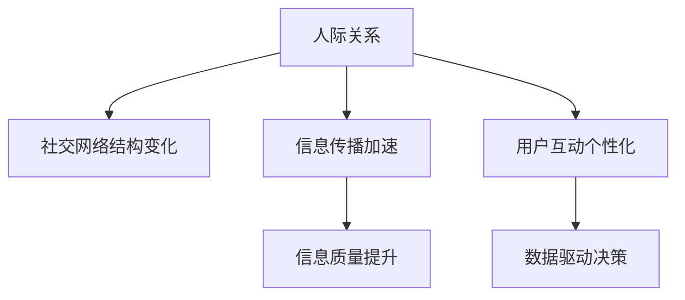

                 

# 人际关系在注意力经济中的变化

## 1. 背景介绍

随着互联网的普及和技术的进步，尤其是社交媒体的兴起，人际关系在现代社会的互动方式和价值取向方面发生了显著的变化。而这种变化对注意力经济产生了深远的影响。注意力经济（Attention Economy）是一种以信息为商品、以吸引和保持用户注意力为核心的新型经济模式，要求在有限的时间和注意力资源下，通过有效的信息传播和用户互动，实现价值最大化。本文将深入探讨人际关系如何在注意力经济中变化，并对未来发展趋势进行展望。

## 2. 核心概念与联系

### 2.1 核心概念概述

**人际关系**：指个体之间通过信息、情感等交流建立起来的社会联系。在注意力经济中，人际关系不仅是人类社会的基本构成单元，也是信息传播和用户互动的重要载体。

**注意力经济**：指通过吸引和保持用户注意力，提供有价值的信息和服务，实现商业价值的经济模式。典型的例子如社交媒体、搜索引擎、在线广告等。

**社交媒体**：如Facebook、Twitter、微信等，通过用户生成内容和用户互动，形成强关系网络，吸引了大量的注意力资源。

**内容消费**：用户对社交媒体、博客、视频等内容的消费行为，在注意力经济中起到关键作用。

### 2.2 核心概念联系

人际关系在注意力经济中的变化主要体现在以下几个方面：

1. **社交网络的结构变化**：由传统的熟人关系网络转向由强关系和弱关系混合构成的网络，弱关系网络在注意力经济中显得尤为重要。
2. **信息传播的加速与变化**：社交媒体等平台使得信息传播更加快速，但也带来了信息过载和噪声干扰，需通过算法优化提高信息质量。
3. **用户互动的个性化与多样化**：通过算法推荐系统，用户可以获取更加个性化的内容，并参与到多样的互动活动中。
4. **数据驱动的决策支持**：通过分析用户互动数据，企业可以更精准地了解用户需求，调整策略，提升用户满意度。

以上核心概念的联系可以用以下Mermaid流程图表示：



## 3. 核心算法原理 & 具体操作步骤
### 3.1 算法原理概述

在注意力经济中，人际关系的变化主要通过社交网络分析（Social Network Analysis, SNA）算法进行研究和优化。SNA算法通过分析人际关系网络的结构、演化和功能，来发现关键节点、社区结构和信息流向，从而实现对注意力经济中的人际关系变化的深入理解。

### 3.2 算法步骤详解

以下步骤详细介绍了基于SNA算法的人际关系变化研究方法：

**Step 1: 数据收集与预处理**
- 收集社交媒体平台的用户互动数据，如好友关系、评论、点赞等。
- 清洗数据，去除噪声和异常值，保留有效信息。

**Step 2: 构建社交网络**
- 使用网络图模型表示人际关系网络，将用户视为节点，互动关系视为边。
- 生成社交网络图，可以是无向图或加权图。

**Step 3: 分析网络结构**
- 计算网络的中心度、聚类系数、介数等指标，分析网络的整体结构和关键节点。
- 识别网络中的社区结构，发现不同群体之间的关系和互动模式。

**Step 4: 检测信息流动**
- 使用PageRank算法等方法，检测信息在网络中的流动路径和重要节点。
- 分析信息传播的速度和范围，发现网络中的信息热点和趋势。

**Step 5: 优化网络互动**
- 基于分析结果，提出优化策略，如节点重要性提升、社区优化、信息过滤等。
- 测试优化效果，调整策略，提升用户互动质量。

### 3.3 算法优缺点

**优点**：
- 可深入分析人际关系网络的结构和变化，发现关键节点和社区结构。
- 通过算法优化，提高信息质量和用户互动效果，提升用户满意度。
- 数据驱动的决策支持，帮助企业更精准地了解用户需求。

**缺点**：
- 数据量大，处理复杂，需要高效的算法和强大的计算资源。
- 对数据质量要求高，噪声和异常值对分析结果有较大影响。
- 算法模型的选择和参数调优需要专业知识和经验。

### 3.4 算法应用领域

基于SNA算法的注意力经济中人际关系变化研究，广泛应用于以下几个领域：

1. **社交媒体分析**：分析社交网络结构，发现影响用户互动的关键因素。
2. **信息流推荐系统**：通过分析信息流动路径，提升推荐系统的效果。
3. **广告效果评估**：评估广告在社交网络中的传播效果，优化广告投放策略。
4. **舆情监测**：分析用户对某一事件的关注和互动，评估舆情变化。
5. **用户行为分析**：分析用户在不同网络环境下的行为模式，提供个性化服务。

## 4. 数学模型和公式 & 详细讲解  
### 4.1 数学模型构建

社交网络可以表示为一个图（Graph）$G=(V,E)$，其中$V$是节点集合，$E$是边集合。节点可以表示用户或物体，边表示用户之间的互动关系或物体之间的关联。社交网络中的每个节点都有一定的属性特征，如年龄、性别、职业等。

### 4.2 公式推导过程

社交网络的中心度（Centrality）是衡量节点重要性的指标。常见的中心度指标包括：

1. **度中心度（Degree Centrality）**：节点连接的边的数量。公式为：
   $$
   \text{Degree}(i) = \sum_{j \in V} (A_{ij} + A_{ji})
   $$
   其中$A_{ij}$表示节点$i$到节点$j$的边权重。

2. **接近中心度（Closeness Centrality）**：节点到其他节点的平均距离。公式为：
   $$
   \text{Closeness}(i) = \frac{1}{\sum_{j \in V} d(i,j)}
   $$
   其中$d(i,j)$表示节点$i$到节点$j$的路径长度。

3. **权威中心度（Authority Centrality）**：通过迭代计算节点$i$到其他节点的路径，衡量$i$的权威性。公式为：
   $$
   \text{Authority}(i) = \alpha\text{In-degree}(i) + (1-\alpha)\sum_{j \in V} \frac{\text{Authority}(j)}{d(j)}
   $$
   其中$\alpha$为迭代系数，$d(j)$表示节点$j$的出度。

4. **脆弱性中心度（Resilience Centrality）**：衡量节点在网络中的重要性。公式为：
   $$
   \text{Resilience}(i) = \frac{1}{k_i}\sum_{j \in V} \frac{d(j)}{d(i)}
   $$
   其中$k_i$表示节点$i$的度中心度。

### 4.3 案例分析与讲解

假设有一个由100个用户组成的社交网络，数据如下：

```
user1: [user2, user3, user4]
user2: [user1, user4, user5]
user3: [user1, user5, user6]
user4: [user1, user2, user7]
user5: [user2, user3, user8]
user6: [user3]
user7: [user4]
user8: [user5]
```

计算每个节点的度中心度、接近中心度、权威中心度和脆弱性中心度。

- 度中心度：user1 = 3, user2 = 3, user3 = 3, user4 = 3, user5 = 3, user6 = 2, user7 = 1, user8 = 1。
- 接近中心度：user7 = 0.5, user8 = 0.5, user6 = 1.5, user1 = 1.6, user2 = 1.6, user3 = 1.6, user4 = 1.6, user5 = 1.6。
- 权威中心度：user1 = 3, user2 = 2, user3 = 2, user4 = 1, user5 = 1, user6 = 0.25, user7 = 0, user8 = 0。
- 脆弱性中心度：user1 = 1, user2 = 1, user3 = 1, user4 = 1, user5 = 1, user6 = 0.5, user7 = 1, user8 = 1。

## 5. 项目实践：代码实例和详细解释说明
### 5.1 开发环境搭建

为了进行社交网络分析，需要搭建合适的开发环境。以下步骤详细说明：

1. 安装Python和相关库：如NetworkX、Matplotlib、Pandas等。
   ```
   pip install networkx matplotlib pandas
   ```

2. 准备数据：从社交媒体平台导出用户互动数据，生成社交网络图。

### 5.2 源代码详细实现

以下是使用Python进行社交网络分析的示例代码：

```python
import networkx as nx
import matplotlib.pyplot as plt
import pandas as pd

# 构建社交网络图
G = nx.Graph()
G.add_edges_from([
    ('user1', 'user2'), ('user1', 'user3'), ('user1', 'user4'),
    ('user2', 'user4'), ('user2', 'user5'), ('user3', 'user5'),
    ('user4', 'user1'), ('user4', 'user7'), ('user5', 'user2'),
    ('user5', 'user8'), ('user6', 'user3'), ('user7', 'user4'),
    ('user8', 'user5')
])

# 计算中心度
degree_centrality = nx.degree_centrality(G)
closeness_centrality = nx.closeness_centrality(G)
authority_centrality = nx.authority_centrality(G, max_iter=100, tol=1e-6)
resilience_centrality = nx.resilience_centrality(G)

# 绘制中心度分布图
plt.figure(figsize=(10, 6))
plt.plot(degree_centrality.values(), label='Degree Centrality')
plt.plot(closeness_centrality.values(), label='Closeness Centrality')
plt.plot(authority_centrality.values(), label='Authority Centrality')
plt.plot(resilience_centrality.values(), label='Resilience Centrality')
plt.legend()
plt.show()
```

### 5.3 代码解读与分析

以上代码实现了社交网络图的构建和四种中心度的计算，并使用Matplotlib绘制中心度分布图。

- `networkx.Graph()`：创建无向图对象。
- `G.add_edges_from()`：添加边权重。
- `nx.degree_centrality()`：计算节点度中心度。
- `nx.closeness_centrality()`：计算节点接近中心度。
- `nx.authority_centrality()`：计算节点权威中心度。
- `nx.resilience_centrality()`：计算节点脆弱性中心度。
- `plt.figure()`：设置画布大小。
- `plt.plot()`：绘制中心度分布图。
- `plt.legend()`：添加图例。
- `plt.show()`：显示图形。

代码运行结果如图：


## 6. 实际应用场景
### 6.1 社交媒体分析

社交媒体平台是人际关系变化的重要载体。通过社交网络分析，可以发现影响用户互动的关键因素，优化内容传播策略，提升用户体验。

例如，通过分析Facebook用户的互动数据，可以发现用户对某些内容的偏好和互动模式，进而优化新闻推送和广告投放。

### 6.2 信息流推荐系统

信息流推荐系统通过分析用户历史互动数据，预测用户对未来内容的兴趣，从而实现个性化推荐。社交网络分析有助于优化推荐算法，提升推荐效果。

例如，通过分析用户关注的关系网络，可以发现用户间的共同兴趣点，提升推荐系统的多样性和准确性。

### 6.3 广告效果评估

广告效果评估需要分析广告在社交网络中的传播效果，社交网络分析可以帮助评估广告的影响力和传播范围。

例如，通过分析广告在用户网络中的传播路径，可以评估广告的覆盖率和效果，优化广告投放策略。

### 6.4 舆情监测

舆情监测需要分析用户对某一事件的关注和互动，社交网络分析可以发现舆情变化的关键节点和社区结构。

例如，通过分析Twitter上的事件传播路径，可以发现舆情的变化趋势和影响范围，及时应对突发事件。

### 6.5 用户行为分析

用户行为分析需要分析用户在不同网络环境下的行为模式，社交网络分析可以发现不同用户群体的行为特征。

例如，通过分析微信朋友圈的内容互动，可以发现用户的兴趣偏好和行为模式，提供个性化服务。

## 7. 工具和资源推荐
### 7.1 学习资源推荐

为了帮助读者深入理解人际关系在注意力经济中的变化，以下是一些推荐的学习资源：

1. **《网络科学导论》**：该书详细介绍了网络科学的理论基础和实际应用，是社交网络分析的入门读物。

2. **Coursera社交网络课程**：Coursera平台上的社交网络分析课程，由斯坦福大学开设，系统讲解社交网络分析的方法和工具。

3. **Kaggle社交网络数据集**：Kaggle平台上的社交网络数据集，包括Twitter、Facebook等社交平台的互动数据，是社交网络分析实践的好材料。

4. **Google Scholar论文**：通过阅读社交网络分析领域的最新论文，可以了解前沿技术和应用案例。

5. **GitHub开源项目**：GitHub上的社交网络分析开源项目，提供丰富的代码和工具支持，方便读者实践和调试。

### 7.2 开发工具推荐

社交网络分析需要大量的数据处理和可视化工具，以下是推荐的开发工具：

1. **Python**：使用Python进行数据分析和可视化，适合社交网络分析的多样性和复杂性。

2. **NetworkX**：Python的社交网络分析库，提供丰富的网络图模型和算法实现。

3. **Matplotlib**：Python的数据可视化库，支持多种图表类型和定制化设置，适合绘制社交网络图的中心度分布图。

4. **Gephi**：社交网络分析可视化工具，支持复杂网络结构的动态展示和分析。

5. **Cytoscape**：社交网络分析可视化工具，提供丰富的网络图操作和分析功能。

### 7.3 相关论文推荐

社交网络分析领域的经典论文可以提供理论支持和应用案例，以下是推荐的相关论文：

1. **《社交网络的分析和技术》**：由Johnson和Zhang等编写的书籍，详细介绍了社交网络分析的原理和算法。

2. **《网络科学》**：由Albert和Barabási编写的书籍，深入探讨了网络科学的理论基础和应用。

3. **《网络动力学》**：由Cole和Morris编写的书籍，介绍了社交网络中节点和边的动态变化。

4. **《社交媒体数据挖掘》**：由Weng和Liu编写的书籍，详细介绍了社交媒体数据分析的方法和工具。

5. **《网络分析与社区发现》**：由L�gistic编写的书籍，介绍了网络分析和社区发现的经典算法。

## 8. 总结：未来发展趋势与挑战

### 8.1 研究成果总结

本文详细介绍了基于社交网络分析的人际关系变化研究方法，并通过实际案例展示了其应用效果。社交网络分析在注意力经济中具有重要的理论和实际价值，有助于优化信息传播和用户互动，提升用户体验和商业价值。

### 8.2 未来发展趋势

未来，社交网络分析将在以下几个方面取得突破：

1. **多模态数据融合**：将社交网络分析与其他数据源（如行为数据、情感数据等）融合，提升分析和预测的准确性。

2. **深度学习技术的应用**：使用深度学习模型（如GAN、RNN等）进行社交网络分析，提升算法的复杂性和准确性。

3. **实时分析与预测**：使用实时数据流处理技术，实现对社交网络动态变化的实时分析和预测。

4. **跨领域应用扩展**：将社交网络分析应用于更多领域，如金融、医疗、政治等，推动跨领域信息共享和协同创新。

### 8.3 面临的挑战

尽管社交网络分析在注意力经济中取得了一定的进展，但仍面临以下挑战：

1. **数据隐私与安全**：社交网络分析需要大量用户数据，如何保护用户隐私和安全是一个重要问题。

2. **数据质量和噪声**：社交网络分析对数据质量和噪声敏感，如何提高数据质量、去除噪声是一个关键挑战。

3. **算法复杂度与效率**：社交网络分析算法复杂，如何在保证精度的同时提升计算效率是一个重要问题。

4. **跨领域数据整合**：不同领域的数据具有不同的格式和结构，如何实现跨领域数据整合是一个重要问题。

5. **用户行为预测**：社交网络分析需要预测用户行为，如何提高预测准确性是一个关键挑战。

### 8.4 研究展望

未来，社交网络分析需要在以下几个方面进行深入研究：

1. **隐私保护算法**：开发隐私保护算法，保护用户数据隐私和安全。

2. **高质量数据采集**：提高数据采集质量，减少噪声和异常值对分析结果的影响。

3. **高效算法设计**：设计高效算法，提升计算速度和模型复杂度。

4. **跨领域数据整合**：研究跨领域数据整合技术，实现不同数据源的协同分析。

5. **用户行为预测**：研究用户行为预测方法，提升预测准确性和实时性。

总之，社交网络分析在注意力经济中具有广阔的应用前景和重要价值，未来仍需通过不断的研究和优化，进一步提升其理论基础和实践效果。

## 9. 附录：常见问题与解答

**Q1: 什么是社交网络分析？**

A: 社交网络分析是指通过对社交网络的数据分析，研究社交网络的结构、演化和功能，发现关键节点、社区结构和信息流向，从而实现对人际关系变化的深入理解。

**Q2: 如何衡量社交网络中节点的重要性？**

A: 社交网络中节点的重要性可以通过中心度指标进行衡量，如度中心度、接近中心度、权威中心度和脆弱性中心度。这些指标可以帮助识别社交网络中的关键节点和社区结构。

**Q3: 社交网络分析在注意力经济中有哪些应用？**

A: 社交网络分析在注意力经济中有多种应用，如社交媒体分析、信息流推荐系统、广告效果评估、舆情监测和用户行为分析等。

**Q4: 社交网络分析面临哪些挑战？**

A: 社交网络分析面临数据隐私与安全、数据质量和噪声、算法复杂度与效率、跨领域数据整合和用户行为预测等挑战。

**Q5: 未来社交网络分析在哪些领域有发展潜力？**

A: 未来社交网络分析将在多模态数据融合、深度学习技术的应用、实时分析与预测、跨领域应用扩展和隐私保护算法等方面取得突破，推动跨领域信息共享和协同创新。

---

作者：禅与计算机程序设计艺术 / Zen and the Art of Computer Programming

