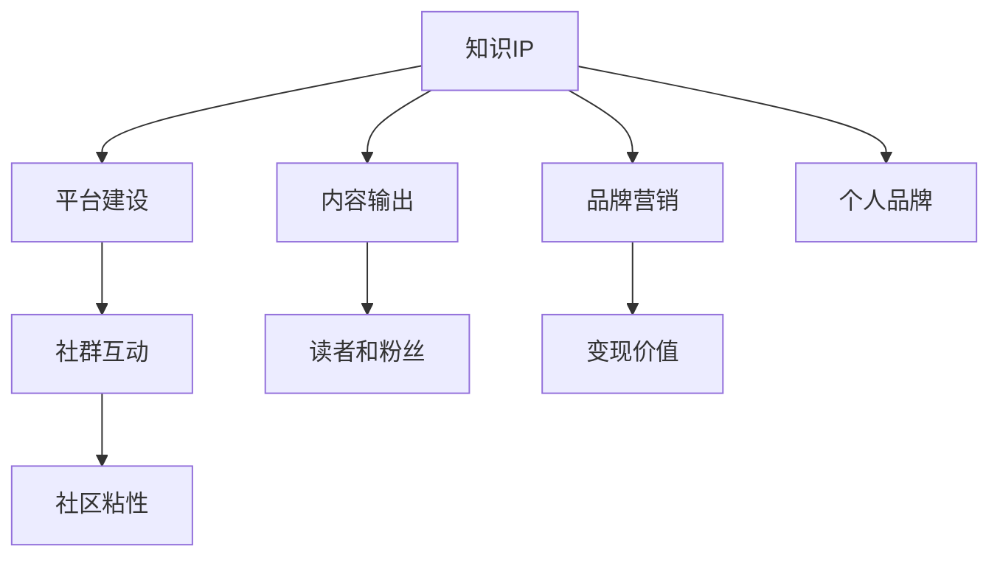

                 

# 从0到1打造个人知识IP

## 1. 背景介绍

在数字化时代，个人品牌建设已成为每个人不可忽视的软实力。无论是职场人士还是自由职业者，拥有个人知识IP都能带来更强的影响力、更广泛的机会、更丰厚的回报。然而，在信息爆炸的今天，打造个人知识IP并非易事。如何从0到1构建个人知识IP？本文将深入探讨这一话题，从理论到实践，为你提供全方位的指导。

## 2. 核心概念与联系

### 2.1 核心概念概述

打造个人知识IP，意味着通过知识输出，塑造自己的品牌形象，建立行业内的权威地位。以下概念是理解这一过程的关键：

- **知识IP**：即以个人为核心的知识产权，代表个人的专业能力和行业影响力。
- **内容输出**：通过撰写博客、开设课程、参与演讲等方式，持续输出专业知识。
- **平台建设**：利用社交媒体、专业论坛、个人网站等平台，传播和维护个人品牌。
- **社群互动**：与读者、同行、粉丝进行互动，建立社区，增强粘性。
- **品牌营销**：通过付费课程、企业合作等方式，变现个人品牌价值。

通过这些概念的相互联系，构建一个以个人为中心的知识IP生态系统。

### 2.2 核心概念原理和架构的 Mermaid 流程图



## 3. 核心算法原理 & 具体操作步骤

### 3.1 算法原理概述

从0到1打造个人知识IP，本质上是一个目标驱动的持续学习和输出过程。这一过程通过以下算法原理来驱动：

1. **目标设定**：明确个人知识IP的目标，例如成为某个领域的专家，建立品牌影响力，积累粉丝等。
2. **内容规划**：根据目标，规划内容主题和输出形式，确保内容与目标一致。
3. **平台选择**：根据内容和目标选择合适的平台进行输出。
4. **内容生产和发布**：持续生产高质量内容，发布到选定的平台上。
5. **互动和优化**：与受众互动，收集反馈，优化内容策略。

### 3.2 算法步骤详解

以下是打造个人知识IP的具体步骤：

**Step 1: 明确目标和受众**

- 设定清晰、可衡量的目标，例如建立影响力、引流100万粉丝等。
- 确定目标受众，如技术爱好者、企业高管等，了解他们的需求和兴趣。

**Step 2: 内容规划和主题设定**

- 确定核心内容主题，如编程、数据科学、人工智能等。
- 规划内容形式，如博客、视频、音频、课程等。
- 制定内容发布计划，包括发布频率和周期。

**Step 3: 选择合适的平台**

- 根据内容形式和受众选择平台，如GitHub、Medium、Bilibili等。
- 分析不同平台的用户特点和流量特点，选择最适合的平台。

**Step 4: 内容生产和发布**

- 利用编程、写作、演讲等技能，制作高质量内容。
- 在选定的平台上发布内容，确保遵循平台规则和标准。

**Step 5: 互动和优化**

- 通过评论、私信等方式与读者互动，了解受众需求和反馈。
- 根据反馈优化内容策略，调整发布计划和内容形式。

**Step 6: 品牌营销和变现**

- 根据受众特点，选择适合的变现方式，如付费课程、书籍出版、企业合作等。
- 建立品牌合作渠道，增加曝光率和影响力。

### 3.3 算法优缺点

**优点**：
- **系统化**：从目标设定到内容产出、互动优化，每一步都有明确指导，确保方向正确。
- **可量化**：通过设定目标和监测反馈，可以量化效果，便于调整策略。
- **灵活性**：可以根据实时反馈和数据，灵活调整内容和平台选择。

**缺点**：
- **投入高**：初期需要大量时间和精力投入内容生产和平台选择。
- **风险高**：内容输出需要持续性，一旦中断可能影响品牌积累。
- **资源有限**：个人时间和精力有限，难以兼顾多个平台和内容形式。

### 3.4 算法应用领域

打造个人知识IP的方法在多个领域都有广泛应用，包括但不限于：

- **技术博客**：通过分享技术心得和编程经验，积累技术粉丝，建立技术权威。
- **教育培训**：开设在线课程，传授专业知识，吸引学习者付费订阅。
- **咨询顾问**：通过定期发布行业分析报告，成为企业决策参考，获得高额咨询费用。
- **内容创业**：创作有价值的内容，通过广告、付费阅读等方式变现，实现财务自由。

## 4. 数学模型和公式 & 详细讲解

### 4.1 数学模型构建

我们假设有N个平台，每个平台的流量分别为$T_1, T_2, ..., T_N$。目标是在这些平台上最大化受众覆盖和品牌影响力。设每个平台的内容输出量为$C_i$，受众转化率为$R_i$，则总受众覆盖$C$和总品牌影响力$I$可以表示为：

$$
C = \sum_{i=1}^N T_i \times R_i \times C_i
$$

$$
I = \sum_{i=1}^N T_i \times R_i \times C_i^2
$$

目标是最小化总成本$Cost$，最大化总受众覆盖$C$和总品牌影响力$I$。成本函数为：

$$
Cost = \sum_{i=1}^N C_i
$$

### 4.2 公式推导过程

上述模型可以通过优化算法求解。假设平台数量为N，每个平台的内容输出量$C_i$已知，受众转化率$R_i$为常数，则受众覆盖$C$和品牌影响力$I$与总成本$Cost$的关系可以表示为：

$$
C = \sum_{i=1}^N T_i \times R_i \times C_i
$$

$$
I = \sum_{i=1}^N T_i \times R_i \times C_i^2
$$

$$
Cost = \sum_{i=1}^N C_i
$$

求解这一优化问题，可以通过拉格朗日乘子法或遗传算法等方法实现。最优解满足：

$$
\frac{\partial C}{\partial C_i} = \frac{\partial I}{\partial C_i} = \frac{\partial Cost}{\partial C_i} = 0
$$

根据偏导数，可以得到内容输出量$C_i$的最优值。

### 4.3 案例分析与讲解

以GitHub为例，分析如何最大化个人品牌影响力。假设你在GitHub上创建了一个开源项目，已知每日访客数$T=1000$，项目贡献率$R=0.01$。假设你每天可以投入1小时进行内容输出，内容输出量$C=1$，则每日受众覆盖和品牌影响力分别为：

$$
C = T \times R \times C = 1000 \times 0.01 \times 1 = 10
$$

$$
I = T \times R \times C^2 = 1000 \times 0.01 \times 1^2 = 10
$$

总成本为：

$$
Cost = C = 1
$$

通过优化模型，可以找到最大化受众覆盖和品牌影响力的最优内容输出量。

## 5. 项目实践：代码实例和详细解释说明

### 5.1 开发环境搭建

在进行个人知识IP建设时，开发环境搭建是关键一步。以下是搭建开发环境的详细步骤：

1. **安装编程语言**：选择Python、Java、JavaScript等常用编程语言，安装对应的开发工具包。
2. **配置开发环境**：安装IDE（如PyCharm、Visual Studio、Atom等）和版本控制系统（如Git）。
3. **准备开发工具**：安装必要的开发工具和库，如MySQL、Redis、TensorFlow等。
4. **部署平台**：选择合适的云平台（如AWS、阿里云、腾讯云等），部署个人网站和应用。

### 5.2 源代码详细实现

以下是一个简单的博客文章发布示例，展示了如何在Medium平台上发布文章：

```python
import requests

# 登录Medium
session = requests.Session()
session.post('https://medium.com/login', data={'email': 'your_email', 'password': 'your_password'})

# 发布文章
response = session.post('https://medium.com/publish', data={'title': 'My First Blog Post', 'content': 'This is my first blog post.'})
if response.status_code == 200:
    print('Article published successfully.')
```

### 5.3 代码解读与分析

上述代码通过requests库登录Medium平台，并发布一篇博客文章。这只是一个基础示例，实际开发中需要考虑更多因素，如文章格式、审核机制、版权保护等。

## 6. 实际应用场景

### 6.1 教育培训

通过开设在线课程，成为某个领域的专家，吸引付费学员，实现知识和经济的双重变现。以Khan Academy为例，通过发布免费的教学视频和互动练习，吸引了全球数百万的学习者，实现了教育品牌的全球影响力。

### 6.2 技术博客

通过撰写技术博客，分享编程心得和行业动态，吸引技术爱好者关注，建立技术权威。以TechCrunch为例，通过发布最新的科技新闻和技术分析，成为科技媒体的行业标杆，吸引了大量技术人才和读者。

### 6.3 企业合作

通过定期发布行业报告，为企业提供决策支持，获得高额咨询费用。以Gartner为例，通过发布技术趋势分析和市场研究报告，成为企业战略规划的重要参考，实现了业务和学术的双重价值。

### 6.4 内容创业

创作有价值的内容，通过广告、付费阅读等方式变现，实现财务自由。以New York Times为例，通过发布高质量的新闻和深度报道，实现了内容变现的商业模式，成为全球知名的媒体品牌。

## 7. 工具和资源推荐

### 7.1 学习资源推荐

为了帮助读者系统掌握个人知识IP的构建方法，推荐以下学习资源：

1. **《打造个人品牌》（原书名："Build Your Personal Brand"）**：详细讲解如何通过内容输出、社群互动等方式，建立个人品牌。
2. **《内容营销》（原书名："Content Marketing"）**：介绍如何通过内容吸引受众、提高流量，实现商业转化。
3. **《影响力》（原书名："Influence"）**：分析如何通过人际交往和社交媒体，提升个人影响力。
4. **《内容营销实战》**：结合实际案例，讲解如何制定内容策略，进行内容分发和效果监测。

### 7.2 开发工具推荐

以下是几个常用的开发工具，推荐给从事个人知识IP建设的开发者：

1. **GitHub**：全球最大的代码托管平台，支持开源项目和版本控制，是发布技术博客和代码的重要平台。
2. **Medium**：高质量的文章发布平台，吸引大量技术爱好者和读者，是分享技术心得和行业动态的好选择。
3. **LinkedIn**：全球最大的职业社交平台，可以通过发布行业文章和互动，提升个人品牌和专业影响力。
4. **YouTube**：全球最大的视频平台，通过发布技术讲解和演讲，吸引大量粉丝和关注。
5. **Bilibili**：中国最大的视频社区，通过发布高质量的视频内容，吸引国内用户关注。

### 7.3 相关论文推荐

以下是几篇关于个人知识IP构建的论文，推荐给读者进一步阅读：

1. **《Influence Maximization in Social Networks》**：分析如何通过影响最大化，建立个人品牌影响力。
2. **《The Power of Social Media for Personal Branding》**：探讨社交媒体如何帮助个人品牌建设。
3. **《Building a Successful Personal Brand》**：通过案例分析，介绍成功建立个人品牌的经验和方法。

## 8. 总结：未来发展趋势与挑战

### 8.1 研究成果总结

个人知识IP的建设是一个不断迭代和优化的过程。从目标设定、内容输出到平台选择、互动优化，每一步都需要精心设计和调整。通过持续学习和创新，可以逐步实现个人品牌的目标。

### 8.2 未来发展趋势

未来，个人知识IP建设将呈现以下几个趋势：

1. **多平台融合**：个人品牌将越来越多地跨越不同平台，通过多渠道分发内容，提升品牌覆盖率和影响力。
2. **个性化内容**：通过数据分析和算法推荐，提供更加个性化的内容，吸引更多受众。
3. **视频化内容**：视频内容更加受欢迎，视频博主将成为个人品牌建设的重要力量。
4. **交互式内容**：通过游戏、问答等方式，增强内容的互动性和吸引力。
5. **AI辅助**：利用AI技术，如自然语言处理、图像识别等，提升内容创作和传播效率。

### 8.3 面临的挑战

在个人知识IP建设过程中，还面临以下挑战：

1. **时间精力限制**：个人时间和精力有限，难以兼顾多个平台和内容形式。
2. **内容质量要求高**：高质量内容需要大量时间和资源投入，难以持续产出。
3. **平台规则复杂**：不同平台有不同规则和算法，需要不断学习和适应。
4. **受众需求多样**：受众需求多样，难以统一内容策略，满足不同受众。
5. **竞争激烈**：个人品牌建设竞争激烈，需要不断创新和优化策略。

### 8.4 研究展望

未来，个人知识IP建设需要在以下几个方面寻求新的突破：

1. **自动化内容创作**：利用AI技术，如生成式模型，自动化生成高质量内容。
2. **数据驱动决策**：通过数据分析和算法优化，提升内容发布策略的效果。
3. **跨平台协同**：利用跨平台技术，实现不同平台内容的分发和互动。
4. **AI辅助互动**：通过AI技术，增强与受众的互动和粘性。
5. **多渠道变现**：探索更多渠道，实现品牌和内容的变现。

## 9. 附录：常见问题与解答

**Q1: 如何选择合适的平台？**

A: 根据内容形式和受众特点，选择最适合的平台。例如，编程内容适合GitHub，技术文章适合Medium，视频内容适合YouTube。

**Q2: 如何提升互动效果？**

A: 通过互动问答、直播讲座、社群讨论等方式，增强与受众的互动，提升社区粘性。

**Q3: 如何保持内容新鲜度？**

A: 定期更新内容，结合热点话题和受众需求，吸引更多关注。

**Q4: 如何提高内容质量和影响力？**

A: 通过不断学习和优化，提升内容质量和创意性，吸引更多受众和关注。

**Q5: 如何衡量个人品牌的效果？**

A: 通过粉丝数量、关注度、互动率等指标，衡量个人品牌的影响力和受众覆盖。

---

作者：禅与计算机程序设计艺术 / Zen and the Art of Computer Programming

