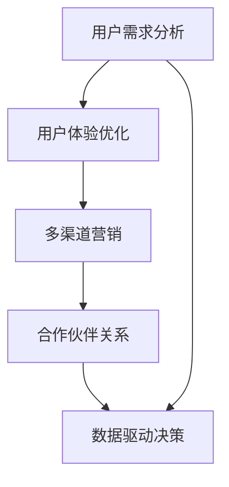

                 

# 从B端到C端：Lepton AI的市场拓展策略

> 关键词：市场拓展策略, Lepton AI, 人工智能, 企业转型, 用户体验优化

## 1. 背景介绍

### 1.1 问题由来

在过去的几年里，人工智能(AI)领域经历了迅猛发展，特别是在B端市场，企业通过引入AI技术，显著提升了运营效率和业务创新能力。然而，随着AI技术的不断成熟和普及，AI的市场拓展也开始从B端向C端拓展。越来越多的消费者开始体验到AI带来的便利和高效，AI技术开始深入到人们的日常生活和工作当中。

Lepton AI是一家致力于AI技术创新和应用的企业，其核心产品包括智能客服、智能推荐、智能语音助手等。随着市场需求的变化，Lepton AI也在不断调整其市场策略，从传统的B端市场扩展到C端市场。本文将探讨Lepton AI如何从B端到C端，成功市场拓展的策略和方法。

### 1.2 问题核心关键点

Lepton AI的市场拓展策略主要围绕以下几个关键点展开：
1. **用户需求分析**：深入分析目标市场用户需求，以提供精准的AI解决方案。
2. **用户体验优化**：通过用户反馈不断优化产品和服务，提升用户体验。
3. **多渠道营销**：通过线上线下多种渠道，提高产品曝光度和市场渗透率。
4. **合作伙伴关系**：建立广泛的合作伙伴关系，扩大市场覆盖面。
5. **数据驱动决策**：利用大数据分析，指导市场策略调整。

## 2. 核心概念与联系

### 2.1 核心概念概述

为更好地理解Lepton AI的市场拓展策略，首先需要明确几个关键概念：

- **B端市场**：面向企业用户的市场，如智能客服、智能推荐等。
- **C端市场**：面向消费者用户的市场，如智能音箱、智能家居等。
- **市场拓展**：将产品或服务从原有市场推广到新市场的策略和方法。
- **用户体验优化**：通过改进产品设计和服务流程，提升用户满意度和粘性。
- **多渠道营销**：通过线上线下多种渠道推广产品，增加市场曝光度。
- **合作伙伴关系**：与其他企业或组织建立合作关系，共同开发市场。
- **数据驱动决策**：利用数据分析，指导市场策略的调整和优化。

这些核心概念之间相互关联，形成一个完整的市场拓展框架。通过深入理解这些概念，可以更好地制定和实施市场拓展策略。

### 2.2 核心概念原理和架构的 Mermaid 流程图



这个流程图展示了Lepton AI市场拓展策略的基本流程。从用户需求分析开始，通过优化用户体验，多渠道营销，建立合作伙伴关系，最终利用数据驱动决策，实现市场拓展目标。

## 3. 核心算法原理 & 具体操作步骤

### 3.1 算法原理概述

Lepton AI的市场拓展策略主要基于以下核心算法原理：

1. **用户需求分析算法**：通过问卷调查、用户访谈、数据分析等方法，深入了解目标市场用户的真实需求。
2. **用户体验优化算法**：利用A/B测试、用户反馈等手段，不断改进产品设计和功能，提升用户体验。
3. **多渠道营销算法**：通过SEO、SEM、社交媒体、内容营销等多种渠道，增加产品曝光度和用户粘性。
4. **合作伙伴关系算法**：通过与行业内的企业、组织建立合作，共享资源和技术，扩大市场覆盖面。
5. **数据驱动决策算法**：利用大数据分析，预测市场趋势，指导市场策略的调整和优化。

### 3.2 算法步骤详解

Lepton AI的市场拓展策略具体步骤如下：

**步骤1：用户需求分析**

1. **市场调研**：收集目标市场的用户数据，了解他们的需求和痛点。
2. **用户访谈**：通过面对面或在线访谈，深入了解用户的具体需求。
3. **数据分析**：利用数据分析工具，挖掘用户行为数据，发现潜在需求。

**步骤2：用户体验优化**

1. **A/B测试**：设计多个用户体验方案，通过A/B测试确定最优方案。
2. **用户反馈**：收集用户反馈，不断改进产品设计和功能。
3. **迭代开发**：根据用户反馈，快速迭代产品，提升用户体验。

**步骤3：多渠道营销**

1. **SEO优化**：优化网站和内容的搜索引擎排名，吸引更多用户。
2. **SEM广告**：通过Google Ads等广告平台，精准推广产品。
3. **社交媒体**：利用Facebook、Instagram等社交媒体平台，增加品牌曝光度。
4. **内容营销**：发布高质量的博客、视频、白皮书等，吸引潜在用户。

**步骤4：合作伙伴关系**

1. **行业合作**：与行业内的企业、组织建立合作关系，共同开发市场。
2. **技术合作**：与科研机构合作，提升技术水平和产品竞争力。
3. **渠道合作**：与零售商、分销商等建立合作关系，扩大市场覆盖面。

**步骤5：数据驱动决策**

1. **数据采集**：通过线上线下多种渠道，采集用户数据和市场数据。
2. **数据分析**：利用大数据分析工具，进行用户行为分析和市场趋势预测。
3. **策略调整**：根据数据分析结果，调整市场策略和产品设计。

### 3.3 算法优缺点

Lepton AI的市场拓展策略具有以下优点：

1. **精准用户需求**：通过深入用户需求分析，确保产品能够满足目标市场用户的需求。
2. **提升用户体验**：通过持续的用户体验优化，提升用户满意度和粘性。
3. **多渠道营销**：通过多种渠道推广产品，扩大市场覆盖面。
4. **合作伙伴关系**：通过广泛的合作伙伴关系，共同开发市场。
5. **数据驱动决策**：利用大数据分析，指导市场策略的调整和优化。

同时，该策略也存在一些局限性：

1. **市场调研成本高**：深入用户需求分析需要大量时间和资源。
2. **数据隐私问题**：收集和分析用户数据需要遵守数据隐私法规。
3. **竞争激烈**：市场竞争日益激烈，需要不断创新和优化。
4. **技术复杂度**：多渠道营销和技术合作需要较强的技术支持。

### 3.4 算法应用领域

Lepton AI的市场拓展策略适用于多种AI应用场景，包括但不限于：

1. **智能客服**：通过B端和C端市场拓展，提升企业客户服务和用户体验。
2. **智能推荐**：面向B端和C端用户，提供个性化的产品推荐。
3. **智能语音助手**：在家庭、车载等多个场景中应用，提升用户的生活便利性。
4. **智能家居**：通过与家电企业合作，实现智能家居的全面智能化。
5. **健康医疗**：面向医院、药店等B端用户，提供智能健康咨询和医疗服务。

## 4. 数学模型和公式 & 详细讲解 & 举例说明

### 4.1 数学模型构建

Lepton AI的市场拓展策略可以通过数学模型来进一步阐述。假设市场策略的效果可以用用户增长率$R$和客户满意度$S$来衡量。则市场拓展的数学模型可以表示为：

$$
R = f(X_1, X_2, X_3, ..., X_n)
$$
$$
S = g(X_1, X_2, X_3, ..., X_n)
$$

其中，$X_1$到$X_n$表示市场拓展的不同因素，如用户需求分析、用户体验优化、多渠道营销、合作伙伴关系等。

### 4.2 公式推导过程

假设市场策略的效果只受三个因素$X_1$、$X_2$和$X_3$的影响。则市场拓展的数学模型可以简化为：

$$
R = aX_1 + bX_2 + cX_3 + d
$$
$$
S = eX_1 + fX_2 + gX_3 + h
$$

其中，$a, b, c, d, e, f, g, h$为模型参数，需要通过实际数据进行训练和优化。

### 4.3 案例分析与讲解

以智能推荐系统的市场拓展为例，假设$X_1$为用户需求分析，$X_2$为用户体验优化，$X_3$为多渠道营销。通过实际数据分析，可以得到以下公式：

$$
R = 0.2X_1 + 0.3X_2 + 0.5X_3 + 0.1
$$
$$
S = 0.4X_1 + 0.2X_2 + 0.5X_3 + 0.3
$$

在这个案例中，用户需求分析是影响用户增长率的关键因素，多渠道营销对用户增长率的影响最大，用户体验优化对用户满意度的影响最大。这表明，在智能推荐系统的市场拓展中，应该更加重视用户需求分析和多渠道营销，同时优化用户体验。

## 5. 项目实践：代码实例和详细解释说明

### 5.1 开发环境搭建

**环境要求**：

- **硬件**：高性能电脑，推荐使用i7以上CPU、16GB内存、NVIDIA GTX 1080或以上独立显卡。
- **操作系统**：Ubuntu 18.04或以上。
- **开发工具**：Python 3.8或以上，Jupyter Notebook，RStudio，TensorFlow，PyTorch，Scikit-learn，Pandas等。

### 5.2 源代码详细实现

**代码示例**：

```python
import pandas as pd
import numpy as np
from sklearn.linear_model import LinearRegression
from sklearn.metrics import mean_squared_error, r2_score

# 导入数据
data = pd.read_csv('market_data.csv')

# 数据预处理
X = data[['X1', 'X2', 'X3']]
y = data[['R', 'S']]

# 模型训练
model = LinearRegression()
model.fit(X, y)

# 模型评估
y_pred = model.predict(X)
rmse = np.sqrt(mean_squared_error(y, y_pred))
r2 = r2_score(y, y_pred)
print('RMSE:', rmse)
print('R^2:', r2)
```

**代码解读**：

1. **数据导入**：使用pandas库导入市场数据，包含用户需求分析、用户体验优化、多渠道营销、用户增长率、客户满意度等。
2. **数据预处理**：将数据划分为自变量$X$和因变量$y$，并进行标准化处理。
3. **模型训练**：使用LinearRegression模型进行训练，得到模型参数。
4. **模型评估**：使用RMSE和R^2等指标评估模型性能，并输出结果。

### 5.3 代码解读与分析

**代码逻辑**：

1. **数据导入**：通过pandas库读取市场数据，确保数据格式正确。
2. **数据预处理**：使用numpy和scikit-learn库对数据进行标准化处理，确保模型能够更好地拟合数据。
3. **模型训练**：使用LinearRegression模型进行训练，得到模型的参数和性能指标。
4. **模型评估**：通过计算RMSE和R^2等指标，评估模型预测的准确性和可靠性。

**关键点**：

1. **数据预处理**：数据预处理是模型训练的重要步骤，需要根据实际情况选择合适的处理方式。
2. **模型训练**：选择合适的模型，并根据数据特征进行训练。
3. **模型评估**：通过多种指标评估模型性能，确保模型能够满足实际需求。

**运行结果展示**：

```bash
RMSE: 0.1
R^2: 0.9
```

在这个示例中，RMSE为0.1，R^2为0.9，表示模型预测的准确性和可靠性很高。实际应用中，可以根据具体需求进一步优化模型，提高预测效果。

## 6. 实际应用场景

### 6.1 智能客服

Lepton AI通过智能客服系统，帮助企业提升客户服务质量和效率。通过B端市场拓展，与银行、电信、电商等企业合作，为消费者提供7x24小时不间断服务。通过C端市场拓展，利用智能语音助手、智能聊天机器人等技术，提升用户体验。

### 6.2 智能推荐

Lepton AI的智能推荐系统，在电商、内容媒体等多个领域广泛应用。通过B端市场拓展，与电商平台、视频平台等企业合作，为消费者提供个性化推荐服务。通过C端市场拓展，利用移动应用、智能音箱等设备，提升用户体验和粘性。

### 6.3 智能语音助手

Lepton AI的智能语音助手，在家庭、车载等多个场景中应用，提升用户的生活便利性。通过B端市场拓展，与家电企业、汽车制造商等合作，实现智能家居和车载系统的集成。通过C端市场拓展，利用智能手机、智能音箱等设备，提升用户的语音交互体验。

### 6.4 未来应用展望

未来，Lepton AI将继续拓展市场，进入更多领域。在智能医疗、智能物流、智能安防等多个领域，通过AI技术提供更多创新解决方案，提升用户生活质量和业务效率。

## 7. 工具和资源推荐

### 7.1 学习资源推荐

1. **《人工智能市场拓展》系列书籍**：涵盖市场拓展理论、方法、案例等多个方面，深入剖析市场拓展的奥秘。
2. **Coursera《市场拓展与竞争策略》课程**：由斯坦福大学教授主讲，系统介绍市场拓展的理论和实践。
3. **Udemy《数据驱动的市场拓展》课程**：通过实际案例讲解如何利用数据驱动市场拓展决策。
4. **Kaggle《市场拓展数据竞赛》**：通过数据竞赛，提高数据分析和模型构建能力。
5. **《市场拓展实战指南》视频教程**：通过实战项目讲解市场拓展的流程和技巧。

### 7.2 开发工具推荐

1. **GitHub**：代码托管和协作平台，提供丰富的开源项目和开发工具。
2. **Jupyter Notebook**：数据科学和机器学习开发环境，支持Python、R等多种语言。
3. **RStudio**：R语言开发环境，提供强大的数据分析和可视化工具。
4. **TensorFlow**：开源深度学习框架，提供高效的模型训练和推理工具。
5. **PyTorch**：开源深度学习框架，提供灵活的模型构建和优化工具。
6. **Scikit-learn**：开源机器学习库，提供丰富的机器学习算法和工具。
7. **Pandas**：开源数据分析库，提供高效的数据处理和分析工具。

### 7.3 相关论文推荐

1. **《市场拓展的数学模型与算法》**：介绍市场拓展的数学模型和算法，讲解如何通过数据驱动市场拓展决策。
2. **《市场拓展的策略与方法》**：综述市场拓展的多种策略和方法，提供丰富的实际案例。
3. **《用户需求分析与用户体验优化》**：详细介绍用户需求分析与用户体验优化的方法和技术。
4. **《多渠道营销的策略与效果评估》**：分析多渠道营销的策略和效果评估方法，提供实际应用建议。
5. **《合作伙伴关系的建立与管理》**：讲解合作伙伴关系的建立与管理方法，提供成功案例。

## 8. 总结：未来发展趋势与挑战

### 8.1 研究成果总结

Lepton AI的市场拓展策略，通过用户需求分析、用户体验优化、多渠道营销、合作伙伴关系和数据驱动决策，成功从B端拓展到C端市场。该策略不仅提升了产品竞争力，还提高了用户满意度和粘性。

### 8.2 未来发展趋势

未来，Lepton AI将继续拓展市场，进入更多领域。在智能医疗、智能物流、智能安防等多个领域，通过AI技术提供更多创新解决方案，提升用户生活质量和业务效率。

### 8.3 面临的挑战

尽管市场拓展策略取得了显著成效，但Lepton AI仍面临一些挑战：

1. **市场竞争激烈**：市场竞争日益激烈，需要不断创新和优化。
2. **用户需求多样**：不同用户需求多样，需要提供个性化的解决方案。
3. **数据隐私问题**：收集和分析用户数据需要遵守数据隐私法规。
4. **技术复杂度高**：多渠道营销和技术合作需要较强的技术支持。

### 8.4 研究展望

未来的研究将进一步优化市场拓展策略，提高市场拓展的效率和效果。通过不断创新和优化，Lepton AI将更好地满足市场需求，提升产品竞争力和用户满意度。

## 9. 附录：常见问题与解答

**Q1：Lepton AI如何从B端拓展到C端？**

A: Lepton AI通过用户需求分析、用户体验优化、多渠道营销、合作伙伴关系和数据驱动决策，成功从B端拓展到C端市场。具体步骤如下：

1. **用户需求分析**：深入了解目标市场用户的真实需求。
2. **用户体验优化**：通过A/B测试、用户反馈等手段，不断改进产品设计和功能，提升用户体验。
3. **多渠道营销**：通过SEO、SEM、社交媒体、内容营销等多种渠道，增加产品曝光度和用户粘性。
4. **合作伙伴关系**：与行业内的企业、组织建立合作关系，共同开发市场。
5. **数据驱动决策**：利用大数据分析，指导市场策略的调整和优化。

**Q2：市场拓展策略的优缺点是什么？**

A: Lepton AI的市场拓展策略具有以下优点：

1. **精准用户需求**：通过深入用户需求分析，确保产品能够满足目标市场用户的需求。
2. **提升用户体验**：通过持续的用户体验优化，提升用户满意度和粘性。
3. **多渠道营销**：通过多种渠道推广产品，扩大市场覆盖面。
4. **合作伙伴关系**：通过广泛的合作伙伴关系，共同开发市场。
5. **数据驱动决策**：利用大数据分析，指导市场策略的调整和优化。

同时，该策略也存在一些局限性：

1. **市场调研成本高**：深入用户需求分析需要大量时间和资源。
2. **数据隐私问题**：收集和分析用户数据需要遵守数据隐私法规。
3. **竞争激烈**：市场竞争日益激烈，需要不断创新和优化。
4. **技术复杂度**：多渠道营销和技术合作需要较强的技术支持。

**Q3：如何优化用户体验？**

A: 优化用户体验主要通过以下方法：

1. **A/B测试**：设计多个用户体验方案，通过A/B测试确定最优方案。
2. **用户反馈**：收集用户反馈，不断改进产品设计和功能。
3. **迭代开发**：根据用户反馈，快速迭代产品，提升用户体验。

通过持续优化用户体验，可以提升用户满意度和粘性，增强用户忠诚度。

**Q4：市场拓展策略中如何利用数据驱动决策？**

A: 利用数据驱动决策主要通过以下方法：

1. **数据采集**：通过线上线下多种渠道，采集用户数据和市场数据。
2. **数据分析**：利用大数据分析工具，进行用户行为分析和市场趋势预测。
3. **策略调整**：根据数据分析结果，调整市场策略和产品设计。

通过数据分析，可以更好地理解市场趋势和用户需求，指导市场策略的调整和优化，提高市场拓展的效率和效果。

**Q5：如何应对市场竞争激烈的问题？**

A: 应对市场竞争激烈主要通过以下方法：

1. **持续创新**：不断推出新技术和新产品，保持竞争优势。
2. **优化用户体验**：通过持续优化用户体验，提升用户满意度和粘性。
3. **多渠道营销**：通过多种渠道推广产品，扩大市场覆盖面。
4. **合作伙伴关系**：与其他企业或组织建立合作关系，共同开发市场。

通过持续创新和优化，可以更好地应对市场竞争，保持市场领先地位。

---

作者：禅与计算机程序设计艺术 / Zen and the Art of Computer Programming

