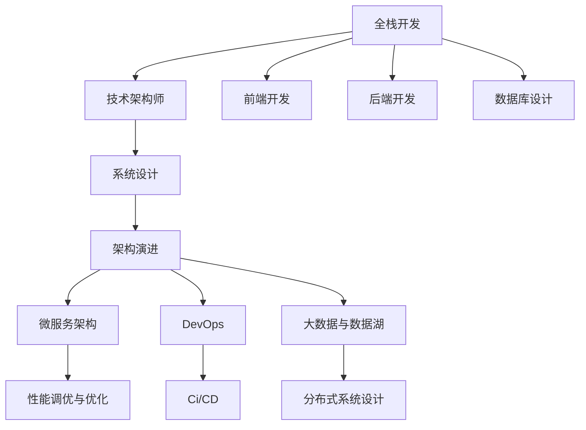

                 

# 从全栈开发到技术架构师的进阶

> 关键词：全栈开发,技术架构师,软件工程,系统设计,架构演进,技术演进,专业成长

## 1. 背景介绍

### 1.1 问题由来
随着科技的迅猛发展，软件开发领域对技术人员的全面性和深度的要求越来越高。无论是前端、后端，还是数据、安全，单一技能的工程师已无法适应现代复杂系统的开发需求。与此同时，随着企业应用场景的不断变化，技术人员需要从项目驱动、业务驱动，逐步过渡到架构驱动的思维模式。在这样的背景下，从全栈开发到技术架构师，成为了技术人员成长和演进的必经之路。

### 1.2 问题核心关键点
从全栈开发到技术架构师的进阶，需要系统化的学习和理解技术架构的核心概念与设计原则。具体而言，包括以下几个关键点：

1. **系统设计和架构的演进**：理解系统从单体应用到微服务、再到分布式系统的演进过程，掌握不同阶段的特点与挑战。
2. **架构模式与设计模式**：掌握常用架构模式（如MVC、MVVM）和设计模式（如单例、工厂），能够灵活应用到具体项目中。
3. **性能调优与优化**：掌握系统性能调优的原理与方法，提升应用系统的响应速度与资源利用率。
4. **分布式系统设计**：理解分布式系统的设计原则，掌握一致性协议、负载均衡、服务发现等关键技术。
5. **架构演进与微服务架构**：理解微服务架构的原理与优势，掌握微服务架构的设计与演进路径。
6. **大数据与数据湖**：理解大数据和数据湖的基本概念，掌握数据治理、数据管道、数据湖架构等相关技术。
7. **云架构与容器技术**：掌握云计算技术（如AWS、Azure、GCP）与容器技术（如Kubernetes、Docker），提升系统架构的弹性与可扩展性。
8. **DevOps与CI/CD**：理解DevOps理念，掌握持续集成与持续部署（CI/CD）的流程与工具，提升交付效率与质量。

掌握这些关键点，将有助于从全栈开发逐步向技术架构师转型，从项目的零散执行者转变为系统的架构设计师。

## 2. 核心概念与联系

### 2.1 核心概念概述

为了更好地理解从全栈开发到技术架构师的过程，本节将介绍几个密切相关的核心概念：

- **全栈开发**：指同时掌握前端、后端、数据库等多种技术，能够独立完成从需求分析到项目交付的整个过程。全栈开发人员通常是项目的"全才"，能够解决项目中的各种技术问题。
- **技术架构师**：指专注于系统架构设计、优化与演进的专家，能够从宏观视角审视整个系统，设计出高效、可扩展、可维护的架构方案。技术架构师通常具备深厚的系统设计和架构理论知识。
- **系统设计**：指根据业务需求和技术条件，设计出满足需求、高效运行的硬件和软件系统。系统设计涉及硬件平台、操作系统、网络、数据库、中间件等各类技术。
- **架构演进**：指系统从单体应用逐步演进到微服务、分布式系统等更复杂结构的过程。这一过程涉及系统的重构、优化与升级，需要全面的技术储备和经验积累。
- **微服务架构**：指将大型应用拆分为多个小型、独立运行的服务，通过服务注册、发现与通信机制，实现系统的灵活、可扩展和易于维护。微服务架构是架构演进的重要方向。
- **DevOps**：指将软件开发和运维工作紧密结合，通过自动化、持续集成与持续部署等手段，提升交付效率与系统稳定性。DevOps是云计算时代的重要实践。
- **大数据与数据湖**：指利用分布式存储与计算技术，处理大规模数据的存储、计算与管理。大数据与数据湖技术是处理海量数据的重要手段。

这些概念之间的逻辑关系可以通过以下Mermaid流程图来展示：



这个流程图展示了几大核心概念之间的关系：

1. 全栈开发是技术架构师的基础，涵盖前端、后端、数据库等多种技术。
2. 技术架构师基于系统设计进行架构演进，引入微服务、DevOps等技术。
3. 性能调优与优化是提升系统性能的重要手段。
4. 分布式系统设计是微服务架构的重要基础。
5. 大数据与数据湖技术支持海量数据的处理与管理。

## 3. 核心算法原理 & 具体操作步骤
### 3.1 算法原理概述

从全栈开发到技术架构师的进阶，核心在于系统架构的设计与演进。具体而言，包括：

- **系统设计**：从需求分析到架构设计，设计出满足业务需求、高效运行的硬件和软件系统。
- **架构演进**：基于业务变化和技术进步，逐步引入微服务、分布式系统等更复杂结构，提升系统的灵活性和可扩展性。

### 3.2 算法步骤详解

#### 3.2.1 系统设计

系统设计的步骤主要包括以下几个环节：

1. **需求分析**：与业务团队沟通，明确系统的业务需求、功能需求、非功能需求等。
2. **架构设计**：根据需求分析结果，选择合适的架构模式和技术栈，设计出系统的高层次架构。
3. **技术选型**：根据架构设计，选择合适的硬件、操作系统、数据库、中间件等技术。
4. **详细设计**：设计系统的详细架构，包括模块划分、组件设计、接口定义等。
5. **实现与部署**：根据详细设计，进行系统实现和部署，确保系统满足业务需求。

#### 3.2.2 架构演进

架构演进的步骤主要包括以下几个环节：

1. **业务演进分析**：分析业务演进的变化，确定系统需要引入的新功能或新特性。
2. **架构评估与优化**：评估现有架构的性能、可扩展性和可维护性，确定优化方向。
3. **架构演进设计**：设计新的架构方案，引入微服务、分布式系统等新架构。
4. **架构实施**：根据设计方案，进行系统的重构、优化与升级，引入新架构。
5. **性能与可扩展性评估**：评估新架构的性能和可扩展性，确保系统稳定运行。

### 3.3 算法优缺点

从全栈开发到技术架构师的进阶，优点在于：

1. **全面性**：掌握多种技术，能够从多维度理解和解决问题。
2. **系统视角**：从宏观视角审视系统，能够设计出高效、可扩展的架构方案。
3. **演进能力**：具备系统的演进思维，能够根据业务变化和技术进步，逐步引入新架构，提升系统的灵活性和可扩展性。

缺点在于：

1. **学习成本高**：需要掌握多种技术，学习成本较高。
2. **系统复杂度高**：设计复杂系统需要深厚的技术储备和经验积累。
3. **演进风险大**：系统演进过程中涉及大量的重构和优化，风险较大。

### 3.4 算法应用领域

基于系统架构的设计与演进，技术架构师在以下领域得到了广泛应用：

- **互联网应用**：设计高可用、可扩展的互联网应用系统，如电商、社交、游戏等。
- **金融科技**：设计高安全、高可靠性的金融应用系统，如支付、保险、风控等。
- **智能制造**：设计智能化的工业系统，如工业互联网、智能制造等。
- **医疗健康**：设计高效、安全的医疗健康系统，如电子病历、健康管理等。
- **交通出行**：设计智能化的交通系统，如智慧交通、智能出行等。

这些领域的应用，展示了系统架构设计的重要性和技术架构师的价值。

## 4. 数学模型和公式 & 详细讲解 & 举例说明

### 4.1 数学模型构建

为了更好地理解系统设计的数学模型，我们将使用数学语言进行建模。

假设系统需求为 $D$，系统架构设计为 $A$，系统实现为 $S$，系统部署与运行为 $D$。则系统设计的数学模型可以表示为：

$$
D \rightarrow A \rightarrow S \rightarrow D
$$

其中，$D$ 表示需求，$A$ 表示架构设计，$S$ 表示系统实现，$D$ 表示系统部署与运行。

### 4.2 公式推导过程

对于系统设计，我们主要关注以下几个关键公式：

1. **需求分析公式**：
   $$
   D = \{d_1, d_2, ..., d_n\}
   $$
   其中 $d_i$ 表示需求项。

2. **架构设计公式**：
   $$
   A = \{a_1, a_2, ..., a_m\}
   $$
   其中 $a_i$ 表示架构组件。

3. **技术选型公式**：
   $$
   T = \{t_1, t_2, ..., t_k\}
   $$
   其中 $t_i$ 表示技术栈。

4. **详细设计公式**：
   $$
   S = \{s_1, s_2, ..., s_l\}
   $$
   其中 $s_i$ 表示系统组件。

5. **性能调优公式**：
   $$
   P = P_0 + \Delta P
   $$
   其中 $P_0$ 表示初始性能，$\Delta P$ 表示调优后的性能提升。

6. **分布式系统设计公式**：
   $$
   D = \{d_1, d_2, ..., d_n\}
   $$
   其中 $d_i$ 表示分布式组件。

7. **大数据与数据湖设计公式**：
   $$
   D = \{d_1, d_2, ..., d_n\}
   $$
   其中 $d_i$ 表示大数据组件。

### 4.3 案例分析与讲解

以电商系统的架构设计为例，说明系统设计的数学模型和关键公式的实际应用。

1. **需求分析**：
   $$
   D = \{商品管理, 订单管理, 用户管理, 支付管理, 物流管理\}
   $$

2. **架构设计**：
   $$
   A = \{订单服务, 用户服务, 商品服务, 支付服务, 物流服务\}
   $$

3. **技术选型**：
   $$
   T = \{Spring Boot, Docker, Kubernetes, PostgreSQL\}
   $$

4. **详细设计**：
   $$
   S = \{订单管理模块, 用户管理模块, 商品管理模块, 支付管理模块, 物流管理模块\}
   $$

5. **性能调优**：
   $$
   P = P_0 + \Delta P = 200ms + 50ms = 250ms
   $$

6. **分布式系统设计**：
   $$
   D = \{订单服务, 用户服务, 商品服务, 支付服务, 物流服务\}
   $$

7. **大数据与数据湖设计**：
   $$
   D = \{商品数据, 用户数据, 订单数据, 支付数据, 物流数据\}
   $$

通过这些数学模型和公式，可以清晰地展示系统设计的各个环节，以及关键技术的选型和应用。

## 5. 项目实践：代码实例和详细解释说明

### 5.1 开发环境搭建

在进行系统设计实践前，我们需要准备好开发环境。以下是使用Python进行Django开发的环境配置流程：

1. 安装Anaconda：从官网下载并安装Anaconda，用于创建独立的Python环境。

2. 创建并激活虚拟环境：
```bash
conda create -n django-env python=3.8 
conda activate django-env
```

3. 安装Django：
```bash
pip install django
```

4. 安装各类工具包：
```bash
pip install numpy pandas scikit-learn matplotlib tqdm jupyter notebook ipython
```

完成上述步骤后，即可在`django-env`环境中开始系统设计实践。

### 5.2 源代码详细实现

下面以电商系统的订单管理系统为例，给出使用Django进行系统设计的PyTorch代码实现。

首先，定义订单管理模块的模型和视图：

```python
from django.db import models
from django.shortcuts import render

# 订单模型
class Order(models.Model):
    user = models.ForeignKey(User, on_delete=models.CASCADE)
    product = models.ForeignKey(Product, on_delete=models.CASCADE)
    price = models.DecimalField(max_digits=10, decimal_places=2)
    quantity = models.IntegerField()
    order_date = models.DateTimeField(auto_now_add=True)

# 订单视图
def order_list(request):
    orders = Order.objects.all()
    return render(request, 'order_list.html', {'orders': orders})

def order_detail(request, id):
    order = Order.objects.get(id=id)
    return render(request, 'order_detail.html', {'order': order})
```

然后，定义订单管理模块的数据库迁移和模型管理：

```python
# 数据库迁移
from django.db import migrations

class Migration(migrations.Migration):
    dependencies = [
        ('myapp', '0001_initial'),
    ]
    
    operations = [
        migrations.AddField(
            model_name='order',
            name='product',
            field=models.ForeignKey(to='product.Product', on_delete=models.CASCADE),
        ),
        migrations.AddField(
            model_name='order',
            name='price',
            field=models.DecimalField(max_digits=10, decimal_places=2),
        ),
        migrations.AddField(
            model_name='order',
            name='quantity',
            field=models.IntegerField(),
        ),
        migrations.AddField(
            model_name='order',
            name='order_date',
            field=models.DateTimeField(auto_now_add=True),
        ),
    ]

# 模型管理
from django.contrib import admin

admin.site.register(Order)
```

接着，定义订单管理模块的表单和模型序列化：

```python
# 表单
from django import forms

class OrderForm(forms.ModelForm):
    class Meta:
        model = Order
        fields = ['product', 'price', 'quantity']

# 模型序列化
from rest_framework import serializers

class OrderSerializer(serializers.ModelSerializer):
    class Meta:
        model = Order
        fields = ['id', 'user', 'product', 'price', 'quantity', 'order_date']
```

最后，定义订单管理模块的API接口和视图：

```python
# API接口
from rest_framework import generics
from rest_framework.views import APIView
from rest_framework.response import Response
from rest_framework import status

class OrderList(generics.ListCreateAPIView):
    queryset = Order.objects.all()
    serializer_class = OrderSerializer

class OrderDetail(generics.RetrieveUpdateDestroyAPIView):
    queryset = Order.objects.all()
    serializer_class = OrderSerializer

# 视图
from django.urls import path
from .views import OrderList, OrderDetail

urlpatterns = [
    path('orders/', OrderList.as_view()),
    path('orders/<int:id>/', OrderDetail.as_view()),
]
```

以上就是使用Django进行电商系统订单管理模块设计的完整代码实现。可以看到，Django的强大封装使得系统设计的代码实现变得简洁高效。

### 5.3 代码解读与分析

让我们再详细解读一下关键代码的实现细节：

**Order模型**：
- 定义了订单的基本属性，包括用户、产品、价格、数量和下单时间。

**order_list和order_detail视图**：
- 通过模板渲染函数将订单数据展示在页面上，实现列表展示和详情展示。

**数据库迁移**：
- 定义迁移类，使用Django的migrations框架生成数据库迁移脚本，方便系统升级和回滚。

**模型管理**：
- 通过admin站点管理订单数据，方便后台操作。

**OrderForm和OrderSerializer**：
- 使用Django的表单和序列化框架，方便数据的提交和展示。

**API接口和视图**：
- 使用Django Rest Framework（DRF）框架，实现RESTful API接口，支持HTTP请求的CRUD操作。

**URL路由**：
- 定义URL路由，将API接口和视图绑定在一起，方便访问。

通过这些代码实现，可以看到Django的框架优势和灵活性，使得系统设计变得相对简单和高效。

当然，实际应用中还需要根据业务需求进行更详细的系统设计和优化。但核心的系统设计流程和代码实现与上述类似。

## 6. 实际应用场景

### 6.1 电商系统

电商系统是互联网应用中典型的复杂系统，涵盖了商品管理、订单管理、用户管理、支付管理等多个模块。系统设计需要从整体架构出发，将各个模块合理划分和部署，确保系统的高可用性和可扩展性。

在技术架构层面，电商系统可以采用微服务架构，将不同模块分别设计为独立的微服务，通过服务注册和发现机制进行通信。同时，引入DevOps理念，实现持续集成与持续部署（CI/CD），提升系统的交付效率和稳定性。

### 6.2 金融系统

金融系统对安全性和稳定性要求极高，需要设计高效、可靠的系统架构。系统设计需要考虑高可用性、高安全性、高可扩展性等方面。

在技术架构层面，金融系统可以采用分布式架构，将不同功能模块部署在多个节点上，通过负载均衡和故障转移机制保障系统的高可用性。同时，引入大数据与数据湖技术，对海量交易数据进行高效处理和分析，提升系统的决策能力。

### 6.3 医疗系统

医疗系统需要处理大量敏感数据，需要设计高效、安全的系统架构。系统设计需要考虑数据隐私保护、系统冗余、高可靠性等方面。

在技术架构层面，医疗系统可以采用多租户架构，为不同的医疗单位提供独立的数据和功能服务。同时，引入微服务架构，将不同功能模块独立设计，提升系统的灵活性和可扩展性。

### 6.4 未来应用展望

随着技术的不断进步，未来的系统设计将呈现出以下几个趋势：

1. **微服务架构的普及**：微服务架构将成为系统设计的主流方向，提升系统的灵活性和可扩展性。
2. **分布式系统的成熟**：分布式系统设计将更加成熟，支持大规模、高可靠性的应用场景。
3. **云架构的普及**：云计算技术将普及，支持更高效的资源部署和管理。
4. **DevOps的普及**：DevOps理念将普及，支持持续集成与持续部署，提升交付效率和系统稳定性。
5. **大数据与数据湖的普及**：大数据与数据湖技术将普及，支持大规模数据的处理和分析。

这些趋势展示了系统设计的未来方向，技术架构师需要持续学习和探索，以适应不断变化的技术环境和业务需求。

## 7. 工具和资源推荐
### 7.1 学习资源推荐

为了帮助开发者系统掌握系统设计的理论基础和实践技巧，这里推荐一些优质的学习资源：

1. 《软件工程基础》（代码优化、系统设计）：该书系统介绍了软件工程的基础理论和实践技巧，涵盖系统设计、架构演进、性能调优等方面。

2. 《微服务架构实战》：该书详细介绍了微服务架构的设计和演进过程，提供大量实际案例和代码实现。

3. 《分布式系统设计原理》：该书深入探讨了分布式系统的设计和实现原理，提供系统设计和优化的实用技巧。

4. 《大数据技术与应用》：该书介绍了大数据和数据湖的基本概念和技术，涵盖数据采集、存储、计算、分析等方面。

5. 《云计算架构与DevOps实践》：该书介绍了云计算架构和DevOps理念，提供持续集成与持续部署的实现方法。

通过这些资源的学习实践，相信你一定能够快速掌握系统设计的精髓，并用于解决实际的业务问题。

### 7.2 开发工具推荐

高效的开发离不开优秀的工具支持。以下是几款用于系统设计开发的常用工具：

1. Django：Python的Web框架，提供了丰富的数据库管理和表单处理功能，适合快速开发Web应用。

2. Spring Boot：Java的Web框架，提供了高效的Spring MVC实现和依赖注入，适合开发复杂的企业应用。

3. Spring Cloud：Spring Boot的扩展，提供了微服务架构的实现，支持服务注册、发现、配置中心等关键功能。

4. Docker：容器化技术，支持应用的快速部署和扩展，支持DevOps的持续集成与持续部署。

5. Kubernetes：容器编排技术，支持大规模、高可扩展性的应用部署和管理。

6. AWS、Azure、GCP：云计算平台，提供丰富的云服务和资源，支持分布式应用的部署和管理。

合理利用这些工具，可以显著提升系统设计的开发效率，加快创新迭代的步伐。

### 7.3 相关论文推荐

系统设计的研究源于学界的持续研究。以下是几篇奠基性的相关论文，推荐阅读：

1. "RESTful API Design" by Roy Fielding：介绍了RESTful API的设计原则和实现方法。

2. "Microservices: A service-centric approach to building scalable software systems" by Sam Newman：系统介绍了微服务架构的设计和演进过程。

3. "The Illustrated Guide to Distributed Systems" by Michael Herbster：深入探讨了分布式系统的设计和实现原理。

4. "Big Data: Principles and Best Practices of Scalable Real-time Data Systems" by Nathan Marz：介绍了大数据和数据湖的基本概念和技术。

5. "DevOps: The evolution of an architect-driven discipline" by Gene Kim：系统介绍了DevOps理念和实践方法。

这些论文代表了大系统设计的理论发展，通过学习这些前沿成果，可以帮助研究者把握学科前进方向，激发更多的创新灵感。

## 8. 总结：未来发展趋势与挑战

### 8.1 总结

本文对从全栈开发到技术架构师的过程进行了全面系统的介绍。首先阐述了全栈开发和技术架构师的核心概念与设计原则，明确了系统设计和架构演进的关键点。其次，从算法原理到实际操作，详细讲解了系统设计的方法和步骤，给出了系统设计的完整代码实例。同时，本文还广泛探讨了系统设计在电商、金融、医疗等多个领域的应用前景，展示了系统设计的巨大潜力。此外，本文精选了系统设计相关的学习资源和开发工具，力求为读者提供全方位的技术指引。

通过本文的系统梳理，可以看到，从全栈开发到技术架构师的进阶，不仅是技术栈的拓展，更是思维方式的转变和系统观点的提升。掌握系统设计的基本原理和实践方法，将有助于技术人员从项目的执行者转变为系统的设计师，从零散的编码任务迈向系统的全盘设计，实现职业发展和演进。

### 8.2 未来发展趋势

展望未来，系统设计将呈现以下几个发展趋势：

1. **微服务架构的普及**：微服务架构将成为系统设计的主流方向，提升系统的灵活性和可扩展性。
2. **分布式系统的成熟**：分布式系统设计将更加成熟，支持大规模、高可靠性的应用场景。
3. **云架构的普及**：云计算技术将普及，支持更高效的资源部署和管理。
4. **DevOps的普及**：DevOps理念将普及，支持持续集成与持续部署，提升交付效率和系统稳定性。
5. **大数据与数据湖的普及**：大数据与数据湖技术将普及，支持大规模数据的处理和分析。

这些趋势展示了系统设计的未来方向，技术架构师需要持续学习和探索，以适应不断变化的技术环境和业务需求。

### 8.3 面临的挑战

尽管系统设计在技术发展中取得了显著成就，但在迈向更加智能化、普适化应用的过程中，它仍面临着诸多挑战：

1. **系统复杂度高**：系统设计涉及多维度的技术栈和多个模块的协同工作，设计和实现的复杂度较高。
2. **性能和稳定性要求高**：系统需要处理大量数据和并发请求，性能和稳定性要求极高，系统设计需要兼顾性能调优和故障处理。
3. **架构演进风险大**：系统演进过程中涉及大量的重构和优化，风险较大，需要设计合理的架构演进路径和方案。
4. **跨团队协作困难**：系统设计通常需要多个团队的协作，跨团队沟通和协作困难，可能导致系统设计的不一致和问题。
5. **新技术快速变化**：新技术的快速变化要求系统设计需要不断学习和适应，保持技术的领先性。

正视系统设计面临的这些挑战，积极应对并寻求突破，将使系统设计迈向更高的台阶，为系统架构师提供更广阔的职业发展空间。

### 8.4 研究展望

面对系统设计所面临的挑战，未来的研究需要在以下几个方面寻求新的突破：

1. **架构演进的自动化**：引入自动化工具和平台，支持架构演进的自动化，减少手动操作的风险和成本。
2. **系统设计的可视化**：通过可视化工具，支持系统设计的可视化和模拟，提升系统设计的效率和准确性。
3. **分布式系统的自动化**：引入自动化工具和平台，支持分布式系统的自动化部署和管理，提升系统的弹性和稳定性。
4. **DevOps的智能化**：引入智能化的DevOps工具和平台，支持持续集成与持续部署的智能化，提升交付效率和系统稳定性。
5. **大数据与数据湖的智能化**：引入智能化的数据处理和分析工具，支持大规模数据的智能化处理和分析，提升系统的决策能力。

这些研究方向的探索，必将引领系统设计技术迈向更高的台阶，为构建智能、可靠、可扩展的系统提供新的技术路径。面向未来，系统设计还需要与其他人工智能技术进行更深入的融合，如知识表示、因果推理、强化学习等，多路径协同发力，共同推动系统架构的进步。只有勇于创新、敢于突破，才能不断拓展系统设计的边界，让系统架构师能够更好地应对复杂、多样化的系统需求。

## 9. 附录：常见问题与解答

**Q1：从全栈开发到技术架构师的进阶需要掌握哪些关键技能？**

A: 从全栈开发到技术架构师的进阶，需要掌握以下关键技能：

1. **系统设计**：掌握系统设计的原理和实践方法，能够设计出高效、可扩展的系统架构。
2. **架构演进**：掌握架构演进的原理和实践方法，能够根据业务变化和技术进步，逐步引入新架构，提升系统的灵活性和可扩展性。
3. **性能调优**：掌握性能调优的原理和实践方法，提升应用系统的响应速度与资源利用率。
4. **分布式系统设计**：掌握分布式系统设计的原理和实践方法，能够设计出高可用、高可靠性的分布式系统。
5. **大数据与数据湖设计**：掌握大数据和数据湖设计的原理和实践方法，能够高效处理和分析大规模数据。
6. **云架构设计**：掌握云架构设计的原理和实践方法，能够设计出高可扩展、高弹性的云架构。
7. **DevOps实践**：掌握DevOps的原理和实践方法，能够实现持续集成与持续部署，提升交付效率和系统稳定性。

**Q2：如何设计高效的分布式系统架构？**

A: 设计高效的分布式系统架构需要考虑以下几个关键点：

1. **服务划分**：将系统按业务功能和服务类型进行合理划分，将不同服务部署在独立的节点上。
2. **服务注册与发现**：引入服务注册与发现机制，支持服务的动态添加和更新，方便系统管理和扩展。
3. **负载均衡**：采用负载均衡技术，合理分配请求流量，提升系统的响应速度和稳定性。
4. **故障转移**：采用故障转移机制，支持服务的自动故障恢复和系统冗余，提高系统的可靠性。
5. **数据一致性**：设计合理的分布式事务和数据一致性协议，保证数据的一致性和完整性。

**Q3：系统设计过程中需要注意哪些问题？**

A: 系统设计过程中需要注意以下几个关键问题：

1. **需求分析**：明确系统的业务需求和技术需求，确保设计的方向和目标一致。
2. **架构设计**：选择合适的架构模式和技术栈，设计出高效、可扩展的系统架构。
3. **技术选型**：根据架构设计选择合适的技术栈，确保系统的性能和可维护性。
4. **性能调优**：在设计过程中进行性能调优，提升系统的响应速度和资源利用率。
5. **可扩展性设计**：设计可扩展的系统架构，支持未来业务的发展和技术的演进。
6. **安全性设计**：设计安全可靠的系统架构，确保数据和系统的安全性。

**Q4：系统设计过程中如何处理跨团队协作问题？**

A: 处理跨团队协作问题需要以下几个关键步骤：

1. **明确目标和分工**：明确项目的目标和各团队的分工，确保设计方向一致。
2. **建立沟通机制**：建立跨团队的沟通机制，定期召开设计评审会议，确保设计的一致性。
3. **共享设计文档**：建立共享的设计文档和代码库，确保设计的可追溯性和一致性。
4. **使用协作工具**：使用协作工具（如JIRA、Confluence等），支持跨团队协作，提高设计效率。
5. **引入架构师角色**：引入架构师角色，协调跨团队设计，解决设计冲突。

通过这些步骤，可以有效处理跨团队协作问题，确保系统设计的顺利进行。

**Q5：如何评估系统设计的性能和稳定性？**

A: 评估系统设计的性能和稳定性需要以下几个关键步骤：

1. **性能测试**：通过性能测试工具（如JMeter、Gatling等），模拟高并发请求，评估系统的响应速度和吞吐量。
2. **负载测试**：通过负载测试工具，模拟系统负载，评估系统的稳定性和容错能力。
3. **稳定性测试**：通过稳定性测试工具（如LoadRunner等），模拟系统故障和异常，评估系统的故障恢复能力和可靠性。
4. **监控和告警**：引入监控和告警工具（如Prometheus、Grafana等），实时监控系统指标，设置异常告警阈值，及时发现和解决问题。

通过这些步骤，可以有效评估系统设计的性能和稳定性，确保系统的高效和可靠运行。

---

作者：禅与计算机程序设计艺术 / Zen and the Art of Computer Programming

