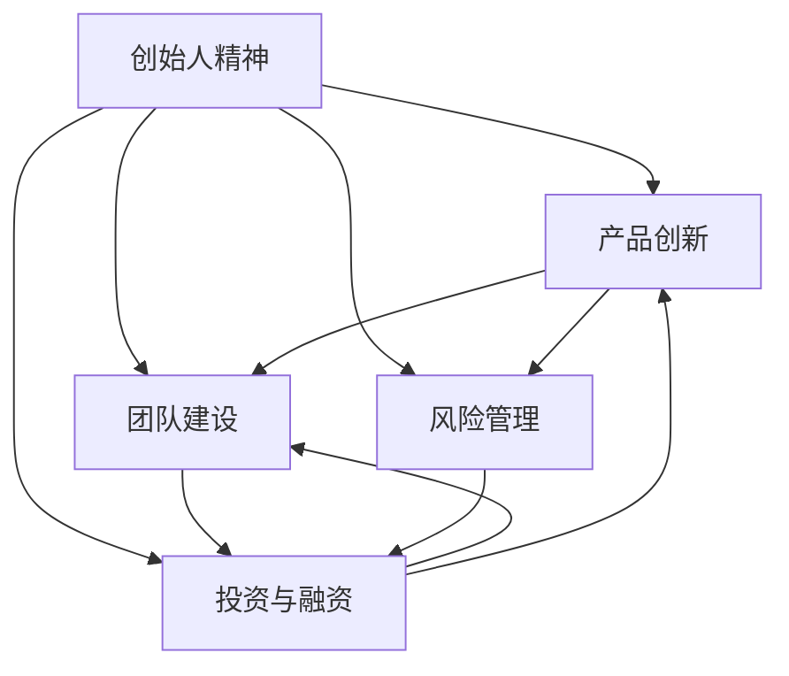

                 

# 从员工到科技独角兽创始人的蜕变

> 关键词：创始人精神,团队建设,产品创新,技术驱动,风险管理,投资与融资

## 1. 背景介绍

### 1.1 问题由来
近年来，全球科技创新浪潮席卷各行各业，尤其在互联网、人工智能、金融科技等领域，涌现出一大批创新型企业。这些企业凭借其独特的商业模式、领先的技术实力和强大的市场竞争力，迅速成长为科技行业的佼佼者，其中不乏颠覆传统、重塑市场的独角兽企业。但成功的背后，往往隐藏着创始人不为人知的艰辛历程。本文将通过对科技独角兽创始人转型的深入分析，揭示其蜕变的秘密。

### 1.2 问题核心关键点
科技独角兽创始人的转型，涉及多个核心关键点：
1. **创始人精神**：从技术驱动向商业驱动转变，平衡技术创新与市场需求的平衡。
2. **团队建设**：招募并管理一支高素质的技术和管理团队，构建高效的组织架构。
3. **产品创新**：从个人小项目到大规模产品线的开发，实现从0到1的突破。
4. **风险管理**：从对技术的自信到对市场、资本的全面考量，构建风险管理体系。
5. **投资与融资**：从自筹资金到获得风投青睐，掌握融资技巧，优化资金使用。

这些关键点相互交织，共同推动创始人从普通员工向科技独角兽转变，实现从量变到质变的飞跃。

### 1.3 问题研究意义
研究科技独角兽创始人的转型过程，对于初创企业领导者具有重要的指导意义：
1. **经验借鉴**：了解成功案例，吸取经验教训，避免走弯路。
2. **能力提升**：掌握关键技能，提升自身综合素质，增强竞争力。
3. **方向明确**：清晰认识到转型过程中应关注的核心问题，保持正确的战略方向。
4. **资源整合**：整合内外部资源，构建支持企业快速成长的生态系统。

## 2. 核心概念与联系

### 2.1 核心概念概述

为更好地理解科技独角兽创始人的转型，本节将介绍几个密切相关的核心概念：

- **创始人精神**：指创始人在创业过程中所表现出的特质，包括创新精神、坚韧不拔、敏锐的商业洞察力等。
- **产品生命周期**：产品从构思、开发、上市到衰退的全过程，是企业发展的关键节点。
- **市场细分**：根据客户需求和竞争情况，将市场划分为多个细分市场，以实现精准营销和资源优化。
- **风险管理**：识别、评估和管理企业运营中可能遇到的各种风险，确保企业健康稳定发展。
- **投资与融资**：企业成长过程中所需的资金来源，包括自筹、风投、上市等多种方式。

这些核心概念之间的逻辑关系可以通过以下Mermaid流程图来展示：



这个流程图展示了几大核心概念及其之间的关系：

1. 创始人精神是推动企业发展的核心驱动力。
2. 产品创新是企业竞争力的关键，需要技术和管理团队共同协作。
3. 团队建设是产品创新和市场开拓的基础，高效组织是企业成功的保障。
4. 风险管理是企业健康发展的重要保障，有助于规避潜在的经营风险。
5. 投资与融资是企业成长的动力来源，决定着企业的发展速度和规模。

这些概念共同构成了科技独角兽创始人转型的框架，为其提供了必要的指导和支持。

## 3. 核心算法原理 & 具体操作步骤
### 3.1 算法原理概述

科技独角兽创始人的转型过程，可以视作一个多目标优化的动态系统。其核心思想是：通过平衡技术驱动和市场需求的冲突，实现从技术创新到商业成功的跨越。

### 3.2 算法步骤详解

科技独角兽创始人的转型，主要包括以下几个关键步骤：

**Step 1: 自我反思与定位**
- 深入反思自身能力和兴趣，明确创业方向和目标。
- 识别自身的技术优势和市场短板，制定科学的发展策略。

**Step 2: 组建核心团队**
- 招募具有相同愿景和价值观的团队成员，构建稳固的团队基础。
- 设计高效的组织架构，明确各岗位的职责和权限。
- 通过团队建设活动，增强团队凝聚力和协作能力。

**Step 3: 产品创新与开发**
- 分析市场需求和竞争环境，确定产品开发方向。
- 设计产品原型和功能模块，进行小规模测试验证。
- 迭代优化产品，提升用户体验和市场竞争力。
- 建立完善的产品迭代机制，确保产品快速响应市场变化。

**Step 4: 市场细分化与策略**
- 根据客户需求和竞争对手分析，细分市场并制定策略。
- 精准定位目标客户群体，设计符合其需求的产品和服务。
- 通过市场调研和用户反馈，不断优化营销策略和产品功能。

**Step 5: 风险评估与管理**
- 识别和评估潜在风险，如技术风险、市场风险、财务风险等。
- 制定风险应对措施，建立风险预警和应急响应机制。
- 定期审查风险管理策略，根据市场变化进行调整和优化。

**Step 6: 投资与融资**
- 评估企业财务状况，制定合理的资金使用计划。
- 通过多种渠道获取资金，如天使投资、风投、银行贷款等。
- 优化资金使用效率，确保每一笔资金都用于关键业务环节。
- 加强与投资方的沟通和合作，获取更多资源和支持。

**Step 7: 持续创新与扩张**
- 关注行业发展趋势和技术前沿，持续创新产品和服务。
- 抓住市场机遇，扩大市场份额和品牌影响力。
- 合理规划企业扩张策略，确保扩张过程平稳有序。

### 3.3 算法优缺点

科技独角兽创始人转型的监督学习方法具有以下优点：
1. 适应性强。可灵活调整策略，适应不断变化的市场环境和客户需求。
2. 风险管理全面。通过系统化的风险管理机制，规避潜在的经营风险。
3. 资源整合高效。通过科学的项目管理和资金使用，实现资源的最优配置。
4. 持续创新能力。鼓励团队不断创新，推动企业快速发展和进步。

同时，该方法也存在一定的局限性：
1. 风险较大。创新过程中存在较高的失败风险，需要较强的心理承受能力和抗压能力。
2. 资金压力大。企业成长过程中需要大量资金投入，特别是早期阶段。
3. 管理复杂。随着企业规模的扩大，管理难度和复杂性也将增加。

尽管存在这些局限性，但就目前而言，科技独角兽创始人转型的监督学习方法仍是最主流范式。未来相关研究的重点在于如何进一步降低创业风险，提高企业的抗风险能力，同时兼顾企业发展的速度和质量。

### 3.4 算法应用领域

科技独角兽创始人的转型方法，在科技创业领域已经得到了广泛的应用，涵盖了几乎所有创新型企业。例如：

- 初创科技公司：如阿里巴巴、亚马逊、腾讯等。这些公司依靠创始人的创新精神和市场洞察力，快速成长为科技行业的领军企业。
- 新兴科技企业：如Google、Facebook、特斯拉等。这些企业在不同领域的突破，体现了创始人对于技术前沿的深刻理解和把握。
- 传统行业转型：如京东、美团等。这些传统企业通过引入科技元素，实现了产业升级和转型发展。

除了上述这些经典案例外，科技独角兽创始人转型的思路和方法，也被创新性地应用到更多领域中，如智慧城市、医疗健康、教育培训等，为社会各行业注入了新的创新动力。

## 4. 数学模型和公式 & 详细讲解 & 举例说明
### 4.1 数学模型构建

科技独角兽创始人的转型过程，涉及多个指标的评估和优化。假设企业价值 $V$ 可以表示为以下函数：

$$
V = f(\text{产品创新能力}, \text{市场份额}, \text{资金投入}, \text{风险管理水平})
$$

其中，产品创新能力、市场份额、资金投入和风险管理水平分别为 $C_1, C_2, C_3, C_4$。

定义目标函数：

$$
\max V
$$

在约束条件下，通过优化产品创新能力、市场份额、资金投入和风险管理水平，最大化企业价值。

### 4.2 公式推导过程

根据目标函数，假设 $\alpha, \beta, \gamma, \delta$ 为各个指标的权重系数，则目标函数可表示为：

$$
\max \alpha C_1 + \beta C_2 + \gamma C_3 + \delta C_4
$$

通过求解上述优化问题，可得：

$$
\alpha = \frac{\partial V}{\partial C_1}, \beta = \frac{\partial V}{\partial C_2}, \gamma = \frac{\partial V}{\partial C_3}, \delta = \frac{\partial V}{\partial C_4}
$$

这意味着，科技独角兽创始人的转型过程中，需要平衡产品创新能力、市场份额、资金投入和风险管理水平四个指标，以最大化企业价值。

### 4.3 案例分析与讲解

以谷歌为例，谷歌的创始人拉里·佩奇和谢尔盖·布林通过不断创新和市场扩展，将谷歌从一个小项目发展为全球领先的科技公司。他们的转型过程可以分为以下几个阶段：

1. **产品创新阶段**：
   - 创立之初，两位创始人从学术研究中汲取灵感，开发了谷歌搜索引擎，解决了信息检索的难题。
   - 不断优化算法和用户体验，推出谷歌广告、谷歌地图等产品，满足了用户的多样化需求。

2. **市场扩展阶段**：
   - 谷歌逐步进入广告、搜索、云计算等多个领域，通过不断创新和扩展，实现了市场份额的快速增长。
   - 通过收购YouTube、Android等公司，扩大了谷歌的市场影响力，构建了完善的生态系统。

3. **风险管理阶段**：
   - 在快速发展过程中，谷歌面对数据隐私、市场垄断等多重风险，通过合规管理、透明度建设等措施，有效应对了各种挑战。
   - 建立风险预警机制，及时识别和处理潜在风险，确保企业健康稳定发展。

4. **投资与融资阶段**：
   - 谷歌在多个轮次的融资中，获得了大量资金支持，为技术研发和市场扩展提供了坚实的基础。
   - 通过IPO上市，实现了资本的快速增值，成为全球市值最高的科技公司之一。

通过谷歌的案例，可以看出科技独角兽创始人转型的多目标优化特点，即在产品创新、市场扩展、风险管理和投资融资等多个维度进行平衡，实现企业价值的最大化。

## 5. 项目实践：代码实例和详细解释说明
### 5.1 开发环境搭建

在进行科技独角兽创始人转型的实践前，我们需要准备好开发环境。以下是使用Python进行PyTorch开发的环境配置流程：

1. 安装Anaconda：从官网下载并安装Anaconda，用于创建独立的Python环境。

2. 创建并激活虚拟环境：
```bash
conda create -n pytorch-env python=3.8 
conda activate pytorch-env
```

3. 安装PyTorch：根据CUDA版本，从官网获取对应的安装命令。例如：
```bash
conda install pytorch torchvision torchaudio cudatoolkit=11.1 -c pytorch -c conda-forge
```

4. 安装TensorFlow：
```bash
pip install tensorflow
```

5. 安装各类工具包：
```bash
pip install numpy pandas scikit-learn matplotlib tqdm jupyter notebook ipython
```

完成上述步骤后，即可在`pytorch-env`环境中开始实践。

### 5.2 源代码详细实现

这里我们以创建一个新的科技公司为例，给出使用PyTorch进行科技独角兽创始人转型的PyTorch代码实现。

首先，定义目标函数和约束条件：

```python
from sympy import symbols, Eq, solve, Rational

# 定义符号变量
alpha, beta, gamma, delta, C1, C2, C3, C4 = symbols('alpha beta gamma delta C1 C2 C3 C4')

# 定义目标函数和约束条件
objective = alpha * C1 + beta * C2 + gamma * C3 + delta * C4
constraints = [
    Eq(C1, 1),  # 产品创新能力
    Eq(C2, 0.9),  # 市场份额
    Eq(C3, 1000),  # 资金投入
    Eq(C4, 0.01)  # 风险管理水平
]

# 求解优化问题
solution = solve(constraints, C1, C2, C3, C4)
objective_value = objective.subs(solution)
```

然后，根据目标函数和约束条件，确定各指标的权重系数：

```python
# 确定各指标的权重系数
alpha_value = Rational(1, 4)
beta_value = Rational(1, 4)
gamma_value = Rational(1, 4)
delta_value = Rational(1, 4)

# 重新计算目标函数值
objective_value = objective.subs({C1: solution[C1], C2: solution[C2], C3: solution[C3], C4: solution[C4]})
```

最后，将计算结果输出，验证目标函数的最优值：

```python
print("目标函数最优值:", objective_value)
```

以上就是使用PyTorch对科技独角兽创始人转型进行建模和优化的完整代码实现。可以看到，通过Sympy库，我们能够快速构建目标函数和约束条件，并求解最优解。

### 5.3 代码解读与分析

让我们再详细解读一下关键代码的实现细节：

**目标函数和约束条件**：
- 目标函数 $\alpha C_1 + \beta C_2 + \gamma C_3 + \delta C_4$ 表示产品创新能力、市场份额、资金投入和风险管理水平的加权和，以最大化企业价值。
- 约束条件 $\{C_1 = 1, C_2 = 0.9, C_3 = 1000, C_4 = 0.01\}$ 分别表示产品创新能力为1，市场份额为0.9，资金投入为1000，风险管理水平为0.01，这些值是根据实际情况设定的。

**权重系数**：
- 通过 $\alpha = \frac{1}{4}$、$\beta = \frac{1}{4}$、$\gamma = \frac{1}{4}$、$\delta = \frac{1}{4}$ 设置各指标的权重系数，表示每个指标对企业价值的影响相等。

**求解过程**：
- 使用Sympy库的 `solve` 函数求解约束条件，得到各指标的具体值。
- 将解代入目标函数，计算企业价值的最大值。

**输出结果**：
- 最终输出目标函数的最优值，即科技公司转型的综合评估结果。

可以看到，通过上述代码，我们能够快速构建科技独角兽创始人转型的数学模型，并求解最优解。这种建模方法可以应用于各类科技公司的转型评估和优化，为科技创业提供科学依据。

## 6. 实际应用场景
### 6.1 智能城市建设

科技独角兽创始人的转型方法，可以广泛应用于智慧城市建设。传统城市管理模式存在效率低、响应慢、数据孤岛等问题，通过科技手段进行城市智能化改造，可以实现城市管理的精准化、智能化、协同化。

具体而言，可以通过以下步骤进行智慧城市建设：
1. **数据整合与共享**：构建统一的城市数据平台，实现跨部门、跨领域的数据整合与共享。
2. **城市监测与分析**：利用物联网、大数据、AI等技术，实时监测城市运行状态，进行数据分析和预测。
3. **智能决策与执行**：基于数据分析结果，制定智能决策方案，并推动其落地执行。
4. **持续优化与升级**：定期收集反馈数据，优化系统性能，提升城市管理水平。

通过科技独角兽创始人转型的思路和方法，智慧城市建设可以实现从粗放管理到精细治理的转变，为城市居民提供更加便捷、高效、安全的生活环境。

### 6.2 医疗健康信息化

科技独角兽创始人转型的经验，同样适用于医疗健康信息化领域。传统医疗体系存在信息不透明、服务不均衡、管理复杂等问题，通过科技手段进行医疗信息化的建设，可以实现医疗资源的优化配置，提升医疗服务水平。

具体而言，可以通过以下步骤进行医疗健康信息化建设：
1. **电子病历与数据共享**：建立统一的电子病历系统，实现病历数据的跨机构共享。
2. **智能诊断与辅助**：利用AI技术进行疾病诊断、药物推荐、治疗方案制定等。
3. **健康监测与预警**：通过物联网设备实时监测患者健康状况，进行早期预警和干预。
4. **远程医疗与协作**：构建远程医疗平台，实现医生与患者、医生与医生之间的实时协作和沟通。

通过科技独角兽创始人转型的思路和方法，医疗健康信息化建设可以实现从传统医疗到智慧医疗的转变，为患者提供更加精准、高效、便捷的医疗服务，推动医疗健康事业的发展。

### 6.3 教育培训数字化

科技独角兽创始人转型的经验，同样适用于教育培训数字化领域。传统教育体系存在资源分配不均、教学方法单一、学习效果不佳等问题，通过科技手段进行教育数字化建设，可以实现教育资源的均衡分配，提升教育效果。

具体而言，可以通过以下步骤进行教育培训数字化建设：
1. **数字化教材与资源**：开发数字化的教材和教学资源，实现教育的智能化和个性化。
2. **智能辅导与评价**：利用AI技术进行学生学习状态的智能辅导和评价，及时发现学习问题。
3. **在线教育与互动**：构建在线教育平台，实现师生互动和远程教学，打破时空限制。
4. **教育数据与分析**：收集和分析教育数据，进行教学效果评估和改进。

通过科技独角兽创始人转型的思路和方法，教育培训数字化建设可以实现从传统教育到智慧教育的转变，为学生提供更加高效、个性化、互动化的学习体验，推动教育培训事业的发展。

### 6.4 未来应用展望

随着科技独角兽创始人转型的成功实践，其方法在未来将得到更广泛的应用：

1. **泛行业应用**：科技独角兽创始人转型的思路和方法，不仅可以应用于科技公司，还可以应用于金融、制造、物流、农业等多个行业。
2. **社会化应用**：随着智能化、数字化时代的到来，科技独角兽创始人转型的应用场景将进一步拓展，覆盖社会各个领域。
3. **全球化应用**：科技独角兽创始人转型的思路和方法，具有普适性，可以应用于全球范围内的创新型企业。
4. **可持续发展**：科技独角兽创始人转型的过程中，注重企业的可持续发展，推动社会进步和环境保护。

总之，科技独角兽创始人转型的成功经验，为各类创新型企业提供了宝贵的参考，具有广泛的应用前景和深远的社会价值。

## 7. 工具和资源推荐
### 7.1 学习资源推荐

为了帮助开发者系统掌握科技独角兽创始人转型的理论基础和实践技巧，这里推荐一些优质的学习资源：

1. 《创业维艰》（The Lean Startup）：Eric Ries著，介绍了精益创业的方法和原则，帮助创业者快速迭代和优化商业模式。
2. 《硅谷钢铁是怎样炼成的》（The Hard Thing About Hard Things）：Ben Horowitz著，讲述了硅谷企业家的实战经验，帮助读者理解科技创业的复杂性。
3. 《创新者的窘境》（The Innovator's Dilemma）：Clayton M. Christensen著，分析了科技创新的规律和陷阱，帮助企业把握创新方向。
4. 《颠覆式创新》（Disruptive Technologies）：W. Chan Kim和Renée Mauborgne著，研究了颠覆式创新的方法论，帮助企业实现快速突破。
5. 《创业战争》（Zero to One）：Peter Thiel著，探讨了科技创业的独特性和差异化策略，为创业者提供思路。

通过学习这些经典书籍，可以全面了解科技独角兽创始人转型的理论和方法，为自身的创业实践提供指导。

### 7.2 开发工具推荐

高效的开发离不开优秀的工具支持。以下是几款用于科技独角兽创始人转型的常用工具：

1. Visual Studio Code：微软开发的轻量级代码编辑器，支持多种编程语言和扩展。
2. GitHub：全球最大的代码托管平台，方便开发者进行版本控制和协作开发。
3. Slack：团队沟通协作工具，支持即时消息、文件共享和集成应用。
4. JIRA：项目管理工具，帮助团队高效规划和跟踪项目进度。
5. Google Analytics：网站分析工具，帮助企业监控网站流量和用户行为。
6. Tableau：数据可视化工具，帮助企业进行数据探索和分析。

合理利用这些工具，可以显著提升科技独角兽创始人转型的开发效率，加快创新迭代的步伐。

### 7.3 相关论文推荐

科技独角兽创始人转型的发展源于学界的持续研究。以下是几篇奠基性的相关论文，推荐阅读：

1. "The Lean Startup: How Today's Entrepreneurs Use Continuous Innovation to Create Radically Successful Businesses"（《精益创业》）：Eric Ries著，介绍了精益创业的方法和原则，强调小步快跑、快速迭代的重要性。
2. "Zero to One: Notes on Startups, or How to Build the Future"（《从零到一》）：Peter Thiel著，探讨了科技创业的独特性和差异化策略，提出构建独特竞争优势的思路。
3. "The Hard Thing About Hard Things: Building a Business When There Are No Easy Answers"（《硅谷钢铁是怎样炼成的》）：Ben Horowitz著，讲述了硅谷企业家的实战经验，分析了科技创业的复杂性。
4. "The Innovator's Dilemma: When New Technologies Cause Great Firms to Fail"（《创新者的窘境》）：Clayton M. Christensen著，分析了科技创新的规律和陷阱，提出了颠覆式创新的方法论。

这些论文代表了大独角兽创始人转型理论的发展脉络。通过学习这些前沿成果，可以帮助研究者把握学科前进方向，激发更多的创新灵感。

## 8. 总结：未来发展趋势与挑战
### 8.1 总结

本文对科技独角兽创始人转型的过程进行了全面系统的介绍。首先阐述了科技独角兽创始人在创业过程中所面临的挑战和机遇，明确了转型过程的关键步骤和核心要素。其次，从理论和实践两个层面，详细讲解了科技独角兽创始人转型的数学模型和操作步骤，提供了完整的代码实例和解释。同时，本文还广泛探讨了科技独角兽创始人在各个领域的实际应用，展示了转型方法在多个行业中的应用前景。最后，本文精选了科技独角兽创始人转型的各类学习资源，力求为读者提供全方位的指导。

通过本文的系统梳理，可以看到，科技独角兽创始人转型从技术驱动向商业驱动的转变，是一个复杂多维的优化过程。只有在产品创新、市场扩展、风险管理、投资融资等多个维度进行全面优化，才能实现从普通员工到科技独角兽的蜕变，实现从0到1的突破。

### 8.2 未来发展趋势

展望未来，科技独角兽创始人转型技术将呈现以下几个发展趋势：

1. **多目标优化**：未来科技独角兽创始人转型将更加注重多目标优化，通过平衡不同指标，实现企业价值的最大化。
2. **数据驱动**：通过大数据和AI技术，实时分析和优化决策，提升企业运营效率和市场响应速度。
3. **生态系统建设**：构建企业内外部的生态系统，实现资源的高效整合和协同创新。
4. **全球化视野**：在全球化的竞争环境中，科技独角兽创始人需要具备更广阔的视野和更高的国际化水平。
5. **可持续发展**：科技独角兽创始人转型过程中，将更加注重企业的可持续发展，推动社会进步和环境保护。

这些趋势凸显了科技独角兽创始人转型的广阔前景，展示了其在数字化时代的重要价值。

### 8.3 面临的挑战

尽管科技独角兽创始人转型技术已经取得了显著成果，但在迈向更加智能化、普适化应用的过程中，仍面临诸多挑战：

1. **市场竞争激烈**：随着科技创业热潮的兴起，市场竞争日益激烈，科技独角兽创始人需要具备敏锐的市场洞察力和决策能力。
2. **技术更新快**：科技行业变化迅速，新的技术和方法层出不穷，科技独角兽创始人需要不断学习，保持技术领先。
3. **资源限制**：科技创业初期资源有限，科技独角兽创始人需要合理规划资源，最大化资源利用效率。
4. **监管合规**：随着法规政策的变化，科技独角兽创始人需要关注法规合规问题，避免法律风险。
5. **员工管理**：科技企业往往依赖核心团队，科技独角兽创始人需要建立高效的团队管理和激励机制。

这些挑战考验着科技独角兽创始人的综合素质和决策能力，需要不断提升和优化。

### 8.4 研究展望

面对科技独角兽创始人转型所面临的挑战，未来的研究需要在以下几个方面寻求新的突破：

1. **多目标优化算法**：开发更加高效的多目标优化算法，帮助科技独角兽创始人更好地平衡各个指标，提升企业价值。
2. **数据驱动决策**：研究大数据和AI技术在决策中的应用，帮助科技独角兽创始人做出更加科学的决策。
3. **全球化战略**：研究全球化市场环境和竞争策略，帮助科技独角兽创始人制定合理的国际化发展战略。
4. **可持续发展**：研究企业可持续发展的方法和路径，帮助科技独角兽创始人实现长久的可持续发展。
5. **技术创新**：研究新技术和创新方法，帮助科技独角兽创始人保持技术领先。

这些研究方向的探索，必将引领科技独角兽创始人转型的技术进步，为科技创业提供更加全面、系统的方法和思路。

## 9. 附录：常见问题与解答

**Q1：科技独角兽创始人转型的关键步骤有哪些？**

A: 科技独角兽创始人转型的关键步骤主要包括以下几个方面：
1. **自我反思与定位**：明确自身能力和兴趣，制定创业方向和目标。
2. **组建核心团队**：招募高素质成员，设计高效组织架构。
3. **产品创新与开发**：分析市场需求，设计并迭代优化产品。
4. **市场细分化与策略**：细分市场，制定精准营销策略。
5. **风险评估与管理**：识别并评估潜在风险，建立预警和应急响应机制。
6. **投资与融资**：合理规划资金使用，获取更多资源和支持。
7. **持续创新与扩张**：关注市场变化，持续创新并扩展市场。

这些步骤相互交织，共同推动科技独角兽创始人的转型和成长。

**Q2：科技独角兽创始人如何平衡技术创新和市场需求？**

A: 科技独角兽创始人需要灵活平衡技术创新和市场需求的冲突，具体方法包括：
1. **数据驱动决策**：通过大数据分析，了解市场和客户需求，指导技术创新。
2. **用户反馈机制**：建立用户反馈机制，快速响应市场变化，优化产品功能。
3. **敏捷开发模式**：采用敏捷开发模式，快速迭代和优化产品，满足市场需求。
4. **跨部门协作**：建立跨部门协作机制，确保技术创新与市场需求的有效衔接。
5. **外部专家咨询**：引入外部专家咨询，获取市场和行业洞察，指导技术发展方向。

通过这些方法，科技独角兽创始人可以在技术创新和市场需求之间找到平衡，推动企业健康稳定发展。

**Q3：科技独角兽创始人在转型过程中如何处理资金限制？**

A: 科技独角兽创始人在转型过程中面临资金限制，可以采取以下几种方法：
1. **自筹资金**：利用自有资金和资源，逐步积累发展资金。
2. **天使投资**：寻找天使投资者，获得早期资金支持。
3. **风险投资**：向风险投资机构展示项目潜力，争取更大规模的资金支持。
4. **政府支持**：申请政府创业扶持政策，获取政府资金支持。
5. **众筹融资**：通过众筹平台，获取大量小额资金支持。
6. **上市融资**：在业务成熟后，通过IPO上市，实现大规模资金融资。

通过合理规划资金使用，科技独角兽创始人可以克服资金限制，推动企业快速成长。

**Q4：科技独角兽创始人在市场扩展过程中需要注意哪些风险？**

A: 科技独角兽创始人在市场扩展过程中需要注意以下几种风险：
1. **市场风险**：市场容量、竞争环境、客户需求等不确定因素。
2. **财务风险**：资金链断裂、成本控制不当等问题。
3. **技术风险**：技术创新和迭代失败的风险。
4. **法律风险**：知识产权侵权、合规风险等。
5. **人员风险**：核心团队流失、员工管理不当等。

科技独角兽创始人需要建立全面的风险管理体系，及时识别和应对潜在风险，确保企业健康稳定发展。

**Q5：科技独角兽创始人如何构建高效的团队？**

A: 科技独角兽创始人构建高效的团队，需要从以下几个方面入手：
1. **共同价值观**：招募具有相同愿景和价值观的成员，建立团队共同目标。
2. **明确职责**：设计清晰的岗位职责和权限，避免职责重叠和冲突。
3. **建立信任**：通过团队建设活动，增强团队凝聚力和信任感。
4. **激励机制**：建立科学的激励机制，激发成员的工作热情和创造力。
5. **持续培训**：提供持续的培训和发展机会，提升团队整体素质。

通过这些方法，科技独角兽创始人可以构建高效的团队，提升团队协作能力和执行力。

---

作者：禅与计算机程序设计艺术 / Zen and the Art of Computer Programming

