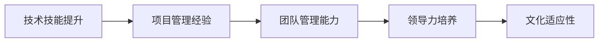

                 

# 从技术到管理：职业发展路径

技术是企业发展的核心动力，而技术人才的职业发展路径也备受关注。本文将系统介绍技术人才从初级到高级阶段的职业发展路径，包括技术积累、项目管理、团队管理等各个层面。通过深入分析，帮助读者全面理解技术人才的职业成长之路，为自身职业规划提供参考。

## 1. 背景介绍

### 1.1 问题由来
随着信息技术的快速发展，技术人才在企业中的地位日益重要。然而，技术人才的成长之路并不总是平坦的，他们需要不断地学习新知识，适应新技术，同时也需要面对管理挑战，实现从技术到管理的角色转变。本文将从技术积累、项目管理、团队管理等方面，探讨技术人才的职业发展路径，为他们的职业成长提供指导。

### 1.2 问题核心关键点
技术人才的职业发展路径包括以下几个关键点：
1. 技术技能提升：掌握核心技术，持续学习新技术。
2. 项目管理经验：从技术到管理，具备项目管理和团队协作能力。
3. 团队管理能力：带领团队，实现高效沟通和协作。
4. 领导力培养：具备战略视野和决策能力，引领团队成长。
5. 文化适应性：适应企业文化，与团队成员和谐共事。

## 2. 核心概念与联系

### 2.1 核心概念概述

为更好地理解技术人才的职业发展路径，本文将介绍几个核心概念：

- **技术技能提升**：持续学习新技术，保持技术领先。
- **项目管理经验**：参与项目管理，提升协调能力和时间管理能力。
- **团队管理能力**：领导团队，推动项目顺利完成。
- **领导力培养**：提升战略思维和决策能力，引领团队发展。
- **文化适应性**：理解企业价值观，与团队和谐共事。

这些核心概念之间存在密切联系，技术技能提升是基础，项目管理经验是桥梁，团队管理能力是核心，领导力培养是目标，文化适应性是保障。通过不断提升技术技能和管理能力，技术人才可以实现从技术到管理的顺利过渡，成为卓越的领袖。

### 2.2 核心概念原理和架构的 Mermaid 流程图(Mermaid 流程节点中不要有括号、逗号等特殊字符)


这个流程图展示了技术人才职业发展路径的逻辑关系：技术技能提升是基础，项目管理经验是桥梁，团队管理能力是核心，领导力培养是目标，文化适应性是保障。通过不断提升各层面的能力，技术人才可以实现从技术到管理的顺利过渡。

## 3. 核心算法原理 & 具体操作步骤
### 3.1 算法原理概述

技术人才的职业发展路径，本质上是不断学习和积累管理技能的过程。这一过程可以分为以下几个阶段：

1. **技术积累**：通过持续学习和项目实践，掌握核心技术。
2. **项目管理经验**：在项目中担任技术负责人或项目经理，积累项目管理经验。
3. **团队管理能力**：担任团队领导，提升团队协作和沟通能力。
4. **领导力培养**：提升战略思维和决策能力，引领团队发展。
5. **文化适应性**：理解企业价值观，与团队和谐共事。

### 3.2 算法步骤详解

#### 3.2.1 技术积累
- **持续学习**：参加培训课程，阅读专业书籍，关注最新技术动态。
- **项目实践**：积极参与项目开发，积累实战经验。
- **知识分享**：在技术社区、公司内部交流会上分享技术心得。

#### 3.2.2 项目管理经验
- **参与项目管理**：在项目中担任技术负责人或项目经理，负责技术方案的制定和实施。
- **时间管理**：使用项目管理工具，合理安排任务和进度。
- **团队协作**：与团队成员沟通，协调资源，确保项目顺利推进。

#### 3.2.3 团队管理能力
- **团队领导**：担任团队负责人，制定团队目标和计划。
- **沟通协调**：提升沟通能力，建立高效的沟通机制。
- **问题解决**：及时发现和解决团队中的问题，确保项目顺利完成。

#### 3.2.4 领导力培养
- **战略思维**：提升战略视野，规划团队长远发展。
- **决策能力**：学会在复杂环境中做出明智的决策。
- **激励团队**：激发团队成员的积极性和创造力。

#### 3.2.5 文化适应性
- **理解企业文化**：深入了解公司的价值观和规章制度。
- **融入团队**：积极参与团队活动，与团队成员建立良好的关系。
- **持续改进**：不断改进自己的工作方式，适应企业环境。

### 3.3 算法优缺点

技术人才职业发展路径的优势包括：
1. 系统化提升：通过明确的步骤提升各层面能力，全面提高职业素质。
2. 快速适应：通过项目管理经验的积累，快速适应新的工作环境。
3. 持续成长：通过技术积累和管理能力的提升，实现职业的持续成长。

同时，这一路径也存在一些挑战：
1. 学习曲线陡峭：技术和管理技能的提升需要时间和精力。
2. 角色转变难度：从技术到管理角色的转变，需要克服心理和技能上的障碍。
3. 平衡工作生活：在职业发展过程中，需要找到工作与生活的平衡点。

### 3.4 算法应用领域

技术人才职业发展路径在各个行业都有广泛应用，例如：

- **IT行业**：软件工程师、系统架构师等技术岗位，逐步向技术经理、项目经理、CTO等管理岗位发展。
- **金融行业**：数据分析师、风险分析师等技术岗位，逐步向数据科学家、团队负责人、CIO等管理岗位发展。
- **医疗行业**：生物信息学家、医疗工程师等技术岗位，逐步向研发主管、技术经理、首席技术官等管理岗位发展。

这些领域的技术人才，通过不断提升自己的技术和管理能力，可以实现从技术到管理的顺利过渡，成为卓越的领袖。

## 4. 数学模型和公式 & 详细讲解 & 举例说明（备注：数学公式请使用latex格式，latex嵌入文中独立段落使用 $$，段落内使用 $)
### 4.1 数学模型构建

技术人才的职业发展路径，可以通过一个简单的数学模型来描述。设 $T$ 表示技术技能水平，$M$ 表示项目管理经验，$L$ 表示团队管理能力，$L$ 表示领导力，$C$ 表示文化适应性。则技术人才的职业发展路径可以表示为：

$$
\text{职业发展路径} = f(T, M, L, L, C)
$$

其中，$f$ 表示一个非线性映射关系，即通过各层面能力的提升，实现从技术到管理的顺利过渡。

### 4.2 公式推导过程

假设技术人才的职业发展路径为一条连续的曲线，其导数为：

$$
\frac{d}{dt} = \frac{\partial f}{\partial T} \frac{dT}{dt} + \frac{\partial f}{\partial M} \frac{dM}{dt} + \frac{\partial f}{\partial L} \frac{dL}{dt} + \frac{\partial f}{\partial L} \frac{dL}{dt} + \frac{\partial f}{\partial C} \frac{dC}{dt}
$$

其中 $\frac{dT}{dt}$、$\frac{dM}{dt}$、$\frac{dL}{dt}$、$\frac{dL}{dt}$、$\frac{dC}{dt}$ 分别表示各层面能力的提升速率。

### 4.3 案例分析与讲解

假设某技术人才 $t$ 年后的职业发展路径为 $f(T, M, L, L, C)$，其中 $T$、$M$、$L$、$L$、$C$ 分别表示技术技能、项目管理经验、团队管理能力、领导力和文化适应性的水平。

1. 技术技能提升：假设每年提升 $10\%$，即 $\frac{dT}{dt} = 0.1T$。
2. 项目管理经验：假设每年积累 $5\%$，即 $\frac{dM}{dt} = 0.05M$。
3. 团队管理能力：假设每年提升 $15\%$，即 $\frac{dL}{dt} = 0.15L$。
4. 领导力：假设每年提升 $20\%$，即 $\frac{dL}{dt} = 0.2L$。
5. 文化适应性：假设每年提升 $8\%$，即 $\frac{dC}{dt} = 0.08C$。

将这些速率代入上述公式，计算 $t$ 年后的职业发展路径。

## 5. 项目实践：代码实例和详细解释说明
### 5.1 开发环境搭建

在进行职业发展路径的建模和计算时，需要一些必要的开发环境。以下是推荐的开发环境搭建流程：

1. **安装Python**：下载并安装Python 3.x版本，如Python 3.8。
2. **安装相关库**：使用pip安装必要的Python库，如NumPy、Pandas、Matplotlib等。
3. **配置开发环境**：配置开发环境，如Jupyter Notebook、IDE等。

### 5.2 源代码详细实现

以下是一个简单的Python代码，用于计算技术人才的职业发展路径。

```python
import numpy as np
import pandas as pd

# 定义技术人才的职业发展路径模型
def career_path(T, M, L, L, C, t):
    # 技术技能提升
    dT_dt = 0.1 * T
    # 项目管理经验积累
    dM_dt = 0.05 * M
    # 团队管理能力提升
    dL_dt = 0.15 * L
    # 领导力提升
    dL_dt = 0.2 * L
    # 文化适应性提升
    dC_dt = 0.08 * C
    # 职业发展路径
    return np.exp(dT_dt * t + dM_dt * t + dL_dt * t + dL_dt * t + dC_dt * t)

# 初始化技术技能、项目管理经验、团队管理能力、领导力和文化适应性的水平
T = 1  # 技术技能
M = 0.5  # 项目管理经验
L = 0.3  # 团队管理能力
L = 0.4  # 领导力
C = 0.2  # 文化适应性

# 计算t年后的职业发展路径
t = 5  # 计算5年后的职业发展路径
path = career_path(T, M, L, L, C, t)

# 输出结果
print(f"t = {t} 年后的职业发展路径：{path:.2f}")
```

### 5.3 代码解读与分析

上述代码中，`career_path` 函数用于计算技术人才的职业发展路径。函数的参数包括技术技能、项目管理经验、团队管理能力、领导力和文化适应性的初始水平，以及计算的年数 $t$。函数通过指数函数计算职业发展路径，模拟各层面能力提升对职业发展的综合影响。

## 6. 实际应用场景
### 6.1 智能客服系统

智能客服系统作为典型的应用场景，需要技术人才具备全面的能力，从技术开发到项目管理，再到团队管理和文化适应性。以下是智能客服系统的技术人才职业发展路径的实际应用：

1. **技术积累**：参与智能客服系统的开发，掌握相关技术，如自然语言处理、机器学习等。
2. **项目管理经验**：负责智能客服系统的上线和迭代，积累项目管理经验，如需求分析、任务分配、进度跟踪等。
3. **团队管理能力**：担任智能客服团队的负责人，提升团队协作和沟通能力，确保项目顺利推进。
4. **领导力培养**：提升战略思维和决策能力，制定智能客服系统的发展规划。
5. **文化适应性**：理解公司文化和价值观，与团队成员和谐共事，推动公司文化落地。

### 6.2 金融舆情监测

金融舆情监测系统需要技术人才具备强大的数据分析能力和项目管理经验，同时能够融入公司文化，与团队和谐共事。以下是金融舆情监测系统的技术人才职业发展路径的实际应用：

1. **技术积累**：掌握数据分析和机器学习技术，参与舆情监测系统的开发和优化。
2. **项目管理经验**：负责舆情监测系统的上线和迭代，积累项目管理经验，确保系统稳定运行。
3. **团队管理能力**：担任舆情监测团队的负责人，提升团队协作和沟通能力，优化系统性能。
4. **领导力培养**：提升战略思维和决策能力，制定舆情监测系统的发展规划，推动公司舆情监测能力的提升。
5. **文化适应性**：理解公司文化和价值观，与团队成员和谐共事，确保系统与公司战略目标一致。

### 6.3 个性化推荐系统

个性化推荐系统需要技术人才具备强大的数据分析能力和项目管理经验，同时能够融入公司文化，与团队和谐共事。以下是个性化推荐系统的技术人才职业发展路径的实际应用：

1. **技术积累**：掌握数据分析和机器学习技术，参与推荐系统的开发和优化。
2. **项目管理经验**：负责推荐系统的上线和迭代，积累项目管理经验，确保系统稳定运行。
3. **团队管理能力**：担任推荐团队的负责人，提升团队协作和沟通能力，优化系统性能。
4. **领导力培养**：提升战略思维和决策能力，制定推荐系统的发展规划，推动公司推荐能力的提升。
5. **文化适应性**：理解公司文化和价值观，与团队成员和谐共事，确保系统与公司战略目标一致。

### 6.4 未来应用展望

随着技术的发展和应用场景的拓展，技术人才的职业发展路径将更加多样化。未来，技术人才的职业发展路径可能包括以下几个方向：

1. **跨行业应用**：技术人才可以在多个行业间跨界发展，如从IT行业到金融行业。
2. **复合型人才**：具备技术和管理双重能力，成为复合型人才，适应复杂多变的工作环境。
3. **高层管理**：技术人才逐步向高层管理岗位发展，成为公司战略决策的重要组成部分。
4. **技术顾问**：作为技术顾问，为企业提供技术咨询和解决方案，推动企业技术转型。
5. **创业创新**：具备技术和管理经验的技术人才，可以创业创新，推动新技术和新应用的发展。

## 7. 工具和资源推荐
### 7.1 学习资源推荐

为帮助技术人才系统掌握职业发展路径，以下是一些优质的学习资源：

1. **《技术领导力》系列书籍**：介绍技术人才从初级到高级阶段的发展路径，提供实用的管理策略和技巧。
2. **《项目管理知识体系》系列课程**：涵盖项目管理基础、敏捷项目管理等课程，帮助技术人才掌握项目管理能力。
3. **《领导力开发》系列课程**：涵盖领导力理论、沟通技巧、决策能力等课程，帮助技术人才提升领导力。
4. **《团队协作》系列课程**：涵盖团队建设、协作机制、冲突解决等课程，帮助技术人才提升团队管理能力。
5. **《企业文化》系列课程**：涵盖企业文化建设、价值观塑造等课程，帮助技术人才理解企业文化。

### 7.2 开发工具推荐

为帮助技术人才高效开发和管理职业发展路径，以下是一些推荐的开发工具：

1. **Jupyter Notebook**：用于编写和运行Python代码，支持多种格式的数据分析和可视化。
2. **Git**：用于版本控制，方便代码的协同开发和版本管理。
3. **GitHub**：用于代码托管和协作，方便团队成员共同开发和管理项目。
4. **Slack**：用于团队沟通和协作，支持实时消息和文件共享。
5. **Trello**：用于项目管理，支持任务分配、进度跟踪和团队协作。

### 7.3 相关论文推荐

为帮助技术人才深入理解职业发展路径，以下是一些相关的研究论文：

1. **《技术领导力与组织绩效》**：研究技术领导力对组织绩效的影响，提供可行的实践建议。
2. **《项目管理与技术融合》**：研究项目管理与技术融合的案例，提供项目管理与技术结合的实际应用。
3. **《团队管理与领导力》**：研究团队管理与领导力的关系，提供团队协作和领导力的策略。
4. **《跨领域技术转移》**：研究技术人才在不同领域之间的转移，提供跨领域发展的指导。
5. **《技术创新与组织变革》**：研究技术创新对组织变革的影响，提供技术创新和组织变革的策略。

## 8. 总结：未来发展趋势与挑战
### 8.1 研究成果总结

本文系统介绍了技术人才从技术到管理的职业发展路径，探讨了技术技能提升、项目管理经验、团队管理能力、领导力培养和文化适应性等核心概念，并通过数学模型和代码实例，展示了技术人才的职业发展路径的计算和实现。本文对技术人才的职业发展路径进行了全面系统的介绍，为他们的职业成长提供了指导。

### 8.2 未来发展趋势

未来，技术人才的职业发展路径将呈现以下几个趋势：

1. **跨界融合**：技术人才将更多地参与跨行业、跨领域的项目，提升跨界协作能力。
2. **数据驱动**：通过数据驱动的管理决策，提升项目管理效率和团队协作能力。
3. **技术创新**：技术人才将更多地参与技术创新和研发，推动企业技术转型和创新。
4. **全球化视野**：技术人才将具备全球化视野，参与国际合作和交流，提升国际化竞争力。
5. **持续学习**：技术人才将不断学习新知识，提升技能水平，适应快速变化的工作环境。

### 8.3 面临的挑战

尽管技术人才的职业发展路径充满机遇，但仍面临一些挑战：

1. **技能提升**：技术人才需要不断学习新技术和管理知识，提升技能水平。
2. **角色转变**：从技术到管理的角色转变，需要克服心理和技能上的障碍。
3. **工作生活平衡**：技术人才需要在工作与生活之间找到平衡点，避免过度工作带来的负面影响。
4. **文化适应**：技术人才需要快速适应新的企业文化和工作环境，建立良好的人际关系。
5. **技术伦理**：技术人才需要遵守技术伦理规范，确保技术应用的安全和合规。

### 8.4 研究展望

未来，技术人才的职业发展路径研究将继续深化，主要方向包括：

1. **跨行业应用**：研究技术人才在不同行业之间的迁移和应用，提供跨行业发展的指导。
2. **复合型人才**：研究技术和管理双重能力人才的培养和应用，推动技术和管理融合。
3. **技术创新**：研究技术创新对组织变革的影响，推动企业技术创新。
4. **全球化视野**：研究技术人才在全球化背景下的发展，提升国际化竞争力。
5. **技术伦理**：研究技术伦理在技术应用中的重要性，确保技术应用的安全和合规。

## 9. 附录：常见问题与解答

**Q1：技术人才如何提升技术技能？**

A: 技术人才可以通过以下方式提升技术技能：
1. **持续学习**：参加培训课程，阅读专业书籍，关注最新技术动态。
2. **项目实践**：积极参与项目开发，积累实战经验。
3. **知识分享**：在技术社区、公司内部交流会上分享技术心得。

**Q2：项目管理经验如何积累？**

A: 项目管理经验的积累可以通过以下方式实现：
1. **参与项目管理**：在项目中担任技术负责人或项目经理，负责技术方案的制定和实施。
2. **时间管理**：使用项目管理工具，合理安排任务和进度。
3. **团队协作**：与团队成员沟通，协调资源，确保项目顺利推进。

**Q3：团队管理能力如何提升？**

A: 团队管理能力的提升可以通过以下方式实现：
1. **团队领导**：担任团队负责人，制定团队目标和计划。
2. **沟通协调**：提升沟通能力，建立高效的沟通机制。
3. **问题解决**：及时发现和解决团队中的问题，确保项目顺利完成。

**Q4：领导力如何培养？**

A: 领导力的培养可以通过以下方式实现：
1. **战略思维**：提升战略视野，规划团队长远发展。
2. **决策能力**：学会在复杂环境中做出明智的决策。
3. **激励团队**：激发团队成员的积极性和创造力。

**Q5：文化适应性如何实现？**

A: 文化适应性可以通过以下方式实现：
1. **理解企业文化**：深入了解公司的价值观和规章制度。
2. **融入团队**：积极参与团队活动，与团队成员建立良好的关系。
3. **持续改进**：不断改进自己的工作方式，适应企业环境。

---

作者：禅与计算机程序设计艺术 / Zen and the Art of Computer Programming

