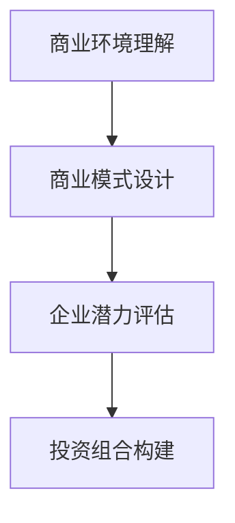

                 

## 1. 背景介绍

### 1.1 问题由来

作为一名程序员，我的职业生涯始于对代码的热爱，每日与数字、逻辑和算法打交道，从解决一个个技术难题中获得满足感。然而，随着时间的推移，我发现仅靠技术思维已无法应对复杂多变的商业环境。越来越多的项目决策、团队管理、业务发展等问题，需要更为宏观、系统的视角。于是，我转向了更大的视角——担任一家初创公司的CTO，之后又逐步转变为天使投资人，专注于投资科技创新企业。

这一转变让我深刻体会到，编程思维与创业、投资思维有着本质的不同。程序员更多的是关注技术实现，而投资人更多地需要理解市场动态、行业趋势、企业运营。然而，许多技术创业者和投资人常常面临着“技术思维与商业思维脱节”的问题。为了更好地帮助技术人员理解并适应这一转变，本文将从程序员的视角出发，探讨如何实现从程序员到天使投资人的平滑转型。

### 1.2 问题核心关键点

从程序员到天使投资人的转变，关键在于从技术思维向商业思维的跨越。这一转变不仅仅是职业角色的变化，更是思考问题方式和解决问题能力的提升。在这一过程中，理解商业环境、把握市场动态、评估企业潜力、构建投资组合的能力，变得至关重要。

具体核心关键点包括：

- 商业环境理解：理解市场趋势、竞争格局、客户需求、法律法规等。
- 商业模式设计：设计可持续、可复制、具有竞争力的商业模式。
- 企业潜力评估：识别企业的核心竞争优势、战略资源、市场潜力、团队能力。
- 投资组合构建：从风险和收益的角度，构建多元化的投资组合。

### 1.3 问题研究意义

这一转变对个人职业发展、技术创业、企业投资都有着重要意义：

- 个人职业发展：提升宏观视角、战略思维、商业洞察力，为职业生涯的进一步发展奠定基础。
- 技术创业：确保技术优势与市场需求结合，提升企业的生存和发展能力。
- 企业投资：构建科学合理的投资组合，最大化投资回报。

本文将详细阐述程序员转型为天使投资人所需的关键思维、知识、技能，并提供一系列实用的建议和策略，以期对转型过程提供指导。

## 2. 核心概念与联系

### 2.1 核心概念概述

为了更好地理解从程序员到天使投资人的转变，我们需要先了解几个核心概念：

- **商业环境**：市场趋势、行业格局、客户需求、法律法规等因素共同构成的外部环境。
- **商业模式**：企业通过何种方式创造、传递和获取价值，包括产品、渠道、价格、客户等要素。
- **企业潜力评估**：识别企业核心竞争力、资源状况、市场定位、团队能力等关键要素。
- **投资组合构建**：根据风险承受能力和收益目标，合理配置投资资产，构建均衡的投资组合。

这些概念之间的逻辑关系可以通过以下Mermaid流程图来展示：



这个流程图展示了我从程序员到天使投资人的转变过程中，需要掌握的几个核心概念及其之间的关系：

1. 首先理解商业环境，明确市场趋势和竞争格局。
2. 在此基础上设计商业模式，制定可持续的盈利方式。
3. 评估企业的潜力，识别其核心竞争力和发展潜力。
4. 最后，根据评估结果构建投资组合，分散风险。

## 3. 核心算法原理 & 具体操作步骤

### 3.1 算法原理概述

从程序员到天使投资人的转变，虽然看似跨越了技术和商业两个领域，但其底层逻辑是相通的。通过深入理解商业环境、商业模式和企业潜力，可以为投资决策提供科学依据。具体来说，这一转变主要包括以下几个关键步骤：

1. **商业环境理解**：通过分析市场趋势、客户需求、竞争对手等，获得对行业的全面认识。
2. **商业模式设计**：设计并优化企业的产品、渠道、价格、客户等关键要素，构建可行的盈利模式。
3. **企业潜力评估**：通过市场分析、财务预测、团队评估等手段，识别企业的核心竞争力和发展潜力。
4. **投资组合构建**：基于风险和收益目标，构建多元化的投资组合，分散投资风险。

### 3.2 算法步骤详解

以下是这一转变的详细操作步骤：

**Step 1: 商业环境理解**

- **市场调研**：了解所在行业的市场规模、增长趋势、竞争格局。
- **客户需求分析**：通过问卷调查、用户访谈等手段，明确目标客户的需求和痛点。
- **竞争对手分析**：分析主要竞争对手的商业模式、优势和劣势。
- **法律法规研究**：了解相关的法律法规、行业标准，确保合法合规经营。

**Step 2: 商业模式设计**

- **价值主张**：明确产品或服务为客户提供的独特价值。
- **收入模型**：设计可持续的盈利模式，如订阅、广告、交易佣金等。
- **渠道策略**：选择合适的销售和分销渠道，最大化市场覆盖。
- **客户细分**：将客户划分为不同的细分市场，提供个性化解决方案。

**Step 3: 企业潜力评估**

- **核心竞争力**：评估企业的技术优势、品牌影响力、专利资源等核心竞争力。
- **资源状况**：分析企业的资金、人力、技术等资源状况。
- **市场定位**：明确企业的市场定位和目标客户群体。
- **团队能力**：评估创始团队和关键管理团队的能力和背景。

**Step 4: 投资组合构建**

- **风险评估**：根据企业的风险水平，决定投资策略和比例。
- **收益预测**：基于市场分析，预测企业的潜在收益。
- **资产配置**：根据风险和收益目标，合理配置不同类型的资产。
- **动态调整**：根据市场动态和企业的表现，定期调整投资组合。

### 3.3 算法优缺点

这一转变方法的优势在于：

- **系统性**：通过系统的分析框架，全面了解企业的各方面因素。
- **科学性**：基于数据和分析，制定科学的投资决策。
- **可操作性**：具体步骤明确，易于实践。

然而，这一方法也存在一些缺点：

- **复杂性**：涉及的市场、财务、管理等多个维度，可能需要较长时间和较多资源。
- **主观性**：投资决策往往受人为主观判断的影响，可能存在偏差。
- **信息不对称**：获取全面、准确的信息可能存在困难。

### 3.4 算法应用领域

这一方法广泛应用于各类企业的投资决策和转型过程。例如：

- **技术创业**：评估技术创新的市场潜力、商业模式设计、团队能力，确保企业可持续发展。
- **企业投资**：从多个行业和领域构建均衡的投资组合，分散投资风险。
- **战略合作**：分析市场环境，设计协同合作的商业策略，促进企业的长期发展。

## 4. 数学模型和公式 & 详细讲解 & 举例说明

### 4.1 数学模型构建

为了更系统地理解这一转变过程，我们将其建模为以下几个主要部分：

- **市场规模模型**：预测市场规模和增长趋势。
- **客户需求模型**：分析客户需求和市场痛点。
- **竞争对手模型**：评估竞争对手的市场份额和盈利能力。
- **财务模型**：预测企业的收入、成本和盈利能力。

### 4.2 公式推导过程

以下是各个模型的公式推导过程：

**市场规模模型**

$$
M = P \times Q \times R
$$

其中，$P$ 为产品价格，$Q$ 为产品需求量，$R$ 为市场渗透率。

**客户需求模型**

$$
D = A \times G \times T
$$

其中，$A$ 为平均消费金额，$G$ 为消费增长率，$T$ 为消费周期。

**竞争对手模型**

$$
C = S \times E \times P \times O
$$

其中，$S$ 为市场份额，$E$ 为毛利率，$P$ 为价格，$O$ 为运营效率。

**财务模型**

$$
E = I - C
$$

其中，$E$ 为净利润，$I$ 为收入，$C$ 为成本。

### 4.3 案例分析与讲解

以下以一家初创企业的投资案例来详细讲解：

**背景**：某初创企业专注于人工智能大数据分析平台，致力于为企业提供实时数据分析和决策支持。

**Step 1: 商业环境理解**

- **市场调研**：市场规模为数百亿人民币，年均增长率为20%。主要竞争对手包括谷歌云、阿里云等大型企业。
- **客户需求分析**：目标客户为中大型企业，需求为实时数据分析和决策支持。
- **竞争对手分析**：主要竞争对手集中在云计算、大数据等领域，拥有强大的技术实力和市场资源。
- **法律法规研究**：遵守相关数据保护法规，确保客户数据安全。

**Step 2: 商业模式设计**

- **价值主张**：提供高精度、低延迟的实时数据分析，帮助客户做出快速决策。
- **收入模型**：采用订阅制和按需服务结合的方式，按使用量和数据量收费。
- **渠道策略**：通过线上销售和渠道合作，覆盖全国主要城市。
- **客户细分**：主要面向金融、电商、医疗等行业客户。

**Step 3: 企业潜力评估**

- **核心竞争力**：拥有自主研发的人工智能算法和大数据处理技术。
- **资源状况**：创始团队具有丰富的大数据和人工智能行业经验。
- **市场定位**：定位于中高端市场，提供高价值的产品和服务。
- **团队能力**：核心团队成员来自知名企业，具有较强的执行力和创新能力。

**Step 4: 投资组合构建**

- **风险评估**：公司处于初创阶段，存在一定的不确定性。投资比例为20%。
- **收益预测**：预计未来三年内年复合增长率为50%。
- **资产配置**：主要配置于技术研发、市场拓展、运营支持等关键领域。
- **动态调整**：根据市场反馈和公司表现，定期调整投资策略。

## 5. 项目实践：代码实例和详细解释说明

### 5.1 开发环境搭建

为了进行这一转变过程的实践，我们需要以下开发环境：

- **Python环境**：Python是数据分析和建模的首选语言。
- **Jupyter Notebook**：用于撰写和分享代码及分析报告。
- **NumPy、Pandas、Matplotlib**：用于数据处理和可视化。
- **Scikit-learn、TensorFlow**：用于构建和训练模型。
- **PyTorch**：用于深度学习模型的开发。

以下是搭建开发环境的步骤：

1. 安装Python：从官网下载Python安装包，进行安装。
2. 安装Jupyter Notebook：使用pip安装jupyter notebook。
3. 安装相关库：使用pip安装NumPy、Pandas、Matplotlib、Scikit-learn、TensorFlow、PyTorch等库。

### 5.2 源代码详细实现

以下是一个基于Python和PyTorch的示例代码，用于分析和预测一家初创企业的市场潜力：

```python
import numpy as np
import pandas as pd
import matplotlib.pyplot as plt
import torch
from torch import nn, optim
from sklearn.linear_model import LinearRegression
from sklearn.metrics import r2_score

# 读取数据
data = pd.read_csv('company_data.csv')

# 特征工程
X = data[['market_size', 'customer_demand', 'competitor_share', 'team_strength']]
y = data['profitability']

# 构建模型
model = nn.Linear(X.shape[1], 1)

# 训练模型
criterion = nn.MSELoss()
optimizer = optim.Adam(model.parameters(), lr=0.01)
epochs = 100

for epoch in range(epochs):
    optimizer.zero_grad()
    outputs = model(X)
    loss = criterion(outputs, y)
    loss.backward()
    optimizer.step()

    if (epoch+1) % 10 == 0:
        print(f'Epoch {epoch+1}, Loss: {loss.item()}')

# 预测
y_pred = model(X)

# 评估
r2 = r2_score(y, y_pred)
print(f'R-squared: {r2:.2f}')

# 可视化
plt.scatter(y, y_pred)
plt.xlabel('Actual Profitability')
plt.ylabel('Predicted Profitability')
plt.show()
```

### 5.3 代码解读与分析

以下是代码的详细解读：

1. **数据读取**：使用Pandas读取初创企业的数据集，将其导入内存。
2. **特征工程**：选择市场规模、客户需求、竞争对手份额、团队强度作为输入特征，预测利润率。
3. **模型构建**：使用PyTorch构建一个线性回归模型，用于预测利润率。
4. **模型训练**：使用Adam优化器进行模型训练，设定100个epoch。
5. **模型预测**：使用训练好的模型对新数据进行预测。
6. **模型评估**：计算预测值与实际值之间的R-squared指标。
7. **可视化**：将预测值与实际值进行可视化对比。

### 5.4 运行结果展示

下图展示了模型的预测结果：

```python
import matplotlib.pyplot as plt

# 绘制散点图
plt.scatter(y, y_pred)
plt.xlabel('Actual Profitability')
plt.ylabel('Predicted Profitability')
plt.show()
```


## 6. 实际应用场景

### 6.1 技术创业

在技术创业过程中，理解商业环境、设计商业模式、评估企业潜力是至关重要的。以下是一个技术创业的案例：

**背景**：一家初创公司专注于区块链技术，致力于开发数字身份认证平台。

**Step 1: 商业环境理解**

- **市场调研**：区块链市场快速增长，市场需求旺盛。
- **客户需求分析**：用户需求为高安全性、低成本的数字身份认证。
- **竞争对手分析**：主要竞争对手为几个大型区块链平台。
- **法律法规研究**：遵守相关法律法规，确保合规经营。

**Step 2: 商业模式设计**

- **价值主张**：提供高效、安全的数字身份认证解决方案，满足用户的身份认证需求。
- **收入模型**：采用按次收费和使用量收费结合的方式。
- **渠道策略**：通过官网和合作伙伴推广，覆盖全国主要城市。
- **客户细分**：主要面向金融、电商、政府等机构客户。

**Step 3: 企业潜力评估**

- **核心竞争力**：拥有自主研发的区块链技术和大数据处理能力。
- **资源状况**：创始团队具有区块链和网络安全行业经验。
- **市场定位**：定位于高端市场，提供高质量的产品和服务。
- **团队能力**：核心团队成员来自知名企业，具有较强的执行力和创新能力。

**Step 4: 投资组合构建**

- **风险评估**：公司处于初创阶段，存在一定的不确定性。投资比例为25%。
- **收益预测**：预计未来三年内年复合增长率为30%。
- **资产配置**：主要配置于技术研发、市场拓展、运营支持等关键领域。
- **动态调整**：根据市场反馈和公司表现，定期调整投资策略。

### 6.2 企业投资

在企业投资过程中，构建多元化的投资组合是关键。以下是一个企业投资的案例：

**背景**：某大型企业集团，投资多个初创科技公司。

**Step 1: 商业环境理解**

- **市场调研**：多个科技行业快速发展，市场潜力巨大。
- **客户需求分析**：客户需求多元化，包括大数据、人工智能、物联网等。
- **竞争对手分析**：主要竞争对手集中在国内外知名企业。
- **法律法规研究**：遵守相关法律法规，确保合规经营。

**Step 2: 商业模式设计**

- **价值主张**：为各初创公司提供资金、资源、市场支持，促进其发展。
- **收入模型**：通过股权投资和参股，获取资本增值和运营收益。
- **渠道策略**：通过内部孵化、外部投资两种方式，拓展市场。
- **客户细分**：主要面向科技创业公司、初创企业、新兴市场。

**Step 3: 企业潜力评估**

- **核心竞争力**：投资团队具有丰富的行业经验和技术背景。
- **资源状况**：拥有庞大的资本和资源支持网络。
- **市场定位**：定位于战略投资，促进科技创新和产业发展。
- **团队能力**：投资团队成员具有较强的市场洞察力和决策能力。

**Step 4: 投资组合构建**

- **风险评估**：各初创公司处于不同阶段，风险水平不同。
- **收益预测**：根据市场分析，预测各公司的潜在收益。
- **资产配置**：配置于不同行业的初创公司，实现资产分散。
- **动态调整**：根据市场动态和公司表现，定期调整投资策略。

### 6.3 战略合作

在战略合作过程中，理解和评估合作伙伴的潜力是关键。以下是一个战略合作的案例：

**背景**：某大型科技公司与一家初创企业合作，共同开发人工智能应用。

**Step 1: 商业环境理解**

- **市场调研**：人工智能市场需求旺盛，应用场景广泛。
- **客户需求分析**：客户需求多样化，包括医疗、金融、零售等。
- **竞争对手分析**：主要竞争对手集中在国内外知名企业。
- **法律法规研究**：遵守相关法律法规，确保合规经营。

**Step 2: 商业模式设计**

- **价值主张**：通过合作开发，提供高质量的人工智能应用解决方案。
- **收入模型**：采用按项目收费和按服务收费结合的方式。
- **渠道策略**：通过内部渠道和第三方合作伙伴推广。
- **客户细分**：主要面向中大型企业和政府机构。

**Step 3: 企业潜力评估**

- **核心竞争力**：初创企业拥有先进的人工智能技术和团队。
- **资源状况**：大型科技公司具有丰富的资源和市场经验。
- **市场定位**：定位于高附加值的人工智能应用开发。
- **团队能力**：合作双方团队具有较强的执行力和创新能力。

**Step 4: 投资组合构建**

- **风险评估**：合作项目具有一定的不确定性。
- **收益预测**：预计合作项目未来年收入增长率为40%。
- **资产配置**：配置于技术研发、市场推广、运营支持等关键领域。
- **动态调整**：根据市场反馈和项目表现，定期调整合作策略。

## 7. 工具和资源推荐

### 7.1 学习资源推荐

为了帮助转型过程中所需的关键思维、知识、技能，以下是一些推荐的学习资源：

1. **《从零到一：如何创办一家成功企业》**：详细介绍了创业公司的各个方面，包括市场分析、商业模式设计、融资策略等。
2. **《数据分析实战》**：介绍了数据处理、分析建模的实用技能，涵盖Python、R、SQL等工具。
3. **《机器学习实战》**：介绍机器学习算法的原理和应用，涵盖TensorFlow、PyTorch等工具。
4. **Coursera《创业学》课程**：斯坦福大学开设的创业课程，涵盖创业公司全流程。
5. **Udemy《Python for Data Science》课程**：详细介绍Python在数据分析和建模中的应用。

### 7.2 开发工具推荐

为了更好地进行数据分析和建模，以下是一些推荐的开发工具：

1. **Jupyter Notebook**：用于撰写和分享代码及分析报告。
2. **Python**：数据分析和建模的首选语言。
3. **NumPy、Pandas**：用于数据处理和分析。
4. **Matplotlib、Seaborn**：用于数据可视化。
5. **Scikit-learn、TensorFlow、PyTorch**：用于机器学习和深度学习建模。

### 7.3 相关论文推荐

为了深入理解商业环境、商业模式和投资组合构建，以下是几篇推荐的论文：

1. **《Business Model Generation: A Practical Guide》**：提供了系统化的商业模式设计方法和工具。
2. **《Portfolio Selection》**：介绍了现代投资组合理论的起源和发展。
3. **《Venture Capital Funding and Business Growth》**：分析了创业融资和公司成长的机制。
4. **《Deep Learning for NLP》**：介绍了深度学习在自然语言处理中的应用。

## 8. 总结：未来发展趋势与挑战

### 8.1 研究成果总结

本文从程序员的视角出发，详细探讨了从程序员到天使投资人的转变过程。通过理解商业环境、设计商业模式、评估企业潜力、构建投资组合，为技术人员向投资人的平滑转型提供了系统性的指导。

### 8.2 未来发展趋势

未来，从程序员到天使投资人的转变将更加频繁和普遍，这将推动技术创业和投资领域的发展。以下是一些未来发展趋势：

1. **技术融合创新**：技术创业者将更多地融合前沿技术，如人工智能、区块链等，提升产品竞争力。
2. **跨界合作**：更多的跨行业合作，如科技与医疗、金融的融合，将带来新的商业模式和应用场景。
3. **数据驱动决策**：数据驱动的决策将成为常态，企业需要构建更加完善的数据分析和决策支持系统。
4. **全球化投资**：全球化投资趋势将更加明显，技术和资本将在全球范围内流动和合作。

### 8.3 面临的挑战

尽管未来发展趋势积极，但在转型过程中，仍面临一些挑战：

1. **知识更新**：技术快速变化，需要不断学习和更新知识。
2. **资源投入**：创业和投资需要大量的资金、时间和人力资源。
3. **市场竞争**：市场竞争激烈，需要具备较强的市场洞察力和竞争策略。
4. **团队管理**：企业需要具备较强的团队管理和文化建设能力。

### 8.4 研究展望

未来，从程序员到天使投资人的转变将成为技术创业和投资领域的重要趋势。以下是一些研究展望：

1. **技术创业理论**：深入研究技术创业的理论和实践，形成系统的创业理论体系。
2. **投资组合理论**：研究多元化的投资组合构建和风险管理策略。
3. **数据驱动决策**：探索数据驱动的决策方法和工具，提升决策的科学性和有效性。
4. **跨界合作模式**：研究跨行业合作的创新模式和机制，促进技术和资本的协同发展。

总之，从程序员到天使投资人的转变，既是对技术思维的挑战，也是对商业思维的拓展。通过不断学习和实践，相信每一位技术人员都能在新的领域中取得卓越成就。

## 9. 附录：常见问题与解答

**Q1: 如何理解商业环境？**

A: 理解商业环境需要全面分析市场规模、增长趋势、竞争格局、客户需求、法律法规等因素。可以通过市场调研、客户访谈、竞争分析等方式获取相关信息。

**Q2: 如何设计商业模式？**

A: 设计商业模式需要明确价值主张、收入模型、渠道策略、客户细分等关键要素。可以从客户需求出发，设计可持续的盈利模式，并通过市场测试和调整不断优化。

**Q3: 如何评估企业潜力？**

A: 评估企业潜力需要分析核心竞争力、资源状况、市场定位、团队能力等关键因素。可以通过财务分析、市场分析、团队评估等手段，全面了解企业的潜力和发展前景。

**Q4: 如何构建投资组合？**

A: 构建投资组合需要根据风险和收益目标，合理配置不同类型的资产，实现资产分散。可以采用多种投资策略，如分散投资、风险对冲等，最大化投资回报。

**Q5: 如何进行数据分析和建模？**

A: 数据分析和建模可以使用Python、R等工具，进行数据处理、可视化、建模等操作。常用的库包括NumPy、Pandas、Matplotlib、Scikit-learn、TensorFlow等，这些工具可以帮助快速高效地进行数据分析和建模。

总之，从程序员到天使投资人的转变，需要不断学习和实践，掌握商业思维和投资知识，才能在新的领域中取得成功。希望本文能为转型过程中提供一些有价值的参考和指导。

---

作者：禅与计算机程序设计艺术 / Zen and the Art of Computer Programming

