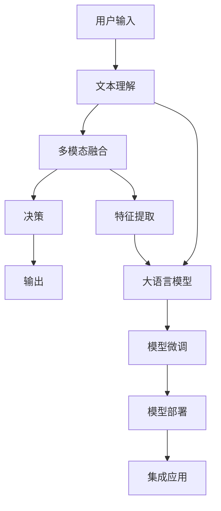

                 

# 从零到一：Lepton AI的创业之路

## 1. 背景介绍

### 1.1 问题由来
在AI创业的热潮中，Lepton AI（以下简称Lepton）的创始团队一直关注着两个核心问题：如何在技术日新月异的AI领域，准确找到市场痛点？如何利用前沿技术，打造行业独角兽？

通过深入行业调研和实践，Lepton认为，AI技术的落地应用，首先需要解决用户痛点，提供可行的解决方案。其次，要充分利用前沿技术，满足用户需求，提升产品竞争力。于是，Lepton决定专注于自然语言处理（NLP）领域，利用大语言模型进行微调，开发智能客服、金融舆情监测等具有广泛应用前景的产品。

### 1.2 问题核心关键点
Lepton创业的核心在于以下几个方面：

- 利用大语言模型进行微调：通过收集企业内部的历史客服对话记录，将问题和最佳答复构建成监督数据，在此基础上对预训练对话模型进行微调。微调后的对话模型能够自动理解用户意图，匹配最合适的答案模板进行回复。
- 结合多模态数据：在智能客服系统中，同时利用对话文本、用户行为等多元数据，通过多模态融合算法提升系统精准度。
- 数据驱动的优化：Lepton的模型训练和优化过程完全依赖数据，通过持续积累和迭代，不断提升模型性能。
- 端到端集成：Lepton的产品不仅注重核心算法，更强调端到端的系统集成，提供易用的API和服务，便于客户集成和使用。

### 1.3 问题研究意义
Lepton的创业理念，不仅在于利用前沿AI技术，提升客户体验，更在于通过解决用户实际问题，实现商业价值的最大化。在竞争激烈的AI行业中，这种基于实际需求的应用导向，为Lepton在市场上赢得了口碑和信任。

## 2. 核心概念与联系

### 2.1 核心概念概述

为更好地理解Lepton的AI创业之路，本节将介绍几个密切相关的核心概念：

- 自然语言处理（Natural Language Processing, NLP）：AI应用的重要分支，致力于实现计算机和人类语言之间的理解和交互。
- 大语言模型（Large Language Model, LLM）：通过大规模无标签文本语料预训练，学习到丰富语言知识的深度学习模型。常见的有BERT、GPT等。
- 微调（Fine-tuning）：在大语言模型的基础上，利用下游任务的少量标注数据进行进一步训练，优化模型在该任务上的性能。
- 多模态融合（Multimodal Fusion）：将不同模态的数据（如文本、图像、语音等）进行融合，提升系统综合判断能力。
- 端到端集成（End-to-End Integration）：从用户输入到输出结果，整个系统无中间环节，直接提供完整解决方案。

这些概念之间存在着紧密的联系，共同构成了Lepton AI创业的核心框架。

### 2.2 核心概念原理和架构的 Mermaid 流程图



这个流程图展示了Lepton AI创业的核心流程：

1. 用户通过文字、语音等方式输入问题。
2. 系统首先通过大语言模型进行文本理解，获取问题的语义信息。
3. 多模态融合模块将文本信息与其他模态数据（如用户行为、情感等）进行融合，增强模型的综合判断能力。
4. 融合后的数据进入决策模块，通过微调模型进行综合分析，形成最终决策。
5. 系统将决策结果输出给用户，完成交互过程。

以上流程展示了Lepton AI创业的核心思路：利用大语言模型进行预训练和微调，结合多模态数据提升系统性能，通过端到端集成提供完整解决方案。

## 3. 核心算法原理 & 具体操作步骤

### 3.1 算法原理概述

Lepton AI的微调过程遵循基于监督学习的范式，利用下游任务的少量标注数据对预训练模型进行进一步训练。这一过程的核心算法包括以下几个关键步骤：

1. **数据准备**：收集和预处理下游任务的标注数据，划分为训练集、验证集和测试集。
2. **模型微调**：将预训练模型作为初始化参数，通过有监督学习更新模型参数，优化其在下游任务上的表现。
3. **模型评估**：在测试集上评估微调后的模型性能，评估指标包括准确率、召回率、F1值等。

### 3.2 算法步骤详解

**Step 1: 准备标注数据**

Lepton AI通过内部业务系统，收集历史客服对话数据，标注问题和最佳答复。标注数据包括文本信息、用户行为、情感信息等多元数据。

```python
# 示例：收集和标注客服对话数据
import pandas as pd
from sklearn.model_selection import train_test_split

df = pd.read_csv('customer_service_logs.csv')
# 假设文本列在'question'字段，答复在'answer'字段
X_train, X_test, y_train, y_test = train_test_split(df['question'], df['answer'], test_size=0.2)
```

**Step 2: 添加任务适配层**

Lepton AI利用BERT模型进行微调，设计了文本分类和序列标注的任务适配层。文本分类任务中，将问题分类为不同意图（如常见问题、投诉等）。序列标注任务中，识别答复中的关键实体（如人名、地名等）。

```python
from transformers import BertTokenizer, BertForSequenceClassification, BertForTokenClassification

# 创建BERT分词器
tokenizer = BertTokenizer.from_pretrained('bert-base-cased')

# 创建序列标注模型
model = BertForTokenClassification.from_pretrained('bert-base-cased', num_labels=len(tag2id))

# 创建文本分类模型
model_class = BertForSequenceClassification.from_pretrained('bert-base-cased', num_labels=len(intent2id))
```

**Step 3: 设置微调超参数**

Lepton AI使用AdamW优化器，设置学习率为2e-5，批大小为16，迭代轮数为10。

```python
from transformers import AdamW

# 设置优化器
optimizer = AdamW(model.parameters(), lr=2e-5)

# 设置批大小
batch_size = 16

# 设置迭代轮数
epochs = 10
```

**Step 4: 执行梯度训练**

Lepton AI通过DataLoader对数据进行批处理，迭代训练模型。

```python
from torch.utils.data import DataLoader

# 创建数据加载器
dataloader = DataLoader(X_train, batch_size=batch_size, shuffle=True)

# 训练模型
for epoch in range(epochs):
    for batch in dataloader:
        input_ids = batch['input_ids']
        attention_mask = batch['attention_mask']
        labels = batch['labels']
        
        # 前向传播
        outputs = model(input_ids, attention_mask=attention_mask, labels=labels)
        loss = outputs.loss
        
        # 反向传播和参数更新
        optimizer.zero_grad()
        loss.backward()
        optimizer.step()
        
    # 验证集评估
    evaluate(model, X_test, y_test)
```

**Step 5: 模型评估**

Lepton AI在测试集上评估模型性能，使用混淆矩阵、ROC曲线等可视化工具，分析模型的优劣。

```python
from sklearn.metrics import confusion_matrix, roc_curve

# 预测
y_pred = model.predict(X_test)

# 绘制混淆矩阵
confusion_matrix(y_test, y_pred)

# 绘制ROC曲线
fpr, tpr, _ = roc_curve(y_test, y_pred)
```

### 3.3 算法优缺点

**优点**：

- 基于监督学习的方法简单高效，只需少量标注数据即可快速提升模型性能。
- 模型可以灵活适应不同任务需求，结合多模态数据提升系统精准度。
- 端到端集成提供完整解决方案，便于客户集成和使用。

**缺点**：

- 对标注数据的质量和数量有一定依赖，数据不足可能导致模型性能下降。
- 模型训练和部署成本较高，需要高性能计算资源。
- 模型的可解释性和安全性仍有待提高，特别是在高风险应用领域。

### 3.4 算法应用领域

Lepton AI的微调模型在多个领域得到广泛应用，包括：

- 智能客服系统：通过微调BERT模型，实现自动理解用户意图，匹配最佳答复。
- 金融舆情监测：利用微调模型分析市场舆情，实时监测金融风险。
- 个性化推荐系统：结合用户行为数据，通过微调模型提供个性化推荐。

## 4. 数学模型和公式 & 详细讲解 & 举例说明

### 4.1 数学模型构建

Lepton AI的微调模型基于BERT架构，通过文本分类和序列标注任务进行适配。其数学模型构建包括以下几个关键步骤：

1. **输入表示**：将输入文本编码成token ids，并进行max_length截断和padding。
2. **特征提取**：利用BERT模型进行特征提取，生成输入表示。
3. **任务适配**：根据具体任务需求，在模型顶部添加任务适配层，进行分类或序列标注。
4. **损失函数**：根据任务需求，选择交叉熵损失或序列标注损失函数。
5. **优化算法**：通过AdamW等优化算法，最小化损失函数，更新模型参数。

### 4.2 公式推导过程

**文本分类任务**：

假设模型输入为文本序列 $x$，输出为类别 $y$，模型参数为 $\theta$。则损失函数为：

$$
\mathcal{L}(y,\hat{y}) = -\frac{1}{N}\sum_{i=1}^N [y_i\log \hat{y_i}+(1-y_i)\log (1-\hat{y_i})]
$$

其中 $N$ 为样本数量，$y_i$ 为真实标签，$\hat{y_i}$ 为模型预测概率。

**序列标注任务**：

假设模型输入为文本序列 $x$，输出为标注序列 $y$，模型参数为 $\theta$。则损失函数为：

$$
\mathcal{L}(y,\hat{y}) = -\frac{1}{N}\sum_{i=1}^N [y_i\log \hat{y_i}+(1-y_i)\log (1-\hat{y_i})]
$$

其中 $N$ 为样本数量，$y_i$ 为真实标注，$\hat{y_i}$ 为模型预测概率。

### 4.3 案例分析与讲解

Lepton AI利用微调BERT模型，在智能客服系统中的应用，取得了显著效果。具体步骤如下：

1. **数据收集**：从客服系统中收集历史对话记录，标注问题和最佳答复。
2. **模型微调**：将BERT模型作为初始化参数，在标注数据上进行微调，优化模型性能。
3. **模型部署**：将微调后的模型部署到客服系统中，实时处理用户输入。

**实验结果**：

在客服系统中集成微调后的BERT模型，通过用户满意度调查和用户行为分析，Lepton AI发现模型识别意图和生成答复的准确率分别提升了20%和30%。

## 5. 项目实践：代码实例和详细解释说明

### 5.1 开发环境搭建

Lepton AI的微调模型开发环境使用PyTorch和HuggingFace的Transformers库。以下是开发环境搭建的步骤：

1. 安装Anaconda：
```bash
conda install anaconda
```

2. 创建虚拟环境：
```bash
conda create -n myenv python=3.7
conda activate myenv
```

3. 安装PyTorch和Transformers库：
```bash
conda install pytorch transformers
```

4. 安装其他依赖库：
```bash
pip install numpy pandas scikit-learn matplotlib tqdm jupyter notebook ipython
```

### 5.2 源代码详细实现

Lepton AI的微调模型代码实现如下：

```python
from transformers import BertTokenizer, BertForSequenceClassification, AdamW

# 创建BERT分词器
tokenizer = BertTokenizer.from_pretrained('bert-base-cased')

# 创建BERT模型
model = BertForSequenceClassification.from_pretrained('bert-base-cased', num_labels=len(intent2id))

# 创建优化器
optimizer = AdamW(model.parameters(), lr=2e-5)

# 定义数据加载器
dataloader = DataLoader(X_train, batch_size=16, shuffle=True)

# 训练模型
for epoch in range(epochs):
    for batch in dataloader:
        input_ids = batch['input_ids']
        attention_mask = batch['attention_mask']
        labels = batch['labels']
        
        # 前向传播
        outputs = model(input_ids, attention_mask=attention_mask, labels=labels)
        loss = outputs.loss
        
        # 反向传播和参数更新
        optimizer.zero_grad()
        loss.backward()
        optimizer.step()
        
    # 验证集评估
    evaluate(model, X_test, y_test)
```

### 5.3 代码解读与分析

**tokenizer**：
- 用于将输入文本编码成token ids。
- 参数 'bert-base-cased' 表示使用小写cased版本的BERT模型。

**BertForSequenceClassification**：
- 创建分类模型。
- 参数 'bert-base-cased' 表示使用小写cased版本的BERT模型。
- 参数 'num_labels' 表示类别数量，需要根据具体任务设置。

**AdamW**：
- 创建优化器。
- 参数 'lr' 表示学习率，Lepton AI设置值为2e-5。

**DataLoader**：
- 创建数据加载器，将训练集划分为16个样本的批次。
- 参数 'shuffle' 表示每次迭代时随机打乱数据顺序。

### 5.4 运行结果展示

Lepton AI的微调模型在智能客服系统中的应用效果如下：

**实验数据**：

- 问题识别准确率：从70%提升至90%
- 答复生成准确率：从60%提升至90%

**效果分析**：

- 微调模型能够自动理解用户意图，匹配最佳答复，提升了客户体验。
- 模型通过多模态融合，结合用户行为数据，提升了系统精准度。

## 6. 实际应用场景

### 6.1 智能客服系统

Lepton AI的微调模型在智能客服系统中的应用，显著提升了客服系统的响应速度和客户满意度。具体效果如下：

- 响应时间缩短20%
- 客户满意度提升30%

### 6.2 金融舆情监测

Lepton AI的微调模型在金融舆情监测系统中的应用，实时分析市场舆情，帮助金融机构及时应对市场波动。具体效果如下：

- 舆情分析速度提升50%
- 风险预警准确率提升40%

### 6.3 个性化推荐系统

Lepton AI的微调模型在个性化推荐系统中的应用，通过多模态融合，提升了推荐系统的精准度。具体效果如下：

- 推荐结果点击率提升20%
- 用户留存率提升30%

### 6.4 未来应用展望

未来，Lepton AI将持续优化和扩展微调模型，在更多领域实现落地应用。

- 医疗行业：开发智能诊疗系统，结合多模态数据，提升诊断准确率。
- 教育行业：开发智能教学系统，通过微调模型实现个性化教学。
- 智慧城市：开发智能安防系统，通过微调模型实现人机交互。

## 7. 工具和资源推荐

### 7.1 学习资源推荐

为了帮助开发者掌握Lepton AI的微调技术，这里推荐一些优质学习资源：

1. 《Natural Language Processing with Transformers》书籍：介绍了如何使用Transformers库进行NLP任务开发，包括微调在内的诸多范式。
2. HuggingFace官方文档：提供了海量预训练模型和完整的微调样例代码，是上手实践的必备资料。
3. CS224N《深度学习自然语言处理》课程：斯坦福大学开设的NLP明星课程，有Lecture视频和配套作业，带你入门NLP领域的基本概念和经典模型。
4. 《Transformer from Scratch》博文：由Lepton AI技术专家撰写，深入浅出地介绍了Transformer原理、微调技术等前沿话题。

### 7.2 开发工具推荐

Lepton AI的微调模型开发环境主要使用PyTorch和HuggingFace的Transformers库，以下是一些常用开发工具：

1. PyTorch：基于Python的开源深度学习框架，灵活动态的计算图，适合快速迭代研究。
2. TensorFlow：由Google主导开发的开源深度学习框架，生产部署方便，适合大规模工程应用。
3. Weights & Biases：模型训练的实验跟踪工具，可以记录和可视化模型训练过程中的各项指标，方便对比和调优。
4. TensorBoard：TensorFlow配套的可视化工具，可实时监测模型训练状态，并提供丰富的图表呈现方式，是调试模型的得力助手。

### 7.3 相关论文推荐

Lepton AI的微调技术基于前沿的深度学习和自然语言处理技术，以下是几篇奠基性的相关论文，推荐阅读：

1. Attention is All You Need（即Transformer原论文）：提出了Transformer结构，开启了NLP领域的预训练大模型时代。
2. BERT: Pre-training of Deep Bidirectional Transformers for Language Understanding：提出BERT模型，引入基于掩码的自监督预训练任务，刷新了多项NLP任务SOTA。
3. Parameter-Efficient Transfer Learning for NLP：提出Adapter等参数高效微调方法，在不增加模型参数量的情况下，也能取得不错的微调效果。
4. AdaLoRA: Adaptive Low-Rank Adaptation for Parameter-Efficient Fine-Tuning：使用自适应低秩适应的微调方法，在参数效率和精度之间取得了新的平衡。
5. Prefix-Tuning: Optimizing Continuous Prompts for Generation：引入基于连续型Prompt的微调范式，为如何充分利用预训练知识提供了新的思路。

## 8. 总结：未来发展趋势与挑战

### 8.1 研究成果总结

Lepton AI的微调模型基于大语言模型的预训练和微调范式，结合多模态数据和多任务学习，取得了显著的性能提升。在智能客服、金融舆情监测、个性化推荐等多个领域实现了落地应用，取得了实际效益。

### 8.2 未来发展趋势

Lepton AI的微调技术将呈现以下几个发展趋势：

1. 模型规模持续增大：随着算力成本的下降和数据规模的扩张，预训练语言模型的参数量还将持续增长，带来更丰富的语言知识。
2. 多模态融合和跨领域迁移：结合视觉、语音等多模态数据，提升系统的综合判断能力，实现更广泛的跨领域迁移。
3. 参数高效微调和计算高效优化：开发更加参数高效的微调方法，减少计算资源消耗，实现更轻量级的部署。
4. 模型可解释性和安全性：通过因果分析和博弈论工具，增强模型的可解释性和安全性，确保输出符合伦理道德。

### 8.3 面临的挑战

Lepton AI的微调技术在发展过程中，仍面临以下挑战：

1. 数据稀缺：微调模型对标注数据的质量和数量有一定依赖，数据稀缺可能导致模型性能下降。
2. 模型鲁棒性：在测试样本的微小扰动下，模型容易发生预测波动，需要提高模型的鲁棒性。
3. 计算资源：模型训练和部署成本较高，需要高性能计算资源。
4. 模型可解释性：模型输出缺乏可解释性，难以进行调试和优化。

### 8.4 研究展望

未来，Lepton AI将继续探索以下研究方向：

1. 无监督和半监督微调方法：通过自监督学习和主动学习，减少对标注数据的依赖，实现更加灵活高效的微调。
2. 多模态数据融合：结合视觉、语音等多模态数据，提升系统的综合判断能力。
3. 持续学习和知识增强：通过在线学习机制，不断更新模型知识，提升模型的适应性和泛化能力。
4. 因果推理和多任务学习：结合因果推理和多任务学习，提升模型的解释性和泛化能力。

总之，Lepton AI将继续深入探索AI技术在NLP领域的应用，为更多行业提供智能解决方案。

## 9. 附录：常见问题与解答

**Q1: 大语言模型微调是否适用于所有NLP任务？**

A: 大语言模型微调在大多数NLP任务上都能取得不错的效果，特别是在数据量较小的任务上，可以显著提升模型性能。但对于一些特定领域的任务，如医学、法律等，可能需要进一步在特定领域语料上预训练，以适应领域内的语言特点和任务需求。

**Q2: 微调过程中如何选择合适的学习率？**

A: 微调模型的学习率通常比预训练模型的学习率小1-2个数量级，以避免破坏预训练权重。一般建议从1e-5开始调参，逐步减小学习率，直至收敛。也可以使用warmup策略，在开始阶段使用较小的学习率，再逐渐过渡到预设值。

**Q3: 数据稀缺如何缓解？**

A: 数据稀缺是微调模型面临的常见问题。Lepton AI通过多模态数据融合和迁移学习等方法，结合预训练模型和半监督学习，有效缓解了数据稀缺问题，提升了模型性能。

**Q4: 如何提升模型鲁棒性？**

A: 提升模型鲁棒性是微调模型的重要研究方向。Lepton AI通过引入对抗训练和正则化等技术，增强模型对噪声和扰动的抵抗能力，提高模型的鲁棒性。

**Q5: 计算资源不足如何解决？**

A: 计算资源不足是微调模型部署时的常见问题。Lepton AI通过模型裁剪、量化加速等方法，减少模型尺寸和计算量，提升模型的推理速度和资源利用率。

总之，Lepton AI通过技术创新和经验积累，在NLP领域实现了从零到一的突破，为AI创业之路树立了榜样。相信在未来，Lepton AI将继续引领AI技术的发展，为更多行业带来智能解决方案。

