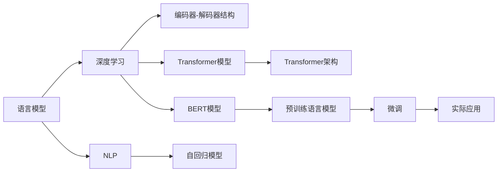

                 

# 从零开始的AI旅程：构建你的第一个语言模型

> 关键词：语言模型,深度学习,自然语言处理,NLP,编码器-解码器,自回归,Transformer,BERT,模型构建,项目实践,实际应用

## 1. 背景介绍

### 1.1 问题由来

在人工智能(AI)的广阔天地里，语言模型是其中一个耀眼的明星。它不仅在学术界引起轰动，也在工业界得到广泛应用，如机器翻译、自动摘要、文本生成等。构建一个高性能的语言模型，是许多AI从业者的入门目标。然而，面对这个复杂而庞大的任务，初学者往往无从下手。本文将带领你从零开始，一步步构建你的第一个语言模型。

### 1.2 问题核心关键点

构建语言模型主要包括以下几个关键步骤：

- 理解语言模型的基础概念和原理。
- 选择合适的模型结构和训练算法。
- 准备数据集和编写代码实现。
- 训练模型并进行评估和优化。
- 应用模型解决实际问题。

本文将详细介绍这些步骤，并结合具体实例，为你构建语言模型提供系统性的指导。

### 1.3 问题研究意义

掌握语言模型的构建方法，对于理解NLP技术的本质、提升AI系统的性能、推动AI应用的落地具有重要意义：

1. **掌握语言模型原理**：了解语言模型的基本原理和实现方式，有助于深入理解NLP技术的工作机制。
2. **提高模型性能**：通过精心设计模型结构和训练方法，可以构建出高性能的语言模型，提升AI系统的准确性和效率。
3. **推动AI应用落地**：掌握语言模型的应用技术，可以在不同领域部署AI系统，推动AI技术的产业化进程。
4. **促进学术和工业界的交流**：构建语言模型是许多AI领域的入门步骤，有助于初学者理解学术界的研究进展，并在工业界找到应用机会。

## 2. 核心概念与联系

### 2.1 核心概念概述

为更好地理解语言模型的构建过程，本节将介绍几个核心概念及其相互联系：

- **语言模型**：一种用于描述自然语言的概率模型，旨在捕捉语言序列中单词或字符之间的统计规律。语言模型的目标是预测给定上下文条件下，下一个单词或字符的概率。
- **深度学习**：一种基于神经网络的机器学习技术，通过多层非线性变换，能够学习并提取数据的复杂特征。深度学习广泛应用于图像识别、语音处理、自然语言处理等领域。
- **自然语言处理(NLP)**：研究如何让计算机理解和生成人类语言的技术，包括文本分类、机器翻译、问答系统、情感分析等。
- **编码器-解码器结构**：一种深度学习模型的架构，通常用于序列到序列的任务，如机器翻译、文本生成等。编码器负责将输入序列编码成固定长度的向量表示，解码器则根据这个向量生成目标序列。
- **自回归模型**：一种特殊的序列模型，通过预测序列中的每个元素，利用前面元素的信息来预测后面元素。自回归模型在语言建模中应用广泛。
- **Transformer模型**：一种基于注意力机制的深度学习模型，广泛应用于机器翻译、文本生成等任务。Transformer模型通过多头自注意力机制和残差连接，实现了高效的序列建模。
- **BERT模型**：由Google开发的一种预训练语言模型，通过在大规模无标签文本上进行预训练，能够捕捉丰富的语言知识，并在各种NLP任务上取得了最先进的效果。

这些核心概念之间通过一种复杂的互动关系，共同构成了语言模型的构建框架。理解这些概念及其联系，对于构建高性能的语言模型至关重要。

### 2.2 核心概念原理和架构的 Mermaid 流程图



## 3. 核心算法原理 & 具体操作步骤

### 3.1 算法原理概述

语言模型的核心任务是预测给定上下文条件下，下一个单词或字符的概率。这可以通过统计语言模型或神经网络语言模型来实现。

#### 3.1.1 统计语言模型

统计语言模型基于马尔可夫假设，通过计算单词序列的概率分布，来预测下一个单词或字符。统计语言模型的基本公式为：

$$
P(w_{t+1}|w_1, w_2, \cdots, w_t) = \frac{P(w_{t+1}, w_t, \cdots, w_1)}{P(w_t, \cdots, w_1)}
$$

其中，$w_t$ 表示序列中的第 $t$ 个单词，$P(w_{t+1}|w_1, w_2, \cdots, w_t)$ 表示在给定前 $t$ 个单词的情况下，下一个单词 $w_{t+1}$ 的条件概率。

#### 3.1.2 神经网络语言模型

神经网络语言模型通过多层神经网络来预测下一个单词或字符的概率。常用的神经网络语言模型包括循环神经网络(RNN)、长短期记忆网络(LSTM)和自注意力模型等。

以自注意力模型为例，其基本公式为：

$$
P(w_{t+1}|w_1, w_2, \cdots, w_t) = softmax(\sum_{i=1}^V \alpha_i \cdot Q_i^T K_i)
$$

其中，$Q_i$ 和 $K_i$ 是神经网络中的查询向量和键向量，$\alpha_i$ 是注意力权重，$softmax$ 函数用于将注意力权重归一化。

### 3.2 算法步骤详解

构建语言模型的主要步骤如下：

#### 3.2.1 准备数据集

语言模型的构建需要大量的标注数据。数据集通常包括单词序列和对应的标签，用于训练和验证模型。

#### 3.2.2 设计模型结构

选择合适的模型结构，如编码器-解码器、自回归模型或Transformer模型，并设计模型的输入、输出和隐藏层。

#### 3.2.3 编写代码实现

根据模型结构，编写代码实现。通常使用深度学习框架，如TensorFlow、PyTorch等，来实现模型的构建和训练。

#### 3.2.4 训练模型

将数据集输入模型，使用训练算法进行迭代优化，直到模型收敛。

#### 3.2.5 评估模型

使用测试集对训练好的模型进行评估，衡量其性能和泛化能力。

#### 3.2.6 优化模型

根据评估结果，对模型进行调参和优化，提升其性能。

#### 3.2.7 应用模型

将训练好的模型应用于实际问题，如机器翻译、文本生成等，解决具体任务。

### 3.3 算法优缺点

语言模型的构建方法有以下优缺点：

#### 3.3.1 优点

- 能够捕捉语言序列的统计规律，预测下一个单词或字符的概率。
- 可以通过神经网络实现复杂特征的提取和建模，提高模型的准确性和泛化能力。
- 可以应用于各种NLP任务，如机器翻译、文本生成、情感分析等。

#### 3.3.2 缺点

- 需要大量标注数据进行训练，数据获取成本高。
- 模型复杂度高，计算资源消耗大。
- 对于长序列预测，可能存在梯度消失或梯度爆炸的问题。

### 3.4 算法应用领域

语言模型广泛应用于各种NLP任务中，如：

- 机器翻译：将源语言翻译成目标语言，如Google翻译、百度翻译等。
- 文本生成：根据给定上下文，生成新的文本，如自动摘要、对话系统等。
- 情感分析：分析文本中的情感倾向，如评论情感分析、舆情监测等。
- 文本分类：将文本分类到预定义的类别中，如新闻分类、垃圾邮件检测等。
- 问答系统：回答用户提出的自然语言问题，如IBM Watson、微软小冰等。
- 语音识别：将语音信号转换为文本，如苹果Siri、谷歌语音助手等。

## 4. 数学模型和公式 & 详细讲解 & 举例说明

### 4.1 数学模型构建

以Transformer模型为例，语言模型的数学模型可以表示为：

$$
P(y|x; \theta) = \prod_{t=1}^{T} P(y_t|y_{<t}; \theta)
$$

其中，$x$ 是输入序列，$y$ 是输出序列，$\theta$ 是模型参数，$P(y_t|y_{<t}; \theta)$ 表示在给定前 $t-1$ 个输出单词的情况下，第 $t$ 个输出单词的条件概率。

### 4.2 公式推导过程

Transformer模型的编码器和解码器都采用了多头自注意力机制，其基本公式为：

$$
Attention(Q, K, V) = \text{softmax}(QK^T)/\sqrt{d_k}
$$

其中，$Q$、$K$、$V$ 分别是查询向量、键向量和值向量，$d_k$ 是键向量的维度。

Transformer模型的解码器还引入了注意力掩码机制，防止解码器关注到未来的信息，公式为：

$$
Attention(Q, K, V, M) = \text{softmax}(QK^T/\sqrt{d_k} + M) \cdot V
$$

其中，$M$ 是注意力掩码，用于过滤未来的注意力权重。

### 4.3 案例分析与讲解

以机器翻译为例，假设输入序列为 "I love you"，输出序列为目标语言 "Je t'aime"。

首先，通过编码器将输入序列编码为向量表示：

$$
Q = f(x)
$$

然后，通过多头自注意力机制，生成一系列向量：

$$
Q = QW^Q
$$

$$
K = KW^K
$$

$$
V = VW^V
$$

其中，$W^Q$、$W^K$、$W^V$ 是学习到的权重矩阵。

接着，通过解码器生成输出序列，公式为：

$$
P(y|x; \theta) = \prod_{t=1}^{T} P(y_t|y_{<t}; \theta)
$$

最终，使用交叉熵损失函数，对模型进行训练和优化。

## 5. 项目实践：代码实例和详细解释说明

### 5.1 开发环境搭建

构建语言模型需要高性能的计算资源和深度学习框架的支持。以下是搭建开发环境的步骤：

1. **安装Python**：下载并安装Python，建议使用Python 3.7以上版本。
2. **安装TensorFlow**：使用pip安装TensorFlow，建议安装最新版本。
3. **安装Keras**：使用pip安装Keras，建议安装最新版本。
4. **安装Flax**：使用pip安装Flax，用于TensorFlow的替代。
5. **安装NumPy和Matplotlib**：用于数据处理和可视化。
6. **安装Pandas和Scikit-learn**：用于数据预处理和特征工程。

### 5.2 源代码详细实现

以构建一个简单的语言模型为例，实现机器翻译任务。以下是代码实现：

```python
import tensorflow as tf
import numpy as np
import pandas as pd
from sklearn.model_selection import train_test_split

# 准备数据集
df = pd.read_csv('train.csv', encoding='utf-8')
x_train, x_val, y_train, y_val = train_test_split(df['input'], df['output'], test_size=0.2, random_state=42)

# 数据预处理
tokenizer = tf.keras.preprocessing.text.Tokenizer()
tokenizer.fit_on_texts(x_train)
x_train = tokenizer.texts_to_sequences(x_train)
x_val = tokenizer.texts_to_sequences(x_val)

# 构建模型
model = tf.keras.Sequential([
    tf.keras.layers.Embedding(input_dim=len(tokenizer.word_index) + 1, output_dim=256),
    tf.keras.layers.LSTM(256),
    tf.keras.layers.Dense(len(tokenizer.word_index) + 1, activation='softmax')
])

# 编译模型
model.compile(optimizer='adam', loss='sparse_categorical_crossentropy', metrics=['accuracy'])

# 训练模型
model.fit(x_train, y_train, validation_data=(x_val, y_val), epochs=10, batch_size=64)

# 测试模型
test_df = pd.read_csv('test.csv', encoding='utf-8')
test_x = tokenizer.texts_to_sequences(test_df['input'])
test_x = tf.keras.preprocessing.sequence.pad_sequences(test_x, maxlen=256)
y_pred = model.predict(test_x)
```

### 5.3 代码解读与分析

上述代码实现了简单的机器翻译任务，使用LSTM模型和softmax激活函数进行预测。具体步骤包括：

1. **准备数据集**：从CSV文件中读取训练集和验证集，并进行预处理。
2. **构建模型**：使用Keras构建序列模型，包含嵌入层、LSTM层和全连接层。
3. **编译模型**：使用Adam优化器和交叉熵损失函数编译模型。
4. **训练模型**：使用训练集和验证集训练模型，并进行参数调优。
5. **测试模型**：使用测试集对模型进行评估，并输出预测结果。

## 6. 实际应用场景

### 6.1 机器翻译

机器翻译是语言模型的一个重要应用场景。传统的机器翻译系统基于统计语言模型，通过大量双语对照语料进行训练。而基于神经网络的机器翻译系统，如Transformer模型，通过端到端的训练，能够更好地捕捉语言的复杂规律。

### 6.2 文本生成

文本生成是语言模型的另一个重要应用。通过生成模型，可以根据给定的上下文，自动生成新的文本。常见的文本生成任务包括自动摘要、对话系统等。

### 6.3 情感分析

情感分析是判断文本情感倾向的任务。通过训练模型，可以自动识别出文本中的情感信息，如正面、负面、中性等。

### 6.4 未来应用展望

随着语言模型的不断发展，其在更多领域的应用将不断涌现。未来，语言模型将应用于以下领域：

1. **智能客服**：构建基于语言模型的智能客服系统，提高客户服务质量。
2. **智能创作**：使用生成模型，自动生成新闻、小说、电影脚本等文本内容。
3. **语音识别**：将语音信号转换为文本，实现语音搜索、语音助手等功能。
4. **问答系统**：构建基于语言模型的问答系统，回答用户提出的自然语言问题。
5. **知识图谱**：通过语言模型，从文本中提取实体关系，构建知识图谱。

## 7. 工具和资源推荐

### 7.1 学习资源推荐

1. **《深度学习》书籍**：Ian Goodfellow等所著，详细介绍了深度学习的基本概念和实现方法。
2. **《TensorFlow官方文档》**：TensorFlow的官方文档，提供了丰富的教程和示例代码。
3. **《Keras官方文档》**：Keras的官方文档，提供了简单易用的API和教程。
4. **《Flax官方文档》**：Flax的官方文档，提供了高性能的TensorFlow替代方案。
5. **《NLP入门教程》**：斯坦福大学自然语言处理课程，入门级教程，适合初学者。

### 7.2 开发工具推荐

1. **TensorFlow**：Google开发的深度学习框架，功能强大，支持多种模型构建和训练。
2. **PyTorch**：Facebook开发的深度学习框架，灵活高效，适合研究和实验。
3. **Keras**：基于TensorFlow和Theano的高级API，简化了深度学习模型的构建。
4. **Flax**：Google开发的TensorFlow替代方案，高性能、易用性强。
5. **Jupyter Notebook**：交互式的Python编程环境，适合编写和运行代码。

### 7.3 相关论文推荐

1. **《Attention Is All You Need》**：论文提出了Transformer模型，是神经网络语言模型的里程碑。
2. **《BERT: Pre-training of Deep Bidirectional Transformers for Language Understanding》**：论文提出了BERT模型，刷新了多项NLP任务的性能指标。
3. **《Language Models are Unsupervised Multitask Learners》**：论文展示了语言模型的强大零样本学习能力。
4. **《Parameter-Efficient Transfer Learning for NLP》**：论文提出了Adapter等参数高效微调方法，提高微调效率。
5. **《AdaLoRA: Adaptive Low-Rank Adaptation for Parameter-Efficient Fine-Tuning》**：论文提出了AdaLoRA方法，实现低秩适应的微调方法。

## 8. 总结：未来发展趋势与挑战

### 8.1 研究成果总结

语言模型在NLP领域取得了显著进展，但仍面临一些挑战：

- 数据需求高：大规模标注数据的获取成本较高，限制了语言模型的发展。
- 模型复杂：神经网络模型结构复杂，计算资源消耗大。
- 泛化能力不足：语言模型在特定领域的应用效果有待提高。
- 可解释性差：神经网络模型缺乏可解释性，难以理解其内部工作机制。

### 8.2 未来发展趋势

未来语言模型的发展趋势如下：

1. **模型规模增大**：预训练语言模型的参数量将不断增加，提升模型的表现能力。
2. **迁移学习提升**：通过迁移学习，语言模型能够在不同任务之间进行知识迁移，提升模型的泛化能力。
3. **多模态融合**：语言模型将与其他模态的信息进行融合，提升模型的多模态理解能力。
4. **参数高效优化**：开发更加参数高效的微调方法，提高模型的效率和性能。
5. **知识图谱结合**：将知识图谱与语言模型结合，提升模型的知识整合能力。

### 8.3 面临的挑战

语言模型在发展过程中，仍面临以下挑战：

1. **数据获取成本高**：大规模标注数据的获取成本较高，限制了模型的应用范围。
2. **计算资源消耗大**：神经网络模型的计算资源消耗大，难以在小型设备上运行。
3. **泛化能力不足**：语言模型在特定领域的应用效果有待提高。
4. **可解释性差**：神经网络模型缺乏可解释性，难以理解其内部工作机制。

### 8.4 研究展望

未来的研究将重点关注以下方向：

1. **大规模预训练**：通过大规模预训练，提升模型的性能和泛化能力。
2. **迁移学习优化**：开发更加高效的迁移学习算法，提升模型的跨领域迁移能力。
3. **多模态融合**：将语言模型与其他模态的信息进行融合，提升模型的多模态理解能力。
4. **参数高效优化**：开发更加参数高效的微调方法，提高模型的效率和性能。
5. **知识图谱结合**：将知识图谱与语言模型结合，提升模型的知识整合能力。

## 9. 附录：常见问题与解答

**Q1：如何选择合适的模型结构和训练算法？**

A: 选择合适的模型结构和训练算法，需要考虑以下几个因素：

1. **任务类型**：根据任务类型选择合适的模型结构，如机器翻译、文本生成等。
2. **数据规模**：数据规模较大时，可以选择更复杂的模型结构，如Transformer模型。
3. **计算资源**：计算资源有限时，可以选择参数高效的模型，如LSTM、GRU等。
4. **训练时间**：训练时间较紧时，可以选择训练时间较短的模型，如简单循环神经网络。

**Q2：如何优化模型的性能？**

A: 优化模型的性能，需要从以下几个方面入手：

1. **数据增强**：通过数据增强技术，扩充训练集，提升模型的泛化能力。
2. **正则化**：使用L2正则、Dropout等正则化技术，防止过拟合。
3. **学习率调整**：通过学习率调度策略，如学习率衰减、梯度累积等，调整学习率。
4. **参数调优**：通过超参数调优，找到最优的模型参数组合。

**Q3：如何应用语言模型解决实际问题？**

A: 应用语言模型解决实际问题，需要从以下几个方面入手：

1. **问题定义**：明确问题类型和目标，如机器翻译、文本生成等。
2. **数据准备**：准备数据集，并进行预处理和分词。
3. **模型构建**：根据问题类型和数据规模，选择合适的模型结构和训练算法。
4. **模型训练**：使用训练算法对模型进行迭代优化。
5. **模型评估**：使用测试集对模型进行评估，衡量其性能和泛化能力。
6. **模型应用**：将训练好的模型应用于实际问题，解决具体任务。

---

作者：禅与计算机程序设计艺术 / Zen and the Art of Computer Programming

