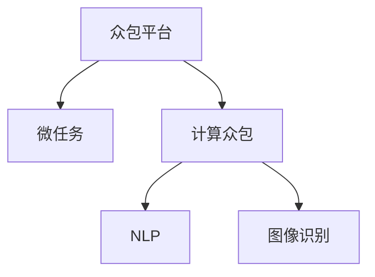

                 

# 众包：释放人类计算的力量

> 关键词：众包,人类计算,分布式系统,众包平台,计算众包,劳动力市场,微任务,自然语言处理(NLP),图像识别,数据标注,自动化

## 1. 背景介绍

### 1.1 问题由来
随着互联网技术的发展，世界进入了信息时代。大数据和人工智能技术的进步，为各行各业带来了巨大的机遇和挑战。在这波科技浪潮中，一个新兴的领域——众包（Crowdsourcing）——正在改变我们的生活和工作方式。

众包最初是指利用网络平台汇聚大量独立的个体（通常是远程劳动者），通过完成微任务（Microtask）的形式，实现大规模协作，从而解决复杂问题。其核心思想是“分布式智慧”，即通过群体智慧协作完成复杂、繁琐或需要专业知识的任务，最大化利用人类计算能力。

### 1.2 问题核心关键点
众包的出现打破了传统组织形式的界限，让个体与企业、政府之间的协同更加高效。它不仅降低了组织成本，提高了工作效率，还激发了更多人的创新潜力和社会参与感。

但众包模式也有其局限性：

- **劳动力市场不稳定**：众包平台依赖于大量的自由职业者，这些劳动者往往难以获得长期稳定的工作保障。
- **激励机制问题**：如何公平分配收益，激励劳动者积极工作，是一个复杂的经济问题。
- **任务质量难以保证**：由于缺乏质量控制，部分众包平台上的任务可能存在质量参差不齐的问题。
- **法律和伦理挑战**：众包平台如何平衡保护劳动者和平台方的权益，避免剥削和数据隐私风险，仍是一个亟待解决的问题。

本文将从众包平台的设计、实现和应用三个层面，探讨如何更好地释放人类计算的力量，助力大数据和人工智能技术的落地应用。

## 2. 核心概念与联系

### 2.1 核心概念概述

为更好地理解众包系统的工作原理和应用场景，本节将介绍几个关键概念：

- **众包平台（Crowdsourcing Platform）**：一个在线平台，用于汇聚并管理众包任务和自由职业者，促进供需双方高效匹配。
- **微任务（Microtask）**：一种简单的、可单独完成的小任务，通常需要几秒钟至几分钟的完成时间，适合个体劳动者完成。
- **计算众包（Computational Crowdsourcing）**：利用众包平台解决计算密集型问题，如数据标注、图像识别等，依赖大量劳动者的并行计算能力。
- **自然语言处理（NLP）**：使用计算众包技术对文本数据进行标注、分类、翻译等处理，辅助大规模语料库的构建。
- **图像识别**：通过众包平台上的劳动者对图像进行标注、分类等操作，训练和优化深度学习模型，提升图像处理能力。

这些概念之间的逻辑关系可以通过以下Mermaid流程图来展示：



这个流程图展示了一个典型众包系统的核心流程：

1. 众包平台将复杂任务分解为微任务，并发布给劳动者。
2. 计算众包利用大量劳动者的并行计算能力，完成数据标注、图像识别等任务。
3. 自然语言处理利用计算众包技术对文本数据进行处理，辅助构建大规模语料库。
4. 图像识别任务通过劳动者对图像的标注，训练和优化深度学习模型。

## 3. 核心算法原理 & 具体操作步骤
### 3.1 算法原理概述

众包系统的工作原理可以概括为以下几个步骤：

1. **任务分配**：平台将任务分解为微任务，分配给合适的劳动者。
2. **任务执行**：劳动者在线上接任务并独立完成。
3. **结果审核**：平台对劳动者提交的结果进行审核，筛选出符合要求的结果。
4. **报酬结算**：平台根据劳动者的表现，计算并发放报酬。

基于此，众包系统可以进一步细分为任务管理和劳动管理两个模块，其算法流程如下：

### 3.2 算法步骤详解

**任务管理模块**：

1. **任务生成**：根据实际需求，生成微任务，并将其描述为自然语言。
2. **任务分解**：将复杂任务分解为多个独立的微任务。
3. **任务发布**：将微任务发布到众包平台上，等待劳动者接取。

**劳动管理模块**：

1. **劳动者注册**：平台允许劳动者注册账号，填写个人资料。
2. **劳动者接取任务**：劳动者浏览并接取任务，开始执行。
3. **劳动者提交结果**：劳动者完成后将结果提交到平台。
4. **平台审核结果**：平台对劳动者提交的结果进行审核，筛选出合格的结果。
5. **报酬结算**：根据审核结果和劳动者的工作表现，平台计算并发放报酬。

### 3.3 算法优缺点

众包系统的主要优点包括：

- **成本低**：利用大量自由职业者，大幅度降低了雇佣全职员工的高成本。
- **效率高**：利用并行计算能力，可以短时间内完成大量微任务。
- **灵活性高**：平台可以根据需求快速调整任务量和劳动者数量，适应不同规模的项目。
- **适应性强**：适用于多种类型的任务，如文本标注、图像识别等。

同时，众包系统也存在以下缺点：

- **质量参差不齐**：由于缺乏专业质量控制，部分劳动者提交的结果可能质量较低。
- **激励机制复杂**：如何公平分配收益，激励劳动者高效工作，是一个复杂的经济问题。
- **隐私风险**：劳动者上传的个人数据可能存在泄露风险，平台需确保数据安全。
- **平台依赖度高**：平台若出现故障或政策调整，可能对劳动者和任务执行产生重大影响。

### 3.4 算法应用领域

众包系统已经广泛应用于以下多个领域：

1. **数据标注**：通过众包平台对大规模语料库进行标注，辅助训练深度学习模型，提升模型性能。
2. **图像识别**：利用劳动者对图像进行标注和分类，训练和优化深度学习模型，提升图像识别能力。
3. **自然语言处理**：通过众包平台对文本数据进行标注、分类、翻译等处理，辅助大规模语料库的构建。
4. **人工智能辅助开发**：利用众包平台汇聚开发者和专家，解决复杂算法问题，提升人工智能技术研发效率。
5. **智慧城市建设**：通过众包平台收集城市运行数据，辅助城市管理和决策，提升智慧城市建设水平。
6. **在线教育**：利用众包平台进行在线教学资源共享，提升教育资源分配的公平性和覆盖面。

这些领域的应用，展示了众包系统的强大潜力，也预示了其未来发展的广阔前景。

## 4. 数学模型和公式 & 详细讲解 & 举例说明

### 4.1 数学模型构建

本节将使用数学语言对众包系统的核心算法进行更加严格的刻画。

设众包平台上有 $N$ 个微任务，需要 $M$ 个劳动者完成。每个劳动者的工作效率为 $p_i$，完成任务的概率为 $q_i$。设任务完成时间为 $t_i$，劳动者接取任务的概率为 $r_i$。

设劳动者在 $t_i$ 时刻接取任务，并在 $t_i+u_i$ 时刻完成任务。则每个劳动者的总工作时间为 $U_i=t_i+u_i$。

设平台分配给每个任务的价格为 $w$，劳动者完成每个任务后获得的报酬为 $p_i w$。设劳动者在 $t_i$ 时刻开始接取任务，并在 $t_i+u_i$ 时刻完成任务，则劳动者的总报酬为：

$$
\text{报酬} = p_i w u_i
$$

### 4.2 公式推导过程

设平台希望在单位时间内完成所有任务，且任务分配平衡，即每个任务的分配概率为 $c$。则平台单位时间的总任务量为：

$$
Nc = \sum_{i=1}^N N_i = \sum_{i=1}^N r_i U_i
$$

设平台希望在单位时间内完成所有任务的概率为 $P$。则有：

$$
P = \prod_{i=1}^N p_i u_i
$$

根据任务分配的平衡性，每个任务完成的概率为：

$$
c = \frac{1}{N}
$$

因此，每个任务完成所需的期望时间为：

$$
\mathbb{E}[t_i] = \sum_{i=1}^N \frac{r_i}{c} U_i = \sum_{i=1}^N r_i U_i = Nc
$$

设平台期望完成所有任务所需的总时间 $T$，则：

$$
T = \sum_{i=1}^N \mathbb{E}[t_i]
$$

### 4.3 案例分析与讲解

设平台有 $N=100$ 个任务，每个任务需要 $U_i=5$ 分钟完成。劳动者有 $M=10$ 人，每个劳动者的工作效率 $p_i=0.8$，完成任务的概率 $q_i=0.9$。设每个任务的价格 $w=10$。平台希望在 $T=60$ 分钟内完成所有任务。

首先，根据任务完成的期望时间，计算任务分配概率：

$$
c = \frac{1}{N} = \frac{1}{100}
$$

则每个任务完成的期望时间 $\mathbb{E}[t_i] = Nc = 5$ 分钟。

其次，计算每个劳动者在 $T$ 单位时间内完成的任务数：

$$
\text{任务数} = \frac{T}{\mathbb{E}[t_i]} = \frac{60}{5} = 12
$$

每个劳动者需要完成 $12$ 个任务，计算每个劳动者的报酬：

$$
\text{报酬} = p_i w U_i = 0.8 \times 10 \times 5 = 40
$$

因此，平台需要支付劳动者的总报酬为 $40 \times M = 400$。

## 5. 项目实践：代码实例和详细解释说明
### 5.1 开发环境搭建

在进行众包系统开发前，我们需要准备好开发环境。以下是使用Python进行Flask开发的环境配置流程：

1. 安装Anaconda：从官网下载并安装Anaconda，用于创建独立的Python环境。

2. 创建并激活虚拟环境：
```bash
conda create -n crowdsourcing_env python=3.8 
conda activate crowdsourcing_env
```

3. 安装Flask：
```bash
pip install Flask
```

4. 安装其他依赖：
```bash
pip install numpy pandas requests sqlalchemy flask_sqlalchemy
```

完成上述步骤后，即可在`crowdsourcing_env`环境中开始众包系统的开发。

### 5.2 源代码详细实现

下面我们以众包平台为例，给出使用Flask框架对众包系统进行开发的PyTorch代码实现。

首先，定义任务和劳动者模型：

```python
from flask import Flask, request, jsonify
import pandas as pd
from sqlalchemy import create_engine

app = Flask(__name__)

# 数据库连接
engine = create_engine('sqlite:///crowdsourcing.db')

# 任务模型
class Task:
    def __init__(self, task_id, description, price, deadline):
        self.task_id = task_id
        self.description = description
        self.price = price
        self.deadline = deadline
        self.completed = False
        self.completed_by = None

    def complete(self, worker):
        self.completed = True
        self.completed_by = worker
        self.price = worker * self.price

# 劳动者模型
class Worker:
    def __init__(self, worker_id, skill):
        self.worker_id = worker_id
        self.skill = skill
        self.assigned_tasks = []

    def assign(self, task):
        self.assigned_tasks.append(task)

# 任务池
task_pool = []
worker_pool = []

# 添加任务
@app.route('/tasks', methods=['POST'])
def add_task():
    data = request.json
    task = Task(data['task_id'], data['description'], data['price'], data['deadline'])
    task_pool.append(task)
    return jsonify({'task_id': task.task_id, 'description': task.description, 'price': task.price, 'deadline': task.deadline})

# 获取任务
@app.route('/tasks/available', methods=['GET'])
def get_available_tasks():
    available_tasks = [task for task in task_pool if not task.completed]
    return jsonify(available_tasks)

# 劳动者接取任务
@app.route('/workers/assign', methods=['POST'])
def assign_task():
    data = request.json
    worker = Worker(data['worker_id'], data['skill'])
    task = Task(data['task_id'], data['description'], data['price'], data['deadline'])
    worker.assign(task)
    task_pool.remove(task)
    return jsonify({'task_id': task.task_id, 'description': task.description, 'price': task.price, 'deadline': task.deadline})

# 劳动者提交任务
@app.route('/workers/submit', methods=['POST'])
def submit_task():
    data = request.json
    worker = Worker(data['worker_id'], data['skill'])
    task = Task(data['task_id'], data['description'], data['price'], data['deadline'])
    task.complete(worker)
    return jsonify({'task_id': task.task_id, 'description': task.description, 'price': task.price, 'completed_by': task.completed_by})

# 平台报酬结算
@app.route('/workers/payment', methods=['GET'])
def get_payment():
    payment = 0
    for task in task_pool:
        payment += task.price
    return jsonify({'payment': payment})
```

### 5.3 代码解读与分析

让我们再详细解读一下关键代码的实现细节：

**任务和劳动者模型**：

- `Task` 类表示一个任务，包含任务ID、描述、价格、截止时间和是否完成等属性。
- `Worker` 类表示一个劳动者，包含劳动者ID、技能和已分配的任务等属性。
- 数据库连接和操作使用 SQLAlchemy 库实现。

**路由函数**：

- `/add_task`：添加新任务到任务池。
- `/get_available_tasks`：获取可接取的任务列表。
- `/assign_task`：劳动者接取任务。
- `/submit_task`：劳动者提交任务。
- `/workers/payment`：计算劳动者报酬。

**接口实现**：

- `add_task`：接收任务信息，创建 `Task` 对象，添加到任务池。
- `get_available_tasks`：从任务池中筛选出未完成任务。
- `assign_task`：劳动者接取任务，并将任务从任务池中移除。
- `submit_task`：劳动者完成并提交任务，更新任务状态和报酬。
- `get_payment`：计算劳动者报酬总和。

### 5.4 运行结果展示

以上代码实现了简单的众包系统功能，可以通过访问API进行任务分配和劳动者接取。例如，执行以下Python代码，可以向任务池添加一个新的任务：

```python
from flask import Flask, request, jsonify
import pandas as pd
from sqlalchemy import create_engine

app = Flask(__name__)

# 数据库连接
engine = create_engine('sqlite:///crowdsourcing.db')

# 任务模型
class Task:
    def __init__(self, task_id, description, price, deadline):
        self.task_id = task_id
        self.description = description
        self.price = price
        self.deadline = deadline
        self.completed = False
        self.completed_by = None

    def complete(self, worker):
        self.completed = True
        self.completed_by = worker
        self.price = worker * self.price

# 劳动者模型
class Worker:
    def __init__(self, worker_id, skill):
        self.worker_id = worker_id
        self.skill = skill
        self.assigned_tasks = []

    def assign(self, task):
        self.assigned_tasks.append(task)

# 任务池
task_pool = []
worker_pool = []

# 添加任务
@app.route('/tasks', methods=['POST'])
def add_task():
    data = request.json
    task = Task(data['task_id'], data['description'], data['price'], data['deadline'])
    task_pool.append(task)
    return jsonify({'task_id': task.task_id, 'description': task.description, 'price': task.price, 'deadline': task.deadline})

# 获取任务
@app.route('/tasks/available', methods=['GET'])
def get_available_tasks():
    available_tasks = [task for task in task_pool if not task.completed]
    return jsonify(available_tasks)

# 劳动者接取任务
@app.route('/workers/assign', methods=['POST'])
def assign_task():
    data = request.json
    worker = Worker(data['worker_id'], data['skill'])
    task = Task(data['task_id'], data['description'], data['price'], data['deadline'])
    worker.assign(task)
    task_pool.remove(task)
    return jsonify({'task_id': task.task_id, 'description': task.description, 'price': task.price, 'deadline': task.deadline})

# 劳动者提交任务
@app.route('/workers/submit', methods=['POST'])
def submit_task():
    data = request.json
    worker = Worker(data['worker_id'], data['skill'])
    task = Task(data['task_id'], data['description'], data['price'], data['deadline'])
    task.complete(worker)
    return jsonify({'task_id': task.task_id, 'description': task.description, 'price': task.price, 'completed_by': task.completed_by})

# 平台报酬结算
@app.route('/workers/payment', methods=['GET'])
def get_payment():
    payment = 0
    for task in task_pool:
        payment += task.price
    return jsonify({'payment': payment})
```

以上代码实现了简单的众包系统功能，可以通过访问API进行任务分配和劳动者接取。例如，执行以下Python代码，可以向任务池添加一个新的任务：

```python
import requests

# 添加任务
response = requests.post('http://localhost:5000/tasks', json={'task_id': 'T001', 'description': '这是任务1', 'price': 100, 'deadline': '2023-01-01'})
print(response.json())
```

## 6. 实际应用场景
### 6.1 智能客服系统

基于众包平台的智能客服系统，可以显著提升客户服务的效率和质量。传统的客服系统依赖于大量客服人员，高峰期响应缓慢，且服务质量难以保证。而众包平台可以利用大量自由职业者，提供7x24小时不间断服务，快速响应客户咨询，用自然流畅的语言解答各类常见问题。

在技术实现上，可以收集企业内部的历史客服对话记录，将问题和最佳答复构建成监督数据，在此基础上对众包平台进行微调，使其能够自动理解用户意图，匹配最合适的答案模板进行回复。对于客户提出的新问题，还可以接入检索系统实时搜索相关内容，动态组织生成回答。如此构建的智能客服系统，能大幅提升客户咨询体验和问题解决效率。

### 6.2 金融舆情监测

金融机构需要实时监测市场舆论动向，以便及时应对负面信息传播，规避金融风险。传统的人工监测方式成本高、效率低，难以应对网络时代海量信息爆发的挑战。基于众包平台的文本分类和情感分析技术，为金融舆情监测提供了新的解决方案。

具体而言，可以收集金融领域相关的新闻、报道、评论等文本数据，并对其进行主题标注和情感标注。在此基础上对众包平台进行微调，使其能够自动判断文本属于何种主题，情感倾向是正面、中性还是负面。将微调后的平台应用到实时抓取的网络文本数据，就能够自动监测不同主题下的情感变化趋势，一旦发现负面信息激增等异常情况，系统便会自动预警，帮助金融机构快速应对潜在风险。

### 6.3 个性化推荐系统

当前的推荐系统往往只依赖用户的历史行为数据进行物品推荐，无法深入理解用户的真实兴趣偏好。基于众包平台的个性化推荐系统可以更好地挖掘用户行为背后的语义信息，从而提供更精准、多样的推荐内容。

在实践中，可以收集用户浏览、点击、评论、分享等行为数据，提取和用户交互的物品标题、描述、标签等文本内容。将文本内容作为模型输入，用户的后续行为（如是否点击、购买等）作为监督信号，在此基础上对众包平台进行微调，使其能够从文本内容中准确把握用户的兴趣点。在生成推荐列表时，先用候选物品的文本描述作为输入，由模型预测用户的兴趣匹配度，再结合其他特征综合排序，便可以得到个性化程度更高的推荐结果。

### 6.4 未来应用展望

随着众包平台技术的不断进步，其在更多领域的应用前景值得期待：

1. **智慧医疗**：基于众包平台的医疗问答、病历分析、药物研发等应用将提升医疗服务的智能化水平，辅助医生诊疗，加速新药开发进程。
2. **在线教育**：利用众包平台进行在线教学资源共享，提升教育资源分配的公平性和覆盖面。
3. **智慧城市建设**：通过众包平台收集城市运行数据，辅助城市管理和决策，提升智慧城市建设水平。
4. **在线广告**：利用众包平台进行广告文案创作、点击率预测等，提升广告效果和ROI。
5. **环境监测**：通过众包平台进行地理数据标注、环境监测等，提升环境科学研究的准确性和时效性。
6. **社交媒体分析**：利用众包平台进行社交媒体内容分析，辅助舆情监控、品牌管理等。

未来，伴随众包平台技术的持续演进，相信其应用场景将更加丰富多样，为各行各业带来变革性影响。

## 7. 工具和资源推荐
### 7.1 学习资源推荐

为了帮助开发者系统掌握众包平台的设计和实现，这里推荐一些优质的学习资源：

1. **《Crowdsourcing in Information Technology: Foundations, Challenges, and Applications》**：这本书系统介绍了众包平台的设计和实现方法，适用于对众包平台有深入研究的读者。

2. **Coursera上的《Human-Centered Data Science》课程**：由斯坦福大学开设的课程，介绍了数据科学和机器学习在众包平台中的应用，适合对数据科学感兴趣的读者。

3. **Kaggle上的众包平台竞赛**：Kaggle平台上有许多众包平台相关的数据集和竞赛，通过实际项目体验，可以快速掌握众包平台的开发和应用。

4. **GitHub上的开源众包平台项目**：如CrowdFlower、Amazon Mechanical Turk等，可以通过阅读源代码，理解众包平台的核心算法和实现细节。

5. **《Crowdsourcing: Crowds, Knowledge, and Complexity》**：这本书探讨了众包平台的工作机制和应用场景，适合对众包平台理论研究感兴趣的读者。

通过对这些资源的学习实践，相信你一定能够快速掌握众包平台的核心算法和实现技巧，并用于解决实际的NLP问题。

### 7.2 开发工具推荐

高效的开发离不开优秀的工具支持。以下是几款用于众包平台开发的常用工具：

1. **Flask**：基于Python的轻量级Web框架，易于上手，适合快速开发Web应用。

2. **SQLAlchemy**：Python的SQL工具库，支持复杂的数据库操作和ORM框架，适合构建数据驱动的应用。

3. **Pandas**：Python的数据分析库，支持数据清洗、处理和分析，适合数据密集型任务。

4. **NumPy**：Python的科学计算库，支持高效的数值计算和数组操作，适合对数据进行统计和处理。

5. **Scikit-learn**：Python的机器学习库，支持多种常见的机器学习算法，适合构建数据驱动的智能应用。

6. **TensorFlow**：Google的深度学习框架，支持分布式计算和GPU加速，适合大规模数据处理和深度学习任务。

合理利用这些工具，可以显著提升众包平台开发的效率和效果，加快创新迭代的步伐。

### 7.3 相关论文推荐

众包平台的研究源于学界的持续探索。以下是几篇奠基性的相关论文，推荐阅读：

1. **《Crowdsourcing as a New Paradigm for Multimedia Data Collection》**：提出通过众包平台收集多媒体数据的方法，探讨了数据标注和质量控制问题。

2. **《Crowdsourcing Manufacturing: A Survey of Opportunities and Challenges》**：探讨了众包平台在制造业中的应用，介绍了众包平台的工作机制和应用场景。

3. **《Crowdsourcing Platforms: An Overview》**：介绍了众包平台的类型、设计和应用，适合对众包平台理论研究感兴趣的读者。

4. **《Crowdsourcing: A Review of Literature on the Cost, Quality, and Efficiency of Data Collection》**：回顾了众包平台的研究进展，探讨了众包平台在数据收集中的应用和挑战。

5. **《Crowdsourcing in Software Development》**：介绍了众包平台在软件开发中的应用，探讨了软件开发生命周期中各个阶段的众包实践。

这些论文代表了众包平台研究的最新进展，通过学习这些前沿成果，可以帮助研究者把握学科前进方向，激发更多的创新灵感。

## 8. 总结：未来发展趋势与挑战
### 8.1 总结

本文对众包平台的设计、实现和应用进行了全面系统的介绍。首先阐述了众包平台的背景和意义，明确了其在降低成本、提高效率等方面的独特价值。其次，从原理到实践，详细讲解了众包平台的核心算法和操作步骤，给出了众包平台开发的完整代码实例。同时，本文还广泛探讨了众包平台在智能客服、金融舆情、个性化推荐等多个行业领域的应用前景，展示了其强大的潜力。

通过本文的系统梳理，可以看到，众包平台作为释放人类计算力量的重要工具，正在改变各行各业的运作模式，成为数字化转型的关键技术之一。其广泛的应用场景和显著的效益，使得众包平台成为各行各业竞相探索的重要领域。

### 8.2 未来发展趋势

展望未来，众包平台的发展趋势包括：

1. **智能化提升**：利用机器学习和大数据技术，优化任务分配和劳动者匹配算法，提高平台智能化水平。
2. **自动化推进**：引入自动化任务生成、自动化审核等技术，降低人工干预，提升系统效率。
3. **多模态整合**：将众包平台与其他技术（如物联网、区块链等）结合，拓展应用场景，提升系统能力。
4. **平台互操作**：建立标准化的接口和数据格式，实现不同平台之间的数据和任务互操作，提升协作效率。
5. **伦理和社会责任**：加强对平台运营的伦理和社会责任监管，保护劳动者权益，避免剥削和歧视。

这些趋势凸显了众包平台技术的广阔前景，也预示了其未来发展的方向。

### 8.3 面临的挑战

尽管众包平台已经取得了瞩目成就，但在迈向更加智能化、普适化应用的过程中，它仍面临诸多挑战：

1. **任务质量控制**：如何保证众包平台上的任务质量和一致性，是一个复杂的技术问题。
2. **激励机制设计**：如何公平分配收益，激励劳动者高效工作，是一个复杂的经济问题。
3. **隐私和安全**：劳动者上传的个人数据可能存在泄露风险，平台需确保数据安全。
4. **平台运营稳定性**：平台若出现故障或政策调整，可能对劳动者和任务执行产生重大影响。

### 8.4 研究展望

面对众包平台面临的挑战，未来的研究需要在以下几个方面寻求新的突破：

1. **智能化优化**：引入机器学习和大数据技术，优化任务分配和劳动者匹配算法，提升平台智能化水平。
2. **自动化推进**：引入自动化任务生成、自动化审核等技术，降低人工干预，提升系统效率。
3. **多模态整合**：将众包平台与其他技术（如物联网、区块链等）结合，拓展应用场景，提升系统能力。
4. **平台互操作**：建立标准化的接口和数据格式，实现不同平台之间的数据和任务互操作，提升协作效率。
5. **伦理和社会责任**：加强对平台运营的伦理和社会责任监管，保护劳动者权益，避免剥削和歧视。

这些研究方向的探索，必将引领众包平台技术迈向更高的台阶，为构建安全、可靠、高效、公平的智能系统铺平道路。面向未来，众包平台需要与其他人工智能技术进行更深入的融合，如自然语言处理、计算机视觉、强化学习等，多路径协同发力，共同推动智能化系统的发展。只有勇于创新、敢于突破，才能不断拓展众包平台技术的边界，让人类计算能力更好地服务于社会。

## 9. 附录：常见问题与解答

**Q1：众包平台如何保证任务的质量？**

A: 任务质量控制是众包平台的核心问题之一。以下是几种常见的任务质量控制策略：

1. **任务设计**：设计清晰、简洁的任务描述，确保劳动者能够准确理解任务要求。
2. **测试任务**：在正式任务发布前，进行测试任务，筛选出合适的劳动者。
3. **质量审核**：设置审核机制，对劳动者提交的结果进行审核，筛选出合格的结果。
4. **激励机制**：设计合理的激励机制，激励劳动者高效工作，提升任务质量。

这些策略通常需要结合使用，才能有效提升众包平台的任务质量。

**Q2：众包平台的激励机制有哪些？**

A: 众包平台的激励机制是保证劳动者积极参与的重要手段。以下是几种常见的激励机制：

1. **基于任务的奖励**：根据任务完成情况，给予劳动者适当的报酬。
2. **基于时间的奖励**：根据劳动者的工作时长，给予适当的报酬。
3. **竞赛机制**：通过竞赛的方式，激励劳动者积极参与任务，提升平台竞争力。
4. **终身激励**：对表现优异的劳动者进行奖励，提升平台忠诚度和稳定性。

这些激励机制可以根据具体应用场景进行灵活组合，以达到最佳效果。

**Q3：众包平台如何保护劳动者隐私？**

A: 众包平台在运营过程中，必须重视劳动者的隐私保护，避免数据泄露和滥用。以下是几种常见的隐私保护策略：

1. **数据匿名化**：对劳动者上传的数据进行匿名化处理，确保数据隐私。
2. **访问控制**：设置严格的访问控制机制，确保只有授权人员可以访问敏感数据。
3. **数据加密**：对数据进行加密处理，防止数据泄露。
4. **隐私协议**：制定隐私协议，明确平台和劳动者之间的隐私责任和义务。

这些策略需要结合使用，才能有效保护劳动者的隐私。

**Q4：众包平台如何提升任务分配效率？**

A: 任务分配效率是众包平台运营的核心问题之一。以下是几种常见的任务分配策略：

1. **动态分配**：根据劳动者的工作状态和任务需求，动态调整任务分配。
2. **任务优先级**：对任务进行优先级排序，确保重要任务能够优先分配。
3. **匹配算法**：优化匹配算法，提升任务和劳动者之间的匹配效率。
4. **任务池管理**：合理管理任务池，避免任务积压和闲置。

这些策略需要结合使用，才能有效提升众包平台的任务分配效率。

**Q5：众包平台如何提升劳动者满意度？**

A: 劳动者满意度是众包平台运营的重要指标之一。以下是几种常见的提升劳动者满意度的方法：

1. **任务透明化**：明确任务要求和报酬标准，增强劳动者对任务的信任感。
2. **及时反馈**：及时反馈劳动者工作表现，给予积极反馈和建议。
3. **持续培训**：对劳动者进行持续培训，提升其工作能力和满意度。
4. **社区建设**：建立劳动者社区，增强劳动者之间的交流和协作。

这些方法需要结合使用，才能有效提升众包平台劳动者的满意度。

作者：禅与计算机程序设计艺术 / Zen and the Art of Computer Programming

