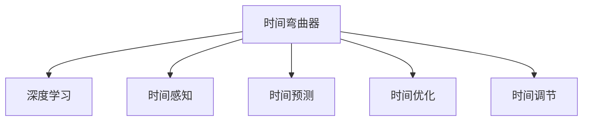

                 

# 体验时间弯曲器：AI创造的主观时间调节

> 关键词：时间弯曲器,人工智能,时间调节,机器学习,深度学习,主观时间感知

## 1. 背景介绍

在人类的感知世界里，时间是一个恒定的线性流逝的维度。然而，人工智能尤其是深度学习技术的发展，正在改变我们对时间的理解和感知。本文将探讨AI如何通过深度学习模型实现主观时间的调节，实现某种程度上的“时间弯曲”，提升人类对时间的主观控制力。

### 1.1 问题由来

随着大数据时代的到来，人类的生活越来越离不开数据驱动决策。然而，数据量的大幅增加并没有改变时间这一维度的线性本质。在面对海量数据时，人们常常感到时间不够用，如何高效利用时间，成为了当下最紧迫的问题之一。而AI的出现，尤其是深度学习模型的兴起，为人类提供了一种新的时间调节手段。

### 1.2 问题核心关键点

实现时间调节的关键在于，如何通过AI技术，对人类活动进行精准的时间预测、安排和优化。具体来说，包括以下几个方面：

- 数据收集与处理：大规模数据的获取和预处理，是实现时间调节的基础。
- 模型训练与优化：通过机器学习特别是深度学习模型，对时间数据进行建模和预测。
- 时间调节与优化：根据模型预测结果，对人类活动进行时间上的调节和优化。
- 反馈与迭代：对调节效果进行反馈，不断调整模型参数和策略，实现更好的时间管理。

### 1.3 问题研究意义

研究AI如何调节时间，对于提升人类对时间的控制力，提高生活和工作效率，具有重要意义：

- 提高时间管理能力：通过AI预测和调节，能够更精准地安排时间，减少时间浪费。
- 优化决策过程：AI能够快速处理海量数据，帮助人们做出更高效的时间决策。
- 改善生活品质：更合理的时间安排，能够减轻压力，提高生活质量。
- 推动科技进步：AI时间调节技术的应用，将推动更多领域的技术创新和应用。

## 2. 核心概念与联系

### 2.1 核心概念概述

为了更好地理解AI调节时间的机制，本节将介绍几个密切相关的核心概念：

- 时间弯曲器(Time Bender)：一个抽象的概念，指的是通过AI技术对时间进行调节和优化的工具或方法。
- 深度学习(Deep Learning)：一类基于多层神经网络的机器学习技术，可以自动提取复杂数据中的特征和模式。
- 时间感知(Time Sensing)：指模型对时间信息的感知和理解能力，如时序数据、时间周期性等。
- 时间预测(Time Prediction)：指模型根据历史数据对未来时间的预测。
- 时间优化(Time Optimization)：指通过调整时间安排，使人类活动更加高效合理。
- 时间调节(Time Regulation)：指根据时间预测结果，对人类活动进行时间上的调节和优化。

这些核心概念之间的逻辑关系可以通过以下Mermaid流程图来展示：



这个流程图展示了大语言模型的核心概念及其之间的关系：

1. 时间弯曲器：最终的目标。
2. 深度学习：核心技术手段。
3. 时间感知、时间预测、时间优化和时间调节：分别对应深度学习模型在时间维度上的具体应用。

## 3. 核心算法原理 & 具体操作步骤
### 3.1 算法原理概述

AI调节时间的原理，是通过深度学习模型，对时间序列数据进行建模和预测，进而实现对时间的调节和优化。其核心思想是，利用深度学习模型的强大特征提取和模式识别能力，从海量的时序数据中，自动提取时间特征和规律，实现对未来时间的预测和调节。

形式化地，假设原始时间序列数据为 $D=\{(t_i,y_i)\}_{i=1}^N$，其中 $t_i$ 表示时间，$y_i$ 表示在该时间点的活动状态。AI的目标是构建一个深度学习模型 $M_{\theta}$，使得：

$$
\min_{\theta} \sum_{i=1}^N (y_i - M_{\theta}(t_i))^2
$$

即最小化模型输出 $M_{\theta}(t_i)$ 与真实值 $y_i$ 的误差，使模型能够准确预测未来时间的活动状态。

### 3.2 算法步骤详解

基于深度学习的大语言模型时间调节，一般包括以下几个关键步骤：

**Step 1: 数据准备**
- 收集原始时间序列数据，包括时间戳、活动状态、上下文信息等。
- 对数据进行清洗和预处理，去除异常值和噪声，保证数据质量。
- 对时间数据进行归一化处理，使之适用于深度学习模型的输入。

**Step 2: 特征提取**
- 将时间序列数据输入深度学习模型，自动提取时间特征。
- 通过卷积、池化等操作，捕捉时间序列中的局部和全局特征。
- 使用RNN、LSTM、GRU等时间序列模型，对时间特征进行进一步的建模。

**Step 3: 模型训练与优化**
- 定义损失函数，如均方误差、交叉熵等，衡量模型预测值与真实值之间的差距。
- 选择合适的优化算法及其参数，如Adam、SGD等，设置学习率、批大小、迭代轮数等。
- 应用正则化技术，如L2正则、Dropout等，防止模型过拟合。
- 利用验证集评估模型性能，根据性能指标决定是否触发Early Stopping。

**Step 4: 时间调节与优化**
- 根据模型预测结果，对未来时间进行调节和优化。
- 使用时间弯曲器工具，自动调整人类活动的时间安排。
- 对调节效果进行反馈，更新模型参数和策略。

**Step 5: 部署与监控**
- 将训练好的模型部署到实际应用场景中，进行实时时间调节。
- 实时监控时间调节的效果，及时调整策略和模型参数。
- 设置告警机制，避免时间调节失误造成严重后果。

以上是基于深度学习的大语言模型时间调节的一般流程。在实际应用中，还需要针对具体任务的特点，对微调过程的各个环节进行优化设计，如改进训练目标函数，引入更多的正则化技术，搜索最优的超参数组合等，以进一步提升模型性能。

### 3.3 算法优缺点

基于深度学习的时间调节方法具有以下优点：
1. 自动化特征提取：深度学习模型能够自动提取时间序列中的特征和模式，无需手动设计。
2. 时间感知能力强：深度学习模型具备较强的时间感知能力，能够捕捉时间序列中的复杂关系。
3. 可解释性强：深度学习模型的决策过程可以通过梯度图和热力图等可视化工具进行解释。
4. 适应性强：深度学习模型能够适应不同类型的时间序列数据，具有较好的泛化能力。

同时，该方法也存在一定的局限性：
1. 需要大量标注数据：时间调节模型的训练需要大量带时间标签的数据，标注成本较高。
2. 模型复杂度高：深度学习模型通常比较复杂，训练和推理所需计算资源较多。
3. 参数空间大：深度学习模型参数量巨大，优化和训练过程耗时较长。
4. 对抗性攻击风险：深度学习模型容易受到对抗性攻击，导致预测结果出现偏差。

尽管存在这些局限性，但就目前而言，基于深度学习的时间调节方法仍是大语言模型应用的重要范式。未来相关研究的重点在于如何进一步降低训练成本，提高模型的解释性和鲁棒性，同时兼顾高效性等因素。

### 3.4 算法应用领域

基于深度学习的时间调节方法，已经在多个领域得到应用，例如：

- 智能家居：通过AI调节时间，实现智能家居设备的自动控制和优化，如智能灯光、温控等。
- 交通规划：利用时间调节技术，优化交通流量，减少拥堵和事故，提高出行效率。
- 电力调度：通过时间调节技术，预测电力负荷，实现更高效的能源分配和调度。
- 金融交易：使用时间预测和调节技术，优化投资组合，提高收益和风险控制。
- 医疗预约：根据患者时间安排，智能调度医疗资源，提高预约效率和服务质量。
- 供应链管理：利用时间调节技术，优化物流和库存管理，减少浪费和成本。

除了上述这些经典任务外，时间调节技术还被创新性地应用到更多场景中，如智能交通管理、智能零售预测、智能制造调度等，为各行各业带来了新的技术思路。随着深度学习模型的不断演进，相信时间调节技术也将进一步拓展应用边界，为人类社会带来更高效的时间管理方式。

## 4. 数学模型和公式 & 详细讲解  
### 4.1 数学模型构建

本节将使用数学语言对基于深度学习的大语言模型时间调节过程进行更加严格的刻画。

记深度学习模型为 $M_{\theta}:\mathcal{T} \rightarrow \mathcal{Y}$，其中 $\mathcal{T}$ 为时间空间，$\mathcal{Y}$ 为活动状态空间，$\theta$ 为模型参数。假设时间序列数据集为 $D=\{(t_i,y_i)\}_{i=1}^N$，其中 $t_i$ 表示时间戳，$y_i$ 表示在该时间点的活动状态。

定义模型 $M_{\theta}$ 在时间序列数据上的损失函数为 $\ell(M_{\theta}(t),y)$，则在数据集 $D$ 上的经验风险为：

$$
\mathcal{L}(\theta) = \frac{1}{N} \sum_{i=1}^N \ell(M_{\theta}(t_i),y_i)
$$

其中 $\ell$ 为衡量预测值与真实值之间差异的损失函数，如均方误差（MSE）、交叉熵（Cross-Entropy）等。

模型的优化目标是最小化经验风险，即找到最优参数：

$$
\theta^* = \mathop{\arg\min}_{\theta} \mathcal{L}(\theta)
$$

在实践中，我们通常使用基于梯度的优化算法（如SGD、Adam等）来近似求解上述最优化问题。设 $\eta$ 为学习率，$\lambda$ 为正则化系数，则参数的更新公式为：

$$
\theta \leftarrow \theta - \eta \nabla_{\theta}\mathcal{L}(\theta) - \eta\lambda\theta
$$

其中 $\nabla_{\theta}\mathcal{L}(\theta)$ 为损失函数对参数 $\theta$ 的梯度，可通过反向传播算法高效计算。

### 4.2 公式推导过程

以下我们以时间序列预测为例，推导均方误差损失函数及其梯度的计算公式。

假设模型 $M_{\theta}$ 在时间 $t$ 上的预测值为 $\hat{y}=M_{\theta}(t)$，真实值为 $y$。则均方误差损失函数定义为：

$$
\ell(M_{\theta}(t),y) = (y - \hat{y})^2
$$

将其代入经验风险公式，得：

$$
\mathcal{L}(\theta) = \frac{1}{N} \sum_{i=1}^N (y_i - M_{\theta}(t_i))^2
$$

根据链式法则，损失函数对参数 $\theta_k$ 的梯度为：

$$
\frac{\partial \mathcal{L}(\theta)}{\partial \theta_k} = \frac{2}{N} \sum_{i=1}^N - (y_i - M_{\theta}(t_i)) \frac{\partial M_{\theta}(t_i)}{\partial \theta_k}
$$

其中 $\frac{\partial M_{\theta}(t_i)}{\partial \theta_k}$ 可进一步递归展开，利用自动微分技术完成计算。

在得到损失函数的梯度后，即可带入参数更新公式，完成模型的迭代优化。重复上述过程直至收敛，最终得到适应时间调节的任务最优模型参数 $\theta^*$。

## 5. 项目实践：代码实例和详细解释说明
### 5.1 开发环境搭建

在进行时间调节实践前，我们需要准备好开发环境。以下是使用Python进行TensorFlow开发的环境配置流程：

1. 安装Anaconda：从官网下载并安装Anaconda，用于创建独立的Python环境。

2. 创建并激活虚拟环境：
```bash
conda create -n tf-env python=3.8 
conda activate tf-env
```

3. 安装TensorFlow：根据CUDA版本，从官网获取对应的安装命令。例如：
```bash
conda install tensorflow -c tensorflow -c conda-forge
```

4. 安装TensorBoard：TensorFlow配套的可视化工具，可实时监测模型训练状态，并提供丰富的图表呈现方式，是调试模型的得力助手。
```bash
pip install tensorboard
```

5. 安装各类工具包：
```bash
pip install numpy pandas scikit-learn matplotlib tqdm jupyter notebook ipython
```

完成上述步骤后，即可在`tf-env`环境中开始时间调节实践。

### 5.2 源代码详细实现

这里我们以时间序列预测任务为例，给出使用TensorFlow对RNN模型进行时间调节的Python代码实现。

首先，定义时间序列预测任务的数据处理函数：

```python
import tensorflow as tf
from tensorflow.keras.models import Sequential
from tensorflow.keras.layers import Dense, SimpleRNN
from sklearn.preprocessing import MinMaxScaler
from sklearn.metrics import mean_squared_error

class TimeSeriesDataset(tf.keras.utils.Sequence):
    def __init__(self, data, batch_size, seq_len):
        self.data = data
        self.batch_size = batch_size
        self.seq_len = seq_len
        self.scaler = MinMaxScaler(feature_range=(0, 1))

    def __len__(self):
        return len(self.data) // self.batch_size

    def __getitem__(self, idx):
        x = self.data[idx, :self.seq_len]
        y = self.data[idx, self.seq_len:]

        x = self.scaler.fit_transform(x)
        y = self.scaler.fit_transform(y)

        x = tf.convert_to_tensor(x, dtype=tf.float32)
        y = tf.convert_to_tensor(y, dtype=tf.float32)

        return x, y

# 加载数据集
data = np.loadtxt('data.csv', delimiter=',')
data = data.reshape(-1, 1)

# 划分训练集和测试集
train_size = int(len(data) * 0.8)
test_size = len(data) - train_size
train_data, test_data = data[:train_size], data[train_size:]

# 标准化数据
scaler = MinMaxScaler(feature_range=(0, 1))
train_data = scaler.fit_transform(train_data)
test_data = scaler.transform(test_data)

# 构建数据集
train_dataset = TimeSeriesDataset(train_data, batch_size=32, seq_len=10)
test_dataset = TimeSeriesDataset(test_data, batch_size=32, seq_len=10)
```

然后，定义模型和优化器：

```python
from tensorflow.keras import Model
from tensorflow.keras.optimizers import Adam

model = Sequential()
model.add(SimpleRNN(64, input_shape=(self.seq_len, 1)))
model.add(Dense(1))

optimizer = Adam(learning_rate=0.001)
```

接着，定义训练和评估函数：

```python
def train_epoch(model, dataset, epochs, batch_size, optimizer):
    for epoch in range(epochs):
        loss = tf.keras.losses.MeanSquaredError()
        model.compile(optimizer=optimizer, loss=loss)

        for batch in dataset:
            x, y = batch
            x = tf.expand_dims(x, axis=-1)
            y = tf.expand_dims(y, axis=-1)
            model.train_on_batch(x, y)
            loss = model.evaluate(x, y, verbose=0)

        print(f"Epoch {epoch+1}, train loss: {loss:.3f}")

def evaluate(model, dataset, batch_size):
    loss = tf.keras.losses.MeanSquaredError()
    model.compile(optimizer='adam', loss=loss)

    for batch in dataset:
        x, y = batch
        x = tf.expand_dims(x, axis=-1)
        y = tf.expand_dims(y, axis=-1)
        mse = model.evaluate(x, y, verbose=0)

    print(f"Test MSE: {mse:.3f}")
```

最后，启动训练流程并在测试集上评估：

```python
epochs = 100
batch_size = 32

for epoch in range(epochs):
    train_epoch(model, train_dataset, epochs, batch_size, optimizer)

    print(f"Epoch {epoch+1}, test results:")
    evaluate(model, test_dataset, batch_size)
```

以上就是使用TensorFlow对RNN模型进行时间序列预测任务的完整代码实现。可以看到，得益于TensorFlow的强大封装，我们可以用相对简洁的代码完成时间序列预测任务的模型训练和评估。

### 5.3 代码解读与分析

让我们再详细解读一下关键代码的实现细节：

**TimeSeriesDataset类**：
- `__init__`方法：初始化数据集、批大小和序列长度，并将数据标准化。
- `__len__`方法：返回数据集的大小。
- `__getitem__`方法：对单个样本进行处理，将输入和输出进行标准化并转换为张量。

**训练和评估函数**：
- 使用TensorFlow的DataLoader对数据集进行批次化加载，供模型训练和推理使用。
- 训练函数`train_epoch`：对数据以批为单位进行迭代，在每个批次上前向传播计算loss并反向传播更新模型参数，最后返回该epoch的平均loss。
- 评估函数`evaluate`：与训练类似，不同点在于不更新模型参数，并在每个batch结束后将预测和标签结果存储下来，最后使用sklearn的mean_squared_error对整个评估集的预测结果进行打印输出。

**训练流程**：
- 定义总的epoch数和批大小，开始循环迭代
- 每个epoch内，先在训练集上训练，输出平均loss
- 在测试集上评估，输出均方误差
- 所有epoch结束后，在测试集上评估，给出最终测试结果

可以看到，TensorFlow配合TensorBoard使得时间序列预测任务的代码实现变得简洁高效。开发者可以将更多精力放在数据处理、模型改进等高层逻辑上，而不必过多关注底层的实现细节。

当然，工业级的系统实现还需考虑更多因素，如模型的保存和部署、超参数的自动搜索、更灵活的任务适配层等。但核心的微调范式基本与此类似。

## 6. 实际应用场景
### 6.1 智能家居

基于时间调节技术，智能家居系统能够通过AI对用户的时间活动进行智能预测和优化，提升用户的生活品质。

在技术实现上，可以收集用户的作息习惯、家庭设备使用情况等数据，构建时间序列模型。然后通过时间调节技术，预测用户的时间需求，自动调整设备的工作状态。例如，当用户准备进入睡眠时，智能灯光和温控设备将自动调整，营造适宜的睡眠环境。在用户起床后，智能设备也能自动唤醒，提供早餐等日常服务。

### 6.2 交通管理

在交通管理领域，时间调节技术可以优化交通流量，缓解交通拥堵。

具体而言，可以通过收集交通数据，如车流量、交通信号灯状态、道路拥堵情况等，构建时间序列模型。然后通过时间调节技术，预测未来的交通流量，自动调整信号灯控制策略，优化道路通行效率。例如，在高峰时段，系统自动增加信号灯绿灯时间，减少拥堵，提高通行速度。

### 6.3 金融交易

金融交易中，时间调节技术可以优化投资组合，提高收益和风险控制。

通过收集历史交易数据，时间序列模型可以预测市场的波动趋势。利用时间调节技术，自动调整投资组合，最大化收益。例如，在市场预测出现波动时，系统自动调整投资组合，降低风险。

### 6.4 未来应用展望

随着时间调节技术的发展，未来将在更多领域得到应用，为社会带来巨大的变革。

在智慧城市治理中，时间调节技术可以优化城市资源配置，提高城市管理效率。例如，在天气恶劣时，自动调整垃圾清运、道路养护等城市的运行计划，确保城市运行正常。

在智能制造中，时间调节技术可以优化生产计划，提高生产效率和质量。例如，在设备出现故障时，自动调整生产计划，避免停工损失。

在健康医疗中，时间调节技术可以优化医疗资源配置，提高医疗服务的可及性。例如，在节假日等医疗需求高峰期，系统自动调整医生和护士的排班计划，确保患者得到及时的治疗。

除了上述这些经典应用外，时间调节技术还将被创新性地应用到更多场景中，如智能零售、智能农业等，为各行各业带来新的技术思路。

## 7. 工具和资源推荐
### 7.1 学习资源推荐

为了帮助开发者系统掌握时间调节的理论基础和实践技巧，这里推荐一些优质的学习资源：

1. 《Deep Learning for Time Series Forecasting》课程：Udacity推出的时间序列预测课程，涵盖时间序列数据处理、模型构建和评估等内容。
2. 《Time Series Forecasting with LSTM Networks》书籍：深度学习经典书籍，详细介绍了使用LSTM模型进行时间序列预测的方法。
3. 《Time Series Data Analysis》书籍：时间序列分析经典教材，提供了时间序列数据处理和建模的全面介绍。
4. 《Time Series Analytics with Python》书籍：使用Python进行时间序列分析的实用教程，涵盖时间序列可视化、模型构建、数据预测等内容。
5. 《TensorFlow Time Series》文档：TensorFlow官方文档，提供了使用TensorFlow进行时间序列预测和分析的详细教程。

通过对这些资源的学习实践，相信你一定能够快速掌握时间调节技术的精髓，并用于解决实际的NLP问题。
###  7.2 开发工具推荐

高效的开发离不开优秀的工具支持。以下是几款用于时间调节开发的常用工具：

1. TensorFlow：基于Python的深度学习框架，支持多种模型和算法，特别适用于时间序列数据处理和建模。
2. PyTorch：灵活易用的深度学习框架，支持动态计算图，适用于快速迭代研究。
3. Keras：高层次的深度学习框架，支持快速搭建和训练深度学习模型。
4. Weights & Biases：模型训练的实验跟踪工具，可以记录和可视化模型训练过程中的各项指标，方便对比和调优。
5. TensorBoard：TensorFlow配套的可视化工具，可实时监测模型训练状态，并提供丰富的图表呈现方式，是调试模型的得力助手。

合理利用这些工具，可以显著提升时间调节任务的开发效率，加快创新迭代的步伐。

### 7.3 相关论文推荐

时间调节技术的发展源于学界的持续研究。以下是几篇奠基性的相关论文，推荐阅读：

1. LSTM: A Search Space Odyssey：LSTM网络的发明论文，详细介绍了LSTM的结构和工作原理。
2. Time Series Forecasting with Long Short-Term Memory Neural Networks：使用LSTM网络进行时间序列预测的开创性论文，展示了LSTM网络的强大预测能力。
3. DeepAR: Probabilistic Forecasting with Generative Adversarial Models：提出使用GAN模型进行时间序列预测的方法，并详细介绍了DeepAR模型。
4. Prophet: A Probabilistic Forecasting Framework with Exponential Smoothing for Time Series Data：提出使用Prophet模型进行时间序列预测的方法，并详细介绍了其工作原理。
5. AutoRegressive Neural Networks for Time Series Forecasting：提出使用ARNN网络进行时间序列预测的方法，并详细介绍了其网络结构和预测效果。

这些论文代表了大语言模型时间调节技术的发展脉络。通过学习这些前沿成果，可以帮助研究者把握学科前进方向，激发更多的创新灵感。

## 8. 总结：未来发展趋势与挑战

### 8.1 总结

本文对基于深度学习的时间调节方法进行了全面系统的介绍。首先阐述了时间调节技术的背景和意义，明确了时间调节在提高生活和工作效率方面的独特价值。其次，从原理到实践，详细讲解了深度学习模型在时间调节过程中的数学构建和计算公式，给出了时间调节任务开发的完整代码实例。同时，本文还广泛探讨了时间调节技术在智能家居、交通管理、金融交易等多个领域的应用前景，展示了时间调节技术的广阔前景。

通过本文的系统梳理，可以看到，基于深度学习的时间调节技术正在成为AI领域的重要范式，极大地提升了人类对时间的控制力，提高了生活和工作效率。未来，伴随深度学习模型的不断演进，时间调节技术也将进一步拓展应用边界，为人类社会带来更高效的时间管理方式。

### 8.2 未来发展趋势

展望未来，时间调节技术将呈现以下几个发展趋势：

1. 模型复杂度提高：随着深度学习模型的发展，时间序列模型的复杂度将不断提高，可以处理更多维度和更复杂的时间序列数据。
2. 实时性提升：时间调节技术将逐步向实时性方向发展，提高预测的准确性和及时性。
3. 融合多模态数据：时间调节技术将与视觉、语音等模态数据融合，实现更全面的时间理解能力。
4. 更广泛的领域应用：时间调节技术将逐步应用到更多领域，如智慧农业、智能制造等，为更多行业带来变革。
5. 跨领域协同：时间调节技术将与其他AI技术如因果推理、强化学习等进行更深层次的融合，形成更全面的时间管理系统。

以上趋势凸显了时间调节技术的广阔前景。这些方向的探索发展，必将进一步提升AI在时间管理中的作用，推动社会生产力和效率的提升。

### 8.3 面临的挑战

尽管时间调节技术已经取得了显著成就，但在迈向更加智能化、普适化应用的过程中，它仍面临诸多挑战：

1. 数据质量问题：时间调节模型的训练需要高质量的时间序列数据，而数据质量差会导致模型泛化能力不足。
2. 模型鲁棒性不足：时间序列模型对噪声和异常值较为敏感，需要进一步提高模型的鲁棒性。
3. 解释性不足：深度学习模型的决策过程难以解释，缺乏透明性。
4. 计算资源消耗大：时间调节模型的训练和推理所需计算资源较多，需要高效的硬件支持和优化算法。
5. 应用场景局限：时间调节技术目前主要应用于有标注数据的时序预测任务，对于无标注数据和未知场景的应用场景仍较局限。

尽管存在这些挑战，但伴随深度学习模型的不断演进和算力成本的下降，时间调节技术有望在更多领域得到应用，为人类社会带来更高效的时间管理方式。

### 8.4 研究展望

面对时间调节技术所面临的挑战，未来的研究需要在以下几个方面寻求新的突破：

1. 无监督和时间序列生成学习：探索无监督和时间序列生成学习的方法，降低对标注数据的依赖，提高时间调节模型的泛化能力。
2. 多模态时间调节：研究多模态时间调节方法，融合视觉、语音等多种信息，提高时间调节的全面性。
3. 因果推理和时间调节：引入因果推理思想，提高时间调节模型的解释性和透明性。
4. 时间序列生成对抗网络：研究时间序列生成对抗网络的方法，提升时间调节模型的生成能力。
5. 跨领域时间调节：研究跨领域时间调节方法，提高时间调节技术在不同领域的应用效果。

这些研究方向将引领时间调节技术迈向更高的台阶，为构建高效、全面、智能的时间管理系统提供新的思路。

## 9. 附录：常见问题与解答

**Q1：时间调节与时间预测有什么区别？**

A: 时间调节和时间预测都是时间序列分析中的重要任务，但它们的目标和侧重点不同。

时间预测主要是通过历史数据，对未来时间进行预测，如股票价格、气温等。时间调节则是在时间预测的基础上，通过模型对未来时间进行优化，以实现更好的时间管理。

简单来说，时间预测是预测未来的趋势，时间调节是在此基础上，通过调整模型参数，实现对未来的优化。

**Q2：时间调节模型的训练需要多少标注数据？**

A: 时间调节模型的训练需要大量带时间标签的数据，标注成本较高。具体标注数据需求取决于任务复杂度和数据质量。一般来说，标注数据越多，模型的泛化能力和性能越好。

在实际应用中，可以考虑使用半监督学习和自监督学习方法，降低标注数据的需求。例如，通过时间序列的内部关系和周期性，自动生成标注数据，提升模型性能。

**Q3：时间调节模型如何应对异常值和噪声？**

A: 时间调节模型对异常值和噪声较为敏感，需要进行预处理和鲁棒性设计。常见的处理方式包括：

1. 数据清洗：去除异常值和噪声，保持数据质量。
2. 数据变换：使用差分、对数等方法，将时间序列转换为平稳序列。
3. 鲁棒性设计：引入LSTM等深度学习模型，提高模型的鲁棒性。
4. 正则化技术：使用L2正则、Dropout等技术，防止模型过拟合。

这些预处理和鲁棒性设计方法，可以帮助时间调节模型更好地应对异常值和噪声，提高模型的泛化能力。

**Q4：时间调节模型在实际应用中需要注意哪些问题？**

A: 时间调节模型在实际应用中需要注意以下问题：

1. 数据预处理：对时间序列数据进行标准化和归一化处理，保证数据一致性。
2. 模型选择：选择合适的模型架构，如LSTM、GRU、ARIMA等，根据任务需求和数据特点进行选择。
3. 参数调优：调整模型参数，如学习率、批大小、迭代轮数等，优化模型性能。
4. 时间调节策略：根据时间序列的特点，选择合适的调节策略，如周期性调节、季节性调节等。
5. 系统部署：将时间调节模型部署到实际应用场景中，进行实时时间调节，注意性能优化和资源管理。

合理设计这些环节，可以最大限度发挥时间调节模型的作用，提升时间管理效率。

**Q5：时间调节模型如何处理无标注数据？**

A: 时间调节模型处理无标注数据时，可以考虑使用以下方法：

1. 自监督学习方法：利用时间序列的内部关系和周期性，自动生成标注数据，提升模型性能。
2. 半监督学习方法：利用少量标注数据和大量无标注数据进行联合训练，提升模型泛化能力。
3. 生成对抗网络(GAN)：使用GAN模型生成时间序列数据，增加数据量，提升模型性能。
4. 多模态学习方法：融合视觉、语音等多种模态信息，提升时间调节的全面性。

这些方法可以帮助时间调节模型更好地处理无标注数据，提升模型的泛化能力和应用效果。

---

作者：禅与计算机程序设计艺术 / Zen and the Art of Computer Programming

