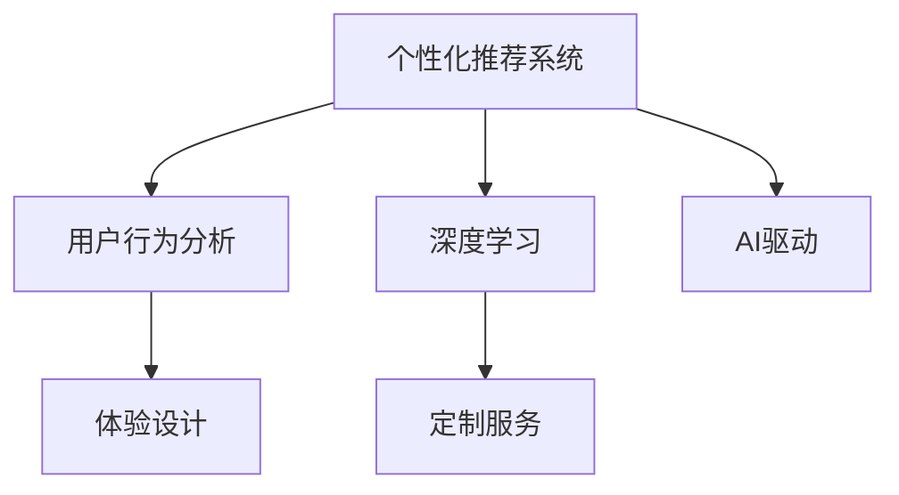
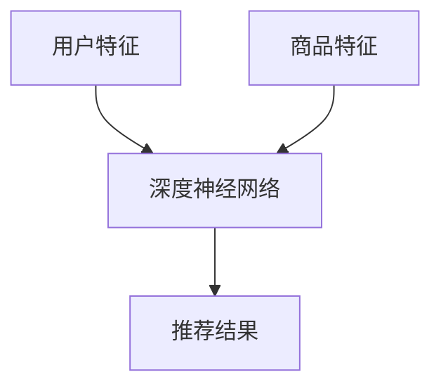

                 

# 体验的个性化：AI驱动的定制服务

> 关键词：
1. 人工智能(AI)
2. 个性化推荐系统(Recommendation System)
3. 用户行为分析(User Behavior Analysis)
4. 体验设计(Experience Design)
5. 定制服务(Customized Service)
6. 机器学习(Machine Learning)
7. 深度学习(Deep Learning)

## 1. 背景介绍

在数字化时代，用户体验(UX)已成为企业竞争的关键要素。个性化推荐系统(Personalized Recommendation System)作为提升用户体验的重要手段，通过分析用户行为，预测用户偏好，精准推送定制化的内容或服务，从而极大地提升了用户满意度和转化率。然而，传统的推荐算法往往依赖于用户的历史行为数据，难以全面理解用户潜在需求，尤其是在冷启动阶段和新领域应用中，表现不佳。随着人工智能技术的快速发展，AI驱动的个性化推荐系统应运而生，借助深度学习等先进技术，全面解析用户行为，构建更加丰富、深入的个性化推荐模型。

## 2. 核心概念与联系

### 2.1 核心概念概述

为更好地理解AI驱动的个性化推荐系统，本节将介绍几个关键概念：

- 个性化推荐系统(Recommendation System)：根据用户的历史行为、兴趣、社交网络等数据，推荐符合用户口味的产品、内容或服务，提升用户体验。
- 深度学习(Deep Learning)：一种基于神经网络的机器学习技术，通过多层非线性映射实现复杂模式的学习和特征提取。
- 用户行为分析(User Behavior Analysis)：通过收集和分析用户的行为数据，包括浏览记录、点击流、购买记录等，理解用户的兴趣和需求，为推荐系统提供数据支持。
- 体验设计(Experience Design)：基于用户需求，设计符合用户期望的产品和服务，提升用户满意度和忠诚度。
- 定制服务(Customized Service)：根据用户的具体需求和偏好，提供个性化的服务体验，增强用户粘性。

这些核心概念通过以下Mermaid流程图进行展示：



这个流程图展示了个性化推荐系统的核心逻辑：

1. 用户行为分析从用户的实时行为中提取特征，用于训练和预测用户偏好。
2. 深度学习通过神经网络模型，从用户行为数据中学习用户特征，生成推荐模型。
3. 体验设计根据用户偏好，设计定制化的服务体验，提升用户满意度。
4. AI驱动的推荐系统融合了用户行为分析和深度学习技术，结合体验设计理念，构建更加智能化、个性化的推荐服务。

## 3. 核心算法原理 & 具体操作步骤
### 3.1 算法原理概述

AI驱动的个性化推荐系统融合了用户行为分析和深度学习技术，通过构建用户行为模型和推荐模型，实现个性化推荐。

具体步骤如下：

1. **数据收集与预处理**：从网站、应用程序等渠道收集用户行为数据，进行清洗、去重等预处理。
2. **用户行为建模**：利用协同过滤、内容过滤、深度学习等算法，构建用户行为模型，提取用户特征。
3. **推荐模型训练**：使用深度学习模型，如神经网络、卷积神经网络(CNN)、循环神经网络(RNN)等，训练推荐模型，预测用户偏好。
4. **个性化推荐**：根据用户偏好，实时生成推荐结果，提供定制化服务。

### 3.2 算法步骤详解

**Step 1: 数据收集与预处理**

- **数据来源**：从网站、应用程序、社交媒体等渠道收集用户行为数据。常见的行为数据包括点击、浏览、购买、评分等。
- **数据预处理**：对数据进行去重、清洗、缺失值处理、归一化等预处理操作，确保数据的准确性和一致性。

**Step 2: 用户行为建模**

- **协同过滤**：根据用户历史行为和相似用户的偏好，推荐相似用户喜欢的内容。
- **内容过滤**：根据用户对内容的评分，推断用户对相似内容的偏好。
- **深度学习**：使用神经网络模型，如多层感知器(MLP)、卷积神经网络(CNN)、循环神经网络(RNN)等，对用户行为数据进行特征提取和建模。

**Step 3: 推荐模型训练**

- **模型选择**：根据任务特点，选择合适的深度学习模型。如分类任务使用MLP，推荐任务使用RNN、CNN等。
- **数据划分**：将数据集划分为训练集、验证集和测试集。通常采用交叉验证，防止过拟合。
- **模型训练**：使用梯度下降等优化算法，对模型进行训练，最小化损失函数。
- **模型评估**：在验证集上评估模型性能，选择最优模型。

**Step 4: 个性化推荐**

- **实时推荐**：根据用户行为实时生成推荐结果，提供定制化服务。
- **多维度推荐**：综合考虑用户历史行为、实时行为、个性化偏好等因素，进行多维度推荐。
- **推荐反馈**：收集用户的反馈数据，不断优化推荐模型。

### 3.3 算法优缺点

AI驱动的个性化推荐系统具有以下优点：

1. **高精准度**：通过深度学习模型，可以全面解析用户行为，生成精准的推荐结果。
2. **动态化调整**：实时分析用户行为，动态调整推荐策略，确保推荐结果的时效性。
3. **多维度融合**：综合考虑用户历史行为、实时行为、个性化偏好等因素，提供多维度推荐。
4. **个性化体验**：通过个性化推荐，提升用户体验和满意度，增强用户粘性。

然而，该算法也存在一些缺点：

1. **数据需求高**：需要大量的用户行为数据，才能构建高质量的推荐模型。
2. **模型复杂**：深度学习模型参数量大，计算复杂，需要高性能硬件支持。
3. **冷启动问题**：对于新用户，缺乏足够的历史行为数据，难以进行有效的推荐。
4. **数据隐私**：收集用户行为数据需要确保数据安全和隐私保护，防止数据泄露。

### 3.4 算法应用领域

AI驱动的个性化推荐系统在多个领域得到广泛应用，以下是几个典型场景：

- **电商推荐**：根据用户的浏览、购买记录，推荐符合其兴趣的商品。
- **新闻推荐**：根据用户的阅读偏好，推荐相关的新闻内容。
- **视频推荐**：根据用户的观看记录，推荐相似的视频内容。
- **音乐推荐**：根据用户的听歌记录，推荐相似的音乐作品。
- **旅游推荐**：根据用户的旅游偏好，推荐旅游目的地和景点。
- **社交推荐**：根据用户的社交关系，推荐新的朋友或内容。

## 4. 数学模型和公式 & 详细讲解  
### 4.1 数学模型构建

AI驱动的个性化推荐系统通过深度学习模型对用户行为数据进行处理，生成推荐结果。以下是一个基于深度神经网络的推荐模型示意图：



假设用户特征为 $U = \{u_1, u_2, ..., u_n\}$，商品特征为 $I = \{i_1, i_2, ..., i_m\}$，深度神经网络的输入层输入用户特征 $A$ 和商品特征 $B$，输出层输出推荐结果 $D$。

**推荐模型形式**：
$$
D = F(A, B; \theta)
$$

其中 $F$ 为深度神经网络模型，$\theta$ 为模型参数。

**推荐目标函数**：
$$
\mathcal{L}(\theta) = \frac{1}{N} \sum_{i=1}^{N} \sum_{j=1}^{M} (y_{ij} \log p_i + (1-y_{ij}) \log (1-p_i))
$$

其中 $y_{ij}$ 为 $i$ 对 $j$ 的评分，$p_i$ 为模型预测的 $i$ 对 $j$ 的评分概率。

### 4.2 公式推导过程

以下是推荐模型的详细推导过程：

1. **用户特征嵌入**：将用户特征 $U$ 映射到低维空间 $E_U$ 中，得到用户特征向量 $\vec{u}$。

2. **商品特征嵌入**：将商品特征 $I$ 映射到低维空间 $E_I$ 中，得到商品特征向量 $\vec{i}$。

3. **模型输入**：将用户特征向量 $\vec{u}$ 和商品特征向量 $\vec{i}$ 作为深度神经网络的输入。

4. **模型输出**：神经网络对输入进行处理，输出推荐结果 $D$。

5. **损失函数**：使用交叉熵损失函数 $\mathcal{L}(\theta)$ 评估模型性能，最小化损失函数以优化模型参数 $\theta$。

### 4.3 案例分析与讲解

以电商推荐系统为例，以下是具体的案例分析：

1. **数据收集与预处理**：
   - 从电商平台收集用户浏览、购买、评价等数据，进行清洗、去重等预处理操作。
   - 将用户行为数据转化为数值型特征，如商品ID、价格、评分等。

2. **用户行为建模**：
   - 使用协同过滤算法，对用户的历史行为进行分析，提取用户特征。
   - 使用深度学习模型，对用户行为数据进行特征提取和建模，生成用户行为向量。

3. **推荐模型训练**：
   - 选择合适的深度学习模型，如深度神经网络、卷积神经网络等。
   - 划分数据集，训练模型，最小化损失函数。
   - 在验证集上评估模型性能，选择最优模型。

4. **个性化推荐**：
   - 实时分析用户行为，生成推荐结果。
   - 综合考虑用户历史行为、实时行为、个性化偏好等因素，进行多维度推荐。
   - 收集用户的反馈数据，不断优化推荐模型。

## 5. 项目实践：代码实例和详细解释说明
### 5.1 开发环境搭建

在进行项目实践前，我们需要准备好开发环境。以下是使用Python进行TensorFlow开发的环境配置流程：

1. 安装Anaconda：从官网下载并安装Anaconda，用于创建独立的Python环境。

2. 创建并激活虚拟环境：
```bash
conda create -n tf-env python=3.8 
conda activate tf-env
```

3. 安装TensorFlow：根据CUDA版本，从官网获取对应的安装命令。例如：
```bash
conda install tensorflow -c conda-forge
```

4. 安装TensorBoard：
```bash
pip install tensorboard
```

5. 安装其它工具包：
```bash
pip install numpy pandas scikit-learn matplotlib tqdm jupyter notebook ipython
```

完成上述步骤后，即可在`tf-env`环境中开始项目实践。

### 5.2 源代码详细实现

下面我们以电商推荐系统为例，给出使用TensorFlow进行推荐模型开发的PyTorch代码实现。

首先，定义推荐模型的输入和输出：

```python
import tensorflow as tf
from tensorflow.keras.layers import Input, Dense, Embedding
from tensorflow.keras.models import Model

# 定义输入层
user_input = Input(shape=(N,), name='user_input')
item_input = Input(shape=(M,), name='item_input')

# 定义用户特征嵌入层
user_embedding = Embedding(N, D, input_length=1, name='user_embedding')
user_feature = user_embedding(user_input)

# 定义商品特征嵌入层
item_embedding = Embedding(M, D, input_length=1, name='item_embedding')
item_feature = item_embedding(item_input)

# 定义神经网络层
hidden_layer = Dense(H, activation='relu')(user_feature)
hidden_layer = Dense(H, activation='relu')(hidden_layer)
hidden_layer = Dense(H, activation='relu')(hidden_layer)
output = Dense(1, activation='sigmoid')(hidden_layer)

# 定义推荐模型
model = Model(inputs=[user_input, item_input], outputs=output)

# 编译模型
model.compile(optimizer='adam', loss='binary_crossentropy', metrics=['accuracy'])

# 输出模型结构
model.summary()
```

然后，定义训练和评估函数：

```python
from tensorflow.keras.callbacks import EarlyStopping

def train_model(model, train_data, validation_data, epochs):
    # 训练模型
    history = model.fit(train_data, epochs=epochs, validation_data=validation_data, callbacks=[EarlyStopping(patience=5)])
    return history

def evaluate_model(model, test_data):
    # 评估模型
    scores = model.evaluate(test_data)
    return scores
```

最后，启动训练流程并在测试集上评估：

```python
# 定义训练集和测试集
train_dataset = ...
test_dataset = ...

# 定义训练和验证参数
epochs = 10
batch_size = 32

# 训练模型
history = train_model(model, train_dataset, validation_dataset, epochs)

# 评估模型
scores = evaluate_model(model, test_dataset)

# 输出结果
print('Loss:', scores[0])
print('Accuracy:', scores[1])
```

以上就是使用TensorFlow对电商推荐系统进行深度学习的完整代码实现。可以看到，TensorFlow提供了一整套灵活高效的深度学习框架，使得模型的构建、训练、评估过程变得简洁、高效。

### 5.3 代码解读与分析

让我们再详细解读一下关键代码的实现细节：

**Input层**：定义用户和商品特征的输入，其中N和M分别为用户和商品的总数，D为特征维度，1为输入序列长度。

**Embedding层**：将用户和商品特征映射到低维空间，生成用户特征向量和商品特征向量。

**神经网络层**：使用多层全连接神经网络，对用户和商品特征进行组合和变换，最终输出推荐结果。

**输出层**：使用sigmoid激活函数，将输出映射到[0,1]区间，表示用户对商品推荐的评分概率。

**训练函数**：定义模型训练过程，使用交叉熵损失函数进行优化，EarlyStopping防止过拟合。

**评估函数**：定义模型评估过程，使用评估指标对模型性能进行评估。

## 6. 实际应用场景
### 6.1 电商推荐

电商推荐系统通过分析用户的浏览、购买行为，推荐符合其兴趣的商品，提升用户的购物体验和转化率。具体而言，电商推荐系统可以在以下几个方面发挥作用：

1. **商品推荐**：根据用户的浏览和购买记录，推荐符合其兴趣的商品。
2. **个性化推荐**：根据用户的个性化偏好，推荐定制化的商品组合。
3. **活动推荐**：根据用户的购物习惯，推荐适合的促销活动。

### 6.2 新闻推荐

新闻推荐系统通过分析用户的阅读偏好，推荐符合其兴趣的新闻内容，提高用户黏性和满意度。具体而言，新闻推荐系统可以在以下几个方面发挥作用：

1. **文章推荐**：根据用户的阅读记录，推荐符合其兴趣的文章。
2. **个性化新闻**：根据用户的个性化偏好，推荐定制化的新闻内容。
3. **热门新闻**：根据热门新闻话题，推荐最新的新闻内容。

### 6.3 视频推荐

视频推荐系统通过分析用户的观看记录，推荐符合其兴趣的视频内容，提升用户的观看体验和满意度。具体而言，视频推荐系统可以在以下几个方面发挥作用：

1. **视频推荐**：根据用户的观看记录，推荐符合其兴趣的视频内容。
2. **个性化视频**：根据用户的个性化偏好，推荐定制化的视频内容。
3. **热门视频**：根据热门视频内容，推荐最新的视频内容。

### 6.4 音乐推荐

音乐推荐系统通过分析用户的听歌记录，推荐符合其兴趣的音乐作品，提升用户的听歌体验和满意度。具体而言，音乐推荐系统可以在以下几个方面发挥作用：

1. **歌曲推荐**：根据用户的听歌记录，推荐符合其兴趣的歌曲。
2. **个性化音乐**：根据用户的个性化偏好，推荐定制化的音乐作品。
3. **热门音乐**：根据热门音乐内容，推荐最新的音乐作品。

## 7. 工具和资源推荐
### 7.1 学习资源推荐

为了帮助开发者系统掌握AI驱动的个性化推荐系统的理论基础和实践技巧，这里推荐一些优质的学习资源：

1. 《深度学习基础》书籍：由深度学习专家编写，全面介绍深度学习的概念、模型和应用，包括推荐系统的内容。

2. 《推荐系统实战》书籍：详细讲解推荐系统的原理和实践，涵盖协同过滤、深度学习等技术。

3. CS448《推荐系统》课程：斯坦福大学开设的推荐系统课程，有Lecture视频和配套作业，带你深入了解推荐系统的设计与实现。

4. Kaggle竞赛：参加推荐系统相关的Kaggle竞赛，学习实战经验，掌握推荐系统算法和模型优化技巧。

5. GitHub开源项目：参与推荐系统相关的开源项目，学习代码实现和模型调优技巧，积累实践经验。

通过对这些资源的学习实践，相信你一定能够快速掌握AI驱动的个性化推荐系统的精髓，并用于解决实际的推荐问题。
###  7.2 开发工具推荐

高效的开发离不开优秀的工具支持。以下是几款用于推荐系统开发的常用工具：

1. TensorFlow：由Google主导开发的开源深度学习框架，灵活高效，支持多种深度学习模型。

2. PyTorch：基于Python的开源深度学习框架，灵活动态的计算图，适合快速迭代研究。

3. Keras：Keras是一个高级神经网络API，基于TensorFlow和Theano，提供了简洁、易用的深度学习模型构建接口。

4. Weights & Biases：模型训练的实验跟踪工具，可以记录和可视化模型训练过程中的各项指标，方便对比和调优。

5. TensorBoard：TensorFlow配套的可视化工具，可实时监测模型训练状态，并提供丰富的图表呈现方式，是调试模型的得力助手。

6. Apache Spark：一个快速、通用的大数据处理引擎，支持分布式计算，适合大规模数据处理和训练。

合理利用这些工具，可以显著提升推荐系统的开发效率，加快创新迭代的步伐。

### 7.3 相关论文推荐

AI驱动的个性化推荐系统的发展离不开学界的持续研究。以下是几篇奠基性的相关论文，推荐阅读：

1. Item Response Theory and Pattern Recognition for Large-Scale Personalized Recommendation（2009年）：提出协同过滤算法，基于用户行为数据进行推荐，为推荐系统奠定基础。

2. Factorization Machines for Recommender Systems（2010年）：提出因子分解机算法，优化推荐模型的训练和预测效率。

3. Wide & Deep Learning for Recommender Systems（2016年）：提出宽与深学习模型，融合浅层和深层特征，提升推荐模型的性能。

4. Deep Neural Networks for Recommender Systems: A Survey and New Perspectives（2017年）：全面综述深度学习在推荐系统中的应用，提供新思路和新方法。

5. Deep Collaborative Filtering (2017年)：提出深度协同过滤模型，提升推荐模型的精准度和鲁棒性。

6. Personalized Sequencing in Recommendation Systems（2020年）：提出序列推荐模型，综合考虑用户行为的时序特征，提升推荐模型的时序性能。

这些论文代表了大规模推荐系统的发展脉络。通过学习这些前沿成果，可以帮助研究者把握学科前进方向，激发更多的创新灵感。

## 8. 总结：未来发展趋势与挑战
### 8.1 总结

本文对AI驱动的个性化推荐系统进行了全面系统的介绍。首先阐述了个性化推荐系统的研究背景和意义，明确了AI驱动推荐系统在提升用户体验方面的独特价值。其次，从原理到实践，详细讲解了推荐模型的数学原理和关键步骤，给出了推荐任务开发的完整代码实例。同时，本文还广泛探讨了推荐系统在电商、新闻、视频、音乐等多个领域的应用前景，展示了AI驱动推荐系统的广阔应用空间。此外，本文精选了推荐系统的各类学习资源，力求为读者提供全方位的技术指引。

通过本文的系统梳理，可以看到，AI驱动的个性化推荐系统正在成为推荐领域的重要范式，极大地提升了推荐模型的精准度和实时性，为推荐系统在各个应用场景中落地提供了新的可能。未来，伴随推荐模型和算法技术的持续演进，相信推荐系统必将在更多领域得到应用，为人类信息获取、商品选择、服务体验带来深远影响。

### 8.2 未来发展趋势

展望未来，AI驱动的个性化推荐系统将呈现以下几个发展趋势：

1. **多模态融合**：将多种模态的信息（如文本、图像、语音等）融合到推荐系统中，提升推荐模型的多样性和准确性。
2. **交互式推荐**：通过与用户的实时交互，动态调整推荐策略，提供更加个性化的推荐体验。
3. **鲁棒性增强**：提升推荐模型的鲁棒性，应对数据噪声和异常情况，保证推荐结果的稳定性和可靠性。
4. **可解释性增强**：提升推荐模型的可解释性，让用户理解和信任推荐结果，增强用户的满意度和信任度。
5. **隐私保护**：增强推荐系统的隐私保护机制，保护用户数据的安全和隐私。

### 8.3 面临的挑战

尽管AI驱动的个性化推荐系统已经取得了瞩目成就，但在迈向更加智能化、普适化应用的过程中，它仍面临着诸多挑战：

1. **数据质量**：推荐系统的性能高度依赖于数据质量，如何获取高质量、多样化的数据，是推荐系统的重要挑战。
2. **计算资源**：深度学习模型的训练和推理需要高性能计算资源，如何降低计算成本，提高训练效率，是推荐系统的关键难题。
3. **冷启动问题**：对于新用户，缺乏足够的历史行为数据，难以进行有效的推荐。如何破解冷启动问题，是推荐系统的技术难点。
4. **可解释性**：推荐模型通常是一个"黑盒"系统，难以解释其内部工作机制和决策逻辑。如何赋予推荐模型更强的可解释性，是推荐系统的研究方向。
5. **数据隐私**：收集用户行为数据需要确保数据安全和隐私保护，防止数据泄露。如何设计合理的隐私保护机制，是推荐系统的道德责任。

### 8.4 研究展望

面对AI驱动个性化推荐系统所面临的挑战，未来的研究需要在以下几个方面寻求新的突破：

1. **融合多模态数据**：将多种模态的信息（如文本、图像、语音等）融合到推荐系统中，提升推荐模型的多样性和准确性。
2. **提升模型鲁棒性**：提升推荐模型的鲁棒性，应对数据噪声和异常情况，保证推荐结果的稳定性和可靠性。
3. **增强模型可解释性**：提升推荐模型的可解释性，让用户理解和信任推荐结果，增强用户的满意度和信任度。
4. **设计隐私保护机制**：增强推荐系统的隐私保护机制，保护用户数据的安全和隐私。

这些研究方向的探索，必将引领AI驱动个性化推荐系统技术迈向更高的台阶，为构建安全、可靠、可解释、可控的智能系统铺平道路。面向未来，推荐系统还需要与其他人工智能技术进行更深入的融合，如知识表示、因果推理、强化学习等，多路径协同发力，共同推动智能交互系统的进步。只有勇于创新、敢于突破，才能不断拓展推荐系统的边界，让智能技术更好地造福人类社会。

## 9. 附录：常见问题与解答

**Q1：推荐系统如何提升用户体验？**

A: 推荐系统通过分析用户的浏览、购买等行为数据，预测用户偏好，提供符合其兴趣的商品、内容或服务。具体而言，推荐系统可以在以下几个方面提升用户体验：

1. **个性化推荐**：根据用户的个性化偏好，推荐定制化的商品、内容或服务，满足用户的个性化需求。
2. **实时推荐**：通过实时分析用户行为，动态调整推荐策略，提供更加个性化的推荐结果。
3. **多维度推荐**：综合考虑用户历史行为、实时行为、个性化偏好等因素，进行多维度推荐，提高推荐结果的全面性和准确性。

**Q2：推荐系统如何应对冷启动问题？**

A: 冷启动问题是推荐系统面临的重要挑战之一，对于新用户，缺乏足够的历史行为数据，难以进行有效的推荐。以下是一些应对冷启动问题的方法：

1. **基于内容的推荐**：根据商品或内容的属性特征，推荐符合用户兴趣的商品或内容。
2. **基于协同过滤的推荐**：通过分析与新用户相似用户的行为数据，推荐相似用户喜欢的商品或内容。
3. **基于深度学习的推荐**：使用深度学习模型，对用户行为数据进行特征提取和建模，生成推荐结果。
4. **多维度融合**：综合考虑用户历史行为、实时行为、个性化偏好等因素，进行多维度推荐，提升推荐结果的全面性和准确性。

**Q3：推荐系统如何保护用户隐私？**

A: 推荐系统在收集和处理用户数据时，需要严格保护用户隐私，防止数据泄露和滥用。以下是一些保护用户隐私的方法：

1. **数据匿名化**：对用户数据进行匿名化处理，保护用户身份信息。
2. **数据加密**：对用户数据进行加密处理，防止数据泄露。
3. **差分隐私**：在数据分析和建模过程中，采用差分隐私技术，保护用户数据的安全。
4. **用户控制**：给予用户对数据使用的知情权和控制权，让用户自主决定是否分享数据。

**Q4：推荐系统如何提高推荐模型的可解释性？**

A: 推荐模型的可解释性是推荐系统的研究热点之一，通过提高推荐模型的可解释性，可以增强用户对推荐结果的信任度。以下是一些提高推荐模型可解释性的方法：

1. **特征可解释性**：通过解释推荐模型的特征重要性，让用户理解模型的决策依据。
2. **规则建模**：使用规则模型，提供推荐结果的详细推理过程，增强模型的可解释性。
3. **可视化工具**：使用可视化工具，展示推荐模型的决策过程和特征权重，增强用户对模型的理解和信任。

通过以上常见问题的详细解答，希望能更好地帮助你理解AI驱动个性化推荐系统，掌握其核心技术和应用技巧，并在实际项目中取得成功。

---

作者：禅与计算机程序设计艺术 / Zen and the Art of Computer Programming

