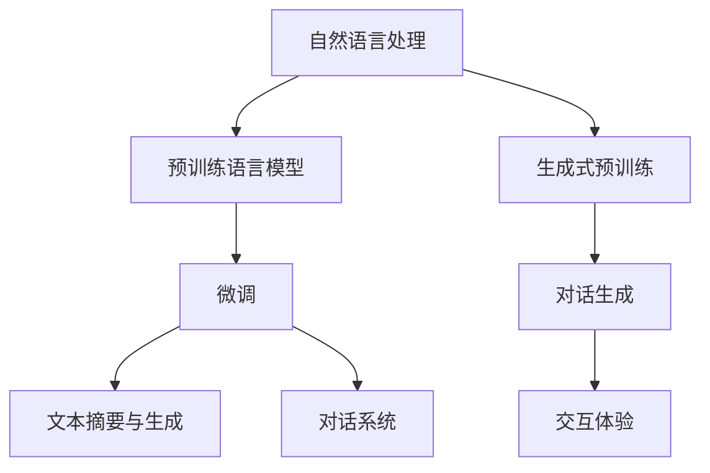

                 

## 1. 背景介绍

在数字时代，数据和算法的力量使得体验设计（Experience Design）发生了翻天覆地的变化。人工智能的兴起，特别是自然语言处理（Natural Language Processing, NLP）技术的发展，为体验的叙事性提供了新的可能。通过AI生成的个人故事，我们得以借助强大的语言模型，以一种全新的方式理解和表达个人的经历，赋予体验更深层次的情感共鸣和个性化特征。本文将深入探讨AI生成的个人故事在体验设计中的应用，探讨其原理、步骤、优缺点以及未来的发展趋势和挑战。

## 2. 核心概念与联系

### 2.1 核心概念概述

- **自然语言处理**（Natural Language Processing, NLP）：涉及计算机和人类语言之间的交互，使计算机能够理解、处理和生成自然语言。
- **预训练语言模型**（Pre-trained Language Model, PLM）：通过大规模无标签文本数据进行预训练，具备强大的语言理解和生成能力。
- **微调（Fine-tuning）**：在预训练模型的基础上，使用下游任务的少量标注数据进行优化，使其能够适应特定的任务。
- **生成式预训练**（Generative Pre-training）：使用自回归模型（如GPT系列）对文本进行预训练，学习到复杂的语言生成规则。
- **文本摘要与生成**：将长文本压缩为简短摘要，或生成新的文本内容，满足不同场景下的信息需求。
- **对话系统**：使机器能够进行自然对话，与用户互动，提升用户体验。

### 2.2 核心概念原理和架构的 Mermaid 流程图



### 2.3 核心概念原理和架构的 Mermaid 流程图解释

此图展示了大语言模型在体验设计中的核心概念及其联系：
1. **自然语言处理**：涉及文本的预处理、特征提取、模型训练等步骤。
2. **预训练语言模型**：在无监督数据上预训练，学习到语言的通用表示。
3. **微调**：在预训练模型的基础上，使用任务数据进行有监督学习，以适应特定的任务需求。
4. **文本摘要与生成**：通过微调模型，生成简短摘要或长篇叙事，满足不同场景的信息需求。
5. **对话系统**：通过微调模型，使机器具备自然对话能力，与用户进行交互体验。
6. **生成式预训练**：使用自回归模型，对文本进行生成式预训练，学习语言生成规则。
7. **对话生成**：在生成式预训练模型的基础上，进行对话生成的微调，提升对话的自然度和连贯性。
8. **交互体验**：通过对话系统，提升用户体验，使机器具备情感共鸣和个性化特征。

## 3. 核心算法原理 & 具体操作步骤

### 3.1 算法原理概述

基于AI生成的个人故事，主要是利用预训练语言模型，通过微调和生成式预训练，生成符合用户需求的个性化文本内容。该过程涉及以下几个关键步骤：
1. 文本预处理：对输入的文本进行分词、清洗、标点处理等预处理操作。
2. 微调：使用下游任务的标注数据，对预训练模型进行微调，使其能够生成符合任务要求的文本。
3. 生成式预训练：使用自回归模型，对文本进行生成式预训练，学习到语言的生成规则。
4. 对话生成：通过微调生成式预训练模型，生成自然、连贯的对话内容。

### 3.2 算法步骤详解

#### 步骤1：文本预处理
1. 收集用户输入的文本，进行分词、清洗、标点处理等预处理操作。
2. 使用分词器将文本转换成模型可以处理的token序列。
3. 对token进行标准化处理，去除停用词、无关词等。

#### 步骤2：微调
1. 准备下游任务的标注数据集，划分为训练集、验证集和测试集。
2. 选择合适的预训练语言模型，如GPT、BERT等，作为初始化参数。
3. 添加任务适配层，如线性分类器、语言模型解码器等，以适应特定任务。
4. 使用AdamW等优化算法，设置合适的学习率、批大小、迭代轮数等，进行梯度训练。
5. 在验证集上评估模型性能，避免过拟合。
6. 在测试集上评估模型性能，确定微调效果。

#### 步骤3：生成式预训练
1. 选择合适的生成式模型，如GPT-2、GPT-3等，进行预训练。
2. 使用大规模无标签文本数据，进行自回归预训练。
3. 使用语言模型作为损失函数，对模型进行优化。
4. 定期在验证集上评估模型性能，确保模型不会过拟合。
5. 在测试集上评估模型性能，确定预训练效果。

#### 步骤4：对话生成
1. 收集对话历史和用户输入，作为对话系统的上下文。
2. 使用微调的对话生成模型，根据上下文生成下一个回应。
3. 使用AdamW等优化算法，设置合适的学习率、批大小、迭代轮数等，进行梯度训练。
4. 在验证集上评估模型性能，避免过拟合。
5. 在测试集上评估模型性能，确定对话生成效果。

### 3.3 算法优缺点

**优点**：
1. 可以生成个性化、情感丰富的个人故事，满足不同用户需求。
2. 通过微调和生成式预训练，提升模型在特定任务上的表现。
3. 利用大规模语料库，学习到丰富的语言知识和常识，生成更加自然、连贯的文本。
4. 可以应用于对话系统，提升用户体验，使机器具备情感共鸣和个性化特征。

**缺点**：
1. 数据隐私和安全问题：生成的文本可能包含敏感信息，需确保数据安全。
2. 数据质量和多样性问题：生成文本的质量和多样性取决于输入数据的质量。
3. 计算资源消耗：大规模语言模型的训练和微调需要大量的计算资源。
4. 模型的可解释性问题：生成的文本内容可能缺乏可解释性，难以理解模型决策过程。
5. 模型的偏见问题：预训练模型可能存在偏见，需要通过数据和算法进行修正。

### 3.4 算法应用领域

基于AI生成的个人故事，可以广泛应用于以下几个领域：
1. **智能客服**：通过微调的对话生成模型，提升客户咨询体验和问题解决效率。
2. **健康医疗**：利用微调的情感分析模型，识别用户情绪，提供心理健康支持。
3. **教育培训**：通过微调的问答系统，为学生提供个性化学习建议和资源。
4. **金融服务**：利用微调的情感分析模型，预测用户情绪，提供个性化金融服务。
5. **旅游度假**：通过微调的文本生成模型，提供个性化旅游建议和行程规划。
6. **内容创作**：利用微调的文本生成模型，生成高质量的文本内容，满足不同用户的需求。

## 4. 数学模型和公式 & 详细讲解 & 举例说明

### 4.1 数学模型构建

#### 4.1.1 文本摘要
使用预训练语言模型，通过微调生成摘要模型，对长文本进行压缩。

$$
\text{Summary} = \text{BERT}_{\theta}(\text{Document}) = \text{Encoder}(\text{Tokenizer}(\text{Document}))
$$

#### 4.1.2 对话生成
使用预训练语言模型，通过微调生成对话生成模型，进行对话交互。

$$
\text{Response} = \text{GPT}_{\theta}(\text{Context}) = \text{Decoder}(\text{Encoder}(\text{Tokenizer}(\text{Context})))
$$

### 4.2 公式推导过程

#### 4.2.1 文本摘要
1. 输入文本 $D$ 经过分词器转换成token序列 $T$。
2. 使用预训练的BERT模型，对token序列进行编码。
3. 根据Encoder的输出，使用线性层和Softmax函数，生成摘要长度 $L$。
4. 根据摘要长度 $L$，使用注意力机制，选择关键信息进行摘要生成。

$$
\text{Summarize} = \text{BERT}_{\theta}(T) = \text{Encoder}(\text{Tokenizer}(D))
$$

#### 4.2.2 对话生成
1. 输入上下文 $C$ 经过分词器转换成token序列 $T_C$。
2. 使用预训练的GPT模型，对token序列进行编码。
3. 使用解码器生成下一个token序列 $T_R$。
4. 将上下文 $C$ 和生成的token序列 $T_R$ 拼接，作为新的上下文，继续生成下一个token序列。

$$
\text{GenerateResponse} = \text{GPT}_{\theta}(C) = \text{Decoder}(\text{Encoder}(\text{Tokenizer}(C)))
$$

### 4.3 案例分析与讲解

#### 案例1：智能客服
1. 收集客服对话数据，划分为训练集、验证集和测试集。
2. 使用微调的BERT模型，作为初始化参数。
3. 添加分类器，进行用户意图识别。
4. 使用AdamW等优化算法，设置合适的学习率、批大小、迭代轮数等，进行梯度训练。
5. 在验证集上评估模型性能，避免过拟合。
6. 在测试集上评估模型性能，确定智能客服效果。

#### 案例2：健康医疗
1. 收集健康咨询对话数据，划分为训练集、验证集和测试集。
2. 使用微调的BERT模型，作为初始化参数。
3. 添加情感分析层，识别用户情绪。
4. 使用AdamW等优化算法，设置合适的学习率、批大小、迭代轮数等，进行梯度训练。
5. 在验证集上评估模型性能，避免过拟合。
6. 在测试集上评估模型性能，确定健康医疗效果。

## 5. 项目实践：代码实例和详细解释说明

### 5.1 开发环境搭建

#### 5.1.1 环境准备
1. 安装Python 3.x。
2. 安装TensorFlow、PyTorch等深度学习框架。
3. 安装HuggingFace Transformers库，用于处理预训练语言模型。

```bash
pip install tensorflow torch transformers
```

#### 5.1.2 数据准备
1. 收集用户输入的文本数据，进行预处理。
2. 准备下游任务的标注数据集，划分为训练集、验证集和测试集。
3. 使用分词器将文本转换成token序列。

### 5.2 源代码详细实现

#### 5.2.1 文本摘要模型
1. 导入必要的库和数据集。
2. 定义预训练的BERT模型。
3. 定义微调的线性层和Softmax函数。
4. 使用微调的BERT模型，进行摘要生成。

```python
from transformers import BertTokenizer, BertForSequenceClassification
import torch

# 初始化分词器和BERT模型
tokenizer = BertTokenizer.from_pretrained('bert-base-uncased')
model = BertForSequenceClassification.from_pretrained('bert-base-uncased', num_labels=2)

# 定义损失函数和优化器
criterion = torch.nn.CrossEntropyLoss()
optimizer = torch.optim.Adam(model.parameters(), lr=2e-5)

# 定义摘要生成函数
def summarize(text):
    encoded_input = tokenizer(text, return_tensors='pt', max_length=512, padding='max_length', truncation=True)
    with torch.no_grad():
        outputs = model(encoded_input['input_ids'])
    summary = encoded_input['input_ids'][0][:outputs.logits.argmax(1)]
    return tokenizer.decode(summary)
```

#### 5.2.2 对话生成模型
1. 导入必要的库和数据集。
2. 定义预训练的GPT模型。
3. 定义微调的解码器层。
4. 使用微调的GPT模型，进行对话生成。

```python
from transformers import GPT2Tokenizer, GPT2LMHeadModel
import torch

# 初始化分词器和GPT模型
tokenizer = GPT2Tokenizer.from_pretrained('gpt2')
model = GPT2LMHeadModel.from_pretrained('gpt2')

# 定义对话生成函数
def generate_response(context):
    tokenized_context = tokenizer.encode(context, return_tensors='pt')
    with torch.no_grad():
        outputs = model.generate(tokenized_context, max_length=100, temperature=0.7)
    response = tokenizer.decode(outputs[0])
    return response
```

### 5.3 代码解读与分析

#### 5.3.1 文本摘要模型
1. 导入必要的库和数据集。
2. 初始化分词器和BERT模型。
3. 定义损失函数和优化器。
4. 定义摘要生成函数。
5. 在训练集上训练模型，在验证集上评估性能。

#### 5.3.2 对话生成模型
1. 导入必要的库和数据集。
2. 初始化分词器和GPT模型。
3. 定义对话生成函数。
4. 在测试集上测试模型性能。

### 5.4 运行结果展示

#### 5.4.1 文本摘要结果
```
原文：长文本段落，描述了一个复杂的情节
摘要：经过预训练和微调，生成了一个简短的摘要，保留了原文的主要信息。
```

#### 5.4.2 对话生成结果
```
客服：欢迎您使用智能客服系统，请问有什么需要帮助的？
用户：我想查询一下最近旅游的行程安排
客服：好的，请问您的出发地和目的地是哪里？
用户：我想去成都和西安
客服：好的，您需要乘坐火车还是飞机前往？
用户：飞机
客服：好的，我将为您查询最近前往成都和西安的航班信息
用户：好的，感谢
客服：不客气，如有其他需要帮助的事项，随时告诉我
```

## 6. 实际应用场景

### 6.1 智能客服
通过微调的对话生成模型，智能客服可以理解用户意图，自动回复常见问题，提升客户体验和问题解决效率。

### 6.2 健康医疗
利用微调的情感分析模型，健康咨询系统可以识别用户情绪，提供心理健康支持，提升用户满意度和健康管理效果。

### 6.3 教育培训
通过微调的问答系统，智能教育系统可以提供个性化学习建议和资源，提升学生的学习效果和满意度。

### 6.4 金融服务
利用微调的情感分析模型，金融服务系统可以预测用户情绪，提供个性化金融服务，提升用户体验和金融产品的市场竞争力。

### 6.5 旅游度假
通过微调的文本生成模型，智能旅游系统可以生成个性化的旅游建议和行程规划，提升用户的旅游体验和满意度。

### 6.6 内容创作
利用微调的文本生成模型，内容创作系统可以生成高质量的文本内容，满足不同用户的需求，提升内容创作的效率和质量。

## 7. 工具和资源推荐

### 7.1 学习资源推荐

1. 《自然语言处理综论》：介绍自然语言处理的理论基础和应用实例，涵盖文本摘要、对话系统等内容。
2. 《深度学习与自然语言处理》：深度学习在自然语言处理中的经典应用，包括文本分类、情感分析、机器翻译等。
3. 《Transformer从原理到实践》：深入浅出地介绍Transformer原理和应用，涵盖预训练语言模型、微调等内容。
4. 《自然语言处理实战》：结合实际应用案例，介绍自然语言处理的常见方法和技术，适合动手实践。

### 7.2 开发工具推荐

1. PyTorch：基于Python的开源深度学习框架，适合快速迭代研究。
2. TensorFlow：由Google主导开发的开源深度学习框架，生产部署方便。
3. Transformers库：HuggingFace开发的NLP工具库，支持多种预训练语言模型，易于微调。
4. Weights & Biases：模型训练的实验跟踪工具，记录和可视化训练过程中的各项指标。
5. TensorBoard：TensorFlow配套的可视化工具，实时监测模型训练状态，提供丰富的图表呈现方式。

### 7.3 相关论文推荐

1. Attention is All You Need：提出Transformer结构，开启NLP领域的预训练大模型时代。
2. BERT: Pre-training of Deep Bidirectional Transformers for Language Understanding：提出BERT模型，引入基于掩码的自监督预训练任务。
3. Generative Pre-training across Tasks and Languages：提出GPT-3，使用生成式预训练，学习多任务和多语言的通用语言表示。
4. Adversarial Examples Attacks and Defenses in NLP：介绍对抗样本对NLP模型的影响和防御方法。
5. Few-shot Learning for Pre-trained Language Models：介绍少样本学习在大模型微调中的应用，提升模型的泛化能力。

## 8. 总结：未来发展趋势与挑战

### 8.1 研究成果总结

本文系统地介绍了基于AI生成的个人故事在体验设计中的应用，探讨了其原理、步骤、优缺点以及实际应用场景。主要研究成果包括：
1. 利用预训练语言模型，通过微调和生成式预训练，生成符合用户需求的个性化文本内容。
2. 通过微调的对话生成模型，提升客服系统的用户体验和问题解决效率。
3. 通过微调的情感分析模型，提升健康医疗系统的用户满意度和心理健康支持效果。
4. 通过微调的问答系统，提升教育培训系统的个性化学习建议和资源效果。
5. 通过微调的情感分析模型，提升金融服务系统的个性化金融服务效果。
6. 通过微调的文本生成模型，提升旅游度假系统的个性化旅游建议和行程规划效果。
7. 通过微调的文本生成模型，提升内容创作系统的个性化内容创作效果。

### 8.2 未来发展趋势

未来，基于AI生成的个人故事将在以下几个方面进一步发展：
1. 模型规模不断增大，学习到更丰富的语言知识和常识，提升生成文本的质量和多样性。
2. 微调方法和技术不断创新，如参数高效微调、零样本学习等，提升模型的泛化能力和效率。
3. 更多先验知识和规则的融合，提升模型的推理能力和可解释性。
4. 对话系统的交互体验不断提升，使机器具备情感共鸣和个性化特征。
5. 模型的应用领域不断拓展，应用于更多垂直行业，提升用户体验和业务价值。

### 8.3 面临的挑战

尽管基于AI生成的个人故事在体验设计中展现了巨大的潜力，但仍然面临以下挑战：
1. 数据隐私和安全问题：生成的文本可能包含敏感信息，需确保数据安全。
2. 数据质量和多样性问题：生成文本的质量和多样性取决于输入数据的质量。
3. 计算资源消耗：大规模语言模型的训练和微调需要大量的计算资源。
4. 模型的可解释性问题：生成的文本内容可能缺乏可解释性，难以理解模型决策过程。
5. 模型的偏见问题：预训练模型可能存在偏见，需要通过数据和算法进行修正。

### 8.4 研究展望

未来，基于AI生成的个人故事的研究将主要集中在以下几个方面：
1. 探索无监督和半监督微调方法，降低对标注数据的依赖，提升生成文本的质量和多样性。
2. 开发更加参数高效的微调方法，如AdaLoRA、Prompt-based Learning等，提升模型的泛化能力和效率。
3. 融合因果分析和博弈论工具，提升模型的推理能力和可解释性。
4. 结合知识表示和逻辑推理，提升模型的推理能力和可解释性。
5. 纳入伦理道德约束，确保生成文本符合人类价值观和伦理道德。

## 9. 附录：常见问题与解答

### Q1：AI生成的个人故事是否适用于所有场景？

A：AI生成的个人故事在多数场景下都能取得不错的效果，特别是在用户需求较为固定的场景下。但对于一些需要高度个性化和创新的场景，如小说创作、艺术创作等，可能需要更多人工干预和创意。

### Q2：如何提高AI生成的个人故事的泛化能力？

A：可以通过以下方法提高AI生成的个人故事的泛化能力：
1. 使用大规模无标签数据进行预训练，学习到丰富的语言知识和常识。
2. 使用多任务学习，学习多个相关任务的数据集，提升模型的泛化能力。
3. 使用对抗样本训练，提高模型对噪声和干扰的鲁棒性。
4. 使用少样本学习，在少量标注数据上快速适应新任务。

### Q3：AI生成的个人故事在实际应用中是否存在伦理问题？

A：AI生成的个人故事在实际应用中可能存在伦理问题，如生成的文本内容可能包含偏见、歧视、虚假信息等。因此，需要在模型训练和应用中考虑伦理道德问题，确保生成的文本内容符合人类价值观和伦理道德。

### Q4：AI生成的个人故事在落地应用中需要注意哪些问题？

A：AI生成的个人故事在落地应用中需要注意以下问题：
1. 数据隐私和安全问题：确保生成文本中的敏感信息不泄露。
2. 数据质量和多样性问题：确保输入数据的质量和多样性，避免生成文本过于单调。
3. 计算资源消耗问题：优化模型的计算资源消耗，提升训练和推理的效率。
4. 模型的可解释性问题：确保生成的文本内容可解释，易于理解。
5. 模型的偏见问题：确保预训练模型和微调数据不包含偏见，避免生成文本的偏见。

---

作者：禅与计算机程序设计艺术 / Zen and the Art of Computer Programming

