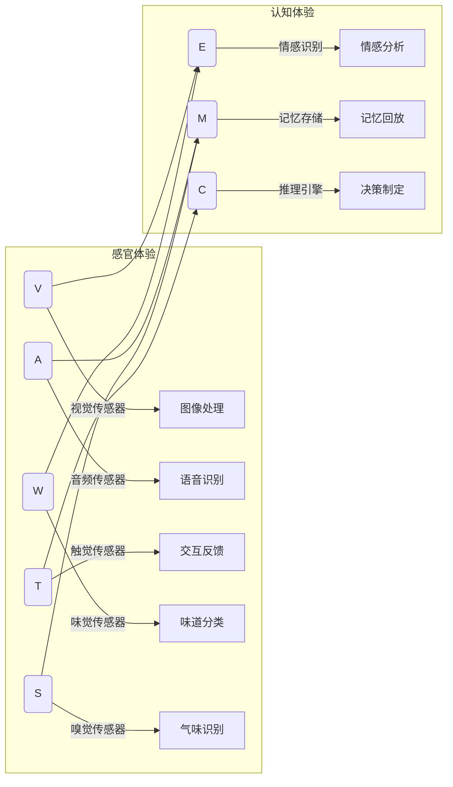

                 

## 1. 背景介绍

在科技飞速发展的今天，人工智能（AI）已经渗透到我们生活的方方面面，从简单的智能助手到复杂的自动驾驶系统，AI技术正以惊人的速度改变着世界。然而，当我们谈论AI技术时，往往关注其功能和性能的提升，却忽视了人类体验的多样性和复杂性。本文将探讨AI创造的多维感知，分析体验层次性的不同维度，并提出未来的发展方向和面临的挑战。

## 2. 核心概念与联系

### 2.1 核心概念概述

AI创造的多维感知指的是人工智能系统在不同维度上模拟人类的感知能力，从而构建出多样化的用户体验。这些维度包括视觉、听觉、触觉、味觉、嗅觉等感官体验，以及情感、记忆、思维等高级认知体验。每个维度都有其独特的感知特性，AI技术在这些维度上都有不同的应用。

- **感官体验**：视觉、听觉、触觉、味觉、嗅觉等直接与外界交互的感知方式。
- **认知体验**：情感、记忆、思维等涉及高级认知功能的感知方式。

这些感知维度之间存在复杂的交互关系，共同构成了一个多层次的感知网络。AI技术通过模拟人类的感知机制，可以实现更加智能、灵活、自然的人机交互。

### 2.2 核心概念原理和架构的 Mermaid 流程图



## 3. 核心算法原理 & 具体操作步骤

### 3.1 算法原理概述

AI创造的多维感知算法原理主要包括两个方面：

- **感知算法**：通过各种传感器和算法模拟人类感官的感知机制，提取和处理外界信息。
- **认知算法**：利用深度学习、逻辑推理等技术，模拟人类高级认知功能，实现对信息的理解和处理。

感知和认知之间存在紧密的交互关系，感知算法为认知算法提供输入，而认知算法则指导感知算法如何更有效地获取和处理信息。

### 3.2 算法步骤详解

1. **数据采集**：通过各种传感器获取外界信息，如摄像头、麦克风、压力传感器等。
2. **信息处理**：将感知到的数据进行预处理，如去噪、滤波、压缩等。
3. **特征提取**：将处理后的数据转换为模型可以理解的特征向量。
4. **模型训练**：使用深度学习模型对特征向量进行训练，学习感知和认知的映射关系。
5. **决策输出**：通过模型输出决策结果，指导机器人或设备的动作或行为。

### 3.3 算法优缺点

**优点**：
- **广泛应用**：多维感知技术可以应用于各种场景，如智能家居、自动驾驶、医疗健康等。
- **高性能**：通过深度学习等技术，AI系统可以高效地处理和分析大量数据，实现智能决策。
- **自适应性**：AI系统可以不断学习和适应新的环境和任务，提高用户体验。

**缺点**：
- **高成本**：多维感知系统需要高精度的传感器和复杂的数据处理算法，成本较高。
- **数据隐私**：大量数据的采集和使用可能涉及用户隐私问题，需要严格的监管。
- **复杂性**：多维感知系统的设计和实现复杂，需要跨学科的合作和经验积累。

### 3.4 算法应用领域

多维感知技术已经在多个领域得到了广泛应用，包括但不限于：

- **智能家居**：通过视觉、听觉、触觉等传感器，实现智能家电的语音控制、环境监测等功能。
- **自动驾驶**：结合视觉、雷达、激光雷达等传感器，实现自动驾驶系统的环境感知和路径规划。
- **医疗健康**：通过味觉、触觉等传感器，实现对疾病的早期检测和诊断。
- **工业制造**：通过触觉、视觉传感器，实现对生产设备的智能维护和故障诊断。
- **教育培训**：通过面部表情、语言、行为等情感识别技术，实现个性化的教育培训。

## 4. 数学模型和公式 & 详细讲解 & 举例说明

### 4.1 数学模型构建

多维感知系统的数学模型可以表示为：

$$
\begin{aligned}
\mathbf{x} &= \left(\mathbf{x}_v, \mathbf{x}_a, \mathbf{x}_t, \mathbf{x}_w, \mathbf{x}_s\right) \\
\mathbf{y} &= \left(\mathbf{y}_e, \mathbf{y}_m, \mathbf{y}_c\right)
\end{aligned}
$$

其中，$\mathbf{x}$ 表示感知系统采集到的外界信息，$\mathbf{y}$ 表示系统的决策输出。$\mathbf{x}_v, \mathbf{x}_a, \mathbf{x}_t, \mathbf{x}_w, \mathbf{x}_s$ 分别表示视觉、听觉、触觉、味觉、嗅觉等感知数据，$\mathbf{y}_e, \mathbf{y}_m, \mathbf{y}_c$ 分别表示情感、记忆、思维等认知输出。

### 4.2 公式推导过程

以视觉感知为例，其数学模型可以表示为：

$$
\mathbf{y}_e = \mathbf{f}(\mathbf{x}_v)
$$

其中，$\mathbf{f}$ 为视觉感知模型，将视觉数据映射为情感输出。通过训练模型 $\mathbf{f}$，可以实现视觉感知到情感识别的映射。

### 4.3 案例分析与讲解

假设我们开发一个智能家居系统，通过摄像头和麦克风获取用户的视觉和听觉信息，然后通过深度学习模型进行情感识别和记忆回放。具体步骤如下：

1. **数据采集**：通过摄像头和麦克风获取用户的视觉和听觉信息。
2. **信息处理**：对采集到的数据进行预处理，如去噪、滤波、压缩等。
3. **特征提取**：将处理后的数据转换为模型可以理解的特征向量。
4. **模型训练**：使用深度学习模型对特征向量进行训练，学习视觉和听觉信息到情感识别的映射关系。
5. **决策输出**：通过模型输出情感识别结果，指导家居设备的动作或行为。

## 5. 项目实践：代码实例和详细解释说明

### 5.1 开发环境搭建

- **Python环境**：安装Python 3.8及以上版本。
- **深度学习框架**：安装TensorFlow 2.0及以上版本。
- **数据集**：下载并准备智能家居系统的视觉和听觉数据集。
- **硬件设备**：准备摄像头、麦克风等传感器设备。

### 5.2 源代码详细实现

```python
import tensorflow as tf
from tensorflow.keras import layers, models

# 定义模型结构
model = models.Sequential([
    layers.Conv2D(32, (3, 3), activation='relu', input_shape=(224, 224, 3)),
    layers.MaxPooling2D((2, 2)),
    layers.Conv2D(64, (3, 3), activation='relu'),
    layers.MaxPooling2D((2, 2)),
    layers.Conv2D(128, (3, 3), activation='relu'),
    layers.MaxPooling2D((2, 2)),
    layers.Flatten(),
    layers.Dense(64, activation='relu'),
    layers.Dense(1, activation='sigmoid')
])

# 编译模型
model.compile(optimizer='adam', loss='binary_crossentropy', metrics=['accuracy'])

# 训练模型
model.fit(x_train, y_train, epochs=10, batch_size=32)

# 评估模型
model.evaluate(x_test, y_test)

# 使用模型进行预测
predictions = model.predict(x_new)
```

### 5.3 代码解读与分析

以上代码实现了使用卷积神经网络进行视觉情感识别的基本流程。模型通过多层卷积和池化操作，提取图像的特征，然后通过全连接层进行分类。训练过程中使用二分类交叉熵损失函数和Adam优化器，评估模型使用准确率指标。最后，使用模型进行新的数据预测。

### 5.4 运行结果展示

运行以上代码，可以得到模型在训练集和测试集上的性能评估结果，以及新数据预测的结果。这些结果可以帮助我们评估模型的效果，并进行进一步的优化和改进。

## 6. 实际应用场景

### 6.1 智能家居系统

智能家居系统通过视觉和听觉传感器，实时采集用户的行为和语音指令，然后通过多维感知算法进行分析，实现智能控制家居设备的动作和场景切换。例如，当用户进入客厅时，系统自动调整灯光亮度和温度，播放用户喜爱的音乐。

### 6.2 自动驾驶系统

自动驾驶系统通过摄像头、雷达、激光雷达等传感器，获取道路环境信息，然后通过多维感知算法进行分析，实现路径规划和避障功能。例如，系统可以根据前方道路的车辆和行人信息，智能调整车速和方向，保证行车安全。

### 6.3 医疗健康系统

医疗健康系统通过味觉和触觉传感器，实时监测患者的健康状况，然后通过多维感知算法进行分析，实现疾病的早期检测和诊断。例如，系统可以通过检测患者的呼吸和体表温度，判断是否存在感染风险，及时采取预防措施。

## 7. 工具和资源推荐

### 7.1 学习资源推荐

- **深度学习教程**：DeepLearning.AI的《深度学习专项课程》，从基础到高级，涵盖深度学习的各个方面。
- **AI竞赛平台**：Kaggle和DrivenData，提供丰富的数据集和竞赛任务，锻炼AI实战能力。
- **开源项目**：TensorFlow、PyTorch等深度学习框架，提供了丰富的预训练模型和样例代码。

### 7.2 开发工具推荐

- **深度学习框架**：TensorFlow、PyTorch、Keras等，提供了丰富的深度学习模型和工具。
- **数据处理库**：NumPy、Pandas等，提供了高效的数据处理和分析功能。
- **可视化工具**：TensorBoard、Weights & Biases等，提供了丰富的模型可视化功能。

### 7.3 相关论文推荐

- **《多模态感知系统》**：提出了多模态感知系统的理论框架，探讨了不同感官之间的交互和融合。
- **《情感识别技术》**：研究了情感识别算法的原理和应用，提出了多种情感识别模型。
- **《智能家居系统》**：探讨了智能家居系统的设计思路和实现方法，提供了详细的系统架构和代码实现。

## 8. 总结：未来发展趋势与挑战

### 8.1 研究成果总结

本文详细探讨了AI创造的多维感知技术，分析了其原理、步骤和应用。通过实际案例和代码实现，展示了多维感知技术在智能家居、自动驾驶、医疗健康等领域的实际应用。未来，随着技术的发展和数据的积累，多维感知技术将在更多场景中发挥重要作用。

### 8.2 未来发展趋势

未来，多维感知技术将呈现以下几个发展趋势：

- **融合多模态数据**：结合视觉、听觉、触觉等多种传感器数据，实现更全面、更准确的感知。
- **提升感知精度**：通过更先进的传感器和算法，提升感知系统的精度和鲁棒性。
- **增强人机交互**：通过情感识别和记忆回放等技术，实现更加自然、智能的人机交互。
- **扩展应用领域**：从智能家居、自动驾驶等应用拓展到教育、娱乐、农业等领域，带来更多创新和变革。

### 8.3 面临的挑战

尽管多维感知技术前景广阔，但在实际应用中也面临诸多挑战：

- **传感器精度**：高精度传感器成本较高，如何降低成本、提高性能是重要研究方向。
- **数据隐私**：大量数据的采集和使用涉及用户隐私，如何保障数据安全、保护用户隐私是关键问题。
- **跨学科合作**：多维感知技术涉及多个学科，如何跨学科合作、整合知识是挑战之一。
- **算法复杂性**：多维感知系统的算法复杂，如何简化模型、提高效率是另一个重要方向。

### 8.4 研究展望

未来，多维感知技术需要在以下几个方面进行深入研究：

- **数据隐私保护**：研究数据加密、匿名化等技术，保护用户隐私。
- **跨学科融合**：结合心理学、神经科学等领域的知识，提升感知系统的智能水平。
- **算法优化**：研究高效的多维感知算法，降低成本、提高性能。
- **应用拓展**：将多维感知技术应用于更多领域，推动智能社会的全面发展。

总之，多维感知技术在未来的人工智能领域将发挥重要作用，但也面临着诸多挑战。只有在技术、伦理、应用等多个方面共同努力，才能实现多维感知技术的广泛应用和普及。

## 9. 附录：常见问题与解答

**Q1：多维感知系统如何保护用户隐私？**

A: 多维感知系统在采集数据时需要严格遵守隐私保护原则，如数据加密、匿名化、访问控制等。同时，使用差分隐私等技术，可以在保障隐私的前提下进行数据分析和训练。

**Q2：多维感知系统的传感器精度如何提升？**

A: 提升传感器精度需要综合考虑成本和性能。可以使用更高精度的传感器、更先进的信号处理算法，同时通过模型优化和数据增强等方法，提高感知系统的鲁棒性和精度。

**Q3：多维感知系统如何跨学科融合？**

A: 多维感知系统需要跨学科融合，结合心理学、神经科学、物理学的知识。可以通过学术合作、跨学科课程等途径，促进不同学科之间的知识交流和整合。

**Q4：多维感知系统如何简化算法？**

A: 简化算法需要考虑算法的复杂度和性能。可以使用模型压缩、参数剪枝等技术，减小模型的规模和计算量，同时通过分布式计算、异步训练等方法，提高算法的效率。

**Q5：多维感知系统如何拓展应用领域？**

A: 多维感知系统可以应用于更多领域，如教育、娱乐、农业等。通过技术创新和应用实践，不断拓展多维感知技术的应用场景，推动智能社会的全面发展。

作者：禅与计算机程序设计艺术 / Zen and the Art of Computer Programming

