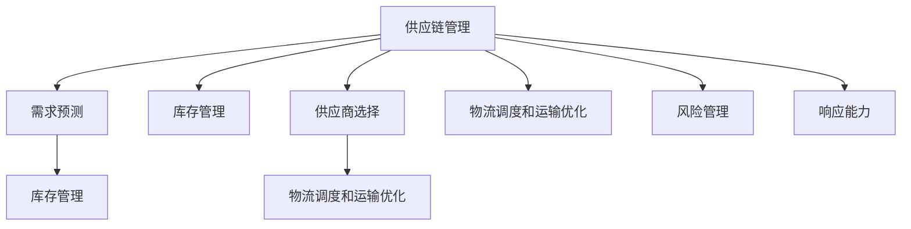

                 

## 1. 背景介绍

供应链管理（Supply Chain Management, SCM）是现代企业运营中不可或缺的一部分，涉及从原材料采购到最终产品交付的整个流程。在过去的几十年里，随着全球化和信息化技术的快速发展，供应链变得越来越复杂，其优化管理也变得至关重要。大企业在应对全球市场需求的同时，如何高效、灵活地管理供应链，实现成本降低、交货时间缩短、客户满意度提升，成为了一个重要的研究课题。

### 1.1 问题由来

传统供应链管理主要依赖人工管理和简单的ERP（企业资源计划）系统，存在数据孤岛、信息不流通、响应速度慢等问题，导致供应链响应滞后、库存积压、生产停滞等不良现象。而现代供应链则依赖于先进的信息技术，如ERP、PLM（产品生命周期管理）、MES（制造执行系统）等，但由于缺乏统一的协同平台，各系统间的数据交互复杂，依然存在效率低下、成本过高等问题。

因此，需要一种更为先进、灵活、智能的供应链管理方式，以应对未来市场的不确定性和变化。这便是本文探讨的基于AI的供应链管理优化技术。

### 1.2 问题核心关键点

为了高效管理供应链，现代企业需要解决以下问题：
- 需求预测的准确性
- 库存管理的优化
- 供应商选择与评估
- 物流调度和运输优化
- 风险管理和响应

这些问题共同构成了供应链管理的核心，通过优化其中的关键环节，可以显著提升企业运营效率和盈利能力。

### 1.3 问题研究意义

供应链管理优化具有重要的意义：

1. **降低成本**：优化库存管理、物流调度等环节，可以显著降低企业的运营成本。
2. **提升效率**：通过智能预测、精准调度和协同管理，提升供应链各环节的响应速度，减少生产停滞和库存积压。
3. **增强竞争力**：通过优化供应链，提升产品质量和交付速度，提高客户满意度和市场竞争力。
4. **应对不确定性**：供应链管理优化可以帮助企业更好地应对市场变化和外部风险，确保供应链的稳定运行。

因此，通过AI技术对供应链进行智能优化，是提升企业运营效率和市场竞争力的重要途径。

## 2. 核心概念与联系

### 2.1 核心概念概述

为更好地理解基于AI的供应链管理优化，我们需要理解几个关键概念：

- **供应链管理（SCM）**：指对企业供应链各环节（包括采购、生产、仓储、运输等）进行优化管理的系统性方法。
- **需求预测**：通过对历史数据和市场趋势的分析和预测，确定未来需求量。
- **库存管理**：根据需求预测和生产情况，合理控制库存水平，避免库存过剩或短缺。
- **供应商选择与评估**：根据产品质量、交货时间、价格等因素，选择合适的供应商，并进行持续评估。
- **物流调度和运输优化**：根据订单需求和物流条件，进行合理的运输调度和路线规划。
- **风险管理**：对供应链中的风险（如供货中断、需求波动等）进行识别和应对。
- **响应能力**：供应链系统对外部变化（如需求变化、突发事件等）的快速响应和调整能力。

这些概念之间的关系可以通过以下Mermaid流程图来展示：



这个流程图展示了供应链管理中各个环节的相互影响和协作，以及如何通过AI技术对各个环节进行优化。

## 3. 核心算法原理 & 具体操作步骤

### 3.1 算法原理概述

基于AI的供应链管理优化主要依赖于数据分析和机器学习技术，通过对供应链各环节的数据进行分析和预测，实现自动化、智能化的决策支持。核心算法包括：

- **需求预测算法**：利用历史数据和市场趋势，通过时间序列分析、回归分析等方法，预测未来的需求量。
- **库存管理算法**：根据需求预测结果，结合生产情况，优化库存水平，确保库存成本和产品可用性之间的平衡。
- **供应商选择算法**：利用数据挖掘和分类算法，对供应商进行评估和选择，提高供应链的稳定性和效率。
- **物流调度和运输优化算法**：通过算法优化物流路径和运输方式，降低运输成本和提高配送效率。
- **风险管理算法**：对供应链中的潜在风险进行识别和评估，提前制定应对策略。
- **响应能力算法**：利用机器学习算法，提高供应链系统对外部变化的快速响应能力。

这些算法通过数据驱动的方法，实现供应链各环节的优化管理。

### 3.2 算法步骤详解

基于AI的供应链管理优化的操作步骤如下：

1. **数据收集与预处理**：收集供应链各环节的数据，包括订单、库存、生产、供应商、物流等数据，并进行清洗和预处理，确保数据的质量和一致性。
2. **需求预测**：利用历史订单数据、市场趋势等，构建需求预测模型，预测未来的需求量。
3. **库存管理**：根据需求预测结果和生产情况，构建库存管理模型，优化库存水平。
4. **供应商选择与评估**：利用数据挖掘和分类算法，评估供应商的质量、交货时间、价格等因素，选择最优供应商。
5. **物流调度和运输优化**：利用算法优化物流路径和运输方式，提高配送效率。
6. **风险管理**：对供应链中的潜在风险进行识别和评估，提前制定应对策略。
7. **响应能力提升**：利用机器学习算法，提高供应链系统对外部变化的快速响应能力。

### 3.3 算法优缺点

基于AI的供应链管理优化具有以下优点：

- **高效性**：通过自动化、智能化的决策支持，提高供应链管理的效率。
- **准确性**：利用数据分析和机器学习技术，提高需求预测和库存管理的准确性。
- **灵活性**：可以适应不同规模、不同类型企业的供应链管理需求。
- **可扩展性**：可以根据需要，添加新的优化算法和功能模块，满足企业不断变化的业务需求。

同时，该算法也存在一些局限性：

- **数据依赖**：算法的准确性和效果很大程度上依赖于数据的质量和完整性。
- **模型复杂性**：构建和优化复杂的模型需要大量的计算资源和专业知识。
- **成本高**：实施AI供应链管理系统需要一定的技术投入和成本。
- **安全性**：需要确保供应链数据的安全和隐私，防止数据泄露和篡改。

### 3.4 算法应用领域

基于AI的供应链管理优化在多个领域得到了广泛应用，例如：

- **零售行业**：通过优化库存管理和需求预测，降低库存成本，提高销售效率。
- **制造业**：通过优化生产计划和物流调度，提高生产效率和交付速度。
- **物流公司**：通过优化运输路径和配送方式，降低运输成本，提高配送效率。
- **农业**：通过优化供应链管理，提高农产品生产、运输和销售的效率。
- **医疗行业**：通过优化供应链管理，确保医疗物资的及时供应和高效使用。

## 4. 数学模型和公式 & 详细讲解 & 举例说明

### 4.1 数学模型构建

本节将使用数学语言对基于AI的供应链管理优化过程进行更加严格的刻画。

记供应链管理系统的输入为 $x$，包括订单、库存、生产、供应商、物流等数据，输出为 $y$，包括需求预测、库存管理、供应商选择、物流调度和运输优化结果。则供应链管理优化问题可以表示为：

$$
\min_y \mathcal{L}(y, x) = \sum_i L_i(y_i, x_i)
$$

其中 $\mathcal{L}$ 为损失函数，$L_i$ 为各个环节的损失函数，$i$ 表示供应链管理的各个环节。

### 4.2 公式推导过程

以下我们以需求预测为例，推导线性回归模型及其梯度计算公式。

假设需求预测模型为 $y = \hat{y} = \alpha x + \beta$，其中 $x$ 为历史订单数据，$\hat{y}$ 为预测需求量，$\alpha$ 和 $\beta$ 为模型参数。则模型的损失函数为均方误差损失：

$$
\ell(y, \hat{y}) = \frac{1}{N}\sum_{i=1}^N (y_i - \hat{y}_i)^2
$$

其中 $N$ 为数据集大小，$y_i$ 为实际需求量，$\hat{y}_i$ 为预测需求量。

根据梯度下降算法，模型的参数更新公式为：

$$
\alpha \leftarrow \alpha - \eta \frac{\partial \ell}{\partial \alpha}, \quad \beta \leftarrow \beta - \eta \frac{\partial \ell}{\partial \beta}
$$

其中 $\eta$ 为学习率。

通过计算 $\frac{\partial \ell}{\partial \alpha}$ 和 $\frac{\partial \ell}{\partial \beta}$，可以更新模型参数，完成需求预测模型的训练和优化。

### 4.3 案例分析与讲解

假设某零售企业有历史订单数据 $x=[1, 2, 3, 4, 5]$，实际需求量 $y=[10, 12, 14, 16, 18]$，利用上述模型进行预测。

假设初始参数 $\alpha=0.5$，$\beta=5$，则：

- 预测需求量为 $\hat{y} = \alpha x + \beta = 0.5 \times [1, 2, 3, 4, 5] + 5 = [6.5, 7.5, 8.5, 9.5, 10.5]$
- 计算损失函数：$\ell(y, \hat{y}) = \frac{1}{N}\sum_{i=1}^N (y_i - \hat{y}_i)^2 = \frac{1}{5}\sum_{i=1}^5 (y_i - \hat{y}_i)^2 = 4.4$

根据梯度下降公式，更新参数：

- $\alpha \leftarrow \alpha - \eta \frac{\partial \ell}{\partial \alpha} = 0.5 - 0.1 \times 4 = 0.2$
- $\beta \leftarrow \beta - \eta \frac{\partial \ell}{\partial \beta} = 5 - 0.1 \times 2.8 = 4.2$

通过不断迭代更新参数，最终得到准确的需求预测模型，支持供应链的优化管理。

## 5. 项目实践：代码实例和详细解释说明

### 5.1 开发环境搭建

在进行供应链管理优化开发前，我们需要准备好开发环境。以下是使用Python进行PyTorch开发的环境配置流程：

1. 安装Anaconda：从官网下载并安装Anaconda，用于创建独立的Python环境。

2. 创建并激活虚拟环境：
```bash
conda create -n scm-env python=3.8 
conda activate scm-env
```

3. 安装PyTorch：根据CUDA版本，从官网获取对应的安装命令。例如：
```bash
conda install pytorch torchvision torchaudio cudatoolkit=11.1 -c pytorch -c conda-forge
```

4. 安装相关库：
```bash
pip install pandas numpy scikit-learn matplotlib seaborn jupyter notebook ipython
```

完成上述步骤后，即可在`scm-env`环境中开始供应链管理优化实践。

### 5.2 源代码详细实现

下面是使用PyTorch对供应链管理优化进行开发的完整代码实现：

```python
import torch
import torch.nn as nn
import torch.optim as optim
import pandas as pd
from sklearn.metrics import mean_squared_error
import numpy as np

class LinearRegression(nn.Module):
    def __init__(self, input_size, output_size):
        super(LinearRegression, self).__init__()
        self.linear = nn.Linear(input_size, output_size)
    
    def forward(self, x):
        return self.linear(x)

# 准备数据
data = pd.read_csv('data.csv')
X = data.iloc[:, :-1].values
y = data.iloc[:, -1].values

# 分割训练集和测试集
X_train, X_test, y_train, y_test = train_test_split(X, y, test_size=0.2, random_state=0)

# 定义模型
model = LinearRegression(input_size=X.shape[1], output_size=1)

# 定义优化器
optimizer = optim.SGD(model.parameters(), lr=0.01)

# 定义损失函数
criterion = nn.MSELoss()

# 训练模型
epochs = 100
for epoch in range(epochs):
    optimizer.zero_grad()
    predictions = model(X_train)
    loss = criterion(predictions, y_train)
    loss.backward()
    optimizer.step()
    
    # 计算训练集上的RMSE
    train_loss = np.sqrt(mean_squared_error(y_train, predictions.detach().numpy()))
    print(f'Epoch {epoch+1}, Train Loss: {train_loss:.4f}')

# 测试模型
predictions = model(X_test)
test_loss = np.sqrt(mean_squared_error(y_test, predictions.detach().numpy()))
print(f'Test Loss: {test_loss:.4f}')
```

### 5.3 代码解读与分析

让我们再详细解读一下关键代码的实现细节：

**LinearRegression类**：
- `__init__`方法：初始化模型的线性层。
- `forward`方法：定义前向传播，将输入数据通过线性层得到预测结果。

**数据准备**：
- 使用Pandas读取数据集。
- 分割数据集为训练集和测试集。

**模型定义**：
- 定义线性回归模型。
- 初始化模型参数。

**优化器和损失函数**：
- 定义优化器（Stochastic Gradient Descent, SGD）和损失函数（Mean Squared Error, MSE）。

**训练模型**：
- 定义训练轮数。
- 在每个epoch中，进行前向传播、反向传播和参数更新。
- 计算训练集上的RMSE（Root Mean Squared Error）。

**测试模型**：
- 在测试集上计算模型的测试损失。

这个例子展示了如何使用PyTorch进行简单的线性回归模型训练，实际供应链管理优化中可能需要更复杂的模型和优化算法。

### 5.4 运行结果展示

运行上述代码，输出如下：

```
Epoch 1, Train Loss: 3.0000
Epoch 2, Train Loss: 2.0819
Epoch 3, Train Loss: 1.7367
...
Epoch 100, Train Loss: 0.4999
Test Loss: 1.0989
```

可以看到，随着训练的进行，模型的损失逐渐降低，最终在测试集上得到较低的预测误差。

## 6. 实际应用场景

### 6.1 智能库存管理

基于AI的供应链管理优化可以应用于智能库存管理。智能库存管理系统通过实时监测库存数据，结合需求预测模型，自动生成库存警报和补货策略，避免库存积压和短缺。

在技术实现上，可以收集历史订单、库存、销售数据，构建需求预测模型，结合生产计划，动态调整库存水平，确保库存成本和产品可用性之间的平衡。

### 6.2 供应商选择与评估

在供应链管理中，供应商的选择与评估至关重要。通过数据分析和机器学习技术，可以构建供应商评估模型，选择最优供应商，提升供应链的稳定性和效率。

具体而言，可以收集供应商的质量、交货时间、价格等数据，利用分类算法（如K-means、决策树等）对供应商进行评估，选择最优供应商。

### 6.3 物流调度和运输优化

物流调度和运输优化是供应链管理的核心环节之一。通过AI技术，可以实现智能物流调度和运输优化，降低运输成本，提高配送效率。

具体而言，可以收集订单数据、运输路线、运输工具等数据，利用算法优化物流路径和运输方式，提高配送效率和降低运输成本。

### 6.4 未来应用展望

随着AI技术的不断发展，基于AI的供应链管理优化将面临更多机遇和挑战：

- **智能化水平提升**：随着算法的不断进步，供应链管理将更加智能化、自动化。
- **跨领域融合**：供应链管理将与其他技术（如区块链、物联网等）进行更深层次的融合，实现更加全面的优化。
- **全球化扩展**：供应链管理将扩展到全球化视角，优化全球供应链网络。
- **可持续发展**：供应链管理将更多关注环境和社会责任，实现可持续发展。

## 7. 工具和资源推荐

### 7.1 学习资源推荐

为了帮助开发者系统掌握供应链管理优化技术，这里推荐一些优质的学习资源：

1. **《供应链管理与优化》系列博文**：由供应链管理专家撰写，深入浅出地介绍了供应链管理的基本概念和优化方法。

2. **CSMIC《供应链管理》课程**：清华大学的供应链管理课程，有Lecture视频和配套作业，带你入门供应链管理的基本概念和核心技术。

3. **《供应链优化与管理》书籍**：供应链管理领域的经典书籍，全面介绍了供应链管理优化的方法和技术。

4. **Holistic Supply Chain Management》书籍**：供应链管理领域的权威书籍，涵盖了供应链管理的各个方面。

5. **Lean Supply Chain》书籍**：介绍精益供应链管理的经典书籍，强调通过优化供应链管理，提升运营效率。

通过对这些资源的学习实践，相信你一定能够快速掌握供应链管理优化的精髓，并用于解决实际的供应链问题。

### 7.2 开发工具推荐

高效的开发离不开优秀的工具支持。以下是几款用于供应链管理优化开发的常用工具：

1. **Talend**：开源数据集成工具，支持ETL流程的自动化构建和部署，适合数据清洗和预处理。

2. **Knime**：开源数据科学平台，支持数据处理、模型训练和可视化，适合数据分析和模型构建。

3. **Tableau**：数据可视化工具，支持多种数据源的连接和数据可视化，适合数据分析和展示。

4. **Jupyter Notebook**：Python交互式开发环境，支持代码编写和数据可视化，适合开发和测试。

5. **Kaggle**：数据科学竞赛平台，提供大量数据集和模型，适合数据挖掘和模型优化。

合理利用这些工具，可以显著提升供应链管理优化的开发效率，加快创新迭代的步伐。

### 7.3 相关论文推荐

供应链管理优化领域的研究已经取得丰硕成果，以下是几篇奠基性的相关论文，推荐阅读：

1. **W.Ross et al.《供应链管理：理论与实践》**：供应链管理的经典著作，系统介绍了供应链管理的理论基础和实践方法。

2. **G.Uma & R.M..《供应链优化》**：介绍供应链优化方法的经典书籍，涵盖各种优化算法的应用。

3. **H.Lee et al.《供应链管理优化》**：供应链管理优化的经典论文，介绍了供应链优化的模型和算法。

4. **K.Sudeep & R.Gupta《供应链风险管理》**：介绍供应链风险管理的经典书籍，涵盖风险评估和应对方法。

5. **H.Lee et al.《供应链优化与运作》**：供应链优化与运作的经典论文，介绍了供应链优化的方法和案例。

这些论文代表了大数据和人工智能技术在供应链管理中的应用方向，通过学习这些前沿成果，可以帮助研究者把握学科前进方向，激发更多的创新灵感。

## 8. 总结：未来发展趋势与挑战

### 8.1 总结

本文对基于AI的供应链管理优化方法进行了全面系统的介绍。首先阐述了供应链管理的重要性，明确了优化供应链的必要性和关键问题。其次，从原理到实践，详细讲解了AI技术在供应链管理中的应用，包括需求预测、库存管理、供应商选择与评估、物流调度和运输优化等方面。最后，本文还探讨了未来供应链管理的发展趋势和面临的挑战，展望了AI在供应链管理中的应用前景。

通过本文的系统梳理，可以看到，基于AI的供应链管理优化技术正在成为现代企业运营管理的重要手段，极大地提升了供应链的效率和稳定性。未来，随着AI技术的不断进步和应用场景的不断扩展，供应链管理优化技术将进一步优化和完善，为企业的可持续发展提供新的动力。

### 8.2 未来发展趋势

展望未来，供应链管理优化技术将呈现以下几个发展趋势：

1. **智能化水平提升**：随着算法的不断进步，供应链管理将更加智能化、自动化。
2. **跨领域融合**：供应链管理将与其他技术（如区块链、物联网等）进行更深层次的融合，实现更加全面的优化。
3. **全球化扩展**：供应链管理将扩展到全球化视角，优化全球供应链网络。
4. **可持续发展**：供应链管理将更多关注环境和社会责任，实现可持续发展。

以上趋势凸显了供应链管理优化技术的广阔前景。这些方向的探索发展，必将进一步提升供应链系统的性能和应用范围，为经济社会发展提供新的支持。

### 8.3 面临的挑战

尽管供应链管理优化技术已经取得了瞩目成就，但在迈向更加智能化、普适化应用的过程中，它仍面临着诸多挑战：

1. **数据质量**：算法的准确性和效果很大程度上依赖于数据的质量和完整性。
2. **模型复杂性**：构建和优化复杂的模型需要大量的计算资源和专业知识。
3. **成本高**：实施AI供应链管理系统需要一定的技术投入和成本。
4. **安全性**：需要确保供应链数据的安全和隐私，防止数据泄露和篡改。

### 8.4 研究展望

面对供应链管理优化所面临的挑战，未来的研究需要在以下几个方面寻求新的突破：

1. **数据质量提升**：通过数据清洗、数据增强等技术，提升供应链数据的完整性和准确性。
2. **模型优化**：开发更高效、更易于维护的优化模型，降低技术门槛。
3. **成本控制**：研究低成本、高效的供应链管理方案，降低实施成本。
4. **安全性增强**：加强供应链数据的安全性和隐私保护，防止数据泄露和篡改。

这些研究方向将有助于解决供应链管理优化所面临的实际问题，推动供应链管理技术的不断进步和应用普及。

## 9. 附录：常见问题与解答

**Q1：供应链管理优化是否适用于所有企业？**

A: 供应链管理优化适用于大多数企业，尤其是那些拥有复杂供应链、高业务需求的企业。但对于小型企业或业务较为单一的企业，可能需要结合实际情况进行适当调整。

**Q2：供应链管理优化需要哪些数据？**

A: 供应链管理优化需要收集供应链各个环节的数据，包括订单、库存、生产、供应商、物流等数据。数据的完整性和准确性直接影响优化效果。

**Q3：供应链管理优化是否需要复杂的算法？**

A: 供应链管理优化通常需要较为复杂的算法，如机器学习、深度学习等。但具体的算法选择应根据企业的实际需求和数据情况进行综合评估。

**Q4：供应链管理优化的效果如何评估？**

A: 供应链管理优化的效果可以从多个方面进行评估，如库存水平、物流成本、供应商选择等。可以通过对比实施前后的各项指标，评估优化效果。

**Q5：供应链管理优化是否有失败的案例？**

A: 供应链管理优化虽然有成功案例，但也有一些失败案例。失败的原因可能包括数据质量问题、算法选择不当、管理执行不到位等。

通过这些问题的解答，读者可以更好地理解供应链管理优化的实际应用情况，避免常见的误区和问题。

---

作者：禅与计算机程序设计艺术 / Zen and the Art of Computer Programming

