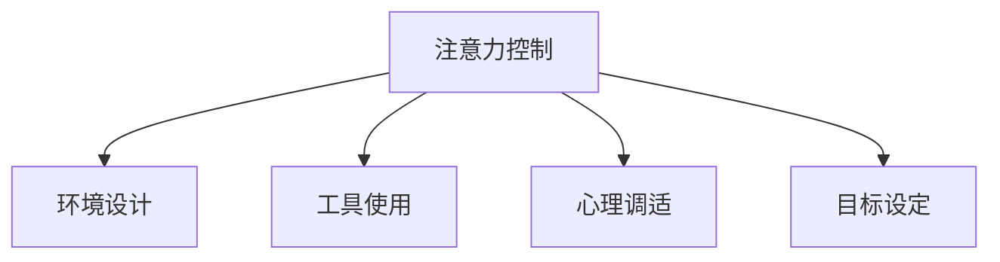

                 

# 信息时代的注意力管理实践：在充满干扰的环境中保持头脑清晰和专注

## 1. 背景介绍

### 1.1 问题由来

在信息爆炸的互联网时代，海量信息不断冲击着人们的注意力。无论是社交媒体上的即时消息，还是新闻网站上的热点文章，都试图在短时间内吸引我们的注意力。这种信息过载不仅干扰了我们的工作和学习的效率，还可能导致焦虑、疲劳等心理问题。

面对这一挑战，如何有效管理注意力，保持头脑清晰和专注，成为了现代工作和生活中必须解决的问题。

### 1.2 问题核心关键点

注意力管理，即通过系统化的策略和方法，提升个体在特定任务上的注意力集中度，减少干扰，从而提高效率和质量。核心关键点包括：

- 注意力控制：通过设置优先级、制定时间管理计划等手段，控制信息流，避免过度干扰。
- 环境设计：优化工作和学习环境，减少外界干扰因素，提升专注度。
- 工具使用：利用各类工具和应用，帮助管理注意力，如番茄工作法、聚焦模式、注意力增强工具等。
- 心理调适：通过心理调节和冥想等方法，提升个体对干扰的抵抗力和适应能力。
- 目标设定：明确工作和学习的目标，保持动机和激情，提升注意力管理效果。

## 2. 核心概念与联系

### 2.1 核心概念概述

为了更好地理解注意力管理，本节将介绍几个密切相关的核心概念：

- **注意力控制**：通过优先级设定、时间管理、任务分解等手段，合理分配注意力资源，避免被不重要的信息干扰。
- **环境设计**：通过调整工作和学习环境，减少外界干扰，提升专注度。包括物理空间布局、光线、温度等环境因素。
- **工具使用**：利用各种工具和应用，辅助注意力管理。如番茄工作法、聚焦模式、注意力增强工具等。
- **心理调适**：通过心理调节和冥想等方法，增强个体对干扰的抵抗力和适应能力，提升内在专注力。
- **目标设定**：明确任务目标，设定切实可行的计划，激发内在动机，帮助保持持续的专注。

这些核心概念之间的逻辑关系可以通过以下Mermaid流程图来展示：



这个流程图展示了注意力管理的几个核心维度，它们共同作用，形成了完整的注意力管理框架。

## 3. 核心算法原理 & 具体操作步骤
### 3.1 算法原理概述

注意力管理的核心是控制注意力资源，使其最大化地集中在重要任务上。这可以通过以下算法原理来实现：

1. **任务优先级排序**：对任务按照重要性和紧急程度进行排序，优先处理高优先级任务。
2. **时间块管理**：将时间分割成小块，每个时间块专注于一个具体任务，避免多任务切换带来的干扰。
3. **环境优化**：通过调整物理环境和软件设置，减少外界干扰，提升专注度。
4. **工具辅助**：使用注意力增强工具，如番茄工作法、聚焦模式等，辅助实现时间管理和任务切换。
5. **心理调节**：通过冥想、正念等心理调节方法，增强个体对干扰的抵抗力和适应能力。
6. **目标设定**：设定明确、可行的目标，保持内在动机和专注力。

### 3.2 算法步骤详解

基于上述算法原理，注意力管理的步骤可以分为以下几个关键环节：

**Step 1: 任务优先级排序**
- 列出所有需要完成的任务，按照重要性和紧急程度进行排序。
- 使用Eisenhower矩阵或其他优先级排序工具，将任务分为紧急/重要、不紧急/重要、紧急/不重要、不紧急/不重要四类。

**Step 2: 时间块管理**
- 将时间划分为若干个时间块，每个时间块专注于一个具体任务。
- 使用番茄工作法、Pomodoro定时器等工具，设定每个时间块的长度和间隔。
- 在每个时间块结束时，短暂休息，防止疲劳。

**Step 3: 环境优化**
- 调整物理环境，如减少噪音、调节光线、控制温度等。
- 设置软件环境，如关闭不必要的应用通知、使用专注模式等。

**Step 4: 工具辅助**
- 使用番茄工作法、聚焦模式等工具，辅助时间管理和任务切换。
- 使用注意力增强工具，如音乐、白噪音、专注背景音乐等，提升专注度。

**Step 5: 心理调节**
- 定期进行冥想、正念练习，增强对干扰的抵抗力和适应能力。
- 采用心理调适技巧，如深呼吸、正念冥想、瑜伽等，缓解压力，提升专注力。

**Step 6: 目标设定**
- 设定明确、可行的目标，将其分解为具体的小目标。
- 使用SMART原则（具体、可衡量、可实现、相关、时间限定）来设定目标。
- 定期回顾和调整目标，确保始终保持正确方向。

### 3.3 算法优缺点

注意力管理算法具有以下优点：
1. 结构清晰，易于实施。通过系统化的步骤，可以有效提升注意力管理的效率。
2. 灵活可调，适应性强。根据个体差异和任务特点，可以进行个性化的调整和优化。
3. 数据驱动，可量化评估。通过设定和监控目标，可以量化注意力管理的效果，持续改进。

同时，该算法也存在一定的局限性：
1. 依赖于个体执行力。需要个人主动遵循计划和策略，执行力不足可能导致效果不佳。
2. 对环境依赖较大。环境干扰较大时，难以完全依赖于工具和策略实现注意力管理。
3. 难以应对突发情况。当出现突发事件或紧急情况时，难以快速调整计划，保持专注。
4. 需要持续投入。注意力管理需要持续的练习和调整，短期内难以看到显著效果。

尽管存在这些局限性，但就目前而言，注意力管理算法仍是一种系统化、可操作性强的实践方法，能够显著提升个人在信息过载环境下的效率和专注力。

### 3.4 算法应用领域

注意力管理算法的应用领域非常广泛，涵盖了日常工作和生活的方方面面，例如：

- 办公环境：通过优化工作环境和设定工作计划，提升工作效率和质量。
- 学习场景：通过设定学习目标和使用专注工具，帮助学生更好地掌握知识。
- 家庭生活：通过家庭环境设计和管理，提升家庭成员的日常生活质量。
- 项目管理：通过任务优先级排序和时间块管理，优化项目进度和资源分配。
- 个人健康：通过心理调适和目标设定，提升个体的生活质量和健康水平。

除了这些经典应用外，注意力管理算法还被创新性地应用到更多场景中，如数字健康、远程工作、在线教育等，为信息时代的个人生活提供了全新的解决方案。

## 4. 数学模型和公式 & 详细讲解 & 举例说明
### 4.1 数学模型构建

注意力管理算法可以通过数学模型进行形式化描述。设 $T$ 为一天的总时间，$I$ 为待处理的任务数量，$P_i$ 为第 $i$ 个任务的优先级，$T_i$ 为处理第 $i$ 个任务所需的时间，$W_i$ 为第 $i$ 个任务的权重，$R$ 为每日休息时间。则注意力管理的数学模型可以表示为：

$$
\max \sum_{i=1}^I W_i f(P_i)T_i
$$

其中 $f(P_i)$ 为优先级函数，表示不同优先级任务的处理效率。目标函数最大化总任务权重与处理时间的乘积。

### 4.2 公式推导过程

以下我们推导优先级函数 $f(P_i)$ 的表达形式。假设优先级函数为线性函数，则有：

$$
f(P_i) = \frac{1}{\alpha_i + \beta_i P_i}
$$

其中 $\alpha_i$ 为任务的基础处理效率，$\beta_i$ 为优先级对效率的影响系数。代入目标函数，得：

$$
\max \sum_{i=1}^I W_i \frac{T_i}{\alpha_i + \beta_i P_i}
$$

### 4.3 案例分析与讲解

假设某员工一天时间安排如下：

| 任务 | 优先级 | 处理时间 | 权重 |
|------|--------|----------|------|
| A    | 高     | 2小时    | 5    |
| B    | 中     | 3小时    | 4    |
| C    | 低     | 1小时    | 2    |
| D    | 低     | 1小时    | 1    |

根据上述公式，设定 $\alpha_i = 1, \beta_i = 2$，则有：

$$
\max 5 \frac{2}{1 + 2 \cdot 1} + 4 \frac{3}{1 + 2 \cdot 2} + 2 \frac{1}{1 + 2 \cdot 3} + 1 \frac{1}{1 + 2 \cdot 4}
$$

通过求解，可以得到最优的任务分配方案。

## 5. 项目实践：代码实例和详细解释说明
### 5.1 开发环境搭建

在进行注意力管理实践前，我们需要准备好开发环境。以下是使用Python进行PyTorch开发的环境配置流程：

1. 安装Anaconda：从官网下载并安装Anaconda，用于创建独立的Python环境。

2. 创建并激活虚拟环境：
```bash
conda create -n attention-management python=3.8 
conda activate attention-management
```

3. 安装PyTorch：根据CUDA版本，从官网获取对应的安装命令。例如：
```bash
conda install pytorch torchvision torchaudio cudatoolkit=11.1 -c pytorch -c conda-forge
```

4. 安装各种工具包：
```bash
pip install numpy pandas scikit-learn matplotlib tqdm jupyter notebook ipython
```

5. 安装番茄工作法工具：
```bash
pip install pytomato
```

完成上述步骤后，即可在`attention-management`环境中开始注意力管理的实践。

### 5.2 源代码详细实现

下面以使用PyTorch实现注意力管理的代码为例：

```python
import numpy as np
from pytomato import TomatoTimer

def calculate_priorities(tasks, priorities):
    total_time = sum(tasks)
    return [task / total_time * priority for task, priority in zip(tasks, priorities)]

def schedule_tasks(tasks, priorities, total_time):
    # 计算每项任务的优先级
    task_priorities = calculate_priorities(tasks, priorities)
    
    # 设定每个时间块的长度
    block_length = 25
    
    # 计算总时间块数
    num_blocks = total_time // block_length
    
    # 时间块排序
    sorted_blocks = sorted(zip(task_priorities, tasks), key=lambda x: x[0], reverse=True)
    
    # 分配时间块
    schedule = []
    remaining_time = total_time
    for block in range(num_blocks):
        best_task = None
        best_score = -1
        for task, priority in sorted_blocks:
            if remaining_time >= block_length:
                remaining_time -= task
                schedule.append(task)
                break
        
        if remaining_time > 0:
            schedule.append(remaining_time)
    
    return schedule

# 测试数据
tasks = [2, 3, 1, 1]
priorities = [1, 2, 3, 4]

# 计算优先级
task_priorities = calculate_priorities(tasks, priorities)

# 设定总时间
total_time = 8

# 生成时间块分配方案
schedule = schedule_tasks(tasks, task_priorities, total_time)
print(schedule)
```

### 5.3 代码解读与分析

让我们再详细解读一下关键代码的实现细节：

**calculate_priorities函数**：
- 该函数用于计算每项任务的优先级，通过任务的权重和处理时间，将其转换为0-1之间的优先级值。

**schedule_tasks函数**：
- 该函数用于生成时间块分配方案。首先计算每项任务的优先级，然后根据总时间块数和时间块长度，进行优先级排序和时间块分配。

**测试数据**：
- 设定了四个任务的权重和处理时间，以及总时间。通过调用`calculate_priorities`函数，计算出每项任务的优先级。

**时间块分配方案**：
- 调用`schedule_tasks`函数，根据优先级排序和时间块长度，生成最优的时间块分配方案。

可以看到，通过简单的数学模型和代码实现，我们能够系统地管理一天的时间，提升工作和学习的效率。

## 6. 实际应用场景
### 6.1 办公室工作环境

在办公室环境中，注意力管理可以通过优化工作环境和设定工作计划，提升工作效率和质量。具体措施包括：

- 调整工作台面布局，减少干扰因素。
- 设置独立的工作空间，减少噪音和同事打扰。
- 使用番茄工作法，设定专注和休息时间块。
- 关闭不必要的应用通知，减少外界干扰。

### 6.2 远程工作环境

在远程工作环境中，注意力管理需要更多的自我管理和心理调适。具体措施包括：

- 设定明确的工作时间和任务，使用番茄工作法辅助管理时间。
- 使用视频会议工具，保持与同事和上司的沟通。
- 定期进行心理调节，如冥想、正念练习，提升专注力和抗干扰能力。
- 设定健康的生活习惯，保持身心健康。

### 6.3 学习场景

在学习场景中，注意力管理可以通过设定学习目标和使用专注工具，帮助学生更好地掌握知识。具体措施包括：

- 设定明确的学习目标，使用SMART原则进行分解。
- 使用专注模式，避免在学习时分心。
- 定期进行心理调节，如深呼吸、正念冥想等，提升学习效率。
- 制定合理的学习计划，避免过度疲劳。

### 6.4 家庭生活

在家庭生活中，注意力管理可以通过家庭环境设计和管理，提升家庭成员的日常生活质量。具体措施包括：

- 设置独立的工作和学习空间，减少家庭成员的干扰。
- 关闭不必要的家庭设备，减少噪音和干扰。
- 设定明确的家庭任务和优先级，通过番茄工作法进行管理。
- 定期进行家庭沟通，保持家庭成员的和谐与合作。

## 7. 工具和资源推荐
### 7.1 学习资源推荐

为了帮助开发者系统掌握注意力管理的理论基础和实践技巧，这里推荐一些优质的学习资源：

1. **《高效能人士的七个习惯》**：史蒂芬·柯维的经典管理书籍，介绍了系统化的时间管理和任务优先级策略。

2. **《番茄工作法图解》**：弗朗西斯科·西里洛的著作，详细介绍了番茄工作法的使用方法和效果。

3. **《深度工作：如何有效利用每一点脑力》**：卡尔·纽波特的著作，探讨了深度工作的重要性和方法。

4. **Coursera的“注意力训练”课程”**：由斯坦福大学教授提供的在线课程，帮助学习者掌握注意力管理的技巧。

5. **《正念与生活》**：乔恩·卡巴特-津恩的著作，介绍了正念冥想等心理调适方法。

通过对这些资源的学习实践，相信你一定能够快速掌握注意力管理的精髓，并用于解决实际的注意力管理问题。

### 7.2 开发工具推荐

高效的开发离不开优秀的工具支持。以下是几款用于注意力管理开发的常用工具：

1. **PyTorch**：基于Python的开源深度学习框架，灵活动态的计算图，适合快速迭代研究。

2. **PyTomato**：番茄工作法的Python实现，帮助开发者设定番茄时间块。

3. **Focus@Will**：专注背景音乐应用，通过科学音乐提高注意力和效率。

4. **RescueTime**：自动跟踪和管理应用使用时间，帮助用户优化时间管理。

5. **Trello**：任务管理和协作工具，帮助用户设定任务优先级和进行时间规划。

6. **Google Calendar**：时间管理工具，帮助用户设定时间块和管理日程。

合理利用这些工具，可以显著提升注意力管理的开发效率，加快创新迭代的步伐。

### 7.3 相关论文推荐

注意力管理的研究源于学界的持续探索。以下是几篇奠基性的相关论文，推荐阅读：

1. **《时间管理的艺术》**：大卫·艾伦的著作，介绍了系统化的时间管理方法。

2. **《番茄工作法》**：弗朗西斯科·西里洛的著作，详细介绍了番茄工作法的使用方法和效果。

3. **《深度工作：如何有效利用每一点脑力》**：卡尔·纽波特的著作，探讨了深度工作的重要性和方法。

4. **《正念与生活》**：乔恩·卡巴特-津恩的著作，介绍了正念冥想等心理调适方法。

这些论文代表了大语言模型微调技术的发展脉络。通过学习这些前沿成果，可以帮助研究者把握学科前进方向，激发更多的创新灵感。

## 8. 总结：未来发展趋势与挑战

### 8.1 总结

本文对注意力管理的核心概念和实践方法进行了全面系统的介绍。首先阐述了注意力管理在信息过载环境中的重要性，明确了注意力控制、环境设计、工具使用、心理调适和目标设定的关键点。其次，通过数学模型和代码实例，展示了注意力管理的算法原理和具体操作步骤。同时，本文还广泛探讨了注意力管理在各个场景中的应用，展示了其在提升效率和质量方面的巨大潜力。此外，本文精选了注意力管理的各类学习资源，力求为读者提供全方位的技术指引。

通过本文的系统梳理，可以看到，注意力管理在提升个人效率和专注力方面的重要性和可行性。无论是通过优化环境、使用工具，还是通过心理调适、目标设定，我们都能在信息过载的环境中，保持头脑清晰和专注，提升工作和学习效率。

### 8.2 未来发展趋势

展望未来，注意力管理将呈现以下几个发展趋势：

1. **智能辅助**：随着AI技术的发展，智能化的注意力管理工具将逐渐普及，帮助用户进行更加系统化、个性化的时间管理。

2. **多模态融合**：未来的注意力管理工具将融合视觉、听觉等多种模态信息，提升用户体验和效果。

3. **脑机接口**：脑机接口技术的发展，将使注意力管理更加精准，通过实时监测大脑活动，进行更智能的资源分配。

4. **个性化定制**：未来的注意力管理工具将更加注重个性化定制，根据用户的习惯、性格、需求等进行精准推荐。

5. **跨平台协同**：未来的注意力管理工具将支持跨平台协同，实现不同设备和场景的统一管理。

以上趋势凸显了注意力管理技术的广阔前景。这些方向的探索发展，必将进一步提升个人在信息过载环境下的效率和专注力，为构建智能、高效的工作和生活模式铺平道路。

### 8.3 面临的挑战

尽管注意力管理技术已经取得了显著成果，但在实现智能化、高效化、个性化目标的过程中，仍面临诸多挑战：

1. **技术门槛较高**：当前注意力管理工具往往需要一定的技术背景，普通用户难以上手。如何降低技术门槛，普及普及化工具，是未来的重要方向。

2. **数据隐私问题**：注意力管理工具需要收集用户的使用数据，如何保护用户隐私，避免数据泄露和滥用，是未来的重要课题。

3. **跨平台协同**：不同设备和平台的用户，如何实现跨平台、跨设备的数据同步和功能协同，是未来的重要挑战。

4. **用户体验优化**：如何设计更加友好、易用的界面，提升用户的使用体验，吸引更多用户使用，是未来的重要方向。

5. **持续更新维护**：注意力管理工具需要不断迭代和优化，如何持续更新和维护，保持竞争力，是未来的重要挑战。

尽管存在这些挑战，但未来的注意力管理技术在智能化、个性化、跨平台协同等方面仍具有广阔的发展前景，相信随着技术的不断进步和实践的积累，这些挑战终将一一被克服，注意力管理将为构建高效、智能、和谐的工作和生活模式贡献更多力量。

### 8.4 研究展望

面对注意力管理面临的挑战，未来的研究需要在以下几个方面寻求新的突破：

1. **智能化技术应用**：将AI技术，如自然语言处理、图像识别等，融入注意力管理工具，提升智能推荐和数据分析能力。

2. **多模态信息融合**：将视觉、听觉等多种模态信息融合到注意力管理中，提升用户体验和效果。

3. **个性化定制**：通过机器学习和数据分析，实现更加精准的个性化定制，提升工具的适配性和易用性。

4. **跨平台协同**：实现不同设备和平台的数据同步和功能协同，提升跨平台用户体验。

5. **隐私保护技术**：开发隐私保护技术，保护用户数据安全，避免数据泄露和滥用。

这些研究方向的探索，必将引领注意力管理技术迈向更高的台阶，为构建高效、智能、和谐的工作和生活模式提供更多支持。

## 9. 附录：常见问题与解答

**Q1：注意力管理是否适用于所有场景？**

A: 注意力管理在大多数场景中都能取得良好的效果，特别是在工作和学习环境中。但对于一些特殊场景，如紧急情况处理、突发事件应对等，需要结合具体情境进行灵活调整。

**Q2：如何设定合适的任务优先级？**

A: 任务优先级的设定需要根据任务的紧急性和重要性进行评估。一般可以使用Eisenhower矩阵或其他优先级排序工具，将任务分为四类：紧急/重要、不紧急/重要、紧急/不重要、不紧急/不重要。根据优先级排序进行任务分配和管理。

**Q3：注意力管理是否需要大量时间投入？**

A: 是的，注意力管理需要持续的练习和调整，才能逐步形成良好的习惯和效果。建议从简单的番茄工作法开始，逐步引入更复杂的时间管理工具和方法。

**Q4：注意力管理是否适用于所有人群？**

A: 是的，注意力管理适用于大多数人群，特别是那些对信息过载感到困扰的用户。通过系统化的策略和方法，能够显著提升个体的工作和学习效率。

**Q5：注意力管理是否会加剧焦虑感？**

A: 不会。相反，系统化的注意力管理有助于减少焦虑和疲劳，提升工作和生活质量。关键是设定合理的目标和时间块，避免过度疲劳和压力。

---

作者：禅与计算机程序设计艺术 / Zen and the Art of Computer Programming

