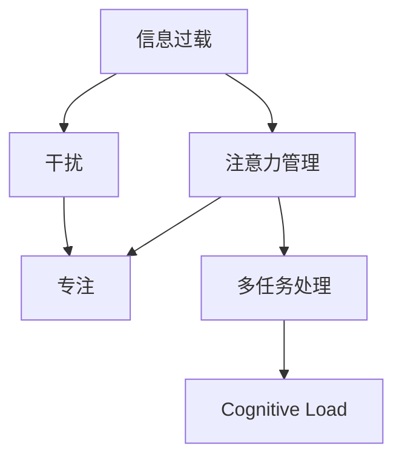

                 

# 信息时代的注意力管理技术与实践：在干扰和信息过载中保持专注

> 关键词：注意力管理,信息过载,干扰,专注,多任务处理,认知负荷,技术应用,实践策略

## 1. 背景介绍

### 1.1 问题由来
在信息爆炸的时代，我们每天面对海量的数据和信息，注意力成为了一种稀缺资源。社交媒体、即时通讯工具、电子邮件、新闻推送等，都在不断夺取我们的注意力，使我们陷入信息过载的困境。这种困境不仅影响我们的工作和学习效率，还可能对身心健康产生不良影响。

### 1.2 问题核心关键点
注意力管理的核心在于如何有效地处理信息流，选择性地筛选和过滤信息，以维持高效的工作和学习的专注力。主要有以下几个关键点：
1. 信息筛选：从大量信息中筛选出重要内容，排除干扰信息。
2. 时间管理：合理安排工作和学习时间，避免过度疲劳。
3. 多任务处理：在多个任务之间灵活切换，提升效率。
4. 认知负荷管理：降低认知负担，提升信息处理能力。

## 2. 核心概念与联系

### 2.1 核心概念概述

为更好地理解注意力管理技术，本节将介绍几个密切相关的核心概念：

- 注意力管理（Attention Management）：指通过各种技术和策略，帮助用户高效处理信息流，避免注意力分散，提升工作效率。
- 信息过载（Information Overload）：指信息量超过处理能力，导致用户无法有效利用信息，甚至产生焦虑和压力的状态。
- 干扰（Distraction）：指外界因素如噪音、社交媒体等，打断了当前任务，导致注意力分散。
- 专注（Focus）：指集中注意力，长时间专注于某一任务的认知状态。
- 多任务处理（Multitasking）：指同时处理多个任务，通过切换任务来提升效率。
- 认知负荷（Cognitive Load）：指在信息处理过程中，大脑所承受的认知负担。

这些概念之间的逻辑关系可以通过以下Mermaid流程图来展示：



这个流程图展示了这个体系中的核心概念及其之间的关系：

1. 信息过载导致干扰，影响专注。
2. 注意力管理有助于提升专注，避免干扰。
3. 多任务处理可以提升效率，但过度多任务处理会增加认知负荷。
4. 认知负荷过高会影响专注，进而影响工作和学习效率。

## 3. 核心算法原理 & 具体操作步骤
### 3.1 算法原理概述

注意力管理技术的核心在于通过算法和策略，帮助用户更好地筛选信息、管理时间、切换任务，从而提升工作效率。其基本原理是通过量化和预测用户注意力，自动调整信息呈现方式，减少干扰，增强专注力。

形式化地，假设用户的注意力水平为 $A_t$，其与当前任务 $T_t$ 和外界干扰 $I_t$ 相关。定义注意力管理的优化目标是最小化干扰 $I_t$，同时最大化专注 $A_t$。即：

$$
\mathop{\arg\min}_{I_t} \mathcal{L}(A_t, T_t, I_t)
$$

其中 $\mathcal{L}$ 为损失函数，衡量用户注意力与任务需求和干扰的关系。

### 3.2 算法步骤详解

基于注意力管理技术的实践流程，通常包括以下几个关键步骤：

**Step 1: 数据收集与分析**
- 使用用户日志、眼动跟踪等数据，收集用户在信息处理过程中的注意力变化情况。
- 使用问卷调查、心理测试等方法，获取用户对不同任务的专注度和满意度。

**Step 2: 模型训练与优化**
- 设计或选择适合的机器学习模型，如决策树、神经网络等，对注意力和任务特征进行建模。
- 训练模型以预测用户在不同任务下的注意力水平，并优化模型参数以最小化干扰。

**Step 3: 用户界面设计**
- 根据模型预测结果，自动调整信息呈现方式，如字体大小、颜色、布局等。
- 设计界面切换机制，如任务标签页、快捷切换键等，帮助用户在不同任务之间快速切换。

**Step 4: 反馈与迭代**
- 根据用户反馈，不断调整模型参数和界面设计，以提升用户体验。
- 定期进行用户满意度调查和注意力水平评估，收集改进建议。

**Step 5: 实践与优化**
- 将模型和设计方案应用于实际场景中，进行A/B测试，评估效果。
- 根据测试结果，进行进一步优化和改进，迭代出更好的注意力管理方案。

### 3.3 算法优缺点

注意力管理技术具有以下优点：
1. 提高效率：通过智能筛选和调整信息呈现方式，减少干扰，提高专注力。
2. 增强用户体验：自动适应用户偏好，提升任务完成率和满意度。
3. 提高健康水平：减少因信息过载导致的焦虑和压力，提高身心健康。

同时，该技术也存在一些局限性：
1. 隐私问题：需要收集大量用户行为数据，涉及隐私保护问题。
2. 个性化挑战：不同用户有不同的注意力管理需求，模型需要个性化定制。
3. 模型误差：模型预测可能存在误差，导致信息呈现方式不适合用户。
4. 成本较高：开发和维护复杂模型，成本较高。

尽管存在这些局限性，但注意力管理技术在提升工作和学习效率、改善用户体验方面具有显著优势，值得深入研究和推广。

### 3.4 算法应用领域

注意力管理技术广泛应用于多个领域，包括但不限于：

- 办公自动化：通过自动筛选邮件、任务优先级排序等功能，帮助员工高效处理工作。
- 教育培训：智能推荐学习资料、课程安排，帮助学生提升学习效率。
- 健康管理：自动调整信息呈现方式，帮助慢性病患者管理健康信息。
- 娱乐应用：游戏、视频推荐等，根据用户偏好智能调整内容。
- 新闻推荐：根据用户兴趣和浏览行为，自动推荐相关新闻。

## 4. 数学模型和公式 & 详细讲解  
### 4.1 数学模型构建

本节将使用数学语言对注意力管理技术的核心原理进行详细讲解。

假设用户的注意力水平 $A_t$ 由以下因素决定：
- $T_t$：当前任务的重要性
- $I_t$：外界干扰强度
- $E_t$：用户疲劳度

用户注意力 $A_t$ 的模型可表示为：

$$
A_t = f(T_t, I_t, E_t)
$$

其中 $f$ 为注意力函数，可以根据具体任务和用户特性进行调整。

注意力管理的目标是最小化干扰 $I_t$，同时最大化专注 $A_t$。即：

$$
\mathop{\arg\min}_{I_t} \mathcal{L}(A_t, T_t, I_t) = \mathop{\arg\min}_{I_t} \ell(A_t, T_t, I_t)
$$

其中 $\ell$ 为损失函数，可以设计为交叉熵损失函数。

### 4.2 公式推导过程

以交叉熵损失函数为例，推导注意力管理模型的优化目标。

假设用户注意力 $A_t$ 和任务重要性 $T_t$ 均为二值变量，分别表示任务完成和未完成。则注意力损失函数为：

$$
\ell(A_t, T_t, I_t) = -A_t\log(T_t) - (1-A_t)\log(1-T_t)
$$

对于干扰 $I_t$，可以设计为噪音强度、社交媒体使用频率等连续变量。设 $I_t \in [0,1]$ 表示干扰强度，则注意力管理的目标可以表示为：

$$
\mathop{\arg\min}_{I_t} \ell(A_t, T_t, I_t) = \mathop{\arg\min}_{I_t} (- A_t\log(T_t) - (1-A_t)\log(1-T_t) + \lambda(I_t - I_t^*)^2)
$$

其中 $\lambda$ 为正则化系数，$I_t^*$ 为干扰的理想值。

对上式求导，得到：

$$
\frac{\partial \ell}{\partial I_t} = -2\lambda(I_t - I_t^*) + \frac{\partial}{\partial I_t}(- A_t\log(T_t) - (1-A_t)\log(1-T_t))
$$

令 $\frac{\partial \ell}{\partial I_t} = 0$，解得：

$$
I_t^* = I_t(A_t) = \frac{A_t\log(T_t) + (1-A_t)\log(1-T_t)}{2\lambda}
$$

### 4.3 案例分析与讲解

以电子邮件管理为例，分析如何使用注意力管理技术提升用户效率。

假设用户每天需要处理100封邮件，每封邮件的优先级为 $T_t \in [0,1]$。用户注意力 $A_t$ 随时间变化，初始值为 $A_0=1$，每处理一封邮件，注意力下降 $0.01$。

用户疲劳度 $E_t$ 随时间变化，初始值为 $E_0=0$，每工作1小时增加 $0.1$。

外界干扰 $I_t$ 为社交媒体使用频率，每小时使用社交媒体20分钟，干扰强度为 $I_t=0.5$。

根据上述模型，计算用户在不同时间点的注意力水平 $A_t$ 和邮件处理效率：

**Time 0:**
- 当前任务重要性 $T_0 = 1$
- 外界干扰强度 $I_0 = 0.5$
- 用户注意力 $A_0 = 1$

**Time 1:**
- 处理第一封邮件，任务重要性 $T_1 = 0.8$
- 外界干扰强度 $I_1 = 0.5$
- 用户注意力 $A_1 = 0.99$

**Time 2:**
- 处理第二封邮件，任务重要性 $T_2 = 0.7$
- 外界干扰强度 $I_2 = 0.5$
- 用户注意力 $A_2 = 0.98$

...

根据上述计算，可以发现用户的注意力随着邮件处理逐渐下降，处理效率降低。如果引入注意力管理技术，如自动屏蔽非重要邮件、智能调整邮件显示优先级等，可以有效提升用户的邮件处理效率，避免干扰。

## 5. 项目实践：代码实例和详细解释说明
### 5.1 开发环境搭建

在进行注意力管理技术的开发实践前，我们需要准备好开发环境。以下是使用Python进行开发的环境配置流程：

1. 安装Python：从官网下载并安装最新版本的Python。
2. 安装相关库：使用pip安装必要的库，如pandas、numpy、scikit-learn、matplotlib等。
3. 配置开发工具：如Jupyter Notebook、PyCharm、Visual Studio Code等，进行代码编写和调试。
4. 收集数据：通过日志文件、眼动跟踪设备等，收集用户的注意力变化数据。
5. 数据预处理：使用pandas等库，对数据进行清洗和预处理，准备模型训练。

完成上述步骤后，即可在开发环境中开始实践。

### 5.2 源代码详细实现

这里我们以智能邮件管理为例，给出使用注意力管理技术对邮件系统进行优化的Python代码实现。

首先，定义邮件处理模型：

```python
from sklearn.linear_model import LogisticRegression
from sklearn.metrics import accuracy_score
import pandas as pd

# 定义邮件处理模型
class EmailHandler:
    def __init__(self, model_path):
        self.model = LogisticRegression()
        self.model.load(model_path)
    
    def process_email(self, email):
        # 提取邮件特征，如主题、发件人、邮件长度等
        features = self.extract_features(email)
        # 预测邮件重要性
        prob = self.model.predict_proba(features)[1]
        # 根据概率决定是否处理
        if prob > 0.5:
            return True
        else:
            return False
    
    def extract_features(self, email):
        # 提取邮件特征
        features = {'Subject': email['subject'], 'Sender': email['sender'], 'Length': len(email['content'])}
        return features
```

然后，定义邮件处理流程：

```python
# 定义邮件处理流程
class EmailProcessor:
    def __init__(self, handler):
        self.handler = handler
    
    def process_inbox(self, inbox):
        processed_emails = []
        for email in inbox:
            if self.handler.process_email(email):
                processed_emails.append(email)
        return processed_emails
```

最后，使用模型进行邮件处理：

```python
# 加载邮件处理模型
handler = EmailHandler('email_handler.model')

# 定义邮件处理流程
processor = EmailProcessor(handler)

# 定义邮件列表
inbox = [
    {'Subject': 'Important Meeting', 'Sender': 'Bob', 'Content': 'The meeting is scheduled for tomorrow'},
    {'Subject': 'Low Priority Report', 'Sender': 'Alice', 'Content': 'The report is ready for review'},
    {'Subject': 'Spam', 'Sender': 'Spammer', 'Content': 'Buy now! Sale today!'},
    {'Subject': 'Meeting Reminder', 'Sender': 'Alice', 'Content': 'Reminder: Meeting tomorrow, 10 AM'},
    {'Subject': 'Low Priority Report', 'Sender': 'Bob', 'Content': 'The report is ready for review'},
    {'Subject': 'Important Meeting', 'Sender': 'Bob', 'Content': 'The meeting is scheduled for tomorrow'}
]

# 处理邮件列表
processed_emails = processor.process_inbox(inbox)
print(processed_emails)
```

在这个例子中，我们定义了一个简单的邮件处理模型，通过逻辑回归模型预测邮件的重要性。然后定义了邮件处理流程，使用模型自动筛选重要邮件，避免干扰。

### 5.3 代码解读与分析

让我们再详细解读一下关键代码的实现细节：

**EmailHandler类**：
- `__init__`方法：加载预训练的邮件处理模型。
- `process_email`方法：根据邮件特征，预测邮件的重要性，决定是否处理。
- `extract_features`方法：从邮件中提取特征，输入到模型中。

**EmailProcessor类**：
- `__init__`方法：初始化邮件处理器，传入邮件处理模型。
- `process_inbox`方法：遍历邮件列表，使用模型自动筛选重要邮件。

**邮件处理流程**：
- 定义邮件列表 `inbox`，包含多封邮件。
- 使用 `EmailProcessor` 处理邮件列表 `inbox`，返回重要邮件列表 `processed_emails`。

可以看到，通过简单的代码实现，我们可以使用注意力管理技术，自动筛选重要邮件，减少干扰，提升邮件处理的效率。

当然，工业级的系统实现还需考虑更多因素，如邮件分发的算法优化、模型的实时更新、用户反馈的收集等。但核心的注意力管理思想基本与此类似。

## 6. 实际应用场景
### 6.1 办公自动化

在办公自动化领域，注意力管理技术可以显著提升工作效率。例如，可以使用智能邮件管理系统，自动筛选和处理邮件，避免因垃圾邮件和低优先级邮件的干扰。同时，可以使用任务管理工具，自动调整任务优先级，帮助员工专注于重要任务。

### 6.2 教育培训

在教育培训领域，注意力管理技术可以用于智能推荐学习资源、管理课堂秩序，提升学生的学习效率和课堂体验。例如，可以使用智能助教系统，自动记录学生的学习行为，分析学生的注意力变化情况，提供个性化推荐和提醒。

### 6.3 健康管理

在健康管理领域，注意力管理技术可以用于智能提醒用户进行健康监测和管理。例如，可以使用智能健康设备，根据用户的注意力变化情况，自动调整提醒间隔，避免过度打扰用户。

### 6.4 娱乐应用

在娱乐应用领域，注意力管理技术可以用于个性化推荐内容、调整广告投放策略。例如，可以使用智能视频平台，根据用户的注意力变化情况，自动调整视频推荐内容，提升用户满意度和留存率。

### 6.5 新闻推荐

在新闻推荐领域，注意力管理技术可以用于智能推荐相关新闻，提升用户阅读体验。例如，可以使用智能新闻平台，根据用户的注意力变化情况，自动调整新闻推荐策略，推荐用户感兴趣的内容。

## 7. 工具和资源推荐
### 7.1 学习资源推荐

为了帮助开发者系统掌握注意力管理技术的理论基础和实践技巧，这里推荐一些优质的学习资源：

1. 《注意力机制详解》系列博文：由大模型技术专家撰写，深入浅出地介绍了注意力机制的原理和应用，涵盖从基础到前沿的多方面内容。

2. 《深度学习与认知科学》课程：斯坦福大学开设的认知科学和深度学习结合的课程，涵盖注意力、记忆、视觉认知等多个方面。

3. 《Attention Is All You Need》论文：Transformer模型的原始论文，介绍了注意力机制的基本原理和应用。

4. 《多任务学习》书籍：介绍多任务学习的基本概念和最新研究成果，涵盖注意力管理技术的基础和前沿。

5. 《认知负荷管理》系列文章：介绍认知负荷管理的基本理论和应用场景，涵盖多任务处理和注意力管理的优化方法。

通过对这些资源的学习实践，相信你一定能够快速掌握注意力管理技术的精髓，并用于解决实际的注意力管理问题。

### 7.2 开发工具推荐

高效的开发离不开优秀的工具支持。以下是几款用于注意力管理开发的常用工具：

1. Jupyter Notebook：Python的交互式开发环境，支持代码调试和数据可视化，适合进行实验和验证。

2. PyCharm：Python的IDE，支持代码编写、调试和测试，提供丰富的插件和库管理功能。

3. Scikit-learn：Python的机器学习库，提供了多种经典的机器学习算法，包括逻辑回归、支持向量机等，适合进行模型训练和优化。

4. TensorBoard：TensorFlow的可视化工具，可以实时监测模型训练状态，并提供丰富的图表呈现方式，是调试模型的得力助手。

5. Weights & Biases：模型训练的实验跟踪工具，可以记录和可视化模型训练过程中的各项指标，方便对比和调优。

6. Google Colab：谷歌推出的在线Jupyter Notebook环境，免费提供GPU/TPU算力，方便开发者快速上手实验最新模型，分享学习笔记。

合理利用这些工具，可以显著提升注意力管理任务的开发效率，加快创新迭代的步伐。

### 7.3 相关论文推荐

注意力管理技术的发展源于学界的持续研究。以下是几篇奠基性的相关论文，推荐阅读：

1. Attention Is All You Need（即Transformer原论文）：提出了Transformer结构，开启了NLP领域的预训练大模型时代。

2. Sequence to Sequence Learning with Neural Networks: Bridging NLP and Computer Vision：介绍了序列到序列的注意力机制，用于机器翻译和文本生成任务。

3. A Neural Attention Model for Sentence Traslation：提出了注意力机制的基本原理，用于神经机器翻译任务。

4. Transformer-XL: Attentions Are All You Need：提出了Transformer-XL模型，进一步优化了注意力机制，提升了长文本处理能力。

5. Multilingual Transformer Language Models: Transfer, Catastrophic Forgetting and Scaling Laws：介绍了多语言注意力机制，用于跨语言理解和生成任务。

这些论文代表了大模型注意力管理技术的发展脉络。通过学习这些前沿成果，可以帮助研究者把握学科前进方向，激发更多的创新灵感。

## 8. 总结：未来发展趋势与挑战

### 8.1 总结

本文对注意力管理技术的核心原理和实践策略进行了全面系统的介绍。首先阐述了信息过载、干扰和专注等核心概念及其相互关系，明确了注意力管理技术的目标和挑战。其次，从原理到实践，详细讲解了注意力管理的数学模型和算法步骤，给出了注意力管理任务开发的完整代码实例。同时，本文还广泛探讨了注意力管理技术在多个行业领域的应用前景，展示了其广阔的应用潜力。此外，本文精选了注意力管理技术的各类学习资源，力求为读者提供全方位的技术指引。

通过本文的系统梳理，可以看到，注意力管理技术在提升工作和学习效率、改善用户体验方面具有显著优势，值得深入研究和推广。未来，伴随算法和技术的不断进步，注意力管理技术必将为智能系统的设计提供更高效、更可靠、更智能的支持。

### 8.2 未来发展趋势

展望未来，注意力管理技术将呈现以下几个发展趋势：

1. 算法复杂度增加：随着深度学习和多模态数据处理技术的发展，注意力管理算法将越来越复杂，需要更多硬件资源支持。

2. 跨模态注意力：未来的注意力管理技术将更多地融合视觉、语音、文本等多模态数据，提升跨模态信息处理能力。

3. 用户感知增强：未来的注意力管理技术将更加注重用户感知，通过个性化推荐和智能提醒，提升用户满意度。

4. 实时性提升：未来的注意力管理技术将更加实时化，能够快速响应用户需求，实时调整信息呈现方式。

5. 数据隐私保护：未来的注意力管理技术将更加注重数据隐私保护，采用差分隐私、联邦学习等技术，保护用户隐私。

以上趋势凸显了注意力管理技术的广阔前景。这些方向的探索发展，必将进一步提升注意力管理技术的性能和应用范围，为构建智能系统提供坚实的基础。

### 8.3 面临的挑战

尽管注意力管理技术已经取得了一定进展，但在迈向更加智能化、普适化应用的过程中，它仍面临着诸多挑战：

1. 算法复杂度高：复杂的注意力管理算法需要大量的计算资源，可能导致性能瓶颈。

2. 数据隐私问题：大量用户数据的使用涉及隐私保护，需要设计有效的隐私保护机制。

3. 跨模态数据融合：多模态数据融合技术复杂，需要更多的研究和技术支持。

4. 用户个性化需求：不同用户有不同的注意力管理需求，算法需要个性化定制。

5. 实际应用中的误差：模型在实际应用中的误差可能影响用户体验，需要进一步优化和改进。

6. 硬件资源需求：复杂的注意力管理算法需要更多的硬件资源支持，增加了部署成本。

正视这些挑战，积极应对并寻求突破，将有助于推动注意力管理技术走向成熟，为构建更高效、更智能的智能系统提供坚实的基础。

### 8.4 研究展望

面对注意力管理技术所面临的种种挑战，未来的研究需要在以下几个方面寻求新的突破：

1. 探索无监督和半监督注意力管理方法：摆脱对大量标注数据的依赖，利用自监督学习、主动学习等无监督和半监督范式，最大限度利用非结构化数据，实现更加灵活高效的注意力管理。

2. 研究参数高效和计算高效的注意力管理范式：开发更加参数高效的注意力管理方法，在固定大部分预训练参数的情况下，只更新极少量的任务相关参数。同时优化注意力管理的计算图，减少前向传播和反向传播的资源消耗，实现更加轻量级、实时性的部署。

3. 融合因果和对比学习范式：通过引入因果推断和对比学习思想，增强注意力管理建立稳定因果关系的能力，学习更加普适、鲁棒的信息处理方式。

4. 引入更多先验知识：将符号化的先验知识，如知识图谱、逻辑规则等，与神经网络模型进行巧妙融合，引导注意力管理过程学习更准确、合理的知识表示。

5. 结合因果分析和博弈论工具：将因果分析方法引入注意力管理模型，识别出模型决策的关键特征，增强输出解释的因果性和逻辑性。借助博弈论工具刻画人机交互过程，主动探索并规避模型的脆弱点，提高系统稳定性。

6. 纳入伦理道德约束：在注意力管理目标中引入伦理导向的评估指标，过滤和惩罚有偏见、有害的输出倾向。同时加强人工干预和审核，建立模型行为的监管机制，确保输出符合人类价值观和伦理道德。

这些研究方向的探索，必将引领注意力管理技术迈向更高的台阶，为构建安全、可靠、可解释、可控的智能系统铺平道路。面向未来，注意力管理技术还需要与其他人工智能技术进行更深入的融合，如知识表示、因果推理、强化学习等，多路径协同发力，共同推动注意力管理系统的进步。只有勇于创新、敢于突破，才能不断拓展注意力管理技术的边界，让智能技术更好地造福人类社会。

## 9. 附录：常见问题与解答

**Q1：注意力管理技术是否适用于所有场景？**

A: 注意力管理技术适用于大部分需要处理信息流，且信息量较大的场景。例如，电子邮件管理、多任务处理、智能推荐等。但对于一些特别简单的任务，如单一任务的自动执行，注意力管理技术可能无法带来显著效果。

**Q2：如何选择合适的注意力管理模型？**

A: 选择合适的注意力管理模型需要考虑任务的特性和数据量。对于数据量较小，任务简单的场景，可以使用简单的线性回归模型。对于数据量较大，任务复杂的场景，可以使用深度学习模型，如逻辑回归、神经网络等。同时，需要根据任务的实时性要求和用户需求，选择不同的模型参数和优化策略。

**Q3：注意力管理技术在多任务处理中如何优化？**

A: 在多任务处理中，可以使用多任务学习的方法，将多个任务的信息处理过程进行联合训练，提升模型在不同任务上的泛化能力。同时，可以通过任务切换算法，根据用户的当前状态和需求，动态调整任务的优先级和处理顺序。

**Q4：注意力管理技术如何处理数据隐私问题？**

A: 处理数据隐私问题，可以通过差分隐私、联邦学习等技术，对用户数据进行匿名化处理，保护用户隐私。同时，需要对模型的训练和推理过程进行严格监控，防止模型泄露敏感信息。

**Q5：注意力管理技术在实际应用中如何优化？**

A: 在实际应用中，可以通过A/B测试、用户反馈等方式，不断优化注意力管理模型的参数和算法。同时，需要根据实际应用场景，设计灵活的用户界面和交互方式，提升用户体验。

---

作者：禅与计算机程序设计艺术 / Zen and the Art of Computer Programming

