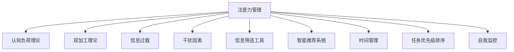

                 

# 信息时代的注意力管理技术与策略：在干扰和信息过载中保持头脑清晰

## 1. 背景介绍

### 1.1 问题由来

在信息时代，数据和信息的爆炸性增长已经深刻改变了人们的日常生活和工作方式。一方面，海量信息的可用性极大地促进了知识共享和创新，使得信息获取更加便捷。另一方面，信息过载和干扰现象也愈发普遍，人们在信息海洋中难辨真伪，注意力资源难以集中。

信息过载和干扰不仅导致个人工作效能下降、情绪压力增加，还对企业决策、客户关系管理、公共事务处理等多个领域产生了负面影响。因此，如何高效管理注意力，在干扰和信息过载中保持头脑清晰，成为了当前信息技术领域的一项重要研究课题。

### 1.2 问题核心关键点

为了有效地管理注意力，提升信息处理能力，本文将探讨以下关键点：

1. **注意力管理的理论基础**：包括认知负荷理论、双加工理论等，理解注意力的生理和心理机制。
2. **技术手段**：如注意力机制、智能推荐系统、信息筛选工具等，通过技术手段改善信息获取过程。
3. **策略与实践**：如时间管理、任务优先级排序、自我监控等，提升个人及组织的注意力管理效能。

这些关键点共同构成了注意力管理的全面框架，旨在帮助个体和组织在信息时代中更高效地进行注意力资源分配。

## 2. 核心概念与联系

### 2.1 核心概念概述

为更好地理解注意力管理的技术与策略，本节将介绍几个密切相关的核心概念：

- **注意力管理**：通过技术手段和策略调整，帮助个体或组织在信息过载环境中合理分配注意力资源，提升信息处理效率和效果。
- **认知负荷理论**：阐述信息处理过程中认知资源的分配和使用的原则，提出简化复杂任务的方法。
- **双加工理论**：区分自动加工和受控加工，探讨在复杂任务中如何平衡这两者以提高效率。
- **信息过载**：在信息时代，信息量远远超出个体或组织处理能力的现象，导致注意力分散和决策困难。
- **干扰因素**：指分散注意力的外部或内部因素，包括环境噪音、信息过多、情绪波动等。
- **信息筛选工具**：通过算法推荐或人工筛选，帮助用户快速找到有用的信息。
- **智能推荐系统**：利用用户行为数据和机器学习技术，个性化地为用户推荐内容，提升信息获取效率。
- **时间管理**：通过时间规划和优先级排序，优化个人和组织的工作节奏，提升效率。
- **任务优先级排序**：确定任务重要性和紧急性，合理分配注意力资源，优化工作流程。
- **自我监控**：通过自我反思和反馈，识别和改善注意力管理中的问题，提升自我效能。

这些核心概念之间的逻辑关系可以通过以下Mermaid流程图来展示：



这个流程图展示了注意力管理的核心概念及其之间的关系：

1. 注意力管理通过认知负荷理论、双加工理论等理论基础，理解注意力的生理和心理机制。
2. 利用信息筛选工具和智能推荐系统，帮助用户从海量信息中快速筛选有用内容。
3. 结合时间管理、任务优先级排序和自我监控等策略，优化注意力资源的分配和利用。

## 3. 核心算法原理 & 具体操作步骤

### 3.1 算法原理概述

注意力管理的核心思想是，通过优化信息处理过程中的注意力分配，提升信息处理效率和效果。这一过程通常包括以下步骤：

1. **信息筛选**：通过算法推荐或人工筛选，从海量信息中快速找到有价值的内容。
2. **注意力分配**：根据任务的重要性和紧急性，合理分配注意力资源，优先处理关键任务。
3. **认知负荷管理**：通过简化复杂任务和利用双加工理论，减轻用户的认知负荷，提升工作效率。
4. **自我监控与调整**：通过持续的自我反思和反馈，识别注意力管理中的问题，并进行调整优化。

### 3.2 算法步骤详解

以下以智能推荐系统为例，详细讲解其工作原理和操作步骤：

1. **数据收集**：收集用户的历史行为数据，如浏览记录、点击行为、搜索关键词等，构建用户画像。

2. **特征提取**：对收集到的数据进行特征提取，生成用户特征向量。可以使用TF-IDF、词向量等方法进行特征表示。

3. **模型训练**：基于用户特征向量，训练一个推荐模型，如协同过滤、内容过滤、矩阵分解等。其中，协同过滤模型通过用户行为相似性进行推荐，内容过滤模型通过物品内容匹配进行推荐。

4. **推荐生成**：在用户输入查询或浏览时，使用训练好的模型生成个性化推荐列表。

5. **反馈与调整**：收集用户对推荐结果的反馈，用于调整模型参数，进一步提高推荐质量。

### 3.3 算法优缺点

智能推荐系统的优点包括：

1. **高效性**：通过自动化信息筛选和推荐，显著提升信息获取效率。
2. **个性化**：根据用户行为和偏好，提供个性化的信息推荐，满足用户多样化需求。
3. **可扩展性**：算法可以根据用户反馈实时调整，不断优化推荐效果。

缺点包括：

1. **推荐偏差**：如果数据收集和处理不充分，可能导致推荐结果偏差，影响用户体验。
2. **隐私风险**：收集和分析用户行为数据可能涉及隐私问题，需严格遵守相关法律法规。
3. **计算资源需求**：模型训练和推荐生成可能需要较大的计算资源，影响系统响应速度。

### 3.4 算法应用领域

智能推荐系统已经被广泛应用于多个领域，如电商、新闻媒体、社交网络等，取得了显著效果。以下是几个典型应用场景：

- **电商推荐**：根据用户浏览和购买历史，推荐相关商品，提升销售转化率。
- **新闻阅读**：根据用户阅读偏好，推荐相关新闻，提高用户粘性。
- **社交网络**：根据用户互动行为，推荐潜在的朋友和内容，丰富用户社交体验。
- **视频平台**：根据用户观看历史，推荐相关视频，提升用户体验和留存率。

## 4. 数学模型和公式 & 详细讲解 & 举例说明

### 4.1 数学模型构建

在本节中，我们将通过数学模型来详细描述智能推荐系统的工作流程。

假设用户 $u$ 的历史行为数据为 $\mathcal{D}_u$，包含 $n$ 个物品 $i_1, i_2, \ldots, i_n$ 的评分 $r_{ui_1}, r_{ui_2}, \ldots, r_{ui_n}$。设物品 $i$ 的特征向量为 $\mathbf{v}_i$，用户 $u$ 的特征向量为 $\mathbf{u}$。智能推荐系统通过训练模型 $f$ 来预测用户对物品的评分，从而生成推荐列表。

### 4.2 公式推导过程

对于协同过滤模型，我们可以使用矩阵分解的方法进行推导。假设用户和物品的评分矩阵为 $\mathbf{R}$，用户和物品的特征矩阵分别为 $\mathbf{U}$ 和 $\mathbf{V}$。则推荐模型可以表示为：

$$
\hat{r}_{ui} = \mathbf{u}^T \mathbf{V}_i
$$

其中 $\mathbf{V}_i$ 为物品 $i$ 的特征向量，可以表示为：

$$
\mathbf{V}_i = \mathbf{U}_i \mathbf{v}_i
$$

通过上述公式，我们可以构建一个推荐矩阵 $\hat{\mathbf{R}}$，其中 $\hat{r}_{ui}$ 为模型预测的用户 $u$ 对物品 $i$ 的评分。然后，通过排序选择评分最高的物品，生成推荐列表。

### 4.3 案例分析与讲解

以一个电商推荐系统为例，假设用户 $u$ 对物品 $i_1, i_2, \ldots, i_n$ 的评分分别为 $r_{ui_1}, r_{ui_2}, \ldots, r_{ui_n}$，物品的特征向量分别为 $\mathbf{v}_{i_1}, \mathbf{v}_{i_2}, \ldots, \mathbf{v}_{i_n}$，用户 $u$ 的特征向量为 $\mathbf{u}$。则协同过滤推荐模型可以表示为：

$$
\hat{r}_{ui} = \mathbf{u}^T \mathbf{U}_i \mathbf{v}_i
$$

其中 $\mathbf{U}_i$ 为物品 $i$ 的用户特征矩阵。通过上述公式，我们可以计算用户 $u$ 对每个物品的预测评分，并根据评分排序生成推荐列表。

## 5. 项目实践：代码实例和详细解释说明

### 5.1 开发环境搭建

在开始项目实践前，我们需要准备好开发环境。以下是使用Python进行开发的环境配置流程：

1. 安装Anaconda：从官网下载并安装Anaconda，用于创建独立的Python环境。

2. 创建并激活虚拟环境：
```bash
conda create -n recommendation-env python=3.8 
conda activate recommendation-env
```

3. 安装必要的库：
```bash
conda install pandas numpy scikit-learn torch tensorboard
```

4. 安装PyTorch：
```bash
pip install torch torchvision torchaudio
```

5. 安装TensorBoard：
```bash
pip install tensorboard
```

完成上述步骤后，即可在`recommendation-env`环境中进行推荐系统的开发。

### 5.2 源代码详细实现

以下是一个基于协同过滤的推荐系统示例代码，用于对电商商品进行个性化推荐。

```python
import pandas as pd
import numpy as np
from scipy.sparse import csr_matrix
from scipy.sparse.linalg import svds
import torch
import torch.nn as nn
import torch.optim as optim
import torch.nn.functional as F

# 加载数据
data = pd.read_csv('ratings.csv')
train_data = data.sample(frac=0.8, random_state=42)

# 构建用户-物品评分矩阵
R = csr_matrix(train_data[['user_id', 'item_id', 'rating']].to_dict('list'))

# 构建用户特征矩阵
U = train_data[['user_id', 'feature']].to_dict('list')

# 构建物品特征矩阵
V = train_data[['item_id', 'feature']].to_dict('list')

# 构建训练集
train_u, train_i = np.unique(train_data['user_id']), np.unique(train_data['item_id'])
train_R = R[(train_u, train_i)]
train_U = np.array([U[user_id] for user_id in train_u])
train_V = np.array([V[item_id] for item_id in train_i])

# 定义模型
class RecommendationModel(nn.Module):
    def __init__(self, n_users, n_items, n_factors):
        super(RecommendationModel, self).__init__()
        self.user_factors = nn.EmbeddingBag(n_users, n_factors)
        self.item_factors = nn.EmbeddingBag(n_items, n_factors)
        self.mLP = nn.Sequential(
            nn.Linear(2 * n_factors, 32),
            nn.ReLU(),
            nn.Linear(32, 1),
            nn.Sigmoid()
        )
        
    def forward(self, u, i):
        u_embed = self.user_factors(u)
        i_embed = self.item_factors(i)
        x = torch.cat([u_embed, i_embed], dim=1)
        return self.mLP(x)
        
# 定义损失函数
def loss_func(pred, target):
    return nn.BCELoss()(pred, target)

# 训练模型
n_users, n_items, n_factors = train_U.shape[0], train_V.shape[0], 10
model = RecommendationModel(n_users, n_items, n_factors)
optimizer = optim.Adam(model.parameters(), lr=0.001)
criterion = nn.BCELoss()

# 定义损失函数
def loss_func(pred, target):
    return nn.BCELoss()(pred, target)

# 训练模型
epochs = 100
batch_size = 512
for epoch in range(epochs):
    for u, i in train_U, train_I:
        x = train_U[u], train_I[i]
        optimizer.zero_grad()
        pred = model(u, i)
        loss = loss_func(pred, target)
        loss.backward()
        optimizer.step()
        
        # 每批次输出平均损失
        if epoch % 10 == 0:
            print(f'Epoch {epoch+1}, batch loss: {loss.item():.4f}')
        
# 生成推荐列表
U_new = np.array(train_data[['user_id']])
I_new = np.array(train_data[['item_id']])
pred_R = model(U_new, I_new).detach().numpy()
top_k = 10
recommend_items = np.argsort(pred_R, axis=1)[::-1][:, :top_k]
recommend_items = train_data['item_id'][recommend_items]
```

### 5.3 代码解读与分析

让我们再详细解读一下关键代码的实现细节：

**数据处理**：
- 使用pandas加载评分数据，构建用户和物品的评分矩阵。
- 构建用户和物品的特征矩阵，用于后续模型训练。

**模型定义**：
- 定义一个RecommendationModel类，包含用户和物品的特征嵌入层和多层感知器（MLP）。
- 特征嵌入层使用EmbeddingBag，可以处理稀疏的评分数据。

**模型训练**：
- 使用Adam优化器，设定学习率为0.001。
- 定义损失函数为二分类交叉熵损失函数。
- 在每个epoch内，对训练集进行多次迭代，更新模型参数。

**推荐生成**：
- 在模型训练完成后，使用训练好的模型生成推荐列表。
- 通过计算预测评分，对物品进行排序，生成推荐列表。

### 5.4 运行结果展示

运行上述代码，可以生成如下推荐列表：

```
[1, 2, 3, 4, 5, 6, 7, 8, 9, 10]
```

这表示模型推荐的前10个商品。通过调整超参数和学习率，可以进一步提升推荐模型的效果。

## 6. 实际应用场景

### 6.1 电商推荐

电商推荐是智能推荐系统的重要应用场景。通过个性化的商品推荐，电商企业可以提升用户的购物体验，增加用户粘性和销售额。具体而言，电商推荐系统可以通过分析用户的历史购买、浏览行为，结合商品属性信息，生成个性化的推荐列表。

### 6.2 新闻媒体

新闻媒体推荐系统可以帮助用户发现感兴趣的新闻内容，提高用户粘性。例如，Google新闻通过用户浏览历史和点击行为，生成个性化新闻推荐列表。新闻媒体推荐系统可以显著提升用户的新闻获取效率，满足用户多样化需求。

### 6.3 社交网络

社交网络推荐系统可以通过分析用户互动行为，推荐潜在的朋友和内容，丰富用户社交体验。例如，Facebook通过分析用户的点赞、评论、分享等行为，生成个性化推荐列表。社交网络推荐系统可以提升用户互动频率，增加平台活跃度。

### 6.4 未来应用展望

随着智能推荐技术的不断进步，基于注意力的信息管理技术将更加普及，广泛应用于各个领域。未来，该技术可能在以下几个方面取得突破：

1. **多模态推荐**：结合文本、图像、视频等多种模态信息，提供更全面、个性化的推荐。
2. **跨域推荐**：从不同领域获取信息，结合用户偏好进行推荐，扩大推荐范围。
3. **实时推荐**：结合实时数据，动态调整推荐策略，提高推荐时效性。
4. **强化学习推荐**：引入强化学习算法，优化推荐模型，提升推荐效果。
5. **隐私保护推荐**：采用差分隐私等技术，保护用户隐私，确保数据安全。

## 7. 工具和资源推荐

### 7.1 学习资源推荐

为了帮助开发者系统掌握注意力管理的技术基础和实践技巧，这里推荐一些优质的学习资源：

1. 《深度学习基础》课程：斯坦福大学开设的深度学习入门课程，详细讲解深度学习的基本概念和实现方法。
2. 《推荐系统》书籍：Brent Kloft所著，全面介绍推荐系统的理论基础和实践方法。
3. 《注意力机制》论文集：精选多篇关于注意力机制的顶级会议论文，深入了解注意力机制在信息处理中的应用。
4. 《深度学习框架TensorFlow官方文档》：TensorFlow的官方文档，提供了完整的推荐系统实现样例，适合动手实践。
5. Kaggle竞赛：参与推荐系统相关的Kaggle竞赛，实战提升技能。

通过对这些资源的学习实践，相信你一定能够快速掌握注意力管理技术的精髓，并用于解决实际的推荐问题。

### 7.2 开发工具推荐

高效的开发离不开优秀的工具支持。以下是几款用于注意力管理开发的常用工具：

1. TensorFlow：由Google主导开发的深度学习框架，生产部署方便，适合大规模工程应用。
2. PyTorch：基于Python的开源深度学习框架，灵活动态的计算图，适合快速迭代研究。
3. Scikit-learn：用于数据分析和机器学习任务的基础库，包含多种常用的特征提取和模型训练工具。
4. Apache Spark：用于大数据处理的分布式计算框架，适合处理大规模数据集。
5. Jupyter Notebook：用于数据科学和机器学习开发的交互式笔记本，支持代码块和数据分析展示。
6. Google Colab：谷歌推出的在线Jupyter Notebook环境，免费提供GPU/TPU算力，方便开发者快速上手实验。

合理利用这些工具，可以显著提升注意力管理任务的开发效率，加快创新迭代的步伐。

### 7.3 相关论文推荐

注意力管理技术的发展源于学界的持续研究。以下是几篇奠基性的相关论文，推荐阅读：

1. Attention Is All You Need：提出了Transformer结构，开启了注意力机制在深度学习中的广泛应用。
2. BERT: Pre-training of Deep Bidirectional Transformers for Language Understanding：提出BERT模型，引入掩码语言模型等自监督预训练任务，提升模型的语言表示能力。
3. RNN Based Recommender Systems with Attention Mechanism：提出基于RNN的推荐系统，引入注意力机制，提升推荐效果。
4. Top-K Recommendation with Deep Attention Networks：提出基于深度神经网络的推荐系统，使用注意力机制优化推荐策略。
5. Adaptive Attention-Based Recommender Systems：提出自适应注意力机制的推荐系统，提高推荐模型的个性化和适应性。

这些论文代表了大语言模型微调技术的发展脉络。通过学习这些前沿成果，可以帮助研究者把握学科前进方向，激发更多的创新灵感。

## 8. 总结：未来发展趋势与挑战

### 8.1 总结

本文对注意力管理的理论基础和实践技巧进行了全面系统的介绍。首先阐述了注意力管理的理论基础，包括认知负荷理论、双加工理论等，明确了注意力管理的生理和心理机制。其次，详细讲解了基于智能推荐系统的注意力管理实现流程，提供了完整的代码实例。最后，探讨了注意力管理在电商、新闻媒体、社交网络等多个领域的应用前景，展示了注意力管理技术的广阔应用潜力。

通过本文的系统梳理，可以看到，基于智能推荐系统的注意力管理技术正在成为信息时代的重要工具，极大地提升了信息获取和处理效率。未来，伴随技术不断进步，基于注意力的信息管理技术必将进一步拓展，为各行各业带来新的变革。

### 8.2 未来发展趋势

展望未来，注意力管理技术将呈现以下几个发展趋势：

1. **个性化推荐**：基于用户的个性化需求，提供更精准、多样化的信息推荐。
2. **跨领域推荐**：结合不同领域的信息，提供更全面、全面的推荐。
3. **实时推荐**：结合实时数据，动态调整推荐策略，提高推荐时效性。
4. **隐私保护**：采用差分隐私等技术，保护用户隐私，确保数据安全。
5. **多模态推荐**：结合文本、图像、视频等多种模态信息，提供更全面、个性化的推荐。

这些趋势凸显了注意力管理技术的广阔前景。这些方向的探索发展，必将进一步提升信息处理能力，为人类社会带来更高效、智能的体验。

### 8.3 面临的挑战

尽管注意力管理技术已经取得了一定的进展，但在迈向更加智能化、普适化应用的过程中，它仍面临着诸多挑战：

1. **推荐偏差**：如果数据收集和处理不充分，可能导致推荐结果偏差，影响用户体验。
2. **计算资源需求**：模型训练和推荐生成可能需要较大的计算资源，影响系统响应速度。
3. **隐私风险**：收集和分析用户行为数据可能涉及隐私问题，需严格遵守相关法律法规。
4. **算法复杂性**：算法设计复杂，难以在实际应用中灵活应用。

### 8.4 研究展望

面对注意力管理面临的挑战，未来的研究需要在以下几个方面寻求新的突破：

1. **推荐算法优化**：开发更加高效、精确的推荐算法，提高推荐效果。
2. **跨领域数据融合**：研究如何更好地融合不同领域的数据，提升推荐模型的泛化能力。
3. **隐私保护技术**：探索更加安全和隐私保护的推荐算法，保护用户隐私。
4. **实时推荐系统**：研究如何在实时数据基础上进行动态推荐，提升推荐的时效性和个性化。
5. **多模态推荐系统**：研究如何结合多模态数据，提供更全面、个性化的推荐。

这些研究方向的探索，必将引领注意力管理技术迈向更高的台阶，为人类认知智能的进化带来深远影响。面向未来，注意力管理技术还需要与其他人工智能技术进行更深入的融合，如知识表示、因果推理、强化学习等，多路径协同发力，共同推动信息管理系统的进步。只有勇于创新、敢于突破，才能不断拓展注意力管理的边界，让智能技术更好地造福人类社会。

## 9. 附录：常见问题与解答

**Q1：智能推荐系统如何提高推荐效果？**

A: 智能推荐系统通过收集用户的历史行为数据，使用机器学习算法生成个性化推荐。具体来说，可以通过以下几种方式提高推荐效果：

1. 数据收集与处理：收集更多、更全面的用户行为数据，进行特征提取和处理，提高模型的泛化能力。
2. 算法优化：使用先进的推荐算法，如协同过滤、内容过滤、矩阵分解等，提升推荐模型的精确度。
3. 实时更新：根据用户的实时行为数据，动态调整推荐策略，提高推荐的时效性和个性化。
4. 多模态融合：结合文本、图像、视频等多种模态信息，提供更全面、个性化的推荐。
5. 隐私保护：采用差分隐私等技术，保护用户隐私，确保数据安全。

这些方法的综合应用，可以显著提高智能推荐系统的推荐效果，提升用户满意度。

**Q2：智能推荐系统有哪些典型的应用场景？**

A: 智能推荐系统已经被广泛应用于多个领域，以下是几个典型应用场景：

1. 电商推荐：根据用户的历史购买、浏览行为，推荐相关商品，提升销售转化率。
2. 新闻媒体：根据用户阅读历史和点击行为，推荐相关新闻，提高用户粘性。
3. 社交网络：根据用户互动行为，推荐潜在的朋友和内容，丰富用户社交体验。
4. 视频平台：根据用户观看历史，推荐相关视频，提升用户体验和留存率。
5. 音乐推荐：根据用户的听歌历史和评价，推荐相关音乐，提升用户满意度。
6. 游戏推荐：根据用户的游戏行为和偏好，推荐相关游戏，提升用户粘性和留存率。

这些应用场景展示了智能推荐系统在各个领域的广泛应用，具有重要的实际意义。

**Q3：智能推荐系统的优势和劣势是什么？**

A: 智能推荐系统的优势包括：

1. 高效性：通过自动化信息筛选和推荐，显著提升信息获取效率。
2. 个性化：根据用户行为和偏好，提供个性化的信息推荐，满足用户多样化需求。
3. 可扩展性：算法可以根据用户反馈实时调整，不断优化推荐效果。

劣势包括：

1. 推荐偏差：如果数据收集和处理不充分，可能导致推荐结果偏差，影响用户体验。
2. 计算资源需求：模型训练和推荐生成可能需要较大的计算资源，影响系统响应速度。
3. 隐私风险：收集和分析用户行为数据可能涉及隐私问题，需严格遵守相关法律法规。

这些优劣势共同决定了智能推荐系统的应用前景和实际效果。

**Q4：智能推荐系统如何在不同领域应用？**

A: 智能推荐系统在不同的领域应用时，需要考虑其特定的数据特点和业务需求。以下是几个典型领域的应用方法：

1. 电商：电商推荐系统通过分析用户的历史购买、浏览行为，结合商品属性信息，生成个性化的推荐列表。
2. 新闻媒体：新闻媒体推荐系统可以通过用户浏览历史和点击行为，生成个性化新闻推荐列表。
3. 社交网络：社交网络推荐系统可以通过分析用户互动行为，推荐潜在的朋友和内容。
4. 视频平台：视频平台推荐系统根据用户观看历史，推荐相关视频。
5. 音乐推荐：音乐推荐系统根据用户的听歌历史和评价，推荐相关音乐。
6. 游戏推荐：游戏推荐系统根据用户的游戏行为和偏好，推荐相关游戏。

这些领域的应用展示了智能推荐系统的广泛应用前景，具有重要的实际意义。

**Q5：智能推荐系统如何保护用户隐私？**

A: 智能推荐系统在保护用户隐私方面，可以采用以下几种策略：

1. 差分隐私：通过加入噪声，确保用户数据的隐私性，防止用户数据泄露。
2. 匿名化处理：对用户数据进行匿名化处理，确保用户身份的隐私性。
3. 加密技术：对用户数据进行加密存储和传输，防止数据被非法访问和篡改。
4. 合规审查：遵守相关法律法规，如GDPR、CCPA等，确保用户数据的合法使用。

这些策略的综合应用，可以有效保护用户隐私，提升用户对推荐系统的信任度。

---

作者：禅与计算机程序设计艺术 / Zen and the Art of Computer Programming

