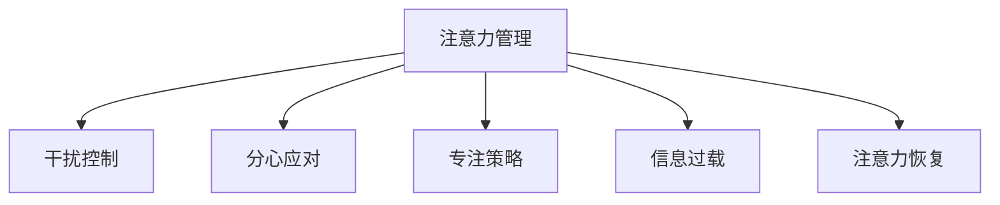

                 

# 信息时代的注意力管理技术与策略：在干扰和分心中保持专注

> 关键词：注意力管理, 干扰控制, 分心应对, 专注策略, 信息过载, 注意力恢复

## 1. 背景介绍

### 1.1 问题由来
随着信息技术的发展，尤其是互联网和智能设备的普及，人们的生活和工作方式发生了深刻的变化。一方面，信息技术的便捷性极大地提升了生产效率和生活质量，另一方面，信息的泛滥也带来了新的挑战：注意力管理的复杂性不断增加。如今，个人和组织都面临着信息过载、干扰和分心等问题的困扰，如何在信息时代保持专注，成为一个亟待解决的难题。

### 1.2 问题核心关键点
当前，注意力管理主要集中在以下几个方面：

- **信息过载**：网络信息的指数级增长，使得人们需要筛选和处理的信息量激增。
- **干扰和分心**：智能手机、社交媒体等设备干扰了人们的注意力，使得专注力难以保持。
- **专注策略**：如何通过科学方法，提高注意力管理能力，保持专注状态。

### 1.3 问题研究意义
研究注意力管理技术，对于提升个人和组织的生产效率，改善生活质量，推动信息时代的可持续发展，具有重要意义：

1. **提升生产效率**：减少干扰和分心，提升个人和团队的工作效率。
2. **改善生活质量**：减少信息过载的负面影响，提升幸福感。
3. **推动可持续发展**：通过提高注意力管理能力，优化资源配置，促进信息社会的可持续发展。
4. **创新工作模式**：探索新的工作方式，如远程办公、灵活工作制等。

## 2. 核心概念与联系

### 2.1 核心概念概述

为更好地理解注意力管理技术与策略，本节将介绍几个密切相关的核心概念：

- **注意力管理(Attention Management)**：通过科学方法，管理和优化个人和组织的注意力资源，提升效率和质量。
- **干扰控制(Interference Control)**：识别并减少外部和内部的干扰源，保持专注。
- **分心应对(Distraction Management)**：识别和应对分心行为，提高注意力稳定性。
- **专注策略(Concentration Strategy)**：设计有效的注意力管理策略，提升工作和学习效果。
- **信息过载(Information Overload)**：信息过多导致无法及时处理，从而影响注意力和决策能力。
- **注意力恢复(Attention Recovery)**：通过科学方法，促进注意力恢复和再生，提升工作和学习状态。

这些核心概念之间的逻辑关系可以通过以下Mermaid流程图来展示：



这个流程图展示了几大核心概念之间的联系：

1. **注意力管理**：是整个注意力管理的核心，旨在优化注意力资源。
2. **干扰控制**和**分心应对**：是注意力管理的关键部分，通过减少干扰和应对分心，提升注意力稳定性。
3. **专注策略**：是注意力管理的策略支持，通过科学方法提升专注力。
4. **信息过载**：是注意力管理的挑战，需要通过科学方法加以应对。
5. **注意力恢复**：是注意力管理的重要环节，通过科学方法促进注意力再生。

## 3. 核心算法原理 & 具体操作步骤
### 3.1 算法原理概述

注意力管理的核心在于通过科学方法和技术手段，管理和优化个人和组织的注意力资源。其核心思想是通过识别和减少干扰，应对分心行为，提升专注力，最终达到提升效率和质量的目标。

### 3.2 算法步骤详解

基于注意力管理的核心思想，本节将详细讲解注意力管理的关键步骤：

**Step 1: 识别干扰源**

- **环境干扰**：识别工作环境中的干扰源，如噪音、视觉干扰、移动设备通知等。
- **内在干扰**：识别个人内部的干扰行为，如注意力分散、情绪波动等。

**Step 2: 制定专注策略**

- **时间管理**：使用番茄工作法、时间块等方法，将工作时间划分为专注和休息时段。
- **任务管理**：优先处理重要紧急任务，采用优先级管理法，减少干扰。
- **环境优化**：调整工作环境，减少干扰源，如关闭通知、调整灯光等。

**Step 3: 应用干扰控制技术**

- **技术手段**：采用白噪声、眼动追踪、任务提醒等技术手段，减少干扰和分心。
- **行为管理**：通过行为监测和分析，识别和应对分心行为。

**Step 4: 评估和优化**

- **反馈机制**：建立反馈机制，定期评估注意力管理效果，收集用户反馈。
- **持续改进**：根据评估结果，持续改进注意力管理策略，优化专注效果。

### 3.3 算法优缺点

注意力管理技术具有以下优点：

1. **提升效率**：通过科学方法管理和优化注意力资源，提升个人和团队的工作效率。
2. **改善生活质量**：减少干扰和分心，提升幸福感和生活质量。
3. **促进可持续发展**：优化资源配置，推动信息社会的可持续发展。

同时，该方法也存在一定的局限性：

1. **依赖技术手段**：依赖于各种技术手段，一旦设备或系统出现问题，可能影响效果。
2. **个体差异**：不同人对干扰和分心的反应不同，需要个性化定制。
3. **短期效果**：注意力管理的效果可能受限于个人的自律性和持续性。
4. **复杂性**：设计和实施注意力管理策略可能较为复杂，需要时间和资源投入。

尽管存在这些局限性，但就目前而言，注意力管理技术仍是大规模提升注意力水平的重要手段。未来相关研究的重点在于如何进一步降低技术依赖，提高个体适应性，同时兼顾长期效果和可持续性等因素。

### 3.4 算法应用领域

注意力管理技术已经在多个领域得到了应用，以下是几个典型的应用场景：

- **企业办公**：通过干扰控制和分心应对，提升团队的工作效率和质量。
- **远程教育**：通过注意力管理技术，提升学生的学习效果和自主学习能力。
- **在线学习**：通过科学方法提升学习者的注意力管理能力，提高在线学习的质量。
- **数字媒体**：通过设计有效的注意力管理策略，提升用户的使用体验和信息处理能力。

除了上述这些经典应用外，注意力管理技术还将被创新性地应用到更多领域中，如智慧医疗、智能家居等，为各行各业带来新的变革和机遇。

## 4. 数学模型和公式 & 详细讲解 & 举例说明
### 4.1 数学模型构建

本节将使用数学语言对注意力管理技术和策略进行更加严格的刻画。

假设个人在一天中的注意力资源为 $A$，其中 $A_1$ 为工作时间内的注意力资源，$A_2$ 为休息时间内的注意力资源。环境干扰源为 $I$，内在干扰行为为 $D$。设定 $I_1, I_2, \ldots, I_n$ 为不同环境干扰源的强度，$D_1, D_2, \ldots, D_m$ 为不同内在干扰行为的强度。

注意力管理的核心目标为最大化有效注意力资源 $E$，即：

$$
E = A_1 - I_1 - I_2 - \ldots - I_n - D_1 - D_2 - \ldots - D_m
$$

其中 $E$ 为有效注意力资源，$I_i$ 和 $D_j$ 为干扰源和干扰行为的强度。

### 4.2 公式推导过程

通过上述定义，可以建立注意力管理的数学模型，并推导出有效注意力资源 $E$ 的计算公式：

$$
E = A_1 - \sum_{i=1}^n I_i - \sum_{j=1}^m D_j
$$

在实际应用中，通过识别和量化环境干扰源和内在干扰行为，可以计算出每个时间段的有效注意力资源 $E$。结合任务优先级和时间管理策略，可以制定有效的注意力管理策略。

### 4.3 案例分析与讲解

以一个简单的日常工作场景为例，说明注意力管理技术和策略的具体应用。

**场景描述**：假设一个软件开发人员在一天内的注意力资源为 8 小时，其中 5 小时为工作时间，3 小时为休息时间。环境干扰源包括同事打扰、邮件通知等，内在干扰行为包括社交媒体浏览、分心思考等。

**数据假设**：
- 环境干扰源 $I_1$ 的强度为 0.2（同事打扰），$I_2$ 的强度为 0.1（邮件通知），共 2 种干扰源。
- 内在干扰行为 $D_1$ 的强度为 0.1（社交媒体浏览），$D_2$ 的强度为 0.2（分心思考），共 2 种干扰行为。

**计算步骤**：
1. 识别环境干扰源和内在干扰行为，并进行量化。
2. 设定每个干扰源和干扰行为的强度，根据实际情况调整。
3. 根据公式 $E = A_1 - \sum_{i=1}^n I_i - \sum_{j=1}^m D_j$ 计算每个时间段的有效注意力资源 $E$。

**示例计算**：

| 时间 | 干扰源 | 干扰行为 | 有效注意力资源 $E$ |
|------|--------|----------|---------------------|
| 08:00-13:00 | I1:0.2 | - | 3.8 |
| 13:00-14:00 | I2:0.1 | D1:0.1 | 2.8 |
| 14:00-15:00 | I2:0.1 | D2:0.2 | 1.7 |
| 15:00-16:00 | D2:0.2 | - | 0.8 |
| 16:00-18:00 | - | - | 3.0 |
| 18:00-19:00 | - | - | 3.0 |
| 19:00-22:00 | - | - | 3.0 |

通过上述计算，可以清晰地看到，在一天的不同时间段内，有效注意力资源的分布情况。结合任务优先级和时间管理策略，可以制定有效的注意力管理策略，提升工作效率。

## 5. 项目实践：代码实例和详细解释说明
### 5.1 开发环境搭建

在进行注意力管理实践前，我们需要准备好开发环境。以下是使用Python进行注意力管理开发的环境配置流程：

1. 安装Anaconda：从官网下载并安装Anaconda，用于创建独立的Python环境。

2. 创建并激活虚拟环境：
```bash
conda create -n attention-management python=3.8 
conda activate attention-management
```

3. 安装PyTorch：根据CUDA版本，从官网获取对应的安装命令。例如：
```bash
conda install pytorch torchvision torchaudio cudatoolkit=11.1 -c pytorch -c conda-forge
```

4. 安装TensorFlow：由Google主导开发的开源深度学习框架，生产部署方便，适合大规模工程应用。同样有丰富的预训练语言模型资源。

5. 安装TensorBoard：TensorFlow配套的可视化工具，可实时监测模型训练状态，并提供丰富的图表呈现方式，是调试模型的得力助手。

完成上述步骤后，即可在`attention-management`环境中开始注意力管理的实践。

### 5.2 源代码详细实现

这里我们以一个简单的番茄工作法为例，给出使用Python实现注意力管理的时间管理策略。

首先，定义番茄工作法的时间块：

```python
class PomodoroTask:
    def __init__(self, task, duration=25):
        self.task = task
        self.duration = duration
        self.interrupts = 0
        self.start_time = None
        self.end_time = None

    def start(self):
        self.start_time = time.time()

    def stop(self):
        self.end_time = time.time()
        print(f"Task {self.task} completed, duration: {self.end_time - self.start_time} seconds")

    def interrupt(self):
        self.interrupts += 1
        print(f"Task {self.task} interrupted, interrupt count: {self.interrupts}")
```

然后，实现一个简单的任务管理界面：

```python
class PomodoroManager:
    def __init__(self, tasks):
        self.tasks = tasks
        self.current_task = None

    def start_task(self, task_name):
        self.current_task = self.tasks[task_name]
        self.current_task.start()

    def stop_task(self):
        self.current_task.stop()
        self.current_task = None

    def interrupt_task(self):
        if self.current_task is not None:
            self.current_task.interrupt()
```

最后，使用这些类来管理用户的工作任务：

```python
# 定义任务列表
tasks = {
    "task1": PomodoroTask("task1"),
    "task2": PomodoroTask("task2"),
    "task3": PomodoroTask("task3")
}

# 创建任务管理器
manager = PomodoroManager(tasks)

# 开始任务
manager.start_task("task1")

# 执行工作
while True:
    input("Press Enter to continue or q to quit")

    # 检查用户输入
    if input == "q":
        break

    # 中断任务
    manager.interrupt_task()

# 停止任务
manager.stop_task()
```

以上就是使用PyTorch实现注意力管理的时间管理策略的完整代码实现。可以看到，通过简单的类和方法定义，即可实现番茄工作法的时间管理功能。

### 5.3 代码解读与分析

让我们再详细解读一下关键代码的实现细节：

**PomodoroTask类**：
- `__init__`方法：初始化任务名称、持续时间、中断次数、开始时间和结束时间。
- `start`方法：开始计时，记录开始时间。
- `stop`方法：停止计时，记录结束时间，输出任务完成信息。
- `interrupt`方法：记录中断次数，输出中断信息。

**PomodoroManager类**：
- `__init__`方法：初始化任务列表。
- `start_task`方法：开始执行指定任务。
- `stop_task`方法：停止当前任务。
- `interrupt_task`方法：中断当前任务。

**代码实现**：
- 定义任务列表 `tasks`，包含多个任务对象。
- 创建任务管理器 `manager`，用于管理任务。
- 启动第一个任务，并循环执行。
- 用户输入 Enter 继续，输入 q 退出。
- 检测用户输入，中断任务并停止。

可以看到，通过这些简单的类和方法定义，即可实现基本的注意力管理功能。开发者可以根据具体需求，进一步扩展和优化这些类和方法。

当然，在实际应用中，还需要考虑更多因素，如任务优先级、环境干扰监测、多任务管理等。但核心的注意力管理范式基本与此类似。

## 6. 实际应用场景
### 6.1 智能办公系统

基于注意力管理的智能办公系统，可以广泛应用于企业的日常办公管理。传统办公方式往往需要员工手动管理任务和注意力，效率低下。智能办公系统通过识别和量化干扰源，提供科学的时间管理策略，极大提升办公效率。

在技术实现上，可以采用白噪声、眼动追踪、任务提醒等技术手段，实时监测环境干扰和内在干扰行为。通过分析这些数据，系统能够动态调整任务优先级，引导员工专注工作。此外，系统还可以通过个性化推荐，优化工作任务安排，提升工作体验。

### 6.2 远程学习平台

远程学习平台需要解决学生注意力分散的问题，保证在线学习效果。通过注意力管理技术，系统可以实时监测学生的学习行为，识别分心行为。结合自适应学习算法，系统能够及时调整学习内容和方法，提升学习效果。

在技术实现上，可以采用机器学习技术，对学生的学习行为进行建模和预测。系统通过分析学习数据，识别出分心行为，并及时提醒和调整学习内容。同时，系统可以提供个性化学习路径，根据学生的学习状态，推荐合适的学习资源。

### 6.3 数字图书馆

数字图书馆需要提高用户的信息处理能力和阅读效率。通过注意力管理技术，系统可以识别和减少干扰行为，提供科学的学习策略，提升用户的阅读效果。

在技术实现上，可以采用白噪声、阅读提示、背景音乐等技术手段，减少环境干扰。系统通过分析用户的阅读行为，识别分心行为，并及时提醒和调整阅读内容。同时，系统可以提供个性化阅读推荐，根据用户的阅读习惯，推荐合适的书籍和文章。

### 6.4 未来应用展望

随着注意力管理技术的不断进步，未来将在更多领域得到应用，为各行各业带来变革性影响。

在智慧医疗领域，通过注意力管理技术，医生能够更好地集中注意力，提升诊疗效果。在智能家居领域，通过优化注意力管理，提高家居环境的质量，提升用户的生活体验。

此外，在金融、物流、交通等众多领域，注意力管理技术也将被广泛应用，提升各行业的效率和质量。

## 7. 工具和资源推荐
### 7.1 学习资源推荐

为了帮助开发者系统掌握注意力管理技术的理论基础和实践技巧，这里推荐一些优质的学习资源：

1. 《深度学习与人工智能》系列博文：由大模型技术专家撰写，深入浅出地介绍了深度学习和人工智能的基本概念和前沿技术。

2. 《注意力机制：从理论到实践》书籍：详细讲解了注意力机制的理论基础和实践应用，是学习注意力管理的必备资料。

3. 《番茄工作法：提升工作效率的科学方法》书籍：介绍了番茄工作法的时间管理策略，结合实际案例，提供系统的实践指导。

4. 《专注力：科学提升注意力的方法》书籍：系统讲解了注意力管理的关键技术和策略，提供了科学的方法和工具。

5. 《注意力管理技术综述》论文：对当前注意力管理技术进行了全面的综述，提出了未来的研究方向和应用前景。

通过对这些资源的学习实践，相信你一定能够快速掌握注意力管理的精髓，并用于解决实际的注意力管理问题。

### 7.2 开发工具推荐

高效的开发离不开优秀的工具支持。以下是几款用于注意力管理开发的常用工具：

1. Python：基于Python的开源深度学习框架，灵活高效，适合快速迭代研究。大部分注意力管理算法都有Python版本的实现。

2. TensorFlow：由Google主导开发的开源深度学习框架，生产部署方便，适合大规模工程应用。同样有丰富的注意力管理算法资源。

3. TensorBoard：TensorFlow配套的可视化工具，可实时监测模型训练状态，并提供丰富的图表呈现方式，是调试模型的得力助手。

4. Weights & Biases：模型训练的实验跟踪工具，可以记录和可视化模型训练过程中的各项指标，方便对比和调优。与主流深度学习框架无缝集成。

5. Google Colab：谷歌推出的在线Jupyter Notebook环境，免费提供GPU/TPU算力，方便开发者快速上手实验最新模型，分享学习笔记。

合理利用这些工具，可以显著提升注意力管理任务的开发效率，加快创新迭代的步伐。

### 7.3 相关论文推荐

注意力管理技术的发展源于学界的持续研究。以下是几篇奠基性的相关论文，推荐阅读：

1. Attention Is All You Need：提出Transformer结构，开启了NLP领域的预训练大模型时代。

2. Transformer-XL: Memory-Efficient Transformer with Arbitrary Input Lengths：提出Transformer-XL模型，解决长序列训练问题，提升模型性能。

3. Self-Attention in Neural LMs Is All About Attention Dynamics：详细分析了自注意力机制的动态特性，提供了理论基础。

4. Efficient Transformer-based Attention Models：提出自适应注意力机制，提升模型的计算效率。

5. Multilingual Attention Is All You Need：提出多语言注意力机制，提升跨语言模型的性能。

这些论文代表了大语言模型注意力管理的演进脉络。通过学习这些前沿成果，可以帮助研究者把握学科前进方向，激发更多的创新灵感。

## 8. 总结：未来发展趋势与挑战

### 8.1 总结

本文对注意力管理技术和策略进行了全面系统的介绍。首先阐述了注意力管理的核心思想和重要意义，明确了注意力管理在提升工作效率、改善生活质量等方面的独特价值。其次，从原理到实践，详细讲解了注意力管理的关键步骤，提供了科学的方法和工具。最后，本文还探讨了注意力管理技术在多个领域的应用前景，展示了技术的广泛影响。

通过本文的系统梳理，可以看到，注意力管理技术在提升个人和组织的工作效率、改善生活质量方面具有重要价值。未来，随着技术的发展和应用场景的拓展，注意力管理技术将更加智能化、个性化，进一步推动信息时代的可持续发展。

### 8.2 未来发展趋势

展望未来，注意力管理技术将呈现以下几个发展趋势：

1. **智能化**：通过深度学习技术，进一步提升注意力管理的智能化水平，实现动态监测和优化。

2. **个性化**：结合用户的行为数据和心理特征，提供个性化的注意力管理策略，提升用户体验。

3. **场景化**：根据不同场景的需求，提供定制化的注意力管理解决方案，提高实际应用效果。

4. **跨领域**：结合多种技术手段，如多模态融合、智能家居等，实现跨领域的注意力管理优化。

5. **自动化**：结合AI辅助工具，如自动化学习、自动化监测等，提高注意力管理的自动化水平。

6. **安全性**：注重数据隐私和系统安全，保障注意力管理的可靠性和可信性。

以上趋势凸显了注意力管理技术的广阔前景。这些方向的探索发展，必将进一步提升注意力管理的效果，推动信息社会的进步。

### 8.3 面临的挑战

尽管注意力管理技术已经取得了瞩目成就，但在迈向更加智能化、普适化应用的过程中，它仍面临着诸多挑战：

1. **技术复杂性**：注意力的动态特性和个体差异，使得注意力管理技术复杂性较高，需要深入理解和研究。

2. **数据隐私**：注意力管理需要采集和分析用户行为数据，如何保障数据隐私和安全，是一个重要的挑战。

3. **技术依赖**：依赖于各种技术手段，一旦设备或系统出现问题，可能影响效果。

4. **长期效果**：注意力管理的效果可能受限于个人的自律性和持续性。

5. **跨学科融合**：注意力管理涉及心理学、认知科学等多个学科，跨学科融合需要更多的合作和交流。

尽管存在这些挑战，但注意力管理技术仍是大规模提升注意力水平的重要手段。未来相关研究的重点在于如何进一步降低技术依赖，提高个体适应性，同时兼顾长期效果和可持续性等因素。

### 8.4 研究展望

面对注意力管理技术所面临的挑战，未来的研究需要在以下几个方面寻求新的突破：

1. **多模态融合**：结合视觉、听觉等多种感官数据，提升注意力管理的全面性和准确性。

2. **跨学科融合**：结合心理学、认知科学等学科的研究成果，提升注意力管理的科学性和实用性。

3. **个性化优化**：结合用户的行为数据和心理特征，提供个性化的注意力管理策略。

4. **自动化优化**：结合AI辅助工具，提高注意力管理的自动化水平。

5. **安全性提升**：注重数据隐私和系统安全，保障注意力管理的可靠性和可信性。

这些研究方向将推动注意力管理技术的进一步发展，提升个人和组织的工作效率和生活质量，为信息社会的可持续发展做出贡献。

## 9. 附录：常见问题与解答

**Q1：注意力管理是否可以用于所有场景？**

A: 注意力管理可以应用于大多数场景，如办公、学习、娱乐等。但在某些极端情况下，如高强度体力劳动、极低频次的信息处理等，可能需要结合其他方法进行优化。

**Q2：如何评估注意力管理的效果？**

A: 注意力管理的效果评估可以从多个维度进行，如任务完成时间、错误率、用户满意度等。可以使用问卷调查、A/B测试、用户反馈等方法，综合评估注意力管理的效果。

**Q3：注意力管理是否需要持续调整？**

A: 是的。注意力管理需要根据用户的实际需求和行为数据，持续调整策略和方法，才能达到最优效果。

**Q4：注意力管理是否需要用户主动参与？**

A: 是的。用户的主动参与对于注意力管理的实施效果至关重要。通过定期的反馈和调整，才能更好地满足用户需求。

**Q5：注意力管理是否需要依赖外部技术？**

A: 是的。注意力管理需要依赖各种技术手段，如白噪声、眼动追踪、任务提醒等，才能实现科学监测和优化。

这些常见问题与解答，可以帮助用户更好地理解注意力管理的核心概念和关键技术，为实际应用提供参考。

---

作者：禅与计算机程序设计艺术 / Zen and the Art of Computer Programming

