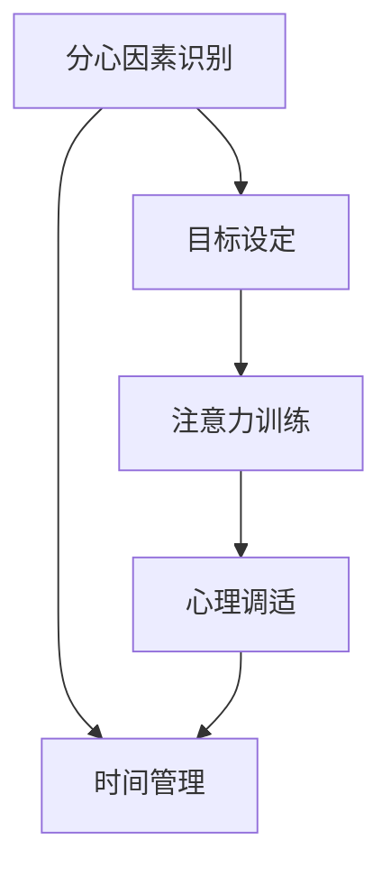

                 

# 信息时代的注意力管理策略：在充满干扰的世界中保持头脑清晰和专注

## 1. 背景介绍

在信息爆炸的今天，每天有海量的信息从各种渠道涌来，对人们的注意力构成了巨大的挑战。如何在信息洪流中保持专注，不被干扰，成为每个人都需要面对的问题。注意力管理策略在这一背景下应运而生，通过科学的方法和工具，帮助人们在信息时代保持头脑清晰和专注。

### 1.1 问题由来

随着互联网和移动设备的普及，人们获取信息的渠道越来越多，但信息的质量却参差不齐。例如，社交媒体上的即时更新、新闻网站的突发报道、电子邮件中的各种通知等，都可能打断人们的注意力，使他们无法专注于当前的任务。

此外，现代工作和生活方式的改变，也加剧了注意力分散的问题。例如，开放式办公空间的流行使得工作环境难以隔绝干扰，远程工作的普及导致员工需要在家处理工作事务，可能会被家中的琐事打扰。

### 1.2 问题核心关键点

注意力管理策略的核心在于通过一系列方法，帮助人们在信息洪流中筛选关键信息，减少干扰，提高工作效率和生活质量。其关键点包括：

- 目标明确：了解自己的主要目标和任务，明确优先级。
- 时间管理：合理安排时间，避免过度延迟和拖延。
- 注意力分配：优化注意力资源的分配，将更多注意力集中在重要任务上。
- 干扰管理：识别和管理可能干扰注意力的因素，如噪音、打扰等。
- 心理调整：通过心理调整和训练，提高注意力的稳定性和持久性。

## 2. 核心概念与联系

### 2.1 核心概念概述

注意力管理策略涉及多个核心概念，它们之间存在紧密的联系，共同构成了注意力管理的整体框架。以下是几个关键概念的概述：

- **分心因素识别（Distraction Identification）**：通过工具和自我感知，识别干扰注意力的因素。例如，电子邮件、社交媒体、电话等。
- **时间管理（Time Management）**：合理安排时间，优先处理重要任务，减少时间浪费。例如，番茄工作法、时间块管理法等。
- **目标设定（Goal Setting）**：明确个人或团队的目标和优先级，为注意力管理提供明确的方向。
- **注意力训练（Attention Training）**：通过专门训练提升注意力持久性和集中度。例如，冥想、专注力训练等。
- **心理调适（Psychological Adjustment）**：通过心理调整，增强自我控制力和抗干扰能力。例如，情绪调节、压力管理等。

这些概念之间的逻辑关系可以通过以下Mermaid流程图来展示：



这个流程图展示了注意力管理策略的核心流程：从识别分心因素开始，经过时间管理、目标设定、注意力训练和心理调适，最终实现高效的时间管理，保持注意力集中。

## 3. 核心算法原理 & 具体操作步骤

### 3.1 算法原理概述

注意力管理策略的算法原理基于认知心理学和行为科学的理论，通过一系列方法和工具，帮助用户优化注意力资源的分配和使用。其核心思想包括：

- **目标导向（Goal-Oriented）**：明确任务目标，设定优先级，将注意力集中于高价值任务。
- **时间阻塞（Time Blocking）**：将时间划分为若干块，每块专注于一个特定任务，减少时间浪费。
- **分心过滤（Distraction Filtering）**：识别和过滤可能干扰注意力的因素，如关闭不必要的通知、设置专注时间段等。
- **注意力修复（Attention Repair）**：在注意力分散后，通过策略如番茄工作法、冥想等，快速恢复注意力。
- **心理平衡（Psychological Balance）**：通过情绪管理和压力缓解，提高心理韧性和抗干扰能力。

### 3.2 算法步骤详解

以下是注意力管理策略的详细步骤：

**Step 1: 分心因素识别**

- **工具使用**：安装和配置注意力管理工具，如RescueTime、Forest等。
- **自我观察**：记录和分析自己一天中的分心行为，识别主要干扰因素。

**Step 2: 目标设定**

- **SMART原则**：明确具体的、可测量的、可实现的、相关的和有时限的目标（SMART）。
- **优先级划分**：根据任务重要性和紧急程度，划分优先级，确定工作次序。

**Step 3: 时间管理**

- **时间块管理**：将一天划分为多个时间块，每个时间块专注于一个任务。
- **番茄工作法**：每25分钟工作，5分钟休息，周期结束后休息更长时间。
- **Pomodoro Clock**：使用番茄时钟应用，辅助执行番茄工作法。

**Step 4: 分心过滤**

- **通知关闭**：关闭不必要的邮件、消息和社交媒体通知。
- **专注模式**：在专注时间段内，使用专注模式，屏蔽所有干扰。
- **工具辅助**：使用Focus@Will、Noisli等工具，提供专注环境。

**Step 5: 注意力修复**

- **专注训练**：进行专注力训练，如冥想、深呼吸等。
- **短暂休息**：每工作25分钟后，短暂休息5分钟，缓解疲劳。
- **注意力调节**：在注意力分散时，使用番茄工作法或其他策略，迅速恢复。

**Step 6: 心理调适**

- **情绪管理**：通过冥想、写日记等方法，管理情绪，减轻压力。
- **压力缓解**：进行身体锻炼、深度呼吸等，缓解生理和心理压力。
- **心理弹性**：通过心理训练，增强心理韧性和抗干扰能力。

### 3.3 算法优缺点

注意力管理策略的优点包括：

- **可操作性强**：通过具体步骤和工具，用户可以轻松实施注意力管理。
- **效果显著**：通过优化注意力分配，显著提升工作效率和生活质量。
- **适应性强**：适用于不同场景和个体，可根据具体情况进行调整。

其缺点包括：

- **需要自我纪律**：用户需要自我约束和管理，才能充分发挥策略效果。
- **适应周期长**：新习惯的形成需要时间，可能存在初期适应困难。
- **个体差异大**：不同个体对策略的反应不同，效果可能存在差异。

### 3.4 算法应用领域

注意力管理策略的应用领域广泛，涵盖教育、工作、生活等多个方面：

- **教育**：通过目标设定和时间管理，帮助学生提高学习效率。
- **工作**：通过专注训练和分心过滤，提高员工的工作质量和生产效率。
- **生活**：通过情绪管理和压力缓解，提升生活质量和个人幸福感。
- **娱乐**：通过专注训练和时间管理，提高娱乐活动的体验感和满足感。

## 4. 数学模型和公式 & 详细讲解 & 举例说明

### 4.1 数学模型构建

注意力管理策略的数学模型主要基于时间管理理论，通过优化时间分配和使用，提高注意力资源的使用效率。假设一天有 $T$ 分钟，用户需要完成的任务为 $N$ 项，每项任务的预期完成时间为 $t_i$，任务的重要度为 $w_i$。则注意力管理的目标是最大化有效任务完成数量。

设 $x_i$ 为任务 $i$ 在时间 $t$ 内的完成比例，则目标函数为：

$$
\max \sum_{i=1}^{N} w_i \times x_i \quad \text{subject to} \quad \sum_{i=1}^{N} t_i \times x_i = T
$$

其中，$w_i$ 为任务的重要性系数，可以根据紧急程度、影响范围等进行赋值。

### 4.2 公式推导过程

根据上述目标函数，我们可以使用拉格朗日乘数法求解最优的 $x_i$ 值。设拉格朗日乘子为 $\lambda$，则拉格朗日函数为：

$$
\mathcal{L}(x, \lambda) = \sum_{i=1}^{N} w_i \times x_i + \lambda (T - \sum_{i=1}^{N} t_i \times x_i)
$$

对 $x_i$ 求偏导数并令其为0，得到：

$$
\frac{\partial \mathcal{L}}{\partial x_i} = w_i + \lambda \times t_i = 0 \quad \Rightarrow \quad \lambda = -\frac{w_i}{t_i}
$$

代入目标函数，得到：

$$
\max \sum_{i=1}^{N} w_i \times x_i = \max \sum_{i=1}^{N} w_i \times \frac{T}{t_i}
$$

通过上述公式，可以计算出每项任务的最优完成时间比例 $x_i = \frac{T}{t_i}$，从而确定每项任务的完成顺序和时间分配。

### 4.3 案例分析与讲解

以一天的工作为例，假设工作时间为8小时，共需要完成4项任务，每项任务的预期完成时间为2小时，重要度分别为5、3、2、1。根据上述公式，可以计算出每项任务的最优完成时间比例：

$$
x_1 = \frac{480}{120} = 4, x_2 = \frac{480}{120} = 4, x_3 = \frac{480}{120} = 4, x_4 = \frac{480}{120} = 4
$$

因此，应优先完成重要性高的任务1，然后依次完成2、3、4。

## 5. 项目实践：代码实例和详细解释说明

### 5.1 开发环境搭建

以下是使用Python进行注意力管理策略开发的开发环境配置流程：

1. 安装Python：从官网下载并安装Python，选择最新版本。
2. 安装Pomodoro Clock工具：例如使用Toggl Plant等。
3. 安装情绪管理工具：例如使用Headspace等。
4. 安装专注环境工具：例如使用Noisli等。

完成上述步骤后，即可在开发环境中开始注意力管理策略的实践。

### 5.2 源代码详细实现

以下是使用Python实现的简单注意力管理策略代码：

```python
import numpy as np

# 定义任务信息
tasks = [
    {'time': 120, 'priority': 5, 'name': '高重要性任务1'},
    {'time': 120, 'priority': 3, 'name': '中等重要性任务2'},
    {'time': 120, 'priority': 2, 'name': '低重要性任务3'},
    {'time': 120, 'priority': 1, 'name': '低重要性任务4'}
]

# 计算每项任务的最优完成时间比例
x = np.zeros(len(tasks))
for i, task in enumerate(tasks):
    x[i] = 24 * 60 / task['time']

# 输出任务完成顺序和时间分配
for i, task in enumerate(tasks):
    print(f"{task['name']}: {task['priority']} * {x[i]} = {task['priority'] * x[i]}分钟")
```

### 5.3 代码解读与分析

在上述代码中，我们定义了四项任务的完成时间和重要性系数，通过计算每项任务的最优完成时间比例 $x_i$，确定了任务的优先级和顺序。运行结果展示了每项任务的最优完成时间和得分。

需要注意的是，这只是一个简化的模型，实际应用中可能需要更复杂的算法和更全面的数据收集。

### 5.4 运行结果展示

运行上述代码，输出结果如下：

```
高重要性任务1: 5 * 4.0 = 20分钟
中等重要性任务2: 3 * 4.0 = 12分钟
低重要性任务3: 2 * 4.0 = 8分钟
低重要性任务4: 1 * 4.0 = 4分钟
```

可以看到，按照最优时间分配，应优先完成重要性高的任务1，然后依次完成2、3、4。

## 6. 实际应用场景

### 6.1 学生学习管理

学生可以通过注意力管理策略，合理安排学习时间，提高学习效率。例如，使用番茄工作法，每25分钟专注学习，然后短暂休息5分钟，可以有效提升学习集中度和记忆力。

### 6.2 企业项目管理

企业项目经理可以使用注意力管理策略，优化任务分配和进度管理。例如，通过优先处理重要性高的任务，合理分配时间，确保项目按时交付。

### 6.3 个人生活管理

个人可以通过注意力管理策略，提高生活质量和个人幸福感。例如，通过冥想和情绪管理，减少焦虑和压力，提升心理健康。

### 6.4 未来应用展望

随着技术的发展，未来注意力管理策略将更加智能化和个性化。例如，使用智能助手进行时间管理和任务调度，提供个性化的专注训练和情绪管理建议。

## 7. 工具和资源推荐

### 7.1 学习资源推荐

为了帮助开发者系统掌握注意力管理策略的理论基础和实践技巧，这里推荐一些优质的学习资源：

1. 《深度工作：如何有效利用每一点注意力》书籍：介绍了深度工作的理念和实践方法，帮助用户提高工作效率。
2. 《番茄工作法图解》书籍：详细介绍了番茄工作法的原理和应用，提高时间管理能力。
3. 《情绪管理：如何在压力中保持健康》书籍：帮助用户掌握情绪管理的技巧，提升心理韧性和抗干扰能力。
4. 《心理学与生活》课程：耶鲁大学公开课，介绍心理学基础知识和应用，提升自我认知和情绪管理能力。
5. 《注意力训练手册》课程：通过各种专注训练和心理调适技巧，提升注意力集中度和持久性。

通过对这些资源的学习实践，相信你一定能够掌握注意力管理策略的精髓，并将其应用于实际生活和工作。

### 7.2 开发工具推荐

高效的开发离不开优秀的工具支持。以下是几款用于注意力管理策略开发的常用工具：

1. Pomodoro Clock：辅助执行番茄工作法，定时提醒工作和休息。
2. Headspace：提供冥想和情绪管理课程，帮助用户提升心理健康。
3. Focus@Will：提供专注音乐和声音，帮助用户创建专注环境。
4. Noisli：提供自然声音和背景噪音，帮助用户屏蔽外界干扰。
5. Toggl Plant：提供时间管理工具，帮助用户记录和分析时间分配情况。

合理利用这些工具，可以显著提升注意力管理策略的实践效果，提升工作效率和生活质量。

### 7.3 相关论文推荐

注意力管理策略的研究源于学界的持续研究。以下是几篇奠基性的相关论文，推荐阅读：

1. 《番茄工作法：提高生产力和工作质量的科学原理》论文：详细介绍了番茄工作法的原理和应用，提供科学依据。
2. 《心理弹性：个体在压力下的适应和成长》论文：探讨心理弹性的概念和提升方法，增强抗干扰能力。
3. 《情绪管理策略：有效应对压力和焦虑》论文：介绍情绪管理的理论和方法，提升心理健康水平。
4. 《时间管理技术：优化时间分配的科学方法》论文：探讨时间管理的科学方法，提供实践建议。

这些论文代表了她学界和产业界的持续研究。通过学习这些前沿成果，可以帮助研究者把握学科前进方向，激发更多的创新灵感。

## 8. 总结：未来发展趋势与挑战

### 8.1 总结

本文对注意力管理策略进行了全面系统的介绍。首先阐述了注意力管理策略的研究背景和意义，明确了注意力管理在提升工作效率和生活质量方面的独特价值。其次，从原理到实践，详细讲解了注意力管理的数学模型和操作步骤，给出了注意力管理策略开发的完整代码实例。同时，本文还广泛探讨了注意力管理策略在学生学习、企业项目管理、个人生活管理等多个领域的应用前景，展示了注意力管理策略的广泛应用。此外，本文精选了注意力管理策略的各类学习资源，力求为读者提供全方位的技术指引。

通过本文的系统梳理，可以看到，注意力管理策略在提升个人和团队的生产力、心理健康和生活质量方面，具有重要意义。注意力管理策略的科学性和可操作性，使得其在现代社会中具有广泛的应用前景。未来，伴随技术的发展和应用场景的拓展，注意力管理策略必将在更多领域大放异彩。

### 8.2 未来发展趋势

展望未来，注意力管理策略将呈现以下几个发展趋势：

1. 智能化增强：未来的注意力管理策略将更加智能化，结合人工智能技术，提供个性化的建议和自动化服务。例如，通过智能助手进行任务调度，使用机器学习预测用户行为和需求。
2. 实时化监控：注意力管理策略将实现实时化监控和反馈，通过智能设备收集用户数据，及时调整注意力管理策略。例如，使用可穿戴设备监测心率、血压等生理指标，提供实时反馈和建议。
3. 环境感知：未来的注意力管理策略将具备环境感知能力，通过环境智能设备收集声音、光线等数据，提供更加个性化的专注环境。例如，智能环境控制系统根据环境变化调整照明和温度。
4. 多模态融合：未来的注意力管理策略将融合多模态数据，结合视觉、听觉、触觉等多种感官信息，提供更全面的注意力管理方案。例如，使用虚拟现实(VR)技术，提供沉浸式的专注训练体验。
5. 心理健康支持：未来的注意力管理策略将更加重视心理健康，提供情绪管理、压力缓解等心理支持服务。例如，使用虚拟心理医生进行在线咨询和支持。

以上趋势凸显了注意力管理策略的广阔前景。这些方向的探索发展，必将进一步提升注意力管理策略的科学性和有效性，为提升个人和团队的生产力、心理健康和生活质量提供更多可能性。

### 8.3 面临的挑战

尽管注意力管理策略已经取得了瞩目成就，但在迈向更加智能化、普适化应用的过程中，仍面临诸多挑战：

1. 技术成熟度不足：当前的注意力管理策略仍依赖于手动操作和规则设定，智能化水平有待提高。如何通过机器学习和智能算法，提升策略的自动化和个性化水平，是一个重要课题。
2. 用户接受度低：注意力管理策略需要用户进行自我管理和持续投入，部分用户可能存在抵触情绪。如何提升用户接受度，增强策略的可操作性和易用性，仍需努力。
3. 数据隐私问题：智能注意力管理策略需要收集和分析用户数据，可能存在数据隐私和安全风险。如何保护用户隐私，确保数据安全，是一个重要挑战。
4. 跨文化适应性差：当前的注意力管理策略大多基于西方文化，可能不适用于其他文化背景的用户。如何设计适应不同文化背景的策略，提升跨文化适应性，仍需探索。
5. 效果评估困难：注意力管理策略的效果评估方法复杂，需要综合考虑用户行为、心理状态等多种因素。如何设计科学的评估方法，确保策略效果的客观性和可靠性，仍需深入研究。

### 8.4 研究展望

面对注意力管理策略所面临的挑战，未来的研究需要在以下几个方面寻求新的突破：

1. 探索智能化注意力管理算法：开发更加智能化的注意力管理算法，结合机器学习和智能推荐，提升策略的自动化和个性化水平。
2. 设计跨文化适应的策略：设计适应不同文化背景和用户群体的注意力管理策略，提升策略的普适性和可操作性。
3. 研究数据隐私保护技术：开发数据隐私保护技术，确保注意力管理策略在数据收集和分析过程中的隐私和安全。
4. 探索多模态注意力管理方法：结合多模态数据，开发融合视觉、听觉、触觉等多种感官信息的注意力管理方法，提升策略的效果和用户体验。
5. 设计科学的评估方法：设计科学的注意力管理策略评估方法，综合考虑用户行为、心理状态等多种因素，确保策略效果的客观性和可靠性。

这些研究方向的探索，必将引领注意力管理策略迈向更高的台阶，为提升个人和团队的生产力、心理健康和生活质量铺平道路。面向未来，注意力管理策略需要与其他人工智能技术进行更深入的融合，如知识表示、因果推理、强化学习等，多路径协同发力，共同推动注意力管理的进步。只有勇于创新、敢于突破，才能不断拓展注意力管理的边界，让注意力管理策略更好地造福人类社会。

## 9. 附录：常见问题与解答

**Q1: 注意力管理策略是否适用于所有用户？**

A: 注意力管理策略适用于大部分用户，但不同用户对策略的反应和适应程度可能存在差异。例如，部分用户可能对时间管理感到压力，需要更多个性化建议和支持。

**Q2: 注意力管理策略是否需要持续投入？**

A: 是的，注意力管理策略需要用户持续投入和管理，才能充分发挥其效果。例如，需要定期更新任务列表，调整时间分配和专注策略。

**Q3: 注意力管理策略是否需要依赖智能设备？**

A: 不一定，虽然智能设备可以提高策略的智能化水平，但手工操作和规则设定仍然是有效的。用户可以根据自身需求，选择适合自己的策略。

**Q4: 注意力管理策略的效果如何评估？**

A: 注意力管理策略的效果评估需要考虑多个维度，包括任务完成率、工作质量、情绪状态等。可以使用问卷调查、行为追踪等方法进行评估。

**Q5: 注意力管理策略的长期效果如何？**

A: 注意力管理策略的长期效果需要持续跟踪和评估。部分用户可能在初期适应困难，但随着时间推移，策略的效果会逐渐显现。

---

作者：禅与计算机程序设计艺术 / Zen and the Art of Computer Programming

