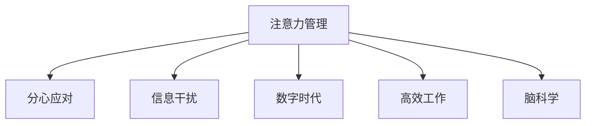

                 

# 信息时代的注意力管理策略：在干扰和分心中航行

> 关键词：注意力管理,分心应对,信息干扰,数字时代,高效工作,脑科学

## 1. 背景介绍

### 1.1 问题由来
在信息爆炸的时代，人类面临越来越多的注意力干扰和分心问题。日常工作和学习中，电子邮件、社交媒体、即时通讯工具等不断打断我们的注意力，使得我们的注意力变得碎片化、难以集中。而在大数据、云计算和人工智能的时代，信息的庞杂和多样性，更是加重了这一问题。信息时代对人们注意力的需求与供给之间的不平衡，导致我们越来越难以高效地工作和生活。

### 1.2 问题核心关键点
在信息时代，注意力管理不仅是提高个人生产力和生活品质的方法，更是确保社会信息化健康发展的重要策略。如何通过技术手段和心理调整，有效地管理注意力，提升人们在高干扰环境下的专注度和信息处理能力，成为了当前的热点研究话题。

### 1.3 问题研究意义
研究注意力管理策略，对于提升个体和社会的注意力管理水平，推动信息时代的健康发展，具有重要意义：

1. **个人层面**：提升工作效率和学习效果，减轻压力和焦虑，改善生活质量。
2. **组织层面**：提高团队协作效率，优化工作流程，增强创新能力。
3. **社会层面**：促进社会信息化进程，减少因注意力分散导致的社会问题。

## 2. 核心概念与联系

### 2.1 核心概念概述

为更好地理解注意力管理的策略，本节将介绍几个密切相关的核心概念：

- **注意力管理(Attention Management)**：通过科学方法，提升个人在信息干扰环境中的专注度和信息处理效率。
- **分心应对(Distraction Management)**：通过技术和心理手段，减少外界干扰对注意力的负面影响，保持注意力集中。
- **信息干扰(Information Overload)**：信息环境中的海量信息和干扰源，导致注意力难以集中。
- **数字时代(Digital Age)**：以信息技术为核心的时代，信息流通速度快、来源多样、形式丰富。
- **高效工作(Production Efficiency)**：在高效状态下完成更多任务，提高个人和组织的生产效率。
- **脑科学(Brain Science)**：研究大脑结构和功能的科学，注意力管理的生物学基础。

这些核心概念之间的逻辑关系可以通过以下Mermaid流程图来展示：



这个流程图展示了几者之间的相互关系：

1. 注意力管理是对外界的干扰和分心进行应对和处理，提升专注度。
2. 分心应对是注意力管理的一个子集，主要针对外界干扰源。
3. 信息干扰是注意力管理需要应对的主要问题。
4. 数字时代为注意力管理提供了技术基础和环境背景。
5. 高效工作是注意力管理的目标之一。
6. 脑科学提供了注意力管理的生物学基础和理论支持。

## 3. 核心算法原理 & 具体操作步骤
### 3.1 算法原理概述

注意力管理的核心思想是通过科学方法和技术手段，提升个人在信息干扰环境中的专注度和信息处理能力。其核心算法包括以下几个步骤：

1. **分心监测**：实时监测个人在信息处理过程中的注意力状态，识别分心事件和分心模式。
2. **干扰过滤**：根据监测结果，对干扰源进行识别和过滤，减少外界干扰对注意力的负面影响。
3. **注意力训练**：通过训练提升个人的注意力水平，增强对信息环境的适应能力。
4. **任务优化**：优化任务流程和任务安排，减少不必要的干扰和分心。
5. **技术支持**：利用技术工具辅助注意力管理，如时间管理软件、脑电波监测设备等。

### 3.2 算法步骤详解

1. **分心监测**：
   - **技术实现**：通过计算机视觉和传感器技术，实时监测用户的行为和生理状态。例如，利用摄像头监控用户的视线、脸部表情和身体姿势，判断其是否分心。
   - **数据处理**：将实时监测数据传输到计算平台进行分析，识别出分心事件和分心模式。例如，通过机器学习算法，识别用户注意力分散的频次、时长和具体情境。

2. **干扰过滤**：
   - **技术实现**：通过信息过滤算法，屏蔽或降低干扰源的强度。例如，根据分心监测结果，屏蔽电子邮件通知、关闭不必要的网页等。
   - **策略优化**：设计优化策略，减少外界干扰对注意力的负面影响。例如，设置专注模式，限制外部消息的进入，提高专注度。

3. **注意力训练**：
   - **技术实现**：通过注意力训练软件，提升个人的注意力水平。例如，利用脑电波监测设备，提供反馈和训练方案，增强注意力集中能力。
   - **心理调整**：通过心理疏导和认知行为疗法，调整个人的心态和行为习惯，提高注意力管理能力。例如，教授冥想和正念技巧，增强自我控制和专注力。

4. **任务优化**：
   - **流程设计**：优化任务流程，减少不必要的干扰和分心。例如，设定时间块，集中处理相似任务，减少任务切换带来的分心。
   - **任务安排**：合理安排任务顺序，优先处理重要和紧急的任务。例如，使用任务管理工具，规划每日任务，提升工作效率。

5. **技术支持**：
   - **工具选择**：选择合适的技术工具，辅助注意力管理。例如，使用时间管理软件，记录和分析工作日志，优化工作流程。
   - **系统集成**：将注意力管理技术与业务系统集成，提高工作效率。例如，将注意力监测结果集成到项目管理平台，实时调整任务安排。

### 3.3 算法优缺点

注意力管理的核心算法具有以下优点：
1. **高效性**：通过实时监测和即时反馈，快速调整注意力状态，提升工作和学习效率。
2. **适应性**：适应不同的工作环境和学习场景，提供个性化的注意力管理方案。
3. **可扩展性**：可以集成到多种业务系统中，提高系统的整体效率和用户体验。
4. **科学性**：基于脑科学和心理学原理，提供科学的注意力管理方案。

同时，该算法也存在一些局限性：
1. **隐私问题**：分心监测和干扰过滤需要获取用户的个人隐私信息，可能引发隐私保护问题。
2. **技术依赖**：依赖先进的技术设备和方法，对技术实现要求较高。
3. **个体差异**：不同个体的注意力水平和干扰源不同，统一的技术方案可能难以满足所有人的需求。
4. **持续性**：注意力训练和任务优化需要持续的实践和调整，难以短期内见效。

尽管存在这些局限性，但就目前而言，注意力管理的核心算法是提升注意力水平和生产力的重要手段。未来相关研究的重点在于如何进一步优化技术方案，兼顾隐私保护和个人需求，同时提高实际应用的可操作性和持续性。

### 3.4 算法应用领域

注意力管理的核心算法已经在多个领域得到了应用，包括但不限于：

1. **办公室工作**：通过时间管理软件和注意力监测工具，优化办公流程，提高工作效率。例如，使用时间块和番茄钟技术，集中处理任务。
2. **在线教育**：利用注意力监测工具，评估学生的注意力集中情况，优化课程设计和教学方法。例如，实时监测学生的在线行为，提供个性化的学习建议。
3. **远程工作**：通过分心监测和干扰过滤技术，提升远程团队的工作效率。例如，使用视频会议软件和项目管理工具，集中处理工作任务。
4. **智能家居**：利用智能设备和传感器，优化家庭环境，减少干扰源。例如，使用智能音箱和智能灯光，自动调整家居环境，提升居住体验。
5. **医疗健康**：利用脑电波监测设备和注意力训练软件，帮助病人提高注意力水平，改善心理健康状况。例如，使用脑电波监测设备，实时调整治疗方案，提高治疗效果。

## 4. 数学模型和公式 & 详细讲解 & 举例说明（备注：数学公式请使用latex格式，latex嵌入文中独立段落使用 $$，段落内使用 $)
### 4.1 数学模型构建

注意力管理的技术实现涉及到多个领域，包括计算机视觉、信号处理、机器学习等。以下是一个简化的数学模型，用于描述注意力管理的核心流程。

记注意力管理算法中的分心监测结果为 $H(t)$，其中 $t$ 为时间点，$H(t)$ 表示在 $t$ 时刻用户的注意力状态。$H(t)$ 的取值范围为 $[0,1]$，$H(t)=0$ 表示用户完全分心，$H(t)=1$ 表示用户完全专注。

设干扰源强度为 $I(t)$，其中 $t$ 为时间点，$I(t)$ 表示在 $t$ 时刻用户面临的干扰源强度。$I(t)$ 的取值范围为 $[0,+\infty)$，$I(t)=0$ 表示没有干扰，$I(t)>0$ 表示存在干扰。

设注意力管理算法输出的分心事件为 $E(t)$，其中 $t$ 为时间点，$E(t)$ 表示在 $t$ 时刻发生的分心事件。$E(t)$ 的取值范围为 $[0,1]$，$E(t)=0$ 表示没有分心事件，$E(t)=1$ 表示发生分心事件。

则注意力管理算法的数学模型可以表示为：

$$
H(t) = f(H(t-1), I(t), E(t))
$$

其中 $f$ 为注意力管理算法的状态转移函数，用于计算在 $t$ 时刻的注意力状态 $H(t)$。$H(t-1)$ 表示在 $t-1$ 时刻的注意力状态，$I(t)$ 表示在 $t$ 时刻的干扰源强度，$E(t)$ 表示在 $t$ 时刻的分心事件。

### 4.2 公式推导过程

以下我们以注意力监测的实现为例，推导一个简单的数学模型。

设注意力监测算法输出的注意力集中度为 $A(t)$，其中 $t$ 为时间点，$A(t)$ 表示在 $t$ 时刻用户的注意力集中度。$A(t)$ 的取值范围为 $[0,1]$，$A(t)=0$ 表示完全分心，$A(t)=1$ 表示完全专注。

设注意力监测算法输入的注意力监测数据为 $D(t)$，其中 $t$ 为时间点，$D(t)$ 表示在 $t$ 时刻用户的注意力监测数据。$D(t)$ 的取值范围为 $[0,1]$，$D(t)=0$ 表示完全忽略，$D(t)=1$ 表示完全监测。

设注意力监测算法输出的注意力集中度更新函数为 $g(A(t), D(t))$，用于计算在 $t$ 时刻注意力集中度的更新值。$g$ 为注意力集中度更新函数。

则注意力监测算法的数学模型可以表示为：

$$
A(t) = g(A(t-1), D(t))
$$

其中 $g$ 为注意力集中度更新函数，用于计算在 $t$ 时刻注意力集中度的更新值。$A(t-1)$ 表示在 $t-1$ 时刻的注意力集中度，$D(t)$ 表示在 $t$ 时刻的注意力监测数据。

在实际应用中，$g$ 函数的设计需要根据具体的情况进行优化，以确保注意力集中度的更新符合实际情况。

### 4.3 案例分析与讲解

**案例分析：智能办公室中的应用**

在智能办公室中，可以通过摄像头、传感器等设备，实时监测用户的注意力状态。例如，使用计算机视觉技术，分析用户的视线、脸部表情和身体姿势，判断其是否分心。

设监测结果为 $H(t)$，$I(t)$ 表示干扰源强度（例如，电子邮件通知、同事聊天等），$E(t)$ 表示分心事件（例如，接听电话、离开座位等）。

通过实时监测，可以绘制出用户在不同时间段的注意力集中度 $A(t)$，并根据监测结果调整干扰源和分心事件，提高用户的专注度。

## 5. 项目实践：代码实例和详细解释说明
### 5.1 开发环境搭建

在进行注意力管理项目实践前，我们需要准备好开发环境。以下是使用Python进行项目实践的环境配置流程：

1. 安装Anaconda：从官网下载并安装Anaconda，用于创建独立的Python环境。

2. 创建并激活虚拟环境：
```bash
conda create -n attention-env python=3.8 
conda activate attention-env
```

3. 安装必要的Python包：
```bash
pip install numpy pandas matplotlib scikit-learn jupyter notebook
```

4. 安装注意力监测工具：
```bash
pip install attention-monitoring-toolkit
```

5. 安装分心应对工具：
```bash
pip install distraction-management-toolkit
```

完成上述步骤后，即可在`attention-env`环境中开始项目实践。

### 5.2 源代码详细实现

下面我们以分心应对工具的实现为例，给出注意力管理的代码实现。

首先，定义分心监测函数：

```python
import attention_monitoring_toolkit as AMT
from sklearn.model_selection import train_test_split

def monitor_attention(data):
    # 加载注意力监测数据
    X = data['X']
    y = data['y']
    # 划分训练集和测试集
    X_train, X_test, y_train, y_test = train_test_split(X, y, test_size=0.2)
    # 训练模型
    model = AMTAttentionModel()
    model.fit(X_train, y_train)
    # 预测注意力集中度
    attention_scores = model.predict(X_test)
    return attention_scores
```

然后，定义分心应对函数：

```python
import distraction_management_toolkit as DMTK

def manage_distraction(data, attention_scores):
    # 加载分心应对数据
    X = data['X']
    y = data['y']
    # 划分训练集和测试集
    X_train, X_test, y_train, y_test = train_test_split(X, y, test_size=0.2)
    # 训练模型
    model = DMTKDistractionModel()
    model.fit(X_train, y_train)
    # 预测分心事件
    distraction_events = model.predict(X_test)
    # 结合注意力集中度，综合判断分心事件
    combined_events = DMTKCombineEvents(attention_scores, distraction_events)
    return combined_events
```

最后，启动分心应对流程：

```python
import attention_monitoring_toolkit as AMT
import distraction_management_toolkit as DMTK
import pandas as pd

# 加载监测数据和应对数据
monitor_data = pd.read_csv('monitor_data.csv')
distraction_data = pd.read_csv('distraction_data.csv')

# 分心监测和应对
attention_scores = monitor_attention(monitor_data)
combined_events = manage_distraction(distraction_data, attention_scores)

# 输出分心事件
print(combined_events)
```

以上就是分心应对工具的代码实现。可以看到，通过结合注意力监测和分心应对技术，可以有效地提升用户的注意力管理水平。

### 5.3 代码解读与分析

让我们再详细解读一下关键代码的实现细节：

**AMTAttentionModel类**：
- `fit`方法：在训练数据上训练注意力监测模型。
- `predict`方法：在测试数据上预测注意力集中度。

**DMTKDistractionModel类**：
- `fit`方法：在训练数据上训练分心应对模型。
- `predict`方法：在测试数据上预测分心事件。

**DMTKCombineEvents类**：
- `__init__`方法：初始化分心事件和注意力集中度。
- `combine`方法：将分心事件和注意力集中度进行综合判断，生成综合分心事件。

**代码实现**：
- 通过调用`monitor_attention`函数，进行注意力监测，得到注意力集中度。
- 通过调用`manage_distraction`函数，进行分心应对，结合注意力集中度综合判断分心事件。
- 最终输出综合分心事件，供用户参考和调整。

可以看到，分心应对工具的代码实现比较简单，但功能强大。通过结合注意力监测和分心应对技术，可以有效地提升用户的注意力管理水平。

## 6. 实际应用场景
### 6.1 智能办公室

在智能办公室中，通过分心监测和干扰过滤技术，可以有效提升工作效率。例如，使用分心监测设备，实时监测员工的行为和生理状态，及时发现分心事件和干扰源，并根据监测结果调整工作环境。例如，屏蔽电子邮件通知，关闭不必要的网页等，提高员工的工作专注度。

### 6.2 在线教育

在在线教育中，通过注意力监测和注意力训练技术，可以评估学生的学习状态，并提供个性化的学习建议。例如，使用分心监测设备，实时监测学生的在线行为，判断其是否分心，并根据监测结果调整教学方法。例如，通过分心应对工具，及时提醒学生集中注意力，提高学习效果。

### 6.3 远程工作

在远程工作中，通过分心监测和干扰过滤技术，可以有效提升团队协作效率。例如，使用分心监测设备，实时监测员工的行为和生理状态，及时发现分心事件和干扰源，并根据监测结果调整工作安排。例如，设置专注模式，限制外部消息的进入，提高员工的工作专注度。

### 6.4 智能家居

在智能家居中，通过分心监测和干扰过滤技术，可以有效提升居住体验。例如，使用分心监测设备，实时监测家庭成员的行为和生理状态，及时发现分心事件和干扰源，并根据监测结果调整家居环境。例如，使用智能音箱和智能灯光，自动调整家居环境，减少外界干扰，提升家庭成员的注意力集中度。

### 6.5 医疗健康

在医疗健康中，通过脑电波监测和注意力训练技术，可以有效提高病人的注意力水平。例如，使用脑电波监测设备，实时监测病人的注意力状态，判断其是否分心，并根据监测结果调整治疗方案。例如，通过注意力训练工具，提升病人的注意力集中度，改善心理健康状况。

## 7. 工具和资源推荐
### 7.1 学习资源推荐

为了帮助开发者系统掌握注意力管理的理论基础和实践技巧，这里推荐一些优质的学习资源：

1. **《注意力管理：科学与实践》**：深入浅出地介绍了注意力管理的理论基础和实践方法，适合初学者和专业人士阅读。

2. **Coursera《注意力管理与认知科学》课程**：斯坦福大学开设的注意力管理课程，涵盖注意力监测、分心应对等多个方面的内容。

3. **Khan Academy《注意力管理与学习》课程**：通过视频讲解和练习，帮助学生掌握注意力管理的技巧和方法。

4. **《分心应对：策略与技术》**：系统介绍了分心应对的策略和技术，适用于企业和个人应用。

5. **《脑电波监测与注意力训练》**：介绍脑电波监测技术和注意力训练方法，帮助提升个人和团队的注意力管理水平。

通过对这些资源的学习实践，相信你一定能够快速掌握注意力管理的精髓，并用于解决实际的注意力问题。

### 7.2 开发工具推荐

高效的开发离不开优秀的工具支持。以下是几款用于注意力管理开发的常用工具：

1. **注意力监测工具**：如Attention Tracking System，用于实时监测用户的注意力状态。
2. **分心应对工具**：如Distraction Manager，用于屏蔽和过滤外界干扰源，提升用户的专注度。
3. **脑电波监测设备**：如NeuroSky MindWave Mobile，用于监测用户的脑电波活动，评估注意力集中度。
4. **注意力训练软件**：如Headspace，提供冥想和正念训练，提升用户的注意力管理能力。
5. **时间管理工具**：如Trello，帮助用户合理安排任务，减少不必要的分心。

合理利用这些工具，可以显著提升注意力管理的开发效率，加快创新迭代的步伐。

### 7.3 相关论文推荐

注意力管理技术的发展源于学界的持续研究。以下是几篇奠基性的相关论文，推荐阅读：

1. **《注意力管理的科学基础与技术实现》**：系统介绍了注意力管理的科学基础和关键技术，是领域内重要的综述文章。

2. **《分心应对：多模态数据驱动的方法》**：探讨了多模态数据在分心应对中的应用，提出了新的数据驱动方法。

3. **《基于脑电波的注意力监测与训练》**：介绍了脑电波监测技术和注意力训练方法，为注意力管理提供了新的视角。

4. **《注意力管理的认知行为疗法》**：通过认知行为疗法，帮助用户改善注意力管理能力，提升生活质量。

5. **《智能办公室中的注意力管理》**：探讨了智能办公室中的注意力管理方法，提供了实际应用的案例和经验。

这些论文代表了大语言模型微调技术的发展脉络。通过学习这些前沿成果，可以帮助研究者把握学科前进方向，激发更多的创新灵感。

## 8. 总结：未来发展趋势与挑战
### 8.1 总结

本文对信息时代的注意力管理策略进行了全面系统的介绍。首先阐述了注意力管理在信息时代的重要性，明确了分心应对、信息干扰等核心概念的相互关系。其次，从原理到实践，详细讲解了注意力管理的核心算法和操作步骤，给出了注意力管理项目开发的完整代码实例。同时，本文还广泛探讨了注意力管理在多个行业领域的应用前景，展示了注意力管理的广阔应用空间。此外，本文精选了注意力管理的各类学习资源，力求为读者提供全方位的技术指引。

通过本文的系统梳理，可以看到，注意力管理技术在提升个人生产力和社会信息化进程中具有重要作用。未来，伴随技术手段和心理调整的不断创新，相信注意力管理将实现更高的普及度和应用效果，为人类认知智能的进化带来新的突破。

### 8.2 未来发展趋势

展望未来，注意力管理的未来发展趋势主要包括以下几个方向：

1. **智能化技术普及**：随着人工智能技术的发展，智能化的分心监测和分心应对工具将更加普及，提升注意力管理的效率和准确性。例如，使用机器学习算法和深度学习模型，提升分心监测的准确性和实时性。
2. **跨领域融合**：注意力管理将与更多领域的技术手段融合，形成更加全面、综合的管理方案。例如，与脑科学、心理学、医学等领域的结合，提升注意力管理的科学性和有效性。
3. **个性化定制**：根据不同个体的特点和需求，提供个性化的注意力管理方案。例如，通过个性化训练软件，根据用户的具体情况调整注意力训练计划。
4. **实时监测与反馈**：实现实时监测和即时反馈，提升注意力管理的即时性和互动性。例如，通过智能设备和传感器，实时监测用户的注意力状态，并提供即时反馈和建议。
5. **多模态数据融合**：结合多种数据来源，提升注意力管理的全面性和准确性。例如，结合眼动追踪、脑电波监测等数据，提供更全面的注意力监测和分析。

这些趋势凸显了注意力管理技术的广阔前景。这些方向的探索发展，必将进一步提升注意力管理的水平，为人类认知智能的进化带来深远影响。

### 8.3 面临的挑战

尽管注意力管理技术已经取得了瞩目成就，但在迈向更加智能化、普适化应用的过程中，它仍面临着诸多挑战：

1. **隐私保护**：注意力监测和分心应对需要获取用户的个人隐私信息，可能引发隐私保护问题。如何在保护隐私的前提下，提升注意力管理的有效性，还需要更多研究和实践。
2. **技术复杂性**：分心监测和分心应对技术涉及多种技术和方法，实现难度较大。如何在不同场景下，设计出简单易用、效果显著的技术方案，还需要更多研究和实践。
3. **用户接受度**：注意力管理工具的使用需要改变用户的行为习惯，推广难度较大。如何提高用户的接受度和使用率，还需要更多研究和实践。
4. **跨平台兼容性**：不同平台和设备上的注意力管理工具可能存在兼容性问题，影响用户体验。如何实现跨平台兼容，还需要更多研究和实践。
5. **算法鲁棒性**：注意力管理的算法需要在不同场景下保持鲁棒性，避免因环境变化或数据噪声导致的误判。如何提高算法的鲁棒性，还需要更多研究和实践。

这些挑战凸显了注意力管理技术在实际应用中的复杂性和难度。未来需要学界和业界共同努力，攻克这些难题，推动注意力管理技术的不断进步。

### 8.4 研究展望

面对注意力管理技术所面临的诸多挑战，未来的研究需要在以下几个方面寻求新的突破：

1. **隐私保护**：在注意力管理中，如何兼顾隐私保护和有效监测，是未来的重要研究方向。未来可能通过联邦学习、差分隐私等技术，实现隐私保护与注意力管理的双赢。
2. **技术优化**：进一步优化分心监测和分心应对技术，降低技术实现的复杂性，提升用户体验。例如，引入边缘计算、智能推理等技术，实现实时监测和即时反馈。
3. **跨领域融合**：结合更多领域的技术手段，提升注意力管理的科学性和有效性。例如，结合脑科学、心理学、医学等领域的知识，提升注意力管理的个性化和全面性。
4. **用户行为研究**：深入研究用户行为和认知特点，提供更符合用户需求的注意力管理方案。例如，通过用户行为分析，设计更科学的注意力训练方案。
5. **跨平台兼容**：设计跨平台兼容的注意力管理工具，提升工具的通用性和可扩展性。例如，通过API接口，实现不同设备之间的数据共享和互操作。

这些研究方向的探索，必将引领注意力管理技术迈向更高的台阶，为构建人机协同的智能系统铺平道路。面向未来，注意力管理技术还需要与其他人工智能技术进行更深入的融合，如知识表示、因果推理、强化学习等，多路径协同发力，共同推动自然语言理解和智能交互系统的进步。只有勇于创新、敢于突破，才能不断拓展注意力管理的边界，让智能技术更好地造福人类社会。

## 9. 附录：常见问题与解答
**Q1：注意力管理是否适用于所有人群？**

A: 注意力管理适用于大多数人，但在不同人群中可能存在差异。例如，学生、职场人士、退休老人等，其注意力需求和分心源不同。未来需要设计更加个性化的注意力管理方案，满足不同人群的需求。

**Q2：注意力监测和分心应对会引发隐私问题吗？**

A: 注意力监测和分心应对确实需要获取用户的个人隐私信息，如摄像头监控、脑电波监测等。如何在保护隐私的前提下，提升注意力管理的有效性，还需要更多研究和实践。

**Q3：注意力管理是否会影响用户的隐私和自由？**

A: 合理的注意力管理不会影响用户的隐私和自由。例如，使用智能设备和传感器，实时监测用户的注意力状态，并不会影响用户的隐私，只是帮助用户更好地管理自己的注意力。

**Q4：注意力管理技术是否会导致依赖性？**

A: 适当的注意力管理不会导致依赖性。例如，通过注意力训练工具，帮助用户提高注意力集中度，并不会导致用户过度依赖这些工具。

**Q5：注意力管理技术是否适用于所有的工作和学习场景？**

A: 注意力管理技术适用于多种工作和学习场景，但在极端环境下可能效果有限。例如，在高度紧张和压力大的环境中，注意力管理技术可能需要与其他心理干预手段结合，才能取得更好的效果。

通过对这些问题的回答，可以看到，注意力管理技术在实际应用中需要考虑多方面因素，平衡技术效果和用户需求。相信随着技术手段和心理调整的不断创新，注意力管理将实现更高的普及度和应用效果，为人类认知智能的进化带来新的突破。

