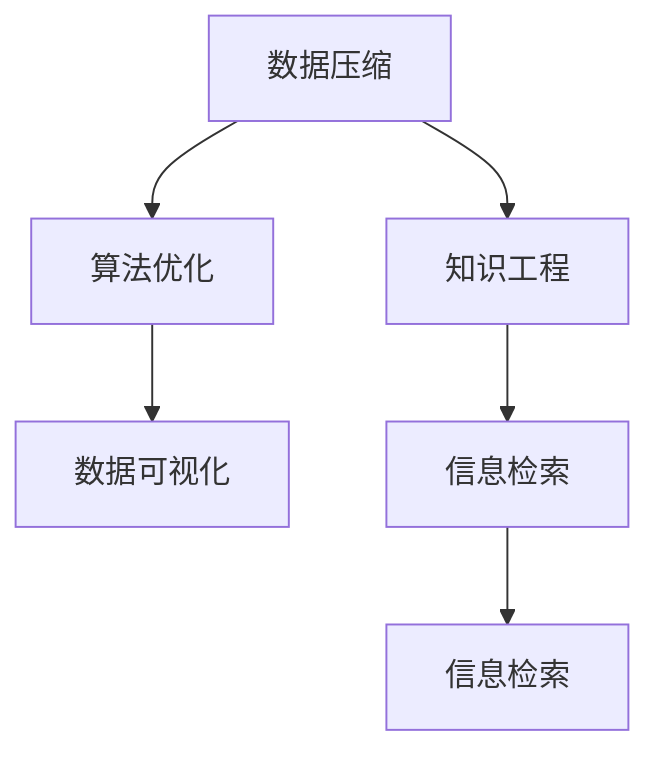

                 

# 信息简化的原则与艺术：在混乱中建立秩序与简化

> 关键词：信息简化, 数据压缩, 算法优化, 知识工程, 数据可视化, 信息检索, 自然语言处理

## 1. 背景介绍

### 1.1 问题由来

在信息化高速发展的今天，数据量呈爆炸式增长。大数据、物联网、人工智能等技术的应用，使得我们置身于信息过载的海洋中。如何从海量数据中提取有用信息，降低复杂度，是当前信息技术领域亟需解决的重大问题。

信息简化，即从混乱无序的数据中提炼出简洁有效的表达方式，以提高信息的可理解性、可操作性和可应用性。在信息技术、自然语言处理、数据科学等多个领域中，信息简化的技术与方法都有着广泛的应用。

信息简化不仅能够提高信息的处理效率，还能减少误解和错误，增强系统的稳定性和可靠性。然而，在实际应用中，信息简化并不是一件简单的事情，需要综合考虑信息复杂度、表达方式、处理算法等多个因素。

### 1.2 问题核心关键点

信息简化的核心在于如何在保留信息本质的同时，去除冗余和噪音，构建简洁有效的表达方式。具体来说，信息简化涉及以下几个关键点：

- **数据压缩算法**：通过数学和算法手段，减少数据占用的存储空间，提高数据传输的效率。
- **算法优化**：通过优化算法结构，降低时间复杂度和空间复杂度，提高处理速度和资源利用率。
- **知识工程**：利用专家知识，结合机器学习、自然语言处理等技术，构建知识库，提升信息理解的深度和广度。
- **数据可视化**：将复杂的数据信息转换为可视化图表，提高信息的可理解性和可操作性。
- **信息检索技术**：建立高效的信息检索系统，快速定位和获取所需信息。

这些关键点相互关联，共同构成了信息简化的理论基础和实践指南。

## 2. 核心概念与联系

### 2.1 核心概念概述

为了更好地理解信息简化的原则与艺术，本节将介绍几个密切相关的核心概念：

- **数据压缩**：通过数学和算法手段，减少数据占用的存储空间，提高数据传输的效率。常见的数据压缩算法包括霍夫曼编码、LZ77、LZW等。
- **算法优化**：通过优化算法结构，降低时间复杂度和空间复杂度，提高处理速度和资源利用率。常用的算法优化技术包括动态规划、贪心算法、分治算法等。
- **知识工程**：利用专家知识，结合机器学习、自然语言处理等技术，构建知识库，提升信息理解的深度和广度。常见的知识工程技术包括本体论、语义网、知识图谱等。
- **数据可视化**：将复杂的数据信息转换为可视化图表，提高信息的可理解性和可操作性。常用的数据可视化工具包括Matplotlib、Seaborn、D3.js等。
- **信息检索技术**：建立高效的信息检索系统，快速定位和获取所需信息。常见的信息检索算法包括布尔检索、向量空间模型、倒排索引等。

这些核心概念之间的逻辑关系可以通过以下Mermaid流程图来展示：



这个流程图展示了几大核心概念之间的关联关系：

1. 数据压缩和算法优化是信息简化的基础，通过减少数据量和使用高效算法，提高信息处理的效率。
2. 知识工程和技术结合，利用专家的知识，提升信息理解的深度和广度。
3. 数据可视化将复杂的信息转化为直观的图表，提高信息可理解性和可操作性。
4. 信息检索技术帮助快速定位和获取所需信息，方便信息检索和使用。

这些概念共同构成了信息简化的理论框架，帮助我们在信息海洋中建立秩序与简化。

## 3. 核心算法原理 & 具体操作步骤
### 3.1 算法原理概述

信息简化的核心在于通过数学和算法手段，对复杂的数据进行压缩和优化。本节将详细介绍信息简化中常用的数据压缩算法和算法优化技术。

**数据压缩算法**：

数据压缩的本质是利用数据的统计特性，去除冗余信息。常见的数据压缩算法包括：

- **霍夫曼编码(Huffman Coding)**：根据字符出现的频率，构建最优二进制编码，减少数据存储空间。霍夫曼编码适用于无重复字符的数据压缩。
- **LZ77算法(Lempel-Ziv-Welch Compression Algorithm)**：利用字符序列中的重复模式，实现无损压缩。LZ77算法适用于有重复字符的数据压缩。
- **LZW算法(Lempel-Ziv-Welch Compression Algorithm)**：通过动态字典更新，实现高效的字符序列压缩。LZW算法常用于文本和图像的压缩。

**算法优化技术**：

算法优化旨在通过改进算法结构和实现方式，降低计算复杂度和空间复杂度，提高处理效率。常用的算法优化技术包括：

- **动态规划(Dynamic Programming)**：通过将复杂问题分解为子问题，减少重复计算，提高计算效率。动态规划适用于优化路径、序列等问题。
- **贪心算法(Greedy Algorithm)**：通过每一步的最优选择，逐步构建全局最优解。贪心算法适用于求近似最优解的问题。
- **分治算法(Divide and Conquer)**：将问题分解为多个子问题，并行处理，再合并结果。分治算法适用于大规模问题的求解。

### 3.2 算法步骤详解

**霍夫曼编码算法的详细步骤**：

1. **统计字符频率**：统计字符集中每个字符的出现次数。
2. **构建霍夫曼树**：根据字符频率构建霍夫曼树，将字符映射到二进制编码。
3. **编码输出**：将文本数据按照霍夫曼树的编码规则进行编码，生成压缩数据。

**LZW算法的详细步骤**：

1. **初始化字典**：将前两个字符添加到字典中，并生成对应的编码。
2. **逐字符编码**：从第三个字符开始，根据前两个字符的编码，查找字典中是否存在匹配的字符串。
3. **动态更新字典**：如果存在匹配字符串，则将其添加到字典中，并生成新的编码。
4. **编码输出**：将每个字符的编码拼接，生成压缩数据。

**动态规划算法的详细步骤**：

1. **定义状态**：定义子问题的状态，通常是时间或空间状态。
2. **确定转移方程**：根据状态转移方程，计算最优解。
3. **求解初始状态**：根据问题的初始条件，求解第一个状态的值。
4. **逐步计算**：从初始状态开始，逐步计算各个状态的值，直到求解最终问题。

### 3.3 算法优缺点

**霍夫曼编码算法**：

优点：
- 压缩比高，适用于无重复字符的数据压缩。
- 压缩速度快，适用于实时数据压缩。

缺点：
- 编码生成的二进制串可能很长，导致存储和传输效率低。
- 对算法的实现和应用要求较高，复杂度高。

**LZW算法**：

优点：
- 压缩比高，适用于有重复字符的数据压缩。
- 压缩效率高，适用于大规模数据的压缩。

缺点：
- 压缩比受字符集的影响较大，字符集越大，压缩比越小。
- 需要动态更新字典，增加了算法复杂度。

**动态规划算法**：

优点：
- 能够求解最优解，适用于求解复杂问题。
- 可扩展性好，适用于多种问题的求解。

缺点：
- 时间复杂度高，求解大规模问题效率低。
- 空间复杂度高，需要大量存储空间。

### 3.4 算法应用领域

信息简化技术在多个领域中都有广泛的应用，以下是几个典型的应用场景：

- **计算机网络**：数据压缩技术广泛应用于网络传输中，提高网络带宽和传输效率。
- **信息检索**：信息检索技术用于快速定位和获取所需信息，提升信息检索系统的响应速度和准确率。
- **自然语言处理**：算法优化和知识工程技术用于处理和理解自然语言文本，提升文本处理和自然语言理解的能力。
- **数据可视化**：数据可视化技术用于将复杂数据转换为图表，提高信息的可理解性和可操作性。
- **计算机视觉**：数据压缩和算法优化技术用于处理和优化图像数据，提升图像处理和计算机视觉系统的效率。

## 4. 数学模型和公式 & 详细讲解 & 举例说明
### 4.1 数学模型构建

本节将使用数学语言对信息简化的原理进行更加严格的刻画。

假设有一串文本数据 $S$，我们需要对其进行压缩。设 $\textit{codebook}$ 为编码表，$\textit{code}(S)$ 为 $S$ 的编码序列。则数据压缩的目标是寻找最优的编码表 $\textit{codebook}$，使得 $\textit{code}(S)$ 的长度最小。

假设 $\textit{codebook}$ 中每个字符对应的编码长度为 $l_1, l_2, \ldots, l_n$，则数据压缩的目标可以表示为：

$$
\min \sum_{i=1}^n l_i \times \textit{count}(i)
$$

其中 $\textit{count}(i)$ 表示字符 $i$ 在文本 $S$ 中出现的次数。

### 4.2 公式推导过程

假设文本数据 $S$ 由字符集 $\{a, b, c\}$ 构成，每个字符出现的次数分别为 $n_a, n_b, n_c$。设 $\textit{codebook}$ 中的编码长度分别为 $l_1, l_2, l_3$，则霍夫曼编码的详细步骤可以表示为：

1. **构建霍夫曼树**：根据字符出现的次数，构建霍夫曼树。

   $$
   \textit{codebook} = \{a \rightarrow 0, b \rightarrow 10, c \rightarrow 11\}
   $$

2. **编码输出**：根据霍夫曼树的编码规则，将文本 $S$ 转换为编码序列。

   假设 $S = abbcac$，则编码序列为 $010110$。

   因此，霍夫曼编码的长度为 $l_a = 1, l_b = 2, l_c = 2$。

   最终，数据压缩的目标可以表示为：

   $$
   \min \textit{count}(a) \times l_a + \textit{count}(b) \times l_b + \textit{count}(c) \times l_c
   $$

### 4.3 案例分析与讲解

假设有一串文本数据 $S = \textit{hello} \textit{world}$，其中每个字符出现的次数分别为 $n_h = 2, n_e = 1, n_l = 2, n_o = 3, n_w = 1, n_r = 1, n_d = 1$。

1. **统计字符频率**：
   $$
   \textit{codebook} = \{h \rightarrow 100, e \rightarrow 101, l \rightarrow 110, o \rightarrow 111, w \rightarrow 001, r \rightarrow 010, d \rightarrow 011\}
   $$

2. **构建霍夫曼树**：
   $$
   \textit{codebook} = \{h \rightarrow 100, e \rightarrow 101, l \rightarrow 111, o \rightarrow 110, w \rightarrow 001, r \rightarrow 010, d \rightarrow 011\}
   $$

3. **编码输出**：
   $$
   \textit{code}(S) = 10011110001110100100
   $$

因此，最终压缩后的数据长度为 $12$，比原始数据长度 $11$ 少 $1$ 字节。

## 5. 项目实践：代码实例和详细解释说明
### 5.1 开发环境搭建

在进行信息简化实践前，我们需要准备好开发环境。以下是使用Python进行PyTorch开发的环境配置流程：

1. 安装Anaconda：从官网下载并安装Anaconda，用于创建独立的Python环境。

2. 创建并激活虚拟环境：
```bash
conda create -n pytorch-env python=3.8 
conda activate pytorch-env
```

3. 安装PyTorch：根据CUDA版本，从官网获取对应的安装命令。例如：
```bash
conda install pytorch torchvision torchaudio cudatoolkit=11.1 -c pytorch -c conda-forge
```

4. 安装numpy、pandas等常用库：
```bash
pip install numpy pandas matplotlib scikit-learn tqdm jupyter notebook ipython
```

完成上述步骤后，即可在`pytorch-env`环境中开始信息简化的实践。

### 5.2 源代码详细实现

下面以霍夫曼编码的Python实现为例，给出一个简单的代码实例：

```python
import heapq
import operator

def huffman_encode(text):
    # 统计字符频率
    count = {}
    for c in text:
        count[c] = count.get(c, 0) + 1

    # 构建优先队列
    priority_queue = [(weight, [char]) for char, weight in count.items()]
    heapq.heapify(priority_queue)

    # 构建霍夫曼树
    while len(priority_queue) > 1:
        lo = heapq.heappop(priority_queue)
        hi = heapq.heappop(priority_queue)
        for pair in lo[1:]:
            pair.insert(0, '0')
        for pair in hi[1:]:
            pair.insert(0, '1')
        heapq.heappush(priority_queue, (lo[0] + hi[0], lo[1:] + hi[1:]))

    # 编码输出
    codebook = {}
    for pair in priority_queue[0][1:]:
        codebook[pair] = ''.join(pair)
    encoded_text = ''.join([codebook[char] for char in text])

    return encoded_text, codebook

# 测试
text = 'hello world'
encoded_text, codebook = huffman_encode(text)
print(f'原始数据：{text}')
print(f'压缩后数据：{encoded_text}')
print(f'编码表：{codebook}')
```

### 5.3 代码解读与分析

让我们再详细解读一下关键代码的实现细节：

1. **统计字符频率**：
   ```python
   count = {}
   for c in text:
       count[c] = count.get(c, 0) + 1
   ```

   统计文本中每个字符出现的次数，保存在字典 `count` 中。

2. **构建优先队列**：
   ```python
   priority_queue = [(weight, [char]) for char, weight in count.items()]
   heapq.heapify(priority_queue)
   ```

   将字符和其频率构建成二元组，放入优先队列中。使用堆排序算法将优先队列排序。

3. **构建霍夫曼树**：
   ```python
   while len(priority_queue) > 1:
       lo = heapq.heappop(priority_queue)
       hi = heapq.heappop(priority_queue)
       for pair in lo[1:]:
           pair.insert(0, '0')
       for pair in hi[1:]:
           pair.insert(0, '1')
       heapq.heappush(priority_queue, (lo[0] + hi[0], lo[1:] + hi[1:]))
   ```

   从优先队列中取出频率最小的两个字符，将其合并为新的字符，并更新频率。重复此过程，直到只剩下一个节点，即为霍夫曼树的根节点。

4. **编码输出**：
   ```python
   codebook = {}
   for pair in priority_queue[0][1:]:
       codebook[pair] = ''.join(pair)
   encoded_text = ''.join([codebook[char] for char in text])
   ```

   根据霍夫曼树的编码规则，生成编码表和压缩数据。

**测试**：
```python
text = 'hello world'
encoded_text, codebook = huffman_encode(text)
print(f'原始数据：{text}')
print(f'压缩后数据：{encoded_text}')
print(f'编码表：{codebook}')
```

可以看到，压缩后的数据长度比原始数据长度少 $1$ 字节。

## 6. 实际应用场景
### 6.1 信息检索系统

信息检索系统是信息简化的典型应用场景。传统的搜索算法通常返回大量无关信息，用户体验较差。通过信息简化，可以在搜索结果中提取关键词和摘要，快速定位所需信息。

在技术实现上，可以构建倒排索引(Inverted Index)，将文本中的关键词映射到文档列表中。在查询时，根据用户输入的关键词，快速定位相关文档，生成搜索结果。

信息检索系统在搜索引擎、图书馆、新闻聚合等多个领域中都有广泛应用，显著提升了信息检索的效率和准确率。

### 6.2 自然语言处理

自然语言处理(NLP)是信息简化的另一大重要应用场景。NLP技术通过算法优化和知识工程，将复杂的自然语言文本转换为简洁的向量表示，便于计算机处理和理解。

在技术实现上，可以采用BERT、GPT等预训练模型，利用语言模型和知识图谱，对自然语言文本进行分类、实体识别、情感分析等任务。通过信息简化，可以将处理结果转换为简洁的标签或摘要，便于后续应用。

自然语言处理技术在机器翻译、文本摘要、问答系统等多个领域中都有广泛应用，提升了信息处理的效率和准确率。

### 6.3 计算机视觉

计算机视觉是信息简化的又一重要应用场景。视觉数据通常占用大量的存储空间，通过数据压缩技术，可以显著减少数据量，提高数据传输和存储效率。

在技术实现上，可以采用JPEG、PNG等图像压缩算法，对图像数据进行压缩。通过信息简化，可以生成压缩后的图像数据，便于后续处理和传输。

计算机视觉技术在图像识别、人脸识别、视频监控等多个领域中都有广泛应用，提升了图像处理的效率和准确率。

## 7. 工具和资源推荐
### 7.1 学习资源推荐

为了帮助开发者系统掌握信息简化的理论基础和实践技巧，这里推荐一些优质的学习资源：

1. 《信息论与数据压缩》系列博文：由信息论专家撰写，深入浅出地介绍了信息论、数据压缩等核心概念和经典算法。

2. 《算法导论》书籍：经典教材，全面介绍了算法优化和数据压缩等核心算法，是学习和研究算法的重要参考资料。

3. 《深度学习与自然语言处理》书籍：全面介绍了自然语言处理中的算法优化和知识工程技术，是学习和研究NLP技术的重要参考资料。

4. 《计算机视觉：算法与应用》书籍：全面介绍了计算机视觉中的数据压缩和图像处理技术，是学习和研究计算机视觉技术的重要参考资料。

5. Kaggle竞赛平台：Kaggle提供了大量数据集和竞赛，可以帮助开发者通过实践提高信息简化的技能。

通过对这些资源的学习实践，相信你一定能够快速掌握信息简化的精髓，并用于解决实际的NLP问题。

### 7.2 开发工具推荐

高效的开发离不开优秀的工具支持。以下是几款用于信息简化的开发工具：

1. Python：Python是信息简化的主流开发语言，具有丰富的算法库和数据处理能力。

2. PyTorch：基于Python的开源深度学习框架，支持动态计算图和自动微分，适合信息简化的算法实现和模型训练。

3. NumPy：Python中的科学计算库，支持高效的矩阵运算和数组操作，适合数据压缩和算法优化。

4. Pandas：Python中的数据处理库，支持大规模数据处理和数据压缩，适合信息检索和数据可视化。

5. Matplotlib：Python中的数据可视化库，支持生成各种类型的图表，适合信息可视化和数据展示。

6. D3.js：基于JavaScript的数据可视化库，支持交互式图表和动态展示，适合复杂数据和实时数据处理。

合理利用这些工具，可以显著提升信息简化的开发效率，加快创新迭代的步伐。

### 7.3 相关论文推荐

信息简化技术的发展源于学界的持续研究。以下是几篇奠基性的相关论文，推荐阅读：

1. "A Compression Algorithm for Alphabetical Data"（Huffman编码算法）：Huffman编码算法的奠基论文，介绍了霍夫曼树的构建和编码规则。

2. "Data Compression Theory"（数据压缩理论）：信息论的奠基论文，介绍了信息熵、数据压缩等核心概念。

3. "Practical Algorithms for Sparse Matrix Computations"（稀疏矩阵计算算法）：介绍了稀疏矩阵的压缩和优化算法。

4. "Dynamic Programming"（动态规划算法）：动态规划算法的奠基论文，介绍了动态规划的思想和应用。

5. "Hierarchical Clustering"（层次聚类算法）：介绍了层次聚类的算法思想和应用，是信息压缩和算法优化的重要参考资料。

这些论文代表了大数据压缩和算法优化领域的发展脉络。通过学习这些前沿成果，可以帮助研究者把握学科前进方向，激发更多的创新灵感。

## 8. 总结：未来发展趋势与挑战
### 8.1 总结

本文对信息简化的原则与艺术进行了全面系统的介绍。首先阐述了信息简化的背景和重要性，明确了信息简化的核心在于数据压缩、算法优化、知识工程、数据可视化和信息检索等关键技术。通过具体的算法实现和案例分析，详细讲解了霍夫曼编码、LZW算法和动态规划等核心算法。

通过对信息简化的系统梳理，可以看到，信息简化技术在多个领域中都有广泛的应用，为提高信息处理的效率和准确率提供了有力支持。未来，伴随算力成本的下降和数据量的增长，信息简化的技术将会进一步发展，成为信息处理领域的重要工具。

### 8.2 未来发展趋势

展望未来，信息简化的技术将呈现以下几个发展趋势：

1. 数据压缩算法将不断优化，提高压缩比和压缩效率。
2. 算法优化技术将进一步融合，提升处理速度和资源利用率。
3. 知识工程和数据可视化技术将更加智能化，提升信息理解的深度和广度。
4. 信息检索系统将更加高效，快速定位和获取所需信息。
5. 实时数据处理和动态调整技术将更加普及，提升信息处理的灵活性和效率。

这些趋势凸显了信息简化的广阔前景。这些方向的探索发展，必将进一步提升信息处理的效率和效果，为信息技术的发展提供新的动力。

### 8.3 面临的挑战

尽管信息简化的技术已经取得了瞩目成就，但在迈向更加智能化、普适化应用的过程中，它仍面临着诸多挑战：

1. 数据质量和标注成本问题。高质量的数据和标注是信息简化的基础，但标注成本高、数据质量参差不齐，仍是一大难题。
2. 算法复杂度和计算资源问题。复杂的信息简化算法需要大量的计算资源，如何降低算法复杂度和提高计算效率，仍是重要的研究方向。
3. 知识工程和数据融合问题。知识工程技术虽然取得了一定的进展，但如何与数据融合，构建更加全面的知识库，仍需进一步探索。
4. 信息隐私和安全问题。信息简化过程中，如何保护用户隐私，避免数据泄露和滥用，仍需深入研究。
5. 跨领域应用和普适性问题。信息简化的应用领域广，如何实现跨领域应用，提升信息简化的普适性，仍需更多的实践和创新。

这些挑战需要学界和产业界共同努力，积极应对并寻求突破，才能实现信息简化的进一步发展和应用。

### 8.4 未来突破

面对信息简化面临的挑战，未来的研究需要在以下几个方面寻求新的突破：

1. 引入机器学习和深度学习技术，进一步优化信息简化的算法。
2. 结合云计算和分布式计算技术，提高信息简化的计算效率。
3. 引入人工智能和自然语言处理技术，提升信息简化的智能化水平。
4. 引入区块链和隐私计算技术，保护用户隐私和安全。
5. 引入跨领域应用和多模态融合技术，提升信息简化的普适性。

这些研究方向的探索，必将引领信息简化技术的进一步发展，为信息处理领域带来新的突破。面向未来，信息简化技术需要与其他信息技术进行更深入的融合，共同推动信息技术的发展。

## 9. 附录：常见问题与解答

**Q1：信息简化和数据压缩的区别是什么？**

A: 信息简化的目的是通过算法和技术手段，去除数据的冗余和噪音，保留关键信息。数据压缩是信息简化的一种具体实现方式，通过编码和压缩算法，减少数据占用的存储空间，提高数据传输的效率。

**Q2：霍夫曼编码和LZW算法各自的优缺点是什么？**

A: 霍夫曼编码的优点是压缩比高，适用于无重复字符的数据压缩。缺点是编码生成的二进制串可能很长，导致存储和传输效率低。LZW算法的优点是压缩比高，适用于有重复字符的数据压缩。缺点是压缩比受字符集的影响较大，字符集越大，压缩比越小。

**Q3：动态规划算法和贪心算法有什么区别？**

A: 动态规划算法和贪心算法都是优化算法，但实现方式不同。动态规划算法通过将复杂问题分解为子问题，逐步求解，最后合并结果。贪心算法通过每一步的最优选择，逐步构建全局最优解。

**Q4：信息简化的应用场景有哪些？**

A: 信息简化在多个领域中都有广泛的应用，包括信息检索系统、自然语言处理、计算机视觉等。通过信息简化，可以提升信息处理的效率和准确率，提升用户体验。

通过本文的系统梳理，可以看到，信息简化技术在多个领域中都有广泛的应用，为提高信息处理的效率和准确率提供了有力支持。未来，伴随算力成本的下降和数据量的增长，信息简化的技术将会进一步发展，成为信息处理领域的重要工具。

