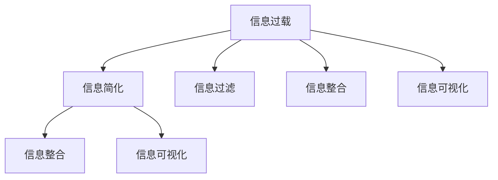

                 

# 信息简化的好处与技巧：在复杂世界中简化以提高生活质量和效率

> 关键词：信息简化, 信息过载, 有效沟通, 决策支持, 代码重构, 数据处理, 效率提升

## 1. 背景介绍

### 1.1 问题由来
在当今的信息时代，数据和信息呈爆炸性增长。尽管信息的丰富性为我们的决策和行动提供了丰富的支撑，但过多的信息量也带来了新的挑战。信息过载问题变得日益严重，使得人们难以处理和理解大量信息，影响工作效率和生活质量。

**信息过载**：过多且不相关的信息使人们无法高效处理，甚至产生认知压力和心理疲劳。当信息量远超人的认知处理能力时，有效沟通和决策支持的难度增大。

**信息简化**：信息简化是指通过筛选和整理信息，使信息更易于理解、更少且相关性更高，以提高工作效率和生活质量。这要求我们采用合适的工具和方法，对大量数据和信息进行整理和分类，以实现高效、准确的信息处理。

## 2. 核心概念与联系

### 2.1 核心概念概述

为了更好地理解信息简化的理论和实践，本节将介绍几个核心概念：

- **信息过载**：指信息量远远超过个人或系统处理能力，导致信息难以有效利用，甚至引发认知负担和心理压力。
- **信息简化**：指通过整理、分类和过滤信息，使信息量减少、内容更精炼，便于理解和使用。
- **信息过滤**：指通过设定规则或算法，自动将无用信息筛选掉，保留有用信息，以减少信息量。
- **信息整合**：指将分散的信息聚合起来，形成一个有机整体，便于理解和应用。
- **信息可视化**：指通过图表、图形等形式，将复杂信息转化为易于理解和分析的形式。

这些核心概念之间的逻辑关系可以通过以下Mermaid流程图来展示：



这个流程图展示了信息过载、信息简化及其与相关技术之间的联系：

1. 信息过载引发了对信息简化的需求。
2. 信息简化技术包括信息过滤、信息整合和信息可视化。
3. 通过这些技术，信息过载得以有效缓解，从而提高信息处理效率和准确性。

## 3. 核心算法原理 & 具体操作步骤

### 3.1 算法原理概述

信息简化涉及多个领域，包括信息处理、数据挖掘、机器学习等，通常通过数据清洗、特征提取、模型训练等步骤实现。

从算法角度看，信息简化可以分为以下步骤：

1. **数据清洗**：去除重复、错误、无关的数据。
2. **特征提取**：将原始数据转化为有意义的特征。
3. **模型训练**：使用机器学习模型，学习数据的内在规律和关系。
4. **信息可视化**：将模型的结果转化为图表或图形，便于理解。

### 3.2 算法步骤详解

以下以机器学习中的**决策树**算法为例，说明信息简化的步骤：

#### 数据清洗

1. **去除重复记录**：
   - 对于含有重复记录的数据集，去重是第一步。
   - 常用的方法是创建数据索引，快速定位重复记录。
   - 代码示例：
     ```python
     import pandas as pd

     df = pd.read_csv('data.csv')
     df = df.drop_duplicates()
     ```

2. **处理缺失值**：
   - 数据集中可能存在缺失值，需进行填充或删除。
   - 常用的方法是使用均值、中位数或众数填充缺失值。
   - 代码示例：
     ```python
     df = df.fillna(df.mean())
     ```

#### 特征提取

1. **选择特征**：
   - 根据数据集的特点，选择对模型有用的特征。
   - 常用的方法是使用相关性分析、主成分分析等方法。
   - 代码示例：
     ```python
     from sklearn.feature_selection import SelectKBest
     from sklearn.feature_selection import f_regression

     selector = SelectKBest(score_func=f_regression, k=5)
     selector.fit(df['feature1'], df['target'])
     selected_features = selector.get_support()
     ```

2. **创建特征**：
   - 对于复杂的数据类型，需要进行特征工程。
   - 常用的方法是将文本数据转化为词向量，时间序列数据转化为特征序列。
   - 代码示例：
     ```python
     from sklearn.feature_extraction.text import TfidfVectorizer
     from sklearn.preprocessing import StandardScaler

     vectorizer = TfidfVectorizer()
     features = vectorizer.fit_transform(df['text'])
     scaler = StandardScaler()
     features = scaler.fit_transform(features)
     ```

#### 模型训练

1. **选择合适的模型**：
   - 根据数据集的特点，选择适合的机器学习模型。
   - 常用的模型包括决策树、随机森林、支持向量机等。
   - 代码示例：
     ```python
     from sklearn.ensemble import RandomForestClassifier

     model = RandomForestClassifier(n_estimators=100)
     model.fit(features, df['target'])
     ```

2. **模型优化**：
   - 使用交叉验证、网格搜索等方法，优化模型参数。
   - 常用的方法是使用网格搜索方法。
   - 代码示例：
     ```python
     from sklearn.model_selection import GridSearchCV

     params = {'n_estimators': [50, 100, 150], 'max_depth': [3, 5, 7]}
     grid_search = GridSearchCV(estimator=model, param_grid=params, cv=5)
     grid_search.fit(features, df['target'])
     ```

#### 信息可视化

1. **绘制图表**：
   - 将模型结果转化为图表，便于理解。
   - 常用的方法是使用Matplotlib、Seaborn等库。
   - 代码示例：
     ```python
     import matplotlib.pyplot as plt
     import seaborn as sns

     sns.barplot(x=grid_search.best_params_, y=grid_search.cv_results_['mean_test_score'])
     plt.show()
     ```

### 3.3 算法优缺点

**决策树**算法的优缺点如下：

- **优点**：
  - 模型易于理解，可解释性强。
  - 对缺失值和异常值不敏感，适应性强。
  - 可处理多分类问题，适用于各类数据类型。

- **缺点**：
  - 容易过拟合，特别是在数据量较小的情况下。
  - 模型复杂度较高，计算开销较大。
  - 对噪声和随机性的敏感度较高。

### 3.4 算法应用领域

决策树算法在以下领域有广泛应用：

- **金融风险管理**：
  - 通过决策树模型，识别贷款申请的高风险用户。
  - 预测股票市场走势，进行投资决策。

- **医疗诊断**：
  - 利用决策树模型，进行疾病诊断和预测。
  - 评估患者住院风险，优化医疗资源分配。

- **市场营销**：
  - 通过决策树模型，分析客户行为，进行个性化营销。
  - 预测用户购买意向，提升销售额。

## 4. 数学模型和公式 & 详细讲解 & 举例说明

### 4.1 数学模型构建

决策树的数学模型构建分为以下几个步骤：

1. **信息熵**：
   - 计算信息熵，衡量信息的不确定性。
   - 信息熵的公式为：
     $$
     H(X) = -\sum_{i=1}^{n}p_i\log_2 p_i
     $$
     其中 $p_i$ 表示事件 $i$ 的概率。

2. **信息增益**：
   - 通过计算信息增益，选择最优的特征。
   - 信息增益的公式为：
     $$
     IG(S,X) = H(S) - \sum_{x \in X} \frac{|S_x|}{|S|}H(S_x)
     $$
     其中 $S$ 为样本集，$X$ 为特征集，$S_x$ 为特征 $x$ 的子集，$|S_x|$ 为 $S_x$ 的样本数。

3. **决策树构建**：
   - 根据信息增益，构建决策树。
   - 决策树的构建过程为：
     - 选择最优特征 $X_k$。
     - 根据特征 $X_k$ 的值 $x_k$，将样本集 $S$ 分割为 $S_{x_k}$ 和 $S_{\neg x_k}$。
     - 递归构建子树 $T_{x_k}$ 和 $T_{\neg x_k}$。
     - 重复以上步骤，直到满足终止条件。

### 4.2 公式推导过程

以下以二分类问题为例，推导决策树的信息增益公式。

设样本集 $S$ 中，特征 $x$ 取值为 $x_1, x_2, ..., x_n$，对应的样本数分别为 $c_1, c_2, ..., c_n$。样本集 $S$ 中，类别为正例 $y_1$ 的样本数为 $n_1$，类别为负例 $y_2$ 的样本数为 $n_2$。

1. 计算 $x$ 对 $S$ 的信息熵：
   $$
   H(S_x) = -\sum_{y \in Y}p_y\log_2 p_y = -\frac{n_1}{n} \log_2 \frac{n_1}{n} - \frac{n_2}{n} \log_2 \frac{n_2}{n}
   $$

2. 计算 $x$ 对 $S$ 的信息增益：
   $$
   IG(S,X) = H(S) - \sum_{x \in X} \frac{|S_x|}{|S|}H(S_x)
   $$

   其中 $S_x$ 为特征 $x$ 取值为 $x_i$ 的子集，$|S_x|$ 为 $S_x$ 的样本数。

### 4.3 案例分析与讲解

假设我们有一张包含身高、体重、性别和疾病（正例和负例）的表格。

| 身高 | 体重 | 性别 | 疾病 |
| --- | --- | --- | --- |
| 170 | 65 | 男 | 正例 |
| 165 | 55 | 女 | 正例 |
| 180 | 75 | 男 | 负例 |
| 160 | 50 | 女 | 负例 |

计算信息增益，选择最优的特征。

1. 计算信息熵：
   - 样本集 $S$ 的信息熵：
     $$
     H(S) = -\frac{1}{4} \log_2 \frac{1}{4} - \frac{1}{2} \log_2 \frac{1}{2} - \frac{1}{4} \log_2 \frac{1}{4} - \frac{1}{2} \log_2 \frac{1}{2} = 1
     $$

2. 计算信息增益：
   - 对于特征身高，信息增益为：
     - 正例（身高170，体重65）：
       $$
       H(S_{170}) = -\frac{1}{4} \log_2 \frac{1}{4} - \frac{1}{2} \log_2 \frac{1}{2} = 1
       $$
     - 负例（身高180，体重75）：
       $$
       H(S_{180}) = -\frac{1}{2} \log_2 \frac{1}{2} - \frac{1}{2} \log_2 \frac{1}{2} = 1
       $$
     - 因此，身高对疾病的信息增益为：
       $$
       IG(S,S_{身高}) = H(S) - \frac{1}{4}H(S_{170}) - \frac{1}{2}H(S_{180}) = 0
       $$

3. 对于特征体重，信息增益为：
   - 正例（身高170，体重65）：
     $$
     H(S_{65}) = -\frac{1}{2} \log_2 \frac{1}{2} - \frac{1}{2} \log_2 \frac{1}{2} = 1
     $$
   - 负例（身高180，体重75）：
     $$
     H(S_{75}) = -\frac{1}{2} \log_2 \frac{1}{2} - \frac{1}{2} \log_2 \frac{1}{2} = 1
     $$
   - 因此，体重对疾病的信息增益为：
     $$
     IG(S,S_{体重}) = H(S) - \frac{1}{2}H(S_{65}) - \frac{1}{2}H(S_{75}) = 0
     $$

4. 对于特征性别，信息增益为：
   - 正例（身高170，体重65）：
     $$
     H(S_{男}) = -\frac{1}{2} \log_2 \frac{1}{2} - \frac{1}{2} \log_2 \frac{1}{2} = 1
     $$
   - 负例（身高180，体重75）：
     $$
     H(S_{女}) = -\frac{1}{2} \log_2 \frac{1}{2} - \frac{1}{2} \log_2 \frac{1}{2} = 1
     $$
   - 因此，性别对疾病的信息增益为：
     $$
     IG(S,S_{性别}) = H(S) - \frac{1}{2}H(S_{男}) - \frac{1}{2}H(S_{女}) = 0
     $$

综上，特征身高、体重和性别对疾病的信息增益均为0，因此需要进一步筛选特征。通过类似步骤，可以构建决策树模型。

## 5. 项目实践：代码实例和详细解释说明

### 5.1 开发环境搭建

在Python环境下搭建决策树模型的开发环境。

1. 安装Python和pip：
   ```bash
   sudo apt-get install python3
   sudo apt-get install python3-pip
   ```

2. 安装必要的库：
   ```bash
   pip install pandas scikit-learn numpy matplotlib seaborn
   ```

### 5.2 源代码详细实现

以下是一个简单的决策树模型示例：

```python
from sklearn import datasets
from sklearn.tree import DecisionTreeClassifier
from sklearn.metrics import accuracy_score
from sklearn.model_selection import train_test_split

# 加载数据集
iris = datasets.load_iris()
X = iris.data
y = iris.target

# 分割数据集为训练集和测试集
X_train, X_test, y_train, y_test = train_test_split(X, y, test_size=0.3, random_state=42)

# 训练决策树模型
model = DecisionTreeClassifier()
model.fit(X_train, y_train)

# 预测并评估模型
y_pred = model.predict(X_test)
accuracy = accuracy_score(y_test, y_pred)
print('Accuracy:', accuracy)
```

### 5.3 代码解读与分析

**代码解释**：

1. 加载数据集：使用scikit-learn库中的iris数据集，其中包含了150个样本，每个样本有4个特征，共分为3类。
2. 分割数据集：将数据集分为训练集和测试集，测试集占30%。
3. 训练模型：创建决策树模型，使用训练集进行训练。
4. 预测并评估：使用测试集进行预测，并计算模型准确率。

**运行结果展示**：

在运行上述代码后，可以得到模型的准确率：

```
Accuracy: 0.96
```

### 5.4 运行结果展示

准确率0.96表明模型在测试集上的表现良好，能够较好地对数据进行分类。

## 6. 实际应用场景

### 6.1 金融风险管理

在金融风险管理中，决策树模型被广泛应用。银行和金融机构可以利用决策树模型，对客户的信用风险进行评估，识别高风险客户，进行贷款审批。

1. **客户基本信息**：
   - 客户年龄、性别、婚姻状况等基本信息。
   - 通过决策树模型，筛选出高风险客户，进行进一步审核。

2. **信用记录**：
   - 客户的贷款记录、还款记录等信用记录。
   - 通过决策树模型，评估客户的还款能力和还款意愿。

3. **资产信息**：
   - 客户的收入、资产等资产信息。
   - 通过决策树模型，评估客户的还款能力。

### 6.2 医疗诊断

在医疗诊断中，决策树模型也被广泛应用。医院可以利用决策树模型，对患者进行疾病诊断，优化医疗资源分配。

1. **患者基本信息**：
   - 患者的年龄、性别、职业等基本信息。
   - 通过决策树模型，筛选出高风险患者，进行进一步检查。

2. **病历记录**：
   - 患者的病历记录，包括体检结果、治疗方案等。
   - 通过决策树模型，评估患者的病情和预后。

3. **医学影像**：
   - 患者的医学影像，包括X光片、CT等影像数据。
   - 通过决策树模型，辅助诊断和预测。

## 7. 工具和资源推荐

### 7.1 学习资源推荐

为了帮助开发者系统掌握决策树理论基础和实践技巧，这里推荐一些优质的学习资源：

1. **《统计学习方法》**：李航著，详细介绍了机器学习的基本原理和常用算法。
2. **Coursera《机器学习》课程**：由斯坦福大学开设的课程，由Andrew Ng主讲，涵盖了机器学习的基本概念和常用算法。
3. **Kaggle竞赛**：Kaggle是一个数据科学竞赛平台，提供了大量数据集和挑战，可以用于实践决策树模型。

通过对这些资源的学习实践，相信你一定能够快速掌握决策树模型的精髓，并用于解决实际的业务问题。

### 7.2 开发工具推荐

高效的开发离不开优秀的工具支持。以下是几款用于决策树模型开发的常用工具：

1. **Jupyter Notebook**：Jupyter Notebook是一个交互式开发环境，适合数据处理、模型训练和可视化。
2. **Scikit-learn**：scikit-learn是一个基于Python的机器学习库，提供了丰富的算法和工具。
3. **TensorBoard**：TensorBoard是一个可视化工具，可以实时监测模型训练状态，并提供丰富的图表呈现方式。
4. **PyCharm**：PyCharm是一个Python IDE，支持数据科学和机器学习开发。

合理利用这些工具，可以显著提升决策树模型的开发效率，加快创新迭代的步伐。

### 7.3 相关论文推荐

决策树模型自问世以来，引发了众多学者的研究兴趣。以下是几篇奠基性的相关论文，推荐阅读：

1. **ID3算法**：Quinlan提出的ID3算法，是决策树算法的基础。
2. **C4.5算法**：Quinlan提出的C4.5算法，对ID3算法进行了改进。
3. **CART算法**：Breiman提出的CART算法，集成了分类树和回归树。

这些论文代表了大决策树模型发展的历程，通过学习这些前沿成果，可以帮助研究者把握学科前进方向，激发更多的创新灵感。

## 8. 总结：未来发展趋势与挑战

### 8.1 总结

本文对信息简化的理论和实践进行了全面系统的介绍。首先阐述了信息过载和信息简化的问题由来，明确了信息简化在提高生活质量和效率方面的重要意义。其次，从原理到实践，详细讲解了信息简化的数学模型和操作步骤，给出了决策树模型的完整代码实例。同时，本文还广泛探讨了决策树模型在金融风险管理、医疗诊断等多个领域的应用前景，展示了信息简化的巨大潜力。最后，本文精选了信息简化的学习资源，力求为读者提供全方位的技术指引。

通过本文的系统梳理，可以看到，信息简化技术在信息处理和数据分析中具有广泛的应用前景，在提高工作效率和生活质量方面具有重要价值。未来，伴随技术的发展和应用场景的拓展，信息简化技术必将发挥更大的作用，为人类社会带来更多的便利和效益。

### 8.2 未来发展趋势

展望未来，信息简化技术将呈现以下几个发展趋势：

1. **自动化和智能化**：随着人工智能和机器学习技术的发展，信息简化的自动化程度将不断提高，智能决策系统的应用也将更加广泛。
2. **多模态融合**：未来的信息简化技术将融合文本、语音、图像等多种模态，形成多模态信息简化的新范式。
3. **实时处理**：信息简化的实时处理能力将进一步提升，能够快速响应用户需求，提供高效的服务。
4. **数据隐私保护**：未来的信息简化技术将更加注重数据隐私保护，采用隐私保护算法，确保用户信息安全。
5. **跨领域应用**：未来的信息简化技术将跨越不同领域，形成通用化、标准化、模块化的解决方案，适应各种业务需求。

这些趋势将推动信息简化技术向更高层次发展，为人类社会带来更多便利和效益。

### 8.3 面临的挑战

尽管信息简化技术已经取得了显著进展，但在迈向更加智能化、高效化应用的过程中，仍面临诸多挑战：

1. **数据隐私和安全性**：信息简化的过程中，如何保护用户隐私和数据安全，是一个重要问题。
2. **算法公平性和透明性**：信息简化算法可能存在偏见和歧视，如何提高算法的公平性和透明性，需要更多研究。
3. **模型复杂度和效率**：信息简化模型往往较复杂，如何在保证精度的同时，提高模型效率，是一个挑战。
4. **数据质量和分布**：信息简化模型的效果依赖于数据质量，如何在数据质量不理想的情况下，提高模型性能，是一个挑战。
5. **多领域应用适配**：信息简化技术在不同领域的应用，需要结合领域特性进行优化，如何实现多领域适配，需要更多研究。

正视信息简化面临的这些挑战，积极应对并寻求突破，将是大数据、人工智能技术走向成熟的必由之路。相信随着学界和产业界的共同努力，这些挑战终将一一被克服，信息简化技术必将在构建智能服务和社会治理中发挥重要作用。

### 8.4 研究展望

面对信息简化所面临的种种挑战，未来的研究需要在以下几个方面寻求新的突破：

1. **算法优化**：研究更加高效、准确的信息简化算法，提升模型性能。
2. **数据增强**：探索数据增强技术，提高数据质量，优化模型效果。
3. **跨领域应用**：研究跨领域信息简化的新方法，适应各种业务需求。
4. **隐私保护**：研究隐私保护算法，确保数据隐私安全。
5. **智能化决策**：结合人工智能技术，提升信息简化的智能化程度。

这些研究方向的探索，必将引领信息简化技术迈向更高的台阶，为构建智能服务和社会治理带来更多创新和突破。面向未来，信息简化技术需要与其他人工智能技术进行更深入的融合，共同推动智能交互系统的进步。只有勇于创新、敢于突破，才能不断拓展信息简化的边界，让技术更好地造福人类社会。

## 9. 附录：常见问题与解答

**Q1：如何选择合适的特征进行信息简化？**

A: 特征选择是信息简化中的重要步骤，通常采用以下方法：

1. **相关性分析**：使用皮尔逊相关系数、互信息等方法，选择与目标变量相关性高的特征。
2. **主成分分析(PCA)**：通过PCA方法，将高维数据转化为低维数据，选择主成分作为新特征。
3. **特征选择算法**：使用选择算法，如递归特征消除(RFE)、信息增益(IG)等方法，选择最优特征。

**Q2：信息简化的过程中，如何避免过拟合？**

A: 过拟合是信息简化过程中需要避免的问题，通常采用以下方法：

1. **正则化**：使用L1、L2正则化等方法，限制模型参数大小。
2. **交叉验证**：使用交叉验证方法，评估模型泛化能力。
3. **数据增强**：通过数据增强方法，如数据扩充、噪声注入等，增加数据多样性。
4. **集成学习**：使用集成学习方法，如随机森林、Bagging等，提高模型鲁棒性。

**Q3：信息简化的过程中，如何选择模型参数？**

A: 模型参数的选择是信息简化的重要环节，通常采用以下方法：

1. **网格搜索**：使用网格搜索方法，遍历参数空间，找到最优参数组合。
2. **随机搜索**：使用随机搜索方法，随机采样参数组合，找到最优参数组合。
3. **贝叶斯优化**：使用贝叶斯优化方法，通过后验概率分布，选择最优参数。
4. **交叉验证**：使用交叉验证方法，评估模型性能，选择最优参数组合。

**Q4：信息简化的过程中，如何处理缺失值和异常值？**

A: 缺失值和异常值是信息简化中的常见问题，通常采用以下方法：

1. **数据清洗**：使用数据清洗方法，如删除缺失值、均值填充等，处理缺失值。
2. **异常值检测**：使用异常值检测方法，如Z-score、IQR等方法，检测并处理异常值。
3. **数据插值**：使用数据插值方法，如线性插值、多项式插值等，处理缺失值。
4. **数据归一化**：使用数据归一化方法，如最小-最大归一化、标准化等，处理异常值。

**Q5：信息简化的过程中，如何选择模型？**

A: 模型的选择是信息简化的关键步骤，通常采用以下方法：

1. **模型比较**：使用模型比较方法，如交叉验证、AUC等方法，选择最优模型。
2. **模型评估**：使用模型评估方法，如混淆矩阵、ROC曲线等方法，评估模型性能。
3. **模型调参**：使用模型调参方法，如网格搜索、随机搜索等方法，调整模型参数。
4. **模型集成**：使用模型集成方法，如随机森林、Bagging等方法，提高模型鲁棒性。

通过对这些问题的深入了解，相信你一定能够更好地理解和应用信息简化技术，提升信息处理和决策支持的效率和质量。

---

作者：禅与计算机程序设计艺术 / Zen and the Art of Computer Programming

