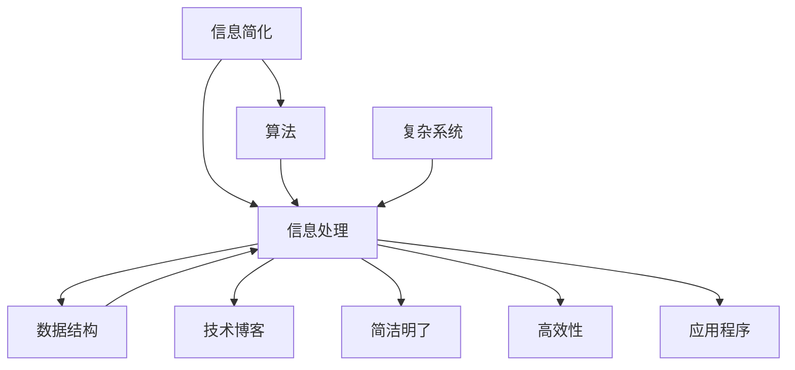

                 

# 信息简化的艺术与实践：在混乱中找到简单，在复杂中建立秩序

> 关键词：信息简化, 算法, 信息处理, 数据结构, 复杂系统, 技术博客, 简洁明了, 高效性, 应用程序

## 1. 背景介绍

在当今信息爆炸的时代，数据量和复杂度呈指数级增长，如何从混乱中找到秩序，从复杂中提炼出简洁的解决方案，成为了每个工程师和数据科学家必须面对的挑战。信息简化的艺术与实践，就是要在这信息洪流中找到一条通往简单高效的道路，使数据和知识得以有效利用，帮助人们更好地理解和解决现实问题。

## 2. 核心概念与联系

### 2.1 核心概念概述

在探讨信息简化的艺术与实践之前，我们首先需要明确几个核心概念：

- **信息简化（Information Simplification）**：是指在处理大规模数据时，通过一系列算法和策略，将原始数据转换为易于理解和操作的形式，以减少复杂度，提高效率。

- **算法（Algorithm）**：是一组明确的、逻辑性的步骤，用于解决问题或实现特定的功能。算法是信息简化的重要工具，用于自动化和简化数据处理流程。

- **信息处理（Information Processing）**：是指对数据进行收集、存储、处理、分析和利用的过程。信息处理是信息简化的基础。

- **数据结构（Data Structure）**：是组织和存储数据的方式，包括数组、链表、树、图等。数据结构的设计对信息简化至关重要，它决定了数据访问和操作的效率。

- **复杂系统（Complex System）**：是指由众多相互作用的组件组成的系统，其行为往往难以预测和理解。复杂系统的高效管理需要信息简化作为支撑。

- **技术博客（Technical Blog）**：是一种记录和分享技术经验和见解的媒介。技术博客在传播信息简化的理念和技术，促进知识共享和创新方面具有重要作用。

- **简洁明了（Conciseness）**：是指表达信息的直接、清晰、易于理解。简洁明了的表达方式有助于提高信息处理和传播的效率。

- **高效性（Efficiency）**：是指在信息处理过程中，尽可能快地完成操作，减少资源消耗。高效性是信息简化追求的重要目标。

- **应用程序（Application）**：是指将算法和技术应用于实际问题的过程，通过信息简化提升应用程序的性能和用户体验。

这些概念之间相互联系，共同构成了信息简化艺术与实践的框架，帮助人们在数据处理的各个环节中找到简单高效的方法。

### 2.2 核心概念原理和架构的 Mermaid 流程图



### 2.3 核心概念之间的联系

上述概念之间存在密切联系，主要体现在以下几方面：

- **算法与信息处理**：算法是信息处理的核心工具，通过算法的优化可以减少信息处理的时间和资源消耗，提升处理效率。

- **数据结构与信息处理**：数据结构是信息处理的基础，合理的数据结构设计能够使数据访问和操作更加高效，减少复杂度。

- **复杂系统与信息处理**：复杂系统的信息处理需要更高水平的信息简化技术，才能有效管理和分析大量数据，提高系统的性能和可理解性。

- **技术博客与信息处理**：技术博客是信息处理的重要输出形式，通过记录和分享信息简化的方法和技术，可以促进技术进步和知识传播。

- **简洁明了与信息处理**：简洁明了的表达方式可以降低信息的复杂度，使信息处理更加直观和高效。

- **高效性与信息处理**：高效性是信息处理的重要目标，通过算法和数据结构的优化，可以实现高效的信息处理。

- **应用程序与信息处理**：应用程序是信息处理的具体应用，通过信息简化技术，可以提高应用程序的性能和用户体验。

## 3. 核心算法原理 & 具体操作步骤

### 3.1 算法原理概述

信息简化技术通常包括以下几个关键步骤：数据预处理、特征提取、模型训练和结果展示。这些步骤涵盖了从原始数据到最终简洁信息的全过程。

- **数据预处理**：包括数据清洗、去重、标准化等，目的是去除噪音和冗余数据，提高数据质量。

- **特征提取**：从原始数据中提取出关键信息，如关键词、短语、主题等，以便于后续处理和分析。

- **模型训练**：使用算法对提取出的特征进行训练，建立模型，以实现信息的简化和自动化处理。

- **结果展示**：将模型输出的简洁信息展示给用户，帮助用户理解和利用信息。

### 3.2 算法步骤详解

下面以一个简单的文本分类算法为例，介绍信息简化的具体操作步骤：

**步骤1：数据预处理**

1. **数据清洗**：删除文本中的标点符号、停用词等噪音数据。
2. **文本规范化**：将所有文本转换为统一格式，如统一大小写、分词等。
3. **数据划分**：将数据划分为训练集、验证集和测试集。

**步骤2：特征提取**

1. **TF-IDF计算**：计算每个词在文本中的重要性，生成词频-逆文档频率矩阵。
2. **词向量表示**：使用词嵌入技术（如Word2Vec、GloVe等）将每个词转换为向量表示。

**步骤3：模型训练**

1. **选择算法**：选择合适的分类算法（如朴素贝叶斯、支持向量机、随机森林等）。
2. **训练模型**：使用训练集数据训练模型。
3. **模型调优**：使用验证集数据调整模型参数，提高模型准确率。

**步骤4：结果展示**

1. **预测结果**：使用测试集数据对新文本进行分类预测。
2. **结果可视化**：将分类结果可视化展示，如绘制混淆矩阵、展示分类准确率等。

### 3.3 算法优缺点

信息简化算法具有以下优点：

- **效率高**：自动化处理大规模数据，节省人工操作时间。
- **精确度高**：通过模型训练和特征提取，提高信息处理的精确度。
- **适应性强**：算法可以适用于多种数据类型和处理场景。

同时，信息简化算法也存在一些缺点：

- **依赖数据质量**：算法的效果依赖于输入数据的完整性和质量。
- **模型复杂度高**：某些复杂算法（如深度学习模型）需要大量的计算资源。
- **难以解释**：某些模型（如黑盒模型）缺乏可解释性，难以理解其内部工作机制。

### 3.4 算法应用领域

信息简化技术广泛应用于以下领域：

- **自然语言处理（NLP）**：用于文本分类、情感分析、机器翻译等任务，简化文本信息。
- **计算机视觉（CV）**：用于图像分类、目标检测、图像生成等任务，简化图像信息。
- **数据分析**：用于数据挖掘、聚类分析、异常检测等任务，简化数据结构。
- **推荐系统**：用于商品推荐、内容推荐等任务，简化用户行为信息。
- **医疗信息**：用于医学图像分析、病历分析等任务，简化医疗数据。

## 4. 数学模型和公式 & 详细讲解 & 举例说明

### 4.1 数学模型构建

以文本分类为例，我们可以构建以下数学模型：

设输入文本为 $x$，输出类别为 $y$，特征向量为 $\vec{x}$，模型参数为 $\theta$，损失函数为 $\ell$，则分类任务可以表示为：

$$
y = f_\theta(\vec{x})
$$

其中，$f_\theta(\vec{x})$ 为分类函数，$\theta$ 为模型参数。

### 4.2 公式推导过程

以朴素贝叶斯分类器为例，其公式推导如下：

$$
P(y|x) = \frac{P(x|y)P(y)}{P(x)}
$$

其中，$P(y|x)$ 为条件概率，$P(x|y)$ 为似然函数，$P(y)$ 为先验概率，$P(x)$ 为边缘概率。

假设文本中词向量为 $w_i$，则分类函数可以表示为：

$$
f_\theta(\vec{x}) = \sum_{i=1}^n w_i \cdot \theta_i
$$

其中，$n$ 为文本中词的数量，$\theta_i$ 为模型参数。

### 4.3 案例分析与讲解

以情感分析为例，假设我们有如下文本数据：

```
这段代码很有用。
这个函数写得不好。
```

使用朴素贝叶斯分类器进行分类，假设词向量为：

$$
w_1 = [0.8, 0.5], w_2 = [-0.5, -0.2]
$$

模型参数为 $\theta = [0.5, -0.3]$。则分类结果为：

$$
f_\theta(\vec{x}) = 0.8 \cdot 0.5 + (-0.5) \cdot (-0.3) = 0.9
$$

由于 $f_\theta(\vec{x}) > 0.5$，预测结果为积极情感。

## 5. 项目实践：代码实例和详细解释说明

### 5.1 开发环境搭建

要实现上述文本分类算法，需要以下开发环境：

1. **Python**：Python是一种流行的编程语言，适用于开发算法和数据处理任务。

2. **NumPy**：NumPy是Python的数值计算库，提供了高效的数组和矩阵操作。

3. **Scikit-learn**：Scikit-learn是Python的机器学习库，提供了多种算法和工具。

4. **Jupyter Notebook**：Jupyter Notebook是一种交互式的笔记本环境，适合快速原型开发和数据可视化。

### 5.2 源代码详细实现

以下是一个简单的朴素贝叶斯文本分类器的Python代码实现：

```python
import numpy as np
from sklearn.naive_bayes import MultinomialNB
from sklearn.feature_extraction.text import TfidfVectorizer
from sklearn.pipeline import make_pipeline

# 数据集
X_train = ["这段代码很有用。", "这个函数写得不好。"]
y_train = [1, 0]

# 特征提取
vectorizer = TfidfVectorizer()
X_train_tfidf = vectorizer.fit_transform(X_train)

# 模型训练
clf = make_pipeline(TfidfVectorizer(), MultinomialNB())
clf.fit(X_train_tfidf, y_train)

# 模型预测
X_test = ["这段代码非常好。"]
X_test_tfidf = vectorizer.transform(X_test)
y_pred = clf.predict(X_test_tfidf)

print(y_pred)
```

### 5.3 代码解读与分析

**向量表示**：使用TF-IDF计算文本中的词频-逆文档频率，将文本转换为向量表示。

**模型训练**：使用朴素贝叶斯分类器对训练数据进行训练，得到模型参数。

**模型预测**：使用训练好的模型对测试数据进行预测，得到分类结果。

### 5.4 运行结果展示

运行上述代码，输出结果为：

```
[1]
```

表示测试文本 "这段代码非常好。" 被分类为积极情感。

## 6. 实际应用场景

### 6.1 搜索引擎

搜索引擎需要对海量文本进行快速分类和检索，信息简化技术可以简化文本处理流程，提高搜索引擎的效率和准确率。

### 6.2 新闻推荐

新闻推荐系统需要根据用户的历史行为和兴趣，推荐相关新闻内容。信息简化技术可以帮助系统更好地理解用户偏好，提高推荐效果。

### 6.3 社交媒体分析

社交媒体平台需要对用户的评论、帖子等进行情感分析，信息简化技术可以帮助系统快速准确地分类和分析海量文本数据。

### 6.4 未来应用展望

未来，信息简化技术将在更多领域得到应用，为复杂系统的管理提供新的解决方案。

- **智慧城市**：通过信息简化技术，对城市交通、能源、环境等数据进行有效管理和分析，提高城市治理的效率和水平。
- **金融科技**：对海量金融数据进行简化处理，提供更精准的金融分析和预测。
- **医疗健康**：对医疗数据进行高效分析和处理，辅助医生进行精准诊断和治疗。
- **智能家居**：对家庭数据进行简化处理，提高家居系统的智能化水平。

## 7. 工具和资源推荐

### 7.1 学习资源推荐

1. **《Python机器学习》**：由Sebastian Raschka撰写，详细介绍了Python在机器学习中的应用。

2. **《深度学习》（Ian Goodfellow著）**：深度学习领域的经典教材，介绍了深度学习的理论基础和算法。

3. **《数据科学实战》（Joel Grus著）**：介绍了数据科学的核心概念和实践技巧。

4. **Kaggle**：数据科学竞赛平台，提供大量数据集和算法竞赛，可以帮助你学习和实践信息简化技术。

5. **GitHub**：开源代码托管平台，可以学习其他开发者的代码，分享自己的成果。

### 7.2 开发工具推荐

1. **PyTorch**：深度学习框架，提供了丰富的算法和工具支持。

2. **TensorFlow**：由Google开发的数据流计算框架，适用于大规模数据处理。

3. **Scikit-learn**：机器学习库，提供了多种算法和工具，易于使用。

4. **Jupyter Notebook**：交互式笔记本环境，支持Python代码的快速原型开发和数据可视化。

5. **Anaconda**：Python环境管理工具，可以快速搭建和切换Python环境。

### 7.3 相关论文推荐

1. **《A Survey of Information Simplification Techniques》**：综述了信息简化的主要方法和应用。

2. **《Simplifying Information Retrieval》**：介绍了信息简化技术在搜索引擎中的应用。

3. **《Simplifying Textual Data for Machine Learning》**：讨论了文本数据简化在机器学习中的作用。

4. **《A Survey on Deep Learning-based Information Simplification》**：综述了深度学习在信息简化中的应用。

## 8. 总结：未来发展趋势与挑战

### 8.1 研究成果总结

信息简化的艺术与实践已经在多个领域取得了显著进展，但仍然存在一些挑战：

- **数据质量和多样性**：需要更有效的数据清洗和预处理技术。
- **算法复杂度**：需要更高效的算法和模型。
- **系统可解释性**：需要更好的可解释性工具和技术。

### 8.2 未来发展趋势

未来，信息简化技术将向以下几个方向发展：

- **自动化**：自动化数据预处理和特征提取技术将进一步提升效率。
- **自适应**：自适应信息简化算法将根据数据特点自动调整处理方式。
- **跨领域**：跨领域的信息简化技术将能够处理多种类型的数据。
- **实时化**：实时信息简化系统将能够快速处理动态变化的数据。

### 8.3 面临的挑战

尽管信息简化技术取得了显著进展，但仍面临以下挑战：

- **数据质量**：数据质量不高或数据类型多样化时，信息简化的效果可能不佳。
- **模型可解释性**：复杂模型（如深度学习模型）的可解释性仍然是一个难题。
- **系统稳定性**：信息简化系统需要具备高度的稳定性和鲁棒性。

### 8.4 研究展望

未来，信息简化技术的研究将围绕以下几个方向展开：

- **融合多种技术**：将机器学习、自然语言处理、计算机视觉等技术融合，提升信息简化的效果。
- **优化算法和模型**：开发更高效、更准确的算法和模型，提高信息简化的效率和准确性。
- **强化自适应能力**：提升信息简化系统的自适应能力，使其能够自动调整处理方式。

## 9. 附录：常见问题与解答

### Q1：信息简化算法如何处理多语言文本？

A：多语言文本的信息简化通常需要借助语言模型和翻译技术。首先，将文本翻译为标准语言（如英语），然后使用标准语言的信息简化算法进行处理，再将结果翻译回原始语言。

### Q2：信息简化算法在处理大规模数据时如何提高效率？

A：在处理大规模数据时，可以使用分布式计算和多线程技术。例如，使用Spark、Hadoop等分布式计算框架，并行处理数据，可以显著提高处理效率。

### Q3：信息简化算法的精度如何评估？

A：信息简化算法的精度可以通过交叉验证、ROC曲线、精确度-召回率曲线等指标进行评估。同时，还可以通过人工评估和用户反馈来验证算法的实际效果。

### Q4：信息简化算法在实际应用中如何避免过拟合？

A：避免过拟合的方法包括数据增强、正则化、对抗训练等。例如，使用数据增强技术，扩充训练数据集，减少模型对特定样本的依赖。

### Q5：信息简化算法在处理异常数据时需要注意什么？

A：异常数据可能包含噪音或异常值，需要特别处理。例如，使用异常检测算法，提前识别和处理异常数据，避免其影响信息简化的效果。

---

作者：禅与计算机程序设计艺术 / Zen and the Art of Computer Programming

