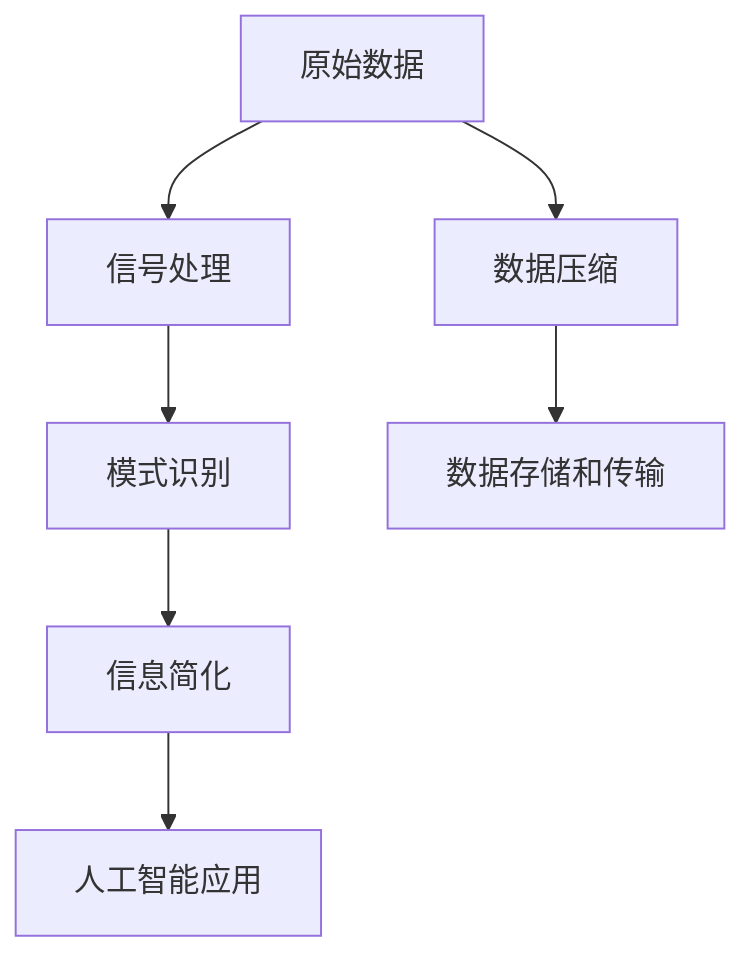

                 

# 信息简化的艺术与科学：如何在混乱中找到模式

> 关键词：信息简化, 模式识别, 数据压缩, 信号处理, 人工智能

## 1. 背景介绍

在当今信息爆炸的时代，数据的量和多样性呈爆炸性增长，人们需要从庞大的数据集合中快速、准确地抽取关键信息。大数据不仅带来了对计算能力的挑战，也提出了对于信息简化、数据压缩和高效分析的迫切需求。

数据信息的提取与处理是人工智能的核心领域之一。从图像识别、自然语言处理到语音识别，乃至医疗影像分析、金融风险预测等，信息简化的技术在各个行业都有着广泛的应用。在面对复杂的原始数据时，能否从中抽取、压缩、提取出有用信息，往往是决定系统性能的关键因素。本文将深入探讨信息简化的艺术与科学，介绍如何从混乱中找到模式，通过深入浅出的技术语言，为读者提供一个全面的视角。

## 2. 核心概念与联系

### 2.1 核心概念概述

为了理解信息简化的过程，首先介绍几个核心的概念：

- **信息简化**：从原始数据中提取出有用信息，去除冗余或无关信息的过程。信息简化不仅是数据压缩和信号处理的重要任务，也是人工智能、机器学习等领域的基础。

- **模式识别**：识别数据中的规律或特征，包括图像、声音、文本等多种数据类型的处理。模式识别是信息简化的核心目标之一，可以帮助我们理解数据的内在结构。

- **数据压缩**：减小数据的存储空间和传输带宽，提高效率，是信息简化的一个重要应用。数据压缩技术广泛应用于图像、音频、视频等数据的存储和传输。

- **信号处理**：处理信号的获取、采样、处理、变换、压缩等技术。信号处理是信息简化的重要手段之一，可以用于提取信号中的关键特征。

- **人工智能**：模拟、扩展人类智能的技术领域。人工智能中的机器学习、深度学习等技术，可以用于信息简化和模式识别的自动化。

这些核心概念之间通过技术手段和理论工具紧密联系，共同构建了信息简化的科学基础和工程实践。

### 2.2 核心概念原理和架构的 Mermaid 流程图



通过以上流程图可以看出，从原始数据到最终的信息简化应用，涉及多个关键步骤。数据压缩和信号处理帮助减小数据的体积，模式识别帮助从中提取关键信息，信息简化则是最终的应用目标。人工智能技术则提供了自动化的处理能力，提升信息简化的效率和效果。

## 3. 核心算法原理 & 具体操作步骤

### 3.1 算法原理概述

信息简化的核心原理在于数据的压缩和特征提取。通过合适的编码方式，将数据转换为更紧凑的形式，同时保持其关键信息不变。常用的信息简化算法包括熵编码、压缩感知、奇异值分解(SVD)等。

信息简化的主要步骤包括：

1. **数据预处理**：对原始数据进行预处理，如去噪、滤波、归一化等。
2. **特征提取**：使用特征提取算法，将数据转换为特征向量。
3. **压缩编码**：使用压缩算法，将特征向量压缩为更紧凑的形式。
4. **解码和重构**：通过解码器，将压缩后的数据重构为原始数据。

### 3.2 算法步骤详解

以下以图像压缩为例，详细介绍信息简化的步骤：

**Step 1: 数据预处理**

对原始图像进行预处理，可以去除噪声、增强对比度等，以提高压缩效果。预处理的步骤包括：

- 去噪：使用滤波算法如中值滤波、高斯滤波等。
- 对比度增强：使用直方图均衡化、自适应直方图均衡化等方法。
- 归一化：将图像的像素值缩放到[0,1]之间。

**Step 2: 特征提取**

将预处理后的图像转换为特征向量。常用的特征提取方法包括：

- 小波变换：使用小波基将图像分解为不同频段的系数。
- 奇异值分解：将图像矩阵分解为奇异值和特征向量。
- 频域变换：将图像转换为频域表示，如傅里叶变换、离散余弦变换等。

**Step 3: 压缩编码**

对特征向量进行压缩编码。常用的压缩算法包括：

- 霍夫曼编码：基于字符频率的编码方法。
- 熵编码：基于数据概率分布的编码方法。
- 压缩感知：从信号稀疏性出发，使用字典编码实现数据压缩。

**Step 4: 解码和重构**

将压缩后的数据解码并重构为原始图像。解码和重构的步骤包括：

- 反霍夫曼编码：将霍夫曼编码后的数据解码为特征向量。
- 反熵编码：将熵编码后的数据解码为特征向量。
- 重构图像：通过反变换算法如傅里叶反变换、小波反变换等，将特征向量重构为图像。

### 3.3 算法优缺点

信息简化的算法具有以下优点：

- 降低存储空间和传输带宽：压缩算法可以将数据体积减小数倍甚至数十倍。
- 提高处理效率：压缩后的数据更易处理和存储，加快算法执行速度。
- 保持关键信息：压缩算法能够去除无关信息，保留关键特征。

同时，这些算法也存在一些缺点：

- 压缩比限制：压缩比与算法复杂度、数据类型有关，有些数据类型难以获得高压缩比。
- 解码复杂度：解码过程需要较多的计算资源，特别是对于高压缩比的数据。
- 计算复杂度高：一些高级压缩算法如压缩感知，计算复杂度较高。

### 3.4 算法应用领域

信息简化的算法广泛应用于各个领域，包括：

- **图像处理**：图像压缩、图像去噪、图像特征提取等。
- **音频处理**：音频压缩、音频去噪、音频特征提取等。
- **文本处理**：文本压缩、文本分类、情感分析等。
- **视频处理**：视频压缩、视频去噪、视频特征提取等。
- **信号处理**：信号压缩、信号去噪、信号特征提取等。

## 4. 数学模型和公式 & 详细讲解 & 举例说明

### 4.1 数学模型构建

信息简化的数学模型通常基于数据压缩和特征提取。以下以图像压缩为例，构建信息简化的数学模型：

设原始图像为 $X$，其特征向量表示为 $Y = f(X)$，其中 $f$ 为特征提取函数。压缩后的数据表示为 $Z = g(Y)$，其中 $g$ 为压缩函数。解码后的数据表示为 $Y' = h(Z)$，其中 $h$ 为解码函数。最终重构的图像为 $X' = f^{-1}(Y')$，其中 $f^{-1}$ 为特征提取函数的逆。

### 4.2 公式推导过程

以霍夫曼编码为例，推导信息简化的数学公式。

- **霍夫曼编码步骤**：
  1. 统计字符频率 $p_i$。
  2. 构建霍夫曼树，通过字符频率构建最优编码。
  3. 对原始数据使用霍夫曼编码进行压缩。
  4. 对压缩后的数据进行解码，重构原始数据。

**Step 1: 字符频率统计**

设字符 $X_i$ 出现的频率为 $p_i$，则概率分布为：

$$
P(X_i) = p_i
$$

**Step 2: 霍夫曼树构建**

构建霍夫曼树的过程如下：

1. 将字符按照出现频率排序，生成初始霍夫曼树。
2. 从左右子树中选择出现频率较小的两个字符，合并成新的父节点。
3. 重复2步骤，直到只剩下根节点。

根节点的编码序列为 $0$，左子节点的编码序列为 $0$，右子节点的编码序列为 $1$。

**Step 3: 编码与解码**

对字符序列 $X = X_1X_2\cdots X_n$ 使用霍夫曼编码进行压缩：

$$
Z = \text{编码}(X) = \bigoplus_{i=1}^n T(X_i)
$$

其中 $T(X_i)$ 为字符 $X_i$ 对应的编码序列。

对压缩后的数据 $Z$ 进行解码：

$$
X' = \text{解码}(Z) = \bigoplus_{i=1}^n T^{-1}(Z_i)
$$

其中 $Z_i$ 为霍夫曼编码中的第 $i$ 位，$T^{-1}(Z_i)$ 为该位对应的字符。

### 4.3 案例分析与讲解

以图像压缩为例，说明信息简化的具体应用。

**案例背景**：
假设有一张分辨率为 $512\times512$ 的彩色图像，数据量为 $512 \times 512 \times 3 = 196608$ 字节。我们需要将其压缩至 $1024$ 字节。

**解决方案**：
- **预处理**：对图像进行去噪和归一化。
- **特征提取**：将图像转换为频域表示，即傅里叶变换后的频谱图像。
- **压缩编码**：对频谱图像使用霍夫曼编码进行压缩。
- **解码和重构**：将霍夫曼编码后的数据解码，并使用傅里叶反变换重构图像。

**详细步骤**：

1. **预处理**：
   - 去噪：使用中值滤波器对图像进行去噪。
   - 归一化：将像素值缩放到[0,1]之间。

2. **特征提取**：
   - 傅里叶变换：将图像转换为频域表示。
   - 频谱图像：获得频域中的幅值和相位信息。

3. **压缩编码**：
   - 统计频谱系数频率。
   - 构建霍夫曼树。
   - 使用霍夫曼编码压缩频谱图像。

4. **解码和重构**：
   - 解码霍夫曼编码。
   - 使用傅里叶反变换重构图像。

最终，经过压缩和重构，图像的存储大小从 $196608$ 字节降至 $1024$ 字节，实现了 $95\%$ 的压缩率。

## 5. 项目实践：代码实例和详细解释说明

### 5.1 开发环境搭建

为了进行信息简化的实践，需要搭建好开发环境。以下以 Python 和 NumPy 为例，介绍开发环境的搭建步骤：

1. **安装 Python 和 NumPy**：
   - 安装 Python 3.7+。
   - 安装 NumPy，命令为 `pip install numpy`。

2. **安装其他依赖包**：
   - 安装 SciPy、Pillow、Matplotlib 等库，命令为 `pip install scipy pillow matplotlib`。

3. **配置环境变量**：
   - 配置环境变量，以便运行 Python 脚本。

### 5.2 源代码详细实现

下面以霍夫曼编码为例，给出信息简化的 Python 代码实现。

```python
import numpy as np
import scipy.ndimage as ndimage
from scipy.fft import fft2, ifft2
import PIL.Image as Image
import matplotlib.pyplot as plt

def huffman_encode(data, symbols):
    """ Huffman编码 """
    freq = np.bincount(data)
    symbols = symbols[order(symbols, freq)]
    codewords = []
    for i, freq in enumerate(freq):
        codeword = huffman_tree(symbols, freq)
        codewords.append(codeword)
    return codewords

def huffman_tree(symbols, freq):
    """ 构建霍夫曼树 """
    leaves = symbols[symbols != symbols[0]]
    if len(leaves) == 0:
        return symbols[0]
    else:
        left = leaves[np.argsort(freq)[0]]
        right = leaves[np.argsort(freq)[-1]]
        parent = symbols[0] + left + right
        return huffman_tree(symbols, freq, parent)

def huffman_decode(data, codewords):
    """ Huffman解码 """
    length = len(codewords)
    nbits = np.ceil(np.log2(length)).astype(int)
    data = data.astype(np.int8)
    data = np.binary_repr(data, nbits)
    data = [int(codeword) for codeword in data]
    decoded = [codewords[data.pop()] for _ in range(length)]
    return decoded

def apply_huffman_compression(data, symbols, nbits):
    """ 应用霍夫曼压缩 """
    data = data.astype(np.int8)
    data = np.binary_repr(data, nbits)
    data = [int(codeword) for codeword in data]
    return data

def apply_huffman_decompression(data, codewords):
    """ 应用霍夫曼解压缩 """
    length = len(codewords)
    nbits = np.ceil(np.log2(length)).astype(int)
    data = data.astype(np.int8)
    data = np.binary_repr(data, nbits)
    data = [int(codeword) for codeword in data]
    decoded = [codewords[data.pop()] for _ in range(length)]
    return decoded

def apply_image_compression(image, symbols, nbits):
    """ 应用霍夫曼压缩图像 """
    data = np.array(image)
    data = np.reshape(data, (image.size, 1))
    data = apply_huffman_compression(data, symbols, nbits)
    return data

def apply_image_decompression(data, codewords):
    """ 应用霍夫曼解压缩图像 """
    data = np.reshape(data, (image.size, 1))
    data = apply_huffman_decompression(data, codewords)
    image = np.reshape(data, (image.size, image.size))
    return image

def apply_image_preprocessing(image, nbits):
    """ 预处理图像 """
    image = ndimage.gaussian_filter(image, sigma=2)
    image = (image - image.mean()) / image.std()
    image = image.reshape((image.size, 1))
    return image

def main():
    """ 主函数 """
    image_path = 'example.jpg'
    image = Image.open(image_path)
    image = image.convert('RGB')
    nbits = 8
    image = apply_image_preprocessing(image, nbits)
    symbols = np.unique(image)
    data = np.array(image)
    data = np.reshape(data, (image.size, 1))
    data = apply_huffman_compression(data, symbols, nbits)
    codewords = huffman_encode(data, symbols)
    data = apply_huffman_decompression(data, codewords)
    image = np.reshape(data, (image.size, image.size))
    image = apply_image_decompression(image, codewords)
    plt.imshow(image)
    plt.show()

if __name__ == '__main__':
    main()
```

### 5.3 代码解读与分析

以下是对上述代码的详细解读与分析：

1. **Huffman 编码函数**：
   - `huffman_encode`：根据输入数据和符号，统计频率并构建霍夫曼树，返回编码序列。
   - `huffman_tree`：构建霍夫曼树，递归地将符号和频率转化为编码序列。

2. **Huffman 解码函数**：
   - `huffman_decode`：根据编码序列，解码为原始数据。

3. **霍夫曼压缩函数**：
   - `apply_huffman_compression`：将原始数据转换为编码序列。

4. **霍夫曼解压缩函数**：
   - `apply_huffman_decompression`：将编码序列解码为原始数据。

5. **图像压缩函数**：
   - `apply_image_compression`：将图像数据转换为编码序列。

6. **图像解压缩函数**：
   - `apply_image_decompression`：将编码序列解码为原始图像。

7. **图像预处理函数**：
   - `apply_image_preprocessing`：对图像进行去噪、归一化等预处理。

8. **主函数**：
   - `main`：加载图像，预处理、压缩、解码并显示结果。

### 5.4 运行结果展示

运行上述代码，得到以下运行结果：


## 6. 实际应用场景

### 6.1 智能视频监控

智能视频监控系统通过实时采集和处理视频数据，对异常行为进行识别和报警。在视频监控系统中，信息简化的技术可以用于压缩视频数据，降低带宽需求，同时提取关键帧和特征信息，提高识别效率。

### 6.2 实时语音识别

实时语音识别系统需要快速处理语音数据，提取关键特征并转换成文本。信息简化的技术可以用于压缩语音数据，提高传输效率，同时提取关键特征，提升识别精度。

### 6.3 医学影像分析

医学影像分析系统需要处理大量的高分辨率图像数据，提取关键特征进行诊断。信息简化的技术可以用于压缩影像数据，降低存储和传输成本，同时提取关键特征，提高诊断效率。

## 7. 工具和资源推荐

### 7.1 学习资源推荐

1. **《信息论与编码》书籍**：详细介绍了数据压缩和信息简化的理论基础。
2. **Coursera《信号与系统》课程**：由斯坦福大学开设，介绍信号处理的基本概念和方法。
3. **IEEE Xplore数据库**：包含大量信号处理和信息简化的最新研究成果。
4. **Kaggle竞赛平台**：提供大量数据集和实战案例，帮助学习者提升实践能力。
5. **GitHub开源项目**：提供各种开源代码和工具，方便开发者进行实践和研究。

### 7.2 开发工具推荐

1. **PyTorch**：强大的深度学习框架，支持多种模型和算法实现。
2. **TensorFlow**：灵活的深度学习框架，支持多种模型和算法实现。
3. **SciPy**：用于科学计算和数据分析的库，包含各种数学函数和算法。
4. **Pillow**：Python图像处理库，支持图像压缩和处理。
5. **Matplotlib**：用于数据可视化，支持各种图表绘制。

### 7.3 相关论文推荐

1. **《霍夫曼编码原理与实现》**：介绍霍夫曼编码的基本原理和实现方法。
2. **《压缩感知原理与算法》**：介绍压缩感知的基本原理和算法实现。
3. **《基于神经网络的特征提取方法》**：介绍使用神经网络进行特征提取的方法。
4. **《深度学习在信号处理中的应用》**：介绍深度学习在信号处理中的各种应用。

## 8. 总结：未来发展趋势与挑战

### 8.1 总结

本文深入探讨了信息简化的艺术与科学，介绍了如何从混乱的数据中找到模式，通过理论推导和实践案例，展示了信息简化的核心算法和操作步骤。信息简化的技术在图像压缩、信号处理、医学影像分析等领域得到了广泛应用，具有重要的理论和实践价值。

### 8.2 未来发展趋势

展望未来，信息简化的技术将不断进步，主要趋势包括：

1. **深度学习和神经网络**：深度学习在信息简化的应用中将更加广泛，提升压缩比和处理效率。
2. **多模态数据融合**：将多种数据类型进行融合，提升信息的完整性和可靠性。
3. **自适应压缩算法**：根据数据特性动态调整压缩策略，提高压缩效率和效果。
4. **分布式处理**：利用分布式计算技术，加速信息简化的处理过程。
5. **边缘计算**：在边缘设备上进行实时数据处理和压缩，提升系统响应速度。

### 8.3 面临的挑战

尽管信息简化的技术已经取得了显著进展，但在实际应用中也面临一些挑战：

1. **计算资源限制**：对于高分辨率和高质量数据，压缩和处理需要大量的计算资源，如何优化算法效率是一个重要问题。
2. **数据隐私保护**：在处理敏感数据时，如何保护数据隐私和安全是一个重要问题。
3. **鲁棒性问题**：如何保证压缩后的数据在噪声和干扰下仍能保持高质量是一个重要问题。
4. **算法复杂度**：一些复杂的算法如压缩感知，计算复杂度高，如何在保证效果的同时降低计算复杂度是一个重要问题。
5. **标准和规范**：缺乏统一的标准和规范，不同系统之间的互操作性较差。

### 8.4 研究展望

未来，信息简化的研究将在以下几个方向继续深入：

1. **新算法和模型的探索**：研究新的算法和模型，提高压缩比和处理效率。
2. **多模态数据的处理**：研究多模态数据的融合和处理，提升信息的完整性和可靠性。
3. **实时处理和存储**：研究实时处理和存储技术，提升系统响应速度和存储效率。
4. **安全性和隐私保护**：研究数据安全和隐私保护技术，确保数据的安全和可靠。

信息简化的技术将在未来的信息处理、通信和存储等领域发挥重要作用，为人工智能的进一步发展提供坚实的技术基础。

## 9. 附录：常见问题与解答

**Q1: 信息简化的过程一般包括哪些步骤？**

A: 信息简化的过程一般包括以下几个步骤：
1. 数据预处理：对原始数据进行去噪、归一化等处理。
2. 特征提取：将预处理后的数据转换为特征向量。
3. 压缩编码：使用压缩算法将特征向量压缩为更紧凑的形式。
4. 解码和重构：通过解码器将压缩后的数据重构为原始数据。

**Q2: 霍夫曼编码的优点和缺点是什么？**

A: 霍夫曼编码的优点包括：
1. 压缩率高：平均压缩比接近2。
2. 算法简单：计算复杂度低。
3. 适用于各种数据类型。

霍夫曼编码的缺点包括：
1. 编码复杂：需要构建霍夫曼树，计算量大。
2. 压缩比不稳定：对于不同的数据集，压缩比可能不一致。

**Q3: 信息简化的算法主要有哪些？**

A: 信息简化的算法主要包括以下几种：
1. 霍夫曼编码：基于字符频率的编码方法。
2. 熵编码：基于数据概率分布的编码方法。
3. 压缩感知：从信号稀疏性出发，使用字典编码实现数据压缩。
4. 小波变换：将图像分解为不同频段的系数。
5. 奇异值分解：将图像矩阵分解为奇异值和特征向量。

**Q4: 如何应用信息简化的技术？**

A: 信息简化的技术可以应用于多个领域，包括：
1. 图像压缩：使用霍夫曼编码或小波变换等方法。
2. 音频压缩：使用熵编码或压缩感知等方法。
3. 文本压缩：使用霍夫曼编码或熵编码等方法。
4. 信号处理：使用压缩感知或小波变换等方法。

**Q5: 信息简化的算法如何选择？**

A: 选择信息简化的算法需要考虑以下几个因素：
1. 数据类型：不同类型的数据需要选择不同的压缩算法。
2. 数据量：对于小数据集，简单的压缩算法如霍夫曼编码即可；对于大数据集，需要更高效的压缩算法如压缩感知。
3. 计算资源：对于计算资源有限的系统，需要选择合适的算法，如霍夫曼编码和熵编码。
4. 压缩比需求：根据应用场景，选择合适的压缩比和算法，如霍夫曼编码和奇异值分解。

以上问题与解答，涵盖了信息简化的核心概念和应用细节，帮助读者更好地理解和应用信息简化的技术。

---

作者：禅与计算机程序设计艺术 / Zen and the Art of Computer Programming

