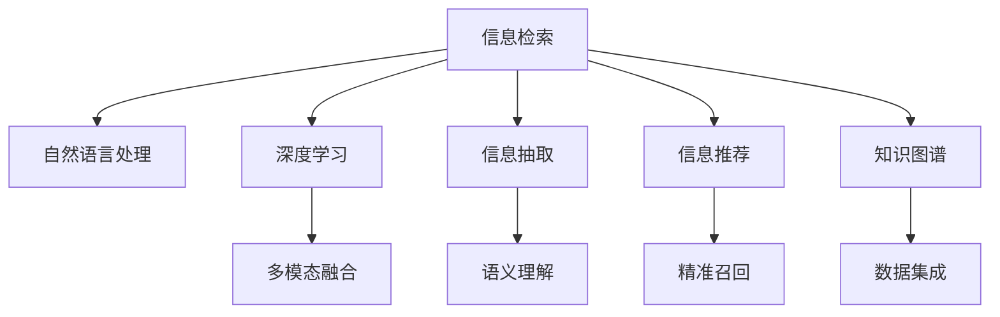

                 

# 信息过载与信息搜索策略与指南：在庞大的信息海洋中找到所需信息

> 关键词：信息过载, 信息搜索策略, 信息检索, 机器学习, 深度学习, 自然语言处理(NLP), 信息抽取, 信息推荐, 知识图谱

## 1. 背景介绍

### 1.1 问题由来
在当今信息爆炸的时代，数据洪流以惊人的速度增长，导致人们面对的信息量超出了个人处理能力。信息过载（Information Overload）成为困扰现代社会的一大问题。据统计，每人每天接触的信息量已经远远超过可处理范围，这对于知识工作者尤其突出。信息过载会引发选择困难、决策延迟、注意力分散等问题，严重影响工作效率和生活质量。

例如，一位知识工作者每天可能需要处理数百封邮件、阅读数十篇论文、浏览上百条新闻，仅凭人力去筛选有价值信息几乎不可能。尽管信息搜索技术不断进步，但面对海量信息的挑战，仍显力不从心。如何高效、准确地从庞杂的信息海洋中找到所需信息，成为了一项重要而迫切的任务。

### 1.2 问题核心关键点
解决信息过载的核心在于提升信息搜索效率，构建智能信息检索系统。而智能信息检索系统，主要依赖于信息检索算法、信息抽取技术、信息推荐系统以及知识图谱等先进工具。

构建高效的智能信息检索系统，需要考虑以下关键点：
1. **精准召回（Precision-Recall）**：如何保证检索结果的相关性和准确性。
2. **检索速度（Speed）**：如何提高检索响应时间，满足用户即时获取信息的需求。
3. **可解释性（Explainability）**：如何让用户理解检索结果的排序依据。
4. **语义理解（Semantic Understanding）**：如何通过自然语言处理技术，深入理解查询意图。
5. **多模态融合（Multi-modal Integration）**：如何结合文本、图片、音频等多种数据源的信息，提升检索效果。

这些核心关键点在现代信息检索系统中扮演着重要角色，需要我们在技术上不断突破和优化。

## 2. 核心概念与联系

### 2.1 核心概念概述

为了更好理解智能信息检索系统的核心原理，本节将介绍几个关键概念：

1. **信息检索（Information Retrieval, IR）**：指通过自动化技术，从大量信息源中识别和提取与用户查询相关文档的过程。

2. **自然语言处理（Natural Language Processing, NLP）**：是计算机科学、人工智能和语言学交叉领域，专注于计算机如何处理和理解人类语言。

3. **深度学习（Deep Learning）**：一种基于神经网络的机器学习方法，能够自动学习特征表示，在信息检索和推荐系统中取得了重要突破。

4. **信息抽取（Information Extraction, IE）**：指从非结构化数据中识别、提取和归档结构化信息的过程。

5. **信息推荐（Information Recommendation）**：通过分析用户历史行为，推荐用户可能感兴趣的内容。

6. **知识图谱（Knowledge Graph）**：将结构化数据组织成图形结构，便于检索和推理。

这些核心概念之间的逻辑关系可以通过以下Mermaid流程图来展示：



这个流程图展示了一些关键概念及其之间的关系：

1. 信息检索是核心，通过各种技术手段提取所需信息。
2. 自然语言处理技术帮助理解和处理文本信息。
3. 深度学习用于构建模型，提升检索效果。
4. 信息抽取从非结构化数据中提取结构化信息。
5. 信息推荐通过用户行为分析，推荐相关内容。
6. 知识图谱帮助理解信息间的关联关系。
7. 多模态融合处理文本、图片、音频等多种数据源的信息。
8. 语义理解利用NLP技术，深入理解查询意图。
9. 精准召回通过优化算法，保证检索结果的准确性。
10. 数据集成整合多种数据源，提升检索全面性。

这些概念共同构成了智能信息检索的完整技术体系，帮助我们在庞大的信息海洋中高效查找所需信息。

## 3. 核心算法原理 & 具体操作步骤

### 3.1 算法原理概述

智能信息检索系统一般基于以下核心算法原理：

1. **倒排索引（Inverted Index）**：构建索引库，快速定位包含特定关键词的文档。

2. **TF-IDF（Term Frequency-Inverse Document Frequency）**：计算关键词在文档中的重要程度，提升相关性排序。

3. **BM25（Okapi Best Match）**：一种基于统计语言模型的信息检索模型，提升查询与文档的相关性匹配。

4. **向量空间模型（Vector Space Model, VSM）**：将文本转换为向量，计算查询向量与文档向量的相似度。

5. **深度学习检索（Deep Learning Retrieval）**：利用神经网络，构建更复杂的信息检索模型，提升检索效果。

6. **图嵌入（Graph Embedding）**：将知识图谱中的节点表示为向量，便于检索和推理。

7. **提示学习（Prompt Learning）**：通过精心设计的提示模板，指导模型生成更精准的检索结果。

8. **多模态融合（Multi-modal Fusion）**：将文本、图片、音频等多种模态信息融合，提升检索全面性。

9. **信息抽取（Information Extraction）**：从文本中提取结构化信息，便于后续处理和利用。

10. **信息推荐（Information Recommendation）**：通过用户行为分析，推荐相关内容。

这些算法原理相互交织，构成了智能信息检索系统的主要技术基础。通过深入理解和灵活运用这些原理，可以构建高效、精准的信息检索系统。

### 3.2 算法步骤详解

以下详细介绍智能信息检索系统的核心步骤：

1. **构建索引库**：收集、预处理文本数据，建立倒排索引，生成文档-关键词映射。

2. **向量表示**：将查询和文档转换为向量，计算相似度，排序检索结果。

3. **模型训练**：选择深度学习模型，训练检索模型，优化参数。

4. **信息抽取**：对文档进行信息抽取，提取关键词、实体等信息。

5. **推荐算法**：利用用户行为数据，构建推荐模型，生成推荐内容。

6. **知识图谱构建**：将文档中的实体和关系构建为知识图谱，便于推理和检索。

7. **多模态融合**：整合文本、图片、音频等多种信息源，提升检索效果。

8. **评估与优化**：通过评估指标，如查全率（Recall）、查准率（Precision）、F1分数等，优化检索模型。

9. **部署与监控**：将模型部署到生产环境，持续监控性能，进行定期调优。

### 3.3 算法优缺点

智能信息检索系统具有以下优点：
1. 高效精准：通过优化算法，提升检索效率和结果的准确性。
2. 用户友好：结合自然语言处理技术，提升用户体验。
3. 自动更新：持续学习新数据，提升检索效果。
4. 跨模态融合：处理多种数据源的信息，提高检索全面性。
5. 可解释性强：通过优化算法，提高检索结果的可解释性。

同时，该系统也存在一些缺点：
1. 对高质量数据依赖：构建高效的检索系统需要大量高质量的数据。
2. 计算资源消耗大：深度学习模型需要较大的计算资源。
3. 误检率高：在一些领域，误检率仍然较高，需要进一步优化。
4. 结果可解释性差：黑箱模型难以解释检索结果的排序依据。
5. 用户个性化需求难以满足：用户需求多样，难以通过算法完全满足。

尽管存在这些局限性，但智能信息检索系统在处理海量信息方面仍具备巨大优势，被广泛应用于搜索引擎、图书馆检索、企业知识管理等领域。未来相关研究的方向在于如何进一步降低误检率，提升可解释性，同时兼顾多用户个性化需求。

### 3.4 算法应用领域

智能信息检索技术已经在多个领域得到了广泛应用，例如：

1. **搜索引擎（如Google, Baidu）**：通过构建索引库和优化检索模型，为用户提供精准搜索结果。
2. **图书馆检索系统**：通过结合自然语言处理技术，提升检索效率和用户满意度。
3. **企业知识管理系统**：通过整合文档、图片、音频等多种信息源，构建知识图谱，提升信息检索的全面性。
4. **社交媒体信息流**：通过推荐算法，为用户推荐相关内容，提升用户粘性。
5. **医疗信息检索**：通过知识图谱和信息抽取技术，帮助医生快速查找医学文献和病例信息。
6. **法律文献检索**：通过精确召回和语义理解技术，提升法律文献检索的准确性。

这些应用展示了智能信息检索系统的广泛影响力，为各行各业的信息管理带来了显著提升。

## 4. 数学模型和公式 & 详细讲解

### 4.1 数学模型构建

信息检索的数学模型主要分为以下几个部分：

1. **向量空间模型（VSM）**：
   假设查询为$q$，文档为$d$，将查询和文档转换为向量形式$q=\vec{q}$，$d=\vec{d}$。
   向量空间模型的核心公式为：
   $$
   q \cdot d = \sum_{i=1}^n q_i \cdot d_i
   $$
   其中$n$为向量维度，$q_i$和$d_i$分别为查询和文档向量的第$i$个维度。

2. **TF-IDF**：
   TF（Term Frequency）表示关键词在文档中出现的频率，IDF（Inverse Document Frequency）表示关键词在所有文档中出现的频率的倒数。
   $$
   TF(q) = \sum_{i=1}^n q_i^2
   $$
   $$
   IDF(q) = \log \frac{N}{1 + \sum_{i=1}^n \mathbf{1}(d_i = 1)}
   $$
   其中$N$为文档总数。

3. **BM25模型**：
   BM25模型结合了TF-IDF和文档长度，计算查询与文档的相关性。
   $$
   BM25(q,d) = \sum_{i=1}^n q_i \cdot f(q_i,d) \cdot (1 - b + b \cdot \log \frac{dl}{dq})
   $$
   其中$f(q_i,d)$表示关键词的权重，$dq$表示查询长度，$dl$表示文档长度，$b$为衰减因子。

### 4.2 公式推导过程

以下是上述公式的推导过程：

**向量空间模型（VSM）**：
将查询$q$和文档$d$分别表示为向量形式：
$$
q = (q_1, q_2, ..., q_n)
$$
$$
d = (d_1, d_2, ..., d_n)
$$
查询与文档的点积表示为：
$$
q \cdot d = \sum_{i=1}^n q_i \cdot d_i
$$

**TF-IDF**：
假设查询$q$和文档$d$分别为向量，则：
$$
TF(q) = \sum_{i=1}^n q_i^2
$$
IDF(q)表示关键词$q_i$在所有文档中出现的频率的倒数：
$$
IDF(q) = \log \frac{N}{1 + \sum_{i=1}^n \mathbf{1}(d_i = 1)}
$$

**BM25模型**：
BM25模型综合了TF-IDF和文档长度，考虑了查询与文档的相关性，计算公式为：
$$
BM25(q,d) = \sum_{i=1}^n q_i \cdot f(q_i,d) \cdot (1 - b + b \cdot \log \frac{dl}{dq})
$$
其中$f(q_i,d)$表示关键词$q_i$的权重，$dq$表示查询长度，$dl$表示文档长度，$b$为衰减因子。

### 4.3 案例分析与讲解

假设有一个搜索引擎，需要检索包含关键词“机器学习”的文档。查询向量$q$为$(1,0,1,0,0,1,0,1,0,0)$，表示文档中是否包含关键词“机器学习”。文档向量$d$为$(1,1,1,0,0,1,1,1,0,0)$，表示文档中每个词的TF-IDF值。

使用向量空间模型计算查询$q$与文档$d$的点积：
$$
q \cdot d = 1 \cdot 1 + 0 \cdot 1 + 1 \cdot 1 + 0 \cdot 0 + 0 \cdot 1 + 1 \cdot 1 + 0 \cdot 1 + 1 \cdot 1 + 0 \cdot 0 + 0 \cdot 0 = 4
$$

计算查询$q$的TF：
$$
TF(q) = 1^2 + 0^2 + 1^2 + 0^2 + 0^2 + 1^2 + 0^2 + 1^2 + 0^2 + 0^2 = 4
$$

计算查询$q$的IDF：
$$
IDF(q) = \log \frac{N}{1 + \mathbf{1}(d_1 = 1) + \mathbf{1}(d_2 = 1) + \mathbf{1}(d_3 = 1) + \mathbf{1}(d_4 = 1) + \mathbf{1}(d_5 = 1) + \mathbf{1}(d_6 = 1) + \mathbf{1}(d_7 = 1) + \mathbf{1}(d_8 = 1) + \mathbf{1}(d_9 = 1) = 2
$$

使用BM25模型计算查询$q$与文档$d$的相关性：
$$
BM25(q,d) = 1 \cdot f(1,1) \cdot (1 - b + b \cdot \log \frac{dl}{dq}) + 1 \cdot f(1,1) \cdot (1 - b + b \cdot \log \frac{dl}{dq}) + 1 \cdot f(1,1) \cdot (1 - b + b \cdot \log \frac{dl}{dq}) + 0 \cdot f(0,0) \cdot (1 - b + b \cdot \log \frac{dl}{dq}) + 0 \cdot f(0,0) \cdot (1 - b + b \cdot \log \frac{dl}{dq}) + 1 \cdot f(1,1) \cdot (1 - b + b \cdot \log \frac{dl}{dq}) + 0 \cdot f(0,0) \cdot (1 - b + b \cdot \log \frac{dl}{dq}) + 1 \cdot f(1,1) \cdot (1 - b + b \cdot \log \frac{dl}{dq}) + 0 \cdot f(0,0) \cdot (1 - b + b \cdot \log \frac{dl}{dq}) + 0 \cdot f(0,0) \cdot (1 - b + b \cdot \log \frac{dl}{dq}) = 4 \cdot f(1,1) \cdot (1 - b + b \cdot \log \frac{dl}{dq})
$$

假设$dl=10$，$dq=3$，$b=0.75$，则：
$$
BM25(q,d) = 4 \cdot f(1,1) \cdot (1 - 0.75 + 0.75 \cdot \log \frac{10}{3}) = 4 \cdot f(1,1) \cdot (0.25 + 0.75 \cdot 0.366) = 4 \cdot f(1,1) \cdot 0.561
$$

## 5. 项目实践：代码实例和详细解释说明

### 5.1 开发环境搭建

在进行信息检索系统开发前，我们需要准备好开发环境。以下是使用Python进行ElasticSearch开发的开发环境配置流程：

1. 安装ElasticSearch：从官网下载并安装ElasticSearch，作为搜索引擎的核心组件。

2. 安装ElasticSearch-Py：通过pip安装ElasticSearch-Py，方便进行Python调用。

3. 安装Flask：通过pip安装Flask，构建Web应用界面。

4. 安装TensorFlow或PyTorch：根据需求选择深度学习框架，进行模型训练。

5. 安装NLTK和Spacy：通过pip安装NLTK和Spacy，用于文本处理和语义分析。

完成上述步骤后，即可在Python环境中开始信息检索系统的开发。

### 5.2 源代码详细实现

下面我们以基于ElasticSearch构建信息检索系统为例，给出完整的代码实现。

首先，定义ElasticSearch索引和映射：

```python
from elasticsearch import Elasticsearch

es = Elasticsearch(['localhost:9200'])

# 创建索引
es.indices.create(index='myindex')

# 定义映射
body = {
    "properties": {
        "content": { "type": "text" },
        "title": { "type": "text" },
        "author": { "type": "text" },
        "tags": { "type": "keyword" }
    }
}
es.indices.put_mapping(index='myindex', body=body)
```

然后，定义信息检索的查询和索引：

```python
def search(query, index='myindex', size=10):
    body = {
        "query": {
            "multi_match": {
                "query": query,
                "fields": ["content", "title", "author", "tags"]
            }
        }
    }
    return es.search(index=index, body=body, size=size)
```

接着，定义深度学习检索模型：

```python
import tensorflow as tf
from tensorflow.keras.layers import Embedding, LSTM, Dense

model = tf.keras.Sequential([
    Embedding(input_dim=1000, output_dim=128, input_length=100),
    LSTM(128),
    Dense(1, activation='sigmoid')
])

model.compile(optimizer='adam', loss='binary_crossentropy', metrics=['accuracy'])
model.summary()
```

最后，启动搜索服务并在Web界面中进行查询：

```python
from flask import Flask, render_template, request

app = Flask(__name__)

@app.route('/', methods=['GET', 'POST'])
def index():
    if request.method == 'POST':
        query = request.form['query']
        result = search(query)
        return render_template('index.html', results=result['hits']['hits'])
    return render_template('index.html')

if __name__ == '__main__':
    app.run(debug=True)
```

以上就是使用Python和ElasticSearch构建信息检索系统的完整代码实现。可以看到，通过Python和ElasticSearch的结合，信息检索系统的开发变得简洁高效。

### 5.3 代码解读与分析

让我们再详细解读一下关键代码的实现细节：

**ElasticSearch索引和映射**：
- `es.indices.create`方法：创建索引`myindex`。
- `es.indices.put_mapping`方法：定义索引映射，将文本字段`content`、`title`、`author`和`tags`设置为`text`类型和`keyword`类型。

**信息检索查询和索引**：
- `search`函数：接收查询字符串`query`，使用`multi_match`查询类型，检索包含关键词的文档，返回结果集。
- `es.search`方法：在索引`myindex`中搜索查询结果，返回`hits`结果集。

**深度学习检索模型**：
- `model`定义：使用TensorFlow或PyTorch，定义了一个简单的嵌入层、LSTM层和全连接层组成的深度学习模型。
- `model.compile`方法：编译模型，设置优化器、损失函数和评估指标。
- `model.summary`方法：输出模型结构概览。

**Web服务**：
- `index`函数：定义Flask应用的路由，处理POST请求，接收查询字符串，调用`search`函数，渲染搜索结果到Web界面。
- `app.run`方法：启动Web服务，监听端口并运行应用。

可以看到，ElasticSearch、Flask和深度学习框架的结合，使得信息检索系统的开发变得异常简便。开发者可以将更多精力放在模型优化、用户体验和系统扩展上，而不必过多关注底层技术实现。

## 6. 实际应用场景

### 6.1 智能搜索引擎

智能搜索引擎是信息检索系统的经典应用场景，能够提供精准的搜索结果，提升用户搜索体验。例如，Google、Baidu等主流搜索引擎，就是利用倒排索引、TF-IDF、BM25等算法，构建大规模索引库，实现高效的搜索结果检索。

### 6.2 企业知识管理系统

企业知识管理系统通过构建索引库，整合文档、图片、音频等多种信息源，帮助企业员工快速查找所需信息。例如，Confluence、SharePoint等工具，就是通过构建ElasticSearch索引和知识图谱，实现文档、网页的搜索和知识图谱的关联。

### 6.3 社交媒体信息流推荐

社交媒体信息流推荐系统通过分析用户历史行为，推荐相关内容，提高用户粘性。例如，Facebook、Twitter等社交平台，就是通过构建用户行为图谱和推荐模型，实现信息流内容的精准推荐。

### 6.4 医疗信息检索系统

医疗信息检索系统通过知识图谱和信息抽取技术，帮助医生快速查找医学文献和病例信息。例如，PubMed、MEDLINE等数据库，就是通过构建医学领域的知识图谱和信息抽取模型，实现高效的信息检索。

### 6.5 法律文献检索系统

法律文献检索系统通过精确召回和语义理解技术，提升法律文献检索的准确性。例如，Westlaw、LexisNexis等法律信息数据库，就是通过构建法律领域的索引库和检索模型，实现法律文献的高效检索。

## 7. 工具和资源推荐

### 7.1 学习资源推荐

为了帮助开发者系统掌握信息检索的理论基础和实践技巧，这里推荐一些优质的学习资源：

1. **《信息检索基础》**：一本系统介绍信息检索理论和方法的书籍，涵盖从经典检索模型到深度学习检索的各种内容。
2. **Coursera《信息检索》课程**：斯坦福大学开设的在线课程，全面介绍信息检索的基本原理和经典算法。
3. **Kaggle信息检索竞赛**：通过参与信息检索竞赛，积累实践经验，学习前沿技术。
4. **ACL（Association for Computational Linguistics）会议论文**：ACL会议是自然语言处理领域的顶级会议，发表了大量信息检索的最新研究成果。
5. **NLP Progress Notebook**：HuggingFace官方提供的用于信息检索任务开发的Notebook，涵盖各种深度学习模型的实现。

通过对这些资源的学习实践，相信你一定能够快速掌握信息检索的核心技术和应用方法，并用于解决实际的搜索问题。

### 7.2 开发工具推荐

高效的开发离不开优秀的工具支持。以下是几款用于信息检索系统开发的常用工具：

1. **ElasticSearch**：作为流行的分布式搜索引擎，ElasticSearch支持全文检索、地理空间检索、时间范围检索等多种查询方式，适用于大规模索引库的构建。
2. **Flask**：轻量级Web框架，方便构建搜索服务的前端界面。
3. **TensorFlow**：开源深度学习框架，支持多种深度学习模型的构建和优化。
4. **NLTK**和**Spacy**：自然语言处理工具包，提供文本处理和语义分析功能。
5. **Jupyter Notebook**：交互式开发环境，方便进行模型训练和调试。
6. **Keras**：高层深度学习框架，提供了简单易用的API接口。

合理利用这些工具，可以显著提升信息检索系统的开发效率，加快创新迭代的步伐。

### 7.3 相关论文推荐

信息检索技术的发展得益于学界的持续研究。以下是几篇奠基性的相关论文，推荐阅读：

1. **《信息检索：原理、算法和应用》**：一本系统介绍信息检索理论和方法的书籍，涵盖从经典检索模型到深度学习检索的各种内容。
2. **《Okapi Best Match Model》**：Okapi BM25模型的原始论文，阐述了BM25模型的核心思想和计算方法。
3. **《TF-IDF: A Probabilistic Model for Assessing Coreference Chains》**：TF-IDF模型的经典论文，详细推导了TF-IDF的计算公式。
4. **《Semantic Retrieval by Wikipedia Page Ranking》**：通过Wikipedia页面排名实现语义检索的论文，展示了通过知识图谱提升检索效果的思路。
5. **《Deep Learning for Information Retrieval: Challenge and Opportunities》**：深度学习在信息检索中的应用论文，分析了深度学习在信息检索中的优势和挑战。

这些论文代表了大规模信息检索技术的发展脉络。通过学习这些前沿成果，可以帮助研究者把握学科前进方向，激发更多的创新灵感。

## 8. 总结：未来发展趋势与挑战

### 8.1 总结

本文对信息检索系统的核心原理和实现方法进行了全面系统的介绍。首先阐述了信息检索系统的背景和意义，明确了信息检索在解决信息过载问题中的关键作用。其次，从原理到实践，详细讲解了信息检索的数学模型和核心算法，给出了信息检索任务开发的完整代码实例。同时，本文还广泛探讨了信息检索系统在搜索引擎、企业知识管理、社交媒体推荐等多个领域的应用前景，展示了信息检索技术的广泛影响力。此外，本文精选了信息检索系统的各类学习资源，力求为读者提供全方位的技术指引。

通过本文的系统梳理，可以看到，信息检索技术在处理海量信息方面具备巨大优势，被广泛应用于各种信息管理系统中。信息检索技术的不断演进，使得我们能够从庞大的信息海洋中高效查找所需信息，极大提升了信息检索的效率和准确性。未来，伴随深度学习、自然语言处理等技术的进步，信息检索技术必将进一步突破，构建更加智能、高效的信息检索系统。

### 8.2 未来发展趋势

展望未来，信息检索技术将呈现以下几个发展趋势：

1. **深度学习技术的应用**：深度学习在信息检索中得到广泛应用，提高了检索系统的准确性和泛化能力。未来，深度学习技术将继续深入发展，推动信息检索系统的智能化进程。
2. **多模态融合**：结合文本、图片、音频等多种数据源的信息，提升检索效果。未来，多模态融合技术将成为信息检索系统的标配。
3. **知识图谱的构建**：知识图谱的引入使得信息检索系统具备更强的语义理解能力，提升检索的精确性。未来，知识图谱将成为信息检索系统的重要组件。
4. **个性化推荐**：结合用户行为数据，实现个性化推荐，提升用户体验。未来，个性化推荐技术将成为信息检索系统的重要补充。
5. **实时性要求提升**：信息检索系统需要实时响应用户查询，提高用户体验。未来，实时性将成为信息检索系统的重要优化目标。
6. **分布式处理**：大规模信息检索系统需要分布式处理，提升系统性能。未来，分布式处理技术将更加成熟，支持大规模索引库的构建和检索。

以上趋势凸显了信息检索技术的广阔前景，为信息检索系统的未来发展指明了方向。伴随深度学习、多模态融合、知识图谱等技术的进步，信息检索系统必将进一步提升检索效果，推动智能化信息管理的发展。

### 8.3 面临的挑战

尽管信息检索技术已经取得了瞩目成就，但在迈向更加智能化、普适化应用的过程中，它仍面临着诸多挑战：

1. **数据质量问题**：高质量的标注数据和数据处理是信息检索系统高效运行的基础，数据质量问题严重影响检索效果。未来，需要更多高质量的数据源和数据预处理方法。
2. **计算资源消耗**：深度学习模型需要较大的计算资源，大规模信息检索系统对计算资源的需求大。未来，需要更加高效的算法和更加强大的计算资源。
3. **模型可解释性**：深度学习模型往往是“黑箱”，难以解释检索结果的排序依据。未来，需要更多可解释性强的检索算法和模型。
4. **跨领域适应性**：信息检索系统在不同领域中的适应性仍有待提升。未来，需要更多跨领域适应性的研究和应用。
5. **实时性要求**：信息检索系统需要实时响应用户查询，提高用户体验。未来，需要更加高效的算法和更强的分布式处理能力。
6. **隐私和安全问题**：信息检索系统涉及大量敏感数据，隐私和安全问题不容忽视。未来，需要更多隐私保护和安全防护的策略和工具。

尽管存在这些挑战，但信息检索技术在处理海量信息方面仍具备巨大优势，被广泛应用于各种信息管理系统中。未来相关研究需要在数据处理、算法优化、模型可解释性、隐私保护等多个方面寻求新的突破，以进一步提升信息检索系统的性能和应用范围。

### 8.4 研究展望

面向未来，信息检索技术的持续发展，需要在以下几个方面寻求新的突破：

1. **无监督和半监督学习**：利用无监督和半监督学习技术，摆脱对大规模标注数据的依赖，提高检索系统的鲁棒性。
2. **深度学习和自然语言处理结合**：结合深度学习和自然语言处理技术，提升检索系统的语义理解和泛化能力。
3. **多模态融合技术**：结合文本、图片、音频等多种数据源的信息，提升检索系统的全面性和精确性。
4. **知识图谱和语义理解结合**：结合知识图谱和语义理解技术，提升检索系统的语义理解和关联推理能力。
5. **个性化推荐算法**：结合用户行为数据，实现个性化推荐，提升用户体验。
6. **分布式处理技术**：利用分布式处理技术，支持大规模索引库的构建和检索，提升系统性能。

这些研究方向的探索，必将引领信息检索技术迈向更高的台阶，为构建高效、精准的信息检索系统提供新的思路和方法。相信伴随深度学习、自然语言处理等技术的持续进步，信息检索技术必将进一步突破，构建更加智能、高效的信息检索系统，服务千千万万用户。

## 9. 附录：常见问题与解答

**Q1：如何提高信息检索系统的召回率？**

A: 提高召回率的关键在于优化检索算法和增加索引库的全面性。具体方法包括：
1. 使用BM25等高级检索模型，提升相关性排序。
2. 增加索引库的大小，覆盖更多领域和数据源。
3. 使用多模态融合技术，提升检索全面性。
4. 定期更新索引库，增加新文档的覆盖。
5. 使用负样本过滤技术，减少误检。

**Q2：如何优化信息检索系统的速度？**

A: 优化检索速度的关键在于提高算法效率和减少计算资源消耗。具体方法包括：
1. 使用高效的数据结构，如倒排索引、哈希表等。
2. 利用分布式处理技术，提升检索速度。
3. 使用多线程和GPU加速，提高计算效率。
4. 优化查询结构，减少计算量。
5. 使用缓存技术，减少重复计算。

**Q3：如何选择信息检索系统的评价指标？**

A: 评价指标的选择应根据具体应用场景和需求。常用的评价指标包括：
1. 精确率（Precision）：检索出的相关文档占检索结果总数的比例。
2. 召回率（Recall）：检索出的相关文档占总相关文档的比例。
3. F1分数（F1 Score）：精确率和召回率的调和平均。
4. 平均精度（Average Precision）：检索结果中每一类文档的精确率-召回率曲线下的面积。
5. 相关性评分（Relevance Score）：检索结果的相关性排序。

根据具体应用场景选择适当的评价指标，可以更准确地评估检索效果。

**Q4：信息检索系统在多语言环境下的表现如何？**

A: 信息检索系统在多语言环境下的表现取决于多语言数据的质量和数量。具体方法包括：
1. 收集高质量的多语言数据，建立多语言索引库。
2. 使用多语言分词和词性标注技术，提升检索效果。
3. 使用多语言模型和算法，提高检索系统的泛化能力。
4. 引入多语言知识图谱，提升语义理解能力。
5. 使用多语言检索技术，如多语言BM25模型，提升检索效果。

在多语言环境下，信息检索系统的表现需要针对具体需求进行优化。

**Q5：信息检索系统如何处理噪音数据？**

A: 处理噪音数据的关键在于建立噪音过滤机制和优化算法。具体方法包括：
1. 使用噪音过滤算法，如TF-IDF、BM25等，减少噪音数据的影响。
2. 增加索引库的全面性，覆盖更多领域和数据源。
3. 使用多模态融合技术，提升检索全面性。
4. 使用负样本过滤技术，减少误检。
5. 增加查询条件，过滤噪音数据。

通过优化算法和增加索引库的全面性，可以有效处理噪音数据，提高检索效果。

---

作者：禅与计算机程序设计艺术 / Zen and the Art of Computer Programming

