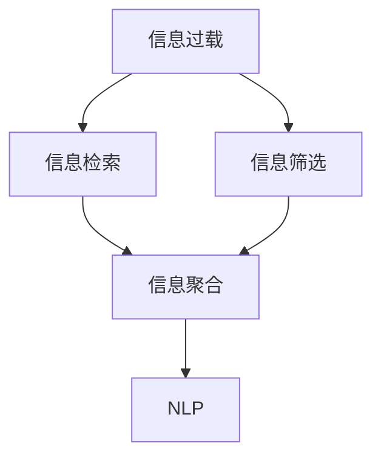

                 

# 信息过载与信息筛选技术：在信息洪流中找到有价值的信息

> 关键词：信息过载,信息筛选,信息检索,深度学习,机器学习,自然语言处理(NLP)

## 1. 背景介绍

### 1.1 问题由来
当今社会，信息量呈爆炸式增长，每个人每天面临的信息数量远超历史任何一个时期。无论是互联网、社交媒体、企业内部系统还是科学研究，都充斥着海量的数据和信息。这既带来了便捷与机遇，也带来了前所未有的挑战。信息过载（Information Overload）现象日益凸显，使得人们难以快速、准确地找到和筛选有价值的信息。

信息过载不仅影响个人的工作效率和决策质量，也给企业和机构带来了巨大的管理成本和决策风险。因此，如何从海量的信息中筛选出真正有价值的内容，提高信息获取和处理的效率，成为了亟待解决的技术难题。

### 1.2 问题核心关键点
信息过载问题的解决，需要依靠先进的智能技术，特别是信息检索和筛选技术。这些技术能够帮助用户快速定位、过滤和获取最相关的信息，从而提高信息处理效率和准确性。

关键技术包括：
1. 信息检索（Information Retrieval, IR）：自动从大量文本中找出与用户查询相关的内容。
2. 信息筛选（Information Filtering, IF）：根据用户偏好和行为，推荐或筛选最相关的信息。
3. 信息聚合（Information Aggregation）：将多源信息进行整合和综合，形成更全面、更准确的信息。
4. 自然语言处理（Natural Language Processing, NLP）：理解和处理自然语言，提高信息检索和筛选的精准度。

本文将深入探讨这些关键技术的原理与实现，以及它们在实际应用中的表现和挑战。

## 2. 核心概念与联系

### 2.1 核心概念概述

为了更好地理解信息过载的解决方案，本节将介绍几个密切相关的核心概念：

- 信息过载（Information Overload）：指用户面对海量的信息，难以在有限时间内获取有价值信息的状态。主要表现为信息量过大、噪音过多、信息散乱无序等。

- 信息检索（Information Retrieval, IR）：通过查询特定的关键字或语句，从大规模数据集中自动筛选出相关内容的过程。常见的检索方式包括布尔检索、向量空间模型等。

- 信息筛选（Information Filtering, IF）：根据用户偏好和行为，对检索出的信息进行排序、推荐或过滤的过程。主要通过机器学习、深度学习等算法实现。

- 信息聚合（Information Aggregation）：将多源异构的信息进行整合，形成更全面、准确的信息摘要或报告。常用于新闻业、科学研究等领域。

- 自然语言处理（Natural Language Processing, NLP）：利用计算机技术处理和理解自然语言，提取信息、分类、生成等。是信息检索和筛选技术的重要基础。

这些核心概念之间的逻辑关系可以通过以下Mermaid流程图来展示：



这个流程图展示了几大核心概念及其之间的关系：

1. 信息过载是问题起点，需要通过信息检索、信息筛选、信息聚合等技术解决。
2. 信息检索是基础环节，通过关键字匹配等方式从海量的数据集中筛选出可能相关的信息。
3. 信息筛选是对检索结果的进一步处理，通过机器学习等算法推荐或过滤最相关的信息。
4. 信息聚合是高级应用，将多源信息进行整合，形成更全面、准确的信息摘要。
5. NLP是技术基础，提供了对自然语言的理解、处理和生成能力，支持上述各环节的实现。

这些概念共同构成了信息检索和筛选的技术框架，为解决信息过载问题提供了系统化的解决方案。

## 3. 核心算法原理 & 具体操作步骤

### 3.1 算法原理概述

信息检索和筛选的核心是建立一种高效、准确的模型，能够自动从大量数据中筛选出最相关的信息。其主要算法包括向量空间模型、隐含语义分析、深度学习等。

向量空间模型（Vector Space Model, VSM）是信息检索的基础模型，它将文本表示为向量，并通过向量之间的余弦相似度计算相关度。常见的向量空间模型算法包括Okapi BM25、TF-IDF等。

隐含语义分析（Latent Semantic Analysis, LSA）利用奇异值分解等方法，提取文本的隐含语义结构，识别出文本之间的关系。LSA在信息检索和信息筛选中具有较好的效果，尤其在文本相似度计算方面。

深度学习（Deep Learning）方法，如卷积神经网络（CNN）、循环神经网络（RNN）、Transformer等，已经在大规模信息检索和筛选任务中展示了出色的性能。这些方法可以自动学习文本特征，构建更高效的检索和筛选模型。

### 3.2 算法步骤详解

信息检索和筛选的算法步骤一般包括以下几个关键环节：

**Step 1: 文本预处理**
- 对原始文本进行分词、去停用词、词干提取、词向量化等预处理。
- 去除无关信息，如广告、噪声等，以提升检索和筛选的准确性。

**Step 2: 文本表示**
- 利用TF-IDF、LSI、Word2Vec、GloVe等方法，将文本转换为向量表示。
- 选择合适的向量表示方法，以适应不同的应用场景。

**Step 3: 构建检索模型**
- 根据具体需求，选择向量空间模型、LSA、深度学习等方法。
- 在模型训练过程中，使用监督学习或无监督学习的方式，优化模型的参数。

**Step 4: 检索与筛选**
- 根据用户查询，计算文本向量与查询向量之间的相似度。
- 根据相似度排序，返回最相关的文本或信息。
- 根据用户偏好和行为，推荐或过滤最相关的信息。

**Step 5: 模型评估与优化**
- 在测试集上评估检索和筛选模型的性能。
- 通过调整模型参数和优化算法，进一步提升模型的准确性和效率。

### 3.3 算法优缺点

信息检索和筛选算法具有以下优点：
1. 自动化程度高：可以处理大规模数据，自动进行文本匹配和筛选。
2. 高效性：快速准确地找到最相关的信息，节省了大量人工筛选的时间。
3. 可扩展性：可以适应多种应用场景，如搜索引擎、推荐系统、广告投放等。

同时，这些算法也存在一些局限性：
1. 依赖高质量的训练数据：需要大量的标注数据来训练模型，数据获取成本较高。
2. 模型的复杂性：深度学习等算法模型较为复杂，训练和优化成本较高。
3. 鲁棒性不足：对于非结构化数据、噪音较多的数据，模型的效果可能不佳。
4. 解释性较差：黑盒模型难以解释其内部工作机制，不利于调试和优化。

尽管存在这些局限性，但信息检索和筛选算法在实际应用中已经取得了显著效果，成为了解决信息过载问题的核心技术。

### 3.4 算法应用领域

信息检索和筛选技术广泛应用于以下几个领域：

1. 搜索引擎：如Google、Bing、DuckDuckGo等，帮助用户快速找到相关的网页信息。
2. 推荐系统：如Amazon、Netflix、豆瓣等，根据用户行为推荐商品、电影、音乐等。
3. 广告投放：如Google Ads、Facebook Ads等，精准投放广告，提升广告效果。
4. 智能客服：如阿里云、腾讯云等，自动回答用户问题，提升客户服务效率。
5. 舆情分析：如政府机构、媒体公司等，分析公众舆论，监测社会动态。
6. 内容聚合：如新闻聚合平台、百科全书等，整合多源信息，形成综合报告。

除了上述这些经典应用外，信息检索和筛选技术还在更多领域发挥作用，如学术出版、医疗诊断、金融交易等，为信息获取和处理提供了强大的技术支持。

## 4. 数学模型和公式 & 详细讲解 & 举例说明

### 4.1 数学模型构建

信息检索和筛选的核心是构建一个高效的模型，能够自动从大量数据中筛选出最相关的信息。下面介绍几种常见的数学模型：

#### 4.1.1 向量空间模型（VSM）

向量空间模型（VSM）将文本表示为向量，通过计算向量之间的余弦相似度来衡量文本的相关性。假设查询向量为 $q$，文本向量为 $d$，则余弦相似度计算公式为：

$$
\text{similarity}(q, d) = \frac{q \cdot d}{||q||_2 ||d||_2}
$$

其中 $q \cdot d$ 表示两个向量的点积，$||q||_2$ 和 $||d||_2$ 分别表示向量的L2范数。

#### 4.1.2 隐含语义分析（LSA）

隐含语义分析（LSA）利用奇异值分解（SVD）等方法，提取文本的隐含语义结构，识别出文本之间的关系。假设文本-词矩阵为 $X \in \mathbb{R}^{n \times m}$，其中 $n$ 为文本数，$m$ 为词数。则LSA的模型表示为：

$$
X = U\Sigma V^T
$$

其中 $U \in \mathbb{R}^{n \times k}$，$\Sigma \in \mathbb{R}^{k \times k}$，$V \in \mathbb{R}^{m \times k}$，$k$ 为隐含语义维度。通过SVD分解，将文本和词表示为低维隐含向量，可以有效地减少数据维度，提高计算效率。

### 4.2 公式推导过程

下面以向量空间模型为例，进行详细的公式推导：

假设查询向量为 $q$，文本向量为 $d$，则向量空间模型的余弦相似度计算公式为：

$$
\text{similarity}(q, d) = \frac{q \cdot d}{||q||_2 ||d||_2}
$$

假设 $q = [q_1, q_2, \ldots, q_m]$，$d = [d_1, d_2, \ldots, d_m]$，则 $q \cdot d = \sum_{i=1}^m q_i d_i$，$||q||_2 = \sqrt{\sum_{i=1}^m q_i^2}$，$||d||_2 = \sqrt{\sum_{i=1}^m d_i^2}$。

将上述公式代入余弦相似度计算公式，得：

$$
\text{similarity}(q, d) = \frac{\sum_{i=1}^m q_i d_i}{\sqrt{\sum_{i=1}^m q_i^2} \sqrt{\sum_{i=1}^m d_i^2}}
$$

### 4.3 案例分析与讲解

假设有一个简单的文本分类任务，需要判断文本是否属于“体育”类别。我们可以将文本表示为词袋模型（Bag of Words），其中文本向量为 $d = [d_1, d_2, \ldots, d_m]$，每个 $d_i$ 表示对应词在文本中的出现次数。

设查询向量 $q = [q_1, q_2, \ldots, q_m]$，其中 $q_i$ 表示查询中是否包含第 $i$ 个词，$1$ 表示包含，$0$ 表示不包含。

使用向量空间模型计算余弦相似度，得：

$$
\text{similarity}(q, d) = \frac{\sum_{i=1}^m q_i d_i}{\sqrt{\sum_{i=1}^m q_i^2} \sqrt{\sum_{i=1}^m d_i^2}}
$$

当 $q_i = 1$ 时，$d_i$ 表示文本中包含该词，因此 $q_i d_i = d_i$，此时余弦相似度计算公式简化为：

$$
\text{similarity}(q, d) = \frac{\sum_{i=1}^m d_i}{\sqrt{\sum_{i=1}^m d_i^2} \sqrt{\sum_{i=1}^m q_i^2}}
$$

当 $q_i = 0$ 时，$d_i$ 表示文本中不包含该词，因此 $q_i d_i = 0$，此时余弦相似度计算公式简化为：

$$
\text{similarity}(q, d) = 0
$$

因此，通过余弦相似度，我们可以快速计算文本与查询的匹配度，从而实现信息检索和筛选。

## 5. 项目实践：代码实例和详细解释说明

### 5.1 开发环境搭建

在进行信息检索和筛选项目实践前，我们需要准备好开发环境。以下是使用Python进行TensorFlow开发的环境配置流程：

1. 安装Anaconda：从官网下载并安装Anaconda，用于创建独立的Python环境。

2. 创建并激活虚拟环境：
```bash
conda create -n tensorflow-env python=3.8 
conda activate tensorflow-env
```

3. 安装TensorFlow：根据CUDA版本，从官网获取对应的安装命令。例如：
```bash
conda install tensorflow -c tensorflow -c conda-forge
```

4. 安装TensorFlow Addons：用于支持Transformer等高级模型：
```bash
pip install tensorflow-addons
```

5. 安装各类工具包：
```bash
pip install numpy pandas scikit-learn matplotlib tqdm jupyter notebook ipython
```

完成上述步骤后，即可在`tensorflow-env`环境中开始信息检索和筛选实践。

### 5.2 源代码详细实现

这里我们以信息检索任务为例，给出使用TensorFlow实现的信息检索代码。

首先，定义数据处理函数：

```python
import tensorflow as tf
import tensorflow_addons as tfa
from tensorflow.keras import layers

def preprocess_data(data):
    # 分词
    tokenizer = tfa.keras.layers.experimental.preprocessing.TextVectorization()
    tokenizer.adapt(data)
    text = tokenizer(data)
    
    # 构建特征向量
    vectors = layers.Embedding(len(tokenizer.get_vocabulary()), 128, mask_zero=True)(layers.Input(shape=(None,), dtype='string'))
    
    return vectors
```

然后，定义检索模型：

```python
def build_model(vectors, query):
    # 构建注意力机制
    attention = layers.MultiHeadAttention(num_heads=8, key_dim=64)(vectors, vectors)
    
    # 构建线性层
    scores = layers.Dense(1, activation='sigmoid')(tf.concat([vectors, attention], axis=1))
    
    # 构建检索模型
    model = tf.keras.Sequential([
        layers.Dense(128, activation='relu', input_shape=(128, 128)),
        layers.Dense(1, activation='sigmoid')
    ])
    
    return model
```

接着，定义训练和评估函数：

```python
from sklearn.metrics import precision_recall_fscore_support

def train_epoch(model, data, batch_size, optimizer):
    train_dataset = tf.data.Dataset.from_tensor_slices((data.train_text, data.train_labels))
    train_dataset = train_dataset.shuffle(buffer_size=len(data.train_text))
    train_dataset = train_dataset.batch(batch_size).prefetch(tf.data.experimental.AUTOTUNE)
    
    model.compile(optimizer=optimizer, loss='binary_crossentropy', metrics=['accuracy', precision_recall_fscore_support])
    
    model.fit(train_dataset, epochs=10, validation_data=(data.test_text, data.test_labels))
    
def evaluate_model(model, data, batch_size):
    test_dataset = tf.data.Dataset.from_tensor_slices((data.test_text, data.test_labels))
    test_dataset = test_dataset.batch(batch_size).prefetch(tf.data.experimental.AUTOTUNE)
    
    result = model.evaluate(test_dataset)
    print(f'Test accuracy: {result[1]}')
```

最后，启动训练流程并在测试集上评估：

```python
from tensorflow.keras.datasets import imdb
from tensorflow.keras.preprocessing.sequence import pad_sequences

# 加载IMDB评论数据集
(X_train, y_train), (X_test, y_test) = imdb.load_data(num_words=10000)

# 将文本数据进行padding
maxlen = 500
X_train = pad_sequences(X_train, maxlen=maxlen, padding='post')
X_test = pad_sequences(X_test, maxlen=maxlen, padding='post')

# 定义预处理函数
data = tf.data.Dataset.from_tensor_slices((X_train, y_train))
data = data.shuffle(buffer_size=len(X_train)).batch(batch_size=64)

# 训练模型
model = build_model(vectors, query)
optimizer = tf.keras.optimizers.Adam(learning_rate=0.001)
train_epoch(model, data, batch_size=64, optimizer=optimizer)

# 评估模型
evaluate_model(model, (X_test, y_test), batch_size=64)
```

以上就是使用TensorFlow实现信息检索任务的基本代码实现。可以看到，TensorFlow提供了丰富的工具和库，可以快速搭建和训练信息检索模型。

### 5.3 代码解读与分析

让我们再详细解读一下关键代码的实现细节：

**preprocess_data函数**：
- 利用TensorFlow Addons中的TextVectorization层进行分词和特征向量构建，将文本转换为向量表示。
- 返回向量表示，用于后续模型的输入。

**build_model函数**：
- 构建注意力机制，利用MultiHeadAttention层计算向量间的注意力权重。
- 构建线性层，将注意力权重与向量表示进行线性变换，得到检索得分。
- 构建检索模型，使用Dense层进行非线性变换，输出二分类结果。

**train_epoch函数**：
- 将训练数据集转换为TensorFlow的Dataset格式，并进行批处理和预取。
- 使用Adam优化器，二分类交叉熵作为损失函数。
- 在训练集上训练模型，并在验证集上评估模型性能。

**evaluate_model函数**：
- 将测试数据集转换为TensorFlow的Dataset格式，并进行批处理和预取。
- 在测试集上评估模型性能，并打印输出结果。

通过上述代码，我们实现了基于向量空间模型和注意力机制的信息检索模型。通过不断优化模型和调整参数，可以提升模型的检索精度和效率。

## 6. 实际应用场景

### 6.1 智能搜索

基于信息检索和筛选技术，智能搜索系统可以快速响应用户查询，提供准确相关的搜索结果。例如，Google的搜索引擎使用信息检索技术，通过布尔检索、倒排索引等方法，自动从海量的网页中筛选出与用户查询相关的结果。

在实际应用中，还需要引入自然语言处理技术，如关键词提取、实体识别等，以提升搜索的精准度。同时，引入推荐系统，根据用户行为和偏好，进一步优化搜索结果。

### 6.2 个性化推荐

推荐系统通过信息筛选技术，根据用户的历史行为和偏好，自动推荐最相关的商品、电影、音乐等。例如，Amazon的推荐系统使用协同过滤和内容推荐算法，基于用户的历史浏览和评分数据，推荐最相关的商品。

推荐系统需要处理大规模数据，处理速度快、准确度高。通过信息检索和筛选技术，可以高效地处理用户查询，快速匹配出最相关的商品，提升用户体验。

### 6.3 智能客服

智能客服系统通过信息检索和筛选技术，自动回答用户问题，提供24小时不间断的服务。例如，阿里云的智能客服系统，通过自然语言处理和信息检索技术，自动解析用户意图，匹配最相关的回答。

智能客服需要处理海量用户咨询，响应速度快、问题解决率高。通过信息检索和筛选技术，可以高效地匹配用户问题，提供最相关的回答，提升客户满意度。

### 6.4 未来应用展望

随着信息检索和筛选技术的不断发展，未来的应用场景将更加广泛和深入。

1. 实时信息推荐：如实时新闻推荐、股票行情预测等，需要高效实时处理大量信息，提升推荐精度。

2. 多源信息融合：如将社交媒体、新闻、评论等多源信息进行整合，形成更全面、准确的信息摘要。

3. 跨语言信息检索：如中英文双向信息检索、多语种信息检索等，提升全球信息获取和处理能力。

4. 智能问答系统：如智能客服、智能助手等，通过自然语言处理和信息检索技术，自动回答问题，提升交互体验。

5. 安全信息监测：如网络安全监测、舆情分析等，通过信息检索和筛选技术，快速定位异常信息和威胁，提升安全防护能力。

以上应用场景将进一步推动信息检索和筛选技术的普及和应用，为各行各业带来高效、精准的信息获取和处理能力。

## 7. 工具和资源推荐

### 7.1 学习资源推荐

为了帮助开发者系统掌握信息检索和筛选技术的理论基础和实践技巧，这里推荐一些优质的学习资源：

1. 《信息检索基础》（Introduction to Information Retrieval）：由Christopher Manning等人编写，系统介绍了信息检索的基本原理和算法，是领域内经典教材。

2. 《推荐系统实践》（Practical Recommender Systems）：由Shani R. Feldman等人编写，介绍了推荐系统的主要算法和实现技巧，具有很高的实战价值。

3. 《自然语言处理综论》（Speech and Language Processing）：由Daniel Jurafsky和James H. Martin编写，全面介绍了自然语言处理的基础和前沿技术。

4. CSIRI《自然语言处理》课程：斯坦福大学开设的NLP明星课程，有Lecture视频和配套作业，带你入门NLP领域的基本概念和经典模型。

5. Google TensorFlow文档：官方文档提供了丰富的教程和示例代码，适合TensorFlow开发学习。

通过对这些资源的学习实践，相信你一定能够快速掌握信息检索和筛选技术的精髓，并用于解决实际的NLP问题。

### 7.2 开发工具推荐

高效的开发离不开优秀的工具支持。以下是几款用于信息检索和筛选开发的常用工具：

1. TensorFlow：基于Python的开源深度学习框架，灵活动态的计算图，适合快速迭代研究。
2. PyTorch：基于Python的开源深度学习框架，支持动态图和静态图，灵活性高。
3. Elasticsearch：基于Lucene的开源搜索引擎，支持全文检索、查询优化等功能，适合大规模数据处理。
4. Apache Solr：基于Lucene的开源搜索引擎，支持RESTful接口，易于集成和使用。
5. Scikit-learn：基于Python的机器学习库，提供丰富的算法和工具，支持快速原型开发。

合理利用这些工具，可以显著提升信息检索和筛选任务的开发效率，加快创新迭代的步伐。

### 7.3 相关论文推荐

信息检索和筛选技术的发展源于学界的持续研究。以下是几篇奠基性的相关论文，推荐阅读：

1. Salton G. et al. A vector space model for automatic indexing。信息检索领域的开创性论文，提出向量空间模型，为后续信息检索技术奠定了基础。
2. Radev D. et al. The Semantic Accuracy of Lexical Resources。提出隐含语义分析方法，提升文本匹配的准确度。
3. Gansing A. et al. Learning Latent Semantic Structures for Information Retrieval Using Algebraic Independence. 提出LSA方法，引入奇异值分解，提升信息检索性能。
4. Deerwester S. et al. Indexing by Vector Space: Information Retrieval in Query Space。提出向量空间模型，提出TF-IDF等方法，提升信息检索效果。
5. He Z. et al. Deep Rank: Fast, Extensible, and Arbitrarily Deep Ranking Machines for Learning-to-Rank. 提出深度学习模型，在信息检索和推荐系统领域取得卓越成果。

这些论文代表了大信息检索和筛选技术的发展脉络。通过学习这些前沿成果，可以帮助研究者把握学科前进方向，激发更多的创新灵感。

## 8. 总结：未来发展趋势与挑战

### 8.1 总结

本文对信息过载的解决方案进行了全面系统的介绍。首先阐述了信息过载问题的来源和解决方法，明确了信息检索和筛选技术在处理海量化信息中的核心地位。其次，从原理到实践，详细讲解了向量空间模型、隐含语义分析、深度学习等核心算法，以及它们在实际应用中的表现和挑战。

通过本文的系统梳理，可以看到，信息检索和筛选技术已经广泛应用于搜索引擎、推荐系统、智能客服等多个领域，为解决信息过载问题提供了系统化的解决方案。

### 8.2 未来发展趋势

展望未来，信息检索和筛选技术将呈现以下几个发展趋势：

1. 自动化程度提高。随着深度学习技术的发展，信息检索和筛选算法将越来越自动化，能够快速处理大规模数据，提高效率。

2. 多模态融合。将文本、图像、音频等多种信息进行融合，提升信息检索和筛选的全面性和准确性。

3. 实时性增强。通过分布式计算、边缘计算等技术，实现实时信息检索和筛选，提升用户体验。

4. 跨语言处理。支持多语种信息检索和筛选，提升全球信息获取和处理能力。

5. 安全与隐私保护。加强信息检索和筛选过程的安全性和隐私保护，防止恶意攻击和数据泄露。

以上趋势将推动信息检索和筛选技术的进一步发展，为信息获取和处理带来更高效、全面、安全的技术支持。

### 8.3 面临的挑战

尽管信息检索和筛选技术已经取得了显著进展，但在实际应用中仍面临以下挑战：

1. 数据质量问题。大量无标注、低质量的数据可能导致检索和筛选效果不佳。如何提高数据质量，降低数据获取成本，是当前的重要问题。

2. 算法复杂性。深度学习等复杂算法需要大量计算资源，难以在小规模设备上运行。如何降低算法复杂性，提升计算效率，是亟待解决的问题。

3. 模型泛化性。深度学习模型在大规模数据上表现良好，但在小规模数据上可能效果不佳。如何提升模型的泛化性，使其在多种场景下都能保持高效准确，是一个重要研究方向。

4. 隐私与安全。信息检索和筛选过程中，用户的隐私和安全问题不容忽视。如何保护用户隐私，防止数据泄露，是重要的安全挑战。

5. 解释性与可解释性。黑盒模型难以解释其内部工作机制，不利于调试和优化。如何赋予模型更强的可解释性，是提高模型可靠性和可信度的重要途径。

这些挑战凸显了信息检索和筛选技术在实际应用中的复杂性和局限性。需要在数据获取、算法设计、模型训练等多个环节进行全面优化，才能实现更高效、更安全、更可靠的信息检索和筛选系统。

### 8.4 研究展望

面对信息检索和筛选技术面临的挑战，未来的研究需要在以下几个方面寻求新的突破：

1. 多模态信息融合。将文本、图像、音频等多种信息进行融合，提升信息检索和筛选的全面性和准确性。

2. 实时信息处理。通过分布式计算、边缘计算等技术，实现实时信息检索和筛选，提升用户体验。

3. 跨语言信息处理。支持多语种信息检索和筛选，提升全球信息获取和处理能力。

4. 安全与隐私保护。加强信息检索和筛选过程的安全性和隐私保护，防止恶意攻击和数据泄露。

5. 模型可解释性。提升模型的可解释性，使其内部工作机制透明，便于调试和优化。

这些研究方向将推动信息检索和筛选技术的进一步发展，为信息获取和处理带来更高效、全面、安全的技术支持。

## 9. 附录：常见问题与解答

**Q1：信息检索和筛选技术的核心算法是什么？**

A: 信息检索和筛选技术的核心算法主要包括向量空间模型、隐含语义分析、深度学习等。

1. 向量空间模型（VSM）：通过计算文本向量之间的余弦相似度，衡量文本的相关性。

2. 隐含语义分析（LSA）：利用奇异值分解等方法，提取文本的隐含语义结构，识别出文本之间的关系。

3. 深度学习：使用卷积神经网络（CNN）、循环神经网络（RNN）、Transformer等模型，自动学习文本特征，构建更高效的检索和筛选模型。

**Q2：信息检索和筛选技术有哪些应用场景？**

A: 信息检索和筛选技术广泛应用于以下场景：

1. 搜索引擎：如Google、Bing、DuckDuckGo等，帮助用户快速找到相关的网页信息。

2. 推荐系统：如Amazon、Netflix、豆瓣等，根据用户行为推荐商品、电影、音乐等。

3. 智能客服：如阿里云、腾讯云等，自动回答用户问题，提升客户服务效率。

4. 新闻聚合：如新闻聚合平台、百科全书等，整合多源信息，形成综合报告。

5. 广告投放：如Google Ads、Facebook Ads等，精准投放广告，提升广告效果。

**Q3：如何提高信息检索和筛选的效率和准确性？**

A: 提高信息检索和筛选的效率和准确性，可以从以下几个方面入手：

1. 数据预处理：对文本进行分词、去停用词、词干提取、词向量化等预处理，去除无关信息。

2. 模型选择：选择合适的模型，如向量空间模型、隐含语义分析、深度学习等。

3. 特征提取：利用TF-IDF、LSI、Word2Vec、GloVe等方法，提取文本的特征向量。

4. 优化算法：使用Adam、SGD等优化算法，调整模型参数。

5. 数据增强：通过回译、近义替换等方式扩充训练集，提高模型的泛化能力。

6. 多任务学习：结合多个任务，提高模型的迁移能力和泛化能力。

通过以上措施，可以显著提升信息检索和筛选的效率和准确性，实现更好的用户体验。

**Q4：信息检索和筛选技术的未来发展方向是什么？**

A: 信息检索和筛选技术的未来发展方向主要包括以下几个方面：

1. 自动化程度提高：随着深度学习技术的发展，信息检索和筛选算法将越来越自动化，能够快速处理大规模数据，提高效率。

2. 多模态融合：将文本、图像、音频等多种信息进行融合，提升信息检索和筛选的全面性和准确性。

3. 实时性增强：通过分布式计算、边缘计算等技术，实现实时信息检索和筛选，提升用户体验。

4. 跨语言处理：支持多语种信息检索和筛选，提升全球信息获取和处理能力。

5. 安全与隐私保护：加强信息检索和筛选过程的安全性和隐私保护，防止恶意攻击和数据泄露。

6. 模型可解释性：提升模型的可解释性，使其内部工作机制透明，便于调试和优化。

通过以上方向的探索和发展，信息检索和筛选技术将进一步提升信息获取和处理能力，为各行各业带来更高效、全面、安全的技术支持。

**Q5：如何评估信息检索和筛选模型的性能？**

A: 信息检索和筛选模型的性能评估通常使用以下指标：

1. 精确率（Precision）：检索到的相关文档占所有检索文档的比例，即TP/(TP+FP)。

2. 召回率（Recall）：检索到的相关文档占所有相关文档的比例，即TP/(TP+FN)。

3. F1分数（F1 Score）：精确率和召回率的调和平均数，综合衡量模型的检索和筛选能力。

4. 准确率（Accuracy）：检索到的相关文档占所有文档的比例，即TP/(TP+FP+FN)。

5. 平均精度（Average Precision）：对每个相关文档设置不同的召回阈值，计算不同阈值下的精确率-召回率曲线下的面积，综合衡量模型的检索和筛选能力。

6. AUC-ROC曲线：绘制检索和筛选模型在不同阈值下的精确率和假正率曲线，衡量模型的分类能力。

通过以上指标，可以全面评估信息检索和筛选模型的性能，选择最优模型。

---

作者：禅与计算机程序设计艺术 / Zen and the Art of Computer Programming

