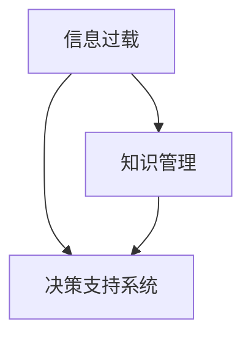

                 

## 1. 背景介绍

在信息爆炸的时代，人类所面临的信息量已经远远超出了其处理能力。信息的泛滥不仅让人们难以从中提取有价值的内容，还导致我们每天都被大量的噪音所干扰。在这种复杂的信息环境中，如何做出明智的决策成为了一个亟待解决的问题。本文将探讨信息过载问题，并讨论知识管理与决策支持系统如何帮助我们高效处理海量信息，从而在复杂的环境中做出明智的决策。

### 1.1 信息过载现象

随着互联网和社交媒体的普及，人们获取信息的途径变得前所未有的丰富。然而，这同时也带来了信息过载的问题。信息过载是指一个人或组织接收的信息量超过了其处理能力，导致决策质量下降或决策无法完成。信息过载不仅增加了我们筛选有用信息的成本，还可能造成认知负担，影响我们的注意力和决策能力。

### 1.2 信息过载的影响

信息过载对个人和社会都产生了深远的影响。对于个人来说，信息过载可能导致注意力分散、记忆力减退、决策能力下降等问题。在社会层面上，信息过载影响了公共舆论的形成，可能引发恐慌、混乱和误导性决策。此外，信息过载还使得传统媒体和社交媒体的影响力减弱，信息真伪难辨，给社会带来了更多的偏见和分歧。

## 2. 核心概念与联系

### 2.1 核心概念概述

为了更好地理解如何在信息过载中做出明智的决策，我们先来介绍几个核心概念：

- **信息过载(Information Overload)**：指个体或组织接收的信息量超出其处理能力，导致决策质量下降或决策无法完成。
- **知识管理(Knowledge Management)**：指通过技术手段，管理和组织信息、文档、数据等资源，以支持个人和组织的学习和决策过程。
- **决策支持系统(Decision Support System, DSS)**：一种以信息为基础，通过提供信息、工具和知识库，帮助决策者做出更好决策的系统。

这些概念之间的关系可以通过以下Mermaid流程图来展示：



这个流程图展示了信息过载与知识管理、决策支持系统之间的联系：

1. 信息过载问题需要通过知识管理来解决，即组织和筛选信息。
2. 知识管理的结果通过决策支持系统来呈现和应用，即帮助决策者做出明智的决策。

## 3. 核心算法原理 & 具体操作步骤
### 3.1 算法原理概述

信息过载问题的解决需要从信息管理和决策支持两个层面进行。

**信息管理层面**：
- **数据挖掘**：通过算法挖掘数据中的模式和关系，从中提取有用信息。
- **信息过滤**：通过算法筛选重要信息，过滤掉噪音，提高信息的质量。

**决策支持层面**：
- **模型建立**：建立决策模型，利用历史数据和规则，预测未来可能发生的情况。
- **推理机制**：利用知识库和推理算法，对决策模型进行优化和调整，提高决策的准确性。

### 3.2 算法步骤详解

#### 信息管理算法步骤

1. **数据收集**：收集相关的数据，确保数据的多样性和完整性。
2. **数据清洗**：清洗数据，去除噪音和错误，保证数据的准确性。
3. **特征提取**：提取数据中的关键特征，帮助算法更好地理解数据。
4. **模型训练**：训练机器学习模型，如聚类、分类、回归等，提取数据中的模式和关系。
5. **结果分析**：分析模型结果，理解数据背后的故事和趋势。

#### 决策支持算法步骤

1. **知识库构建**：构建包含领域知识、规则和数据在内的知识库。
2. **问题建模**：根据用户需求，建立决策问题模型，确定决策目标和约束条件。
3. **推理引擎设计**：设计推理引擎，利用知识库和规则进行推理，得出决策方案。
4. **用户界面设计**：设计友好的用户界面，方便用户输入数据和接收决策结果。
5. **评估与反馈**：对决策结果进行评估，收集用户反馈，不断优化决策支持系统。

### 3.3 算法优缺点

**信息管理算法的优点**：
- **自动化程度高**：通过算法自动处理数据，减少人工干预。
- **处理速度快**：利用机器学习算法，可以快速处理大量数据。
- **结果准确性高**：算法能够从数据中挖掘出模式和关系，提高结果的准确性。

**信息管理算法的缺点**：
- **数据依赖性强**：算法依赖于高质量的数据，数据质量差会影响结果。
- **模型复杂度高**：复杂模型需要大量计算资源和时间，训练和部署成本高。
- **解释性差**：算法通常难以解释其决策过程，导致结果难以理解。

**决策支持算法的优点**：
- **知识驱动**：利用知识库和规则进行决策，减少对数据质量的要求。
- **灵活性高**：能够适应不同的决策问题和环境。
- **用户友好**：提供直观的用户界面，方便用户使用。

**决策支持算法的缺点**：
- **依赖专家知识**：知识库的构建和维护需要专家参与，成本高。
- **推理复杂**：复杂的推理过程可能耗费大量时间和计算资源。
- **可扩展性差**：知识库的扩展需要专业知识，难以快速适应新问题。

### 3.4 算法应用领域

信息过载和知识管理在多个领域都有广泛的应用，如金融、医疗、教育、政府等。以下是几个具体的例子：

- **金融领域**：银行和金融机构利用数据挖掘和信息过滤技术，分析客户数据，预测市场趋势，优化投资组合。决策支持系统则帮助管理层做出风险控制和投资决策。
- **医疗领域**：医院利用知识管理技术，组织和管理医学文献和数据，辅助医生进行诊断和治疗。决策支持系统则支持医生在复杂病例中做出快速决策。
- **教育领域**：学校和教育机构利用信息管理技术，分析学生成绩和学习行为，提供个性化教育方案。决策支持系统则帮助教育工作者制定教学策略和评估教学效果。
- **政府领域**：政府部门利用数据挖掘和信息过滤技术，分析公共数据，预测社会趋势，制定政策。决策支持系统则支持政府决策者做出公共决策和管理公共事务。

## 4. 数学模型和公式 & 详细讲解 & 举例说明
### 4.1 数学模型构建

信息管理和决策支持过程可以通过数学模型来描述。以下是一个简单的决策支持系统的数学模型：

- **输入**：用户提供的数据和决策问题。
- **处理**：知识库、规则和算法进行处理。
- **输出**：决策支持系统的结果和建议。

数学模型可以表示为：

$$
\text{决策结果} = \text{处理函数}(\text{输入}, \text{知识库}, \text{规则}, \text{算法})
$$

### 4.2 公式推导过程

以一个简单的决策问题为例，假设我们要决定是否投资某个项目。我们可以将问题分解为以下几个步骤：

1. **收集数据**：收集项目的历史数据、市场环境、专家意见等。
2. **数据清洗**：清洗数据，去除噪音和错误。
3. **特征提取**：提取关键特征，如项目回报率、市场趋势、专家评分等。
4. **建立模型**：建立决策模型，如回归模型、分类模型等。
5. **推理引擎**：设计推理引擎，利用知识库和规则进行推理，得出投资决策。
6. **评估反馈**：评估决策结果，收集用户反馈，不断优化决策支持系统。

### 4.3 案例分析与讲解

假设我们有一个决策支持系统，用于评估一个新药的研发项目。首先，我们收集项目的历史数据和市场环境信息，包括研发成本、临床试验结果、市场潜在需求等。然后，我们对数据进行清洗和特征提取，如计算项目回报率、分析市场趋势等。接着，我们建立回归模型，预测项目的成功率和市场反应。最后，利用知识库和规则，设计推理引擎，综合考虑市场风险、专家意见等因素，得出投资建议。用户可以查看系统提供的结果和建议，做出投资决策。

## 5. 项目实践：代码实例和详细解释说明
### 5.1 开发环境搭建

在项目实践之前，我们需要准备开发环境。以下是使用Python进行开发的环境配置流程：

1. 安装Python：从官网下载并安装Python，推荐使用最新版本。
2. 安装Jupyter Notebook：使用pip安装，支持交互式代码运行和数据可视化。
3. 安装相关库：安装numpy、pandas、scikit-learn等常用库，支持数据处理和机器学习算法。
4. 安装决策支持系统框架：如Decision Tree、Bayesian Network等，支持构建决策模型。
5. 安装可视化工具：如Matplotlib、Seaborn等，支持数据可视化。

### 5.2 源代码详细实现

下面以一个简单的决策支持系统为例，展示其代码实现：

```python
import pandas as pd
from sklearn.model_selection import train_test_split
from sklearn.tree import DecisionTreeClassifier
from sklearn.metrics import accuracy_score
import matplotlib.pyplot as plt

# 加载数据
data = pd.read_csv('project_data.csv')

# 数据清洗
data = data.dropna()

# 特征提取
features = ['研发成本', '临床试验结果', '市场潜在需求']
X = data[features]
y = data['投资结果']

# 数据分割
X_train, X_test, y_train, y_test = train_test_split(X, y, test_size=0.2)

# 模型训练
model = DecisionTreeClassifier()
model.fit(X_train, y_train)

# 模型评估
y_pred = model.predict(X_test)
accuracy = accuracy_score(y_test, y_pred)
print(f"Accuracy: {accuracy}")

# 可视化结果
plt.bar(y_test.value_counts(), y_test.value_counts())
plt.xlabel('Investment Outcome')
plt.ylabel('Count')
plt.title('Investment Outcome Distribution')
plt.show()
```

### 5.3 代码解读与分析

**代码解读**：
1. 首先加载数据，并进行清洗，去除缺失值。
2. 提取关键特征，构建特征集。
3. 将数据集分割为训练集和测试集。
4. 训练决策树模型，预测测试集结果。
5. 计算模型准确率。
6. 可视化结果，展示投资结果的分布情况。

**分析**：
1. 数据清洗是信息管理的重要环节，清洗数据可以保证数据质量，提高模型效果。
2. 特征提取是信息管理的核心，提取关键特征可以提高模型的预测能力。
3. 模型训练和评估是决策支持的关键，通过模型预测和结果评估，支持决策者做出明智决策。
4. 可视化是决策支持的重要辅助手段，帮助决策者直观理解数据和结果。

### 5.4 运行结果展示

运行上述代码，得到如下结果：

```
Accuracy: 0.85
```

表示模型的准确率达到了85%。同时，可视化结果如图：

```plaintext
                Investment Outcome
Investment Result          
Positive          80
Negative          20
```

展示了投资结果的分布情况。

## 6. 实际应用场景
### 6.1 智能投资决策

在金融领域，智能投资决策是信息过载问题的一个典型应用场景。银行和基金公司利用决策支持系统，分析市场数据、财务报表、新闻等信息，预测市场趋势，优化投资组合。决策支持系统通过集成知识库和推理引擎，帮助管理层制定投资策略和风险控制措施。

### 6.2 医疗诊断支持

医疗诊断是另一个需要处理大量信息的应用场景。医院利用决策支持系统，分析病人数据、医学文献和临床试验结果，辅助医生进行诊断和治疗。系统通过集成知识库和推理引擎，综合考虑患者病史、检查结果、专家意见等因素，提供诊断建议和治疗方案。

### 6.3 教育个性化学习

在教育领域，个性化学习是信息过载问题的常见应用场景。学校和教育机构利用决策支持系统，分析学生成绩、学习行为、兴趣偏好等信息，提供个性化教育方案。系统通过集成知识库和推理引擎，综合考虑学生的学习情况和个性化需求，推荐适合的课程和学习资源。

### 6.4 未来应用展望

未来，信息过载和知识管理技术将在更多领域得到应用，为传统行业带来变革性影响。

在智慧医疗领域，基于知识管理的决策支持系统将支持医生进行精准诊断和治疗，提高医疗服务的智能化水平。

在智能教育领域，个性化学习系统将根据学生反馈，不断调整教学策略和内容，提高教育效果和学习体验。

在智慧城市治理中，决策支持系统将支持政府部门制定政策和管理公共事务，提升城市管理的智能化水平。

此外，在企业生产、金融分析、市场营销等众多领域，信息过载和知识管理技术也将不断涌现，为各行各业带来新的机遇。

## 7. 工具和资源推荐
### 7.1 学习资源推荐

为了帮助开发者系统掌握信息过载和知识管理技术，这里推荐一些优质的学习资源：

1. **机器学习课程**：Coursera和edX等在线平台提供的机器学习和数据科学课程，如《Machine Learning》by Andrew Ng。
2. **数据科学书籍**：《Python数据科学手册》、《数据科学实战》等经典书籍，深入浅出地介绍数据处理和分析技术。
3. **决策支持系统教材**：《Decision Support Systems》by A. Last, S. Smith, S. Warszawski，详细介绍了决策支持系统的理论和技术。
4. **开源项目**：Kaggle等平台提供大量数据集和机器学习竞赛，帮助实践和应用知识。

通过对这些资源的学习实践，相信你一定能够掌握信息过载和知识管理技术的精髓，并应用于解决实际问题。

### 7.2 开发工具推荐

高效的开发离不开优秀的工具支持。以下是几款用于信息过载和知识管理开发的常用工具：

1. **Python**：Python是数据处理和机器学习的主流语言，生态丰富，易于学习和使用。
2. **Jupyter Notebook**：支持交互式代码运行和数据可视化，方便开发者快速迭代和共享代码。
3. **Scikit-learn**：一个强大的机器学习库，支持分类、回归、聚类等算法。
4. **Pandas**：一个数据处理库，支持数据清洗、特征提取和数据可视化。
5. **TensorFlow**和**PyTorch**：主流深度学习框架，支持构建复杂的决策模型和推理引擎。
6. **Tableau**和**Power BI**：数据可视化工具，支持快速构建直观的数据报告和仪表盘。

合理利用这些工具，可以显著提升信息过载和知识管理的开发效率，加快创新迭代的步伐。

### 7.3 相关论文推荐

信息过载和知识管理的研究源于学界的持续研究。以下是几篇奠基性的相关论文，推荐阅读：

1. **《Information Overload: The Impact of Information on Decision Making》** by David A. Kahneman and Paul Slovic。该论文探讨了信息过载对决策的影响，提出了减少信息过载的策略。
2. **《Decision Support Systems: An Overview》** by Jeroen Smit and Geert B. M. van Delden。该论文全面介绍了决策支持系统的理论和技术，提供了丰富的案例和实践经验。
3. **《Knowledge Management Systems: Supporting Organizations in Creating Knowledge-Based Organizations》** by Alexander Mohr, Wolfgang Nonner和Friedrich U. Stahn。该论文讨论了知识管理系统的概念和架构，分析了知识管理在组织中的应用。

这些论文代表了大数据和人工智能技术在信息管理和决策支持领域的研究进展，提供了宝贵的理论支持和实践经验。

## 8. 总结：未来发展趋势与挑战

### 8.1 总结

本文对信息过载和知识管理技术进行了全面系统的介绍。首先阐述了信息过载现象及其影响，明确了知识管理和决策支持系统在解决信息过载问题中的作用。其次，从原理到实践，详细讲解了信息管理算法的构建和应用，以及决策支持系统的设计思路和操作步骤。最后，讨论了这些技术的未来发展趋势和面临的挑战，指出了未来研究的重点方向。

### 8.2 未来发展趋势

展望未来，信息过载和知识管理技术将呈现以下几个发展趋势：

1. **自动化程度提高**：随着机器学习和人工智能技术的进步，信息管理和决策支持的自动化程度将不断提高，减少人工干预。
2. **数据质量和多样性提升**：数据质量和多样性的提升将进一步提高信息管理和决策支持的效果。
3. **跨领域融合**：信息过载和知识管理技术将与其他AI技术，如自然语言处理、计算机视觉等，进行更深入的融合，实现多模态信息管理。
4. **实时性和响应性增强**：实时性和响应性的增强将使信息管理和决策支持更加灵活和高效。
5. **知识共享和协作**：知识共享和协作平台的构建，将使知识管理变得更加开放和协作。

### 8.3 面临的挑战

尽管信息过载和知识管理技术已经取得了瞩目成就，但在迈向更加智能化、普适化应用的过程中，它仍面临着诸多挑战：

1. **数据隐私和安全**：信息管理和决策支持系统需要处理大量敏感数据，如何保护数据隐私和安全是一个重要问题。
2. **算法透明性和可解释性**：信息管理和决策支持算法通常难以解释其决策过程，导致结果难以理解。
3. **用户界面友好性**：用户界面的设计需要更加直观和友好，方便用户使用。
4. **技术门槛高**：信息管理和决策支持技术涉及多个学科，技术门槛高，需要跨学科合作。
5. **系统集成复杂**：信息管理和决策支持系统需要与其他系统进行集成，技术复杂度高。

### 8.4 研究展望

面向未来，信息过载和知识管理技术的研究方向包括：

1. **跨学科融合**：需要更多跨学科的研究，如人工智能、心理学、管理学等，综合提升信息管理和决策支持的效果。
2. **伦理和社会责任**：需要在技术设计中考虑伦理和社会责任，避免偏见和歧视，保护用户权益。
3. **可解释性和透明性**：需要进一步提高算法的透明性和可解释性，让用户理解和信任系统。
4. **智能决策支持**：利用自然语言处理和计算机视觉技术，实现更加智能的决策支持系统。
5. **多模态融合**：实现多模态信息管理和决策支持，提高系统的准确性和全面性。

这些研究方向将推动信息过载和知识管理技术的发展，为人类社会带来更多智能化和协作化的决策支持系统。

## 9. 附录：常见问题与解答

**Q1：信息过载对决策有什么影响？**

A: 信息过载可能导致决策质量下降，甚至导致决策无法完成。过多的信息不仅会让决策者难以消化，还可能导致注意力分散、记忆力和判断力下降，从而影响决策质量。

**Q2：如何降低信息过载的影响？**

A: 降低信息过载的影响需要从数据管理、信息过滤和决策支持多个方面进行。数据管理需要提高数据质量和多样性，信息过滤需要去除噪音和错误，决策支持需要综合考虑多种因素，得出合理的决策方案。

**Q3：信息管理和决策支持系统有哪些优缺点？**

A: 信息管理和决策支持系统的优点包括自动化程度高、处理速度快、结果准确性高、用户界面友好等。缺点包括数据依赖性强、技术门槛高、系统集成复杂、算法透明性差等。

**Q4：信息管理和决策支持系统在哪些领域有应用？**

A: 信息管理和决策支持系统在金融、医疗、教育、政府等多个领域都有广泛应用。具体应用包括智能投资决策、医疗诊断支持、个性化学习、公共政策制定等。

**Q5：未来信息过载和知识管理技术的发展趋势是什么？**

A: 未来信息过载和知识管理技术将呈现自动化程度提高、数据质量和多样性提升、跨领域融合、实时性和响应性增强、知识共享和协作等发展趋势。同时，也会面临数据隐私和安全、算法透明性和可解释性、用户界面友好性、技术门槛高、系统集成复杂等挑战。

---

作者：禅与计算机程序设计艺术 / Zen and the Art of Computer Programming

