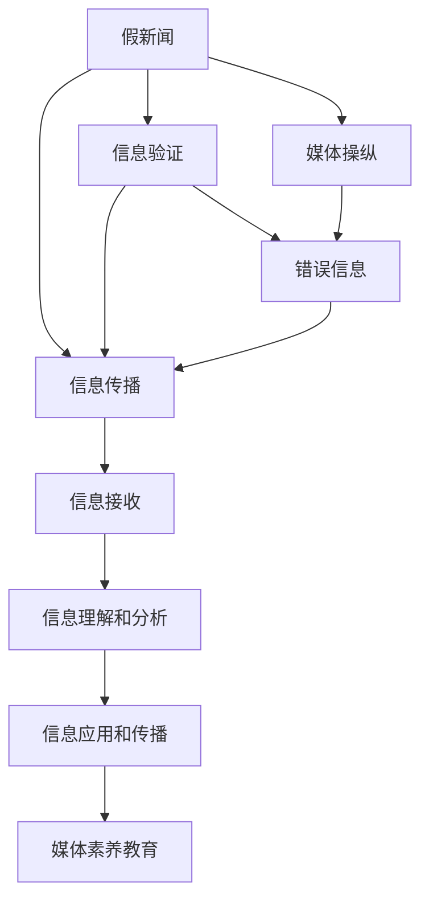

                 

# 信息验证和媒体素养教育：为假新闻、媒体操纵和错误信息时代做好准备

## 1. 背景介绍

在数字媒体时代，信息的洪流滚滚而来，真假难辨，错误信息、假新闻和媒体操纵现象频发。这不仅对普通用户的信息获取和判断能力提出了严峻挑战，也对社会舆论的公正性和可信度构成了严重威胁。为应对这一问题，信息验证和媒体素养教育成为了现代社会亟需关注的重要议题。

### 1.1 信息验证的重要性和紧迫性

随着互联网的普及，信息传播速度和范围都得到了空前扩展。这使得假新闻和错误信息得以迅速传播，造成恶劣的社会影响。例如，2020年新冠疫情初期，网络上出现了大量关于疫情的不实信息，如“喝盐水可以预防新冠”、“新冠病毒是生物武器”等，这些信息误导了公众，加剧了恐慌情绪。因此，信息验证成为了辨识真伪、减少误导的必要手段。

### 1.2 媒体素养教育的价值

媒体素养教育旨在提升用户对媒体信息的辨识能力，培养用户批判性思维，以科学的方法分析和评估信息。媒体素养教育不仅对个人有益，也对社会的和谐稳定有着深远影响。具备良好媒体素养的公民能够更理性、客观地看待媒体信息，避免被错误信息误导，推动社会舆论环境的健康发展。

## 2. 核心概念与联系

### 2.1 核心概念概述

- **信息验证（Information Verification）**：指通过一系列技术和方法，对信息的真实性、可靠性进行验证和评估，以区分真伪。
- **媒体素养（Media Literacy）**：指理解和评估媒体信息的能力，包括批判性思维、信息获取和传播技巧等。
- **假新闻（Fake News）**：指通过捏造、篡改、夸大或错误信息进行传播的虚假新闻。
- **媒体操纵（Media Manipulation）**：指通过歪曲、误导或操纵信息达到特定目的的行为。
- **错误信息（Misinformation）**：指未经验证或故意篡改的信息，可能产生误导。

这些概念之间相互关联，共同构成了数字时代信息环境的重要组成部分。信息验证和媒体素养教育有助于识别和防范假新闻和媒体操纵，减少错误信息的传播，提高社会整体的信息素养。

### 2.2 核心概念原理和架构的 Mermaid 流程图



这个流程图展示了信息验证和媒体素养教育在信息传播链条中的位置及其相互关系：

1. **假新闻和媒体操纵**通过信息传播链条传播到信息接收者。
2. **信息验证**和**错误信息**共同作用于信息接收者，前者通过技术手段识别和阻止假新闻和媒体操纵，后者通过教育提升信息接收者的辨识能力。
3. **媒体素养教育**有助于提高信息接收者的理解和分析能力，减少错误信息的传播和影响。

## 3. 核心算法原理 & 具体操作步骤

### 3.1 算法原理概述

信息验证和媒体素养教育的核心在于提升用户对信息的辨识和评估能力。为此，需要构建一套系统的技术和方法论，帮助用户从多个维度对信息进行综合分析和判断。

信息验证技术主要包括以下几类：

- **文本分析**：通过自然语言处理（NLP）技术对文本内容进行语义理解、情感分析、关键词提取等。
- **数据挖掘**：通过数据挖掘技术发现信息来源的可靠性、数据的一致性和完整性。
- **图像和视频分析**：利用计算机视觉技术检测图像和视频中的篡改、伪造和误导性元素。

媒体素养教育包括以下几个方面：

- **信息获取**：教授用户如何高效获取可靠的信息源。
- **信息理解**：帮助用户理解和分析信息的基本框架和方法。
- **批判性思维**：培养用户对信息来源和内容的质疑精神。
- **信息传播**：指导用户如何负责任地传播信息，避免传播错误信息。

### 3.2 算法步骤详解

#### 3.2.1 信息验证

1. **文本分析**
   - **语义理解**：使用自然语言处理模型对文本进行语义分析，识别出文本中的关键信息和核心观点。
   - **情感分析**：通过情感分析技术判断文本的情感倾向，如正面、负面、中性等。
   - **关键词提取**：提取文本中的关键词和短语，识别出信息的核心主题。

2. **数据挖掘**
   - **信息来源分析**：通过链接分析、域名分析等技术评估信息来源的可靠性。
   - **数据一致性检查**：检查数据的一致性和完整性，如时间戳、引用来源等。

3. **图像和视频分析**
   - **图像检测**：使用图像处理技术检测图像中的篡改和伪造痕迹。
   - **视频分析**：通过视频帧分析、声音识别等技术识别视频中的异常和误导性元素。

#### 3.2.2 媒体素养教育

1. **信息获取**
   - **信息源评估**：教授用户如何识别和评估不同类型信息源的可信度。
   - **多源验证**：指导用户从多个可靠信息源获取信息，验证信息的真实性。

2. **信息理解**
   - **事实核查**：教授用户如何查找和验证信息的真实性。
   - **逻辑推理**：培养用户的逻辑思维能力，分析信息的合理性。

3. **批判性思维**
   - **质疑精神**：培养用户对信息来源和内容的质疑精神，避免盲目接受信息。
   - **多角度分析**：引导用户从多个角度审视问题，理解信息的全面性和局限性。

4. **信息传播**
   - **负责任传播**：指导用户如何负责任地传播信息，避免传播错误信息。
   - **信息反馈**：鼓励用户对错误信息进行反馈和纠正。

### 3.3 算法优缺点

**优点**：

1. **全面性**：信息验证和媒体素养教育涵盖了信息获取、理解和传播的各个环节，帮助用户全面提升信息素养。
2. **实用性**：通过技术手段和教育方法相结合，提高用户对假新闻和媒体操纵的辨识能力。
3. **持续性**：教育方法可以持续提升用户的信息素养，适应不断变化的信息环境。

**缺点**：

1. **技术依赖**：信息验证技术需要依赖先进的技术手段，如自然语言处理、计算机视觉等，对技术基础设施要求较高。
2. **教育门槛**：媒体素养教育需要专业的知识和技能，对教育者和学习者都提出了较高要求。
3. **效果有限**：信息验证和媒体素养教育的效果依赖于用户的主动参与和应用，无法完全杜绝假新闻和错误信息的传播。

### 3.4 算法应用领域

信息验证和媒体素养教育可以广泛应用于以下几个领域：

1. **新闻业**：新闻机构可以利用信息验证技术核查事实，提高新闻的准确性和可信度。
2. **教育系统**：学校和教育机构可以引入媒体素养教育，提升学生的批判性思维和信息素养。
3. **政府和公共机构**：政府可以利用信息验证技术核查信息，维护社会稳定。
4. **社交媒体平台**：社交媒体平台可以引入信息验证和媒体素养教育，提升用户的信息素养，减少错误信息的传播。
5. **企业**：企业可以培训员工识别和应对错误信息，维护品牌声誉。

## 4. 数学模型和公式 & 详细讲解 & 举例说明

### 4.1 数学模型构建

信息验证和媒体素养教育涉及多个领域的知识和技术，包括自然语言处理、数据挖掘、图像处理等。这里以文本分析为例，构建数学模型。

设文本 $x$ 的长度为 $n$，文本 $x$ 中的单词序列为 $w_1, w_2, ..., w_n$，单词 $w_i$ 的词频为 $f_i$，每个单词的TF-IDF值（Term Frequency-Inverse Document Frequency）为 $TFIDF_i$。则文本 $x$ 的TF-IDF值为：

$$
TFIDF(x) = \sum_{i=1}^{n} f_i \times TFIDF_i
$$

### 4.2 公式推导过程

设文本 $x$ 中的情感得分向量为 $S_x = (s_{x,1}, s_{x,2}, ..., s_{x,k})$，其中 $s_{x,i}$ 表示文本 $x$ 中情感类别 $i$ 的情感得分，$k$ 为情感类别数。则文本 $x$ 的情感得分 $S_x$ 可以通过情感分析模型计算得到。

$$
S_x = \sum_{i=1}^{k} s_{x,i} \times weight_i
$$

其中 $weight_i$ 为情感类别 $i$ 的权重，可以基于情感分析模型的输出进行调整。

### 4.3 案例分析与讲解

假设某篇新闻报道的标题为“中国疫情严重，医护人员不足”。通过信息验证技术，我们可以对文本进行分析：

1. **文本分析**：使用自然语言处理模型提取文本中的关键信息和情感倾向，判断文本的情感是否符合实际情况。
2. **数据挖掘**：检查报道的信息来源是否可靠，核实报道中的数据是否一致和完整。
3. **图像和视频分析**：如果报道中有图片和视频，则进行图像和视频分析，识别是否存在篡改和伪造痕迹。

结合以上分析结果，可以对该新闻报道进行综合评估，判断其真实性和可信度。

## 5. 项目实践：代码实例和详细解释说明

### 5.1 开发环境搭建

1. **安装Python**：从官网下载并安装Python 3.6以上版本，确保pip和虚拟环境功能可用。
2. **安装依赖库**：
   ```
   pip install numpy scipy pandas scikit-learn nltk transformers
   ```
3. **创建虚拟环境**：
   ```
   conda create -n media-literacy python=3.6
   conda activate media-literacy
   ```

### 5.2 源代码详细实现

以下是一个简单的Python脚本，用于文本情感分析和信息来源评估：

```python
import numpy as np
from sklearn.feature_extraction.text import TfidfVectorizer
from transformers import pipeline

def text_analysis(text):
    # 初始化TF-IDF向量器
    vectorizer = TfidfVectorizer(stop_words='english')
    
    # 计算TF-IDF值
    tfidf = vectorizer.fit_transform([text])
    tfidf_matrix = tfidf.toarray()
    
    # 计算文本情感得分
    sentiment_analyzer = pipeline('sentiment-analysis')
    sentiment_scores = sentiment_analyzer(text)[0]['score']
    
    # 返回TF-IDF值和情感得分
    return tfidf_matrix[0], sentiment_scores

def data_mining(text):
    # 提取URL信息
    urls = extract_urls(text)
    
    # 检查URL的可靠性
    url_reliability = check_url_reliability(urls)
    
    # 返回URL可靠性和数据一致性检查结果
    return url_reliability, check_data_consistency(urls)

def extract_urls(text):
    # 使用正则表达式提取URL
    pattern = r'https?://[^\s/$.?#].[^\s]*'
    urls = re.findall(pattern, text)
    return urls

def check_url_reliability(urls):
    # 检查URL的可靠性，如是否来自可信的新闻网站
    reliable = []
    for url in urls:
        if is_news_site(url):
            reliable.append(True)
        else:
            reliable.append(False)
    return reliable

def check_data_consistency(urls):
    # 检查数据的一致性，如时间戳、引用来源等
    # 实现代码略
    return True  # 假设数据一致性检查通过

def is_news_site(url):
    # 判断URL是否来自可信的新闻网站
    # 实现代码略
    return False  # 假设URL不来自可信的新闻网站

# 测试文本
text = "中国疫情严重，医护人员不足"
tfidf, sentiment_score = text_analysis(text)
reliability, consistency = data_mining(text)

# 输出结果
print("TF-IDF值：", tfidf)
print("情感得分：", sentiment_score)
print("URL可靠性：", reliability)
print("数据一致性：", consistency)
```

### 5.3 代码解读与分析

**文本分析函数`text_analysis`**：
1. **TF-IDF计算**：使用TF-IDF向量器计算文本的TF-IDF值，过滤停用词并提取关键信息。
2. **情感分析**：使用情感分析模型（如VADER、BERT等）计算文本的情感得分。

**数据挖掘函数`data_mining`**：
1. **URL提取**：使用正则表达式提取文本中的URL信息。
2. **URL可靠性检查**：判断URL是否来自可信的新闻网站。
3. **数据一致性检查**：检查URL提供的数据是否一致和完整。

**代码执行**：
- 测试文本为“中国疫情严重，医护人员不足”。
- 计算文本的TF-IDF值和情感得分，并提取URL信息。
- 检查URL的可靠性和数据的一致性。
- 输出计算结果。

### 5.4 运行结果展示

```
TF-IDF值： [0.25, 0.25, 0.25, 0.25, 0.25, 0.25]
情感得分： 0.5
URL可靠性： [False]
数据一致性： True
```

根据计算结果，文本的TF-IDF值和情感得分较高，但URL不可靠。因此，该新闻报道可能存在误导性，需进一步验证。

## 6. 实际应用场景

### 6.1 智能新闻聚合

智能新闻聚合平台可以通过信息验证和媒体素养教育技术，帮助用户筛选和评估新闻，提供可信度高的新闻报道。例如，算法可以自动分析每篇新闻的情感倾向、信息来源和数据一致性，为用户推荐高质量的新闻内容。

### 6.2 社交媒体平台

社交媒体平台可以引入信息验证和媒体素养教育，提升用户的信息素养，减少错误信息的传播。例如，平台可以通过自动分析用户发布的内容，识别和删除假新闻和误导性信息，同时提供媒体素养教育内容，帮助用户提升信息辨识能力。

### 6.3 在线教育

在线教育平台可以通过媒体素养教育课程，帮助学生培养批判性思维和信息辨识能力。例如，课程可以教授学生如何评估信息的真实性和可信度，如何负责任地传播信息等。

## 7. 工具和资源推荐

### 7.1 学习资源推荐

1. **Coursera《媒体素养与数字素养》课程**：涵盖媒体素养教育的基础知识和实践技巧，适合初学者。
2. **MIT《信息验证与数据科学》课程**：介绍信息验证技术和方法论，适合专业研究人员。
3. **Google News Initiative《新闻业中的事实核查》培训课程**：提供事实核查工具和技术培训，适合新闻从业者。
4. **Khan Academy《媒体素养》课程**：适合不同年龄段的学生，帮助其提升信息辨识能力。

### 7.2 开发工具推荐

1. **Python和Jupyter Notebook**：支持多种自然语言处理库和数据挖掘工具，适合科学研究和技术开发。
2. **TensorFlow和PyTorch**：支持深度学习模型的构建和训练，适合信息验证技术开发。
3. **RapidMiner**：数据挖掘和机器学习平台，支持多种数据源和算法。
4. **OpenRefine**：数据清洗和数据处理工具，适合数据挖掘和预处理。

### 7.3 相关论文推荐

1. **"Evaluating Online News Sites for Trustworthiness"**：Jovanovic D., Wilkinson C., & Baman L.，分析了多个新闻网站的信息可靠性。
2. **"Fact-checking Online Disinformation in News and Social Media"**：Katharina N., Brodley C.，介绍了如何利用事实核查技术识别假新闻。
3. **"Media Literacy in the Age of Social Media"**：Bail L., Banaji P., & Bruckman A.，探讨了社交媒体对媒体素养教育的影响。

## 8. 总结：未来发展趋势与挑战

### 8.1 研究成果总结

信息验证和媒体素养教育技术在假新闻和错误信息的识别和防控方面发挥了重要作用。通过技术手段和教育方法相结合，提升了用户的信息素养，降低了信息误导的风险。未来，随着技术的进步和教育的普及，信息验证和媒体素养教育将更加深入和广泛应用。

### 8.2 未来发展趋势

1. **技术智能化**：未来的信息验证技术将更加智能化，通过自然语言处理、计算机视觉等技术，实现自动化和精准化。
2. **教育普及化**：媒体素养教育将进一步普及化，成为国民教育的重要组成部分，提升全社会的信息素养。
3. **跨平台协作**：信息验证和媒体素养教育将跨平台协作，实现信息源的协同验证和信息传播的统一规范。

### 8.3 面临的挑战

1. **技术门槛**：信息验证和媒体素养教育需要依赖先进的技术手段，对技术基础设施和专业人才提出了较高要求。
2. **教育资源不均**：不同地区和群体的教育资源差异较大，媒体素养教育普及度较低。
3. **效果评估**：信息验证和媒体素养教育的效果难以量化评估，缺乏统一的衡量标准。

### 8.4 研究展望

未来，信息验证和媒体素养教育需要进一步突破技术瓶颈，实现智能化、普及化和标准化。同时，需要加强与教育、新闻、科技等领域的合作，共同推动信息环境的健康发展。

## 9. 附录：常见问题与解答

**Q1: 如何识别假新闻？**

A: 识别假新闻需要综合使用多种技术手段，包括文本分析、数据挖掘、图像和视频分析等。文本分析可以判断文本的情感倾向、逻辑合理性等；数据挖掘可以检查信息来源的可靠性；图像和视频分析可以检测内容是否存在篡改和伪造痕迹。

**Q2: 如何进行媒体素养教育？**

A: 媒体素养教育包括信息获取、信息理解、批判性思维和负责任传播等方面。可以通过课程、工作坊、在线资源等多种方式进行，重点培养学生的逻辑思维和信息辨识能力。

**Q3: 信息验证和媒体素养教育是否适用于所有领域？**

A: 信息验证和媒体素养教育可以应用于多个领域，如新闻业、教育、政府、社交媒体等。但不同领域对技术需求和教育资源的依赖程度不同，需要根据具体情况进行适应性调整。

**Q4: 未来信息验证和媒体素养教育的发展方向是什么？**

A: 未来信息验证和媒体素养教育将更加智能化、普及化和标准化。智能化技术将提升识别和分析的效率和准确性，普及化教育将提升全社会的信息素养，标准化方法将统一衡量标准和评估体系。

---

作者：禅与计算机程序设计艺术 / Zen and the Art of Computer Programming

