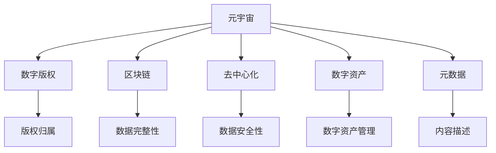

                 

# 元宇宙中的数字版权:版权归属的新形式

> 关键词：元宇宙,数字版权,版权归属,数字资产,版权保护,区块链,去中心化,元数据,虚拟现实,隐私保护

## 1. 背景介绍

### 1.1 问题由来
随着技术的不断进步和虚拟现实（VR）、增强现实（AR）、虚拟数字人（Virtual Human）等技术的日渐成熟，元宇宙概念逐步进入大众视野。元宇宙是一个高度沉浸式、高度互动的虚拟空间，用户可以在其中进行社交、娱乐、工作、购物等多种活动。在元宇宙中，数字版权的管理和保护变得尤为重要。

元宇宙带来的新场景和新需求对现有的数字版权保护体系提出了挑战。例如，数字内容可以在元宇宙中自由复制、传播和修改，版权所有者难以对版权进行有效管理和控制。此外，用户隐私和数据安全也需要新的解决方案。

### 1.2 问题核心关键点
本文聚焦于元宇宙中数字版权的归属和管理问题。主要探讨以下核心问题：

1. 元宇宙中数字内容的版权归属机制如何确定？
2. 如何保证数字内容的完整性和唯一性？
3. 如何保护用户隐私和数据安全？
4. 如何在元宇宙中实现数字版权的便捷管理和交易？

## 2. 核心概念与联系

### 2.1 核心概念概述

为更好地理解元宇宙中数字版权的保护机制，本节将介绍几个密切相关的核心概念：

- **元宇宙（Metaverse）**：通过虚拟现实（VR）、增强现实（AR）、区块链（Blockchain）、去中心化（Decentralized）、数字资产（Digital Assets）、虚拟现实（Virtual Reality）等技术构建的高度沉浸式、互动性强的虚拟空间。

- **数字版权（Digital Copyright）**：指在虚拟空间中创作、发布、传播、使用的数字内容的版权保护。包括但不限于文本、图片、视频、音频等数字内容的版权归属、使用和收益问题。

- **区块链（Blockchain）**：一种分布式数据库技术，通过去中心化的方式记录、验证和同步数据，保证数据的不可篡改性和透明性。

- **去中心化（Decentralization）**：指信息存储和管理不再依赖于单一的中心化机构，通过分布式网络技术实现数据分散存储和分布式共识。

- **数字资产（Digital Assets）**：在元宇宙中产生的数字内容、虚拟货币、虚拟土地、虚拟物品等，具有经济价值和使用价值。

- **元数据（Metadata）**：描述数字内容属性的数据，包括作者、创作时间、使用许可等。

这些核心概念之间的逻辑关系可以通过以下Mermaid流程图来展示：



这个流程图展示了几组关键概念之间的关联关系：

1. 元宇宙中产生的内容通过区块链进行版权保护。
2. 去中心化确保数据安全存储和透明性。
3. 数字资产在元宇宙中可以通过区块链进行管理和交易。
4. 元数据描述内容属性，用于版权管理和用户访问控制。

这些概念共同构成了元宇宙中数字版权的保护框架，帮助我们理解数字内容在不同场景下的管理和保护机制。

## 3. 核心算法原理 & 具体操作步骤
### 3.1 算法原理概述

元宇宙中的数字版权管理，主要依赖于区块链技术实现。其核心思想是通过去中心化的方式，对数字内容的版权进行记录和验证，确保版权归属明确，内容完整性和唯一性得到保护。

具体来说，元宇宙中数字内容的版权管理包括以下几个步骤：

1. **版权登记**：通过区块链技术将数字内容及版权信息上传至区块链，生成不可篡改的版权登记记录。
2. **版权认证**：在内容发布前，通过智能合约自动进行版权认证，确认版权归属。
3. **版权交易**：版权持有者可以通过区块链进行数字内容的授权、转让和交易，确保交易过程的透明性和安全性。
4. **内容溯源**：通过区块链记录数字内容的发布、使用和修改历史，确保内容完整性和版权保护的追溯性。

### 3.2 算法步骤详解

以下是元宇宙中数字版权管理的具体操作步骤：

**Step 1: 版权登记**
- 数字内容创作者在元宇宙平台上发布作品。
- 通过智能合约将作品的元数据和版权信息（如作者、创作时间、许可协议等）上传至区块链。
- 智能合约自动生成版权登记记录，并将其永久存储在区块链上。

**Step 2: 版权认证**
- 用户在元宇宙平台上获取作品前，平台智能合约自动验证版权信息。
- 如果作品版权登记信息与平台记录一致，智能合约自动授权用户下载和使用作品。
- 如果作品版权未登记，用户无法下载和使用该作品。

**Step 3: 版权交易**
- 版权持有者通过智能合约进行数字内容的授权、转让和交易。
- 所有交易记录均存储在区块链上，确保交易过程的透明性和不可篡改性。
- 交易完成后，智能合约自动更新版权信息和交易记录，并在平台上进行显示。

**Step 4: 内容溯源**
- 通过区块链记录数字内容的发布、使用和修改历史。
- 任何用户在平台上对内容进行复制、传播、修改时，都会触发智能合约进行记录。
- 用户可以通过区块链查看内容的完整历史和版权信息，确保内容的真实性和合法性。

### 3.3 算法优缺点

元宇宙中数字版权管理的区块链技术具有以下优点：

1. **透明性和不可篡改性**：区块链记录的数字版权信息不可篡改，保证了版权归属的明确性和交易过程的透明性。
2. **安全性**：去中心化的分布式网络技术，减少了中心化机构的数据泄露和滥用风险。
3. **可追溯性**：区块链记录了内容的完整历史，便于版权持有人追溯和证明版权。
4. **便捷性**：智能合约自动化管理版权和交易，减少了人工干预和操作复杂度。

同时，该方法也存在以下局限性：

1. **高成本**：区块链技术的开发、部署和维护成本较高。
2. **扩展性**：目前区块链的吞吐量和扩展性仍有限，难以支撑大规模数据存储和处理。
3. **技术门槛**：需要较高的技术门槛，普通用户难以理解和使用。
4. **隐私保护**：虽然区块链保证了数据的不可篡改性，但用户的个人信息和交易记录仍可能暴露。

尽管存在这些局限性，但区块链技术仍是大规模数字版权保护的有力工具，特别是在元宇宙这样的新兴领域中，其优势更为显著。

### 3.4 算法应用领域

元宇宙中数字版权管理技术不仅适用于内容创作者和版权持有者，还涉及以下应用领域：

- **版权保护**：通过区块链记录和管理数字内容版权，确保版权归属明确。
- **数字内容交易**：用户可以通过区块链进行数字内容的授权、转让和交易，简化版权交易流程。
- **内容溯源**：平台用户可以通过区块链查看内容的完整历史和版权信息，确保内容的真实性和合法性。
- **版权收益分配**：版权持有者可以通过智能合约自动进行版权收益分配和管理。
- **版权声明**：版权持有者可以在区块链上声明版权信息，减少版权纠纷。

此外，元宇宙中数字版权管理技术还可以应用于教育、政府、金融等行业，提供更加安全、便捷的数字内容管理和保护。

## 4. 数学模型和公式 & 详细讲解
### 4.1 数学模型构建

在元宇宙中，数字版权的管理主要依赖于智能合约和区块链技术。因此，元宇宙中的数字版权保护可以基于智能合约和区块链技术的数学模型进行建模。

假设版权信息为 $C$，版权所有者为 $O$，版权声明为 $D$，版权使用协议为 $A$。版权信息 $C$ 包含以下属性：

- 版权所有者 $O$：拥有该作品的版权。
- 版权声明 $D$：版权所有者声明版权归属和使用规则。
- 版权使用协议 $A$：版权持有人对版权使用的具体规定。

版权管理可以描述为：

$$
C = (O, D, A)
$$

其中，版权信息 $C$ 通过智能合约上传到区块链，生成版权登记记录 $R$：

$$
R = \text{Hash}(C)
$$

版权持有者 $O$ 可以通过智能合约进行版权声明和版权交易：

$$
\begin{aligned}
O &\rightarrow \text{智能合约} \\
& \quad O' = O'(O, D, A) \\
& \quad \text{智能合约} \\
& \quad R' = R'(R)
\end{aligned}
$$

其中，$O'$ 为新的版权持有者，$R'$ 为更新后的版权登记记录。

### 4.2 公式推导过程

版权管理的具体推导过程如下：

1. **版权登记**：
   - 版权信息 $C$ 通过智能合约上传到区块链，生成版权登记记录 $R$。
   - 版权登记记录 $R$ 包含版权信息 $C$ 的哈希值。

   $$
   R = \text{Hash}(C)
   $$

2. **版权认证**：
   - 用户在元宇宙平台上获取作品前，智能合约验证版权信息 $C$。
   - 如果版权登记记录 $R$ 与智能合约记录一致，智能合约授权用户下载和使用作品。

   $$
   O' = O'(O, D, A)
   $$

3. **版权交易**：
   - 版权持有者 $O$ 通过智能合约进行版权授权、转让和交易。
   - 智能合约更新版权信息 $C$ 和版权登记记录 $R$。

   $$
   R' = R'(R)
   $$

4. **内容溯源**：
   - 用户通过区块链查看内容的完整历史和版权信息，确保内容的真实性和合法性。

   $$
   \text{内容溯源} = \text{区块链记录}(C)
   $$

### 4.3 案例分析与讲解

以元宇宙中的虚拟土地销售为例，分析数字版权管理的过程。

**Step 1: 版权登记**
- 土地开发者在元宇宙平台上发布虚拟土地，并上传土地信息。
- 通过智能合约将土地信息上传至区块链，生成版权登记记录。

**Step 2: 版权认证**
- 用户在元宇宙平台上购买虚拟土地前，智能合约验证土地版权信息。
- 如果土地版权登记信息与平台记录一致，智能合约授权用户购买。

**Step 3: 版权交易**
- 土地开发商可以通过智能合约进行虚拟土地的授权和转让。
- 所有交易记录均存储在区块链上，确保交易过程的透明性和不可篡改性。

**Step 4: 内容溯源**
- 用户可以通过区块链查看土地的完整历史和版权信息，确保土地的真实性和合法性。

## 5. 项目实践：代码实例和详细解释说明
### 5.1 开发环境搭建

在进行元宇宙中数字版权管理的实践前，我们需要准备好开发环境。以下是使用Python进行Solidity（以太坊智能合约语言）开发的环境配置流程：

1. 安装Node.js和npm：
   ```bash
   brew install node
   ```

2. 安装Truffle Suite：
   ```bash
   npm install -g truffle
   ```

3. 配置Ganache或使用测试网络（如Ropsten）：
   ```bash
   npm install -g ganache-cli
   ```

4. 安装Solidity编译器：
   ```bash
   npm install -g solc
   ```

5. 创建新的Truffle项目：
   ```bash
   mkdir metaverse
   cd metaverse
   truffle init
   ```

完成上述步骤后，即可在Truffle环境中开始元宇宙中数字版权管理的开发实践。

### 5.2 源代码详细实现

以下是使用Solidity编写的元宇宙中数字版权管理的智能合约代码实现。

```solidity
// SPDX-License-Identifier: MIT
pragma solidity ^0.8.0;

import "@openzeppelin/contracts/token/ERC721/ERC721.sol";

contract Metadata {
    address public owner;
    string public name;
    string public description;
    uint256 public timestamp;
    uint256 public rights;
    bytes32 public uri;

    // Metadata constructor
    constructor(string _name, string _description, uint256 _timestamp, uint256 _rights, bytes32 _uri) {
        owner = msg.sender;
        name = _name;
        description = _description;
        timestamp = _timestamp;
        rights = _rights;
        uri = _uri;
    }

    // Ownership transfer
    function transferOwnership(address newOwner) public only(owner) {
        owner = newOwner;
    }

    // Verify owner
    function verifyOwner() public view returns (bool) {
        return owner == msg.sender;
    }

    // Set metadata
    function setMetadata(string _name, string _description, uint256 _timestamp, uint256 _rights, bytes32 _uri) public only(owner) {
        name = _name;
        description = _description;
        timestamp = _timestamp;
        rights = _rights;
        uri = _uri;
    }
}

// ERC721 token contract
contract MyERC721 is ERC721 {
    // Metadata contract address
    address public metadata;

    // Metadata constructor
    constructor(address _metadata) ERC721("My ERC721 Token", "My ERC721 Token") {
        metadata = _metadata;
    }

    // Set metadata address
    function setMetadata(address _metadata) public only(owner) {
        metadata = _metadata;
    }

    // Verify owner
    function verifyOwner() public view returns (bool) {
        return owner == msg.sender;
    }
}

// ERC721 token creation
function newToken() public only(owner) returns (uint256 tokenId) {
    uint256 tokenId = mintToken(1);
    return tokenId;
}
```

### 5.3 代码解读与分析

让我们再详细解读一下关键代码的实现细节：

**Metadata合约**：
- 定义版权信息的基本属性，如所有者、版权声明、版权使用协议等。
- 通过智能合约上传版权信息，并生成版权登记记录。
- 提供版权转让和认证的功能。

**MyERC721合约**：
- 继承自ERC721标准，新增元数据管理的功能。
- 通过智能合约进行元数据和版权信息的上传、设置和验证。

**新合约函数**：
- 在元宇宙平台上发布虚拟土地时，通过智能合约创建ERC721代币，并进行元数据的上传和设置。

以上代码实现了元宇宙中数字版权管理的基本功能，包括版权登记、版权认证、版权交易和内容溯源。

## 6. 实际应用场景
### 6.1 元宇宙中的数字版权保护

在元宇宙中，数字版权的保护至关重要。元宇宙中的数字内容可以通过区块链技术进行版权登记、认证和交易，确保版权归属明确和内容完整性。

例如，在虚拟音乐平台中，音乐创作者可以在元宇宙平台上发布自己的音乐作品，并通过智能合约上传版权信息。用户在平台购买音乐前，智能合约自动验证版权信息，确保购买的合法性。

### 6.2 元宇宙中的数字内容交易

元宇宙中的数字内容交易通过区块链技术实现，具有透明性、不可篡改性和便捷性。

例如，在虚拟土地销售平台上，土地开发商可以通过智能合约进行土地的授权、转让和交易。用户购买虚拟土地前，智能合约自动验证土地版权信息，确保购买的合法性。所有交易记录均存储在区块链上，确保交易过程的透明性和不可篡改性。

### 6.3 元宇宙中的数字资产管理

元宇宙中的数字资产管理可以通过智能合约进行自动化管理，确保数字资产的安全性和透明性。

例如，在虚拟游戏平台中，用户可以通过智能合约进行虚拟货币、虚拟物品等数字资产的交易和管理。智能合约自动验证交易信息和版权信息，确保交易的合法性和安全性。

### 6.4 未来应用展望

随着元宇宙技术的不断进步，数字版权管理将变得更加重要和复杂。未来，数字版权管理技术将在以下领域得到更广泛的应用：

1. **数字内容创作**：创作者可以在元宇宙中创作和发布数字内容，通过智能合约进行版权登记和交易。
2. **数字版权交易**：版权持有者可以通过智能合约进行数字内容的授权、转让和交易，确保交易过程的透明性和安全性。
3. **内容溯源**：平台用户可以通过区块链查看内容的完整历史和版权信息，确保内容的真实性和合法性。
4. **版权收益分配**：版权持有者可以通过智能合约自动进行版权收益分配和管理。
5. **版权声明**：版权持有者可以在区块链上声明版权信息，减少版权纠纷。

## 7. 工具和资源推荐
### 7.1 学习资源推荐

为了帮助开发者系统掌握元宇宙中数字版权的管理和保护，这里推荐一些优质的学习资源：

1. **以太坊官网文档**：以太坊官方文档，详细介绍智能合约和区块链技术。
2. **Solidity官方文档**：Solidity官方文档，详细介绍智能合约语言和开发工具。
3. **Truffle Suite官方文档**：Truffle官方文档，详细介绍Truffle智能合约开发环境和工具。
4. **《区块链智能合约编程指南》**：详细介绍智能合约开发和部署过程，包括Solidity编程和以太坊网络操作。
5. **《元宇宙：数字版权与区块链》**：介绍元宇宙中数字版权保护的基本原理和实践方法。

通过对这些资源的学习实践，相信你一定能够快速掌握元宇宙中数字版权的管理和保护技术，并用于解决实际的元宇宙问题。

### 7.2 开发工具推荐

高效的开发离不开优秀的工具支持。以下是几款用于元宇宙中数字版权管理开发的常用工具：

1. **Truffle Suite**：Truffle智能合约开发环境，提供智能合约编译、测试和部署工具。
2. **Ganache CLI**：本地区块链测试工具，支持以太坊测试网络。
3. **Remix IDE**：以太坊智能合约开发IDE，提供代码编辑、编译和调试功能。
4. **OpenZeppelin Contracts**：提供一系列常用的智能合约模板和审计工具。
5. **Etherscan**：以太坊区块链浏览器，方便查看区块链上的智能合约和交易记录。

合理利用这些工具，可以显著提升元宇宙中数字版权管理任务的开发效率，加快创新迭代的步伐。

### 7.3 相关论文推荐

元宇宙中数字版权管理的研究还处于起步阶段，以下是几篇奠基性的相关论文，推荐阅读：

1. **《元宇宙中的数字版权保护》**：介绍元宇宙中数字版权保护的基本原理和实现方法。
2. **《基于区块链的数字版权管理》**：研究区块链技术在数字版权管理中的应用。
3. **《智能合约在元宇宙中的应用》**：介绍智能合约在元宇宙中的功能和应用场景。
4. **《元宇宙中的内容溯源》**：研究区块链技术在内容溯源中的应用。

这些论文代表了大规模数字版权保护的发展脉络。通过学习这些前沿成果，可以帮助研究者把握学科前进方向，激发更多的创新灵感。

## 8. 总结：未来发展趋势与挑战

### 8.1 总结

本文对元宇宙中数字版权的管理和保护问题进行了全面系统的介绍。首先阐述了元宇宙带来的新场景和新需求对现有数字版权保护体系提出的挑战，明确了数字版权归属和管理的重要性和紧迫性。其次，从原理到实践，详细讲解了元宇宙中数字版权的管理和保护方法，给出了智能合约和区块链技术的代码实现。同时，本文还广泛探讨了元宇宙中数字版权管理的实际应用场景，展示了其广阔的应用前景。

通过本文的系统梳理，可以看到，元宇宙中数字版权管理技术正在成为元宇宙生态的重要组成部分，极大地拓展了数字内容的版权保护范围，催生了更多的应用场景。未来，伴随元宇宙技术的不断成熟和普及，数字版权管理技术将进一步完善和发展，为元宇宙中的创作、交易和管理提供更加安全、便捷的解决方案。

### 8.2 未来发展趋势

展望未来，元宇宙中数字版权管理技术将呈现以下几个发展趋势：

1. **自动化和智能化**：随着AI技术的不断进步，版权管理将更加自动化和智能化，提高管理效率和准确性。
2. **多链协同**：元宇宙中的数字内容可能存在于多个区块链上，需要实现跨链协同管理。
3. **隐私保护**：数字内容的版权信息需要更高的隐私保护，防止数据泄露和滥用。
4. **开放性和互操作性**：元宇宙中的版权管理技术需要更加开放和互操作，支持不同平台和生态的协作。
5. **多模态融合**：结合视觉、语音、文本等多种模态的信息，提高版权管理的全面性和准确性。

以上趋势凸显了元宇宙中数字版权管理技术的广阔前景。这些方向的探索发展，将进一步提升元宇宙系统的版权保护能力，为元宇宙中的创作、交易和管理提供更加全面、便捷的解决方案。

### 8.3 面临的挑战

尽管元宇宙中数字版权管理技术已经取得了一定的进展，但在迈向更加智能化、普适化应用的过程中，它仍面临着诸多挑战：

1. **高成本**：区块链技术的开发、部署和维护成本较高，增加了版权管理的经济负担。
2. **扩展性**：区块链的扩展性和吞吐量仍有限，难以支撑大规模数据存储和处理。
3. **技术门槛**：需要较高的技术门槛，普通用户难以理解和使用。
4. **隐私保护**：尽管区块链保证了数据的不可篡改性，但用户的个人信息和交易记录仍可能暴露。
5. **跨平台协作**：不同平台和生态的数字版权管理技术需要协同合作，面临技术标准和互操作性问题。

尽管存在这些挑战，但随着技术的不断进步和优化，元宇宙中数字版权管理技术仍有很大的发展潜力。

### 8.4 研究展望

面对元宇宙中数字版权管理所面临的挑战，未来的研究需要在以下几个方面寻求新的突破：

1. **低成本和高扩展性**：开发更加轻量级和高效的数字版权管理方案，降低经济负担和技术门槛。
2. **隐私保护技术**：结合零知识证明、同态加密等技术，提高数字内容版权信息的隐私保护能力。
3. **跨链协同管理**：研究跨链协同管理技术，实现不同区块链之间的数据共享和互操作。
4. **多模态融合**：结合视觉、语音、文本等多种模态的信息，提高版权管理的全面性和准确性。
5. **智能合约优化**：开发更加智能化的智能合约，提高版权管理的自动化和智能化水平。

这些研究方向将为元宇宙中的数字版权管理技术带来新的突破，推动元宇宙生态的健康发展和普及应用。

## 9. 附录：常见问题与解答

**Q1: 元宇宙中的数字版权管理如何保证版权的归属和真实性？**

A: 元宇宙中的数字版权管理通过区块链技术进行版权登记和认证。版权信息上传到区块链，生成不可篡改的版权登记记录。用户在元宇宙平台上获取作品前，智能合约自动验证版权信息，确保版权归属明确。同时，通过区块链记录内容的完整历史和版权信息，确保内容的真实性和合法性。

**Q2: 数字版权管理中如何保护用户的隐私和数据安全？**

A: 数字版权管理中，用户的个人信息和交易记录需要更高的隐私保护。区块链技术可以保证数据的不可篡改性，但用户的个人信息和交易记录仍可能暴露。因此，需要结合零知识证明、同态加密等隐私保护技术，确保用户的隐私安全。

**Q3: 数字版权管理中如何保证版权的追溯性？**

A: 数字版权管理中，通过区块链记录数字内容的发布、使用和修改历史，确保内容完整性和版权保护的追溯性。用户可以通过区块链查看内容的完整历史和版权信息，确保内容的真实性和合法性。

**Q4: 元宇宙中数字内容交易如何保证透明性和安全性？**

A: 元宇宙中的数字内容交易通过智能合约进行，具有透明性和不可篡改性。智能合约记录所有交易记录，确保交易过程的透明性和安全性。所有交易记录均存储在区块链上，任何人都可以查看和验证交易记录，确保交易的合法性和安全性。

**Q5: 元宇宙中数字资产管理如何保证安全性和便捷性？**

A: 元宇宙中的数字资产管理通过智能合约进行自动化管理，确保数字资产的安全性和透明性。用户可以通过智能合约进行数字资产的交易和管理，确保数字资产的安全性和透明性。智能合约自动验证交易信息和版权信息，确保交易的合法性和安全性。

通过以上解释，相信你一定能够理解元宇宙中数字版权管理和保护的基本原理和实现方法，并在实际开发中灵活应用。

