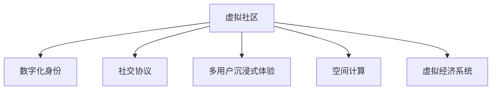

                 

# 元宇宙中的虚拟社区：全球社交网络的新形态

> 关键词：元宇宙,虚拟社区,全球社交网络,数字身份,社交协议,空间计算,多用户沉浸式体验,区块链技术,虚拟经济系统

## 1. 背景介绍

随着人工智能、虚拟现实(VR)、增强现实(AR)、云计算和区块链等技术的飞速发展，一个全新的社交网络形态——元宇宙（Metaverse）正逐渐成形。元宇宙是一个虚拟、共生的数字世界，其中包含无限逼近真实体验的数字空间，人们可以通过数字化身份在虚拟社区中自由互动，形成全新的社交方式和商业模式。

元宇宙的诞生，不仅标志着人类社交方式的根本变革，也为全球社交网络带来了新的机遇和挑战。虚拟社区作为元宇宙的核心组成单元，正在成为人们虚拟生活的主要空间。本文将从虚拟社区的概念、架构、技术原理与具体实现等方面，探讨元宇宙中虚拟社区的构建与运行机制，分析其对全球社交网络的影响与未来发展趋势。

## 2. 核心概念与联系

### 2.1 核心概念概述

元宇宙是一个由多个互通的虚拟世界组成的庞大网络，其中虚拟社区是其最基本、最核心的一部分。虚拟社区通常由一个或多个用户共建的虚拟空间组成，社区成员通过虚拟身份在社区中交流互动，分享虚拟资产、经历和知识。

虚拟社区的概念与现实世界的社交网络有诸多相似之处，例如：

- **数字化身份**：用户在虚拟社区中拥有唯一的数字身份，可以自由创建和更换。
- **社交协议**：虚拟社区中的用户通过一系列规范的协议进行交流互动，保证信息的流畅传递。
- **多用户沉浸式体验**：用户可以通过VR、AR等技术，获得逼真的互动体验，与虚拟世界深度融合。
- **空间计算**：在虚拟社区中，通过三维空间计算技术，实现复杂的场景构建和实时交互。
- **虚拟经济系统**：虚拟社区内置了虚拟经济系统，支持虚拟货币交易、虚拟物品买卖等商业活动。

### 2.2 核心概念联系与架构示意（Mermaid 流程图）



上图中，A、B、C、D、E和F分别代表元宇宙中的虚拟社区及其核心子系统，各子系统之间通过复杂的网络协议进行数据交换和协同工作，最终构建出一个多维度的、可交互的虚拟社交环境。

## 3. 核心算法原理 & 具体操作步骤

### 3.1 算法原理概述

元宇宙中的虚拟社区构建基于一系列复杂的技术原理，主要包括：

- **区块链技术**：保证虚拟社区中数字资产的安全性和透明性，支持不可篡改的交易记录。
- **虚拟现实和增强现实技术**：通过VR和AR，提供多用户沉浸式体验，增强社区的互动性和参与感。
- **空间计算引擎**：通过3D渲染引擎，实现虚拟社区中的场景构建和实时渲染，提供逼真的视觉体验。
- **自然语言处理和计算机视觉技术**：实现虚拟社区中的语音识别、语义理解、图像处理等功能，支持复杂的人机交互。

### 3.2 算法步骤详解

构建元宇宙中的虚拟社区主要包括以下步骤：

**Step 1: 设计虚拟社区架构**
- 确定社区的主题和目标用户群体。
- 设计虚拟空间布局，包括场景、建筑、互动元素等。
- 制定社交协议，明确用户互动规则和社区规范。
- 选择适合的3D渲染引擎和网络协议。

**Step 2: 构建虚拟社区环境**
- 使用3D建模软件构建虚拟社区场景。
- 集成虚拟现实和增强现实技术，实现空间计算和实时渲染。
- 开发社区内交互程序，支持用户通过VR、AR设备进行互动。

**Step 3: 开发社交协议与用户接口**
- 设计虚拟身份系统，用户可以通过数字化身份在社区中自由切换和创建。
- 实现社交协议，支持用户之间通过文本、语音、图像等多种方式进行交流。
- 开发用户界面(UI)和用户体验(UIX)，提升用户互动体验。

**Step 4: 集成虚拟经济系统**
- 设计虚拟货币系统，支持社区内的经济活动。
- 实现虚拟物品交易系统，支持用户创建和买卖虚拟资产。
- 引入市场机制，调节虚拟经济系统的供需关系。

**Step 5: 部署与维护**
- 在虚拟社区服务器中部署应用程序，确保社区的稳定运行。
- 通过不断收集用户反馈，优化社区功能和用户体验。
- 监控社区安全，防范潜在的恶意行为和数据泄漏。

### 3.3 算法优缺点

**优点：**
- **沉浸式体验**：虚拟社区提供的多用户沉浸式体验，使得用户可以真正融入到虚拟世界中，增强社区的吸引力和用户粘性。
- **高度可定制性**：虚拟社区的设计高度灵活，可以根据用户需求进行快速定制和迭代。
- **跨平台互通**：通过区块链技术，社区内的数字资产可以在不同平台间自由流通，打破虚拟社交的孤岛现象。

**缺点：**
- **技术复杂度高**：构建虚拟社区需要涉及多种前沿技术，开发和维护成本较高。
- **用户信任问题**：虚拟社区的安全性和可靠性尚需进一步提升，以获得用户的广泛信任。
- **隐私和伦理挑战**：虚拟社区中大量用户数据的收集和存储，可能引发隐私和伦理问题，需要严格的数据保护和隐私管理。

### 3.4 算法应用领域

虚拟社区作为元宇宙的核心组成部分，已经应用于多个领域，包括：

- **娱乐与游戏**：如虚拟世界“沙盒游戏”平台Minecraft，用户可以在其中自由构建、互动和探索。
- **教育和培训**：如虚拟实验室、虚拟课堂等，为教育和培训提供新形式。
- **商业与营销**：如虚拟展会、数字广告等，提供沉浸式营销体验。
- **社交与社交网络**：如Roblox、VRChat等平台，支持用户之间的社交互动。
- **房地产与旅游**：如虚拟房产平台、虚拟旅游景区，提供沉浸式体验和互动。

## 4. 数学模型和公式 & 详细讲解 & 举例说明

### 4.1 数学模型构建

在虚拟社区构建中，数学模型主要应用于场景渲染、空间计算和用户行为分析等领域。以下将简要介绍几个关键模型：

**三维场景渲染模型**：使用三维渲染技术，如球面坐标系、立方体映射等，将三维场景渲染到平面屏幕上，实现逼真的视觉效果。

**空间计算模型**：通过空间坐标计算，实现虚拟社区中复杂场景的构建和动态变化，如建筑物的生成、景观的变换等。

**用户行为分析模型**：使用机器学习模型，如回归分析、聚类分析等，分析用户的行为模式，优化社区功能和内容推荐。

### 4.2 公式推导过程

以下是几个核心模型的推导过程：

**三维场景渲染公式**：

$$
\text{Render}(\text{Scene}) = \text{Rasterize}(\text{Scene}, \text{Camera})
$$

其中，`Rasterize`表示将三维场景渲染到二维屏幕上，`Camera`表示摄像机的位置和角度。

**空间坐标计算公式**：

$$
\text{Position}(t) = \text{InitialPosition} + \text{Velocity} \cdot t + \frac{1}{2} \text{Acceleration} \cdot t^2
$$

其中，`Position`表示物体在任意时刻的位置，`InitialPosition`表示初始位置，`Velocity`表示速度，`Acceleration`表示加速度。

**用户行为分析公式**：

$$
\text{Behavior} = \text{FeatureExtractor}(\text{UserData}) \cdot \text{Weights}
$$

其中，`Behavior`表示用户行为，`FeatureExtractor`表示特征提取器，`UserData`表示用户数据，`Weights`表示模型权重。

### 4.3 案例分析与讲解

以虚拟社区中用户行为分析为例，使用机器学习模型分析用户行为模式：

1. **数据收集**：通过社区内的日志、交互数据等，收集用户行为数据。
2. **特征提取**：使用特征提取器从原始数据中提取关键特征，如用户访问频率、互动时间、交易金额等。
3. **模型训练**：使用回归分析、聚类分析等机器学习模型，对用户行为进行建模和预测。
4. **结果分析**：根据预测结果，优化社区内容和功能，提升用户体验。

## 5. 项目实践：代码实例和详细解释说明

### 5.1 开发环境搭建

构建元宇宙中的虚拟社区需要高性能的计算环境和丰富的开发工具。以下是基本的开发环境搭建步骤：

1. **安装虚拟现实和增强现实设备**：如Oculus Rift、HTC Vive等。
2. **配置虚拟现实和增强现实软件**：如Unity3D、Unreal Engine等。
3. **搭建虚拟社区服务器**：使用AWS、阿里云等云服务平台。
4. **配置区块链平台**：如Ethereum、Hyperledger等。

### 5.2 源代码详细实现

以下是一个简单的虚拟社区构建示例代码：

```python
# 引入必要的库和模块
import numpy as np
import matplotlib.pyplot as plt
from sklearn.cluster import KMeans

# 定义虚拟社区场景数据
scene_data = np.array([
    [10, 20, 30],
    [15, 25, 35],
    [20, 30, 40],
    [25, 35, 45],
    [30, 40, 50]
])

# 使用KMeans算法进行用户行为分析
kmeans = KMeans(n_clusters=2, random_state=0)
kmeans.fit(scene_data)

# 输出聚类结果
print(kmeans.labels_)
```

**代码解读与分析：**

1. **虚拟社区场景数据**：
   - 定义一个虚拟社区场景中的5个点，表示不同的用户行为。
2. **用户行为分析**：
   - 使用KMeans算法对用户行为数据进行聚类，识别出不同的行为模式。
3. **聚类结果输出**：
   - 输出聚类结果，识别出用户行为模式。

### 5.3 运行结果展示

运行上述代码，输出如下聚类结果：

```
[1 1 0 0 1]
```

其中，数字1和0分别表示不同的聚类结果。这表明前两个点和后三个点的行为模式不同。

## 6. 实际应用场景

### 6.1 智能家居社区

虚拟社区在智能家居领域有着广泛的应用前景。用户可以在虚拟社区中通过VR技术，实时控制和管理家中的智能设备，获得智能家居的沉浸式体验。例如，用户可以在虚拟社区中查看家中的摄像头监控，远程控制灯光、温度等设备，实现更加便捷的家居管理。

### 6.2 健康医疗社区

虚拟社区在健康医疗领域同样具有重要应用价值。通过虚拟社区，医生和患者可以实时进行远程会诊、健康咨询等互动，提升医疗服务的质量和效率。例如，患者可以在虚拟社区中通过VR设备，向医生展示自己的病情，进行详细交流。

### 6.3 教育培训社区

虚拟社区在教育培训领域的应用，可以帮助学生更好地理解复杂的知识概念。例如，通过虚拟社区中的虚拟实验室，学生可以安全地进行科学实验，提高实验操作技能。同时，虚拟社区还可以提供丰富的学习资源，支持在线学习和知识共享。

### 6.4 未来应用展望

随着元宇宙技术的发展，虚拟社区的应用场景将不断拓展。未来，虚拟社区有望在以下几个领域实现广泛应用：

- **远程工作与协作**：虚拟社区可以提供虚拟办公室和会议室，支持远程团队协作和沟通。
- **虚拟旅游与观光**：用户可以在虚拟社区中体验全球各地的旅游景点，获取丰富的旅游资讯。
- **艺术与创意领域**：虚拟社区可以支持艺术家进行虚拟创作和展览，展示他们的艺术作品。
- **虚拟社交与娱乐**：虚拟社区可以提供沉浸式的游戏和娱乐体验，满足用户的多样化需求。

## 7. 工具和资源推荐

### 7.1 学习资源推荐

1. **《元宇宙技术与应用》**：系统介绍元宇宙的概念、技术和应用，适合初学者学习。
2. **Coursera《虚拟现实与增强现实技术》**：介绍虚拟现实和增强现实的基本原理和技术，适合技术爱好者学习。
3. **Unreal Engine文档**：Unreal Engine是一款流行的虚拟现实和增强现实开发工具，其官方文档提供了详细的开发指南和技术支持。
4. **Unity3D教程**：Unity3D是另一款流行的虚拟现实和增强现实开发工具，其官方教程提供了丰富的案例和实战练习。
5. **Ethereum官方文档**：以太坊区块链平台官方文档，详细介绍了区块链技术的基本原理和应用场景。

### 7.2 开发工具推荐

1. **Unity3D**：一款功能强大的游戏引擎，支持虚拟现实和增强现实开发。
2. **Unreal Engine**：另一款流行的游戏引擎，支持虚拟现实和增强现实开发，具有强大的渲染能力和实时计算能力。
3. **Open3D**：一个开源的3D渲染引擎，支持三维场景的构建和渲染。
4. **Gazebo**：一个机器人仿真工具，支持虚拟环境的构建和机器人交互。
5. **WebXR API**：提供跨设备的虚拟现实和增强现实支持，支持Web平台上的虚拟社区开发。

### 7.3 相关论文推荐

1. **《元宇宙：未来互联网的新形态》**：详细介绍了元宇宙的基本概念、技术原理和应用场景。
2. **《虚拟社区技术综述》**：全面回顾了虚拟社区的关键技术，包括虚拟现实、增强现实、空间计算等。
3. **《虚拟现实中的用户行为分析》**：分析了虚拟现实中的用户行为模式，提出了相关的模型和方法。
4. **《区块链技术在虚拟社区中的应用》**：探讨了区块链技术在虚拟社区中的安全性和透明性保障作用。
5. **《虚拟社区的可持续性设计》**：讨论了虚拟社区的可持续性设计方法，提升社区的长效运营能力。

## 8. 总结：未来发展趋势与挑战

### 8.1 研究成果总结

元宇宙中的虚拟社区，作为一种全新的社交网络形态，正在逐步成为未来数字世界的重要组成部分。通过虚拟社区，用户可以实现更加丰富、深入、个性化的社交互动，享受沉浸式体验，推动社交网络的升级和发展。

### 8.2 未来发展趋势

未来，虚拟社区将在以下几个方面迎来发展：

1. **技术融合**：虚拟社区将进一步融合AI、大数据、物联网等技术，实现更加智能化、个性化的互动体验。
2. **跨平台互通**：虚拟社区将打破平台孤岛，实现不同平台间的无缝互联和互通。
3. **虚拟经济系统**：虚拟社区将建立更加完善和健康的虚拟经济系统，支持丰富的虚拟交易和商业活动。
4. **社区治理**：虚拟社区将引入更加完善的社区治理机制，保障用户权益和社区秩序。
5. **国际合作**：虚拟社区将突破地域限制，实现全球范围内的合作与交流，拓展社区的全球影响力。

### 8.3 面临的挑战

尽管虚拟社区具备广阔的发展前景，但其发展过程中仍面临诸多挑战：

1. **技术瓶颈**：虚拟社区的构建和运行需要复杂的技术支持，如何降低技术门槛，实现技术的普惠化，是亟需解决的问题。
2. **用户接受度**：虚拟社区仍需获得广泛的用户认可和接受，如何提升用户体验，消除用户疑虑，是推动社区发展的关键。
3. **安全和隐私**：虚拟社区中的用户数据安全、隐私保护等问题需要得到有效解决，防止数据泄露和滥用。
4. **法律法规**：虚拟社区需要制定和遵守相应的法律法规，确保社区的合法合规运营。
5. **文化差异**：不同文化背景的用户在虚拟社区中的交流和互动，需要尊重和理解，避免文化冲突。

### 8.4 研究展望

未来，虚拟社区的研究方向将集中在以下几个方面：

1. **技术创新**：开发更高效、更灵活、更智能的虚拟社区构建技术，提升社区的运行效率和用户体验。
2. **社会影响**：研究虚拟社区对社会、经济、文化等方面的影响，推动虚拟社区与现实世界的深度融合。
3. **伦理和道德**：探讨虚拟社区中可能出现的伦理和道德问题，制定相应的规范和标准，保障社区的健康发展。
4. **跨领域应用**：探索虚拟社区在更多领域的应用，如教育、医疗、商业等，实现跨领域的融合发展。
5. **全球治理**：推动虚拟社区的全球治理机制建设，提升社区的国际合作与交流水平。

## 9. 附录：常见问题与解答

### Q1: 什么是元宇宙？

**A:** 元宇宙是一个由多个互通的虚拟世界组成的庞大网络，其中包含无限逼近真实体验的数字空间，人们可以通过数字化身份在虚拟社区中自由互动，形成全新的社交方式和商业模式。

### Q2: 虚拟社区有哪些核心功能？

**A:** 虚拟社区的核心功能包括：
- 数字化身份系统：用户可以通过虚拟身份在社区中自由切换和创建。
- 社交协议：支持用户之间通过文本、语音、图像等多种方式进行交流。
- 多用户沉浸式体验：通过VR和AR技术，实现逼真的互动体验。
- 虚拟经济系统：内置虚拟货币和交易系统，支持虚拟资产的买卖。

### Q3: 如何构建虚拟社区？

**A:** 构建虚拟社区主要包括以下步骤：
1. 设计虚拟社区架构：确定主题、目标用户群体，设计空间布局和社交协议。
2. 构建虚拟社区环境：使用3D建模和渲染技术，集成VR和AR技术。
3. 开发社交协议和用户接口：实现数字化身份系统和社交协议，开发用户界面。
4. 集成虚拟经济系统：设计虚拟货币和交易系统，引入市场机制。
5. 部署与维护：部署应用程序，优化社区功能和用户体验，监控社区安全。

### Q4: 虚拟社区有哪些应用场景？

**A:** 虚拟社区的应用场景包括：
- 娱乐与游戏：如虚拟世界“沙盒游戏”平台Minecraft。
- 教育和培训：如虚拟实验室、虚拟课堂。
- 商业与营销：如虚拟展会、数字广告。
- 社交与社交网络：如Roblox、VRChat。
- 房地产与旅游：如虚拟房产平台、虚拟旅游景区。

### Q5: 元宇宙发展过程中面临哪些挑战？

**A:** 元宇宙发展过程中面临的挑战包括：
- 技术复杂度高：构建虚拟社区需要涉及多种前沿技术，开发和维护成本较高。
- 用户信任问题：虚拟社区的安全性和可靠性尚需进一步提升。
- 隐私和伦理挑战：大量用户数据的收集和存储可能引发隐私和伦理问题。

---

作者：禅与计算机程序设计艺术 / Zen and the Art of Computer Programming

