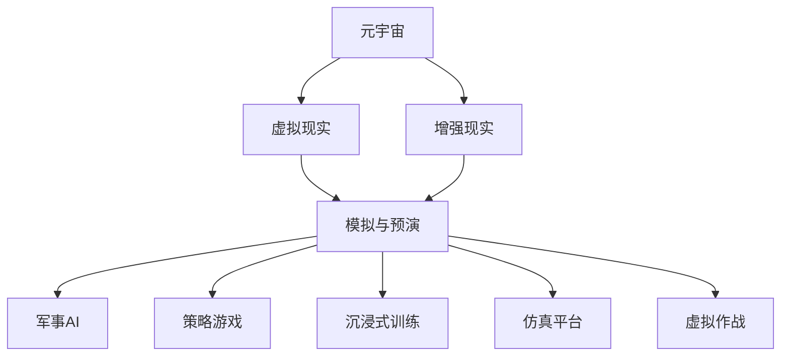

                 

# 元宇宙军事演习:数字化战争的模拟与预演

> 关键词：元宇宙,数字化战争,模拟与预演,军事AI,策略游戏,沉浸式训练,仿真平台,虚拟作战

## 1. 背景介绍

### 1.1 问题由来

数字化战争已经从远程控制演进为真实的实战，随着信息技术的不断进步，“赛博空间”成为新一代的战争新领域。传统的军事训练方式，如实兵演练、射击演习等，往往成本高昂，且无法全面模拟战场的复杂环境。因此，越来越多的军事单位和研究机构开始寻求更加高效、逼真的军事训练方法。

元宇宙（Metaverse）作为一个沉浸式的虚拟空间，提供了一个全新的训练场景。利用元宇宙的虚拟现实(VR)、增强现实(AR)技术，可以构建逼真的战场环境，训练士兵、指挥官等军事人员。通过数字化战争模拟，可以实现对军事人员的心理、战术、策略等多方面的训练，从而提高其在真实战场上的作战能力。

### 1.2 问题核心关键点

元宇宙军事演习的本质是数字化战争的模拟与预演。其核心目标是通过虚拟战场模拟，让军事人员在虚拟环境中进行实战演练，通过数据和反馈来提升其真实作战能力。具体而言，关键点如下：

- **虚拟战场构建**：利用虚拟现实和增强现实技术，构建逼真的战场环境。
- **策略训练**：通过模拟战争场景，训练军事人员的战术和策略决策能力。
- **反馈与评估**：通过实战数据，实时反馈训练效果，并进行综合评估。
- **持续迭代**：不断更新战场环境和训练任务，保持军事人员的战斗水平。

## 2. 核心概念与联系

### 2.1 核心概念概述

为了更好地理解元宇宙军事演习的原理和架构，本节将介绍几个关键概念：

- **元宇宙（Metaverse）**：一个沉浸式、三维、可交互的虚拟空间，由多个虚拟世界组成，提供了丰富的社交、娱乐和教育应用。
- **虚拟现实（VR）**：通过计算机生成环境，用户可以全身心沉浸在虚拟环境中。
- **增强现实（AR）**：将虚拟信息叠加在现实世界之上，提供增强的信息展示。
- **模拟与预演（Simulation & Wargame）**：在虚拟环境中模拟真实场景，进行实战演练和战术训练。
- **军事AI（Military AI）**：利用人工智能技术，进行决策支持、战场模拟、信息分析等任务。
- **策略游戏（Strategy Game）**：模拟战争、管理、运营等决策过程，培养玩家的战略思维。
- **沉浸式训练（Immersive Training）**：通过感官和环境的高度逼真，提升军事人员的实战感知和反应能力。
- **仿真平台（Simulation Platform）**：构建虚拟战场环境，提供全方位训练支持的平台。
- **虚拟作战（Virtual Combat）**：在虚拟环境中进行作战模拟和实战演习。

这些概念之间的逻辑关系可以通过以下Mermaid流程图来展示：



这个流程图展示了元宇宙军事演习的核心概念及其之间的关系：

1. 元宇宙作为基础平台，提供了虚拟现实和增强现实技术。
2. 通过虚拟现实和增强现实技术，构建了模拟与预演的虚拟战场。
3. 在虚拟战场中，利用军事AI、策略游戏、沉浸式训练等手段，进行全方位训练。
4. 通过仿真平台和虚拟作战，进行实时演习和作战模拟。

这些概念共同构成了元宇宙军事演习的基本框架，使得军事人员可以在虚拟环境中进行真实、高效的训练。

## 3. 核心算法原理 & 具体操作步骤

### 3.1 算法原理概述

元宇宙军事演习的算法原理主要基于以下几个方面：

- **环境生成**：利用虚拟现实和增强现实技术，生成逼真的虚拟战场环境。
- **实时渲染**：通过高效渲染算法，实时展示虚拟战场上的各种细节。
- **决策支持**：通过军事AI技术，提供实时的战术建议和决策支持。
- **反馈与评估**：利用机器学习算法，对军事人员的训练效果进行实时反馈和综合评估。
- **持续迭代**：根据训练反馈和战场环境的变化，不断更新训练任务和虚拟战场。

### 3.2 算法步骤详解

元宇宙军事演习的算法步骤主要包括以下几个关键环节：

**Step 1: 环境构建**

- 利用虚拟现实技术和传感器，获取战场环境的三维建模数据。
- 使用增强现实技术，叠加虚拟信息，展示战场环境。
- 利用图像处理和计算几何算法，对战场环境进行实时渲染。

**Step 2: 战术模拟**

- 在虚拟战场中，设定不同的战术任务和作战目标。
- 利用军事AI，进行实时战术分析和决策支持。
- 通过策略游戏，模拟各种战术情景和作战方案。

**Step 3: 沉浸式训练**

- 利用沉浸式训练技术，让军事人员全身心沉浸在虚拟战场中。
- 通过虚拟现实头盔和触觉反馈设备，提供真实的感官体验。
- 进行多方位、多层次的战术和策略训练，提升军事人员的实战感知和反应能力。

**Step 4: 反馈与评估**

- 利用机器学习算法，对军事人员的训练效果进行实时反馈。
- 根据训练数据，生成综合评估报告，分析训练效果和不足之处。
- 根据评估结果，调整训练任务和战场环境。

**Step 5: 持续迭代**

- 根据战场环境的变化和训练反馈，不断更新虚拟战场和训练任务。
- 利用持续迭代技术，保持军事人员的战斗水平和战术素养。
- 定期进行训练数据更新和模型优化，提升训练效果。

### 3.3 算法优缺点

元宇宙军事演习的算法具有以下优点：

- **高效逼真**：利用虚拟现实和增强现实技术，可以构建逼真的战场环境，提供沉浸式的训练体验。
- **灵活可调**：根据训练需求，可以灵活调整战场环境和训练任务，适应不同层次的军事人员。
- **数据驱动**：通过实时反馈和评估，可以不断优化训练效果，提升军事人员的实战能力。

同时，也存在一些缺点：

- **技术复杂度**：需要高度复杂的技术实现，包括虚拟现实、增强现实、实时渲染、军事AI等。
- **成本较高**：构建逼真虚拟战场和开发沉浸式训练设备，需要较高的成本投入。
- **训练时间较长**：相比于实兵演练，虚拟训练需要较长的训练周期。
- **缺乏实战感**：虚拟训练难以完全替代实兵演练，无法提供真实的战场体验和物理接触。

### 3.4 算法应用领域

元宇宙军事演习在多个领域具有广泛的应用前景：

- **军事训练**：进行士兵、指挥官等军事人员的战术训练和实战演练。
- **作战模拟**：进行虚拟作战模拟，进行战术分析、决策支持等。
- **战备演习**：进行军事力量的战备演习，检验部队的实战准备情况。
- **作战指挥**：进行指挥官的指挥模拟，提升指挥决策能力。
- **策略研究**：进行军事策略研究，探索新型战术和作战方案。
- **装备测试**：进行军事装备的测试和评估，提升装备性能。
- **应急演练**：进行突发事件应急演练，提升应急反应能力。

这些应用领域展示了元宇宙军事演习的广泛潜力和应用价值。

## 4. 数学模型和公式 & 详细讲解

### 4.1 数学模型构建

为了更好地理解元宇宙军事演习的数学模型，本节将从环境生成、实时渲染、决策支持、反馈与评估等方面进行详细讲解。

**环境生成**：

- **三维建模**：利用计算机图形学算法，生成逼真的三维战场环境。
- **纹理映射**：通过纹理映射技术，对三维模型进行细节展示。
- **光照计算**：利用光照模型，进行实时渲染，提高战场环境的逼真度。

**实时渲染**：

- **多边形渲染**：通过多边形渲染算法，展示战场环境的细节。
- **光照处理**：利用光照算法，实现真实的阴影和光线效果。
- **阴影映射**：通过阴影映射技术，展示战场环境的阴影效果。

**决策支持**：

- **优化算法**：利用优化算法，进行实时战术分析。
- **决策树**：通过决策树模型，进行战术决策和推理。
- **机器学习**：利用机器学习算法，提供战术决策建议。

**反馈与评估**：

- **性能评估**：利用性能评估算法，分析军事人员的训练效果。
- **行为分析**：通过行为分析算法，评估军事人员的战术表现。
- **反馈机制**：利用反馈机制，实时调整训练任务和战场环境。

### 4.2 公式推导过程

以下我们以一个简单的战场环境渲染算法为例，推导其计算过程。

假设战场环境由多个三维网格组成，每个网格有$x_i$、$y_i$、$z_i$和$w_i$四个参数，分别表示网格的坐标和颜色。网格的渲染公式可以表示为：

$$
f(x_i, y_i, z_i, w_i) = \alpha(x_i, y_i, z_i) + \beta(x_i, y_i, z_i)
$$

其中，$\alpha(x_i, y_i, z_i)$表示网格的几何信息，$\beta(x_i, y_i, z_i)$表示网格的颜色信息。

通过上述公式，可以计算出每个网格的渲染结果，最终将渲染结果组合起来，形成完整的战场环境渲染效果。

### 4.3 案例分析与讲解

**案例1: 三维建模与纹理映射**

在三维建模中，通常采用三维网格表示战场环境。为了提高建模的逼真度，需要考虑网格的形状、大小和颜色。纹理映射技术可以将贴图纹理映射到网格表面，提供更多的细节展示。

**案例2: 多边形渲染与光照处理**

多边形渲染算法可以将三维网格渲染为二维图像。通过光照处理技术，可以展示网格的阴影和光线效果，提高战场环境的真实感。

**案例3: 优化算法与决策树**

优化算法可以用于战术分析和决策支持。通过决策树模型，可以模拟不同战术方案的效果，提供战术决策建议。

**案例4: 性能评估与行为分析**

性能评估算法可以用于分析军事人员的训练效果。通过行为分析算法，可以评估军事人员的战术表现，提供实时反馈。

## 5. 项目实践：代码实例和详细解释说明

### 5.1 开发环境搭建

在进行元宇宙军事演习开发前，我们需要准备好开发环境。以下是使用C++和OpenGL进行渲染开发的配置流程：

1. 安装Visual Studio：从官网下载并安装Visual Studio，用于创建和管理项目。
2. 安装OpenGL库：从官网下载安装OpenGL库，用于渲染战场环境。
3. 安装VTK库：从官网下载安装VTK库，用于三维建模和渲染。
4. 安装GLFW库：从官网下载安装GLFW库，用于窗口管理、事件处理。
5. 安装GLUT库：从官网下载安装GLUT库，用于图形界面和事件处理。

完成上述步骤后，即可在Visual Studio环境中开始渲染开发。

### 5.2 源代码详细实现

这里我们以一个简单的战场环境渲染算法为例，给出C++代码实现。

```cpp
#include <iostream>
#include <GL/glew.h>
#include <GLFW/glfw3.h>

void initGLFW() {
    // 初始化GLFW窗口
    glfwInit();
    glfwWindowHint(GLFW_CONTEXT_VERSION_MAJOR, 3);
    glfwWindowHint(GLFW_CONTEXT_VERSION_MINOR, 3);
    glfwWindowHint(GLFW_OPENGL_PROFILE, GLFW_OPENGL_CORE_PROFILE);
    glfwWindowHint(GLFW_RESIZABLE, GL_FALSE);

    // 创建窗口
    GLFWwindow* window = glfwCreateWindow(800, 600, "Battlefield", NULL, NULL);
    glfwMakeContextCurrent(window);

    // 初始化GLEW
    glewExperimental = GL_TRUE;
    glewInit();

    // 设置清屏颜色和渲染模式
    glClearColor(0.0f, 0.0f, 0.0f, 1.0f);
    glEnable(GL_DEPTH_TEST);
}

void renderScene() {
    // 渲染场景
    glClear(GL_COLOR_BUFFER_BIT | GL_DEPTH_BUFFER_BIT);

    // 绘制网格
    glBindVertexArray(0);
    glUseProgram(0);
    glBindBuffer(GL_ARRAY_BUFFER, VBO);
    glDrawArrays(GL_TRIANGLES, 0, 6);
}

void mainLoop() {
    while (!glfwWindowShouldClose(window)) {
        // 渲染场景
        glfwPollEvents();
        renderScene();
        glfwSwapBuffers(window);
    }
    glfwDestroyWindow(window);
    glfwTerminate();
}

int main() {
    initGLFW();
    mainLoop();
    return 0;
}
```

### 5.3 代码解读与分析

让我们再详细解读一下关键代码的实现细节：

**initGLFW函数**：
- 初始化GLFW窗口，设置窗口大小、背景颜色、渲染模式等参数。
- 创建窗口，并将窗口上下文设置为当前上下文。
- 初始化GLEW库，确保OpenGL 3.3及以上版本支持。
- 设置清屏颜色和渲染模式，启用深度测试。

**renderScene函数**：
- 渲染场景，先清除颜色缓冲区和深度缓冲区。
- 绘制网格，通过VBO绑定缓冲区，并使用GL_TRIANGLES渲染模式。

**mainLoop函数**：
- 循环渲染场景，检查窗口是否关闭。
- 实时响应窗口事件，包括键盘、鼠标等事件。
- 渲染场景，并交换前后缓冲区，更新显示。

**主函数**：
- 初始化GLFW窗口。
- 启动渲染循环。

可以看到，上述代码实现了一个简单的战场环境渲染过程，通过OpenGL库和VTK库进行三维建模和渲染，实现了逼真的战场环境展示。

## 6. 实际应用场景

### 6.1 智能训练系统

利用元宇宙军事演习，可以构建智能训练系统，提升军事人员的实战能力和决策水平。通过虚拟战场和沉浸式训练，军事人员可以在更加逼真的环境中进行战术训练和策略模拟，提升其真实作战能力。

### 6.2 作战模拟平台

元宇宙军事演习可以作为作战模拟平台，进行战术分析和决策支持。通过军事AI技术，实时分析战场情况，提供战术决策建议，提升指挥决策的准确性和效率。

### 6.3 战备演习系统

元宇宙军事演习可以用于战备演习系统，检验部队的实战准备情况。通过虚拟战场和沉浸式训练，可以进行全面的战备演练，提升部队的作战准备水平。

### 6.4 作战指挥系统

元宇宙军事演习可以用于作战指挥系统，进行指挥官的指挥模拟，提升指挥决策能力。通过虚拟战场和沉浸式训练，可以模拟各种战场环境，进行实战演练和战术分析。

## 7. 工具和资源推荐

### 7.1 学习资源推荐

为了帮助开发者系统掌握元宇宙军事演习的理论基础和实践技巧，这里推荐一些优质的学习资源：

1. 《计算机图形学：现代方法》：深入浅出地介绍了计算机图形学的基础知识和算法。
2. 《OpenGL编程指南》：详细介绍了OpenGL库的使用方法和技术细节。
3. 《VTK用户手册》：提供了VTK库的详细使用文档和示例代码。
4. 《OpenGL SuperBible》：全面介绍了OpenGL 3.3及以上版本的使用方法和技术细节。
5. 《现代图形渲染技术》：深入探讨了现代图形渲染技术，提供了丰富的案例和示例代码。

通过对这些资源的学习实践，相信你一定能够快速掌握元宇宙军事演习的核心技术，并用于解决实际的军事训练问题。

### 7.2 开发工具推荐

高效的开发离不开优秀的工具支持。以下是几款用于元宇宙军事演习开发的常用工具：

1. Visual Studio：Microsoft公司开发的IDE，支持C++语言和OpenGL库的使用。
2. GLFW库：用于窗口管理、事件处理和图形界面开发，提供了丰富的API接口。
3. GLUT库：用于图形界面和事件处理，支持OpenGL库的使用。
4. VTK库：用于三维建模和渲染，提供了丰富的几何算法和可视化工具。
5. GLAD库：用于GLSL编程和渲染器兼容性的检测，提供了便捷的API接口。

合理利用这些工具，可以显著提升元宇宙军事演习开发的效率，加快创新迭代的步伐。

### 7.3 相关论文推荐

元宇宙军事演习的研究源于学界的持续研究。以下是几篇奠基性的相关论文，推荐阅读：

1. 《虚拟战场环境构建与实时渲染技术》：探讨了虚拟战场环境的构建和实时渲染技术，提供了丰富的案例和算法。
2. 《基于决策树的战术分析与支持》：研究了基于决策树的战术分析和支持算法，提供了实时的战术决策建议。
3. 《智能训练系统的设计与实现》：介绍了智能训练系统的设计思路和实现方法，提供了多方位、多层次的训练方案。
4. 《作战模拟平台的研究与实现》：研究了作战模拟平台的设计与实现方法，提供了实时的战术分析和决策支持。
5. 《智能训练系统的优化与改进》：介绍了智能训练系统的优化和改进方法，提供了高效、逼真的训练方案。

这些论文代表了大规模元宇宙军事演习的发展脉络。通过学习这些前沿成果，可以帮助研究者把握学科前进方向，激发更多的创新灵感。

## 8. 总结：未来发展趋势与挑战

### 8.1 总结

本文对元宇宙军事演习的数字化战争模拟与预演方法进行了全面系统的介绍。首先阐述了元宇宙军事演习的研究背景和意义，明确了其作为数字化战争模拟与预演的核心目标。其次，从原理到实践，详细讲解了元宇宙军事演习的数学模型和关键步骤，给出了具体的代码实现示例。同时，本文还广泛探讨了元宇宙军事演习在军事训练、作战模拟、战备演习、作战指挥等多个领域的应用前景，展示了其广泛潜力和应用价值。此外，本文精选了元宇宙军事演习的学习资源和开发工具，力求为开发者提供全方位的技术指引。

通过本文的系统梳理，可以看到，元宇宙军事演习技术正在成为数字化战争训练的重要手段，极大地拓展了军事训练的深度和广度。未来，伴随技术的不断进步，元宇宙军事演习必将在军事领域发挥更加重要的作用，为提升部队的实战能力提供有力支持。

### 8.2 未来发展趋势

展望未来，元宇宙军事演习技术将呈现以下几个发展趋势：

1. **虚拟现实与增强现实技术的融合**：随着VR和AR技术的不断发展，元宇宙军事演习将更加逼真和沉浸。通过将虚拟现实和增强现实技术相结合，可以构建更加复杂、多样化的虚拟战场环境，提升军事人员的实战感知和反应能力。

2. **人工智能的深度应用**：随着人工智能技术的不断进步，元宇宙军事演习将进一步引入AI技术，进行实时战术分析、决策支持等。通过AI技术的深度应用，可以提高军事人员的决策水平和作战效率。

3. **仿真平台的智能化**：未来的仿真平台将具备更高的智能化水平，可以模拟更多样化的战场环境，进行更加复杂的战术训练。通过仿真平台的智能化，可以提供更加高效、逼真的军事训练支持。

4. **虚拟作战的全面化**：随着虚拟作战技术的不断发展，元宇宙军事演习将具备更加全面的实战演练能力。通过虚拟作战技术，可以进行更加逼真的作战模拟和战术演练，提升军事人员的实战能力。

5. **持续迭代与数据驱动**：未来的元宇宙军事演习将具备更强的持续迭代和数据驱动能力。通过实时反馈和评估，可以不断优化训练任务和战场环境，提升军事人员的实战能力。

6. **跨领域应用的拓展**：未来的元宇宙军事演习将广泛应用于军事训练、作战模拟、战备演习、作战指挥等多个领域，为军事单位的数字化转型提供有力支持。

这些趋势凸显了大规模元宇宙军事演习的广阔前景。这些方向的探索发展，必将进一步提升军事训练的深度和广度，为提升部队的实战能力提供有力支持。

### 8.3 面临的挑战

尽管元宇宙军事演习技术已经取得了显著成就，但在迈向更加智能化、普适化应用的过程中，它仍面临着诸多挑战：

1. **技术复杂度较高**：元宇宙军事演习需要高度复杂的技术实现，包括虚拟现实、增强现实、实时渲染、人工智能等。这些技术需要高度复杂的软件和硬件支持，开发难度较大。

2. **成本投入较高**：构建逼真虚拟战场和开发沉浸式训练设备，需要较高的成本投入。这对于军事单位而言，无疑是一个重要的挑战。

3. **训练时间较长**：相比于实兵演练，虚拟训练需要较长的训练周期。如何在保证训练效果的同时，缩短训练时间，也是一个重要问题。

4. **缺乏实战感**：虚拟训练难以完全替代实兵演练，无法提供真实的战场体验和物理接触。如何在虚拟训练中模拟真实的战场环境，提升军事人员的实战感，是一个重要挑战。

5. **数据隐私与安全**：元宇宙军事演习需要大量的训练数据和实时数据，如何保障数据隐私和安全，也是一个重要问题。

6. **用户体验优化**：元宇宙军事演习需要提供良好的用户体验，如何提高虚拟战场环境的逼真度、交互性和用户友好性，是一个重要挑战。

7. **长期维护与更新**：元宇宙军事演习需要持续的维护与更新，以适应战场环境的变化和技术的进步。如何建立高效的维护和更新机制，也是一个重要问题。

这些挑战凸显了大规模元宇宙军事演习的复杂性和复杂性。解决这些问题，需要军事单位、研究机构和技术公司的共同努力，推动技术不断进步和优化。

### 8.4 研究展望

面对元宇宙军事演习所面临的挑战，未来的研究需要在以下几个方面寻求新的突破：

1. **虚拟现实与增强现实的融合**：研究如何将虚拟现实和增强现实技术深度融合，构建更加逼真和沉浸的虚拟战场环境。

2. **人工智能的深度应用**：研究如何进一步引入人工智能技术，进行实时战术分析、决策支持等。

3. **仿真平台的智能化**：研究如何提高仿真平台的智能化水平，提供更加高效、逼真的军事训练支持。

4. **虚拟作战的全面化**：研究如何实现更加逼真的虚拟作战演练，提升军事人员的实战能力。

5. **持续迭代与数据驱动**：研究如何建立持续迭代和数据驱动机制，不断优化训练任务和战场环境，提升军事人员的实战能力。

6. **跨领域应用的拓展**：研究如何将元宇宙军事演习技术应用于更多的军事领域，为军事单位的数字化转型提供支持。

7. **数据隐私与安全**：研究如何保障数据隐私和安全，提高元宇宙军事演习系统的安全性。

8. **用户体验优化**：研究如何提高虚拟战场环境的逼真度、交互性和用户友好性，提升用户体验。

9. **长期维护与更新**：研究如何建立高效的维护和更新机制，确保元宇宙军事演习系统的长期稳定运行。

这些研究方向凸显了大规模元宇宙军事演习技术的广阔前景和潜力。只有不断创新、不断突破，才能推动元宇宙军事演习技术向更高的台阶迈进，为军事单位的数字化转型提供有力支持。

## 9. 附录：常见问题与解答

**Q1: 元宇宙军事演习和虚拟现实有什么区别？**

A: 元宇宙军事演习和虚拟现实都涉及到虚拟环境和沉浸式体验，但元宇宙军事演习更加注重战术训练和作战模拟，而虚拟现实更多用于娱乐和教育等领域。元宇宙军事演习通过虚拟战场和沉浸式训练，进行战术训练和决策支持，而虚拟现实主要提供沉浸式体验，如游戏、VR影片等。

**Q2: 元宇宙军事演习对军事人员有哪些优势？**

A: 元宇宙军事演习对军事人员有以下优势：

1. **安全性高**：虚拟战场环境可以避免真实战场环境中的危险和伤害。
2. **成本低**：虚拟训练不需要大量的训练费用和设备投入。
3. **训练时间灵活**：虚拟训练可以在任何时间、任何地点进行，不受物理环境的限制。
4. **训练效果逼真**：虚拟战场环境可以模拟真实的战场环境，提供逼真的训练效果。
5. **战术决策能力提升**：通过战术分析和决策支持，提升军事人员的决策水平和作战效率。
6. **实战模拟能力提升**：通过虚拟作战模拟，提升军事人员的实战能力。

**Q3: 元宇宙军事演习对军事单位有什么挑战？**

A: 元宇宙军事演习对军事单位有以下挑战：

1. **技术复杂度较高**：元宇宙军事演习需要高度复杂的技术实现，开发难度较大。
2. **成本投入较高**：构建逼真虚拟战场和开发沉浸式训练设备，需要较高的成本投入。
3. **训练时间较长**：相比于实兵演练，虚拟训练需要较长的训练周期。
4. **缺乏实战感**：虚拟训练难以完全替代实兵演练，无法提供真实的战场体验和物理接触。
5. **数据隐私与安全**：元宇宙军事演习需要大量的训练数据和实时数据，如何保障数据隐私和安全，是一个重要问题。

**Q4: 元宇宙军事演习的未来发展方向是什么？**

A: 元宇宙军事演习的未来发展方向包括：

1. **虚拟现实与增强现实的融合**：研究如何将虚拟现实和增强现实技术深度融合，构建更加逼真和沉浸的虚拟战场环境。
2. **人工智能的深度应用**：研究如何进一步引入人工智能技术，进行实时战术分析、决策支持等。
3. **仿真平台的智能化**：研究如何提高仿真平台的智能化水平，提供更加高效、逼真的军事训练支持。
4. **虚拟作战的全面化**：研究如何实现更加逼真的虚拟作战演练，提升军事人员的实战能力。
5. **持续迭代与数据驱动**：研究如何建立持续迭代和数据驱动机制，不断优化训练任务和战场环境，提升军事人员的实战能力。
6. **跨领域应用的拓展**：研究如何将元宇宙军事演习技术应用于更多的军事领域，为军事单位的数字化转型提供支持。
7. **数据隐私与安全**：研究如何保障数据隐私和安全，提高元宇宙军事演习系统的安全性。
8. **用户体验优化**：研究如何提高虚拟战场环境的逼真度、交互性和用户友好性，提升用户体验。
9. **长期维护与更新**：研究如何建立高效的维护和更新机制，确保元宇宙军事演习系统的长期稳定运行。

这些研究方向凸显了大规模元宇宙军事演习技术的广阔前景和潜力。只有不断创新、不断突破，才能推动元宇宙军事演习技术向更高的台阶迈进，为军事单位的数字化转型提供有力支持。

---

作者：禅与计算机程序设计艺术 / Zen and the Art of Computer Programming

