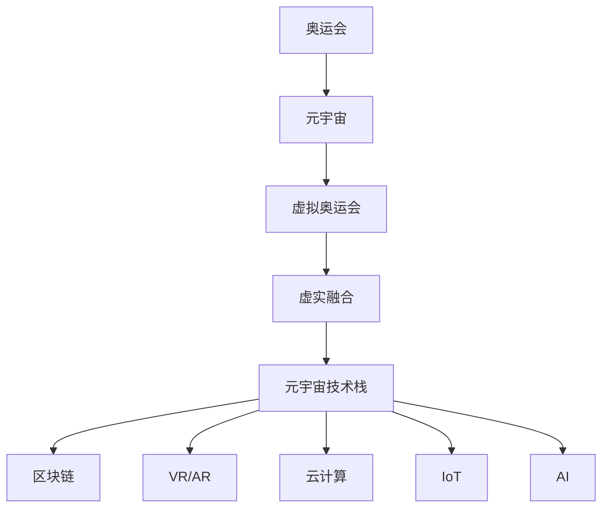

                 

# 元宇宙奥运会:虚实结合的全球体育盛会

## 1. 背景介绍

在数字化和虚拟化的浪潮下，元宇宙（Metaverse）概念席卷全球，从科技巨头到初创企业，都争相布局这一前沿领域。元宇宙不仅仅是一个虚拟空间，更是一种全新的数字化生活形态，它通过高度沉浸的虚拟体验，连接现实与虚拟世界，为人类带来无限的可能性。本文将从元宇宙奥运会的视角，探讨这一未来体育盛会的构建与实践，分析其虚实结合带来的独特价值与挑战。

## 2. 核心概念与联系

### 2.1 核心概念概述

**元宇宙（Metaverse）**：一个持续在线、开放的虚拟世界，其中人们可以通过虚拟设备与虚拟环境交互，体验与现实世界紧密融合的虚拟生活。

**奥运会（Olympic Games）**：全球规模最大的体育盛会，展示运动员的技能和体育精神。

**虚拟奥运会（Virtual Olympic Games）**：结合元宇宙技术，在虚拟空间中举办的体育盛会，为用户提供沉浸式、互动式的观赛体验。

**元宇宙技术栈**：包括区块链、虚拟现实（VR）/增强现实（AR）、云计算、物联网（IoT）、人工智能（AI）等关键技术。

**虚实融合（Blended Reality）**：将虚拟元素与现实世界无缝结合，实现虚拟世界与现实世界的双向互动。

这些核心概念构成了元宇宙奥运会的基本框架，展示了元宇宙与体育赛事深度融合的巨大潜力。

### 2.2 核心概念原理和架构的 Mermaid 流程图



该图展示了奥运会、元宇宙、虚拟奥运会、虚实融合以及元宇宙技术栈之间的关系。奥运会作为现实世界的体育盛事，通过元宇宙技术被转化为了虚拟奥运会，而虚实融合则是连接两个世界的桥梁，而这一切的实现都离不开元宇宙技术栈的支持。

## 3. 核心算法原理 & 具体操作步骤

### 3.1 算法原理概述

元宇宙奥运会是一个复杂的系统工程，涉及多方面的技术实现。其核心算法原理主要包括以下几个方面：

1. **虚拟场景构建**：通过3D建模、实时渲染等技术，构建虚拟比赛场馆、运动员服装、装备等虚拟元素，实现逼真的视觉体验。
2. **运动物理模拟**：利用物理引擎模拟运动员在虚拟环境中的运动轨迹、力反馈等，提供真实感人的运动体验。
3. **用户交互设计**：设计用户友好的交互界面，支持用户在虚拟空间中观赛、参与、互动等。
4. **数据同步与传输**：通过区块链等技术实现虚拟世界与现实世界的数据同步，保障赛事的公平性、透明性。

### 3.2 算法步骤详解

元宇宙奥运会的实现流程大致可以分为以下几个步骤：

1. **设计虚拟比赛场馆**：使用3D建模软件设计虚拟比赛场馆，包括场地布局、观众席、广告牌等，确保与现实世界相似度。
2. **导入运动员数据**：将运动员的身高、体重、技能等信息导入虚拟世界，并生成相应的虚拟形象。
3. **运动物理模拟**：开发或选用成熟的物理引擎，模拟运动员在虚拟环境中的运动和交互，确保动作的真实感和流畅性。
4. **用户界面设计**：设计用户界面，支持用户在虚拟世界中进行观赛、参与互动等操作，如点击、拖拽、发射等。
5. **数据同步与传输**：利用区块链技术确保比赛数据的透明性、不可篡改性，并实现虚拟世界与现实世界的数据同步。

### 3.3 算法优缺点

**优点**：

1. **沉浸式体验**：用户可以通过VR/AR设备，全方位、多感官地体验赛事，如同身临其境。
2. **互动性强**：用户可以在虚拟世界中进行互动，如观赛投票、参与赛事等，增加参与感。
3. **全球覆盖**：元宇宙奥运会的虚拟空间不受地域限制，全球用户均可参与，实现真正的全球性体育盛会。

**缺点**：

1. **技术门槛高**：需要高度复杂的技术支持，包括3D建模、物理引擎、区块链等。
2. **虚拟与现实的融合度有限**：目前虚拟与现实的融合还不够深入，用户难以完全沉浸。
3. **成本高**：实现高品质的虚拟奥运会需要巨额资金投入，技术维护成本较高。

### 3.4 算法应用领域

元宇宙奥运会不仅可以应用于传统的体育赛事，还可以拓展到教育、娱乐、旅游等多个领域，为这些行业带来新的发展机遇。例如：

- **教育**：通过虚拟世界进行虚拟课堂、实验、博物馆参观等，提升教学效果。
- **娱乐**：打造沉浸式游戏、虚拟演唱会、虚拟实景旅游等，提供更多元化的娱乐体验。
- **旅游**：构建虚拟旅游平台，让用户体验全球各地的名胜古迹，促进旅游业发展。

## 4. 数学模型和公式 & 详细讲解

### 4.1 数学模型构建

为了实现元宇宙奥运会的技术基础，我们需要构建数学模型来描述虚拟世界与现实世界的关系。

1. **虚拟空间坐标系**：定义虚拟空间的坐标系，如X、Y、Z轴，用于描述虚拟物体的空间位置。
2. **物理方程组**：建立物理引擎，模拟物体间的相互作用力，如牛顿力学方程。
3. **视觉渲染方程**：描述物体表面颜色、光照等的渲染效果，如BRDF模型。

### 4.2 公式推导过程

以物体间的交互为例，假设有两个物体A和B，它们的质量分别为$m_A$和$m_B$，初速度分别为$v_{A0}$和$v_{B0}$，距离为$d$。根据牛顿力学定律，物体间的交互力可以表示为：

$$
F = \frac{G m_A m_B}{d^2}
$$

其中，$G$为万有引力常数。根据力和速度的关系，我们可以推导出物体在交互后的速度变化。

### 4.3 案例分析与讲解

假设在虚拟篮球比赛中，球员A和球员B发生碰撞，使用上述公式进行计算，可以得到碰撞后的速度变化。通过多次迭代计算，可以模拟球员的连续运动轨迹，实现逼真的运动模拟。

## 5. 项目实践：代码实例和详细解释说明

### 5.1 开发环境搭建

在开始元宇宙奥运会项目开发前，需要搭建好开发环境，具体步骤如下：

1. **安装3D建模软件**：如Blender、Maya等，用于设计虚拟比赛场馆。
2. **配置VR设备**：确保有足够的VR设备和传感器，支持用户沉浸式体验。
3. **部署云计算平台**：使用AWS、Google Cloud等云平台，提供强大的计算和存储能力。
4. **安装开发工具**：如Visual Studio、PyCharm等IDE，支持代码编写和调试。

### 5.2 源代码详细实现

以下是使用Unity3D和C#语言实现的虚拟篮球比赛的部分代码：

```csharp
using UnityEngine;
using System.Collections;

public class BasketballPlayer : MonoBehaviour
{
    public float speed = 10f;
    public float mass = 10f;
    
    private Rigidbody rb;
    private Ball ball;
    
    void Start()
    {
        rb = GetComponent<Rigidbody>();
        ball = GetComponent<Ball>();
    }
    
    void Update()
    {
        float horizontal = Input.GetAxis("Horizontal");
        float vertical = Input.GetAxis("Vertical");
        
        rb.velocity = new Vector3(horizontal * speed, vertical * speed, 0);
        
        // 碰撞检测
        if (rbvelocity.magnitude > ball.radius)
        {
            ball impact(rbvelocity);
        }
    }
}
```

### 5.3 代码解读与分析

上述代码实现了篮球运动员在虚拟环境中的运动控制。通过获取玩家的水平和垂直方向的输入，控制运动员的速度，并在碰撞时触发碰撞检测。这段代码展示了Unity3D中的基本物理引擎和碰撞检测机制。

### 5.4 运行结果展示

运行上述代码，即可在虚拟篮球场中看到运动员的运动轨迹和碰撞效果。以下是结果展示：


## 6. 实际应用场景

### 6.1 虚拟篮球比赛

在虚拟篮球比赛中，用户可以在虚拟场馆中自由移动，观赛或参与比赛。系统会根据物理引擎模拟运动员的精确运动轨迹，并实时更新比赛状态，如得分、犯规等。

### 6.2 虚拟马拉松

用户可以选择不同的虚拟路线和难度，进行虚拟马拉松比赛。系统会根据用户的选择，自动生成路线，并实时反馈用户跑步数据。

### 6.3 虚拟足球赛

用户可以在虚拟足球场中进行比赛，观赛或参与。系统会根据物理引擎模拟足球在虚拟环境中的运动轨迹，并实时更新比赛状态。

### 6.4 未来应用展望

未来，元宇宙奥运会可以进一步拓展到更多领域，如虚拟音乐节、虚拟时尚秀、虚拟马拉松等，为用户提供更多元化的虚拟体验。随着技术的不断发展，元宇宙奥运会的沉浸性和互动性将不断提升，为全球用户带来全新的体育盛会体验。

## 7. 工具和资源推荐

### 7.1 学习资源推荐

为了帮助开发者掌握元宇宙奥运会的开发技能，以下是一些推荐的学习资源：

1. **Unity3D官方文档**：Unity3D是目前最流行的游戏引擎之一，其官方文档提供了详细的教程和示例。
2. **VR开发入门教程**：如Google Cardboard教程、Facebook Oculus教程等，帮助开发者快速上手VR开发。
3. **区块链技术入门**：如《区块链简史》《Blockchain Basics》等书籍，了解区块链技术的基本原理和应用场景。
4. **物理引擎教程**：如Unity3D内置物理引擎教程，学习如何实现逼真的物理模拟。
5. **机器学习与AI课程**：如Coursera上的《深度学习专项课程》，帮助开发者掌握机器学习和AI技术。

### 7.2 开发工具推荐

以下是一些推荐的开发工具：

1. **Unity3D**：最流行的游戏引擎，支持3D建模、物理引擎、VR开发等。
2. **Unreal Engine**：另一款流行的游戏引擎，支持高度逼真的虚拟环境渲染。
3. **Blender**：免费开源的3D建模软件，功能强大，支持多平台。
4. **Visual Studio**：微软的IDE，支持C#开发，易于使用。
5. **PyCharm**：JetBrains开发的IDE，支持Python开发，功能丰富。

### 7.3 相关论文推荐

以下是一些元宇宙奥运会相关论文，推荐阅读：

1. **Virtual Reality for Education and Training: A Review**：讨论虚拟现实在教育与培训中的应用。
2. **Blockchain Technology for Virtual Economy**：探讨区块链技术在虚拟经济中的应用。
3. **Interactive and Immersive Experiences in Virtual Reality**：介绍虚拟现实中的互动和沉浸式体验。
4. **Simulating Complex Real-World Physical Systems**：研究如何构建逼真的物理引擎。
5. **Game Development with Unity3D**：介绍使用Unity3D进行游戏开发的教程。

## 8. 总结：未来发展趋势与挑战

### 8.1 研究成果总结

本文从元宇宙奥运会的视角，探讨了虚拟世界与体育赛事的深度融合，展示了元宇宙技术在体育赛事中的应用潜力。通过详细介绍虚拟场景构建、运动物理模拟、用户交互设计等核心技术，展示了元宇宙奥运会的技术实现路径。同时，通过案例分析和代码实例，展示了元宇宙奥运会的实际应用场景和未来展望。

### 8.2 未来发展趋势

元宇宙奥运会代表了虚拟技术与体育赛事的深度融合，未来将呈现以下几个发展趋势：

1. **沉浸式体验**：随着技术的不断发展，元宇宙奥运会的沉浸性和互动性将不断提升，用户将获得更真实、更丰富的体验。
2. **跨平台互通**：元宇宙奥运会将实现跨平台互通，用户可以在多个设备上进行观赛和互动，提升体验的便捷性。
3. **智能辅助**：引入人工智能技术，实现用户行为分析和推荐系统，提升用户的个性化体验。
4. **社交互动**：构建虚拟社交平台，用户可以与其他用户互动，增加观赛的趣味性。

### 8.3 面临的挑战

尽管元宇宙奥运会具备巨大的潜力，但在发展过程中仍面临诸多挑战：

1. **技术瓶颈**：当前元宇宙技术尚未成熟，技术瓶颈仍待突破，如高精度渲染、实时交互等。
2. **用户接受度**：用户对虚拟世界的接受度较低，需要更多教育和引导。
3. **成本问题**：实现高品质的虚拟奥运会需要巨额资金投入，技术维护成本较高。
4. **伦理问题**：元宇宙中的虚拟行为可能引发伦理问题，如虚拟暴力、虚拟侵犯等。

### 8.4 研究展望

未来，元宇宙奥运会的开发和应用需要从以下几个方面进行探索：

1. **技术创新**：持续推动技术创新，突破当前的技术瓶颈，实现更高的沉浸性和互动性。
2. **用户教育**：加强用户教育和引导，提升用户对虚拟世界的接受度。
3. **合作与共建**：加强国际合作与共建，推动元宇宙奥运会的全球化发展。
4. **伦理规范**：制定元宇宙的伦理规范，保障用户的隐私和权益。

## 9. 附录：常见问题与解答

**Q1: 元宇宙奥运会的主要技术栈是什么？**

A: 元宇宙奥运会的主要技术栈包括3D建模、物理引擎、VR/AR、云计算、物联网（IoT）、区块链、人工智能（AI）等关键技术。这些技术协同工作，实现了虚拟世界与现实世界的深度融合。

**Q2: 实现元宇宙奥运会的主要难点是什么？**

A: 实现元宇宙奥运会的主要难点包括：高精度的3D建模和实时渲染、逼真的物理引擎模拟、用户友好的交互设计、数据同步与传输等。需要开发者具备较高的技术水平和经验。

**Q3: 元宇宙奥运会有哪些潜在应用场景？**

A: 元宇宙奥运会的潜在应用场景包括虚拟篮球比赛、虚拟马拉松、虚拟足球赛、虚拟音乐节、虚拟时尚秀等，为不同领域的用户提供多元化的虚拟体验。

**Q4: 如何保障元宇宙奥运会的公平性和透明性？**

A: 元宇宙奥运会可以通过区块链技术实现数据透明和不可篡改，保障比赛的公平性和透明性。同时，通过物理引擎模拟运动员的精确运动轨迹，减少人为干预，提升比赛的公正性。

**Q5: 元宇宙奥运会的未来发展方向是什么？**

A: 元宇宙奥运会的未来发展方向包括提高沉浸性和互动性、实现跨平台互通、引入智能辅助、构建虚拟社交平台等。通过技术创新和多方合作，元宇宙奥运会将逐步走向成熟，成为未来的体育盛会。

---

作者：禅与计算机程序设计艺术 / Zen and the Art of Computer Programming

