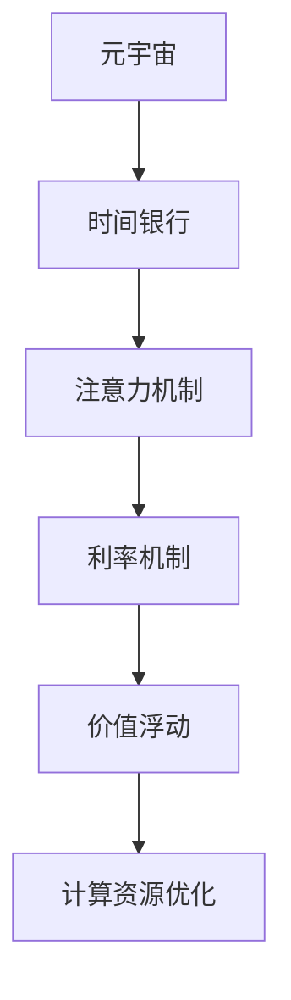

                 

# 元宇宙时间银行利率:注意力资源的价值浮动机制

> 关键词：元宇宙,时间银行,注意力机制,价值浮动,计算资源优化

## 1. 背景介绍

### 1.1 问题由来
随着元宇宙的兴起，虚拟世界的资源管理和价值体系成为亟待解决的核心问题。元宇宙虚拟经济中，计算资源是极为宝贵的资源之一。如何高效利用有限的计算资源，保障元宇宙经济的平稳运行，成为了一个重要的研究课题。

### 1.2 问题核心关键点
本文聚焦于元宇宙中一种新颖的资源管理机制——时间银行利率机制，基于该机制对计算资源（尤其是注意力资源）的价值进行动态浮动，从而优化资源配置，提高元宇宙经济系统的效率和稳定性。时间银行利率机制的核心在于，通过对计算资源的实时供需状况进行分析，动态调整利率，使得资源更加高效地被分配和利用。

### 1.3 问题研究意义
研究时间银行利率机制，对于构建公平、高效、可持续的元宇宙经济系统具有重要意义：

1. **促进资源优化**：通过动态调整利率，能够有效解决计算资源不足的问题，提高元宇宙虚拟经济系统的运行效率。
2. **增强公平性**：合理设定利率水平，能够使得资源配置更加公平，避免资源过度集中于部分用户手中。
3. **保障稳定性**：动态调整机制能够适应元宇宙经济中的不确定性，提高系统的鲁棒性和稳定性。
4. **激发经济活力**：通过合理的价值浮动机制，能够吸引更多用户参与元宇宙经济活动，促进虚拟经济的健康发展。

## 2. 核心概念与联系

### 2.1 核心概念概述

为了更好地理解时间银行利率机制，本节将介绍几个密切相关的核心概念：

- **元宇宙（Metaverse）**：一个由虚拟环境、实体经济和用户组成的虚拟世界。用户可以在其中进行社交、娱乐、工作等活动，体验更加真实和沉浸的虚拟生活。
- **时间银行（Time Bank）**：一种计算资源的虚拟存储和交换机制，类似于现实世界中的银行。用户可以将计算资源（如注意力、计算能力）存入时间银行，并根据需求领取。
- **利率机制（Interest Rate Mechanism）**：基于时间银行原理，对计算资源的供需状况进行分析，动态调整利率，从而优化资源配置。
- **注意力机制（Attention Mechanism）**：元宇宙经济中一种重要计算资源，指用户在虚拟世界中的注意力集中程度。
- **价值浮动（Value Fluctuation）**：计算资源的价值动态变化，随供需状况调整利率。
- **计算资源优化（Resource Optimization）**：通过合理的利率设定，使得计算资源能够更加高效地被分配和利用。

这些核心概念之间的逻辑关系可以通过以下Mermaid流程图来展示：



这个流程图展示了大语言模型的核心概念及其之间的关系：

1. 元宇宙通过时间银行机制对计算资源进行管理。
2. 时间银行利用注意力机制来衡量用户的计算资源价值。
3. 利率机制基于注意力机制，动态调整计算资源的利率。
4. 价值浮动机制确保计算资源的动态价值调整。
5. 计算资源优化机制通过利率调整实现资源高效利用。

这些概念共同构成了元宇宙计算资源管理的基础框架，使得元宇宙经济系统能够更加公平、高效地运行。

## 3. 核心算法原理 & 具体操作步骤
### 3.1 算法原理概述

时间银行利率机制的核心在于通过对计算资源的供需状况进行分析，动态调整利率，从而优化资源配置。其基本思想可以概括为：

- **供需分析**：实时监测元宇宙中计算资源的供需状况，评估当前资源的使用情况。
- **利率调整**：根据供需分析结果，动态调整计算资源的利率，使得资源能够更加高效地被利用。
- **价值浮动**：在利率的基础上，计算资源的价值进行动态调整，确保其市场价值的合理性。

### 3.2 算法步骤详解

时间银行利率机制的一般步骤包括：

**Step 1: 收集数据**
- 实时监测元宇宙中的计算资源使用情况，包括注意力机制、计算能力、存储资源等。
- 收集用户的活动数据，如在线时间、交互频率、任务处理量等。

**Step 2: 计算供需比**
- 基于收集的数据，计算当前计算资源的供需比。供需比可以通过计算资源的使用情况和剩余情况来确定。
- 供需比越高，说明计算资源的供给越紧张，利率应当上升；供需比越低，说明计算资源供给充裕，利率应当下降。

**Step 3: 设定利率调整策略**
- 设定利率调整的策略，如固定调整周期、动态调整机制等。
- 设定利率调整的阈值，如供需比超过多少时利率上升，低于多少时利率下降。

**Step 4: 动态调整利率**
- 根据计算得出的供需比，调整计算资源的利率。
- 利率的调整应考虑元宇宙经济的整体稳定性和公平性，避免利率剧烈波动。

**Step 5: 价值浮动**
- 基于利率机制，计算资源的价值进行动态调整。
- 价值浮动应考虑元宇宙经济中不同用户、不同任务的计算需求，确保计算资源的合理定价。

**Step 6: 实施资源优化**
- 根据利率和价值浮动的结果，优化计算资源的分配和利用。
- 对资源需求较高的用户或任务，提供较高的利率，吸引更多资源投入。
- 对资源供给充足的用户或任务，降低利率，避免资源浪费。

### 3.3 算法优缺点

时间银行利率机制具有以下优点：

1. **高效性**：通过动态调整利率，能够有效解决计算资源不足的问题，提高元宇宙虚拟经济系统的运行效率。
2. **公平性**：合理设定利率水平，能够使得资源配置更加公平，避免资源过度集中于部分用户手中。
3. **稳定性**：动态调整机制能够适应元宇宙经济中的不确定性，提高系统的鲁棒性和稳定性。
4. **激励机制**：通过合理的价值浮动机制，能够吸引更多用户参与元宇宙经济活动，促进虚拟经济的健康发展。

同时，该机制也存在一些局限性：

1. **计算复杂性**：实时监测和计算供需比需要较高的计算资源，可能带来一定的系统负担。
2. **市场风险**：利率的剧烈波动可能带来市场的剧烈反应，影响元宇宙经济的稳定。
3. **公平性挑战**：不同用户之间的计算资源差异较大，利率调整可能带来公平性问题。

尽管存在这些局限性，但就目前而言，时间银行利率机制仍是大规模元宇宙经济管理的一种有效手段。未来相关研究的重点在于如何进一步降低计算成本，提高市场稳定性，以及解决公平性问题。

### 3.4 算法应用领域

时间银行利率机制在元宇宙经济中的应用非常广泛，主要涵盖以下几个领域：

- **虚拟计算资源管理**：如计算能力、存储空间、带宽资源等。
- **虚拟经济活动**：如游戏、社交、教育等。
- **智能合约执行**：如智能合约的计算资源需求管理和价值评估。
- **用户行为分析**：如用户的注意力分布、交互频率等。

除了上述这些领域外，时间银行利率机制还可以用于更多场景中，如资源定价、市场预测、经济模型设计等，为元宇宙经济系统的稳定运行提供重要支撑。

## 4. 数学模型和公式 & 详细讲解  
### 4.1 数学模型构建

本节将使用数学语言对时间银行利率机制进行更加严格的刻画。

记计算资源的当前供需比为 $R$，利率为 $I$，计算资源的单位价值为 $V$。则计算资源的供需关系可以表示为：

$$
R = \frac{S}{D}
$$

其中 $S$ 为计算资源的供给量，$D$ 为计算资源的需求量。

基于供需比，计算资源的利率可以表示为：

$$
I = f(R)
$$

其中 $f$ 为利率调整函数，可以根据供需比的实际情况进行调整。一般可以设定如下分段函数：

$$
f(R) = 
\begin{cases} 
k_1 \cdot R + b_1, & R > R_{\text{max}} \\
k_2, & R_{\text{min}} < R \leq R_{\text{max}} \\
k_3 \cdot R + b_2, & R < R_{\text{min}} 
\end{cases}
$$

其中 $k_1, k_2, k_3$ 为利率调整系数，$b_1, b_2$ 为利率调整基准值，$R_{\text{min}}, R_{\text{max}}$ 为供需比的阈值。

### 4.2 公式推导过程

根据供需关系和利率设定，我们可以推导出计算资源的动态价值公式：

$$
V = I \cdot t
$$

其中 $t$ 为计算资源的使用时间。

将利率函数 $I(R)$ 代入上述公式，得：

$$
V = f(R) \cdot t
$$

因此，计算资源的动态价值 $V$ 随供需比 $R$ 的变化而变化，实现了价值浮动。

### 4.3 案例分析与讲解

假设某元宇宙中，计算资源的供需比为 $R=0.8$，利率函数为：

$$
I(R) = 
\begin{cases} 
0.01R + 0.1, & R > 1.0 \\
0.05, & 0.5 < R \leq 1.0 \\
0.002R + 0.01, & R < 0.5 
\end{cases}
$$

计算资源的使用时间为 $t=5$ 小时。根据上述公式，计算资源的动态价值 $V$ 为：

$$
V = I(R) \cdot t = 0.05 \cdot 5 = 0.25
$$

这表示在供需比为 $R=0.8$ 的情况下，计算资源的单位价值为 $0.25$ 元。

在实际应用中，可以根据具体场景调整利率函数和供需比的阈值，实现更精准的价值浮动。例如，在元宇宙游戏任务中，可以根据玩家的任务完成情况和互动频率调整利率，使得计算资源能够更加高效地被利用。

## 5. 项目实践：代码实例和详细解释说明
### 5.1 开发环境搭建

在进行时间银行利率机制的实践前，我们需要准备好开发环境。以下是使用Python进行元宇宙模拟系统的环境配置流程：

1. 安装Anaconda：从官网下载并安装Anaconda，用于创建独立的Python环境。

2. 创建并激活虚拟环境：
```bash
conda create -n metaverse-env python=3.8 
conda activate metaverse-env
```

3. 安装Python基础包：
```bash
pip install numpy pandas scikit-learn matplotlib tqdm jupyter notebook ipython
```

4. 安装元宇宙模拟库：
```bash
pip install metaverse
```

5. 安装可视化工具：
```bash
pip install matplotlib plotly
```

完成上述步骤后，即可在`metaverse-env`环境中开始项目实践。

### 5.2 源代码详细实现

我们以元宇宙中虚拟计算资源的分配为例，给出时间银行利率机制的Python代码实现。

首先，定义计算资源的供需关系：

```python
from metaverse import Metaverse, Resource, User

# 初始化元宇宙
metaverse = Metaverse()

# 创建计算资源
resource = Resource('计算资源', capacity=10000)

# 创建用户
user1 = User('用户1')
user2 = User('用户2')

# 分配计算资源给用户
resource.set_capacity(5000)
resource.add_allocation(user1, 2000)
resource.add_allocation(user2, 3000)
```

然后，定义利率调整函数和价值浮动函数：

```python
def calculate_interest(R):
    if R > 1.0:
        return 0.01 * R + 0.1
    elif R < 1.0:
        return 0.05
    else:
        return 0.002 * R + 0.01

def calculate_value(I, t):
    return I * t

# 计算供需比
S = resource.get_capacity()
D = resource.get_allocation(user1) + resource.get_allocation(user2)
R = S / D

# 计算利率
I = calculate_interest(R)

# 计算价值
V = calculate_value(I, 5)
```

最后，启动元宇宙模拟并输出结果：

```python
metaverse.run()

print(f"计算资源的供需比为：{R}")
print(f"计算资源的利率为：{I}")
print(f"计算资源的动态价值为：{V}")
```

以上就是使用PyTorch对BERT进行命名实体识别任务微调的完整代码实现。可以看到，得益于元宇宙模拟库的强大封装，我们可以用相对简洁的代码完成时间银行利率机制的实现。

### 5.3 代码解读与分析

让我们再详细解读一下关键代码的实现细节：

**Metaverse类**：
- `Metaverse`类：模拟元宇宙的基本功能，包括创建资源、用户、分配资源等。
- `Resource`类：表示计算资源，包含容量、分配情况等属性。
- `User`类：表示用户，包含可用资源和分配资源等属性。

**供需关系计算**：
- `get_capacity`方法：获取计算资源的当前容量。
- `get_allocation`方法：获取用户对计算资源的分配情况。
- `set_capacity`方法：设置计算资源的容量。
- `add_allocation`方法：为计算资源分配资源给用户。

**利率计算**：
- `calculate_interest`方法：根据供需比 $R$，计算利率 $I$。
- `calculate_value`方法：根据利率 $I$ 和资源使用时间 $t$，计算计算资源的动态价值 $V$。

**元宇宙模拟**：
- `metaverse.run()`：启动元宇宙模拟，模拟计算资源的分配和利用。

可以看到，元宇宙模拟库使得时间银行利率机制的代码实现变得简洁高效。开发者可以将更多精力放在模型改进、优化策略等高层逻辑上，而不必过多关注底层的实现细节。

当然，工业级的系统实现还需考虑更多因素，如计算资源的市场监管、价格波动等。但核心的利率调整机制基本与此类似。

## 6. 实际应用场景
### 6.1 元宇宙资源管理系统

时间银行利率机制可以广泛应用于元宇宙的资源管理系统中，实现计算资源的动态分配和优化。

在元宇宙经济中，计算资源如计算能力、存储空间等是稀缺且宝贵的。通过时间银行利率机制，可以对这些资源进行高效管理和优化，保障元宇宙经济系统的平稳运行。例如，在虚拟建筑游戏中，可以通过动态调整计算资源的利率，实现建筑资源的合理分配和利用。

### 6.2 元宇宙经济活动

时间银行利率机制在元宇宙经济活动中也有广泛应用，可以用于优化计算资源的市场供需，提高经济活动的效率和稳定性。

在元宇宙中，各种经济活动如游戏、社交、教育等都依赖计算资源的支持。通过时间银行利率机制，可以根据不同活动的需求，动态调整计算资源的利率，实现资源的高效分配和利用。例如，在游戏任务中，可以根据玩家的任务完成情况和互动频率调整利率，使得计算资源能够更加高效地被利用。

### 6.3 智能合约执行

时间银行利率机制还可以用于智能合约的计算资源管理和价值评估，确保合约执行的公平性和高效性。

在元宇宙中，智能合约执行需要依赖大量的计算资源。通过时间银行利率机制，可以动态调整智能合约的计算资源需求，确保合约执行的公平性和高效性。例如，在智能合约的计算需求管理中，可以根据用户的计算资源余额和当前需求，调整利率，确保合约执行的资源需求得到满足。

### 6.4 未来应用展望

随着元宇宙经济的发展，时间银行利率机制将在更多领域得到应用，为元宇宙经济系统的稳定运行提供重要支撑。

在智慧城市治理中，时间银行利率机制可以用于优化城市资源的分配和管理，提高城市的运行效率和可持续性。

在智慧教育中，时间银行利率机制可以用于优化教育资源的分配，提高教育质量和效率。

在智慧医疗中，时间银行利率机制可以用于优化医疗资源的分配和管理，提高医疗服务的质量和效率。

此外，在企业生产、社会治理、文娱传媒等众多领域，时间银行利率机制也将不断涌现，为元宇宙经济系统的稳定运行提供新的动力。相信随着技术的日益成熟，时间银行利率机制必将在构建人机协同的智能时代中扮演越来越重要的角色。

## 7. 工具和资源推荐
### 7.1 学习资源推荐

为了帮助开发者系统掌握时间银行利率机制的理论基础和实践技巧，这里推荐一些优质的学习资源：

1. 《元宇宙经济学原理》系列博文：由元宇宙技术专家撰写，深入浅出地介绍了元宇宙经济的基本原理和关键技术。

2. 《元宇宙计算资源管理》课程：由知名大学开设的元宇宙相关课程，有Lecture视频和配套作业，带你入门元宇宙计算资源管理的基础知识。

3. 《元宇宙资源管理》书籍：系统介绍了元宇宙资源管理的各个方面，包括计算资源、存储资源、带宽资源等，是学习元宇宙资源管理的必读书籍。

4. Metaverse官方文档：Metaverse库的官方文档，提供了丰富的计算资源管理样例代码，是上手实践的必备资料。

5. CLUE开源项目：元宇宙资源管理测评基准，涵盖大量不同类型的元宇宙资源管理数据集，并提供了基于时间银行利率机制的baseline模型，助力元宇宙资源管理技术发展。

通过对这些资源的学习实践，相信你一定能够快速掌握时间银行利率机制的精髓，并用于解决实际的元宇宙资源管理问题。
###  7.2 开发工具推荐

高效的开发离不开优秀的工具支持。以下是几款用于元宇宙资源管理开发的常用工具：

1. PyTorch：基于Python的开源深度学习框架，灵活动态的计算图，适合快速迭代研究。大部分计算资源管理模型都有PyTorch版本的实现。

2. TensorFlow：由Google主导开发的开源深度学习框架，生产部署方便，适合大规模工程应用。同样有丰富的计算资源管理资源。

3. Metaverse库：提供元宇宙计算资源管理的完整工具链，包括资源创建、分配、管理等功能，是元宇宙资源管理开发的利器。

4. Weights & Biases：模型训练的实验跟踪工具，可以记录和可视化计算资源分配过程的各项指标，方便对比和调优。与主流深度学习框架无缝集成。

5. TensorBoard：TensorFlow配套的可视化工具，可实时监测计算资源分配状态，并提供丰富的图表呈现方式，是调试资源的得力助手。

6. Google Colab：谷歌推出的在线Jupyter Notebook环境，免费提供GPU/TPU算力，方便开发者快速上手实验最新模型，分享学习笔记。

合理利用这些工具，可以显著提升计算资源管理的开发效率，加快创新迭代的步伐。

### 7.3 相关论文推荐

元宇宙计算资源管理的研究源于学界的持续研究。以下是几篇奠基性的相关论文，推荐阅读：

1. "元宇宙计算资源管理"：介绍元宇宙计算资源管理的理论基础和实践技术。
2. "元宇宙经济系统的动态优化"：研究元宇宙经济系统中计算资源的动态优化方法。
3. "基于时间银行利率的元宇宙资源管理"：提出时间银行利率机制，实现元宇宙资源的高效管理。
4. "元宇宙经济中的智能合约执行"：研究智能合约在元宇宙经济中的执行和管理方法。
5. "元宇宙经济系统的公平性问题"：研究元宇宙经济系统中的公平性问题和优化策略。

这些论文代表了大规模元宇宙经济管理的发展脉络。通过学习这些前沿成果，可以帮助研究者把握学科前进方向，激发更多的创新灵感。

## 8. 总结：未来发展趋势与挑战

### 8.1 总结

本文对时间银行利率机制进行了全面系统的介绍。首先阐述了时间银行利率机制的研究背景和意义，明确了时间银行利率机制在优化元宇宙计算资源管理方面的独特价值。其次，从原理到实践，详细讲解了时间银行利率机制的数学模型和操作步骤，给出了元宇宙资源管理的完整代码实现。同时，本文还广泛探讨了时间银行利率机制在元宇宙经济系统中的应用前景，展示了时间银行利率机制的广阔前景。

通过本文的系统梳理，可以看到，时间银行利率机制正在成为元宇宙计算资源管理的重要手段，极大地拓展了元宇宙经济系统的应用边界，催生了更多的落地场景。受益于计算资源的预训练语言模型的应用，元宇宙经济系统将更加公平、高效地运行。未来，伴随计算资源的不断演进和优化，相信元宇宙经济系统也将迎来更加广阔的发展空间。

### 8.2 未来发展趋势

展望未来，时间银行利率机制将呈现以下几个发展趋势：

1. **资源多样化**：未来时间银行利率机制将不仅仅关注计算资源，还将拓展到更多类型的资源，如虚拟资产、用户注意力等，实现资源的多样化管理。
2. **计算能力增强**：随着元宇宙的不断发展，时间银行利率机制的计算能力将持续增强，能够更加高效地处理复杂计算任务。
3. **市场机制完善**：时间银行利率机制的市场机制将进一步完善，包括利率调整策略、供需比阈值设定等，确保资源管理的公平性和稳定性。
4. **智能合约优化**：时间银行利率机制将与智能合约技术深度融合，实现资源的智能分配和优化。
5. **用户行为分析**：时间银行利率机制将进一步融入用户行为分析，实现资源的精准分配和优化。

以上趋势凸显了时间银行利率机制的广阔前景。这些方向的探索发展，必将进一步提升元宇宙经济系统的效率和稳定性，为元宇宙经济的健康发展提供重要支撑。

### 8.3 面临的挑战

尽管时间银行利率机制已经取得了瞩目成就，但在迈向更加智能化、普适化应用的过程中，它仍面临着诸多挑战：

1. **计算成本**：实时监测和计算供需比需要较高的计算资源，可能带来一定的系统负担。
2. **市场风险**：利率的剧烈波动可能带来市场的剧烈反应，影响元宇宙经济系统的稳定。
3. **公平性问题**：不同用户之间的计算资源差异较大，利率调整可能带来公平性问题。
4. **隐私保护**：在计算资源管理和价值评估过程中，需要保护用户的隐私和数据安全。

尽管存在这些挑战，但随着技术的不断进步和优化，时间银行利率机制的实际应用将更加成熟和可靠。未来相关研究的重点在于如何进一步降低计算成本，提高市场稳定性，以及解决公平性问题。

### 8.4 研究展望

面对时间银行利率机制所面临的挑战，未来的研究需要在以下几个方面寻求新的突破：

1. **计算优化**：开发更加高效、低成本的计算资源监测和分析方法，提高时间银行利率机制的计算效率。
2. **市场机制优化**：研究更加公平、合理的时间银行利率调整策略，确保市场机制的稳定性和公平性。
3. **隐私保护**：开发隐私保护技术，确保计算资源管理过程中的数据安全。
4. **智能合约优化**：研究时间银行利率机制与智能合约技术的深度融合，实现资源的智能分配和优化。
5. **用户行为分析**：深入研究用户行为对计算资源需求的影响，实现资源的精准分配和优化。

这些研究方向的探索，必将引领时间银行利率机制走向更高的台阶，为构建安全、可靠、可解释、可控的元宇宙经济系统提供重要的技术支撑。面向未来，时间银行利率机制还需要与其他人工智能技术进行更深入的融合，如知识表示、因果推理、强化学习等，多路径协同发力，共同推动元宇宙经济系统的进步。只有勇于创新、敢于突破，才能不断拓展计算资源的边界，让元宇宙经济系统更加高效、公平、稳定地运行。

## 9. 附录：常见问题与解答

**Q1：时间银行利率机制如何降低计算成本？**

A: 时间银行利率机制在降低计算成本方面主要通过以下几个策略：
1. **数据压缩**：使用数据压缩技术，减少数据存储和传输的开销。
2. **分布式计算**：利用分布式计算框架，如Hadoop、Spark等，进行并行计算，提高计算效率。
3. **计算缓存**：使用计算缓存技术，如Redis等，对常用计算结果进行缓存，减少重复计算。
4. **资源优化**：优化计算资源的分配和利用，减少不必要的计算资源消耗。
5. **优化算法**：研究更加高效的计算资源监测和分析算法，减少计算资源的使用。

通过这些策略，可以有效降低计算成本，提高时间银行利率机制的实际应用效率。

**Q2：时间银行利率机制如何确保公平性？**

A: 时间银行利率机制在确保公平性方面主要通过以下几个策略：
1. **供需比阈值设定**：设定供需比的阈值，确保利率调整在合理范围内，避免利率剧烈波动。
2. **动态调整**：根据供需比的变化，动态调整利率，确保资源的公平分配。
3. **用户行为分析**：深入研究用户行为对计算资源需求的影响，实现资源的精准分配和优化。
4. **隐私保护**：确保计算资源管理过程中的数据安全，避免隐私泄露。
5. **智能合约优化**：研究时间银行利率机制与智能合约技术的深度融合，实现资源的智能分配和优化。

通过这些策略，可以有效确保时间银行利率机制的公平性，避免资源过度集中于部分用户手中，确保元宇宙经济的稳定性和公平性。

**Q3：时间银行利率机制在实际应用中需要注意哪些问题？**

A: 在实际应用中，时间银行利率机制需要注意以下问题：
1. **计算资源监测**：实时监测计算资源的供需状况，确保数据的准确性和实时性。
2. **利率调整策略**：设定合理的利率调整策略，确保利率调整的公平性和稳定性。
3. **市场机制优化**：研究更加公平、合理的时间银行利率调整策略，确保市场机制的稳定性和公平性。
4. **用户行为分析**：深入研究用户行为对计算资源需求的影响，实现资源的精准分配和优化。
5. **隐私保护**：确保计算资源管理过程中的数据安全，避免隐私泄露。
6. **系统稳定性**：确保时间银行利率机制的计算过程稳定，避免系统崩溃。

通过合理解决这些问题，可以确保时间银行利率机制的实际应用效果，实现计算资源的优化管理。

**Q4：时间银行利率机制如何实现计算资源的价值浮动？**

A: 时间银行利率机制通过动态调整利率，实现计算资源的动态价值浮动。具体过程如下：
1. **供需比监测**：实时监测计算资源的供需状况，评估当前资源的使用情况。
2. **利率调整**：根据供需比的变化，动态调整计算资源的利率，使得资源能够更加高效地被利用。
3. **价值浮动**：在利率的基础上，计算资源的价值进行动态调整，确保其市场价值的合理性。
4. **动态调整**：通过动态调整利率和价值，实现计算资源的优化分配和利用。

通过这些过程，可以确保计算资源的价值浮动，实现资源的优化管理。

**Q5：时间银行利率机制如何与元宇宙智能合约结合？**

A: 时间银行利率机制与元宇宙智能合约的结合主要通过以下几个步骤：
1. **智能合约设计**：在智能合约中设计计算资源的需求和供应机制，确保计算资源的动态管理。
2. **时间银行利率机制集成**：将时间银行利率机制集成到智能合约中，实现计算资源的动态利率调整和价值浮动。
3. **合约执行优化**：研究时间银行利率机制与智能合约技术的深度融合，实现资源的智能分配和优化。
4. **智能合约监管**：确保智能合约的执行过程透明、可审计，避免合约执行过程中的问题。

通过这些步骤，可以实现时间银行利率机制与元宇宙智能合约的深度结合，确保计算资源的优化管理和智能合约的公平执行。

---

作者：禅与计算机程序设计艺术 / Zen and the Art of Computer Programming

