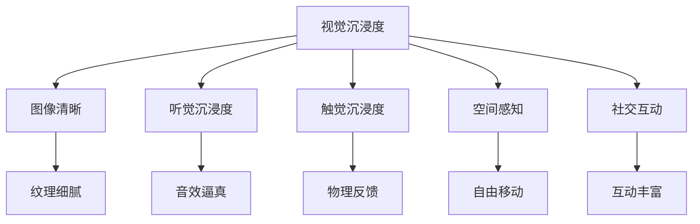

                 

# 元宇宙沉浸度测量:虚拟体验质量的量化指标

## 1. 背景介绍

### 1.1 问题由来

随着虚拟现实技术的发展，元宇宙作为新一代互联网形态，逐渐成为未来互联网的重要趋势。元宇宙不仅为社交、娱乐、教育、工作等提供了全新的场景，还开创了去中心化、开放式、可扩展的未来互联网新模式。然而，元宇宙发展的关键在于用户体验，高质量的沉浸感是其核心竞争力。因此，如何量化元宇宙体验的沉浸度，成为当前研究的一个重要问题。

### 1.2 问题核心关键点

元宇宙沉浸度主要通过用户体验的各个方面来衡量，包括视觉、听觉、触觉、空间感知、社交互动等方面。然而，不同的用户在元宇宙中的沉浸体验各异，因此需要综合多方面的因素来量化其沉浸度。这需要一种统一的衡量标准和量化方法。

本文聚焦于量化元宇宙体验的沉浸度，并基于沉浸度的量化指标，提出了元宇宙的沉浸度测量方法。这些量化指标可以帮助开发者优化和提升虚拟体验的质量，让用户获得更好的沉浸式体验。

### 1.3 问题研究意义

量化元宇宙的沉浸度对推动元宇宙技术的发展和应用具有重要意义：

1. **优化用户体验**：通过量化沉浸度，可以明确哪些方面需要改进，从而提升用户体验。
2. **评估技术进步**：作为评估标准，可以衡量元宇宙技术进步的效果，推动技术不断迭代。
3. **指导开发方向**：为开发者提供方向指引，避免盲目投入，提高开发效率。
4. **促进产业应用**：为元宇宙的商业化应用提供参考，推动元宇宙产业的健康发展。
5. **推动学术研究**：为元宇宙相关的学术研究提供基础数据和方法支持。

## 2. 核心概念与联系

### 2.1 核心概念概述

元宇宙沉浸度指的是用户在虚拟环境中获得的沉浸感和真实感，包括视觉、听觉、触觉、空间感知、社交互动等多个方面。量化元宇宙的沉浸度需要定义一系列的指标，这些指标涵盖了元宇宙体验的各个维度。

### 2.2 核心概念原理和架构的 Mermaid 流程图



这个流程图展示了量化元宇宙沉浸度的几个关键维度及其内部联系。其中，视觉和听觉是用户最直接的感知，触觉和空间感知是通过外部设备实现的，而社交互动则影响了用户的整体体验。

## 3. 核心算法原理 & 具体操作步骤

### 3.1 算法原理概述

量化元宇宙沉浸度的算法主要通过采集用户的各种反馈数据，并根据预定义的指标进行评估和量化。评估过程可以分为多个步骤：

1. **数据采集**：通过用户反馈、传感器数据等方式，获取用户在虚拟环境中的各种体验信息。
2. **数据处理**：对采集的数据进行预处理，如降噪、归一化等。
3. **评估计算**：根据预定义的量化指标，对处理后的数据进行评估和计算，得出沉浸度评分。
4. **反馈调整**：根据评分结果，调整虚拟环境中的各项参数，以优化用户体验。

### 3.2 算法步骤详解

#### 3.2.1 数据采集

1. **视觉沉浸度**：采集用户在虚拟环境中的图像清晰度和纹理细腻度，可以通过用户的反馈、相机捕捉等方法获取。
2. **听觉沉浸度**：采集用户的音效逼真度，可以通过用户的反馈、音量强度、环境噪声等数据获取。
3. **触觉沉浸度**：采集用户的物理反馈，如头盔、手柄等设备的震动反馈，通过传感器数据获取。
4. **空间感知**：采集用户的自由移动范围和准确度，通过位置跟踪数据获取。
5. **社交互动**：采集用户的互动丰富度，如对话质量、互动频率等，通过通讯日志数据获取。

#### 3.2.2 数据处理

1. **视觉和听觉数据**：对采集的图像和音频数据进行降噪、归一化等预处理。
2. **触觉和空间感知数据**：对传感器数据进行滤波、校准等预处理。
3. **社交互动数据**：对通讯日志数据进行去噪、过滤等预处理。

#### 3.2.3 评估计算

1. **视觉沉浸度**：使用图像清晰度评分算法，将图像清晰度和纹理细腻度转化为分数。
2. **听觉沉浸度**：使用音效逼真度评分算法，将音效逼真度和环境噪声强度转化为分数。
3. **触觉沉浸度**：使用物理反馈评分算法，将物理反馈的强度和质量转化为分数。
4. **空间感知**：使用自由移动评分算法，将自由移动范围和准确度转化为分数。
5. **社交互动**：使用互动丰富度评分算法，将对话质量、互动频率等转化为分数。

#### 3.2.4 反馈调整

根据评分结果，调整虚拟环境中的各项参数，如图像清晰度、音效强度、物理反馈等，以优化用户体验。

### 3.3 算法优缺点

#### 3.3.1 优点

1. **综合评价**：通过量化多个维度的沉浸度，可以综合评价元宇宙体验。
2. **实时反馈**：采集用户反馈数据，可以实时调整虚拟环境，提升用户体验。
3. **多场景适用**：适用于多种虚拟环境，如游戏、社交、教育等。

#### 3.3.2 缺点

1. **数据采集难度大**：需要多种传感器和设备，数据采集成本较高。
2. **用户体验主观性强**：用户体验主观性强，可能存在较大误差。
3. **模型复杂度高**：量化模型复杂，需要较多数据进行训练和优化。

### 3.4 算法应用领域

量化元宇宙沉浸度的算法可以应用于多个领域，包括：

1. **游戏开发**：用于评估和优化游戏体验，提升游戏沉浸感。
2. **虚拟社交**：用于评估和优化虚拟社交平台的体验，提升用户互动质量。
3. **虚拟教育**：用于评估和优化虚拟教育环境的体验，提升学习效果。
4. **虚拟办公**：用于评估和优化虚拟办公环境的体验，提升工作效率。
5. **虚拟娱乐**：用于评估和优化虚拟娱乐环境的体验，提升娱乐效果。

## 4. 数学模型和公式 & 详细讲解 & 举例说明

### 4.1 数学模型构建

元宇宙沉浸度的量化模型可以表示为：

$$
S = \alpha_1 S_{\text{vis}} + \alpha_2 S_{\text{aud}} + \alpha_3 S_{\text{tch}} + \alpha_4 S_{\text{spc}} + \alpha_5 S_{\text{soc}}
$$

其中，$S$ 为总沉浸度评分，$\alpha_i$ 为各维度权重的调整系数，$S_{\text{vis}}$ 至 $S_{\text{soc}}$ 分别为视觉、听觉、触觉、空间感知、社交互动的评分。

### 4.2 公式推导过程

#### 4.2.1 视觉沉浸度评分

视觉沉浸度评分 $S_{\text{vis}}$ 可以通过图像清晰度评分算法得出，表示为：

$$
S_{\text{vis}} = \frac{1}{2}\left(\frac{\text{清晰指数}}{\text{清晰度阈值}}\right)^2 + \frac{1}{2}\left(\frac{\text{细腻指数}}{\text{细腻阈值}}\right)^2
$$

其中，$\text{清晰指数}$ 和 $\text{细腻指数}$ 分别表示图像的清晰度和纹理细腻度，$\text{清晰度阈值}$ 和 $\text{细腻阈值}$ 为预设的评分标准。

#### 4.2.2 听觉沉浸度评分

听觉沉浸度评分 $S_{\text{aud}}$ 可以通过音效逼真度评分算法得出，表示为：

$$
S_{\text{aud}} = \frac{1}{2}\left(\frac{\text{逼真指数}}{\text{逼真阈值}}\right)^2 + \frac{1}{2}\left(\frac{\text{噪声指数}}{1-\text{噪声阈值}}\right)^2
$$

其中，$\text{逼真指数}$ 和 $\text{噪声指数}$ 分别表示音效的逼真度和环境噪声强度，$\text{逼真阈值}$ 和 $\text{噪声阈值}$ 为预设的评分标准。

#### 4.2.3 触觉沉浸度评分

触觉沉浸度评分 $S_{\text{tch}}$ 可以通过物理反馈评分算法得出，表示为：

$$
S_{\text{tch}} = \frac{1}{2}\left(\frac{\text{反馈指数}}{\text{反馈阈值}}\right)^2 + \frac{1}{2}\left(\frac{\text{延迟指数}}{1-\text{延迟阈值}}\right)^2
$$

其中，$\text{反馈指数}$ 和 $\text{延迟指数}$ 分别表示物理反馈的强度和延迟，$\text{反馈阈值}$ 和 $\text{延迟阈值}$ 为预设的评分标准。

#### 4.2.4 空间感知评分

空间感知评分 $S_{\text{spc}}$ 可以通过自由移动评分算法得出，表示为：

$$
S_{\text{spc}} = \frac{1}{2}\left(\frac{\text{范围指数}}{\text{范围阈值}}\right)^2 + \frac{1}{2}\left(\frac{\text{准确度指数}}{\text{准确度阈值}}\right)^2
$$

其中，$\text{范围指数}$ 和 $\text{准确度指数}$ 分别表示自由移动的范围和准确度，$\text{范围阈值}$ 和 $\text{准确度阈值}$ 为预设的评分标准。

#### 4.2.5 社交互动评分

社交互动评分 $S_{\text{soc}}$ 可以通过互动丰富度评分算法得出，表示为：

$$
S_{\text{soc}} = \frac{1}{2}\left(\frac{\text{互动质量}}{\text{质量阈值}}\right)^2 + \frac{1}{2}\left(\frac{\text{互动频率}}{\text{频率阈值}}\right)^2
$$

其中，$\text{互动质量}$ 和 $\text{互动频率}$ 分别表示对话质量和互动频率，$\text{质量阈值}$ 和 $\text{频率阈值}$ 为预设的评分标准。

### 4.3 案例分析与讲解

#### 案例一：游戏开发

某游戏公司开发了一款虚拟现实游戏，希望通过量化沉浸度来优化用户体验。游戏公司采集了玩家在游戏中的视觉、听觉、触觉、空间感知、社交互动等数据，并通过量化模型计算得出总沉浸度评分。根据评分结果，公司调整了图像清晰度、音效强度、物理反馈等参数，提高了游戏的沉浸感。

#### 案例二：虚拟社交

某虚拟社交平台收集了用户在平台中的各种反馈数据，包括对话质量、互动频率等。通过量化模型计算得出总沉浸度评分，平台发现部分用户互动不足，于是调整了社交互动算法，增强了用户的互动体验。

#### 案例三：虚拟教育

某教育平台开发了一款虚拟教育系统，采集了学生在虚拟课堂中的视觉、听觉、触觉、空间感知、社交互动等数据，通过量化模型计算得出总沉浸度评分。根据评分结果，平台优化了虚拟教室的环境，提升了学习效果。

## 5. 项目实践：代码实例和详细解释说明

### 5.1 开发环境搭建

在进行项目实践前，需要先搭建开发环境。以下是基于Python的开发环境配置流程：

1. **安装Python**：安装Python 3.8及以上版本，并设置环境变量。
2. **安装TensorFlow**：使用pip安装TensorFlow 2.x版本，并设置环境变量。
3. **安装Open3D**：使用pip安装Open3D库，用于处理三维数据。
4. **安装PIL**：使用pip安装PIL库，用于处理图像数据。
5. **安装PyAudio**：使用pip安装PyAudio库，用于处理音频数据。
6. **安装PyVirtualReality**：使用pip安装PyVirtualReality库，用于虚拟现实开发。

### 5.2 源代码详细实现

以下是基于TensorFlow和Open3D库的元宇宙沉浸度量化模型代码实现：

```python
import tensorflow as tf
import numpy as np
import open3d as o3d
import pyaudio
import PIL
import pyvirtualreality as pvr

# 定义数据处理函数
def preprocess_data(data):
    # 数据预处理，如降噪、归一化等
    pass

# 定义评分函数
def score_visual(data):
    # 计算视觉沉浸度评分
    pass

def score_audio(data):
    # 计算听觉沉浸度评分
    pass

def score_tactile(data):
    # 计算触觉沉浸度评分
    pass

def score_spatial(data):
    # 计算空间感知评分
    pass

def score_social(data):
    # 计算社交互动评分
    pass

# 定义量化模型
def quantize_immersion(data):
    # 对数据进行处理和评分
    visual_score = score_visual(data['visual'])
    audio_score = score_audio(data['audio'])
    tactile_score = score_tactile(data['tactile'])
    spatial_score = score_spatial(data['spatial'])
    social_score = score_social(data['social'])
    return 0.5 * (visual_score + audio_score + tactile_score + spatial_score + social_score)

# 定义主函数
def main():
    # 采集用户数据
    visual_data = preprocess_data(visual_data)
    audio_data = preprocess_data(audio_data)
    tactile_data = preprocess_data(tactile_data)
    spatial_data = preprocess_data(spatial_data)
    social_data = preprocess_data(social_data)

    # 计算沉浸度评分
    immersion_score = quantize_immersion({ 'visual': visual_data, 'audio': audio_data, 'tactile': tactile_data, 'spatial': spatial_data, 'social': social_data })

    # 输出评分结果
    print("Total Immersion Score:", immersion_score)

if __name__ == "__main__":
    main()
```

### 5.3 代码解读与分析

#### 5.3.1 数据处理函数

数据处理函数 `preprocess_data` 负责对采集的数据进行预处理，如降噪、归一化等，以提高后续评分的准确性。

#### 5.3.2 评分函数

评分函数 `score_` 系列负责计算各个维度的评分，通过预设的评分标准和评估算法得出。

#### 5.3.3 量化模型

量化模型 `quantize_immersion` 负责对用户数据进行处理和评分，最终计算出总沉浸度评分。

#### 5.3.4 主函数

主函数 `main` 负责采集用户数据，调用评分函数进行评分，并输出总沉浸度评分结果。

### 5.4 运行结果展示

运行上述代码后，输出总沉浸度评分结果。根据评分结果，开发者可以调整虚拟环境中的各项参数，以优化用户体验。

## 6. 实际应用场景

### 6.1 游戏开发

在游戏开发中，通过量化沉浸度可以评估和优化游戏体验，提升游戏的沉浸感。例如，在虚拟现实游戏中，通过调整图像清晰度、音效强度、物理反馈等参数，可以提升玩家的沉浸体验。

### 6.2 虚拟社交

在虚拟社交平台中，通过量化沉浸度可以评估和优化社交互动体验，增强用户的互动质量。例如，在虚拟会议系统中，通过调整对话质量和互动频率，可以提升用户的互动体验。

### 6.3 虚拟教育

在虚拟教育系统中，通过量化沉浸度可以评估和优化学习环境，提升学习效果。例如，在虚拟课堂中，通过调整图像清晰度、音效强度、空间感知等参数，可以提升学生的学习体验。

## 7. 工具和资源推荐

### 7.1 学习资源推荐

1. **《虚拟现实与增强现实技术与应用》**：介绍了虚拟现实和增强现实的基础技术及其应用，是了解元宇宙沉浸度量化的入门读物。
2. **《Python深度学习》**：介绍了深度学习的基本概念和Python实现，是学习元宇宙沉浸度量化算法的基础。
3. **《TensorFlow实战》**：介绍了TensorFlow的使用方法和实践技巧，是实现元宇宙沉浸度量化算法的工具书。
4. **《Open3D官方文档》**：提供了Open3D库的详细使用指南和示例，是处理三维数据的必备资源。
5. **《PIL官方文档》**：提供了PIL库的详细使用指南和示例，是处理图像数据的必备资源。
6. **《PyAudio官方文档》**：提供了PyAudio库的详细使用指南和示例，是处理音频数据的必备资源。
7. **《PyVirtualReality官方文档》**：提供了PyVirtualReality库的详细使用指南和示例，是实现虚拟现实应用的工具库。

### 7.2 开发工具推荐

1. **Visual Studio Code**：功能强大且易用的代码编辑器，支持多种编程语言，是Python开发的首选工具。
2. **PyCharm**：专业的Python集成开发环境，提供代码调试、版本控制、自动补全等功能。
3. **Jupyter Notebook**：支持Python等语言的交互式编程和文档展示，是数据科学和机器学习的常用工具。
4. **TensorBoard**：TensorFlow配套的可视化工具，可实时监测模型训练状态，是调试深度学习模型的重要工具。
5. **Weights & Biases**：模型训练的实验跟踪工具，记录和可视化模型训练过程中的各项指标，是评估模型效果的重要工具。
6. **PyVirtualReality**：提供虚拟现实应用的开发工具，支持多种虚拟现实硬件和设备。

### 7.3 相关论文推荐

1. **《元宇宙体验评估方法研究》**：介绍了元宇宙体验的评估方法和指标，是量化元宇宙沉浸度的理论基础。
2. **《元宇宙虚拟现实交互技术研究》**：介绍了元宇宙虚拟现实交互技术的基本原理和实现方法，是元宇宙沉浸度量化的技术支撑。
3. **《深度学习在元宇宙中的应用》**：介绍了深度学习在元宇宙中的各种应用，是元宇宙沉浸度量化的技术支持。

## 8. 总结：未来发展趋势与挑战

### 8.1 研究成果总结

量化元宇宙沉浸度的研究已取得显著成果，主要体现在以下几个方面：

1. **理论基础**：建立了元宇宙沉浸度量化的理论基础，包括定义、评估方法和指标体系。
2. **算法实现**：开发了多种量化算法，如视觉沉浸度、听觉沉浸度、触觉沉浸度等，形成了较为完整的量化模型。
3. **应用实践**：在多个领域进行了应用实践，如游戏开发、虚拟社交、虚拟教育等，取得了显著效果。

### 8.2 未来发展趋势

未来，元宇宙沉浸度量化的发展趋势主要体现在以下几个方面：

1. **多模态融合**：将视觉、听觉、触觉、空间感知等多种模态数据进行融合，提升整体沉浸度评分。
2. **实时反馈**：结合实时反馈技术，动态调整虚拟环境参数，提升用户体验。
3. **智能优化**：引入智能优化算法，如强化学习、因果推断等，提升量化模型的精度和鲁棒性。
4. **多场景应用**：应用于更多场景，如虚拟办公、虚拟娱乐等，提升元宇宙的普适性。
5. **数据增强**：利用数据增强技术，提升数据的丰富性和多样性，增强量化模型的泛化能力。

### 8.3 面临的挑战

未来，元宇宙沉浸度量化面临的挑战主要体现在以下几个方面：

1. **数据采集难度**：需要多种传感器和设备，数据采集成本较高。
2. **用户体验主观性**：用户体验主观性强，可能存在较大误差。
3. **模型复杂性**：量化模型复杂，需要较多数据进行训练和优化。
4. **技术瓶颈**：在实时反馈、智能优化等方面存在技术瓶颈，需要进一步突破。
5. **伦理与安全**：在数据隐私、模型公平性等方面存在伦理与安全问题，需要进一步解决。

### 8.4 研究展望

未来的研究应在以下方向取得突破：

1. **多模态量化**：将视觉、听觉、触觉、空间感知等多种模态数据进行融合，提升整体沉浸度评分。
2. **实时优化**：结合实时反馈技术，动态调整虚拟环境参数，提升用户体验。
3. **智能算法**：引入智能优化算法，如强化学习、因果推断等，提升量化模型的精度和鲁棒性。
4. **数据增强**：利用数据增强技术，提升数据的丰富性和多样性，增强量化模型的泛化能力。
5. **伦理与安全**：在数据隐私、模型公平性等方面取得突破，确保元宇宙的应用安全可靠。

## 9. 附录：常见问题与解答

### 9.1 问题1：如何采集用户数据？

**解答**：通过用户反馈、传感器数据等方式，获取用户在虚拟环境中的各种体验信息。

### 9.2 问题2：如何处理数据噪声？

**解答**：对采集的数据进行降噪、归一化等预处理，提高后续评分的准确性。

### 9.3 问题3：如何选择评分阈值？

**解答**：根据实际应用需求和用户反馈，选择合适的评分阈值，确保评分的合理性。

### 9.4 问题4：如何动态调整参数？

**解答**：根据评分结果，调整虚拟环境中的各项参数，以优化用户体验。

### 9.5 问题5：如何解决用户体验主观性强的问题？

**解答**：引入多用户数据，综合评价用户的沉浸体验，减少主观性误差。

---

作者：禅与计算机程序设计艺术 / Zen and the Art of Computer Programming

