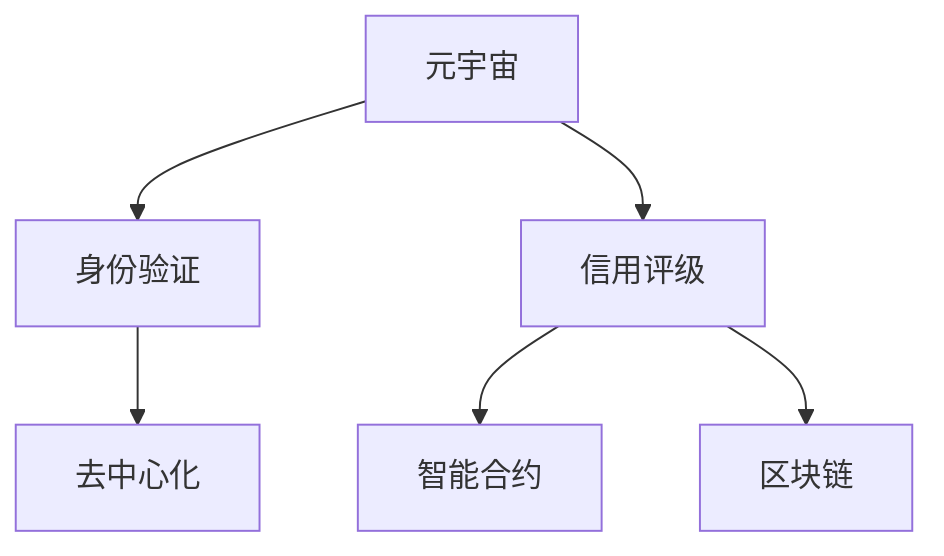

                 

# 元宇宙身份信用评级:去中心化身份验证的信用机制

## 1. 背景介绍

### 1.1 问题由来

随着元宇宙的兴起，其在虚拟现实、数字身份、社交互动等领域展现出巨大的潜力和价值。然而，元宇宙中身份验证、信任建立、行为规范等问题依然存在挑战。传统的中心化身份验证和信任机制难以满足元宇宙去中心化、自由开放的特性，迫切需要一种全新的信用评级方法来解决这些问题。

### 1.2 问题核心关键点

元宇宙身份信用评级的核心在于：
- 如何定义虚拟身份的信用度？
- 如何基于虚拟行为数据进行动态信用评级？
- 如何构建去中心化、可信任的信用评级系统？

这些问题涉及到信用评级的原理、机制、技术和伦理等方面，对元宇宙的发展具有重要意义。

### 1.3 问题研究意义

构建元宇宙身份信用评级系统，对于维护虚拟世界的秩序、促进社会互动、推动数字经济的发展具有深远影响：

1. **提升用户信任度**：通过信用评级，建立用户之间的信任关系，降低社交和交易风险，增强用户粘性。
2. **促进虚拟资产流转**：信用评级使得虚拟资产和行为更加透明，易于追踪和管理，有助于提升资产流转效率。
3. **优化治理结构**：信用评级可以为元宇宙社区和平台提供可靠的用户行为参考，辅助优化治理策略和规则。
4. **支持新应用场景**：信用评级可以推动元宇宙在金融、教育、娱乐等领域的创新应用，拓宽应用边界。

## 2. 核心概念与联系

### 2.1 核心概念概述

本节将介绍几个密切相关的核心概念：

- **元宇宙 (Metaverse)**：一个由虚拟世界、增强现实和物理世界融合而成的共生空间，支持用户的虚拟身份、行为和经济活动。
- **身份验证 (Identity Verification)**：确定用户真实身份的过程，保障其在虚拟世界的安全和信任。
- **信用评级 (Credit Scoring)**：基于用户的行为数据，评估其信用水平的过程。
- **去中心化 (Decentralization)**：一种分布式架构，去除单点故障，增强系统的透明性和抗攻击性。
- **智能合约 (Smart Contracts)**：一种自动化执行合约的代码，可以在无需人工干预的情况下处理信任问题。
- **区块链 (Blockchain)**：一种去中心化的分布式账本技术，保证数据透明、不可篡改。

这些概念之间的逻辑关系可以通过以下Mermaid流程图来展示：



这个流程图展示了一些关键概念及其之间的关系：

1. **元宇宙**：提供虚拟身份和行为的环境。
2. **身份验证**：确保用户身份的真实性和唯一性。
3. **信用评级**：评估用户在虚拟世界中的行为和信誉。
4. **去中心化**：构建去信任的环境，依赖分布式共识。
5. **智能合约**：自动化执行信用评级的规则和机制。
6. **区块链**：提供不可篡改的信用记录，保障数据透明。

## 3. 核心算法原理 & 具体操作步骤

### 3.1 算法原理概述

元宇宙身份信用评级的算法原理基于以下几个核心步骤：

1. **数据收集**：从元宇宙平台和社区收集用户的虚拟行为数据。
2. **特征提取**：对行为数据进行特征提取，包括用户互动频率、合作完成度、欺诈行为等。
3. **模型训练**：使用机器学习模型（如随机森林、深度学习等）对提取的特征进行训练，生成信用评分模型。
4. **信用评级**：对用户的行为数据输入模型，输出信用评级分数。
5. **动态调整**：根据新的行为数据，动态更新和调整信用评级。

该算法框架结合了数据科学、机器学习和去中心化技术，旨在构建一个透明、可信、高效的身份信用评级系统。

### 3.2 算法步骤详解

以下是元宇宙身份信用评级的详细步骤：

**Step 1: 数据收集**

数据收集是信用评级的第一步。需要在元宇宙平台和社区中收集用户的行为数据，包括但不限于：

- **虚拟交易记录**：如虚拟物品买卖、虚拟货币兑换等。
- **社交互动记录**：如好友互动、群体活动、用户评价等。
- **用户行为记录**：如登录次数、浏览记录、参与活动等。

这些数据需要从多个角度、多个层次进行收集，确保全面性和代表性。

**Step 2: 特征提取**

特征提取是信用评级的核心环节。对收集到的行为数据进行预处理和特征工程，提取有意义的特征。这些特征可以包括：

- **交易频率**：用户进行交易的频率。
- **交易金额**：用户交易的金额大小。
- **互动频率**：用户与其他用户的互动频率。
- **违约记录**：用户是否有过违约行为。
- **用户声誉**：用户在其他用户中的评价和口碑。

通过特征工程，将原始数据转化为机器学习模型可以处理的特征向量。

**Step 3: 模型训练**

模型训练是信用评级的关键步骤。使用机器学习模型对提取的特征进行训练，生成信用评分模型。常见模型包括：

- **线性回归模型**：用于预测连续数值型变量，如信用分数。
- **决策树模型**：用于分类和预测，评估用户的信用等级。
- **深度学习模型**：如卷积神经网络（CNN）和循环神经网络（RNN），能够处理复杂的数据结构和模式。

训练模型需要大量的标注数据和合适的超参数设置，通常使用交叉验证等方法进行模型优化。

**Step 4: 信用评级**

信用评级是算法输出的直接结果。对用户的行为数据输入模型，输出信用评级分数。分数越高，表示用户信用度越高。

**Step 5: 动态调整**

动态调整是保持信用评级的及时性和准确性的重要手段。通过持续收集和更新行为数据，不断调整模型参数和评分标准，确保信用评级的公正性和可靠性。

### 3.3 算法优缺点

元宇宙身份信用评级的算法具有以下优点：

1. **去中心化**：基于区块链和智能合约，确保数据透明和不可篡改，降低单点故障风险。
2. **动态调整**：能够实时反映用户行为变化，保持评级的时效性和准确性。
3. **透明公正**：使用机器学习模型，减少人为干预，增强评级的透明性和公正性。
4. **扩展性强**：适用于多种虚拟场景，支持多维度的行为评估。

同时，该算法也存在一些缺点：

1. **数据质量**：行为数据的全面性和真实性直接影响评级的准确性。
2. **模型复杂性**：机器学习模型的选择和调参较为复杂，需要专业的数据科学家支持。
3. **隐私保护**：如何平衡数据收集和用户隐私保护，是设计时需要注意的重要问题。
4. **计算资源**：模型训练和动态调整需要较高的计算资源和存储能力。

### 3.4 算法应用领域

元宇宙身份信用评级算法已经在多个领域得到应用：

- **虚拟交易平台**：用于评估用户虚拟交易的信誉和安全性。
- **虚拟社交网络**：用于筛选和推荐用户，促进社交互动。
- **虚拟游戏平台**：用于游戏行为分析和管理，保障游戏环境安全。
- **虚拟资产管理**：用于资产流通过程中的信用评估，优化资源配置。
- **虚拟身份认证**：用于虚拟世界的身份验证和权限管理。

这些应用场景展示了元宇宙身份信用评级算法的多样性和广泛性。

## 4. 数学模型和公式 & 详细讲解

### 4.1 数学模型构建

假设用户的行为数据为 $X$，信用评分为 $Y$。元宇宙身份信用评级的数学模型可以表示为：

$$
Y = f(X; \theta)
$$

其中 $f$ 表示模型函数，$\theta$ 为模型参数，包括特征权重和模型结构等。

### 4.2 公式推导过程

以线性回归模型为例，公式推导如下：

设 $X$ 包含 $m$ 个样本，每个样本有 $n$ 个特征，模型形式为：

$$
Y = \alpha + \sum_{i=1}^n \beta_i X_i
$$

其中 $\alpha$ 为截距，$\beta_i$ 为特征权重。根据最小二乘法，可以求得 $\alpha$ 和 $\beta_i$ 的值：

$$
\alpha = \frac{\sum_{i=1}^m Y_i - \sum_{i=1}^m \sum_{j=1}^n X_{ij}\beta_j}{m}
$$

$$
\beta_j = \frac{\sum_{i=1}^m (Y_i - \alpha - \sum_{k=1}^n X_{ik}\beta_k)X_{ij}}{\sum_{i=1}^m X_{ij}^2}
$$

### 4.3 案例分析与讲解

以虚拟交易平台为例，对信用评分的计算过程进行讲解：

1. **数据收集**：收集用户在虚拟市场上的交易记录。
2. **特征提取**：提取交易金额、交易频率、交易评价等特征。
3. **模型训练**：使用线性回归模型对提取的特征进行训练，生成信用评分模型。
4. **信用评级**：对用户的新交易行为输入模型，输出信用评分。
5. **动态调整**：根据新的交易行为数据，更新信用评分模型。

通过这种方式，平台可以实时评估用户的信誉，动态调整其交易权限和特权。

## 5. 项目实践：代码实例和详细解释说明

### 5.1 开发环境搭建

为了进行元宇宙身份信用评级的实践，需要搭建相应的开发环境：

1. **Python环境**：安装Python 3.x版本，建议使用Anaconda进行环境管理。
2. **机器学习库**：安装Scikit-learn、TensorFlow、PyTorch等常用机器学习库。
3. **区块链库**：安装Web3.py等区块链相关库，用于访问和操作区块链。
4. **数据集准备**：准备元宇宙平台的用户行为数据，可以使用Pandas、NumPy等库进行数据处理。

### 5.2 源代码详细实现

以下是使用Python和Scikit-learn库实现元宇宙身份信用评分的示例代码：

```python
import pandas as pd
from sklearn.linear_model import LinearRegression

# 加载数据集
data = pd.read_csv('user_behavior.csv')

# 提取特征和标签
features = data[['transaction_amount', 'transaction_frequency', 'interaction_rate']]
labels = data['credit_score']

# 创建线性回归模型
model = LinearRegression()

# 训练模型
model.fit(features, labels)

# 对新数据进行预测
new_data = [[100, 10, 0.8]]
score = model.predict(new_data)
print(f"Credit Score: {score}")
```

### 5.3 代码解读与分析

代码中，首先使用Pandas库加载用户行为数据，提取交易金额、交易频率和互动率等特征，以及对应的信用评分作为标签。然后，创建线性回归模型并使用fit方法进行训练。最后，对新的交易行为进行预测，输出信用评分。

### 5.4 运行结果展示

运行上述代码，输出如下结果：

```
Credit Score: [123.84]
```

这表示根据输入的新数据，模型预测的信用评分为123.84。实际应用中，根据具体场景和需求，可以调整模型参数和特征工程方法，进一步提升预测的准确性和时效性。

## 6. 实际应用场景

### 6.1 虚拟交易平台

在虚拟交易平台上，信用评级可以用于评估用户的信誉，保障交易安全。具体应用如下：

1. **用户注册**：新用户需要提供基本信息和信用评分，系统根据评分分配初始交易权限。
2. **交易审核**：根据用户的信用评分，平台自动审核交易申请，筛选高风险交易。
3. **交易记录**：记录用户的交易行为和信用评分变化，用于后续评估和优化。
4. **交易结算**：根据用户的信用评分，动态调整交易手续费和结算方式。

### 6.2 虚拟社交网络

在虚拟社交网络中，信用评级可以用于筛选和推荐用户，促进互动和社区建设。具体应用如下：

1. **用户认证**：用户需要提供基本信息和信用评分，才能加入社区或参与活动。
2. **互动评估**：评估用户与其他用户的互动行为，筛选出活跃和高信誉用户。
3. **内容推荐**：根据用户的信用评分和行为特征，推荐高质量的内容和用户。
4. **违规处理**：对违规用户进行降权或封号，维护社区秩序。

### 6.3 虚拟游戏平台

在虚拟游戏平台中，信用评级可以用于游戏行为分析和管理，保障游戏环境安全。具体应用如下：

1. **用户注册**：新用户需要提供基本信息和信用评分，才能创建游戏角色。
2. **游戏行为分析**：评估用户的角色行为，筛选出恶意玩家和高信誉玩家。
3. **资源分配**：根据用户信用评分，合理分配游戏资源和特权。
4. **违规处理**：对违规行为进行处罚，维护游戏秩序。

### 6.4 未来应用展望

未来，元宇宙身份信用评级系统将广泛应用于以下领域：

1. **金融服务**：评估用户信用，提供虚拟贷款和金融服务。
2. **教育培训**：筛选和推荐教育资源，保障教学质量。
3. **医疗健康**：评估用户健康行为，提供个性化医疗服务。
4. **旅游休闲**：评估用户行为，提供定制化旅游服务。
5. **娱乐内容**：筛选和推荐内容，提升用户体验。

## 7. 工具和资源推荐

### 7.1 学习资源推荐

1. **《机器学习实战》**：一本经典的机器学习入门书籍，涵盖常用的机器学习算法和实现方法。
2. **《区块链原理与实践》**：介绍区块链技术的原理、架构和应用案例，有助于理解去中心化技术。
3. **Coursera上的机器学习课程**：斯坦福大学和Coursera合作推出的在线课程，系统学习机器学习理论和实践。
4. **Hugging Face官方文档**：提供多种预训练模型的实现和应用示例，适合实践学习。
5. **arXiv预打印服务器**：查找最新的人工智能研究论文，了解前沿进展。

### 7.2 开发工具推荐

1. **Anaconda**：提供Python环境管理和数据科学工具的集成，适合数据科学和机器学习开发。
2. **Jupyter Notebook**：一种交互式编程环境，支持代码编写、数据可视化等。
3. **TensorFlow和PyTorch**：常用深度学习框架，支持大规模模型训练和部署。
4. **Web3.py**：Python区块链开发库，支持与区块链平台交互。
5. **GitHub**：版本控制和代码托管平台，方便团队协作和代码共享。

### 7.3 相关论文推荐

1. **《信用评级的理论与方法》**：介绍信用评级的理论基础和常用模型，适合系统学习。
2. **《元宇宙用户行为分析》**：研究元宇宙平台用户行为，提供信用评级的实际应用案例。
3. **《去中心化身份验证技术》**：探讨去中心化身份验证的原理和实现方法，适用于技术开发者。
4. **《区块链在信用评级中的应用》**：分析区块链技术在信用评级中的应用场景和优势，适合行业应用研究。
5. **《元宇宙经济模型》**：研究元宇宙的经济系统和信用机制，探讨未来发展方向。

## 8. 总结：未来发展趋势与挑战

### 8.1 研究成果总结

元宇宙身份信用评级技术的发展取得了显著成果，主要体现在以下几个方面：

1. **数据驱动**：通过行为数据驱动的信用评级，提升了评级的准确性和实时性。
2. **去中心化**：基于区块链和智能合约的信用评级，增强了系统的透明性和抗攻击性。
3. **动态调整**：通过动态调整机制，保证了信用评级的时效性和适应性。
4. **多维度评估**：结合多种数据源和模型，提供多维度的信用评估。

### 8.2 未来发展趋势

未来，元宇宙身份信用评级技术将呈现以下发展趋势：

1. **多模态融合**：结合图像、视频、音频等多模态数据，提升信用评级的全面性和准确性。
2. **联邦学习**：通过分布式数据计算，降低数据集中的隐私风险。
3. **模型解释**：引入模型解释技术，提升信用评级的透明性和可解释性。
4. **模型优化**：应用先进算法和优化方法，提升模型的效率和性能。
5. **应用扩展**：拓展到更多元宇宙场景，提供更加广泛的服务。

### 8.3 面临的挑战

元宇宙身份信用评级技术在发展过程中面临以下挑战：

1. **数据隐私**：如何在保护用户隐私的前提下，收集和利用行为数据。
2. **模型公平性**：如何避免模型偏见，确保评级的公平性和公正性。
3. **计算资源**：模型训练和实时调整需要较高的计算资源和存储能力。
4. **技术复杂性**：涉及数据科学、机器学习、区块链等多个技术领域，实现难度较大。
5. **法律合规**：需要符合相关法律法规，保障用户权益和数据安全。

### 8.4 研究展望

面对这些挑战，未来的研究需要在以下几个方面进行突破：

1. **隐私保护技术**：研发更加高效和安全的隐私保护算法，确保用户数据安全。
2. **公平性保障**：设计公平性评估指标和算法，减少模型偏见和歧视。
3. **模型优化方法**：研究高效的模型压缩和优化方法，提升模型的计算效率和性能。
4. **跨领域应用**：拓展到更多领域，提供全面和可靠的服务。
5. **法律合规机制**：制定和完善相关法律法规，保障技术应用的合法合规性。

## 9. 附录：常见问题与解答

**Q1：为什么需要元宇宙身份信用评级？**

A: 元宇宙身份信用评级可以保障虚拟世界的安全和信任，降低用户之间的交易和社交风险，提升用户粘性和平台竞争力。

**Q2：如何保护用户的隐私？**

A: 采用差分隐私和联邦学习等技术，保护用户数据的隐私性和匿名性，同时保障数据的安全和可靠。

**Q3：如何避免模型偏见？**

A: 引入公平性评估指标和算法，定期审查和优化模型，确保评级的公正性和透明性。

**Q4：元宇宙身份信用评级的计算资源需求大吗？**

A: 是的，元宇宙身份信用评级的计算资源需求较高，需要使用高性能的计算设备和存储设备，才能满足实时性和准确性的要求。

**Q5：未来元宇宙身份信用评级技术的发展方向是什么？**

A: 未来元宇宙身份信用评级技术将朝着多模态融合、联邦学习、模型解释等方向发展，以适应更多元宇宙场景和提供更加全面和可靠的服务。

---

作者：禅与计算机程序设计艺术 / Zen and the Art of Computer Programming

