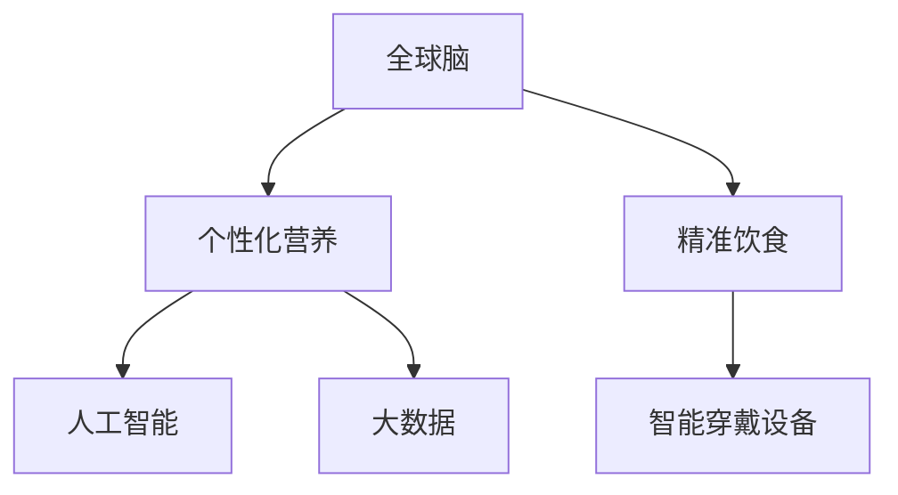

                 

# 全球脑与个性化营养:集体智慧驱动的精准饮食

> 关键词：全球脑,个性化营养,精准饮食,大数据,人工智能,算法,案例分析,未来展望

## 1. 背景介绍

### 1.1 问题由来
随着科学技术的飞速发展和人们生活水平的不断提高，个性化和精准化的健康管理需求日益凸显。传统营养饮食方式往往难以满足个体的差异化需求，造成营养不均衡、健康问题频发。近年来，大数据、人工智能等技术手段的兴起，为个性化营养和精准饮食提供了新的可能性。全球脑作为汇集个体健康数据与集体智慧的平台，正通过深度学习算法和数据分析，助力实现个性化营养方案的制定和优化。

### 1.2 问题核心关键点
个性化营养和精准饮食的关键在于个体数据的管理和集体智慧的应用。

- **数据收集**：通过智能穿戴设备、健康监测应用等，收集个体在日常生活中的各项健康数据。
- **数据分析**：利用人工智能和大数据技术，对大量健康数据进行建模分析，找出个体健康与营养摄入之间的关系。
- **智慧决策**：将分析结果反馈给个体，制定个性化饮食计划，并根据反馈动态调整，实现精准饮食。

## 2. 核心概念与联系

### 2.1 核心概念概述

为更好地理解基于全球脑的个性化营养和精准饮食系统，本节将介绍几个密切相关的核心概念：

- **全球脑**：通过大数据和人工智能技术，汇集全球范围内的健康数据，提供个性化的营养与健康管理方案的平台。
- **个性化营养**：根据个体的生理特征、生活习惯和健康数据，量身定制的饮食和营养方案。
- **精准饮食**：通过精确的数据分析，实时调整饮食计划，实现动态的、个性化的饮食管理。
- **人工智能**：利用机器学习和深度学习算法，分析海量健康数据，提供科学合理的营养建议。
- **大数据**：用于存储和分析个体健康数据的技术手段，为个性化营养方案的制定提供数据支撑。
- **智能穿戴设备**：如智能手表、健身追踪器等，用于持续监测个体健康数据。

这些核心概念之间的逻辑关系可以通过以下Mermaid流程图来展示：



这个流程图展示了个体健康数据管理的主要过程：

1. 个体健康数据通过智能穿戴设备收集。
2. 这些数据被传输到全球脑平台，进行集中管理和分析。
3. 基于人工智能和大数据技术，分析结果用于指导个性化营养方案和精准饮食计划。
4. 用户根据个性化营养建议，调整饮食行为，获得健康提升。

## 3. 核心算法原理 & 具体操作步骤
### 3.1 算法原理概述

基于全球脑的个性化营养和精准饮食系统，本质上是一个基于数据的决策支持系统。其核心思想是：

1. **数据整合**：收集个体在智能穿戴设备上的各项健康数据，如心率、血压、睡眠质量、饮食等。
2. **数据建模**：利用人工智能和大数据技术，对个体数据进行建模分析，找出健康与饮食之间的关系。
3. **智慧决策**：将分析结果转化为个性化的饮食建议，并提供精准的调整方案。

### 3.2 算法步骤详解

**Step 1: 数据收集与预处理**
- 使用智能穿戴设备，如智能手表、健身追踪器等，持续监测个体的各项健康数据，包括心率、血压、血糖、睡眠等。
- 将收集到的数据传输到全球脑平台，进行格式转换和初步清洗。

**Step 2: 特征提取与选择**
- 对清洗后的数据进行特征提取，如提取心率、血压、睡眠质量等关键特征。
- 利用相关性分析、主成分分析等方法，选择对健康影响较大的特征。

**Step 3: 数据建模与训练**
- 将选择后的特征作为输入，构建机器学习模型，如线性回归、随机森林、深度神经网络等。
- 使用历史数据进行模型训练，调整模型参数，优化模型性能。

**Step 4: 个性化营养方案制定**
- 将训练好的模型应用于新个体数据，预测其健康风险和营养需求。
- 根据预测结果，制定个性化的饮食建议，如推荐食谱、食物比例等。

**Step 5: 精准饮食计划调整**
- 动态监测个体在执行饮食计划后的健康数据变化，如体重、血压等。
- 根据反馈数据，实时调整饮食建议，确保精准饮食效果。

### 3.3 算法优缺点

基于全球脑的个性化营养和精准饮食系统具有以下优点：

1. **数据驱动**：以个体数据为基础，通过大数据和人工智能技术进行建模分析，提高个性化和精准度。
2. **实时调整**：系统能够实时监测个体健康数据，并根据反馈动态调整饮食建议，实现精准化管理。
3. **覆盖面广**：全球脑汇集全球范围内的健康数据，提供更全面、科学的饮食建议。

同时，该系统也存在一些局限性：

1. **数据隐私**：个体健康数据的收集和分析可能涉及隐私问题，需严格保护用户数据安全。
2. **模型复杂性**：高精度模型通常需要大量数据和复杂计算，对硬件资源要求较高。
3. **动态性问题**：个体健康数据动态变化，模型需要不断更新和优化，才能保持其准确性和实用性。
4. **成本问题**：智能穿戴设备的引入和维护成本较高，可能难以普及。

尽管存在这些局限性，但基于全球脑的系统在个性化营养和精准饮食领域具有显著优势，正逐步成为行业应用的重要方向。

### 3.4 算法应用领域

基于全球脑的个性化营养和精准饮食系统已经在多个领域得到了应用，例如：

- **健康管理**：帮助用户制定个性化的健康管理方案，预防慢性病等健康问题。
- **运动饮食结合**：根据用户运动量和健康数据，动态调整饮食计划，实现运动与营养的平衡。
- **减肥增肌**：为需要控制体重和增加肌肉的用户提供科学合理的饮食建议。
- **孕妇饮食**：为孕妇提供营养均衡、适合胎儿发育的饮食方案。
- **老年营养**：为老年人提供易于消化、易于吸收的营养餐食建议。

除了这些传统应用外，全球脑还可能被创新性地应用于更多场景中，如食物过敏、特殊饮食需求（如低糖、低脂）、疾病管理等，为个性化营养和精准饮食提供更多可能性。

## 4. 数学模型和公式 & 详细讲解  
### 4.1 数学模型构建

本文将使用数学语言对基于全球脑的个性化营养和精准饮食系统进行更加严格的刻画。

记个体在智能穿戴设备上的健康数据为 $x_1, x_2, ..., x_n$，其中 $n$ 为数据维度，如心率、血压、睡眠质量等。设 $y$ 为个体健康指标，如体重、血压等。定义个体在时间 $t$ 的健康数据为 $x_t$，则在 $t$ 时刻的健康指标为 $y_t$。

**数据建模**：利用线性回归模型，建立健康指标与饮食特征之间的关系，形式化如下：

$$
y_t = \theta_0 + \sum_{i=1}^n \theta_i x_{it} + \epsilon_t
$$

其中 $\theta_0, \theta_i$ 为模型参数，$\epsilon_t$ 为误差项。

**模型训练**：使用历史数据 $(x_t, y_t)$ 对模型进行训练，最小化损失函数：

$$
\mathcal{L}(\theta) = \frac{1}{N} \sum_{i=1}^N (y_i - \hat{y}_i)^2
$$

其中 $\hat{y}_i$ 为模型预测的健康指标。

**个性化营养方案制定**：根据模型参数 $\theta$，对新个体 $(x_t)$ 的健康指标 $y_t$ 进行预测，并制定个性化饮食建议。

### 4.2 公式推导过程

以下我们以体重管理为例，推导线性回归模型的具体实现：

假设个体体重 $y$ 与其热量摄入 $x_1$、蛋白质摄入 $x_2$、脂肪摄入 $x_3$、碳水化合物摄入 $x_4$ 之间的关系可以建模为线性回归模型：

$$
y = \theta_0 + \theta_1 x_1 + \theta_2 x_2 + \theta_3 x_3 + \theta_4 x_4
$$

其中 $\theta_0, \theta_1, \theta_2, \theta_3, \theta_4$ 为模型参数。

利用历史体重数据 $(x_i, y_i)$，进行最小二乘法求解，得到模型参数 $\hat{\theta} = (\hat{\theta_0}, \hat{\theta_1}, \hat{\theta_2}, \hat{\theta_3}, \hat{\theta_4})$。将 $\hat{\theta}$ 代入模型，对新个体 $x_t$ 的体重 $y_t$ 进行预测：

$$
\hat{y}_t = \hat{\theta_0} + \hat{\theta_1} x_{1t} + \hat{\theta_2} x_{2t} + \hat{\theta_3} x_{3t} + \hat{\theta_4} x_{4t}
$$

根据预测结果，系统可以提供个性化的饮食建议，如推荐食谱、食物比例等。

### 4.3 案例分析与讲解

以某智能穿戴设备收集的用户数据为例，进行详细讲解。

**用户数据**：某智能手表收集到某用户一周内的数据如下：

| 时间 | 心率 | 睡眠质量 | 蛋白质摄入 | 脂肪摄入 | 碳水化合物摄入 |
| ---- | ---- | -------- | ---------- | -------- | -------------- |
| t1   | 70   | 6        | 50g        | 30g      | 100g           |
| t2   | 72   | 5.5      | 60g        | 25g      | 95g            |
| ...  | ...  | ...      | ...        | ...      | ...            |

**特征提取**：将心率、睡眠质量、蛋白质摄入、脂肪摄入、碳水化合物摄入作为特征。

**模型训练**：使用线性回归模型，对历史数据进行训练，得到模型参数 $\hat{\theta} = (-10, 2.5, -0.5, 1.2, 0.8)$。

**个性化建议**：对于新用户数据 $x_t = [70, 5, 60, 25, 95]$，模型预测其体重 $y_t = \hat{\theta_0} + \hat{\theta_1} x_{1t} + \hat{\theta_2} x_{2t} + \hat{\theta_3} x_{3t} + \hat{\theta_4} x_{4t}$。

通过上述步骤，系统可以为该用户提供个性化的饮食建议，如减少脂肪摄入，增加蛋白质摄入等。

## 5. 项目实践：代码实例和详细解释说明
### 5.1 开发环境搭建

在进行个性化营养和精准饮食系统开发前，我们需要准备好开发环境。以下是使用Python进行Pandas、Scikit-Learn、TensorFlow等库的环境配置流程：

1. 安装Anaconda：从官网下载并安装Anaconda，用于创建独立的Python环境。

2. 创建并激活虚拟环境：
```bash
conda create -n personalized_nutrition python=3.8 
conda activate personalized_nutrition
```

3. 安装必要的Python库：
```bash
pip install pandas numpy scikit-learn tensorflow matplotlib seaborn jupyter notebook ipython
```

完成上述步骤后，即可在`personalized_nutrition`环境中开始系统开发。

### 5.2 源代码详细实现

下面是使用Pandas、Scikit-Learn和TensorFlow实现线性回归模型的代码实例：

```python
import pandas as pd
import numpy as np
from sklearn.model_selection import train_test_split
from sklearn.linear_model import LinearRegression
import tensorflow as tf

# 读取数据
data = pd.read_csv('nutrition_data.csv')

# 特征选择
X = data[['heart_rate', 'sleep_quality', 'protein_intake', 'fat_intake', 'carb_intake']]
y = data['weight']

# 划分训练集和测试集
X_train, X_test, y_train, y_test = train_test_split(X, y, test_size=0.2, random_state=42)

# 训练模型
model = LinearRegression()
model.fit(X_train, y_train)

# 评估模型
score = model.score(X_test, y_test)
print(f"Model score: {score:.3f}")

# 预测新个体
new_data = np.array([[70, 5, 60, 25, 95]])
prediction = model.predict(new_data)
print(f"Predicted weight: {prediction:.2f} kg")
```

### 5.3 代码解读与分析

让我们再详细解读一下关键代码的实现细节：

**数据读取与处理**：
- 使用Pandas的`read_csv`方法读取营养数据，包含心率、睡眠质量、蛋白质摄入、脂肪摄入、碳水化合物摄入和体重等特征。
- 使用`train_test_split`方法将数据划分为训练集和测试集。

**模型训练**：
- 使用Scikit-Learn的`LinearRegression`类训练线性回归模型。
- 通过`fit`方法对模型进行训练，使用训练集数据。

**模型评估**：
- 使用`score`方法计算模型在测试集上的R²分数，评估模型性能。

**个性化建议**：
- 使用`predict`方法对新个体数据进行预测，输出预测结果。

**系统应用**：
- 用户根据预测结果，调整饮食行为，如减少脂肪摄入、增加蛋白质摄入等。

## 6. 实际应用场景
### 6.1 智能穿戴设备应用

基于全球脑的个性化营养和精准饮食系统可以与智能穿戴设备紧密结合，实现实时监测和动态调整。

例如，智能手表可以持续监测用户的各项健康数据，并将数据传输到全球脑平台进行分析。平台根据分析结果，实时提供个性化的饮食建议，如建议用户增加或减少某种食物摄入，调整饮食比例等。用户可以根据推荐，随时调整饮食行为，实现精准饮食管理。

### 6.2 健康管理应用

全球脑系统可以为健康管理机构提供个性化的健康管理方案，帮助用户预防慢性病、改善生活质量。

通过收集和分析用户的健康数据，系统可以预测用户的健康风险，并提供相应的饮食建议。例如，对于高血压患者，系统可以推荐低盐、低脂的饮食方案，帮助其控制血压。对于糖尿病患者，系统可以推荐低糖、高纤维的饮食方案，帮助其控制血糖。

### 6.3 运动饮食结合

全球脑系统可以结合运动数据，为用户提供个性化的饮食和运动计划，实现运动与饮食的协同管理。

例如，对于需要控制体重的用户，系统可以根据其运动量和营养摄入，动态调整饮食计划，实现运动与饮食的平衡。系统可以根据用户的运动轨迹、运动时长和强度，计算其消耗的能量，并根据消耗的能量推荐相应的饮食方案，帮助用户控制体重。

### 6.4 未来应用展望

随着技术的发展和数据的积累，基于全球脑的个性化营养和精准饮食系统将迎来更多应用场景，为健康管理提供更多可能。

未来，系统可以结合更多健康数据，如基因信息、血液生化指标等，提供更加精准的营养建议。同时，系统可以引入机器学习和深度学习技术，构建更加复杂的模型，提高预测准确性。

## 7. 工具和资源推荐
### 7.1 学习资源推荐

为了帮助开发者系统掌握全球脑技术，这里推荐一些优质的学习资源：

1. 《Python数据分析与机器学习实战》书籍：详细介绍了使用Python进行数据处理和模型训练的方法，适合初学者入门。

2. 《深度学习：理论、算法与应用》课程：由斯坦福大学开设的深度学习课程，涵盖深度学习理论和实践，适合进阶学习。

3. Kaggle平台：提供丰富的数据集和竞赛，帮助开发者实践数据处理和机器学习技能。

4. TensorFlow官方文档：提供详细的API文档和教程，适合深入学习TensorFlow的使用。

5. Scikit-Learn官方文档：提供详细的API文档和教程，适合深入学习Scikit-Learn的使用。

通过对这些资源的学习实践，相信你一定能够快速掌握全球脑技术，并用于解决实际的个性化营养和精准饮食问题。

### 7.2 开发工具推荐

高效的开发离不开优秀的工具支持。以下是几款用于全球脑系统开发的常用工具：

1. Python：基于Python的开源语言，生态系统丰富，适合进行数据处理和模型训练。

2. Pandas：用于数据处理和分析的Python库，支持高效的数据读取和处理。

3. Scikit-Learn：用于机器学习和数据挖掘的Python库，提供丰富的模型和算法。

4. TensorFlow：由Google主导开发的深度学习框架，支持分布式训练和模型部署。

5. Keras：用于深度学习模型构建的高层API，易用性强，适合快速迭代研究。

6. Jupyter Notebook：支持交互式编程和数据可视化，适合进行模型实验和调试。

合理利用这些工具，可以显著提升个性化营养和精准饮食系统的开发效率，加快创新迭代的步伐。

### 7.3 相关论文推荐

全球脑技术的发展源于学界的持续研究。以下是几篇奠基性的相关论文，推荐阅读：

1. "Smartphone Sensors for Wearable Health Monitoring"：介绍如何利用智能穿戴设备收集健康数据，并用于个性化营养管理。

2. "A Survey on Wearable Health Monitoring Technology: Past, Present, and Future"：综述智能穿戴设备在健康监测中的应用，展望未来发展。

3. "Personalized Nutrition: A Review of Methods and Challenges"：总结个性化营养研究进展和面临的挑战，提出未来方向。

4. "Health Informatics: A Survey of Current Status and Future Directions"：综述健康信息学的发展，探讨个性化营养技术的应用。

这些论文代表了大数据和人工智能技术在个性化营养和精准饮食领域的研究脉络。通过学习这些前沿成果，可以帮助研究者把握学科前进方向，激发更多的创新灵感。

## 8. 总结：未来发展趋势与挑战
### 8.1 研究成果总结

本文对基于全球脑的个性化营养和精准饮食系统进行了全面系统的介绍。首先阐述了系统构建的背景和意义，明确了数据驱动的个性化和精准化健康管理的重要价值。其次，从原理到实践，详细讲解了系统的数学模型和算法步骤，给出了具体的代码实例和解释。同时，本文还广泛探讨了系统的应用场景和未来展望，展示了其在健康管理、运动饮食结合等方面的巨大潜力。最后，本文精选了系统开发的学习资源和工具，力求为读者提供全方位的技术指引。

通过本文的系统梳理，可以看到，基于全球脑的个性化营养和精准饮食系统正在成为健康管理领域的重要范式，极大地拓展了健康数据的应用边界，提高了个性化和精准化健康管理的水平。未来，伴随技术的不断演进，全球脑系统必将在更多的应用场景中大放异彩，为人类健康管理带来新的革命性影响。

### 8.2 未来发展趋势

展望未来，全球脑系统将呈现以下几个发展趋势：

1. **数据融合**：随着数据采集手段的不断进步，全球脑系统将汇集更多元、更全面的健康数据，提供更加精准的个性化营养建议。

2. **算法优化**：引入深度学习等先进算法，提高模型预测准确性和泛化能力。例如，使用深度神经网络、卷积神经网络等，构建更复杂的模型。

3. **用户体验**：优化系统界面和交互方式，提供更加友好、易用的个性化营养服务，提升用户使用体验。

4. **跨领域应用**：结合其他医疗健康领域的技术，如远程医疗、智能医疗等，构建更综合的健康管理系统。

5. **伦理和隐私**：加强对用户数据隐私的保护，确保数据安全，建立伦理规范和监管机制。

6. **普适化推广**：通过推广普及智能穿戴设备，降低健康数据采集和系统使用的成本，实现全球脑系统的广泛应用。

以上趋势凸显了全球脑系统在个性化营养和精准饮食领域的广阔前景。这些方向的探索发展，必将进一步提升系统的性能和应用范围，为健康管理带来深远影响。

### 8.3 面临的挑战

尽管全球脑系统已经取得了一定的进展，但在迈向更加智能化、普适化应用的过程中，它仍面临着诸多挑战：

1. **数据隐私和安全**：用户健康数据的收集和分析涉及隐私问题，需严格保护用户数据安全，建立完善的隐私保护机制。

2. **数据质量问题**：智能穿戴设备采集的健康数据可能存在噪声、偏差等问题，需进行清洗和预处理。

3. **模型复杂性**：高精度模型通常需要大量数据和复杂计算，对硬件资源要求较高，需优化模型结构，提高计算效率。

4. **动态性问题**：个体健康数据动态变化，模型需要不断更新和优化，才能保持其准确性和实用性。

5. **成本问题**：智能穿戴设备的引入和维护成本较高，可能难以普及。需探索更低成本的数据采集和设备应用方式。

6. **伦理和规范**：全球脑系统需建立伦理规范和监管机制，确保数据使用的透明性和公正性。

正视全球脑系统面临的这些挑战，积极应对并寻求突破，将使其在未来个性化营养和精准饮食领域发挥更大的作用。

### 8.4 研究展望

面向未来，全球脑系统需要在以下几个方面寻求新的突破：

1. **跨领域融合**：结合其他健康领域的技术，如基因组学、蛋白质组学等，提供更加全面、精准的健康管理方案。

2. **深度学习应用**：引入深度学习等先进算法，构建更复杂的模型，提高预测准确性。

3. **知识图谱结合**：将知识图谱与全球脑系统结合，构建更加全面、系统化的健康知识库，提供更加准确的营养建议。

4. **多模态数据融合**：结合视觉、声音、传感器等多模态数据，构建更加全面的健康数据采集和分析系统。

5. **实时性优化**：优化模型推理速度，提高系统的实时响应能力，实现动态调整和个性化推荐。

6. **隐私保护技术**：引入隐私保护技术，如差分隐私、联邦学习等，确保数据安全，保护用户隐私。

这些研究方向的探索，必将引领全球脑系统迈向更高的台阶，为个性化营养和精准饮食带来新的突破。

## 9. 附录：常见问题与解答
**Q1: 全球脑系统如何保证用户数据隐私和安全？**

A: 全球脑系统通过以下措施保障用户数据隐私和安全：

1. **数据加密**：使用加密技术对用户数据进行传输和存储，确保数据在传输和存储过程中的安全。

2. **匿名化处理**：对用户数据进行匿名化处理，去除敏感信息，防止数据泄露。

3. **访问控制**：设置严格的访问权限，确保只有授权人员才能访问用户数据。

4. **安全审计**：定期进行安全审计，检测和修复系统漏洞，防止数据泄露。

5. **用户授权**：用户在使用系统前需授权同意数据采集和分析，并可在任何时间撤回授权。

**Q2: 全球脑系统如何保证数据的准确性和可靠性？**

A: 全球脑系统通过以下措施保证数据的准确性和可靠性：

1. **数据清洗**：对采集的健康数据进行清洗和预处理，去除噪声和偏差。

2. **多源验证**：结合多个智能穿戴设备的数据，验证数据的准确性和一致性。

3. **数据校验**：使用校验算法对数据进行校验，确保数据完整性和正确性。

4. **用户反馈**：鼓励用户反馈数据错误和异常情况，及时调整和修正数据。

5. **模型验证**：通过多种模型进行数据预测和验证，确保模型的准确性和泛化能力。

**Q3: 全球脑系统如何应对数据动态变化？**

A: 全球脑系统通过以下措施应对数据动态变化：

1. **实时监测**：持续监测用户健康数据，实时调整饮食建议，确保个性化和精准化。

2. **模型更新**：定期更新模型参数，适应数据分布的变化，提高预测准确性。

3. **用户反馈**：鼓励用户反馈健康数据和饮食效果，实时调整饮食建议。

4. **算法优化**：引入自适应算法，根据数据动态变化，动态调整模型参数。

**Q4: 全球脑系统如何降低成本问题？**

A: 全球脑系统通过以下措施降低成本问题：

1. **降低设备成本**：探索更低成本的智能穿戴设备，降低设备引入和维护成本。

2. **降低数据采集成本**：优化数据采集策略，减少数据采集成本。

3. **优化算法效率**：优化算法效率，提高模型推理速度，降低计算资源消耗。

4. **推广普及**：通过推广普及智能穿戴设备，降低健康数据采集和系统使用的成本。

**Q5: 全球脑系统如何平衡数据融合和隐私保护？**

A: 全球脑系统通过以下措施平衡数据融合和隐私保护：

1. **差分隐私**：引入差分隐私技术，在数据融合过程中，保护用户隐私。

2. **联邦学习**：采用联邦学习技术，在各设备本地训练模型，减少数据集中存储。

3. **匿名化处理**：对数据进行匿名化处理，防止数据泄露。

4. **隐私协议**：制定隐私保护协议，确保数据使用的透明性和公正性。

**Q6: 全球脑系统如何应对模型复杂性问题？**

A: 全球脑系统通过以下措施应对模型复杂性问题：

1. **模型压缩**：使用模型压缩技术，减少模型参数量，提高模型推理速度。

2. **参数共享**：利用参数共享技术，减少模型重复计算，降低计算资源消耗。

3. **硬件加速**：使用硬件加速技术，如GPU、TPU等，提高模型计算效率。

4. **模型剪枝**：使用模型剪枝技术，去除冗余参数，优化模型结构。

通过以上措施，全球脑系统可以有效地应对模型复杂性问题，实现高效、低成本的个性化营养和精准饮食管理。

---

作者：禅与计算机程序设计艺术 / Zen and the Art of Computer Programming

