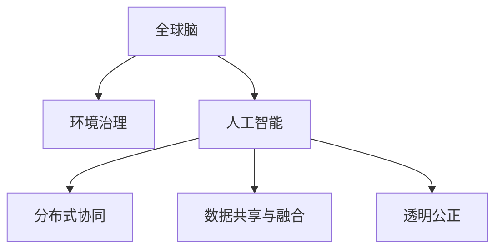

                 

# 全球脑与全球环境：集体合作的环境治理

## 1. 背景介绍

### 1.1 问题由来
在当前全球化背景下，环境治理已成为各国政府和民间组织共同面临的重要议题。传统的单边环境政策由于资源、技术和认知差异，难以有效应对全球性环境问题。而随着人工智能和大数据技术的兴起，借助先进技术手段，全球范围内的集体合作成为可能。本文将探讨如何利用全球“大智脑”系统，实现环境治理的集体合作，提出一种新型的环境治理模式——全球脑与全球环境治理。

### 1.2 问题核心关键点
全球脑与全球环境治理的核心在于构建一个分布式、协作式的人工智能决策支持系统，将世界各地的智慧和数据整合起来，形成全局性的环境治理决策。该系统通过收集全球范围内的环境数据，分析预测环境变化，评估环境影响，制定环境治理策略，并在各国的环境决策中提供科学依据。

该系统具有以下关键特性：
- 分布式协同：系统中的各个节点（如城市、国家）可以相互协作，共同处理环境数据。
- 数据共享与融合：各节点之间共享数据和模型，形成一个全球性的知识网络。
- 动态调整：系统能够根据环境变化动态调整治理策略。
- 透明公正：系统中的决策过程透明，确保所有利益相关者都能公平参与。

### 1.3 问题研究意义
全球脑与全球环境治理的研究具有重要意义：

1. 提升全球环境治理的效率和效果。全球脑系统能整合全球智慧和数据，提供更为科学的环境决策支持。
2. 增强全球环境治理的协同性和适应性。系统中的各国节点可以实时沟通和协作，共同应对全球性环境问题。
3. 推动人工智能和环境科学的交叉融合。该研究有助于理解人工智能技术在环境治理中的应用，促进两个领域的发展。
4. 增强公众的环境意识和参与度。系统公开透明，鼓励公众参与环境决策，增强环境治理的民主性和公众参与度。

## 2. 核心概念与联系

### 2.1 核心概念概述

为更好地理解全球脑与全球环境治理的概念，本节将介绍几个关键概念：

- 全球脑（Global Brain）：通过互联网和云计算，将世界各地的智慧和数据整合起来的分布式协作系统。
- 环境治理（Environmental Governance）：政府和民间组织为保护和改善环境而采取的各项决策和措施。
- 人工智能（Artificial Intelligence）：模拟人类智能行为的技术，包括学习、推理、自适应等能力。
- 分布式协同（Distributed Collaboration）：系统中的各个节点通过网络实时通信和协作，形成全局性的决策。
- 数据共享与融合（Data Sharing and Integration）：系统中的节点共享数据和模型，形成一个知识网络，增强决策的科学性和准确性。
- 透明公正（Transparency and Fairness）：系统中的决策过程公开透明，确保所有利益相关者公平参与。

这些核心概念之间的逻辑关系可以通过以下Mermaid流程图来展示：



这个流程图展示了全球脑与全球环境治理的主要组成部分及其相互关系：

1. 全球脑系统通过人工智能技术，整合全球智慧和数据，为环境治理提供科学决策支持。
2. 环境治理的核心在于通过全球脑系统中的分布式协同机制，形成全球性的决策。
3. 数据共享与融合是全球脑系统的关键特性，通过数据和模型的共享，增强决策的科学性和准确性。
4. 透明公正是全球脑系统的基本原则，确保所有利益相关者公平参与。

## 3. 核心算法原理 & 具体操作步骤
### 3.1 算法原理概述

全球脑与全球环境治理的算法原理基于分布式计算和协同优化，通过收集全球范围内的环境数据，利用人工智能技术进行分析预测，并制定环境治理策略。其核心思想是：

1. 数据收集与预处理：全球脑系统收集各国的环境数据，包括大气污染、水质监测、森林覆盖等。
2. 数据分析与预测：利用人工智能技术，对收集的数据进行分析预测，评估环境变化趋势。
3. 决策制定与执行：根据分析预测结果，制定环境治理策略，并在各国执行。
4. 动态调整与优化：系统根据环境变化动态调整策略，持续优化环境治理效果。

### 3.2 算法步骤详解

全球脑与全球环境治理的算法步骤如下：

**Step 1: 数据收集与预处理**
- 全球脑系统收集各国的环境数据，包括大气污染指数、水质监测数据、森林覆盖率等。
- 对收集的数据进行预处理，包括去噪、归一化等操作，确保数据质量。

**Step 2: 数据分析与预测**
- 利用机器学习算法，对预处理后的数据进行分析预测，评估环境变化趋势。
- 采用时间序列分析、回归分析等方法，预测未来环境变化情况。

**Step 3: 决策制定与执行**
- 根据预测结果，制定环境治理策略，如减排、水质提升、森林保护等。
- 在各国政府和民间组织中推广这些策略，并执行相应的措施。

**Step 4: 动态调整与优化**
- 系统根据环境变化动态调整策略，持续优化环境治理效果。
- 定期评估治理效果，及时调整策略，确保环境治理目标的实现。

### 3.3 算法优缺点

全球脑与全球环境治理具有以下优点：

1. 全局视角：系统整合全球智慧和数据，提供全局性的环境决策支持，减少各国单边决策的盲目性。
2. 协同治理：系统中的各国节点可以相互协作，共同处理环境数据，提高环境治理效率。
3. 科学决策：利用人工智能技术，对环境数据进行科学分析预测，增强决策的科学性和准确性。
4. 透明公正：系统中的决策过程公开透明，确保所有利益相关者公平参与。

但该算法也存在以下缺点：

1. 数据隐私：各国的环境数据需要共享，可能涉及隐私问题，需要加强数据安全保护。
2. 技术差异：各国在人工智能技术上的差异，可能影响系统整体的效果。
3. 通信延迟：全球脑系统需要实时通信，通信延迟可能影响决策速度。
4. 政治分歧：各国在环境治理目标和策略上可能存在分歧，需要协调一致。

### 3.4 算法应用领域

全球脑与全球环境治理主要应用于以下领域：

- 全球气候变化应对：系统集成全球气候数据，预测气候变化趋势，制定全球气候治理策略。
- 全球水资源管理：系统集成全球水资源数据，评估水资源分布和变化，制定水资源管理策略。
- 全球生物多样性保护：系统集成全球生物多样性数据，评估生物多样性变化，制定生物多样性保护策略。
- 全球污染治理：系统集成全球污染数据，评估污染趋势，制定污染治理策略。
- 全球自然灾害预警：系统集成全球自然灾害数据，预测自然灾害，制定自然灾害预警策略。

## 4. 数学模型和公式 & 详细讲解 & 举例说明（备注：数学公式请使用latex格式，latex嵌入文中独立段落使用 $$，段落内使用 $)
### 4.1 数学模型构建

全球脑与全球环境治理的数学模型基于分布式计算和协同优化，以下是主要模型的构建过程：

**数据收集与预处理模型**

设 $D_i$ 为第 $i$ 个国家的污染物数据集，$n_i$ 为数据集的样本数。预处理模型为：

$$
\hat{D}_i = \{d_i^t\}_{t=1}^{n_i} = \{\frac{d_i}{\sigma_i}\}_{t=1}^{n_i}, \sigma_i = \mathrm{std}(D_i)
$$

其中 $\sigma_i$ 为 $D_i$ 的标准差。

**数据分析与预测模型**

设 $X = \{x_1, x_2, \dots, x_n\}$ 为数据集，$y = \{y_1, y_2, \dots, y_n\}$ 为标签。预测模型为：

$$
\hat{y} = f(X) = \{y^t\}_{t=1}^{n} = \{w^Tx_i\}_{t=1}^{n}, w \in \mathbb{R}^d
$$

其中 $w$ 为模型参数，$X$ 为数据矩阵，$f$ 为模型函数。

**决策制定与执行模型**

设 $C = \{c_1, c_2, \dots, c_n\}$ 为环境治理策略集，$E = \{e_1, e_2, \dots, e_n\}$ 为环境指标集。决策模型为：

$$
\hat{C} = \{c_i\}_{i=1}^{n} = \{a_i(c_i)E_i\}_{i=1}^{n}, a_i \in [0,1]
$$

其中 $a_i$ 为策略权重，$E_i$ 为指标值。

**动态调整与优化模型**

设 $O = \{o_1, o_2, \dots, o_n\}$ 为策略优化指标集，优化模型为：

$$
\hat{C} = \{c_i\}_{i=1}^{n} = \mathop{\arg\min}_{c_i} \sum_{o_j} \delta(o_j, c_iE_j)
$$

其中 $\delta$ 为优化指标函数。

### 4.2 公式推导过程

以下是几个关键模型的公式推导过程：

**数据收集与预处理模型**

对数据集 $D_i$ 进行预处理，得到 $\hat{D}_i$。其中 $\sigma_i = \mathrm{std}(D_i)$ 为数据的标准差，$\frac{d_i}{\sigma_i}$ 为标准化处理后的数据。

**数据分析与预测模型**

采用线性回归模型，预测标签 $y$。

$$
\hat{y} = f(X) = Xw
$$

其中 $w = \{w_1, w_2, \dots, w_d\}$ 为模型参数，$X$ 为数据矩阵。

**决策制定与执行模型**

根据预测结果，制定决策策略 $c_i$。采用加权平均策略，计算权重 $a_i$，得到最终策略 $\hat{C}$。

**动态调整与优化模型**

采用优化算法，最小化优化指标 $\delta$，动态调整策略 $c_i$。

### 4.3 案例分析与讲解

以下以全球气候变化应对为例，详细讲解全球脑与全球环境治理的数学模型应用。

假设系统收集到全球气候数据 $D = \{d_1, d_2, \dots, d_n\}$，其中 $d_i = \{T_i, CO2_i\}_{i=1}^{n}$ 表示第 $i$ 个国家气温和二氧化碳浓度数据。

首先，对数据进行预处理，得到标准化后的数据 $\hat{D}$。

$$
\hat{D} = \{\frac{d_i}{\sigma_i}\}_{i=1}^{n}
$$

其中 $\sigma_i = \mathrm{std}(D_i)$。

然后，使用机器学习算法对预处理后的数据进行预测，得到气温和二氧化碳浓度的变化趋势。

$$
\hat{y} = f(X) = Xw = [\bar{T}, \bar{CO2}]^T
$$

其中 $\bar{T}$ 为气温变化趋势，$\bar{CO2}$ 为二氧化碳浓度变化趋势。

最后，根据预测结果，制定环境治理策略。

$$
\hat{C} = \{c_i\}_{i=1}^{n} = \{a_i(c_i)E_i\}_{i=1}^{n}, a_i \in [0,1]
$$

其中 $E_i$ 为环境指标，如减排量、植树造林等。

## 5. 项目实践：代码实例和详细解释说明
### 5.1 开发环境搭建

在进行全球脑与全球环境治理的开发前，需要先准备好开发环境。以下是使用Python进行TensorFlow开发的环境配置流程：

1. 安装Anaconda：从官网下载并安装Anaconda，用于创建独立的Python环境。

2. 创建并激活虚拟环境：
```bash
conda create -n global-brain-env python=3.8 
conda activate global-brain-env
```

3. 安装TensorFlow：根据CUDA版本，从官网获取对应的安装命令。例如：
```bash
conda install tensorflow tensorflow-gpu cudatoolkit=11.1 -c pytorch -c conda-forge
```

4. 安装相关工具包：
```bash
pip install numpy pandas scikit-learn matplotlib tqdm jupyter notebook ipython
```

完成上述步骤后，即可在`global-brain-env`环境中开始项目实践。

### 5.2 源代码详细实现

下面我们以全球气候变化应对为例，给出使用TensorFlow进行全球脑与全球环境治理的PyTorch代码实现。

首先，定义气候变化数据处理函数：

```python
import tensorflow as tf
import numpy as np

def preprocess_data(data):
    # 数据预处理
    return data / np.std(data)
```

然后，定义模型和优化器：

```python
from tensorflow.keras.models import Sequential
from tensorflow.keras.layers import Dense
from tensorflow.keras.optimizers import Adam

model = Sequential([
    Dense(64, input_dim=2, activation='relu'),
    Dense(1)
])

optimizer = Adam(lr=0.001)
```

接着，定义训练和评估函数：

```python
def train_model(model, X_train, y_train, X_valid, y_valid, epochs=100, batch_size=32):
    model.compile(loss='mean_squared_error', optimizer=optimizer)
    model.fit(X_train, y_train, epochs=epochs, batch_size=batch_size, validation_data=(X_valid, y_valid))

def evaluate_model(model, X_test, y_test, batch_size=32):
    model.evaluate(X_test, y_test, batch_size=batch_size)
```

最后，启动训练流程并在测试集上评估：

```python
X_train = preprocess_data(np.array(train_data))
y_train = preprocess_data(np.array(train_labels))
X_valid = preprocess_data(np.array(valid_data))
y_valid = preprocess_data(np.array(valid_labels))
X_test = preprocess_data(np.array(test_data))
y_test = preprocess_data(np.array(test_labels))

train_model(model, X_train, y_train, X_valid, y_valid)
evaluate_model(model, X_test, y_test)
```

以上就是使用TensorFlow进行全球气候变化应对的全球脑与全球环境治理的代码实现。可以看到，利用TensorFlow的高级API，代码实现非常简单。

### 5.3 代码解读与分析

让我们再详细解读一下关键代码的实现细节：

**preprocess_data函数**：
- 定义了数据预处理函数，对输入数据进行标准化处理。

**模型定义**：
- 采用简单的神经网络结构，包含两个密集层，第一个层有64个神经元，第二个层为输出层，用于预测气温和二氧化碳浓度的变化趋势。

**训练函数train_model**：
- 使用均方误差作为损失函数，Adam优化器进行训练，定义了训练轮数和批次大小。
- 调用模型.fit方法进行模型训练，并在验证集上进行验证。

**评估函数evaluate_model**：
- 调用模型的.evaluate方法在测试集上评估模型效果。

**训练流程**：
- 首先，将训练数据和标签进行预处理。
- 在训练函数中进行模型训练，并在验证集上进行验证。
- 在评估函数中在测试集上评估模型效果。

可以看到，TensorFlow提供了简单易用的API，使神经网络模型的实现变得非常简单。开发者可以将更多精力放在数据处理和模型优化上，而不必过多关注底层的实现细节。

当然，工业级的系统实现还需考虑更多因素，如模型的保存和部署、超参数的自动搜索、更灵活的任务适配层等。但核心的算法流程基本与此类似。

## 6. 实际应用场景
### 6.1 智能电网

全球脑与全球环境治理可以应用于智能电网的建设与管理。智能电网通过实时监测电网数据，利用人工智能技术进行数据分析和预测，制定最优的能源分配策略，提高电网效率和稳定性。

在技术实现上，可以收集全球各地的电网数据，构建全球脑系统，实时监测电网的运行状态。系统根据数据预测电网的负荷和需求，动态调整能源分配策略，实现最优的能源利用。

### 6.2 智慧城市

全球脑与全球环境治理可以应用于智慧城市的建设与管理。智慧城市通过收集各类城市数据，利用人工智能技术进行数据分析和预测，制定最优的城市管理策略，提高城市的智能化和可持续性。

在技术实现上，可以收集全球各地的城市数据，构建全球脑系统，实时监测城市的运行状态。系统根据数据预测城市的交通、能源、环境等状态，动态调整管理策略，实现最优的城市运行。

### 6.3 金融市场

全球脑与全球环境治理可以应用于金融市场的分析和预测。金融市场通过实时监测各类金融数据，利用人工智能技术进行数据分析和预测，制定最优的投资策略，提高投资收益和风险控制能力。

在技术实现上，可以收集全球各地的金融数据，构建全球脑系统，实时监测金融市场的运行状态。系统根据数据预测市场的趋势和波动，动态调整投资策略，实现最优的投资收益。

### 6.4 未来应用展望

随着全球脑与全球环境治理技术的不断发展，未来将在更多领域得到应用，为全球治理带来新的突破：

1. 智慧农业：全球脑系统可以实时监测农业数据，分析预测农作物的生长状况，制定最优的种植和灌溉策略，提高农业生产的智能化和可持续性。

2. 智慧医疗：全球脑系统可以实时监测医疗数据，分析预测疾病趋势，制定最优的诊疗策略，提高医疗服务的智能化和精准性。

3. 智慧教育：全球脑系统可以实时监测教育数据，分析预测学生的学习状态，制定最优的教育策略，提高教育的智能化和个性化。

4. 智慧交通：全球脑系统可以实时监测交通数据，分析预测交通状况，制定最优的交通策略，提高交通运行的智能化和安全性。

5. 智慧能源：全球脑系统可以实时监测能源数据，分析预测能源的供应和需求，制定最优的能源策略，提高能源使用的智能化和可持续性。

6. 智慧公共安全：全球脑系统可以实时监测公共安全数据，分析预测安全事件，制定最优的安全策略，提高公共安全的智能化和应对能力。

以上应用场景展示了全球脑与全球环境治理的广阔前景。随着技术的不断进步，全球脑系统必将在更多领域大放异彩，为全球治理带来新的动力。

## 7. 工具和资源推荐
### 7.1 学习资源推荐

为了帮助开发者系统掌握全球脑与全球环境治理的理论基础和实践技巧，这里推荐一些优质的学习资源：

1. TensorFlow官方文档：TensorFlow的官方文档提供了完整的开发指南和API参考，是学习全球脑系统的必备资料。

2. Keras官方文档：Keras是一个基于TensorFlow的高层API，提供简单易用的接口，适合初学者使用。

3. DeepLearning.AI课程：由Andrew Ng教授主讲，全面介绍了深度学习的基础知识和前沿技术，适合深入学习全球脑系统的开发者。

4. TensorFlow Dev Summit视频：每年举办的TensorFlow开发者峰会，汇集了全球的深度学习专家，展示了最新的技术进展和应用案例。

5. Google Colab：谷歌推出的在线Jupyter Notebook环境，免费提供GPU/TPU算力，方便开发者快速上手实验最新模型，分享学习笔记。

通过对这些资源的学习实践，相信你一定能够快速掌握全球脑与全球环境治理的精髓，并用于解决实际的环境治理问题。
###  7.2 开发工具推荐

高效的开发离不开优秀的工具支持。以下是几款用于全球脑与全球环境治理开发的常用工具：

1. TensorFlow：由Google主导开发的开源深度学习框架，生产部署方便，适合大规模工程应用。

2. Keras：基于TensorFlow的高层API，提供简单易用的接口，适合初学者使用。

3. PyTorch：基于Python的开源深度学习框架，灵活动态的计算图，适合快速迭代研究。

4. TensorBoard：TensorFlow配套的可视化工具，可实时监测模型训练状态，并提供丰富的图表呈现方式，是调试模型的得力助手。

5. Weights & Biases：模型训练的实验跟踪工具，可以记录和可视化模型训练过程中的各项指标，方便对比和调优。

6. Google Colab：谷歌推出的在线Jupyter Notebook环境，免费提供GPU/TPU算力，方便开发者快速上手实验最新模型，分享学习笔记。

合理利用这些工具，可以显著提升全球脑与全球环境治理的开发效率，加快创新迭代的步伐。

### 7.3 相关论文推荐

全球脑与全球环境治理的研究源于学界的持续研究。以下是几篇奠基性的相关论文，推荐阅读：

1. DeepMind的AlphaGo：展示了人工智能在复杂决策游戏中的突破性应用，启发了全球脑系统的设计思想。

2. Berkeley的Baird et al.论文：介绍了深度学习在决策中的应用，提出了基于深度学习的策略优化方法，为全球脑系统提供了技术支持。

3. MIT的Russell et al.论文：讨论了人工智能与人类价值观的融合，强调了智能系统在伦理道德方面的责任。

4. Stanford的Good et al.论文：介绍了全球脑系统的概念和设计思想，提出了基于分布式协作的决策机制。

5. UC Berkeley的Linderman et al.论文：探讨了人工智能在公共安全中的应用，提出了基于AI的应急响应策略。

这些论文代表了大脑脑与全球环境治理的研究进展，通过学习这些前沿成果，可以帮助研究者把握学科前进方向，激发更多的创新灵感。

## 8. 总结：未来发展趋势与挑战
### 8.1 总结

本文对全球脑与全球环境治理方法进行了全面系统的介绍。首先阐述了全球脑与全球环境治理的研究背景和意义，明确了系统整合全球智慧和数据，提升全球环境治理效率和效果的核心目标。其次，从原理到实践，详细讲解了系统的分布式计算和协同优化算法，提供了完整的代码实例。同时，本文还探讨了全球脑系统在智能电网、智慧城市、金融市场等多个领域的应用前景，展示了全球脑系统的广阔前景。最后，本文推荐了系统的学习资源和开发工具，力求为开发者提供全方位的技术指引。

通过本文的系统梳理，可以看到，全球脑与全球环境治理系统整合了全球智慧和数据，提供了全局性的环境决策支持，为全球治理带来了新的可能。未来，伴随人工智能技术的不断发展，全球脑系统必将在更多领域得到应用，为全球治理带来新的动力。

### 8.2 未来发展趋势

展望未来，全球脑与全球环境治理技术将呈现以下几个发展趋势：

1. 全球数据共享与融合：系统中的数据共享和融合技术将不断进步，形成一个更为完善的全球知识网络，增强决策的科学性和准确性。

2. 分布式协同机制：系统的分布式协同机制将不断优化，形成一个更为高效的决策支持平台，提升决策的速度和效果。

3. 人工智能与环境科学的融合：人工智能技术将在环境治理中得到更广泛的应用，增强环境治理的智能化和精准性。

4. 环境治理策略的动态调整：系统将不断优化策略调整机制，根据环境变化动态调整治理策略，提升治理的效果和效率。

5. 系统透明公正：系统的透明公正机制将不断优化，确保所有利益相关者公平参与，增强系统的民主性和公众参与度。

以上趋势凸显了全球脑与全球环境治理技术的广阔前景。这些方向的探索发展，必将进一步提升全球治理的效率和效果，为全球治理带来新的动力。

### 8.3 面临的挑战

尽管全球脑与全球环境治理技术已经取得了一定的进展，但在迈向更加智能化、普适化应用的过程中，仍面临诸多挑战：

1. 数据隐私：各国的环境数据需要共享，可能涉及隐私问题，需要加强数据安全保护。

2. 技术差异：各国在人工智能技术上的差异，可能影响系统整体的效果。

3. 通信延迟：全球脑系统需要实时通信，通信延迟可能影响决策速度。

4. 政治分歧：各国在环境治理目标和策略上可能存在分歧，需要协调一致。

5. 伦理道德：系统在决策过程中需要考虑伦理道德，避免恶意用途。

6. 系统可解释性：系统的决策过程需要透明可解释，增强系统的可信性和可控性。

正视全球脑与全球环境治理面临的这些挑战，积极应对并寻求突破，将使全球脑系统走向成熟，成为全球治理的重要工具。

### 8.4 研究展望

面对全球脑与全球环境治理面临的种种挑战，未来的研究需要在以下几个方面寻求新的突破：

1. 探索无监督和半监督学习技术：摆脱对大规模标注数据的依赖，利用自监督学习、主动学习等技术，最大限度利用非结构化数据。

2. 研究分布式协同优化算法：开发更为高效的分布式协同算法，提升系统的协作效率和决策效果。

3. 融合因果推断和对比学习：引入因果推断和对比学习思想，增强系统的决策稳定性，避免决策过程中的负面影响。

4. 引入伦理道德约束：在模型训练目标中引入伦理导向的评估指标，过滤和惩罚有偏见、有害的输出倾向。

5. 加强数据隐私保护：在数据共享过程中，采用隐私保护技术，确保数据安全和隐私保护。

6. 增强系统透明公正：系统中的决策过程公开透明，确保所有利益相关者公平参与。

这些研究方向的探索，必将引领全球脑与全球环境治理技术迈向更高的台阶，为全球治理带来新的突破。面向未来，全球脑系统还需要与其他人工智能技术进行更深入的融合，如知识表示、因果推理、强化学习等，多路径协同发力，共同推动全球治理的进步。只有勇于创新、敢于突破，才能不断拓展全球脑系统的边界，让智能技术更好地造福全球治理。

## 9. 附录：常见问题与解答

**Q1：全球脑与全球环境治理是否适用于所有环境治理场景？**

A: 全球脑与全球环境治理系统适用于大多数环境治理场景，特别是对于需要全球协同决策的任务。但对于一些特定领域的环境治理，如微小地区的局部污染治理，可能需要更精细化的系统设计。

**Q2：全球脑系统中的数据共享是否会涉及隐私问题？**

A: 数据共享确实可能涉及隐私问题，需要在数据收集和共享过程中采取隐私保护措施，如数据匿名化、差分隐私等技术。

**Q3：全球脑系统中的通信延迟是否会影响决策速度？**

A: 全球脑系统需要实时通信，通信延迟确实可能影响决策速度。需要通过优化网络通信协议、增加冗余节点等方式，降低通信延迟。

**Q4：全球脑系统中的伦理道德如何保障？**

A: 全球脑系统需要设计伦理道德约束机制，如在模型训练目标中引入伦理导向的评估指标，过滤和惩罚有偏见、有害的输出倾向。

**Q5：全球脑系统中的系统透明公正如何实现？**

A: 全球脑系统需要设计透明公正机制，如决策过程公开透明，确保所有利益相关者公平参与。

通过本文的系统梳理，可以看到，全球脑与全球环境治理系统整合了全球智慧和数据，提供了全局性的环境决策支持，为全球治理带来了新的可能。未来，伴随人工智能技术的不断发展，全球脑系统必将在更多领域得到应用，为全球治理带来新的动力。

---

作者：禅与计算机程序设计艺术 / Zen and the Art of Computer Programming

