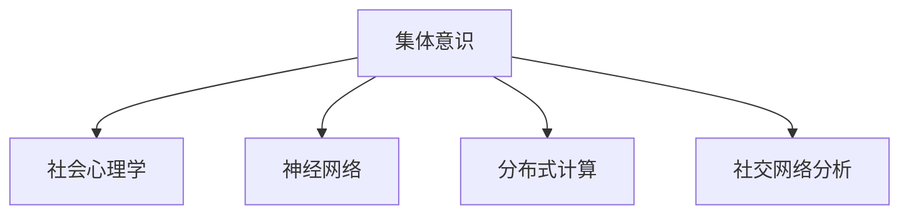

                 

# 全球脑与心灵探索：集体意识状态的研究

## 1. 背景介绍

### 1.1 问题由来

现代心理学研究证明了集体意识（Collective Consciousness）的存在。集体意识是社会心理学中的一个重要概念，它指的是一群人在共同经历或共享信念、价值、文化、信仰等时所形成的共同心理状态。这种心理状态可以在不同层次上体现，从小至一个家庭或团队，大到整个人类社会。

### 1.2 问题核心关键点

集体意识状态的研究涉及多个领域，包括但不限于社会学、心理学、神经科学和计算机科学。心理学和神经科学研究个体心理和神经活动，而集体意识研究则聚焦于个体间的互动和影响。计算机科学作为工具，帮助构建和分析模型，模拟集体意识状态并探讨其特性。

### 1.3 问题研究意义

集体意识状态的研究对于理解社会行为、增强社会协作、优化决策过程以及构建更加和谐的社会环境具有重要意义。通过深入研究，我们可以更深刻地理解群体行为背后的心理机制，并为社会治理、团队管理和个体心理健康提供理论支持。此外，对集体意识状态的模拟和预测，有助于我们更好地应对全球化、多元文化等现代社会现象，提升社会整体福祉。

## 2. 核心概念与联系

### 2.1 核心概念概述

为更好地理解集体意识状态的研究，本节将介绍几个密切相关的核心概念：

- **集体意识（Collective Consciousness）**：指群体共同拥有的心理状态，包括共享信念、价值观、文化背景等。
- **社会心理学（Social Psychology）**：研究个体与群体间的心理互动，理解社会行为和人际关系。
- **神经网络（Neural Network）**：一种计算模型，模拟人脑神经元间的连接关系，用于处理复杂的数据和模式。
- **分布式计算（Distributed Computing）**：一种计算范式，通过多个计算机协同工作，解决复杂问题。
- **社交网络分析（Social Network Analysis）**：分析个体间的关系和互动模式，揭示集体意识的形成和演化。

这些核心概念之间的逻辑关系可以通过以下Mermaid流程图来展示：



这个流程图展示了一群人形成集体意识的不同途径，以及这些概念之间的相互关系。

## 3. 核心算法原理 & 具体操作步骤

### 3.1 算法原理概述

集体意识状态的研究，主要采用以下方法：

- **神经网络模拟**：构建神经网络模型，通过学习个体间的互动数据，模拟集体意识的形成和演化。
- **分布式计算**：利用分布式计算框架，处理大规模社交网络数据，实现高效的社会动态模拟。
- **社交网络分析**：使用图结构分析个体间的关系和互动模式，揭示集体意识的形成机制。

### 3.2 算法步骤详解

#### 3.2.1 数据收集与预处理

- **社交网络数据**：收集个体间的互动数据，如社交媒体、电话通话记录、面对面交流等。
- **清洗与标准化**：去除无关数据，标准化格式，确保数据一致性。

#### 3.2.2 神经网络模型训练

- **模型选择**：选择适当的神经网络模型，如深度神经网络（DNN）、卷积神经网络（CNN）、循环神经网络（RNN）等。
- **数据划分**：将数据划分为训练集、验证集和测试集。
- **训练过程**：使用反向传播算法，通过不断迭代优化模型参数，最小化损失函数。
- **模型评估**：在测试集上评估模型性能，使用指标如准确率、召回率、F1分数等。

#### 3.2.3 分布式计算实现

- **分布式框架选择**：选择合适的分布式计算框架，如Apache Spark、Hadoop等。
- **并行处理**：将计算任务分解为多个子任务，并行执行。
- **数据分布**：将数据分布在多个计算节点上，避免单点故障。
- **结果合并**：将所有计算节点的结果汇总，形成最终结果。

#### 3.2.4 社交网络分析

- **图结构构建**：将个体间的关系表示为图结构，如无向图、有向图等。
- **关系分析**：分析个体间的关系类型（如朋友、同事、家庭等）和互动频率。
- **中心性分析**：计算个体在社交网络中的中心性（如度中心性、接近中心性等），识别关键个体。
- **动态分析**：分析社交网络随时间的变化，识别群体形成和演化过程。

### 3.3 算法优缺点

#### 3.3.1 优点

- **多维度分析**：结合神经网络模拟和社交网络分析，能够从多个角度深入研究集体意识状态。
- **数据驱动**：基于大规模数据训练模型，结果具有较高的可靠性和真实性。
- **可扩展性**：分布式计算框架使得处理大规模数据成为可能，适用于复杂的社会动态模拟。

#### 3.3.2 缺点

- **复杂性高**：涉及多学科知识，模型构建和分析过程较为复杂。
- **数据隐私**：处理社交网络数据涉及隐私问题，数据获取和使用需要谨慎。
- **计算资源需求大**：神经网络模型和大规模数据处理需要强大的计算资源，成本较高。

### 3.4 算法应用领域

集体意识状态的研究在多个领域有广泛应用：

- **社会学**：研究群体行为，预测社会趋势，为政策制定提供依据。
- **市场营销**：分析消费者行为，优化产品设计和营销策略。
- **网络安全**：识别威胁行为，提升网络安全防护水平。
- **医疗健康**：研究患者和医生间的互动，提高医疗服务质量。
- **金融分析**：分析市场行为，预测股市波动，优化投资策略。
- **教育研究**：分析师生互动，提升教学效果和学习体验。

这些应用展示了集体意识状态研究的广泛影响，也凸显了其在多个领域中发挥的作用。

## 4. 数学模型和公式 & 详细讲解 & 举例说明

### 4.1 数学模型构建

集体意识状态的研究可以基于以下数学模型：

- **图结构模型**：使用图结构描述个体间的关系，通过节点和边来表示互动和依赖关系。
- **神经网络模型**：使用神经网络模拟个体间的关系和互动，通过权重和激活函数来表示交互机制。
- **社会动力学模型**：使用微分方程描述集体意识随时间的变化，通过演化算法模拟集体意识的动态过程。

### 4.2 公式推导过程

#### 4.2.1 图结构模型

使用无向图 $G=(V,E)$ 表示个体间的关系，其中 $V$ 为节点集合，$E$ 为边集合。节点 $v_i$ 代表个体 $i$，边 $e_{ij}$ 代表个体 $i$ 和个体 $j$ 之间的关系。

节点中心性度量：

- **度中心性（Degree Centrality）**：计算每个节点与其他节点的连接数。
- **接近中心性（Closeness Centrality）**：计算节点到达其他节点的平均最短路径长度。
- **介数中心性（Betweenness Centrality）**：计算节点在所有最短路径中出现的次数。

#### 4.2.2 神经网络模型

使用神经网络模型 $N=(I,H,O)$，其中 $I$ 为输入层，$H$ 为隐藏层，$O$ 为输出层。输入层表示个体间的关系和互动，隐藏层通过权重和激活函数学习关系模式，输出层表示集体意识的形成和演化。

神经网络模型训练过程：

- **损失函数**：定义损失函数 $L$，如均方误差（MSE）、交叉熵（Cross-Entropy）等。
- **反向传播**：通过反向传播算法，计算梯度并更新模型参数。
- **正则化**：使用L2正则、Dropout等技术，避免过拟合。
- **优化器**：选择适当的优化器，如Adam、SGD等，调整学习率。

#### 4.2.3 社会动力学模型

使用微分方程描述集体意识随时间的变化，如SIR模型、SEIR模型等。社会动力学模型通过演化算法模拟集体意识的动态过程，预测未来状态。

社会动力学模型推导：

- **基本方程**：定义微分方程 $dx/dt = f(x,t)$，描述集体意识的动态变化。
- **初始条件**：定义初始状态 $x_0$。
- **求解过程**：使用数值方法或解析方法求解微分方程，获得时间序列 $x(t)$。
- **结果分析**：分析集体意识的演化过程，识别关键节点和临界点。

### 4.3 案例分析与讲解

#### 4.3.1 社交媒体分析

社交媒体数据可以用于研究个体间的互动模式和集体意识状态。使用图结构模型，将社交媒体用户表示为节点，点赞、评论、分享等互动表示为边。通过分析节点中心性，可以识别社交媒体上的关键影响者。

案例分析：

- **数据获取**：从Twitter、Facebook等社交媒体平台获取用户互动数据。
- **数据预处理**：清洗无效数据，去除噪声和异常值。
- **图结构构建**：将用户和互动数据表示为图结构。
- **中心性分析**：计算节点中心性，识别关键影响者。
- **结果展示**：可视化关键影响者及其互动网络，分析集体意识形成机制。

#### 4.3.2 网络安全分析

网络安全研究中，个体间的互动和威胁行为需要通过社交网络分析来识别。使用图结构模型，将网络攻击者表示为节点，攻击行为表示为边。通过分析节点中心性和介数中心性，可以识别威胁关键节点。

案例分析：

- **数据获取**：从网络日志、入侵检测系统等获取威胁行为数据。
- **数据预处理**：清洗无效数据，去除噪声和异常值。
- **图结构构建**：将威胁行为数据表示为图结构。
- **中心性分析**：计算节点中心性和介数中心性，识别威胁关键节点。
- **结果展示**：可视化威胁关键节点及其互动网络，分析威胁行为传播路径。

## 5. 项目实践：代码实例和详细解释说明

### 5.1 开发环境搭建

在进行集体意识状态的研究前，我们需要准备好开发环境。以下是使用Python进行Python环境配置的步骤：

1. **安装Python**：从官网下载并安装Python，确保版本为3.8或以上。
2. **创建虚拟环境**：使用`virtualenv`工具创建虚拟环境，避免与其他项目冲突。
3. **安装必要的库**：安装所需的Python库，如Numpy、Pandas、Scikit-learn、Matplotlib等。
4. **配置环境变量**：确保Python环境配置正确，可在当前项目中直接运行。

### 5.2 源代码详细实现

以下是一个简单的社交网络分析代码示例，用于计算节点中心性：

```python
import networkx as nx
import matplotlib.pyplot as plt

# 构建社交网络图
G = nx.Graph()
G.add_edges_from([(1, 2), (2, 3), (3, 4), (4, 1)])

# 计算节点中心性
degree_centrality = nx.degree_centrality(G)
closeness_centrality = nx.closeness_centrality(G)
betweenness_centrality = nx.betweenness_centrality(G)

# 绘制中心性分布图
plt.bar(range(len(degree_centrality)), list(degree_centrality.values()), color='blue', label='Degree Centrality')
plt.bar(range(len(closeness_centrality)), list(closeness_centrality.values()), color='green', label='Closeness Centrality')
plt.bar(range(len(betweenness_centrality)), list(betweenness_centrality.values()), color='red', label='Betweenness Centrality')
plt.legend()
plt.show()
```

### 5.3 代码解读与分析

这段代码使用了Python的`networkx`库来构建和分析社交网络图。首先，创建一个无向图`G`，并通过`add_edges_from`方法添加节点和边。然后，使用`degree_centrality`、`closeness_centrality`和`betweenness_centrality`函数计算节点中心性，并通过`plt.bar`函数绘制中心性分布图。

代码展示了如何构建图结构、计算节点中心性以及可视化结果。在实际项目中，需要根据具体数据和需求进行调整和扩展。

## 6. 实际应用场景

### 6.1 金融风险管理

在金融领域，集体意识状态的研究可以帮助识别市场风险和预测股市波动。通过分析投资者行为和市场舆情，可以构建预测模型，及时调整投资策略，减少损失。

实际应用场景：

- **数据获取**：从金融市场、新闻网站、社交媒体等获取市场数据和舆情信息。
- **数据预处理**：清洗无效数据，去除噪声和异常值。
- **模型构建**：使用神经网络模型和社交网络分析，构建风险预测模型。
- **结果分析**：分析市场风险和波动，预测未来趋势，优化投资策略。

### 6.2 公共卫生管理

公共卫生领域中，集体意识状态的研究可以帮助预测疾病传播和优化资源分配。通过分析患者行为和社交网络数据，可以构建预测模型，提前预防和控制疫情扩散。

实际应用场景：

- **数据获取**：从医疗系统、社区卫生中心、社交媒体等获取患者行为和互动数据。
- **数据预处理**：清洗无效数据，去除噪声和异常值。
- **模型构建**：使用神经网络模型和社交网络分析，构建疾病传播预测模型。
- **结果分析**：预测疾病传播趋势，优化资源分配，提升公共卫生管理水平。

### 6.3 社交媒体舆情分析

社交媒体舆情分析是集体意识状态研究的另一个重要应用领域。通过分析用户行为和互动数据，可以识别舆情热点和情绪变化，为政府和企业提供决策支持。

实际应用场景：

- **数据获取**：从社交媒体平台获取用户行为和互动数据。
- **数据预处理**：清洗无效数据，去除噪声和异常值。
- **模型构建**：使用神经网络模型和社交网络分析，构建舆情分析模型。
- **结果分析**：识别舆情热点和情绪变化，提供决策支持，优化社会管理。

## 7. 工具和资源推荐

### 7.1 学习资源推荐

为了帮助开发者系统掌握集体意识状态的研究方法，这里推荐一些优质的学习资源：

1. **Coursera**：提供关于神经网络和分布式计算的课程，帮助开发者掌握基础知识。
2. **Kaggle**：提供大量的数据集和比赛，帮助开发者实践和提升技能。
3. **Google Scholar**：搜索最新的集体意识状态研究成果，了解前沿技术。
4. **GitHub**：寻找开源项目和代码示例，学习项目实践和算法实现。
5. **Books**：阅读《Deep Learning》、《Neural Networks and Deep Learning》等书籍，深入理解算法原理。

### 7.2 开发工具推荐

有效的开发工具可以帮助提高开发效率和研究质量。以下是几款用于集体意识状态研究的常用工具：

1. **Python**：一种灵活的编程语言，支持多种数据处理和分析库。
2. **Jupyter Notebook**：一个交互式的开发环境，便于快速编写和测试代码。
3. **PyTorch**：一种深度学习框架，支持神经网络模型构建和训练。
4. **TensorFlow**：一种分布式计算框架，支持大规模数据处理和模型训练。
5. **Matplotlib**：一个数据可视化库，帮助可视化分析结果。
6. **Pandas**：一个数据处理库，支持数据清洗和预处理。

### 7.3 相关论文推荐

集体意识状态的研究源于学界的持续探索。以下是几篇奠基性的相关论文，推荐阅读：

1. **"Social Network Analysis: Methods and Techniques for Social Researcher and Practitioners"**：John Scott，探讨社交网络分析的基本方法和应用。
2. **"Complexity: The Emerging Science at the Edge of Order and Chaos"**：Michael Mandelbrot，介绍复杂系统的基本概念和研究方法。
3. **"The Connected World: On Social Networking and Social Media"**：Zeynep Tufekci，探讨社交网络对社会行为的影响。
4. **"Predicting the Future of Online Social Networks"**：Kai E. Silberman，预测社交网络的发展趋势和未来方向。

这些论文代表了大集体意识状态研究的发展脉络，帮助开发者理解理论基础和实践方法。

## 8. 总结：未来发展趋势与挑战

### 8.1 研究成果总结

集体意识状态的研究在过去十年中取得了显著进展。通过结合神经网络模拟、分布式计算和社交网络分析，研究人员已经能够从多个角度深入理解集体意识的形成和演化过程。这些研究成果在社会学、市场营销、网络安全等多个领域中得到了广泛应用，提升了社会治理和公共管理的效率和效果。

### 8.2 未来发展趋势

未来，集体意识状态的研究将呈现以下几个发展趋势：

1. **多模态融合**：结合社交媒体、传感器数据、地理位置等多种数据源，构建更加全面的集体意识模型。
2. **实时分析**：通过分布式计算和流式处理技术，实现实时分析，提升社会动态预测的及时性和准确性。
3. **智能决策**：结合人工智能技术，如强化学习、因果推理等，构建智能决策系统，优化社会管理。
4. **伦理和安全**：研究集体意识状态的伦理和安全问题，确保数据隐私和模型透明性。
5. **跨学科融合**：结合心理学、社会学、神经科学等多学科知识，深入理解集体意识背后的心理和认知机制。

### 8.3 面临的挑战

尽管集体意识状态的研究已经取得了诸多成果，但在实践中仍然面临诸多挑战：

1. **数据隐私**：处理社交网络数据涉及隐私问题，数据获取和使用需要谨慎。
2. **计算资源**：神经网络模型和大规模数据处理需要强大的计算资源，成本较高。
3. **模型可解释性**：神经网络模型往往缺乏可解释性，难以理解其内部决策过程。
4. **泛化能力**：模型在不同场景中的泛化能力有限，可能需要大量数据进行训练。
5. **动态变化**：集体意识随时间和情境变化，如何动态调整模型成为一大难题。

### 8.4 研究展望

面对集体意识状态研究的挑战，未来的研究需要在以下几个方面寻求新的突破：

1. **隐私保护技术**：开发隐私保护技术，如差分隐私、联邦学习等，确保数据隐私和安全。
2. **高效计算框架**：研究高效的计算框架，如GPU、TPU、边缘计算等，降低计算成本。
3. **模型透明性**：研究模型的可解释性和透明性，提升模型的可信度和可接受性。
4. **跨领域应用**：将集体意识状态的研究应用于更多领域，如教育、医疗、环境等，提升社会整体福祉。
5. **动态调整机制**：开发动态调整机制，使模型能够适应变化的环境和情境，提升模型适应性和稳定性。

这些研究方向将引领集体意识状态的研究迈向新的高度，为社会治理和公共管理提供更加智能、高效的解决方案。

## 9. 附录：常见问题与解答

### Q1：集体意识状态研究中，数据隐私问题如何解决？

A：数据隐私是集体意识状态研究中的一大挑战。为保护数据隐私，可以采用以下方法：

- **差分隐私**：通过添加噪声，使得单个数据样本的隐私泄露风险极小，同时仍可进行有效的统计分析。
- **联邦学习**：将数据分布式存储在多个节点上，通过分布式算法进行模型训练，避免数据集中存储。
- **匿名化处理**：去除敏感信息，如姓名、身份证号等，仅保留数据的基本特征。

### Q2：如何提高集体意识状态研究的泛化能力？

A：提高泛化能力是研究中的一大关键问题。以下是一些可行的方法：

- **数据多样性**：收集多种类型的数据，如文本、图像、音频等，提高数据多样性。
- **迁移学习**：将模型在一种场景下的学习经验迁移到其他场景，提升泛化能力。
- **对抗训练**：通过引入对抗样本，增强模型鲁棒性，提升泛化能力。
- **模型优化**：优化模型结构，如添加正则化、调整层数等，提升泛化能力。

### Q3：集体意识状态研究的伦理和安全问题如何解决？

A：伦理和安全问题是集体意识状态研究中的一大重要考量。以下是一些可行的方法：

- **透明性**：确保模型的决策过程透明，可解释性强，便于理解和审查。
- **隐私保护**：采用隐私保护技术，如差分隐私、联邦学习等，确保数据隐私和安全。
- **伦理审查**：进行伦理审查，确保研究符合道德规范，避免滥用数据和模型。
- **社会监督**：建立社会监督机制，接受公众和专家的监督，确保研究的公正性和透明度。

### Q4：集体意识状态研究中，如何处理大规模数据？

A：处理大规模数据是集体意识状态研究中的一大挑战。以下是一些可行的方法：

- **分布式计算**：使用分布式计算框架，如Apache Spark、Hadoop等，处理大规模数据。
- **数据压缩**：使用数据压缩技术，减少数据存储和传输的资源消耗。
- **流式处理**：使用流式处理技术，实现实时数据处理，提升处理效率。

通过这些方法，可以有效地处理大规模数据，提升研究的效率和效果。

总之，集体意识状态的研究是一个多学科交叉的复杂问题，需要结合神经网络模拟、分布式计算和社交网络分析等多种技术，才能全面理解集体意识的形成和演化过程。通过不断探索和实践，我们相信未来的集体意识状态研究将取得更多的突破和成果，为社会治理和公共管理提供更加智能、高效的解决方案。

