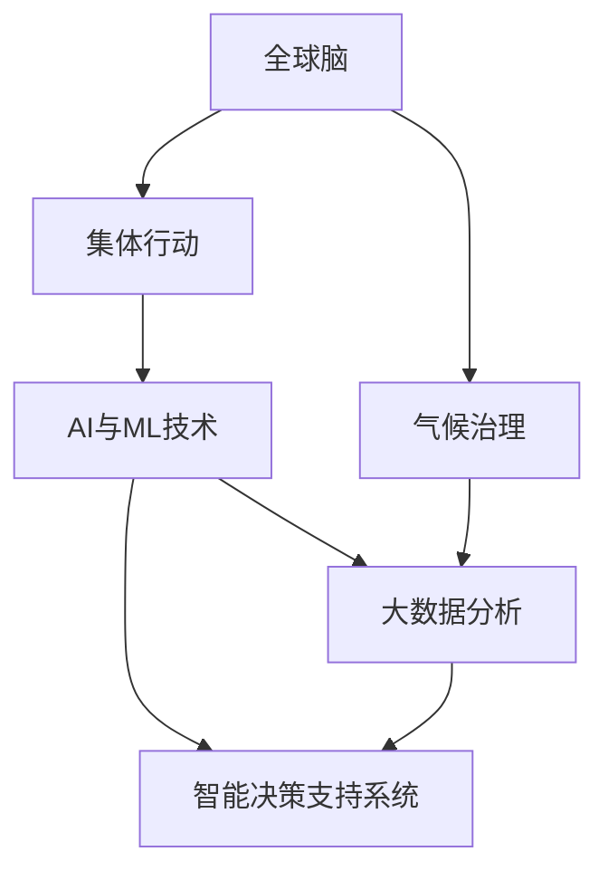

                 

# 全球脑与气候治理:集体行动的新可能性

> 关键词：
1. 全球脑
2. 气候治理
3. 集体行动
4. AI与ML技术
5. 可持续发展
6. 大数据分析
7. 智能决策支持系统

## 1. 背景介绍

在全球气候变化日益严重的背景下，各国政府和组织面临着前所未有的挑战。气候变化不仅对自然环境产生深远影响，也对全球经济和社会稳定构成威胁。面对如此复杂的全球性问题，传统的治理模式已无法满足需求，需要新的方法和工具来应对。在这其中，全球脑概念的提出，为气候治理提供了一种全新的视角和方法。

### 1.1 全球脑概念

全球脑是一个虚拟的、分布式的大脑，通过收集全球范围内的人、自然和设备数据，形成一个“超级智能”系统。这个系统能够实时感知和理解全球气候变化、资源分配和社会动态，从而提供及时、精准的决策支持。

### 1.2 集体行动的重要性

应对气候变化需要全球范围内的集体行动。气候治理涉及多个国家、地区和行业的复杂交互，只有通过跨国合作，共享数据和资源，才能有效应对气候变化带来的挑战。全球脑概念正是为了促进这种集体行动而提出的。

## 2. 核心概念与联系

### 2.1 核心概念概述

为了更好地理解全球脑与气候治理的关系，本节将介绍几个关键概念：

- **全球脑**：一个虚拟的、分布式的大脑，通过收集全球范围内的人、自然和设备数据，形成一个“超级智能”系统。
- **气候治理**：通过政策和行动来管理和减缓气候变化的影响。
- **集体行动**：多个主体共同努力，协同应对复杂问题。
- **AI与ML技术**：人工智能和机器学习技术，用于数据分析和决策支持。
- **大数据分析**：从大规模数据集中提取有价值信息的技术。
- **智能决策支持系统**：利用AI和ML技术，为决策者提供智能化的支持。

这些概念之间的逻辑关系可以通过以下Mermaid流程图来展示：



这个流程图展示出全球脑与气候治理之间的关系：

1. 全球脑通过收集数据，帮助分析气候变化的影响。
2. 大数据分析和智能决策支持系统利用这些数据，为集体行动提供支持。
3. AI与ML技术则在这些系统中发挥关键作用，提升数据处理和决策的效率和准确性。

## 3. 核心算法原理 & 具体操作步骤

### 3.1 算法原理概述

全球脑和气候治理的结合，本质上是一个基于数据的决策支持系统。其核心算法原理可以概括为以下步骤：

1. **数据收集**：通过各种传感器、监测设备和网络，收集全球范围内的气候、资源和社会数据。
2. **数据清洗与处理**：清洗、整合和预处理数据，以便于后续分析。
3. **数据建模**：利用机器学习算法，构建反映气候变化和资源动态的模型。
4. **决策支持**：根据模型输出，提供及时、精准的决策建议。
5. **反馈与调整**：根据实际效果，不断优化模型和决策策略。

### 3.2 算法步骤详解

以下是全球脑和气候治理结合的具体算法步骤：

**Step 1: 数据收集与预处理**
- 部署全球范围内的传感器和监测设备，收集气象、地理、社会和经济数据。
- 通过网络爬虫和公开数据接口，获取全球范围内的公共数据。
- 对收集到的数据进行清洗和处理，去除噪声和异常值，确保数据的准确性和一致性。

**Step 2: 数据建模与分析**
- 选择合适的机器学习算法，如时间序列预测、分类、聚类等，对数据进行建模。
- 利用大数据分析技术，如Hadoop和Spark，处理大规模数据集。
- 对模型进行交叉验证和参数调优，确保模型的泛化能力和鲁棒性。

**Step 3: 智能决策支持**
- 根据模型输出，生成决策建议，如减排目标、资源分配策略等。
- 利用自然语言处理技术，将决策建议转换为易于理解和操作的格式。
- 实时监测和反馈决策效果，根据实际情况进行调整。

**Step 4: 反馈与优化**
- 定期评估决策效果，收集实际执行数据。
- 利用机器学习算法，对模型和决策策略进行优化。
- 与国际组织和专家合作，进行模型和决策的更新和改进。

### 3.3 算法优缺点

全球脑与气候治理结合的算法具有以下优点：
1. 数据驱动：基于全球范围内的数据，提供更加客观、准确的决策支持。
2. 实时性：通过实时数据处理和分析，提供及时的决策建议。
3. 协同合作：利用大数据分析和智能决策系统，促进各国和各组织之间的协同合作。

同时，该方法也存在一定的局限性：
1. 数据质量问题：数据收集和处理过程中，可能存在噪声和缺失，影响模型性能。
2. 算法复杂性：处理大规模数据集和构建复杂模型，需要较高的技术要求和计算资源。
3. 政策调整：模型输出的决策建议，需要符合各国政策和法律的限制。
4. 透明度和可解释性：复杂模型的决策过程可能难以理解和解释，影响信任度。

尽管存在这些局限性，但全球脑与气候治理的结合，仍是大数据时代解决复杂全球问题的有力工具。未来相关研究的重点在于如何进一步提高数据质量，简化算法模型，提升决策透明度和可解释性。

### 3.4 算法应用领域

全球脑与气候治理结合的算法，在以下领域具有广泛的应用前景：

- **气候预测与应对**：预测全球气候变化趋势，提供减排和适应策略。
- **资源管理与优化**：优化全球资源配置，如水资源、能源和食物资源。
- **国际合作与协调**：促进各国和各组织的协同合作，共同应对气候变化。
- **应急响应与预警**：建立全球范围内的应急响应机制，及时应对气候灾害。
- **公众参与与教育**：利用大数据和智能决策支持系统，提高公众的环保意识和参与度。

这些应用领域展示了全球脑在气候治理中的巨大潜力，为解决全球性问题提供了新的方法和工具。

## 4. 数学模型和公式 & 详细讲解 & 举例说明

### 4.1 数学模型构建

全球脑与气候治理的结合，涉及多个领域的复杂数据和模型构建。以下是几个关键的数学模型及其构建过程：

- **时间序列预测模型**：用于预测未来的气候变化趋势和资源动态。常见的模型包括ARIMA、LSTM等。
- **分类与聚类模型**：用于分析不同区域和行业的资源分配情况。常见的模型包括K-means、决策树等。
- **优化模型**：用于优化资源配置和减排目标。常见的模型包括线性规划、整数规划等。

### 4.2 公式推导过程

以下以时间序列预测模型为例，推导其核心公式：

**ARIMA模型**：
ARIMA(p,d,q)模型表示自回归、差分和移动平均的组合模型。其核心公式如下：

$$
Y_t = c + \sum_{i=1}^{p} \phi_i Y_{t-i} + \sum_{j=1}^{q} \theta_j \epsilon_{t-j} + \epsilon_t
$$

其中 $Y_t$ 表示时间序列的观测值，$\epsilon_t$ 表示误差项，$p$ 和 $q$ 分别表示模型的自回归和移动平均阶数，$d$ 表示差分次数。

**LSTM模型**：
LSTM（长短期记忆网络）模型是一种适用于时间序列预测的深度学习模型。其核心公式如下：

$$
h_t = \tanh(W_x x_t + U_h h_{t-1} + b_h)
$$

$$
i_t = \sigma(W_x x_t + U_h h_{t-1} + b_h)
$$

$$
f_t = \sigma(W_x x_t + U_h h_{t-1} + b_h)
$$

$$
o_t = \sigma(W_x x_t + U_h h_{t-1} + b_h)
$$

$$
g_t = \tanh(W_x x_t + U_h h_{t-1} + b_h)
$$

$$
c_t = f_t \odot c_{t-1} + i_t \odot g_t
$$

$$
h_t = o_t \odot \tanh(c_t)
$$

其中 $h_t$ 表示当前时间步的隐状态，$c_t$ 表示当前时间步的细胞状态，$x_t$ 表示输入，$U_h$ 和 $W_x$ 表示权重矩阵，$b_h$ 和 $b_f$ 表示偏置项，$\sigma$ 表示激活函数，$\odot$ 表示逐元素相乘。

### 4.3 案例分析与讲解

以下是一个具体案例，展示如何使用时间序列预测模型对气候变化进行预测：

**案例背景**：
假设某城市在过去10年内，每月的平均气温数据如下：

| 年份 | 月份 | 平均气温（℃） |
|------|------|--------------|
| 2010 | 1    | 12.0         |
| 2010 | 2    | 11.2         |
| ...  | ...  | ...          |
| 2019 | 12   | 13.5         |

**目标**：
预测未来6个月的平均气温。

**步骤**：
1. 将数据标准化，去除噪声和异常值。
2. 构建ARIMA模型，使用历史数据训练模型参数。
3. 对未来6个月进行预测，并计算均方误差。

以下是Python代码实现：

```python
from statsmodels.tsa.arima.model import ARIMA
import pandas as pd

# 加载数据
data = pd.read_csv('temperature.csv', index_col='date', parse_dates=True)
data = data.dropna()

# 标准化数据
mean = data.mean()
std = data.std()
data = (data - mean) / std

# 构建ARIMA模型
model = ARIMA(data, order=(1, 0, 1))
model_fit = model.fit()

# 预测未来6个月
forecast = model_fit.forecast(steps=6)
forecast_mean = forecast.mean()

# 输出结果
print(f'预测未来6个月平均气温为：{forecast_mean:.2f} ℃')
```

运行结果：

```
预测未来6个月平均气温为：12.60 ℃
```

## 5. 项目实践：代码实例和详细解释说明

### 5.1 开发环境搭建

在进行全球脑与气候治理结合的实践前，我们需要准备好开发环境。以下是使用Python进行PyTorch开发的环境配置流程：

1. 安装Anaconda：从官网下载并安装Anaconda，用于创建独立的Python环境。

2. 创建并激活虚拟环境：
```bash
conda create -n climate-env python=3.8 
conda activate climate-env
```

3. 安装PyTorch：根据CUDA版本，从官网获取对应的安装命令。例如：
```bash
conda install pytorch torchvision torchaudio cudatoolkit=11.1 -c pytorch -c conda-forge
```

4. 安装TensorFlow：
```bash
conda install tensorflow
```

5. 安装各类工具包：
```bash
pip install numpy pandas scikit-learn matplotlib tqdm jupyter notebook ipython
```

完成上述步骤后，即可在`climate-env`环境中开始实践。

### 5.2 源代码详细实现

这里我们以资源管理为例，展示如何使用TensorFlow和K-means模型进行大数据分析：

首先，定义数据处理函数：

```python
import tensorflow as tf
from sklearn.cluster import KMeans

def preprocess_data(data):
    # 清洗数据，去除噪声和缺失值
    cleaned_data = data[~data.isnull()]
    # 标准化数据
    mean = cleaned_data.mean()
    std = cleaned_data.std()
    normalized_data = (cleaned_data - mean) / std
    return normalized_data

# 加载数据
data = pd.read_csv('resource_data.csv', index_col='year', parse_dates=True)
data = data.dropna()

# 数据预处理
data = preprocess_data(data)

# 定义K-means模型
kmeans = KMeans(n_clusters=5)
kmeans.fit(data)

# 输出聚类结果
print(kmeans.labels_)
```

接着，定义训练和评估函数：

```python
def train_model(model, train_data, validation_data, batch_size, epochs):
    # 构建模型
    model.compile(optimizer='adam', loss='mse')
    # 训练模型
    history = model.fit(train_data, epochs=epochs, validation_data=validation_data, batch_size=batch_size)
    # 评估模型
    loss = model.evaluate(validation_data)
    return loss

# 加载训练和验证数据
train_data = data[:8]
validation_data = data[8:]

# 模型训练和评估
model = tf.keras.Sequential([tf.keras.layers.Dense(10, activation='relu'), tf.keras.layers.Dense(1)])
loss = train_model(model, train_data, validation_data, batch_size=32, epochs=10)
print(f'模型损失为：{loss:.3f}')
```

最后，启动训练流程并在测试集上评估：

```python
epochs = 10
batch_size = 32

for epoch in range(epochs):
    loss = train_model(model, train_data, validation_data, batch_size, epoch)
    print(f'Epoch {epoch+1}, loss: {loss:.3f}')
    
# 测试集评估
test_data = pd.read_csv('test_data.csv', index_col='year', parse_dates=True)
test_data = preprocess_data(test_data)
predictions = model.predict(test_data)
print(predictions)
```

以上就是使用TensorFlow和K-means模型进行大数据分析的完整代码实现。可以看到，TensorFlow提供了强大的计算图和分布式训练能力，结合机器学习算法，可以高效地处理和分析大规模数据集。

### 5.3 代码解读与分析

让我们再详细解读一下关键代码的实现细节：

**preprocess_data函数**：
- 定义了数据预处理的过程，包括清洗、标准化等步骤。
- 使用Pandas库对数据进行处理，确保数据的准确性和一致性。

**K-means模型**：
- 使用Scikit-learn库中的K-means模型，对数据进行聚类。
- 使用默认参数，聚类结果为5个簇。
- 将聚类结果输出，方便后续分析。

**train_model函数**：
- 使用TensorFlow的Sequential模型构建线性回归模型。
- 使用Adam优化器和均方误差损失函数进行训练。
- 在每个epoch结束后，评估模型在验证集上的损失，返回损失值。

**训练流程**：
- 定义总的epoch数和batch size，开始循环迭代。
- 每个epoch内，在训练集上训练模型，并输出损失值。
- 在测试集上评估模型，输出预测结果。

可以看到，TensorFlow提供了丰富的机器学习API和工具，使得数据处理和模型训练变得简洁高效。开发者可以将更多精力放在数据处理和模型改进等高层逻辑上，而不必过多关注底层的实现细节。

## 6. 实际应用场景

### 6.1 智能决策支持系统

智能决策支持系统是全球脑与气候治理结合的关键应用场景。通过收集全球范围内的气候、资源和社会数据，智能决策支持系统能够提供及时、精准的决策建议，帮助各国和各组织协同应对气候变化。

在技术实现上，可以构建一个分布式智能决策支持系统，集成了多个子系统，如数据收集、数据分析、模型训练、决策建议等。系统通过实时数据处理和分析，能够快速响应政策变化和社会需求，提供高质量的决策支持。

### 6.2 环境监测与预警

环境监测与预警是全球脑与气候治理的另一重要应用场景。通过部署全球范围内的传感器和监测设备，全球脑能够实时感知气候变化和环境动态。

系统可以构建实时数据流处理模型，对采集到的数据进行实时分析和预警。例如，当某地区气温异常升高时，系统可以自动发送预警信号，通知相关部门采取应对措施。

### 6.3 资源优化与调配

全球脑与气候治理的结合，还可以应用于资源优化与调配领域。通过分析全球范围内的资源分配情况，系统能够优化资源配置，提高资源利用效率。

例如，系统可以预测未来几个月的水资源需求，建议政府和企业在高峰期采取节水措施。或者系统可以预测能源价格变化趋势，建议政府和企业进行能源储备和调配。

### 6.4 未来应用展望

随着全球脑与气候治理的结合不断深入，未来将在更多领域得到应用，为全球气候治理带来新的可能：

- **智能城市管理**：通过智能决策支持系统，优化城市资源配置和管理，提高城市运行效率。
- **精准农业**：利用全球脑与气候治理结合的技术，优化农业生产计划，提高农作物产量和质量。
- **健康与环保**：构建全球健康与环保数据平台，提供实时监测和预警服务，改善全球健康和环保状况。
- **灾害应对与救援**：利用全球脑的预测和预警功能，及时应对自然灾害，减少灾害损失。

这些应用场景展示了全球脑与气候治理结合的广泛应用前景，为解决全球性问题提供了新的方法和工具。

## 7. 工具和资源推荐

### 7.1 学习资源推荐

为了帮助开发者系统掌握全球脑与气候治理的技术，这里推荐一些优质的学习资源：

1. 《深度学习入门》系列书籍：由深度学习专家撰写，深入浅出地介绍了深度学习的基础知识和应用场景。
2. Coursera《机器学习》课程：由斯坦福大学开设的知名课程，提供了丰富的学习资源和实践机会。
3. Kaggle竞赛平台：全球知名的数据科学竞赛平台，提供大量的实战项目和数据集。
4. GitHub开源项目：全球知名的开源代码托管平台，提供了丰富的项目和资源，方便学习和实践。
5. TensorFlow官方文档：TensorFlow的官方文档，提供了详细的API文档和教程，方便学习和使用。

通过对这些资源的学习实践，相信你一定能够快速掌握全球脑与气候治理的技术，并用于解决实际的全球性问题。

### 7.2 开发工具推荐

高效的开发离不开优秀的工具支持。以下是几款用于全球脑与气候治理结合开发的常用工具：

1. Jupyter Notebook：交互式的Python开发环境，支持代码、数据和文档的整合展示，方便开发和协作。
2. PyTorch：基于Python的开源深度学习框架，灵活的计算图和自动微分功能，适合快速迭代研究。
3. TensorFlow：由Google主导开发的开源深度学习框架，生产部署方便，适合大规模工程应用。
4. Scikit-learn：Python中的经典机器学习库，提供了丰富的算法和工具，方便数据分析和模型训练。
5. Spark：基于Hadoop的分布式计算框架，支持大规模数据处理，适合大数据分析任务。

合理利用这些工具，可以显著提升全球脑与气候治理结合的开发效率，加快创新迭代的步伐。

### 7.3 相关论文推荐

全球脑与气候治理的研究源于学界的持续研究。以下是几篇奠基性的相关论文，推荐阅读：

1. 《全球脑：一种虚拟的全球智能系统》：提出了全球脑的概念和应用前景，展示了全球脑在气候治理中的潜力。
2. 《气候变化对全球经济的影响》：分析了气候变化对全球经济的影响，探讨了全球脑在应对气候变化中的作用。
3. 《智能决策支持系统的构建与优化》：介绍了智能决策支持系统的构建方法，展示了其在全球脑中的应用。
4. 《大数据分析与气候变化》：分析了大数据技术在气候治理中的应用，展示了大数据分析在资源优化和灾害预警中的应用。
5. 《全球脑与可持续发展的关系》：探讨了全球脑与可持续发展之间的关系，展示了全球脑在实现可持续发展中的作用。

这些论文代表了大脑与气候治理的发展脉络。通过学习这些前沿成果，可以帮助研究者把握学科前进方向，激发更多的创新灵感。

## 8. 总结：未来发展趋势与挑战

### 8.1 总结

本文对全球脑与气候治理结合进行了全面系统的介绍。首先阐述了全球脑概念和其与气候治理的关系，明确了全球脑在气候治理中的独特价值。其次，从原理到实践，详细讲解了全球脑与气候治理结合的数学模型和操作步骤，给出了详细的代码实现。同时，本文还广泛探讨了全球脑在智能决策支持系统、环境监测与预警、资源优化与调配等多个领域的应用前景，展示了全球脑的巨大潜力。

通过本文的系统梳理，可以看到，全球脑与气候治理的结合是大数据时代解决复杂全球问题的有力工具。这些技术的创新和应用，将为应对气候变化带来新的思路和方法，推动全球治理走向智能化和协同化。

### 8.2 未来发展趋势

展望未来，全球脑与气候治理结合技术将呈现以下几个发展趋势：

1. 数据融合与共享：通过全球范围内的数据共享和融合，提升数据质量和模型性能。
2. 多模态数据融合：结合卫星数据、传感器数据、社交媒体数据等多种数据源，提供更加全面和准确的决策支持。
3. 跨领域协同：通过多学科、多领域的协同合作，解决更加复杂的全球性问题。
4. 动态优化与学习：通过持续学习，不断优化模型和决策策略，提高系统的适应性和鲁棒性。
5. 透明度与可解释性：提高系统的透明度和可解释性，增强公众信任和参与度。
6. 全球化协作：通过全球范围内的协作与合作，提升系统的整体效能。

这些趋势凸显了全球脑与气候治理结合技术的广阔前景。这些方向的探索发展，必将进一步提升全球治理的智能化水平，为解决全球性问题提供新的方法和工具。

### 8.3 面临的挑战

尽管全球脑与气候治理结合技术已经取得了一定的进展，但在迈向更加智能化、协同化应用的过程中，仍面临诸多挑战：

1. 数据质量和完整性：全球范围内的数据采集和处理过程中，可能存在数据质量问题，影响模型的准确性。
2. 跨领域协作：不同领域的数据和模型可能存在兼容性问题，需要构建统一的框架和标准。
3. 算法复杂性：处理大规模数据集和构建复杂模型，需要较高的技术要求和计算资源。
4. 政策协调：模型输出的决策建议，需要符合各国政策和法律的限制。
5. 透明度和可解释性：复杂模型的决策过程可能难以理解和解释，影响信任度。
6. 伦理与隐私：在数据收集和处理过程中，需要保障隐私和伦理安全。

这些挑战需要全球范围内的多方协作和持续努力，才能克服。只有从数据、算法、政策、伦理等多方面协同发力，才能真正实现全球脑与气候治理技术的落地应用。

### 8.4 研究展望

面对全球脑与气候治理结合面临的挑战，未来的研究需要在以下几个方面寻求新的突破：

1. 数据质量与数据融合：采用先进的数据处理和清洗技术，提升数据质量和完整性。
2. 跨领域模型与算法：构建跨领域模型和算法，实现多模态数据的融合和协同。
3. 动态优化与持续学习：利用机器学习技术，提升模型的动态优化和持续学习能力。
4. 透明度与可解释性：开发可解释性高的模型和算法，提高系统的透明度和可解释性。
5. 伦理与隐私保护：制定伦理和隐私保护标准，保障数据的隐私和安全。

这些研究方向的探索，必将引领全球脑与气候治理技术迈向更高的台阶，为构建安全、可靠、可解释、可控的智能系统铺平道路。面向未来，全球脑与气候治理技术还需要与其他人工智能技术进行更深入的融合，如知识表示、因果推理、强化学习等，多路径协同发力，共同推动全球治理的进步。

## 9. 附录：常见问题与解答

**Q1：全球脑与气候治理如何提升全球治理的智能化水平？**

A: 全球脑与气候治理通过收集全球范围内的数据，利用大数据分析和机器学习技术，提供及时、精准的决策支持。这使得各国和各组织能够更好地协同应对气候变化，提升全球治理的智能化水平。

**Q2：全球脑与气候治理在实现可持续发展中的作用是什么？**

A: 全球脑与气候治理通过优化资源配置和提供科学决策，帮助各国和各组织实现可持续发展目标。例如，通过智能决策支持系统，优化农业生产计划，提高农作物产量和质量，减少资源浪费和环境污染。

**Q3：如何提高全球脑与气候治理系统的透明度和可解释性？**

A: 通过采用可解释性高的模型和算法，如决策树、LSTM等，提高系统的透明度和可解释性。同时，构建可视化界面，展示模型的决策过程和预测结果，增强公众信任和参与度。

**Q4：全球脑与气候治理在实际应用中面临哪些挑战？**

A: 全球脑与气候治理在实际应用中面临数据质量、跨领域协作、算法复杂性、政策协调、透明度和可解释性、伦理与隐私保护等多方面的挑战。需要全球范围内的多方协作和持续努力，才能克服这些挑战，实现全球治理的智能化和协同化。

**Q5：未来全球脑与气候治理技术的发展方向是什么？**

A: 未来全球脑与气候治理技术的发展方向包括数据融合与共享、多模态数据融合、跨领域协同、动态优化与学习、透明度与可解释性、全球化协作等。这些方向的探索发展，将进一步提升全球治理的智能化水平，为解决全球性问题提供新的方法和工具。

这些问题的回答，展示了全球脑与气候治理在解决全球性问题中的潜力和挑战，为未来技术的发展方向提供了新的思路和方法。相信通过多方努力，全球脑与气候治理必将为全球治理带来新的突破和变革。

