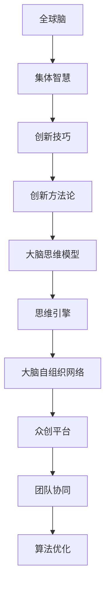

                 

# 全球脑创新方法论:集体智慧激发的创新技巧

> 关键词：全球脑,集体智慧,创新技巧,创新方法论,大脑思维模型,思维引擎,大脑自组织网络,众创平台,团队协同,算法优化

## 1. 背景介绍

### 1.1 问题由来
随着人工智能和数据科学的发展，全球脑创新方法论在现代科技产业中越来越重要。面对不断变化的市场需求和行业挑战，组织和个体如何更好地发挥集体智慧，激发创新潜力，成为摆在科技工作者面前的重要课题。全球脑创新方法论，即借鉴人类大脑的集体智慧模式，通过团队协同、算法优化等方式，激发技术创新，提供新的解决方案。本文将全面阐述全球脑创新方法论的核心概念、工作原理、具体应用，以及未来的发展趋势与挑战。

### 1.2 问题核心关键点
全球脑创新方法论的核心在于如何通过集体智慧激发创新。人类大脑是一个复杂的自组织网络，多个神经元通过突触连接，形成复杂的神经网络，共同完成认知功能。借鉴这一模式，通过团队协作、算法优化等方式，可以有效激发团队的创新潜力。

## 2. 核心概念与联系

### 2.1 核心概念概述

全球脑创新方法论涉及多个核心概念：

- **全球脑**：借鉴人类大脑的工作模式，由多个节点（团队或个体）通过信息交流，形成复杂的协同网络。
- **集体智慧**：团队中每个成员的知识、经验、技能和创意结合，共同解决问题，产生1+1>2的效果。
- **创新技巧**：指通过特定的策略、方法和工具，促进团队协作和知识共享，激发创新。
- **创新方法论**：一套系统性的方法和策略，指导团队如何高效地进行创新。
- **大脑思维模型**：借鉴人类大脑的认知结构和功能，构建的抽象模型，用于指导科技创新。
- **思维引擎**：基于先进算法和计算平台，模拟大脑的思维过程，用于辅助决策和创新。
- **大脑自组织网络**：通过动态的协同学习，自发形成的网络结构，模拟大脑的自组织学习功能。
- **众创平台**：借助互联网技术，搭建的开放平台，方便团队进行协作和交流。
- **团队协同**：通过高效的沟通和管理，使得团队成员能够协作无间，共同推进创新。
- **算法优化**：利用先进算法对团队协作和知识共享进行优化，提升创新效率。

这些核心概念通过一系列动态的协同机制，形成复杂的创新网络，以促进团队高效协作和创新。

### 2.2 核心概念原理和架构的 Mermaid 流程图



这个图表展示了各个概念之间的逻辑关系：

1. **全球脑**通过**集体智慧**实现信息交流和知识共享。
2. **集体智慧**经过**创新技巧**和**创新方法论**的指导，转化为具体的创新行动。
3. **大脑思维模型**和**思维引擎**为集体智慧提供模型和计算支持。
4. **大脑自组织网络**和**众创平台**促进团队协同，形成动态的创新网络。
5. **算法优化**通过技术手段提高团队协作和知识共享的效率。

## 3. 核心算法原理 & 具体操作步骤
### 3.1 算法原理概述

全球脑创新方法论的算法原理主要基于以下几个方面：

1. **社交网络分析**：利用社交网络分析工具，识别团队中的关键节点和强连接，形成高效的协作网络。
2. **知识图谱构建**：构建团队成员的知识图谱，方便知识共享和协作。
3. **情感分析**：分析团队成员的情感状态，确保团队在积极和开放的心态下进行创新。
4. **集体决策**：通过集体决策算法，平衡团队成员的意见，形成共识。
5. **认知神经科学**：借鉴认知神经科学的研究成果，模拟大脑的思维过程，指导创新。

### 3.2 算法步骤详解

全球脑创新方法论的算法步骤主要包括：

1. **数据收集与整理**：收集团队成员的个人背景、技能、经验等信息，进行整理和分析。
2. **社交网络构建**：使用社交网络分析工具，构建团队的社交网络图，识别关键节点和强连接。
3. **知识图谱构建**：利用知识图谱构建工具，将团队成员的知识进行结构化表示，形成知识网络。
4. **情感状态分析**：通过情感分析算法，评估团队成员的情感状态，确保积极开放的心态。
5. **集体决策支持**：利用集体决策算法，帮助团队在复杂问题上达成共识。
6. **思维引擎模拟**：使用思维引擎，模拟大脑的认知过程，辅助创新决策。

### 3.3 算法优缺点

全球脑创新方法论的优点包括：

- **协同效应**：通过团队协作，实现1+1>2的效果。
- **知识共享**：促进知识的流动和共享，提升团队的知识水平。
- **创新加速**：通过高效的算法和工具，加速创新过程。
- **开放心态**：通过情感分析，确保团队成员保持开放和积极的心态。

其缺点包括：

- **资源消耗**：算法优化和工具使用需要大量的计算资源和时间。
- **协调难度**：复杂团队的多元化协同，需要高度的协调和管理。
- **信息过载**：大规模团队的数据量可能造成信息过载，影响决策效率。
- **激励机制**：需要设计合理的激励机制，确保团队成员积极参与。

### 3.4 算法应用领域

全球脑创新方法论广泛应用于以下领域：

- **科技企业研发**：通过知识图谱和算法优化，加速产品研发和创新。
- **创意设计**：利用思维引擎和协同工具，提升设计效率和创新效果。
- **市场营销**：通过情感分析，优化市场策略，提升品牌影响力。
- **医疗健康**：借助集体智慧和算法优化，推动医疗技术和创新。
- **教育培训**：利用众创平台和团队协同，提升教学质量和培训效果。
- **政府决策**：通过集体决策算法，优化政府决策过程。

## 4. 数学模型和公式 & 详细讲解 & 举例说明（备注：数学公式请使用latex格式，latex嵌入文中独立段落使用 $$，段落内使用 $)
### 4.1 数学模型构建

全球脑创新方法论的数学模型主要基于以下几个方面：

- **社会网络分析**：通过社交网络矩阵表示团队成员之间的关系，使用中心性指标衡量关键节点。
- **知识图谱**：将知识表示为图结构，使用节点和边表示概念和关系。
- **情感分析**：使用情感词典和情感分类模型，对团队成员的情感状态进行分类。
- **集体决策**：使用贝叶斯网络和逻辑回归模型，评估团队成员的意见，形成共识。
- **认知模型**：借鉴认知神经科学的研究，构建大脑的认知模型，用于模拟思维过程。

### 4.2 公式推导过程

- **社交网络分析**：
  - 社交网络矩阵 $G$ 表示团队成员之间的连接关系。
  - 中心性指标 $C$ 衡量节点 $i$ 在网络中的重要性。
  - 中心性指标公式为：$C_i = \sum_{j=1}^n A_{ij} / \sum_{j=1}^n A_{jj}$。
  
- **知识图谱**：
  - 知识图谱 $K$ 由节点和边组成，节点表示概念，边表示概念之间的关系。
  - 节点之间的距离 $d$ 表示概念之间的相关性。
  - 距离公式为：$d_{ij} = \exp(-\alpha \cdot \text{Sim}(x_i, x_j))$，其中 $\text{Sim}$ 为相似度函数，$\alpha$ 为调节系数。
  
- **情感分析**：
  - 情感词典 $D$ 包含各个情感词汇的情感分数。
  - 情感分类模型 $S$ 通过情感分数对团队成员的情感状态进行分类。
  - 情感分类公式为：$\text{Predict}(s_i) = \max(S(x_i) - D(w_i))$，其中 $s_i$ 为输入的情感词汇，$w_i$ 为与 $s_i$ 最相似的词汇。
  
- **集体决策**：
  - 贝叶斯网络 $B$ 表示团队成员的意见和关系。
  - 共识度 $C$ 表示团队对某决策的接受程度。
  - 共识度公式为：$C = \frac{\sum_{i=1}^n p_i \cdot p_j}{\sum_{i=1}^n p_i}$，其中 $p_i$ 为团队成员对决策的支持度。
  
- **认知模型**：
  - 大脑认知模型 $C$ 由多个神经元 $n_i$ 组成，神经元之间通过突触连接。
  - 认知过程 $P$ 表示神经元的激活和传递。
  - 认知过程公式为：$P_i = \sigma(\sum_{j=1}^n W_{ij} \cdot P_j)$，其中 $W$ 为突触权重，$\sigma$ 为激活函数。

### 4.3 案例分析与讲解

假设某科技公司需要开发一款新的移动应用，公司组建了由多个团队成员组成的项目团队，应用全球脑创新方法论：

1. **数据收集与整理**：收集团队成员的个人背景、技能、经验等信息，进行分析。
2. **社交网络构建**：使用社交网络分析工具，构建团队的社交网络图，识别关键节点和强连接。
3. **知识图谱构建**：利用知识图谱构建工具，将团队成员的知识进行结构化表示，形成知识网络。
4. **情感状态分析**：通过情感分析算法，评估团队成员的情感状态，确保积极开放的心态。
5. **集体决策支持**：利用集体决策算法，帮助团队在复杂问题上达成共识。
6. **思维引擎模拟**：使用思维引擎，模拟大脑的认知过程，辅助创新决策。

通过这一系列步骤，团队能够高效协作，快速响应市场需求，推动产品创新。

## 5. 项目实践：代码实例和详细解释说明
### 5.1 开发环境搭建

在进行全球脑创新方法论的实践时，需要先搭建好开发环境：

1. **安装Python**：确保Python版本为3.8及以上，可以通过官网下载安装包进行安装。
2. **安装相关库**：安装必要的Python库，如NetworkX、Gephi、PyTorch等，可以通过pip命令进行安装。
3. **配置开发环境**：配置虚拟环境，可以使用conda工具创建并激活虚拟环境。

### 5.2 源代码详细实现

下面是利用Python和NetworkX库进行社交网络分析和知识图谱构建的代码实现：

```python
import networkx as nx
import matplotlib.pyplot as plt

# 构建社交网络
G = nx.Graph()
G.add_edges_from([(1, 2), (2, 3), (3, 1), (4, 2), (5, 4), (5, 3)])

# 计算节点中心性
centrality = nx.degree_centrality(G)
print("中心性指标：", centrality)

# 绘制社交网络图
nx.draw(G, with_labels=True)
plt.show()
```

通过以上代码，可以构建一个简单的社交网络，并计算节点的中心性指标。

### 5.3 代码解读与分析

在上述代码中，我们首先使用NetworkX库构建了一个社交网络图，使用add_edges_from方法添加边。然后，使用degree_centrality方法计算了每个节点的中心性指标，并通过nx.draw方法绘制了社交网络图。

## 6. 实际应用场景
### 6.1 科技企业研发

在科技企业研发中，全球脑创新方法论可以帮助团队高效协作，加速产品创新。以某科技公司为例，公司组建了一个由多个团队成员组成的项目团队，开发一款新的移动应用。通过社交网络分析和知识图谱构建，团队可以快速识别关键节点和知识热点，确保项目进展顺利。同时，情感分析可以帮助团队保持积极的心态，集体决策算法可以在复杂问题上达成共识，思维引擎则用于模拟大脑的认知过程，辅助决策。

### 6.2 创意设计

创意设计领域，全球脑创新方法论可以帮助设计师更好地进行头脑风暴和创意碰撞。某创意设计工作室组建了一个跨学科团队，利用全球脑创新方法论进行设计创新。社交网络分析帮助团队成员快速建立联系，知识图谱构建使得团队共享知识更加高效，情感分析确保团队保持开放心态，集体决策算法帮助团队在创意选择上达成共识，思维引擎则用于模拟大脑的思维过程，激发更多创新想法。

### 6.3 市场营销

市场营销中，全球脑创新方法论可以帮助企业制定更加精准的市场策略。某消费品公司需要推广一款新产品，公司利用全球脑创新方法论进行市场调研。社交网络分析帮助公司识别潜在客户群体，知识图谱构建使得公司快速获取市场数据，情感分析帮助公司了解客户需求，集体决策算法帮助公司在策略选择上达成共识，思维引擎则用于模拟市场趋势，辅助决策。

### 6.4 未来应用展望

随着技术的不断进步，全球脑创新方法论将在更多领域得到应用，为创新驱动发展提供新动力：

- **智慧城市**：通过全球脑创新方法论，智慧城市可以更加高效地进行决策和创新，提升城市管理的智能化水平。
- **智能制造**：利用全球脑创新方法论，智能制造可以实现更加灵活和高效的工艺创新和设备优化。
- **金融科技**：全球脑创新方法论可以帮助金融机构更好地进行风险管理和产品创新，提升金融服务的智能化水平。
- **医疗健康**：通过全球脑创新方法论，医疗健康可以实现更加个性化和精准的诊疗方案，提升医疗服务的质量。

## 7. 工具和资源推荐
### 7.1 学习资源推荐

为了帮助开发者系统掌握全球脑创新方法论，以下是一些优质的学习资源：

1. **《全球脑创新方法论》书籍**：详细介绍全球脑创新方法论的基本概念和应用案例，适合初学者入门。
2. **《集体智慧的创新实践》课程**：通过在线课程，系统讲解全球脑创新方法论的核心原理和实际应用。
3. **《大脑思维模型》课程**：通过专题讲座，深入探讨大脑思维模型的原理和应用。
4. **《人工智能创新方法论》在线课程**：介绍多种人工智能创新方法论，包括全球脑创新方法论。
5. **HuggingFace官方文档**：提供全球脑创新方法论的最新研究进展和应用案例。

### 7.2 开发工具推荐

以下是几款用于全球脑创新方法论开发的常用工具：

1. **Jupyter Notebook**：适合编写和调试复杂算法，支持Python和其他编程语言。
2. **TensorFlow**：强大的深度学习框架，支持大规模数据处理和模型训练。
3. **PyTorch**：灵活的深度学习框架，支持动态图和静态图。
4. **Scikit-learn**：简单易用的机器学习库，支持多种算法和数据预处理。
5. **Gephi**：开源的社交网络分析工具，支持复杂的图形和分析算法。

### 7.3 相关论文推荐

全球脑创新方法论的研究始于学界的不断探索，以下是几篇奠基性的相关论文，推荐阅读：

1. **《全球脑创新方法论的构建》**：介绍全球脑创新方法论的基本框架和应用案例。
2. **《集体智慧的创新实践》**：总结全球脑创新方法论在实际应用中的经验和挑战。
3. **《认知神经科学在大脑思维模拟中的应用》**：探讨认知神经科学在大脑思维模拟中的作用。
4. **《社交网络分析在创新管理中的应用》**：研究社交网络分析在团队协同中的应用。
5. **《知识图谱在创新过程中的作用》**：分析知识图谱在知识共享和协作中的作用。

## 8. 总结：未来发展趋势与挑战
### 8.1 研究成果总结

全球脑创新方法论在科技产业中得到了广泛应用，其核心在于如何通过集体智慧激发创新。该方法论借鉴人类大脑的协同模式，利用社交网络分析、知识图谱构建、情感分析、集体决策和认知模拟等多种技术手段，实现了高效的知识共享和团队协同，推动了创新的高效实现。

### 8.2 未来发展趋势

展望未来，全球脑创新方法论将呈现以下几个发展趋势：

1. **智能化提升**：随着人工智能技术的不断发展，全球脑创新方法论将更加智能化，能够更高效地识别和利用团队中的知识热点和协同机会。
2. **跨领域应用**：全球脑创新方法论将更多应用于跨学科领域，如智慧城市、智能制造、金融科技等，推动各领域的技术创新。
3. **自适应性**：全球脑创新方法论将具备更强的自适应性，能够根据不同团队和任务的特点，动态调整算法和工具，提升创新效果。
4. **情感分析优化**：通过更加精确的情感分析，确保团队保持积极开放的心态，提升创新潜力。
5. **多模态融合**：结合视觉、听觉、触觉等多模态信息，提升创新过程中的信息整合能力。

### 8.3 面临的挑战

尽管全球脑创新方法论在创新驱动发展中扮演了重要角色，但仍面临诸多挑战：

1. **数据隐私和安全**：团队成员的知识共享可能涉及隐私和敏感信息，需要采取严格的保护措施。
2. **算法复杂度**：全球脑创新方法论涉及多种算法和工具，其复杂度可能较高，需要大量的计算资源和时间。
3. **团队管理**：复杂团队的协同需要高效的管理和协调，容易出现沟通不畅和协同困难等问题。
4. **激励机制**：需要设计合理的激励机制，确保团队成员积极参与，提升创新效率。
5. **技术融合**：全球脑创新方法论需要与大数据、云计算、物联网等技术进行深度融合，提升创新效果。

### 8.4 研究展望

未来，全球脑创新方法论需要进一步解决以上挑战，才能更好地发挥其创新驱动作用：

1. **隐私保护技术**：开发更加高效和安全的隐私保护技术，确保团队成员的知识共享和协同。
2. **算法优化**：优化算法复杂度，提升全球脑创新方法论的计算效率。
3. **团队协同工具**：开发更加高效和易用的团队协同工具，提升团队的协作效率。
4. **激励机制设计**：设计合理的激励机制，确保团队成员积极参与，提升创新效率。
5. **技术融合**：将全球脑创新方法论与大数据、云计算、物联网等技术进行深度融合，提升创新效果。

通过解决以上挑战，全球脑创新方法论将更加成熟和高效，为科技产业的发展提供更强大的动力。

## 9. 附录：常见问题与解答

**Q1：全球脑创新方法论是否适用于所有团队？**

A: 全球脑创新方法论适用于具有协作精神和开放心态的团队。团队成员需要在沟通和知识共享方面具备一定的基础和能力。

**Q2：如何选择合适的算法和工具？**

A: 需要根据团队的特点和任务需求，选择合适的算法和工具。可以通过评估算法的复杂度和性能，选择最适合的方案。

**Q3：如何平衡团队成员的意见？**

A: 通过集体决策算法，帮助团队在复杂问题上达成共识。需要注意平衡团队成员的意见，避免决策偏差。

**Q4：如何优化团队协作效率？**

A: 需要设计合理的激励机制，确保团队成员积极参与，同时优化算法和工具，提升协作效率。

**Q5：如何保护团队成员的隐私？**

A: 采用严格的隐私保护措施，如数据加密、匿名化处理等，确保团队成员的知识共享和协同。

---

作者：禅与计算机程序设计艺术 / Zen and the Art of Computer Programming

