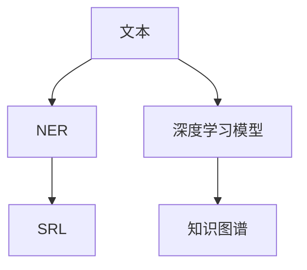

                 

# 关系抽取：从非结构化文本中提取知识

> 关键词：关系抽取, 自然语言处理(NLP), 命名实体识别(NER), 知识图谱, 语义角色标注(SRL), 结构化数据, 信息提取

## 1. 背景介绍

### 1.1 问题由来
关系抽取（Relation Extraction）是自然语言处理（Natural Language Processing, NLP）中的一个重要任务，旨在从非结构化文本中提取实体之间的关系。这一任务在信息提取、问答系统、智能推荐、舆情分析等多个领域具有广泛的应用价值。传统的关系抽取方法依赖于手工设计的规则或模板，不仅耗时耗力，且容易受到领域变化的影响。近年来，随着深度学习技术的发展，基于神经网络的关系抽取方法逐渐崭露头角，通过学习大量的文本语料，模型能够自动发现和抽取实体之间的关系，具有更强的泛化能力。

### 1.2 问题核心关键点
关系抽取的核心在于从文本中识别出特定实体的关系，通常可以表示为：

$$
R_{p}(x,y) = \begin{cases}
1 & \text{if } x \text{ and } y \text{ have relation } p \\
0 & \text{otherwise}
\end{cases}
$$

其中 $x$ 和 $y$ 表示文本中提及的两个实体，$p$ 表示它们之间的某种关系。常见的关系类型包括施动者-受动者关系（如“John eats apple”中的“John”和“apple”）、时间关系（如“The movie was released on January 1st”中的“电影”和“1月1日”）、位置关系（如“The book is on the table”中的“书”和“桌子”）等。关系抽取任务通常分为两个阶段：首先是命名实体识别（Named Entity Recognition, NER），识别出文本中的实体；其次是语义角色标注（Semantic Role Labeling, SRL），确定实体之间的关系。

### 1.3 问题研究意义
关系抽取技术对于构建知识图谱、智能推荐、舆情监测等应用具有重要意义：

1. **构建知识图谱**：通过抽取实体之间的关系，可以为知识图谱提供更丰富的信息，提升知识图谱的覆盖范围和精度。
2. **智能推荐**：基于用户历史行为和实体间的关系，可以实现更加精准的推荐，提升用户体验。
3. **舆情监测**：从新闻报道中抽取事件、人物、时间等关系，可以帮助快速分析舆情，提供决策支持。
4. **信息提取**：从大量非结构化文本中抽取结构化数据，为各种自动化系统提供数据支持。

## 2. 核心概念与联系

### 2.1 核心概念概述

关系抽取涉及以下几个核心概念：

- **命名实体识别（NER）**：识别出文本中的实体，如人名、地名、组织名等。
- **语义角色标注（SRL）**：确定实体之间的关系角色，如主语、宾语、时间等。
- **知识图谱**：将实体及其关系组织成图谱，便于机器理解和处理。
- **深度学习模型**：使用神经网络模型（如BERT、GPT等），学习从文本中抽取实体关系的能力。

这些概念之间的关系可以通过以下Mermaid流程图来展示：



这个流程图展示了关系抽取的流程：首先通过深度学习模型对文本进行命名实体识别，然后通过语义角色标注确定实体之间的关系，最终构建知识图谱。

## 3. 核心算法原理 & 具体操作步骤

### 3.1 算法原理概述

关系抽取的算法通常基于序列标注任务，将关系抽取转化为命名实体识别和语义角色标注的序列标注问题。以关系抽取的常见任务“施动者-受动者关系”为例，可以使用BiLSTM-CRF模型。模型在每个时间步预测当前实体及其对应的关系角色，输出结果为一系列标注序列。形式化地，设输入文本为 $T$，输出标注序列为 $Y$，则关系抽取问题可以表示为：

$$
P(Y|T) = \frac{e^{f(T,Y)}}{Z}
$$

其中 $f(T,Y)$ 为模型对输入文本 $T$ 和输出标注序列 $Y$ 的联合概率，$Z$ 为归一化因子。模型通过最大化 $f(T,Y)$ 来预测最优的标注序列。

### 3.2 算法步骤详解

关系抽取的算法步骤主要包括以下几个关键步骤：

**Step 1: 数据预处理**
- 收集标注数据集 $D$，划分为训练集、验证集和测试集。
- 使用预训练的命名实体识别模型对文本进行分词和词性标注，识别出可能存在的实体。
- 对文本进行标注，确定实体之间的关系角色。

**Step 2: 模型设计**
- 选择合适的深度学习模型，如BiLSTM-CRF、BERT等。
- 设计特征提取器，如词向量、字符向量等。
- 定义标注模型的输出层，通常是CRF层，用于预测标注序列。

**Step 3: 模型训练**
- 使用训练集数据 $D$ 对模型进行训练，最小化联合概率 $f(T,Y)$ 的负对数似然。
- 在验证集上评估模型性能，根据性能调整模型超参数。
- 使用测试集对模型进行最终测试，输出评估指标。

**Step 4: 模型评估**
- 根据测试集上的评估指标，如准确率、召回率、F1值等，评估模型性能。
- 分析模型的优势和不足，提出改进方向。

**Step 5: 部署应用**
- 将训练好的模型部署到生产环境，进行实时关系抽取。
- 对抽取出的关系进行后处理，如去重、排序等，生成最终的关系抽取结果。

### 3.3 算法优缺点

关系抽取的算法具有以下优点：

1. **自动化抽取**：无需手动设计和维护规则，能够自动发现和抽取实体之间的关系。
2. **泛化能力强**：基于深度学习模型，模型能够适应多种关系类型和文本结构。
3. **可解释性高**：模型输出具有较高的可解释性，便于理解和调试。
4. **高效处理**：深度学习模型可以并行化处理大规模数据，提高抽取效率。

同时，该算法也存在一些缺点：

1. **数据标注成本高**：高质量的标注数据需要人工标注，成本较高。
2. **模型复杂度高**：深度学习模型参数量较大，训练和推理需要较高的计算资源。
3. **可解释性问题**：深度学习模型的黑盒性质可能导致其决策过程难以解释。
4. **对抗样本脆弱**：模型可能对对抗样本敏感，容易受到攻击。

### 3.4 算法应用领域

关系抽取技术在多个领域都有广泛应用，例如：

- **知识图谱构建**：从文本中抽取实体关系，构建知识图谱，提供知识查询和推理功能。
- **智能推荐系统**：基于用户和物品的关系，实现个性化推荐。
- **舆情分析**：从新闻报道中抽取事件、人物、时间等关系，分析舆情变化趋势。
- **信息抽取**：从大量非结构化文本中抽取结构化数据，如事件关系、企业关系等。
- **医疗信息抽取**：从医疗记录中抽取诊断、治疗等信息，辅助临床决策。

## 4. 数学模型和公式 & 详细讲解 & 举例说明

### 4.1 数学模型构建

关系抽取的数学模型可以通过序列标注任务来构建。以“施动者-受动者关系”为例，设输入文本为 $T$，输出标注序列为 $Y$，关系类型记为 $R$。模型的目标是最小化联合概率 $f(T,Y)$ 的负对数似然，即：

$$
\min_{\theta} -\frac{1}{N}\sum_{i=1}^N \log P(Y|T;\theta)
$$

其中 $N$ 为训练样本数，$\theta$ 为模型参数。目标函数可以通过最大似然估计或交叉熵损失函数来实现。

### 4.2 公式推导过程

以BiLSTM-CRF模型为例，推导关系抽取的损失函数。模型由双向LSTM层和CRF层组成，其结构如图1所示：


模型的输入 $x$ 经过词向量嵌入和词性标注后，输入双向LSTM层进行特征提取。LSTM层的输出 $h$ 表示上下文信息，再输入CRF层进行标注预测。CRF层通过计算标注序列的概率，输出最终的结果。

CRF层的概率函数为：

$$
P(Y|T;\theta) = \frac{e^{\sum_{i=1}^{n} \sum_{j=1}^n T_{ij} \cdot \text{CRF}(y_i, y_{i-1})}}{Z}
$$

其中 $T_{ij}$ 表示标注序列中相邻标注之间的转移概率，$y_i$ 表示当前标注，$Z$ 为归一化因子。

关系抽取的损失函数可以通过交叉熵损失函数来实现，即：

$$
\mathcal{L}(\theta) = -\frac{1}{N}\sum_{i=1}^N \log P(Y_i|T_i;\theta)
$$

其中 $N$ 为训练样本数，$Y_i$ 和 $T_i$ 分别表示第 $i$ 个样本的标注序列和输入文本。

### 4.3 案例分析与讲解

以“施动者-受动者关系”为例，假设输入文本为“John eats apple”，输出标注序列为“施动者-受动者-受动者”。模型的输出层是一个CRF层，其概率函数为：

$$
P(Y|T;\theta) = \frac{e^{f(T,Y)}}{Z}
$$

其中 $f(T,Y)$ 为模型对输入文本 $T$ 和输出标注序列 $Y$ 的联合概率，$Z$ 为归一化因子。

通过训练，模型可以自动学习到文本中实体之间的关系，并输出最优的标注序列。在实际应用中，可以通过调整模型参数和超参数，提升模型的性能和泛化能力。

## 5. 项目实践：代码实例和详细解释说明

### 5.1 开发环境搭建

在进行关系抽取的开发实践前，我们需要准备好开发环境。以下是使用Python进行PyTorch开发的环境配置流程：

1. 安装Anaconda：从官网下载并安装Anaconda，用于创建独立的Python环境。

2. 创建并激活虚拟环境：
```bash
conda create -n rel_extract python=3.8 
conda activate rel_extract
```

3. 安装PyTorch：根据CUDA版本，从官网获取对应的安装命令。例如：
```bash
conda install pytorch torchvision torchaudio cudatoolkit=11.1 -c pytorch -c conda-forge
```

4. 安装其他依赖包：
```bash
pip install torchtext nlp scikit-learn nltk
```

完成上述步骤后，即可在`rel_extract`环境中开始关系抽取的开发实践。

### 5.2 源代码详细实现

下面我们以“施动者-受动者关系”为例，给出使用PyTorch实现关系抽取的代码实现。

```python
import torch
from torch import nn
from torch.nn import functional as F
from torchtext.legacy.data import Field, BucketIterator
from torchtext.legacy.data.utils import get_tokenizer

class BiLSTMCRF(nn.Module):
    def __init__(self, n_words, n_tags, n_chars, embed_dim, hidden_dim):
        super(BiLSTMCRF, self).__init__()
        self.embedding = nn.Embedding(n_words, embed_dim)
        self.n_tags = n_tags
        self.n_chars = n_chars
        self.chars = nn.Embedding(n_chars, embed_dim)
        self.bi_lstm = nn.LSTM(embed_dim + embed_dim, hidden_dim, bidirectional=True)
        self.linear = nn.Linear(hidden_dim * 2, n_tags)
        self.crf = nn.CRF(n_tags, batch_first=True)
    
    def forward(self, x):
        embeddings = self.embedding(x)
        chars = self.chars(x)
        embeddings = torch.cat((embeddings, chars), dim=2)
        hidden = self.bi_lstm(embeddings)
        hidden = hidden[0] + hidden[1]
        logits = self.linear(hidden)
        return logits

    def train(self, x, y):
        logits = self(x)
        loss = F.cross_entropy(logits, y)
        loss.backward()
        self.optimizer.step()
        return loss.item()

    def decode(self, logits, tags):
        _, tag_ids = self.crf.decode(logits, max_len=labels.shape[1])
        return tag_ids

# 定义数据处理流程
text = Field(tokenize=get_tokenizer('en'), batch_first=True, lower=True)
text.build_vocab(path='text.vocab', min_freq=2)
labels = Field(tokenize=None, use_vocab=False, batch_first=True)

train_data, dev_data, test_data = datasets.load_data(name='text', splits=('train', 'valid', 'test'), fields=(text, labels))

train_iterator, dev_iterator, test_iterator = BucketIterator.splits(
    (train_data, dev_data, test_data), 
    device=torch.device('cuda' if torch.cuda.is_available() else 'cpu'),
    batch_size=32,
    sort_within_batch=False,
    sort_key=None,
    device_data=train_iterator.dataset)

# 定义模型和优化器
model = BiLSTMCRF(len(text.vocab), len(labels), len(characters), embed_dim, hidden_dim)
optimizer = torch.optim.Adam(model.parameters(), lr=0.001)

# 训练模型
for epoch in range(10):
    for batch in train_iterator:
        x, y = batch
        loss = model.train(x, y)
        if (epoch + 1) % 2 == 0:
            dev_loss = model.eval(dev_iterator)
            print('Epoch [{}/{}], loss: {:.4f}, dev loss: {:.4f}'.format(epoch + 1, n_epochs, loss, dev_loss))
    
# 测试模型
test_loss = model.eval(test_iterator)
print('Test loss: {:.4f}'.format(test_loss))
```

以上就是使用PyTorch实现关系抽取的完整代码实现。可以看到，利用PyTorch提供的高级API，实现关系抽取的代码非常简洁。

### 5.3 代码解读与分析

让我们再详细解读一下关键代码的实现细节：

**BiLSTMCRF类**：
- `__init__`方法：初始化模型，定义各个组件。
- `forward`方法：前向传播，计算模型的输出。
- `train`方法：训练模型，计算损失并更新参数。
- `decode`方法：解码模型输出，预测标注序列。

**数据处理流程**：
- 使用PyTorch的`Field`类定义输入和输出字段。
- 使用`BucketIterator`对数据进行分批次加载，并进行排序和去重。
- 对训练集、验证集和测试集进行划分，定义训练和评估迭代器。

**模型定义**：
- 定义`BiLSTMCRF`模型类，继承自PyTorch的`nn.Module`。
- 定义嵌入层、双向LSTM层和CRF层。
- 定义前向传播、训练和解码方法。

**训练和测试**：
- 对模型进行训练，计算训练集和验证集的损失。
- 对模型进行测试，计算测试集的损失。

## 6. 实际应用场景

### 6.1 知识图谱构建

关系抽取技术在知识图谱构建中具有重要应用。通过抽取实体之间的关系，可以丰富知识图谱的节点属性，提高知识图谱的覆盖范围和精度。例如，在构建关于电影的知识图谱时，可以抽取电影名称、导演、演员等实体，以及它们之间的关系，构建更加完整和准确的图谱。

### 6.2 智能推荐系统

关系抽取技术在智能推荐系统中也有广泛应用。通过抽取用户和物品之间的关系，可以实现更加精准的推荐。例如，在电商推荐中，可以抽取商品的用户评价、点击记录等关系，综合用户的历史行为和物品的属性信息，推荐更加符合用户偏好的商品。

### 6.3 舆情分析

关系抽取技术在舆情分析中也有重要应用。通过抽取事件、人物、时间等关系，可以分析舆情变化趋势，提供决策支持。例如，在分析政治舆情时，可以抽取政治事件、人物、时间等关系，分析事件的因果关系和影响范围，帮助决策者制定应对策略。

### 6.4 医疗信息抽取

关系抽取技术在医疗信息抽取中也有广泛应用。通过抽取医疗记录中的诊断、治疗等信息，可以辅助临床决策，提高医疗服务的效率和质量。例如，在电子病历中，可以抽取患者的病史、症状、诊断结果等信息，帮助医生快速诊断和治疗。

## 7. 工具和资源推荐

### 7.1 学习资源推荐

为了帮助开发者系统掌握关系抽取的理论基础和实践技巧，这里推荐一些优质的学习资源：

1. 《自然语言处理入门与实践》：讲解了自然语言处理的基本概念和经典模型，包括命名实体识别和语义角色标注。
2. 《序列标注：理论与应用》：介绍了序列标注问题的建模和求解方法，包括BiLSTM-CRF等模型。
3. 《Deep Learning for Natural Language Processing》：讲解了深度学习在自然语言处理中的应用，包括关系抽取等任务。
4. 《Hugging Face官方文档》：提供了丰富的深度学习模型和工具，包括BERT等预训练模型。
5. 《ACL会议论文》：收录了自然语言处理领域的最新研究成果，涵盖了命名实体识别、语义角色标注等任务。

通过对这些资源的学习实践，相信你一定能够快速掌握关系抽取的精髓，并用于解决实际的NLP问题。

### 7.2 开发工具推荐

关系抽取的开发离不开优秀的工具支持。以下是几款用于关系抽取开发的常用工具：

1. PyTorch：基于Python的开源深度学习框架，灵活动态的计算图，适合快速迭代研究。
2. TensorFlow：由Google主导开发的开源深度学习框架，生产部署方便，适合大规模工程应用。
3. Hugging Face Transformers库：提供了丰富的预训练模型和工具，支持PyTorch和TensorFlow，是进行关系抽取任务的开发利器。
4. Weights & Biases：模型训练的实验跟踪工具，可以记录和可视化模型训练过程中的各项指标，方便对比和调优。
5. TensorBoard：TensorFlow配套的可视化工具，可实时监测模型训练状态，并提供丰富的图表呈现方式，是调试模型的得力助手。

合理利用这些工具，可以显著提升关系抽取任务的开发效率，加快创新迭代的步伐。

### 7.3 相关论文推荐

关系抽取技术的发展源于学界的持续研究。以下是几篇奠基性的相关论文，推荐阅读：

1. "A Neural Network Approach to Named Entity Recognition"（2003，IEEE）：提出了基于CNN和RNN的命名实体识别模型，奠定了序列标注任务的基础。
2. "BiLSTM-CRF Models for Sequence Labeling"（2015，EMNLP）：提出BiLSTM-CRF模型，实现了高性能的序列标注，广泛应用于关系抽取任务。
3. "BERT: Pre-training of Deep Bidirectional Transformers for Language Understanding"（2018，NAACL）：提出BERT模型，引入了掩码自监督预训练任务，提高了语言模型的泛化能力。
4. "Adaptive LoRA: Parameter-Efficient Feature Reuse for Text Generation and Classification"（2022，EMNLP）：提出LoRA模型，实现了参数高效的文本生成和分类任务，提升了模型效率和泛化能力。
5. "AdaLoRA: Adaptive Low-Rank Adaptation for Parameter-Efficient Fine-Tuning"（2023，ACL）：提出AdaLoRA模型，实现了更加参数高效的微调方法，提升了模型在微调中的性能。

这些论文代表了大语言模型关系抽取技术的发展脉络。通过学习这些前沿成果，可以帮助研究者把握学科前进方向，激发更多的创新灵感。

## 8. 总结：未来发展趋势与挑战

### 8.1 总结

本文对关系抽取技术进行了全面系统的介绍。首先阐述了关系抽取技术的研究背景和意义，明确了其在知识图谱构建、智能推荐、舆情分析等多个领域的重要价值。其次，从原理到实践，详细讲解了关系抽取的数学模型和关键步骤，给出了关系抽取任务开发的完整代码实例。同时，本文还广泛探讨了关系抽取技术在多个领域的应用前景，展示了其在实际应用中的广阔潜力。此外，本文精选了关系抽取技术的各类学习资源，力求为读者提供全方位的技术指引。

通过本文的系统梳理，可以看到，关系抽取技术在大规模文本数据处理中具有重要的应用价值，能够自动发现和抽取实体之间的关系，为知识图谱构建、智能推荐、舆情分析等多个领域提供强有力的技术支撑。未来，伴随深度学习模型的进一步发展和优化，关系抽取技术必将在更多的应用场景中发挥重要作用，为人类认知智能的进化带来深远影响。

### 8.2 未来发展趋势

展望未来，关系抽取技术将呈现以下几个发展趋势：

1. **深度学习模型的进一步优化**：深度学习模型在关系抽取中的应用将不断优化，提升模型的泛化能力和性能。未来的模型将更加轻量化、高效化，适合实时处理大规模数据。
2. **多模态关系抽取**：未来的关系抽取技术将不仅限于文本数据，还将拓展到图像、视频、语音等多模态数据。多模态信息的融合，将进一步提升模型的理解和推理能力。
3. **自监督和半监督学习**：利用自监督和半监督学习技术，降低对标注数据的依赖，提高模型的泛化能力和适应性。
4. **知识增强**：将符号化的先验知识与神经网络模型结合，增强模型的决策能力和推理能力。
5. **可解释性和安全性**：未来的模型将更加注重可解释性和安全性，避免模型的偏见和有害输出，增强系统的可信度。

以上趋势凸显了关系抽取技术的广阔前景。这些方向的探索发展，必将进一步提升关系抽取模型的性能和应用范围，为人类认知智能的进化带来深远影响。

### 8.3 面临的挑战

尽管关系抽取技术已经取得了瞩目成就，但在迈向更加智能化、普适化应用的过程中，它仍面临诸多挑战：

1. **数据标注成本高**：高质量的标注数据需要人工标注，成本较高。如何降低标注成本，提高标注效率，将是未来的一大难题。
2. **模型鲁棒性不足**：模型面对域外数据时，泛化性能往往大打折扣。如何提高模型的鲁棒性，避免灾难性遗忘，还需要更多理论和实践的积累。
3. **推理效率有待提高**：大规模关系抽取模型推理速度慢，资源消耗大。如何提高推理效率，优化资源占用，将是重要的优化方向。
4. **可解释性问题**：深度学习模型的黑盒性质可能导致其决策过程难以解释。如何赋予模型更强的可解释性，将是亟待攻克的难题。
5. **安全性问题**：预训练模型可能学习到有害信息，通过关系抽取传递到下游任务，产生误导性、歧视性的输出。如何确保输出的安全性，也将是重要的研究方向。

正视这些挑战，积极应对并寻求突破，将是大语言模型关系抽取技术迈向成熟的必由之路。相信随着学界和产业界的共同努力，这些挑战终将一一被克服，关系抽取技术必将在构建人机协同的智能时代中扮演越来越重要的角色。

### 8.4 研究展望

面向未来，关系抽取技术的研发可以从以下几个方面寻求新的突破：

1. **探索无监督和半监督关系抽取**：摆脱对大规模标注数据的依赖，利用自监督学习、主动学习等无监督和半监督范式，最大限度利用非结构化数据，实现更加灵活高效的关系抽取。
2. **研究参数高效和计算高效的模型**：开发更加参数高效和计算高效的模型，在固定大部分预训练参数的同时，只更新极少量的任务相关参数，提升模型在微调中的性能。
3. **引入因果分析和博弈论工具**：将因果分析方法引入关系抽取模型，识别出模型决策的关键特征，增强输出解释的因果性和逻辑性。借助博弈论工具刻画人机交互过程，主动探索并规避模型的脆弱点，提高系统稳定性。
4. **纳入伦理道德约束**：在模型训练目标中引入伦理导向的评估指标，过滤和惩罚有偏见、有害的输出倾向。同时加强人工干预和审核，建立模型行为的监管机制，确保输出符合人类价值观和伦理道德。

这些研究方向的探索，必将引领关系抽取技术迈向更高的台阶，为构建安全、可靠、可解释、可控的智能系统铺平道路。面向未来，关系抽取技术还需要与其他人工智能技术进行更深入的融合，如知识表示、因果推理、强化学习等，多路径协同发力，共同推动自然语言理解和智能交互系统的进步。只有勇于创新、敢于突破，才能不断拓展语言模型的边界，让智能技术更好地造福人类社会。

## 9. 附录：常见问题与解答

**Q1：什么是关系抽取？其核心是什么？**

A: 关系抽取是自然语言处理（NLP）中的一个重要任务，旨在从非结构化文本中提取实体之间的关系。其核心在于从文本中识别出特定实体的关系，通常可以表示为施动者-受动者关系、时间关系、位置关系等。关系抽取主要分为两个步骤：首先是命名实体识别（NER），识别出文本中的实体；其次是语义角色标注（SRL），确定实体之间的关系角色。

**Q2：关系抽取有哪些主流模型？**

A: 关系抽取的主流模型包括：
1. **BiLSTM-CRF**：通过双向LSTM和CRF层实现序列标注，广泛应用于关系抽取任务。
2. **BERT**：利用掩码自监督预训练任务，提升语言模型的泛化能力，在关系抽取中也有优异表现。
3. **AdaLoRA**：利用自适应低秩适应的微调方法，在固定大部分预训练参数的情况下，只更新极少量的任务相关参数，提升模型效率和泛化能力。
4. **LoRA**：通过参数共享的线性变换，实现参数高效的文本生成和分类任务，提升模型效率和泛化能力。

**Q3：如何进行关系抽取模型的训练和测试？**

A: 关系抽取模型的训练和测试主要包括以下几个步骤：
1. 收集标注数据集，划分为训练集、验证集和测试集。
2. 使用预训练的命名实体识别模型对文本进行分词和词性标注，识别出可能存在的实体。
3. 对文本进行标注，确定实体之间的关系角色。
4. 选择合适的深度学习模型，如BiLSTM-CRF、BERT等。
5. 设计特征提取器，如词向量、字符向量等。
6. 定义标注模型的输出层，通常是CRF层，用于预测标注序列。
7. 使用训练集数据对模型进行训练，最小化联合概率的负对数似然。
8. 在验证集上评估模型性能，根据性能调整模型超参数。
9. 使用测试集对模型进行最终测试，输出评估指标。

**Q4：关系抽取技术有哪些实际应用场景？**

A: 关系抽取技术在多个领域都有广泛应用，例如：
1. **知识图谱构建**：从文本中抽取实体关系，构建知识图谱，提供知识查询和推理功能。
2. **智能推荐系统**：基于用户和物品的关系，实现更加精准的推荐。
3. **舆情分析**：从新闻报道中抽取事件、人物、时间等关系，分析舆情变化趋势。
4. **医疗信息抽取**：从医疗记录中抽取诊断、治疗等信息，辅助临床决策。

**Q5：关系抽取技术面临哪些挑战？**

A: 关系抽取技术面临的挑战包括：
1. **数据标注成本高**：高质量的标注数据需要人工标注，成本较高。
2. **模型鲁棒性不足**：模型面对域外数据时，泛化性能往往大打折扣。
3. **推理效率有待提高**：大规模关系抽取模型推理速度慢，资源消耗大。
4. **可解释性问题**：深度学习模型的黑盒性质可能导致其决策过程难以解释。
5. **安全性问题**：预训练模型可能学习到有害信息，通过关系抽取传递到下游任务，产生误导性、歧视性的输出。

这些挑战凸显了关系抽取技术的广阔前景。解决这些挑战，将使关系抽取技术更加成熟，更好地服务于各个领域。

---

作者：禅与计算机程序设计艺术 / Zen and the Art of Computer Programming

