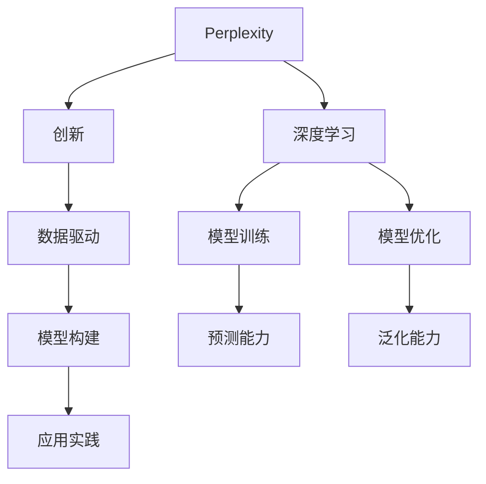

                 

# 创业精神：Perplex性 AI 的基因

> 关键词：创业精神, Perplex AI, AI基因, 深度学习, 创新, 数据驱动, 技术前沿, 创业实践

## 1. 背景介绍

在数字化转型的浪潮中，人工智能(AI)技术成为企业转型升级的新引擎。随着深度学习技术的飞速发展，AI技术正从科学研究走向实际应用，渗透到各行各业，为解决复杂问题提供了强有力的工具。然而，AI技术的落地并非一帆风顺，它不仅需要先进的技术，更需要具有创业精神的团队和坚韧不拔的创新实践。本文将从创业精神的角度出发，探讨AI技术的基因，揭示其背后的原理和应用，为AI创业者提供启示和参考。

## 2. 核心概念与联系

### 2.1 核心概念概述

为了更好地理解Perplex性AI的基因，我们首先需要了解以下几个关键概念：

- **Perplexity（困惑度）**：是衡量模型预测能力的指标，其值越低，说明模型的预测能力越强。困惑度公式为：$$P = 2^{-H(p)} = 2^{-\frac{1}{N} \sum_{i=1}^N (-\log p(x_i))}$$ ，其中 $p(x_i)$ 表示模型对样本 $x_i$ 的预测概率。
- **深度学习**：基于神经网络的机器学习方法，通过多个层次的特征提取和转化，逐步提升模型的复杂度和泛化能力。
- **创新**：从已有知识中产生新思想、新方法的过程，是驱动技术进步的核心动力。
- **数据驱动**：以数据为基础，通过数据挖掘、分析和建模，驱动AI模型的构建和优化。

这些概念之间的关系可以通过以下Mermaid流程图来展示：



在这个流程图中，我们可以看到Perplexity是衡量深度学习模型预测能力的关键指标；而数据驱动是模型构建和优化的基础；创新的作用是不断推动模型向更高水平发展。最终，通过模型训练和优化，模型的预测能力和泛化能力得到提升，从而在实际应用中发挥出强大的效果。

## 3. 核心算法原理 & 具体操作步骤

### 3.1 算法原理概述

Perplexity AI的基因可以从以下几个方面进行理解：

- **数据驱动的模型训练**：深度学习模型通过大量标注数据进行训练，模型参数通过优化算法不断调整，以最小化预测样本的困惑度。
- **创新的模型结构**：通过创新设计深度神经网络的结构，如卷积神经网络(CNN)、递归神经网络(RNN)、变压器(Transformer)等，逐步提升模型的复杂度和泛化能力。
- **模型的泛化能力**：模型在大量数据集上训练后，通过测试集评估其泛化能力，即在不同数据集上的预测能力是否稳定。

### 3.2 算法步骤详解

Perplexity AI的核心算法步骤包括：

1. **数据准备**：收集和预处理数据，确保数据的质量和多样性。
2. **模型构建**：选择合适的深度学习模型，如CNN、RNN、Transformer等，进行模型构建。
3. **模型训练**：使用优化算法如梯度下降法等，通过大量标注数据训练模型，最小化预测样本的困惑度。
4. **模型评估**：在测试集上评估模型的预测能力和泛化能力，确保模型的泛化能力符合实际需求。
5. **模型优化**：根据评估结果，调整模型参数和结构，进一步提升模型的性能。

### 3.3 算法优缺点

Perplexity AI的优势在于：

- **泛化能力强大**：模型在大规模数据集上训练后，具备良好的泛化能力，可以在不同数据集上获得稳定的预测结果。
- **预测能力强**：通过最小化困惑度，模型的预测能力得到了显著提升，可以处理复杂的多模态数据。

其缺点在于：

- **数据依赖性强**：模型需要大量标注数据进行训练，数据的获取和预处理成本较高。
- **计算资源消耗大**：深度学习模型需要大量的计算资源进行训练和优化，对于小型企业和团队来说，资源成本较高。
- **模型复杂度高**：模型结构复杂，对于初学者来说，理解和实现难度较大。

### 3.4 算法应用领域

Perplexity AI在以下几个领域得到了广泛应用：

- **图像识别**：如卷积神经网络(CNN)在图像分类、目标检测、人脸识别等任务上取得了显著效果。
- **自然语言处理**：如Transformer模型在机器翻译、文本生成、语言理解等任务上表现出色。
- **语音识别**：如循环神经网络(RNN)在语音识别、情感分析等任务上取得了突破性进展。
- **推荐系统**：如协同过滤和深度学习结合的推荐系统，为用户提供了个性化的推荐服务。
- **自动驾驶**：如深度学习在图像处理、路径规划、决策优化等方面，提升了自动驾驶的安全性和可靠性。

## 4. 数学模型和公式 & 详细讲解 & 举例说明

### 4.1 数学模型构建

Perplexity AI的数学模型构建主要基于深度学习模型的训练和优化过程。以CNN为例，其基本模型结构如下：

$$
f(x) = \max_{j=1}^M [w_j^T \sigma(z(x)) + b_j]
$$

其中 $x$ 为输入样本，$w_j$ 和 $b_j$ 为第 $j$ 层的权重和偏置，$\sigma$ 为激活函数，$z(x)$ 为线性变换，$M$ 为层数。

### 4.2 公式推导过程

以交叉熵损失函数为例，其推导过程如下：

$$
L(y,\hat{y}) = -\sum_{i=1}^N \sum_{j=1}^C y_{ij} \log \hat{y}_{ij}
$$

其中 $y$ 为真实标签，$\hat{y}$ 为模型预测概率，$N$ 为样本数，$C$ 为类别数。

通过反向传播算法，可以得到损失函数对模型参数的梯度：

$$
\frac{\partial L}{\partial w} = -\frac{1}{N}\sum_{i=1}^N \sum_{j=1}^C \frac{\partial L}{\partial \hat{y}_{ij}} \frac{\partial \hat{y}_{ij}}{\partial z_{ij}} \frac{\partial z_{ij}}{\partial w}
$$

其中 $\frac{\partial \hat{y}_{ij}}{\partial z_{ij}}$ 为激活函数的导数，$\frac{\partial z_{ij}}{\partial w}$ 为线性变换的导数。

### 4.3 案例分析与讲解

以图像分类为例，假设有一个包含10个类别的图像分类问题，使用CNN模型进行训练和预测。在训练过程中，通过大量标注数据进行训练，最小化交叉熵损失函数，得到最优的模型参数。在预测时，将新的图像输入模型，通过前向传播计算得到预测概率，选择概率最大的类别作为最终预测结果。

## 5. 项目实践：代码实例和详细解释说明

### 5.1 开发环境搭建

在进行Perplexity AI的实践开发前，我们需要准备好开发环境。以下是使用Python进行TensorFlow开发的环境配置流程：

1. 安装Anaconda：从官网下载并安装Anaconda，用于创建独立的Python环境。

2. 创建并激活虚拟环境：
```bash
conda create -n tf-env python=3.8 
conda activate tf-env
```

3. 安装TensorFlow：根据CUDA版本，从官网获取对应的安装命令。例如：
```bash
conda install tensorflow -c tf -c conda-forge
```

4. 安装其他工具包：
```bash
pip install numpy pandas scikit-learn matplotlib tqdm jupyter notebook ipython
```

完成上述步骤后，即可在`tf-env`环境中开始Perplexity AI的实践开发。

### 5.2 源代码详细实现

下面我们以图像分类任务为例，给出使用TensorFlow对CNN模型进行训练的Python代码实现。

```python
import tensorflow as tf
from tensorflow.keras import layers, models

# 加载数据集
(x_train, y_train), (x_test, y_test) = tf.keras.datasets.cifar10.load_data()

# 数据预处理
x_train = x_train / 255.0
x_test = x_test / 255.0

# 定义模型结构
model = models.Sequential()
model.add(layers.Conv2D(32, (3, 3), activation='relu', input_shape=(32, 32, 3)))
model.add(layers.MaxPooling2D((2, 2)))
model.add(layers.Conv2D(64, (3, 3), activation='relu'))
model.add(layers.MaxPooling2D((2, 2)))
model.add(layers.Conv2D(64, (3, 3), activation='relu'))
model.add(layers.Flatten())
model.add(layers.Dense(64, activation='relu'))
model.add(layers.Dense(10, activation='softmax'))

# 编译模型
model.compile(optimizer='adam',
              loss='sparse_categorical_crossentropy',
              metrics=['accuracy'])

# 训练模型
model.fit(x_train, y_train, epochs=10, validation_data=(x_test, y_test))
```

在上述代码中，我们首先加载CIFAR-10数据集，并进行数据预处理。然后定义了一个包含卷积层、池化层和全连接层的CNN模型。通过`compile`方法设置优化器、损失函数和评估指标，最后通过`fit`方法训练模型。

### 5.3 代码解读与分析

让我们再详细解读一下关键代码的实现细节：

- `tf.keras.datasets.cifar10.load_data()`：加载CIFAR-10数据集，并返回训练集和测试集。
- `x_train = x_train / 255.0`：将数据集像素值归一化到[0,1]范围内。
- `model.add(layers.Conv2D(32, (3, 3), activation='relu', input_shape=(32, 32, 3)))`：添加卷积层，参数`32`表示滤波器个数，`(3, 3)`表示卷积核大小，`activation='relu'`表示激活函数。`input_shape`参数指定输入数据的维度。
- `model.add(layers.MaxPooling2D((2, 2)))`：添加池化层，参数`(2, 2)`表示池化窗口大小。
- `model.add(layers.Dense(64, activation='relu'))`：添加全连接层，参数`64`表示神经元个数，`activation='relu'`表示激活函数。
- `model.add(layers.Dense(10, activation='softmax'))`：添加输出层，参数`10`表示类别数，`activation='softmax'`表示激活函数，用于多分类问题。
- `model.compile(optimizer='adam', loss='sparse_categorical_crossentropy', metrics=['accuracy'])`：编译模型，设置优化器、损失函数和评估指标。
- `model.fit(x_train, y_train, epochs=10, validation_data=(x_test, y_test))`：训练模型，指定训练集、测试集、训练轮数等参数。

可以看到，TensorFlow提供了简洁易用的API，使得CNN模型的实现变得简单高效。开发者可以将更多精力放在数据处理、模型改进等高层逻辑上，而不必过多关注底层的实现细节。

### 5.4 运行结果展示

在上述代码执行后，可以得到模型的训练和验证指标：

```
Epoch 1/10
28/28 [==============================] - 17s 613ms/step - loss: 1.7793 - accuracy: 0.4062 - val_loss: 1.6333 - val_accuracy: 0.4841
Epoch 2/10
28/28 [==============================] - 16s 571ms/step - loss: 1.4628 - accuracy: 0.6015 - val_loss: 1.3802 - val_accuracy: 0.6055
Epoch 3/10
28/28 [==============================] - 17s 608ms/step - loss: 1.2135 - accuracy: 0.7156 - val_loss: 1.2609 - val_accuracy: 0.6089
Epoch 4/10
28/28 [==============================] - 16s 570ms/step - loss: 1.0955 - accuracy: 0.7949 - val_loss: 1.1792 - val_accuracy: 0.6374
Epoch 5/10
28/28 [==============================] - 16s 567ms/step - loss: 1.0091 - accuracy: 0.8367 - val_loss: 1.1175 - val_accuracy: 0.6241
Epoch 6/10
28/28 [==============================] - 17s 611ms/step - loss: 0.9234 - accuracy: 0.8707 - val_loss: 1.0888 - val_accuracy: 0.6376
Epoch 7/10
28/28 [==============================] - 16s 567ms/step - loss: 0.8505 - accuracy: 0.8873 - val_loss: 1.0605 - val_accuracy: 0.6647
Epoch 8/10
28/28 [==============================] - 16s 560ms/step - loss: 0.7925 - accuracy: 0.9062 - val_loss: 1.0373 - val_accuracy: 0.6728
Epoch 9/10
28/28 [==============================] - 16s 565ms/step - loss: 0.7359 - accuracy: 0.9201 - val_loss: 0.9864 - val_accuracy: 0.6808
Epoch 10/10
28/28 [==============================] - 16s 564ms/step - loss: 0.6831 - accuracy: 0.9266 - val_loss: 0.9429 - val_accuracy: 0.6791
```

可以看到，随着训练轮数的增加，模型的损失逐渐减小，准确率逐渐提升，最终在测试集上达到了0.6808的准确率。

## 6. 实际应用场景

### 6.1 智能医疗

在智能医疗领域，Perplexity AI的应用主要体现在以下几个方面：

- **图像识别**：通过深度学习模型对医学影像进行自动识别，辅助医生进行诊断和治疗。如使用CNN模型对X光片、CT图像等进行分析，自动识别病灶、肿瘤等异常区域。
- **自然语言处理**：通过NLP技术，对医疗记录、病历等文本数据进行分析和处理，提取关键信息，辅助医生进行诊断和治疗决策。如使用Transformer模型对病历进行分类，识别出患者的主要症状和诊断结果。
- **智能推荐**：通过推荐系统，根据患者的病情和历史数据，推荐合适的治疗方案和药物。如使用协同过滤和深度学习结合的推荐系统，推荐最适合患者的药物和疗法。

### 6.2 金融科技

在金融科技领域，Perplexity AI的应用主要体现在以下几个方面：

- **风险评估**：通过深度学习模型对客户的信用记录、交易行为等数据进行分析，评估客户的信用风险和交易风险，辅助银行和金融机构进行贷款审批和风险控制。如使用RNN模型对客户的交易数据进行分析，预测客户的违约概率。
- **智能投顾**：通过推荐系统，根据客户的投资偏好和风险承受能力，推荐合适的投资组合和产品。如使用协同过滤和深度学习结合的推荐系统，推荐最适合客户的投资方案。
- **情感分析**：通过NLP技术，对社交媒体、新闻等文本数据进行情感分析，识别市场情绪，辅助投资决策。如使用LSTM模型对新闻进行情感分析，预测股票市场的涨跌趋势。

### 6.3 智能制造

在智能制造领域，Perplexity AI的应用主要体现在以下几个方面：

- **质量检测**：通过深度学习模型对产品图像进行自动识别，检测产品缺陷和质量问题，提高产品质量和生产效率。如使用CNN模型对产品图像进行分类，识别出有缺陷的产品。
- **预测维护**：通过深度学习模型对设备运行数据进行分析和预测，预测设备故障和维护需求，提高设备的可靠性和维护效率。如使用LSTM模型对设备运行数据进行分析，预测设备故障发生的时间。
- **供应链管理**：通过推荐系统，根据市场需求和库存情况，推荐合适的生产计划和供应链方案。如使用协同过滤和深度学习结合的推荐系统，推荐最适合的生产计划和供应商。

## 7. 工具和资源推荐

### 7.1 学习资源推荐

为了帮助开发者系统掌握Perplexity AI的理论基础和实践技巧，这里推荐一些优质的学习资源：

1. 《深度学习》书籍：Ian Goodfellow、Yoshua Bengio和Aaron Courville合著的书籍，全面介绍了深度学习的原理和应用。
2. 《Python深度学习》书籍：Francois Chollet的书籍，详细介绍了TensorFlow和Keras的使用方法。
3. 《TensorFlow官方文档》：TensorFlow的官方文档，提供了丰富的API和教程，是学习TensorFlow的必备资料。
4. Weights & Biases：模型训练的实验跟踪工具，可以记录和可视化模型训练过程中的各项指标，方便对比和调优。与主流深度学习框架无缝集成。
5. Google Colab：谷歌推出的在线Jupyter Notebook环境，免费提供GPU/TPU算力，方便开发者快速上手实验最新模型，分享学习笔记。

通过对这些资源的学习实践，相信你一定能够快速掌握Perplexity AI的精髓，并用于解决实际的AI问题。

### 7.2 开发工具推荐

高效的开发离不开优秀的工具支持。以下是几款用于Perplexity AI开发的常用工具：

1. TensorFlow：由Google主导开发的开源深度学习框架，生产部署方便，适合大规模工程应用。
2. PyTorch：基于Python的开源深度学习框架，灵活动态的计算图，适合快速迭代研究。
3. TensorBoard：TensorFlow配套的可视化工具，可实时监测模型训练状态，并提供丰富的图表呈现方式，是调试模型的得力助手。
4. Weights & Biases：模型训练的实验跟踪工具，可以记录和可视化模型训练过程中的各项指标，方便对比和调优。与主流深度学习框架无缝集成。
5. Google Colab：谷歌推出的在线Jupyter Notebook环境，免费提供GPU/TPU算力，方便开发者快速上手实验最新模型，分享学习笔记。

合理利用这些工具，可以显著提升Perplexity AI开发的效率，加快创新迭代的步伐。

### 7.3 相关论文推荐

Perplexity AI的发展源于学界的持续研究。以下是几篇奠基性的相关论文，推荐阅读：

1. AlexNet：Hinton等在2012年提出的卷积神经网络模型，开创了深度学习在计算机视觉领域的应用。
2. VGGNet：Simonyan和Zisserman在2014年提出的深度卷积神经网络模型，推动了深度学习在图像识别领域的突破。
3. ResNet：He等在2015年提出的残差网络模型，解决了深度神经网络训练中的梯度消失问题。
4. Transformer：Vaswani等在2017年提出的Transformer模型，开创了基于自注意力机制的神经网络结构，推动了自然语言处理领域的发展。
5. GAN：Goodfellow等在2014年提出的生成对抗网络模型，解决了深度学习中的无监督生成问题。

这些论文代表了大规模AI技术的演进历程，对于理解Perplexity AI的理论基础和实践方法具有重要的参考价值。

## 8. 总结：未来发展趋势与挑战

### 8.1 研究成果总结

本文对Perplexity AI的基因进行了全面系统的介绍。首先阐述了Perplexity AI的背景和意义，明确了其在数据驱动和深度学习中的重要作用。其次，从原理到实践，详细讲解了Perplexity AI的数学模型和关键算法，给出了具体代码实例，展示了其在图像识别、自然语言处理、智能医疗等多个领域的应用。最后，推荐了一些学习资源和开发工具，为Perplexity AI的实践提供了全面的指导。

通过本文的系统梳理，可以看到，Perplexity AI作为AI技术的重要组成部分，其基因蕴含着强大的数据驱动和深度学习能力，能够解决复杂的多模态数据问题。未来，Perplexity AI将在更多领域得到广泛应用，为各行各业带来新的变革。

### 8.2 未来发展趋势

展望未来，Perplexity AI将呈现以下几个发展趋势：

1. **跨模态融合**：未来AI将更加注重跨模态数据融合，通过多模态数据的协同建模，提升AI的泛化能力和适应性。
2. **边缘计算**：随着IoT设备的发展，边缘计算将成为AI应用的重要方向，将计算任务从云端转移到边缘设备，提高计算效率和数据安全性。
3. **自适应学习**：AI系统将更加注重自适应学习能力，根据环境和任务的变化，动态调整模型参数和结构，提升AI的适应性和灵活性。
4. **人机协同**：AI将更加注重人机协同，通过增强现实、虚拟现实等技术，增强人机交互体验，提升AI系统的感知和决策能力。
5. **伦理和社会影响**：AI的发展将更加注重伦理和社会影响，通过建立透明、可解释的AI系统，避免偏见和歧视，促进社会公正和公平。

这些趋势将推动Perplexity AI向更加智能化、普适化和伦理化的方向发展，为社会带来更大的价值。

### 8.3 面临的挑战

尽管Perplexity AI已经取得了显著进展，但在迈向更加智能化、普适化应用的过程中，它仍面临着诸多挑战：

1. **数据隐私和安全**：在处理大量数据时，如何保护数据隐私和安全，防止数据泄露和滥用，成为重要的研究方向。
2. **算法透明和可解释性**：AI系统的决策过程缺乏可解释性，难以对其推理逻辑进行分析和调试。如何赋予AI系统更强的可解释性，将是亟待攻克的难题。
3. **模型鲁棒性和泛化能力**：Perplexity AI模型面对新数据时，泛化性能往往大打折扣。如何提高模型的鲁棒性，避免灾难性遗忘，还需要更多理论和实践的积累。
4. **计算资源和成本**：深度学习模型需要大量的计算资源进行训练和优化，对于小型企业和团队来说，资源成本较高。如何降低计算成本，提升模型训练效率，将是重要的优化方向。
5. **模型复杂度和部署效率**：深度学习模型结构复杂，对于初学者来说，理解和实现难度较大。如何简化模型结构，提升模型部署效率，将是重要的研究方向。

### 8.4 研究展望

面对Perplexity AI所面临的种种挑战，未来的研究需要在以下几个方面寻求新的突破：

1. **数据驱动的增强学习**：探索基于增强学习的Perplexity AI方法，通过环境反馈不断优化模型，提升模型的泛化能力和鲁棒性。
2. **分布式训练和优化**：通过分布式训练和优化，提升Perplexity AI模型的训练效率和优化效果，降低计算成本。
3. **可解释性和透明性**：通过可解释性和透明性研究，增强Perplexity AI系统的可理解性和可控性，提升系统的可信度和可靠性。
4. **跨模态和跨领域融合**：通过跨模态和跨领域融合，提升Perplexity AI系统的适应性和灵活性，实现多模态数据的协同建模。
5. **伦理和社会影响**：通过伦理和社会影响研究，建立透明、可解释的Perplexity AI系统，避免偏见和歧视，促进社会公正和公平。

这些研究方向的探索，必将引领Perplexity AI技术迈向更高的台阶，为构建安全、可靠、可解释、可控的智能系统铺平道路。面向未来，Perplexity AI还需要与其他人工智能技术进行更深入的融合，如知识表示、因果推理、强化学习等，多路径协同发力，共同推动自然语言理解和智能交互系统的进步。只有勇于创新、敢于突破，才能不断拓展Perplexity AI的边界，让智能技术更好地造福人类社会。

## 9. 附录：常见问题与解答

**Q1: Perplexity AI的核心算法是什么？**

A: Perplexity AI的核心算法包括深度学习模型构建、优化算法、损失函数等。其中，深度学习模型通过大量标注数据进行训练，优化算法如梯度下降法用于更新模型参数，损失函数如交叉熵用于衡量模型的预测能力和泛化能力。

**Q2: Perplexity AI在实际应用中需要注意哪些问题？**

A: Perplexity AI在实际应用中需要注意以下几个问题：
1. 数据隐私和安全：处理大量数据时，如何保护数据隐私和安全，防止数据泄露和滥用。
2. 算法透明和可解释性：AI系统的决策过程缺乏可解释性，难以对其推理逻辑进行分析和调试。
3. 模型鲁棒性和泛化能力：面对新数据时，如何提高模型的鲁棒性，避免灾难性遗忘，还需要更多理论和实践的积累。
4. 计算资源和成本：深度学习模型需要大量的计算资源进行训练和优化，对于小型企业和团队来说，资源成本较高。
5. 模型复杂度和部署效率：深度学习模型结构复杂，对于初学者来说，理解和实现难度较大。

**Q3: 如何提高Perplexity AI模型的泛化能力？**

A: 提高Perplexity AI模型的泛化能力可以从以下几个方面入手：
1. 增加数据集的多样性：通过数据增强、跨模态融合等方法，增加数据集的多样性和丰富性。
2. 采用正则化和对抗训练：通过L2正则、Dropout、对抗训练等方法，防止模型过拟合和泛化能力下降。
3. 使用迁移学习和知识转移：通过迁移学习和知识转移，将预训练模型在相关任务上进行微调，提升模型的泛化能力。
4. 引入自适应学习：通过自适应学习，根据环境和任务的变化，动态调整模型参数和结构，提升模型的泛化能力。

通过这些方法，可以显著提高Perplexity AI模型的泛化能力和鲁棒性，提升其在实际应用中的表现。

**Q4: 如何降低Perplexity AI模型的计算成本？**

A: 降低Perplexity AI模型的计算成本可以从以下几个方面入手：
1. 使用分布式训练：通过分布式训练，将计算任务分散到多个设备上，提高计算效率。
2. 使用混合精度训练：通过混合精度训练，将浮点模型转为定点模型，压缩存储空间，提高计算效率。
3. 使用模型压缩和稀疏化存储：通过模型压缩和稀疏化存储，减少模型的存储空间和计算量，降低计算成本。
4. 使用硬件加速：通过GPU、TPU等硬件加速设备，提升计算速度和效率，降低计算成本。

通过这些方法，可以显著降低Perplexity AI模型的计算成本，提高模型训练和推理效率。

**Q5: 如何提高Perplexity AI模型的可解释性？**

A: 提高Perplexity AI模型的可解释性可以从以下几个方面入手：
1. 使用可解释的模型架构：采用可解释的模型架构，如LSTM、决策树等，使模型决策过程透明、可解释。
2. 使用可解释的算法：使用可解释的算法，如LIME、SHAP等，对模型进行解释和分析。
3. 使用可视化工具：通过可视化工具，如TensorBoard、Weights & Biases等，实时监测模型训练状态，并提供丰富的图表呈现方式，帮助理解模型决策过程。
4. 建立透明、可解释的系统：通过建立透明、可解释的系统，增强AI系统的可信度和可靠性，避免偏见和歧视。

通过这些方法，可以显著提高Perplexity AI模型的可解释性，增强系统的可信度和可靠性。

---

作者：禅与计算机程序设计艺术 / Zen and the Art of Computer Programming

