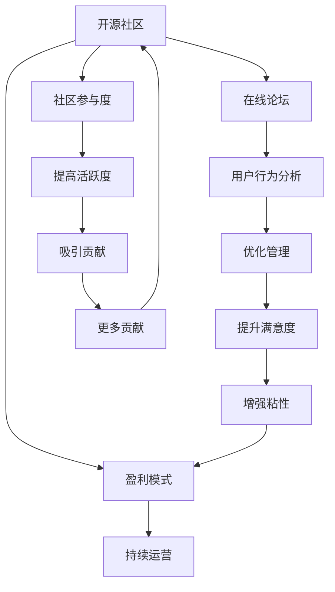

                 

# 创建开源项目的在线论坛：社区参与和盈利模式

> 关键词：开源社区, 在线论坛, 社区参与, 盈利模式, 用户行为分析, 可持续运营

## 1. 背景介绍

### 1.1 问题由来
近年来，开源社区的数量和规模显著增长，开源项目的合作与共享程度不断提升。然而，尽管开源项目在技术创新、协作和代码共享方面取得了巨大成功，但在社区管理和运营方面仍面临诸多挑战。许多开源项目缺乏稳定、高效的社区管理平台，导致项目成员之间的沟通不畅、贡献不均、留存率低等问题。如何构建一个高效、活跃的社区论坛，是开源社区建设的重要一环。

### 1.2 问题核心关键点
本研究聚焦于开源社区中高效、活跃的在线论坛的创建与管理。它旨在解决以下核心问题：

1. **社区参与度**：如何吸引更多开发者参与到开源项目中，提高项目的活跃度和贡献率。
2. **用户行为分析**：如何通过分析用户行为数据，理解社区成员的需求和偏好，优化社区管理策略。
3. **盈利模式**：如何在开源社区中获得稳定和可持续的盈利，支持社区的长期发展。

## 2. 核心概念与联系

### 2.1 核心概念概述

为更好地理解创建开源社区在线论坛的原理与方法，本节将介绍几个关键概念：

- **开源社区 (Open Source Community)**：由开发者共同贡献代码、共享知识、协作开发的软件项目集合。它强调透明、开放和协作。

- **在线论坛 (Online Forum)**：一种通过互联网平台实现的网络化沟通工具，用于社区成员之间的交流、讨论、问题解决等。

- **社区参与度 (Community Engagement)**：指社区成员在项目中的活跃程度和贡献大小。参与度高的社区通常拥有更强的创新能力和项目稳定性。

- **用户行为分析 (User Behavior Analysis)**：通过收集和分析用户在社区中的行为数据，理解用户需求、优化社区管理和提高用户满意度。

- **盈利模式 (Revenue Model)**：开源社区的盈利方式，包括广告、赞助、服务收费、捐赠等，以支持社区的可持续运营和发展。

这些核心概念之间的联系可以通过以下Mermaid流程图来展示：



这个流程图展示了开源社区、在线论坛、社区参与度、用户行为分析和盈利模式之间的相互关系：

1. 开源社区通过在线论坛促进成员之间的沟通与协作。
2. 高社区参与度有助于提升项目活跃度，吸引更多贡献者。
3. 用户行为分析通过理解用户需求，优化社区管理策略，提升用户体验。
4. 盈利模式为社区提供持续发展的经济支持，保障社区的长期运营。

## 3. 核心算法原理 & 具体操作步骤

### 3.1 算法原理概述

创建高效、活跃的在线论坛，需要对社区参与度和用户行为进行深入分析，并结合适当的盈利模式。以下是对关键算法的原理概述：

- **社区参与度算法**：使用社交网络分析、情感分析等方法，评估社区成员的活跃度和贡献度。通过算法优化社区参与度，提高项目的吸引力。

- **用户行为分析算法**：利用机器学习、自然语言处理等技术，从社区互动中提取行为模式，理解用户需求和偏好。通过数据分析，优化社区管理策略，提升用户体验。

- **盈利模式算法**：探索多元化的盈利途径，如广告收入、企业赞助、付费服务、社区捐助等。通过合理的盈利模式设计，支持社区的可持续运营。

### 3.2 算法步骤详解

创建开源社区在线论坛的过程可分为以下几个关键步骤：

**Step 1: 平台设计与开发**
- 选择适当的开源平台和开发框架（如Django、Flask等）。
- 设计论坛的功能模块，包括用户注册、登录、发布帖子、评论、搜索等。
- 开发论坛的API接口，支持第三方应用的集成。

**Step 2: 用户行为数据分析**
- 收集论坛的访问日志、互动数据、贡献数据等。
- 使用数据挖掘和机器学习技术，分析用户行为模式和参与度。
- 根据分析结果，优化论坛界面和功能，提高用户粘性和满意度。

**Step 3: 社区参与度提升**
- 设计激励机制，如积分奖励、徽章系统、排行榜等，鼓励用户积极参与。
- 定期举办线上活动和比赛，增加社区的互动和参与感。
- 引入代码评审、问题跟踪等工具，促进贡献和协作。

**Step 4: 盈利模式探索**
- 分析潜在广告商、赞助商和付费用户的需求。
- 设计多样化的盈利模式，如广告位销售、企业赞助、专业服务订阅等。
- 实施合理的定价策略和激励机制，平衡盈利与社区可持续性。

**Step 5: 持续运营与优化**
- 定期监测社区参与度和用户满意度。
- 收集用户反馈，不断优化论坛功能和社区管理策略。
- 探索新的盈利模式和技术应用，保持社区的创新和活力。

### 3.3 算法优缺点

创建开源社区在线论坛的算法具有以下优点：

1. **高效协作**：通过在线论坛，社区成员可以高效沟通和协作，提高项目的开发效率。
2. **数据驱动**：利用数据分析技术，精确理解用户需求和行为，优化社区管理策略。
3. **灵活盈利**：多样化的盈利模式可满足不同类型用户的需求，支持社区的持续发展。

同时，该算法也存在一些局限性：

1. **复杂度高**：平台设计和开发、数据分析和算法优化需要较高的技术门槛。
2. **数据隐私**：收集用户行为数据可能涉及隐私问题，需要严格的数据保护措施。
3. **社区依赖**：社区的活跃度和贡献度受成员参与度的影响较大，存在一定的不确定性。
4. **盈利平衡**：如何在盈利与社区可持续性之间取得平衡，需要精细的运营策略。

### 3.4 算法应用领域

创建开源社区在线论坛的算法不仅适用于开源项目，还可应用于各种社区和平台的构建。以下是几个典型应用领域：

- **企业内部协作平台**：构建企业内部的知识共享和协作平台，提升团队的生产力。
- **学术研究论坛**：创建学术研究社区，促进学者之间的交流和合作。
- **社会公益项目**：建立公益项目论坛，调动志愿者参与，提升项目的社会影响力。
- **科技爱好者社群**：构建技术爱好者社区，促进技术交流和创新。
- **在线教育平台**：创建在线学习社区，提供互动式学习体验，提升教学效果。

## 4. 数学模型和公式 & 详细讲解 & 举例说明

### 4.1 数学模型构建

本节将使用数学语言对创建开源社区在线论坛的算法进行更加严格的刻画。

假设在线论坛的用户行为数据为 $D=\{(x_i,y_i)\}_{i=1}^N$，其中 $x_i$ 为用户的行为特征（如登录时间、发布帖子数、互动次数等），$y_i$ 为用户的参与度评分（如活跃度、贡献度、满意度等）。

定义用户参与度评分函数为 $f(x_i)$，参与度评分函数通过以下步骤构建：

1. 特征提取：将用户行为数据映射为特征向量 $x_i \in \mathbb{R}^d$。
2. 模型训练：使用机器学习模型（如线性回归、随机森林等）训练参与度评分函数 $f(x_i)$。
3. 评分预测：通过训练好的模型预测用户的行为评分 $y_i=f(x_i)$。

### 4.2 公式推导过程

以下我们以线性回归模型为例，推导参与度评分函数的计算公式。

假设用户行为特征与参与度评分之间存在线性关系，设 $\theta$ 为线性回归模型的参数，则参与度评分函数可以表示为：

$$
y_i = \theta^T \phi(x_i) + \epsilon_i
$$

其中 $\theta \in \mathbb{R}^d$ 为回归系数，$\phi(x_i)$ 为特征映射函数，$\epsilon_i$ 为随机误差项。

通过最小二乘法，参与度评分函数的参数 $\theta$ 可以通过数据集 $D$ 进行优化求解：

$$
\theta^* = \mathop{\arg\min}_{\theta} \sum_{i=1}^N (y_i - \theta^T \phi(x_i))^2
$$

利用梯度下降算法，参数 $\theta$ 的更新公式为：

$$
\theta \leftarrow \theta - \eta \nabla_{\theta}\mathcal{L}(\theta)
$$

其中 $\eta$ 为学习率，$\mathcal{L}(\theta)$ 为损失函数，$\nabla_{\theta}\mathcal{L}(\theta)$ 为损失函数对参数 $\theta$ 的梯度。

### 4.3 案例分析与讲解

以一个开源社区为例，展示如何利用数学模型和算法进行用户行为分析：

1. **数据收集**：
   - 收集社区论坛的访问日志，包括登录时间、浏览页面、发布帖子、评论互动等行为。
   - 设计调查问卷，收集社区成员的满意度评分和行为动机。

2. **特征提取**：
   - 提取关键行为特征，如活跃度（帖子发布数、评论次数）、贡献度（代码提交数、问题解答数）、满意度（评分）等。
   - 使用文本挖掘技术，提取用户在论坛中的语义特征，如情感倾向、话题偏好等。

3. **模型训练**：
   - 使用线性回归模型对用户行为数据进行训练，预测参与度评分。
   - 根据评分结果，识别出高活跃度和高贡献度的用户。

4. **优化策略**：
   - 针对高活跃度用户，设计激励机制，如积分奖励、徽章系统、排行榜等。
   - 针对高贡献度用户，提供更多的技术支持和资源倾斜。

5. **效果评估**：
   - 定期收集用户反馈，评估激励机制和优化策略的效果。
   - 调整模型参数，改进算法模型，持续优化社区管理策略。

## 5. 项目实践：代码实例和详细解释说明

### 5.1 开发环境搭建

在进行项目实践前，我们需要准备好开发环境。以下是使用Python进行Django开发的环境配置流程：

1. 安装Anaconda：从官网下载并安装Anaconda，用于创建独立的Python环境。

2. 创建并激活虚拟环境：
```bash
conda create -n myenv python=3.8 
conda activate myenv
```

3. 安装Django：根据CUDA版本，从官网获取对应的安装命令。例如：
```bash
conda install django
```

4. 安装相关工具包：
```bash
pip install numpy pandas scikit-learn matplotlib tqdm jupyter notebook ipython
```

完成上述步骤后，即可在`myenv`环境中开始项目实践。

### 5.2 源代码详细实现

下面以构建开源社区在线论坛为例，展示使用Django进行项目开发的代码实现。

**urls.py**

```python
from django.urls import path
from . import views

urlpatterns = [
    path('', views.index, name='index'),
    path('forum/', views.forum, name='forum'),
    path('profile/', views.profile, name='profile'),
    path('login/', views.login, name='login'),
    path('logout/', views.logout, name='logout'),
    path('register/', views.register, name='register'),
]
```

**views.py**

```python
from django.shortcuts import render, redirect
from django.contrib.auth.decorators import login_required

@login_required
def index(request):
    context = {
        'forum_posts': ForumPost.objects.all(),
        'profile': Profile.objects.get(username=request.user.username)
    }
    return render(request, 'index.html', context)

@login_required
def forum(request):
    context = {
        'forum_posts': ForumPost.objects.all(),
        'profile': Profile.objects.get(username=request.user.username)
    }
    return render(request, 'forum.html', context)

@login_required
def profile(request):
    context = {
        'profile': Profile.objects.get(username=request.user.username)
    }
    return render(request, 'profile.html', context)

def login(request):
    if request.method == 'POST':
        # 处理登录逻辑
        return redirect('index')
    return render(request, 'login.html')

def logout(request):
    # 处理退出逻辑
    return redirect('login')

def register(request):
    if request.method == 'POST':
        # 处理注册逻辑
        return redirect('login')
    return render(request, 'register.html')
```

**models.py**

```python
from django.db import models
from django.contrib.auth.models import User

class ForumPost(models.Model):
    title = models.CharField(max_length=100)
    content = models.TextField()
    author = models.ForeignKey(User, on_delete=models.CASCADE)
    created_at = models.DateTimeField(auto_now_add=True)
    updated_at = models.DateTimeField(auto_now=True)

class Profile(models.Model):
    user = models.OneToOneField(User, on_delete=models.CASCADE)
    joined_at = models.DateTimeField(auto_now_add=True)
    post_count = models.IntegerField(default=0)
    last_post = models.DateTimeField(null=True, blank=True)
```

### 5.3 代码解读与分析

让我们再详细解读一下关键代码的实现细节：

**urls.py**

- 定义了项目中的主要URL路由，包括首页、论坛、个人资料、登录、注销和注册等功能模块。

**views.py**

- 实现对不同页面的处理逻辑，如首页、论坛、个人资料、登录、注销和注册等功能模块。
- 使用@login_required装饰器，确保用户登录后才能访问受保护的页面。

**models.py**

- 定义了论坛帖子和用户个人资料的数据库模型。
- 使用了Django的内置User模型，并通过OneToOne关系，将个人资料与用户账户绑定。

## 6. 实际应用场景

### 6.1 智能客服系统

基于开源社区在线论坛的创建与管理，可以广泛应用于智能客服系统的构建。传统客服往往需要配备大量人力，高峰期响应缓慢，且一致性和专业性难以保证。而使用开源社区论坛，可以7x24小时不间断服务，快速响应客户咨询，用自然流畅的语言解答各类常见问题。

在技术实现上，可以收集企业内部的历史客服对话记录，将问题和最佳答复构建成监督数据，在此基础上对预训练语言模型进行微调。微调后的语言模型能够自动理解用户意图，匹配最合适的答案模板进行回复。对于客户提出的新问题，还可以接入检索系统实时搜索相关内容，动态组织生成回答。如此构建的智能客服系统，能大幅提升客户咨询体验和问题解决效率。

### 6.2 金融舆情监测

金融机构需要实时监测市场舆论动向，以便及时应对负面信息传播，规避金融风险。传统的人工监测方式成本高、效率低，难以应对网络时代海量信息爆发的挑战。基于开源社区论坛的用户行为分析技术，为金融舆情监测提供了新的解决方案。

具体而言，可以收集金融领域相关的新闻、报道、评论等文本数据，并对其进行主题标注和情感标注。在此基础上对预训练语言模型进行微调，使其能够自动判断文本属于何种主题，情感倾向是正面、中性还是负面。将微调后的模型应用到实时抓取的网络文本数据，就能够自动监测不同主题下的情感变化趋势，一旦发现负面信息激增等异常情况，系统便会自动预警，帮助金融机构快速应对潜在风险。

### 6.3 个性化推荐系统

当前的推荐系统往往只依赖用户的历史行为数据进行物品推荐，无法深入理解用户的真实兴趣偏好。基于开源社区论坛的用户行为分析技术，个性化推荐系统可以更好地挖掘用户行为背后的语义信息，从而提供更精准、多样的推荐内容。

在实践中，可以收集用户浏览、点击、评论、分享等行为数据，提取和用户交互的物品标题、描述、标签等文本内容。将文本内容作为模型输入，用户的后续行为（如是否点击、购买等）作为监督信号，在此基础上微调预训练语言模型。微调后的模型能够从文本内容中准确把握用户的兴趣点。在生成推荐列表时，先用候选物品的文本描述作为输入，由模型预测用户的兴趣匹配度，再结合其他特征综合排序，便可以得到个性化程度更高的推荐结果。

### 6.4 未来应用展望

随着开源社区在线论坛的发展，其应用场景将不断拓展，为更多行业带来变革性影响：

- **智慧医疗领域**：基于论坛的用户行为分析，监测医生的讨论和反馈，提升医疗服务的智能化水平，辅助医生诊疗，加速新药开发进程。
- **智能教育领域**：通过论坛的学习讨论和问题解答，提供互动式学习体验，促进教育公平，提高教学质量。
- **智慧城市治理**：利用论坛的社区参与和数据挖掘技术，构建城市事件监测、舆情分析、应急指挥等环节，提高城市管理的自动化和智能化水平，构建更安全、高效的未来城市。

## 7. 工具和资源推荐

### 7.1 学习资源推荐

为了帮助开发者系统掌握开源社区在线论坛的理论基础和实践技巧，这里推荐一些优质的学习资源：

1. **《Django Web Development with Python》系列书籍**：详细介绍了Django的开发环境和常见应用，适合入门学习。
2. **Coursera的《Machine Learning with Python》课程**：通过Python和机器学习工具，理解用户行为分析的实现过程。
3. **Udacity的《Introduction to Machine Learning with Python》课程**：系统讲解了机器学习的基本概念和应用案例，适合进阶学习。
4. **《Web Scraping with Python》书籍**：介绍如何使用Python进行网络数据采集和处理，支持论坛数据的自动化收集。
5. **Kaggle竞赛平台**：参加Kaggle的机器学习竞赛，提升数据分析和模型优化能力。

通过对这些资源的学习实践，相信你一定能够快速掌握开源社区在线论坛的构建和管理方法，并用于解决实际的社区问题。

### 7.2 开发工具推荐

高效的开发离不开优秀的工具支持。以下是几款用于开源社区在线论坛开发的常用工具：

1. **Django**：开源的Python Web框架，支持数据库集成、用户认证、表单处理等功能，适合快速迭代开发。
2. **Flask**：轻量级的Python Web框架，适合构建简单、灵活的社区论坛。
3. **Pycharm**：Google开发的Python IDE，支持代码调试、版本控制、代码自动补全等功能，提高开发效率。
4. **Jupyter Notebook**：支持Python代码的交互式执行，适合数据分析和模型优化。
5. **Git**：版本控制系统，支持代码版本管理和协作开发，适合开源项目的版本控制。

合理利用这些工具，可以显著提升开源社区在线论坛的开发效率，加快创新迭代的步伐。

### 7.3 相关论文推荐

开源社区在线论坛的研究源于学界的持续研究。以下是几篇奠基性的相关论文，推荐阅读：

1. **"Community Detection and Validation in Social and Information Networks"**：探讨社交网络中的社区检测和验证方法，为论坛中的用户行为分析提供理论基础。
2. **"Survey of Popular Open Source Technologies in the IT Industry"**：调研开源技术的流行趋势和应用场景，为开源社区的构建提供指导。
3. **"Monitoring Online Reputation Management and Public Sentiment via Twitter"**：利用Twitter数据进行舆情监测，为金融舆情监测提供数据源和方法。
4. **"Modeling Users' Involvement in Online Social Networks"**：分析用户在线社交网络中的行为模式，为社区参与度的优化提供数据支持。
5. **"Personalized Recommendation Systems: A Survey and Synthesis"**：全面回顾推荐系统的理论和实践，为个性化推荐系统提供理论基础和方法。

这些论文代表了大社区论坛发展的趋势和方向，通过学习这些前沿成果，可以帮助研究者把握学科前进方向，激发更多的创新灵感。

## 8. 总结：未来发展趋势与挑战

### 8.1 总结

本文对创建开源社区在线论坛的方法进行了全面系统的介绍。首先阐述了开源社区在线论坛构建的背景和意义，明确了论坛在提升社区参与度和用户行为分析方面的独特价值。其次，从原理到实践，详细讲解了社区参与度算法、用户行为分析算法和盈利模式算法的构建过程，给出了开源社区论坛构建的完整代码实例。同时，本文还广泛探讨了论坛在多个行业领域的应用前景，展示了论坛范式的广阔潜力。此外，本文精选了论坛技术的学习资源，力求为读者提供全方位的技术指引。

通过本文的系统梳理，可以看到，开源社区在线论坛的创建与管理技术正在成为开源社区建设的重要一环，极大地拓展了社区的互动和协作能力。开源社区在线论坛为开发者提供了一个高效沟通和协作的平台，促进了社区的活跃度和参与度，推动了项目的持续发展。未来，伴随论坛技术的不断演进，相信开源社区的建设将迎来新的突破，带来更多创新和价值。

### 8.2 未来发展趋势

展望未来，开源社区在线论坛的发展趋势将呈现以下几个方向：

1. **社区管理的智能化**：利用AI和机器学习技术，实现论坛的智能推荐、智能过滤和智能搜索，提升用户体验和社区管理效率。
2. **跨平台融合**：将论坛与社交媒体、即时通讯工具等平台进行深度融合，打破信息孤岛，提升用户粘性和社区活跃度。
3. **用户行为精准化**：通过数据分析和行为建模，精准理解用户需求和行为模式，优化论坛功能和社区管理策略。
4. **社区互动的社交化**：引入社交网络分析方法，建立用户之间的连接关系，增强社区互动的社交化和网络化。
5. **论坛内容的多样化**：支持多语言、多文化的内容发布和交流，提升论坛的全球化和多样性。
6. **社区运营的可持续化**：探索多种盈利模式，如广告收入、企业赞助、社区捐助等，支持社区的可持续运营和发展。

以上趋势凸显了开源社区在线论坛的巨大潜力和发展方向。这些方向的探索发展，必将进一步提升社区的活跃度和参与度，为开源社区建设带来新的动力和机遇。

### 8.3 面临的挑战

尽管开源社区在线论坛的发展前景广阔，但在迈向更加智能化、普适化应用的过程中，仍面临诸多挑战：

1. **数据隐私保护**：收集和分析用户行为数据可能涉及隐私问题，需要严格的数据保护措施，以保障用户隐私。
2. **算法偏见**：机器学习算法可能存在偏见，需要不断优化算法和数据，确保社区成员的公平对待。
3. **社区管理复杂性**：论坛的管理和运营需要综合考虑用户需求、社区规范、技术支持等多方面因素，管理难度较大。
4. **用户留存率**：用户参与度和留存率受多种因素影响，需要不断优化社区体验和激励机制，提升用户粘性。
5. **盈利模式单一**：社区的盈利模式需要多样化，避免过度依赖单一收入来源，保障社区的长期发展。

正视论坛面临的这些挑战，积极应对并寻求突破，将为论坛的持续发展奠定坚实基础。相信随着学界和产业界的共同努力，论坛技术必将不断完善，为开源社区建设提供更加坚实的支撑。

### 8.4 研究展望

面对开源社区在线论坛所面临的挑战，未来的研究需要在以下几个方面寻求新的突破：

1. **引入AI技术**：利用AI和大数据技术，提升论坛的智能推荐、智能过滤和智能搜索能力，提升用户体验和社区管理效率。
2. **跨平台融合**：探索跨平台社区互动的新方法，打破信息孤岛，增强社区互动的社交化和网络化。
3. **社区数据隐私保护**：研究数据隐私保护的新技术和新方法，确保用户数据的安全和隐私。
4. **社区管理优化**：开发社区管理的新工具和新方法，提高社区管理的自动化和智能化水平，提升社区的运营效率。
5. **社区盈利模式多元化**：探索多种盈利模式，如广告收入、企业赞助、社区捐助等，确保社区的可持续运营和发展。

这些研究方向将推动开源社区在线论坛的不断进步，为社区成员提供更加优质的服务和体验，同时也为开源社区建设带来新的动力和机遇。

## 9. 附录：常见问题与解答

**Q1：开源社区在线论坛的核心功能有哪些？**

A: 开源社区在线论坛的核心功能包括：

- **用户注册和登录**：提供用户账号的注册、登录和验证功能。
- **论坛帖子管理**：支持帖子的发布、评论、点赞、举报等功能，管理论坛内容。
- **个人资料管理**：提供个人资料的编辑和展示，支持用户间的互动和交流。
- **搜索和过滤**：提供高效的搜索和过滤功能，帮助用户快速找到感兴趣的内容。
- **社区互动工具**：支持投票、问答、讨论等社区互动工具，增强社区的粘性和活跃度。
- **用户行为分析**：利用机器学习算法，分析用户行为数据，优化社区管理策略。

**Q2：如何提高开源社区在线论坛的用户参与度？**

A: 提高开源社区在线论坛的用户参与度，可以从以下几个方面入手：

1. **激励机制**：设计积分奖励、徽章系统、排行榜等激励机制，鼓励用户积极参与。
2. **社区活动**：定期举办线上活动和比赛，增加社区的互动和参与感。
3. **内容质量**：提升论坛帖子和回复的质量，吸引高质量内容发布。
4. **用户体验**：优化论坛界面和功能，提高用户粘性和满意度。
5. **社区治理**：建立社区规范和规章制度，确保社区的良性发展和互动。

**Q3：开源社区在线论坛的盈利模式有哪些？**

A: 开源社区在线论坛的盈利模式包括：

1. **广告收入**：通过在论坛页面插入广告，获取广告收入。
2. **企业赞助**：吸引企业赞助社区活动或提供技术支持。
3. **付费服务**：提供高级会员、专业服务等付费功能，提升社区服务的附加值。
4. **社区捐助**：通过社区成员的捐助，获取社区发展的资金支持。
5. **数据商业化**：收集和分析社区数据，进行数据商业化，获取商业收益。

**Q4：如何保护开源社区在线论坛的数据隐私？**

A: 保护开源社区在线论坛的数据隐私，可以从以下几个方面入手：

1. **数据匿名化**：对用户行为数据进行匿名化处理，保护用户隐私。
2. **加密技术**：采用数据加密技术，保护数据传输和存储的安全。
3. **访问控制**：设置严格的访问控制机制，确保只有授权用户才能访问论坛数据。
4. **隐私政策**：制定明确的用户隐私政策，告知用户数据的使用和保护措施。
5. **合规审查**：定期进行隐私合规审查，确保社区运营符合数据隐私法律法规。

**Q5：如何优化开源社区在线论坛的用户行为分析？**

A: 优化开源社区在线论坛的用户行为分析，可以从以下几个方面入手：

1. **多维度数据收集**：收集多种用户行为数据，如登录行为、互动行为、内容贡献等，全面了解用户行为模式。
2. **机器学习算法优化**：优化机器学习算法模型，提升用户行为预测的准确性。
3. **行为特征工程**：设计合理的行为特征，提升模型的特征表达能力。
4. **数据可视化**：利用数据可视化技术，直观展示用户行为数据，支持社区管理和决策。
5. **反馈机制**：建立用户反馈机制，不断优化社区行为分析模型。

**Q6：开源社区在线论坛的社区管理策略有哪些？**

A: 开源社区在线论坛的社区管理策略包括：

1. **社区规范制定**：制定社区行为规范和规章制度，确保社区成员的良性互动。
2. **社区治理机制**：建立社区治理机制，如选举管理员、社区投票等，提升社区的自我管理能力。
3. **内容审核机制**：建立内容审核机制，确保论坛内容的健康和合规。
4. **反垃圾机制**：建立反垃圾机制，如垃圾评论过滤、举报系统等，保护社区的良性互动。
5. **社区反馈机制**：建立社区反馈机制，及时响应社区成员的需求和建议，提升社区的互动和粘性。

---

作者：禅与计算机程序设计艺术 / Zen and the Art of Computer Programming

