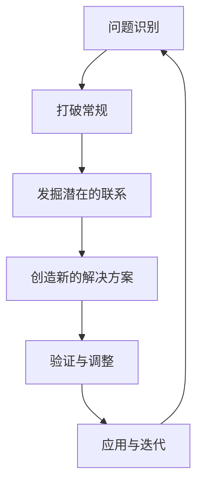

                 

# 创新思维：解决复杂问题

在面对复杂问题时，传统的解决方式往往难以奏效。这不仅是因为复杂问题的内在机制和约束条件通常错综复杂，更是因为我们的思维方式往往局限于线性、单一的路径。然而，创新思维的出现，为解决这些复杂问题提供了新的思路和方法。本文将深入探讨创新思维的核心概念、基本原理以及如何运用创新思维来突破复杂问题的瓶颈。

## 1. 背景介绍

### 1.1 问题由来

复杂问题的解决历来是人们面临的最大挑战之一。在科技日新月异、市场变化莫测的今天，如何以创新的方式应对复杂问题，成为每一个企业和组织必须面对的核心课题。传统的解决问题方法，如分而治之、逐步推进等，已经难以应对高度动态化和多样化的现实挑战。因此，研究创新思维，探求其背后原理和实践策略，已经成为当今社会的热点话题。

### 1.2 问题核心关键点

本文将聚焦于如何运用创新思维解决复杂问题的核心关键点，具体包括：

- 创新思维的概念和定义
- 创新思维的基本原理和框架
- 创新思维在复杂问题解决中的应用策略
- 创新思维的局限性和挑战

## 2. 核心概念与联系

### 2.1 核心概念概述

创新思维（Creative Thinking）是一种面对复杂问题时，通过打破常规、重新组合、创造新的解决方案的思维方式。其核心在于识别问题本质、发掘潜在的联系，以及利用新的视角和工具，创造出解决问题的新路径。

### 2.2 核心概念原理和架构的 Mermaid 流程图



这个流程图展示了创新思维的基本流程：首先识别问题，然后打破常规，发掘潜在的联系，创造出新的解决方案，并验证和调整这些解决方案，最后应用并迭代优化。

## 3. 核心算法原理 & 具体操作步骤

### 3.1 算法原理概述

创新思维的算法原理，可以简单概括为以下三个步骤：

1. **问题识别**：明确问题本质和目标。
2. **打破常规**：跳出传统思维定势，寻找新的思路和方法。
3. **创造新方案**：结合多学科知识和最新技术，创造出新的解决方案。

### 3.2 算法步骤详解

**步骤 1：问题识别**

问题识别是创新的第一步。通过对问题的深入分析，可以明确问题的本质和目标，从而有针对性地寻找解决方案。

**步骤 2：打破常规**

打破常规意味着要跳出已有的思维定势，勇于尝试新的方法。这通常包括：

- 逆向思维：从问题的反面思考，找到新的切入点。
- 跨界思维：借鉴其他领域的成功经验，寻找新的解决方案。
- 侧向思维：从不同的角度和视角审视问题，寻找新的解决路径。

**步骤 3：创造新方案**

创造新方案需要结合多学科知识和最新技术，探索新的解决方案。这通常包括：

- 结合人工智能、大数据、云计算等新兴技术，创造新的解决方案。
- 借鉴自然界和科学界的成功经验，寻找新的解决问题的方法。

### 3.3 算法优缺点

创新思维的优点在于：

- 灵活性高：可以应对多种复杂问题的挑战，寻找多种解决方案。
- 创造力强：能够打破传统思维定势，创造出新的解决方案。
- 适应性强：可以适应多种变化，及时调整解决方案。

其缺点在于：

- 不确定性高：创新过程充满不确定性，可能失败。
- 资源需求高：创新通常需要大量的资源，包括人力、财力和技术支持。
- 风险高：创新的尝试可能带来未知的风险和挑战。

### 3.4 算法应用领域

创新思维不仅适用于科技创新和产品开发，还广泛应用于企业管理、市场营销、教育等领域。例如，企业管理中的战略规划、市场营销中的品牌建设、教育中的教学创新等，都是创新思维应用的典型案例。

## 4. 数学模型和公式 & 详细讲解 & 举例说明

### 4.1 数学模型构建

在创新思维中，数学模型和公式可以辅助我们更好地理解和解决问题。本文以一个简单的案例来说明：

**案例：资源优化问题**

假设有一家制造企业，需要优化其生产资源的配置，以最大化利润。我们可以构建一个数学模型，用线性规划等方法来求解最优解。

### 4.2 公式推导过程

设企业有 $n$ 种产品，每种产品需要 $m$ 种资源，且每种资源的单位成本为 $c_i$，每种产品的单位收益为 $b_j$。设 $x_{ij}$ 表示生产第 $i$ 种资源的第 $j$ 种产品的数量。我们的目标是最小化总成本，同时最大化总收益：

$$
\min \sum_{i=1}^m \sum_{j=1}^n c_{ij}x_{ij}
$$

$$
\text{s.t.} \quad \sum_{j=1}^n x_{ij} = p_i, \quad \forall i=1,\dots,m
$$

$$
\sum_{i=1}^m \sum_{j=1}^n x_{ij} = \sum_{j=1}^n b_j
$$

其中 $p_i$ 表示第 $i$ 种资源的供给量。

### 4.3 案例分析与讲解

上述案例中，数学模型帮助我们明确了问题的本质，即如何优化资源配置以最大化利润。通过线性规划等方法，我们可以求解出最优的资源分配方案，从而指导企业的生产决策。

## 5. 项目实践：代码实例和详细解释说明

### 5.1 开发环境搭建

在进行项目实践前，我们需要准备开发环境。以下是在Python中进行项目实践的环境配置流程：

1. 安装Anaconda：从官网下载并安装Anaconda，用于创建独立的Python环境。

2. 创建并激活虚拟环境：
```bash
conda create -n pyenv python=3.8 
conda activate pyenv
```

3. 安装PyTorch：根据CUDA版本，从官网获取对应的安装命令。例如：
```bash
conda install pytorch torchvision torchaudio cudatoolkit=11.1 -c pytorch -c conda-forge
```

4. 安装TensorFlow：
```bash
pip install tensorflow
```

5. 安装NumPy、Pandas等必要的库：
```bash
pip install numpy pandas scikit-learn matplotlib tqdm jupyter notebook ipython
```

完成上述步骤后，即可在`pyenv`环境中开始项目实践。

### 5.2 源代码详细实现

以下是一个简单的线性规划问题的代码实现，用于求解最优资源配置：

```python
from scipy.optimize import linprog

# 定义目标函数
def objective(x):
    return -1.5*x[0] - 2*x[1]

# 定义约束条件
A = [[1, 1], [1, 1]]
b = [10, 20]
x0_lower, x0_upper = 0, 5
x1_lower, x1_upper = 0, 10

# 求解线性规划问题
result = linprog(objective, A_ub=A, b_ub=b, bounds=[(x0_lower, x0_upper), (x1_lower, x1_upper)])

print(f"最优解为: {result.x}")
print(f"最优目标函数值为: {result.fun}")
```

在这个例子中，我们使用SciPy库中的linprog函数来求解线性规划问题。通过设置目标函数和约束条件，我们得到了最优的资源配置方案。

### 5.3 代码解读与分析

这段代码的关键在于目标函数和约束条件的定义。目标函数是我们要最小化的函数，约束条件则是限制变量取值的条件。通过调用linprog函数，我们可以求解出最优解。

## 6. 实际应用场景

### 6.1 智能制造

在智能制造领域，创新思维可以应用于生产线优化、设备维护、生产调度等环节。例如，通过数据分析和机器学习，可以实时监测生产线的运行状态，及时发现和解决设备故障，优化生产调度，从而提高生产效率和产品质量。

### 6.2 智慧医疗

智慧医疗领域，创新思维可以应用于疾病预测、个性化治疗、医疗资源优化等环节。例如，通过人工智能和大数据分析，可以实现对疾病的早期预测和精准治疗，优化医疗资源配置，提高医疗服务的质量和效率。

### 6.3 金融科技

在金融科技领域，创新思维可以应用于风险管理、智能投顾、交易策略优化等环节。例如，通过机器学习和数据挖掘，可以实现对金融市场的精准预测和风险管理，优化投资组合，提高投资收益。

### 6.4 未来应用展望

未来，创新思维将在更多领域得到应用，为各行各业带来变革性影响。我们可以预见，创新思维在教育、农业、环境保护等领域的应用前景将更加广阔，为人类社会的可持续发展注入新的动力。

## 7. 工具和资源推荐

### 7.1 学习资源推荐

为了帮助开发者系统掌握创新思维的理论基础和实践技巧，这里推荐一些优质的学习资源：

1. 《创新思维与创造力》书籍：介绍创新思维的基本原理和实践方法，提供丰富的案例和实战经验。

2. 《设计思维》课程：斯坦福大学开设的课程，深入讲解设计思维的流程和应用，涵盖多个行业领域。

3. 《精益创业》书籍：讲解如何运用创新思维，通过不断迭代和优化，打造高效的产品开发流程。

4. 《创新心理学》课程：探索创新思维背后的心理学机制，帮助开发者提升创新能力和创新意识。

5. 《创新实验室》网站：提供大量的创新案例和创新工具，帮助开发者掌握创新思维的实践技巧。

通过对这些资源的学习实践，相信你一定能够快速掌握创新思维的精髓，并用于解决实际的复杂问题。

### 7.2 开发工具推荐

高效的开发离不开优秀的工具支持。以下是几款用于创新思维实践的常用工具：

1. Jupyter Notebook：数据科学和人工智能开发的主流工具，支持多语言编程，方便快速迭代和分享。

2. GitHub：版本控制和协作平台，方便开发者协同开发和项目管理。

3. TensorFlow和PyTorch：常用的深度学习框架，支持多种模型和算法，方便快速实现创新思维的实践。

4. AutoML工具：如Hyperopt、Optuna等，帮助开发者自动搜索最优模型参数，提升创新效率。

5. 设计思维工具：如Miro、MindMeister等，支持脑图绘制和协作，帮助团队进行创新思维的碰撞和迭代。

合理利用这些工具，可以显著提升创新思维的开发效率，加快创新迭代的步伐。

### 7.3 相关论文推荐

创新思维的研究源于学界的持续探索。以下是几篇奠基性的相关论文，推荐阅读：

1. "Creative Problem Solving: New Models and Strategies"：介绍多种创新思维策略和模型，提供理论基础和实践指南。

2. "Design Thinking: An Overview"：深入讲解设计思维的原理和实践方法，涵盖多个行业领域。

3. "Innovation in the Age of AI"：探讨人工智能与创新思维的融合，为创新思维的未来发展提供新思路。

4. "The Psychology of Innovation"：研究创新思维背后的心理学机制，为提升创新能力提供新视角。

5. "Innovation in Business Strategy"：探讨创新思维在企业战略中的应用，提供实用的创新管理工具和方法。

这些论文代表了大创新思维研究的发展脉络。通过学习这些前沿成果，可以帮助研究者把握学科前进方向，激发更多的创新灵感。

## 8. 总结：未来发展趋势与挑战

### 8.1 总结

本文对创新思维的核心概念、基本原理以及如何运用创新思维来突破复杂问题的瓶颈进行了全面系统的介绍。首先，明确了创新思维的概念和定义，其次，通过问题识别、打破常规、创造新方案三个步骤，深入讲解了创新思维的算法原理和具体操作步骤。此外，本文还广泛探讨了创新思维在智能制造、智慧医疗、金融科技等多个领域的应用前景，展示了创新思维的巨大潜力。

通过本文的系统梳理，可以看到，创新思维正在成为解决复杂问题的有力工具。它不仅适用于科技创新和产品开发，还广泛应用于企业管理、市场营销、教育等领域。未来的发展方向和面临的挑战，也将随着技术进步和社会变革而不断演进。

### 8.2 未来发展趋势

展望未来，创新思维将呈现以下几个发展趋势：

1. 技术融合加剧：创新思维将与人工智能、大数据、区块链等新兴技术深度融合，形成更加强大的解决复杂问题的能力。

2. 跨界应用广泛：创新思维将拓展到更多领域，如教育、农业、环境保护等，推动各行各业的数字化转型和智能化升级。

3. 协作创新增强：创新思维强调团队协作，通过跨领域、跨行业的合作，共同应对复杂问题。

4. 持续创新成为常态：创新思维强调持续改进和迭代，推动企业在激烈的市场竞争中保持领先地位。

5. 伦理道德意识增强：创新思维的实践过程中，将更加注重伦理道德和社会责任，促进可持续发展。

以上趋势凸显了创新思维的广阔前景。这些方向的探索发展，必将进一步提升创新思维的应用效果，为复杂问题的解决注入新的动力。

### 8.3 面临的挑战

尽管创新思维已经在多个领域得到广泛应用，但在迈向更加智能化、普适化应用的过程中，它仍面临着诸多挑战：

1. 创新风险高：创新思维通常伴随着高风险，失败的可能性较大。

2. 资源需求大：创新思维的实现通常需要大量的资源，包括人力、财力和技术支持。

3. 技术复杂度高：创新思维的实现通常涉及多学科知识和复杂的技术工具。

4. 伦理道德问题：创新思维的实践过程中，可能会带来新的伦理道德问题，需要多方协调和规范。

5. 持续改进困难：创新思维强调持续改进，但如何在保持创新的同时，避免过度的迭代和资源消耗，是一个值得研究的问题。

### 8.4 研究展望

面对创新思维面临的种种挑战，未来的研究需要在以下几个方面寻求新的突破：

1. 降低创新风险：开发更多的创新方法和工具，降低创新失败的概率。

2. 优化资源配置：通过数据驱动和智能调度，优化创新资源的配置，提高创新效率。

3. 简化技术实现：开发更加简单易用的创新工具和平台，降低技术实现的门槛。

4. 强化伦理道德：在创新思维的实践过程中，引入伦理道德的评估和引导，确保创新的正面影响。

5. 提升持续改进能力：通过敏捷开发和持续反馈机制，提升创新的迭代能力和持续改进效果。

这些研究方向和突破，将有助于创新思维在复杂问题解决中的深入应用，推动人工智能技术的发展和普及。

## 9. 附录：常见问题与解答

**Q1：创新思维和传统思维方式有什么区别？**

A: 创新思维和传统思维方式的区别主要在于思维方式的多样性和灵活性。传统思维通常是线性和单一的，而创新思维则是多维度和非线性的。创新思维强调打破常规，从不同角度和视角寻找新的解决方案。

**Q2：如何培养创新思维？**

A: 培养创新思维需要从多个方面入手，包括：

1. 扩大知识面：通过广泛学习和跨界融合，拓宽思维方式。

2. 培养好奇心：保持对未知事物的好奇心和探索欲，不断发现新问题。

3. 多学科融合：结合多学科知识和经验，综合运用不同领域的思维和方法。

4. 实践锻炼：通过不断的实践和迭代，提升创新能力和创新意识。

**Q3：创新思维在解决复杂问题时，如何平衡创新和实际效果？**

A: 在解决复杂问题时，创新思维需要平衡创新和实际效果，具体方法包括：

1. 充分调研：通过深入调研，了解问题的本质和目标，明确创新的方向和范围。

2. 小步快跑：通过小范围试点和迭代，逐步验证和优化创新方案。

3. 风险评估：对创新的风险和效果进行评估，避免过度的创新和资源浪费。

4. 多方案比选：设计多个创新方案，通过比较和评估，选择最优方案。

**Q4：创新思维在实际应用中面临哪些挑战？**

A: 创新思维在实际应用中面临的挑战包括：

1. 资源限制：创新思维通常需要大量资源，包括人力、财力和技术支持。

2. 风险高：创新思维的实现通常伴随着高风险，失败的可能性较大。

3. 技术复杂：创新思维的实现通常涉及多学科知识和复杂的技术工具。

4. 伦理道德：创新思维的实践过程中，可能会带来新的伦理道德问题，需要多方协调和规范。

5. 持续改进：创新思维强调持续改进，但如何在保持创新的同时，避免过度的迭代和资源消耗，是一个值得研究的问题。

---

作者：禅与计算机程序设计艺术 / Zen and the Art of Computer Programming

