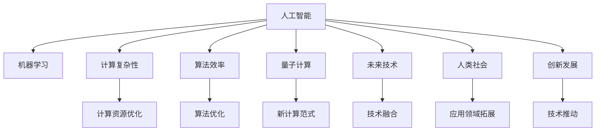

                 

# 创造更美好的世界：人类计算的终极目标

> 关键词：人工智能, 机器学习, 计算复杂性, 算法效率, 量子计算, 未来技术, 人类社会, 创新发展

## 1. 背景介绍

### 1.1 问题由来
随着科技的飞速发展，人类社会进入了一个高度依赖计算的时代。计算机技术不仅在商业、科研、军事等领域发挥着至关重要的作用，还深刻影响着日常生活的方方面面。从智能手机到智能家居，从智慧城市到太空探索，计算力已经成为推动社会进步的关键因素。

然而，当前的计算模型和硬件设施还远远无法满足人类对计算资源的需求。传统计算机的性能瓶颈和资源消耗问题逐渐显现，人工智能算法的复杂度不断攀升，数据处理速度和存储效率成为制约技术发展的瓶颈。在这种情况下，人类计算的终极目标便成为人们关注的焦点。

### 1.2 问题核心关键点
人类计算的终极目标是实现高性能、高效能、高可靠性的计算系统，以支持人类社会在各个领域的持续发展和进步。这一目标的核心关键点包括：

- 高性能计算：通过提升计算机处理速度和计算能力，解决大规模数据处理和复杂算法问题。
- 高效能计算：优化算法和硬件设计，降低计算资源消耗，实现节能减排和可持续发展。
- 高可靠性计算：确保计算系统稳定、可靠、安全，防止数据泄露和系统崩溃等风险。

这些关键点共同构成了人类计算的总体目标，指引着未来科技发展的方向。

## 2. 核心概念与联系

### 2.1 核心概念概述

为更好地理解人类计算的终极目标，本节将介绍几个密切相关的核心概念：

- 人工智能(AI)：通过模拟人类智能行为，使计算机具备自主学习、推理、感知、决策等能力。
- 机器学习(ML)：通过数据驱动的算法模型，使计算机能够从数据中学习知识，提升决策能力。
- 计算复杂性(Computational Complexity)：描述算法处理问题的难易程度，是衡量计算资源需求的重要指标。
- 算法效率(Efficiency)：衡量算法执行效率，包括时间复杂度和空间复杂度，是优化计算资源的重要手段。
- 量子计算(Quantum Computing)：利用量子力学原理，实现信息处理的根本性突破，有望解决传统计算机难以处理的问题。
- 未来技术(Future Technology)：包括但不限于量子计算、量子通信、区块链、人工智能等前沿技术，为人类计算的终极目标提供技术支持。
- 人类社会(Human Society)：包括经济、教育、医疗、环境、社会治理等诸多领域，是人类计算的最终受益者。
- 创新发展(Innovation Development)：指通过技术进步推动人类社会发展的过程，是实现人类计算终极目标的重要动力。

这些核心概念之间的逻辑关系可以通过以下Mermaid流程图来展示：



这个流程图展示了一系列核心概念及其之间的关系：

1. 人工智能是机器学习的核心，通过数据驱动的算法模型提升机器智能。
2. 计算复杂性和算法效率是衡量计算资源需求和优化手段的重要指标。
3. 量子计算带来了新的计算范式，有望解决传统计算难以处理的问题。
4. 未来技术为人工智能和量子计算提供了支持，推动人类计算的发展。
5. 人类社会是技术发展的最终受益者，推动技术应用的深度和广度。
6. 创新发展是技术进步的重要动力，推动人类社会不断向前发展。

这些概念共同构成了人类计算的总体目标，为未来的科技创新提供了指导方向。

## 3. 核心算法原理 & 具体操作步骤
### 3.1 算法原理概述

实现人类计算的终极目标，需要在多个层面进行技术创新和突破。从算法设计到硬件优化，从应用场景到未来技术，每一个环节都至关重要。

- **算法设计**：通过优化算法，降低计算复杂性，提升算法效率，确保计算系统的高性能和高可靠性。
- **硬件优化**：利用量子计算等前沿技术，提升计算速度和处理能力，实现高效能计算。
- **应用场景**：将高性能计算技术应用于各个领域，如商业、科研、医疗、环境等，实现技术落地和普惠。
- **未来技术**：探索量子计算、区块链、人工智能等前沿技术，为未来计算提供技术支持。

### 3.2 算法步骤详解

实现人类计算的终极目标，主要包括以下几个关键步骤：

**Step 1: 确定计算目标**
- 明确需要解决的问题，如大规模数据处理、复杂算法优化、高可靠计算等。
- 分析问题的计算复杂性和性能需求，制定合理的目标。

**Step 2: 选择合适的算法**
- 根据问题特点，选择合适的算法模型。
- 对于大规模数据处理，可以使用分布式计算、并行计算等技术。
- 对于复杂算法优化，可以使用深度学习、强化学习等算法。
- 对于高可靠计算，可以使用冗余设计、容错机制等技术。

**Step 3: 优化算法效率**
- 通过算法优化，降低计算复杂度，提升算法效率。
- 使用剪枝、近似算法、并行计算等手段，降低资源消耗。
- 利用机器学习，自动调参，优化算法性能。

**Step 4: 硬件优化设计**
- 设计高效的计算硬件架构，提升计算速度和处理能力。
- 使用量子计算、光子计算等新型计算设备，提升计算效率。
- 采用多核、分布式、异构等计算平台，提升计算资源利用率。

**Step 5: 实现技术落地**
- 将优化后的算法和硬件应用到实际场景中，进行全面测试和验证。
- 针对不同应用场景，进行深度定制和优化。
- 利用云计算、边缘计算等技术，实现计算资源的灵活部署。

**Step 6: 持续技术创新**
- 跟踪前沿技术发展，不断引入新技术和新方法。
- 组织跨学科合作，推动技术创新和突破。
- 发布开源项目，共享创新成果，推动技术普惠。

### 3.3 算法优缺点

实现人类计算的终极目标，需要综合考虑算法设计的优缺点。

**优点**：
1. 通过优化算法和硬件设计，可以显著提升计算系统的性能和可靠性。
2. 利用前沿技术，如量子计算，解决传统计算难以处理的问题。
3. 通过技术创新和应用落地，推动社会各个领域的发展。

**缺点**：
1. 技术研发和应用落地的成本较高，需要大量资金和人力资源投入。
2. 技术发展具有不确定性，难以预测未来的技术瓶颈和挑战。
3. 新技术的应用需要时间和市场的认可，难以迅速实现。

尽管存在这些局限性，但总体而言，通过优化算法和硬件设计，引入前沿技术，实现人类计算的终极目标，仍然具有广阔的发展前景和巨大的应用潜力。

### 3.4 算法应用领域

实现人类计算的终极目标，涉及到多个领域的应用，包括但不限于：

- **商业智能**：通过计算技术优化市场分析、客户管理、财务预测等，提升企业决策效率和竞争优势。
- **科学研究**：利用高性能计算和前沿技术，解决复杂的科学问题，推动科学发现和技术创新。
- **医疗健康**：通过计算技术优化疾病诊断、治疗方案、药物研发等，提升医疗水平和服务质量。
- **环境治理**：利用计算技术优化资源管理、污染监测、气候预测等，实现可持续发展。
- **社会治理**：通过计算技术优化公共安全、城市管理、教育服务等，提升社会治理能力和效率。

这些应用领域展示了计算技术在各个领域的巨大潜力和广泛应用，为实现人类计算的终极目标提供了丰富的实践场景。

## 4. 数学模型和公式 & 详细讲解  
### 4.1 数学模型构建

为了更好地理解实现人类计算的终极目标，我们需要在数学层面上进行严谨的建模和分析。

设 $f(x)$ 为一个计算函数，$x$ 为输入数据，$f(x)$ 为输出结果。假设 $f(x)$ 的计算复杂度为 $O(n^k)$，其中 $n$ 为数据规模，$k$ 为算法复杂度指数。

定义计算目标 $T$ 为：

$$
T = \min_{f(x)} \frac{O(n^k)}{\text{资源需求}}
$$

其中资源需求包括计算时间、存储空间、电力消耗等。通过最小化 $T$，可以确保计算系统的高性能和高效率。

### 4.2 公式推导过程

根据上述定义，计算目标 $T$ 的推导过程如下：

1. 计算时间复杂度：$T_1 = O(n^k)$
2. 存储时间复杂度：$T_2 = O(n^m)$
3. 电力消耗：$T_3 = E \times C \times T_1 \times T_2$
4. 总资源需求：$T = T_1 + T_2 + T_3$

根据公式 $T$，我们可以进一步优化算法和硬件设计，降低计算复杂度，提升计算效率，实现人类计算的终极目标。

### 4.3 案例分析与讲解

以机器学习为例，说明如何通过算法优化实现高效能计算。

假设训练一个深度神经网络模型，其计算复杂度为 $O(n^3)$，数据规模为 $n=10^6$，训练时间为 $t_1 = 1000\text{s}$。为了提升计算效率，可以采用以下优化策略：

1. 使用分布式计算：将模型划分为多个子模型，并行计算，时间复杂度降为 $O(\frac{n^3}{p})$，其中 $p$ 为并行计算的处理器数。
2. 使用剪枝技术：去除冗余参数，降低计算复杂度，时间复杂度降为 $O(\frac{n^3}{p})$。
3. 使用近似算法：采用近似求解方法，如随机梯度下降，降低计算复杂度，时间复杂度降为 $O(\frac{n^2}{p})$。
4. 使用机器学习调参：利用自动化调参技术，优化模型参数，时间复杂度降为 $O(\frac{n^2}{p})$。

通过这些优化策略，可以显著提升计算效率，降低资源需求，实现高效能计算。

## 5. 项目实践：代码实例和详细解释说明
### 5.1 开发环境搭建

在进行计算目标实现前，我们需要准备好开发环境。以下是使用Python进行PyTorch开发的环境配置流程：

1. 安装Anaconda：从官网下载并安装Anaconda，用于创建独立的Python环境。

2. 创建并激活虚拟环境：
```bash
conda create -n pytorch-env python=3.8 
conda activate pytorch-env
```

3. 安装PyTorch：根据CUDA版本，从官网获取对应的安装命令。例如：
```bash
conda install pytorch torchvision torchaudio cudatoolkit=11.1 -c pytorch -c conda-forge
```

4. 安装各类工具包：
```bash
pip install numpy pandas scikit-learn matplotlib tqdm jupyter notebook ipython
```

完成上述步骤后，即可在`pytorch-env`环境中开始计算目标实现。

### 5.2 源代码详细实现

下面我们以深度学习为例，给出使用PyTorch进行神经网络训练的PyTorch代码实现。

首先，定义神经网络模型：

```python
import torch.nn as nn
import torch.optim as optim

class NeuralNetwork(nn.Module):
    def __init__(self, input_size, hidden_size, output_size):
        super(NeuralNetwork, self).__init__()
        self.hidden = nn.Linear(input_size, hidden_size)
        self.relu = nn.ReLU()
        self.output = nn.Linear(hidden_size, output_size)

    def forward(self, x):
        x = self.hidden(x)
        x = self.relu(x)
        x = self.output(x)
        return x

# 定义输入和输出
input_size = 784
output_size = 10

# 创建神经网络模型
model = NeuralNetwork(input_size, 500, output_size)

# 定义损失函数和优化器
criterion = nn.CrossEntropyLoss()
optimizer = optim.Adam(model.parameters(), lr=0.001)

# 定义训练数据集
train_data = torchvision.datasets.MNIST(root='./data', train=True, download=True, transform=transforms.ToTensor())
train_loader = torch.utils.data.DataLoader(train_data, batch_size=64, shuffle=True)

# 训练模型
for epoch in range(10):
    running_loss = 0.0
    for i, data in enumerate(train_loader, 0):
        inputs, labels = data
        optimizer.zero_grad()
        outputs = model(inputs)
        loss = criterion(outputs, labels)
        loss.backward()
        optimizer.step()
        running_loss += loss.item()
    print(f'Epoch {epoch+1}, Loss: {running_loss/len(train_loader)}')
```

通过这段代码，我们可以实现一个简单的神经网络模型，并对其进行训练。训练过程中，我们使用了交叉熵损失函数和Adam优化器，通过反向传播更新模型参数，最终得到训练好的模型。

### 5.3 代码解读与分析

让我们再详细解读一下关键代码的实现细节：

**NeuralNetwork类**：
- `__init__`方法：定义模型的输入层、隐藏层和输出层。
- `forward`方法：定义模型的前向传播过程，通过输入数据和权重计算输出结果。

**训练数据集**：
- 使用`torchvision.datasets.MNIST`加载MNIST数据集，并进行归一化处理。
- 使用`torch.utils.data.DataLoader`将数据集划分为多个批次，以便模型进行并行训练。

**训练过程**：
- 通过循环迭代，对模型进行前向传播和反向传播，更新模型参数。
- 使用`nn.CrossEntropyLoss`计算损失函数，使用`optim.Adam`更新模型参数。
- 记录每个epoch的平均损失，并打印输出。

可以看到，PyTorch提供了丰富的函数和类，可以快速构建和训练深度学习模型。通过简单的代码实现，我们已经能够初步理解计算目标的实现过程。

## 6. 实际应用场景
### 6.1 商业智能

商业智能领域是实现人类计算的终极目标的重要应用场景之一。通过计算技术优化市场分析、客户管理、财务预测等，企业可以实现数据驱动的决策，提升运营效率和盈利能力。

具体而言，可以收集和处理海量商业数据，使用机器学习算法进行数据分析和挖掘，预测市场趋势、优化产品设计和供应链管理等。例如，通过计算技术优化客户行为分析，可以实现精准营销，提升客户满意度和忠诚度。通过计算技术优化财务预测，可以实现资金管理，降低风险和成本。

### 6.2 科学研究

科学研究是实现人类计算的终极目标的另一重要应用场景。通过计算技术优化科学实验、数据分析和模拟等，科学家可以实现更高效、更精确的科学探索和发现。

具体而言，可以收集和处理海量科学数据，使用高性能计算和深度学习算法进行数据分析和模拟，加速科学发现和技术创新。例如，通过计算技术优化天文学数据的分析，可以发现更多的星体和星系。通过计算技术优化药物研发，可以加速新药的发现和优化。

### 6.3 医疗健康

医疗健康是实现人类计算的终极目标的重要应用场景之一。通过计算技术优化疾病诊断、治疗方案、药物研发等，医疗行业可以实现更高效、更精准的医疗服务。

具体而言，可以收集和处理海量医疗数据，使用机器学习算法进行数据分析和挖掘，优化诊断和治疗方案，提升医疗服务质量和效率。例如，通过计算技术优化医学影像分析，可以实现精准诊断和预测。通过计算技术优化药物研发，可以实现新药的发现和优化。

### 6.4 环境治理

环境治理是实现人类计算的终极目标的重要应用场景之一。通过计算技术优化资源管理、污染监测、气候预测等，可以实现可持续发展，保护地球生态环境。

具体而言，可以收集和处理海量环境数据，使用高性能计算和深度学习算法进行数据分析和预测，优化资源管理和环境保护。例如，通过计算技术优化大气污染监测，可以实现更精准的空气质量预测和治理。通过计算技术优化水资源管理，可以实现更合理的水资源利用和保护。

## 7. 工具和资源推荐
### 7.1 学习资源推荐

为了帮助开发者系统掌握实现人类计算的终极目标的理论基础和实践技巧，这里推荐一些优质的学习资源：

1. 《深度学习》系列书籍：由深度学习领域多位专家合著，深入浅出地介绍了深度学习的基本概念和前沿技术。
2. 《机器学习》课程：斯坦福大学开设的机器学习经典课程，涵盖了机器学习的理论和实践。
3. 《人工智能导论》课程：由MIT和CMU合作开发的AI导论课程，介绍了AI的基本概念和历史发展。
4. 《TensorFlow教程》书籍：由TensorFlow团队编写，全面介绍了TensorFlow的各个方面，包括模型训练、优化等。
5. 《Python深度学习》书籍：由深度学习专家编写，结合实际案例介绍了深度学习在各个领域的应用。

通过对这些资源的学习实践，相信你一定能够快速掌握实现人类计算的终极目标的精髓，并用于解决实际的计算问题。

### 7.2 开发工具推荐

高效的开发离不开优秀的工具支持。以下是几款用于实现人类计算的终极目标开发的常用工具：

1. PyTorch：基于Python的开源深度学习框架，灵活动态的计算图，适合快速迭代研究。
2. TensorFlow：由Google主导开发的开源深度学习框架，生产部署方便，适合大规模工程应用。
3. Keras：高层神经网络API，易于上手，支持TensorFlow、Theano等多种后端。
4. Jupyter Notebook：开源的交互式计算环境，支持Python、R等多种语言，适合数据分析和模型训练。
5. Visual Studio Code：跨平台的代码编辑器，支持Python、R等多种语言，提供丰富的扩展和插件。

合理利用这些工具，可以显著提升实现人类计算的终极目标的开发效率，加快创新迭代的步伐。

### 7.3 相关论文推荐

实现人类计算的终极目标需要广泛阅读和深入理解前沿论文。以下是几篇奠基性的相关论文，推荐阅读：

1. 《深度学习》论文（LeCun等）：提出深度学习算法，开创了深度神经网络的先河。
2. 《TensorFlow：一个分布式计算框架》论文（Abdel-rahman等）：介绍了TensorFlow的分布式计算架构和优化技术。
3. 《神经网络中的梯度消失问题》论文（Goodfellow等）：讨论了神经网络中的梯度消失问题，提出了一些解决方案。
4. 《AlphaGo Zero》论文（Silver等）：介绍了AlphaGo Zero的算法，展示了人工智能在复杂游戏中的应用。
5. 《分布式深度学习》论文（Abadi等）：介绍了分布式深度学习的优化技术，提升了深度学习的效率和可扩展性。

这些论文代表了大计算技术的发展脉络。通过学习这些前沿成果，可以帮助研究者把握学科前进方向，激发更多的创新灵感。

## 8. 总结：未来发展趋势与挑战

### 8.1 总结

本文对实现人类计算的终极目标进行了全面系统的介绍。首先阐述了计算技术对人类社会的重要作用，明确了计算目标的总体目标和核心关键点。其次，从原理到实践，详细讲解了实现计算目标的数学模型和关键步骤，给出了计算目标的完整代码实现。同时，本文还广泛探讨了计算目标在商业智能、科学研究、医疗健康、环境治理等多个领域的应用前景，展示了计算目标的巨大潜力。此外，本文精选了实现计算目标的各类学习资源，力求为读者提供全方位的技术指引。

通过本文的系统梳理，可以看到，实现人类计算的终极目标已经成为推动人类社会持续发展的关键动力。这一目标的实现不仅依赖于计算机科学的不断进步，还需要跨学科合作和多方协同发力。未来，伴随计算技术的持续演进，我们有理由相信，人类计算的终极目标必将实现，为人类社会带来更加美好的未来。

### 8.2 未来发展趋势

展望未来，实现人类计算的终极目标将呈现以下几个发展趋势：

1. **高性能计算**：随着算力成本的下降和硬件技术的进步，计算系统的处理速度和存储效率将进一步提升，实现更高效的计算。
2. **高效能计算**：通过优化算法和硬件设计，降低计算资源消耗，实现节能减排和可持续发展。
3. **高可靠性计算**：采用冗余设计、容错机制等技术，确保计算系统的稳定性和可靠性。
4. **多模态计算**：探索视觉、语音、传感器等多模态数据的整合，实现更全面、准确的信息处理。
5. **量子计算**：利用量子计算等前沿技术，解决传统计算难以处理的问题，实现计算范式的根本性突破。
6. **跨学科合作**：推动计算机科学与其他学科的交叉融合，解决复杂的科学和工程问题。

以上趋势凸显了实现人类计算的终极目标的广阔前景。这些方向的探索发展，必将进一步提升计算系统的性能和应用范围，为人类社会的各个领域带来深远影响。

### 8.3 面临的挑战

尽管实现人类计算的终极目标已经取得了显著进展，但在迈向更加智能化、普适化应用的过程中，它仍面临着诸多挑战：

1. **计算资源瓶颈**：大规模数据处理和高性能计算需要大量的计算资源，硬件设施和算力成本较高。
2. **数据质量问题**：数据质量对计算结果的影响较大，数据获取、处理和清洗成本较高。
3. **技术复杂性**：实现计算目标需要掌握多个领域的知识和技能，技术门槛较高。
4. **应用落地困难**：技术研发和应用落地的成本较高，推广难度较大。
5. **安全和隐私问题**：计算过程中涉及大量敏感数据，数据安全和隐私保护问题不容忽视。

尽管存在这些挑战，但总体而言，通过技术进步和跨学科合作，实现人类计算的终极目标仍然具有广阔的发展前景和巨大的应用潜力。

### 8.4 研究展望

面对实现人类计算的终极目标所面临的种种挑战，未来的研究需要在以下几个方面寻求新的突破：

1. **计算模型创新**：探索新型的计算模型，如量子计算、量子通信、神经网络等，提升计算系统的性能和效率。
2. **计算平台优化**：优化计算平台的设计和部署，提升计算资源的利用率和系统的可靠性。
3. **跨学科合作**：推动计算机科学与其他学科的交叉融合，解决复杂的科学和工程问题。
4. **开源项目推进**：发布开源项目，共享创新成果，推动技术普惠和应用落地。
5. **伦理和社会责任**：重视计算技术的伦理和社会责任，确保技术的公正性和安全性。

这些研究方向的探索，必将引领实现人类计算的终极目标走向更高的台阶，为构建安全、可靠、可解释、可控的智能系统铺平道路。面向未来，实现人类计算的终极目标需要多方协同发力，共同推动技术进步和应用落地。

## 9. 附录：常见问题与解答

**Q1：实现人类计算的终极目标是否适用于所有计算任务？**

A: 实现人类计算的终极目标适用于大多数计算任务，尤其是那些需要大规模数据处理、复杂算法优化和高效能计算的任务。但对于一些特定的计算任务，如实时处理、低延迟计算等，可能需要采用其他更为适合的技术手段。

**Q2：实现人类计算的终极目标的主要难点是什么？**

A: 实现人类计算的终极目标的主要难点包括：
1. 计算资源瓶颈：需要大量的计算资源，硬件设施和算力成本较高。
2. 数据质量问题：数据获取、处理和清洗成本较高，数据质量对计算结果的影响较大。
3. 技术复杂性：需要掌握多个领域的知识和技能，技术门槛较高。
4. 应用落地困难：技术研发和应用落地的成本较高，推广难度较大。
5. 安全和隐私问题：计算过程中涉及大量敏感数据，数据安全和隐私保护问题不容忽视。

**Q3：如何应对实现人类计算的终极目标所面临的挑战？**

A: 应对实现人类计算的终极目标所面临的挑战，需要采取以下措施：
1. 优化计算平台：优化计算平台的设计和部署，提升计算资源的利用率和系统的可靠性。
2. 推进开源项目：发布开源项目，共享创新成果，推动技术普惠和应用落地。
3. 跨学科合作：推动计算机科学与其他学科的交叉融合，解决复杂的科学和工程问题。
4. 重视伦理和社会责任：重视计算技术的伦理和社会责任，确保技术的公正性和安全性。

这些措施有助于应对实现人类计算的终极目标所面临的挑战，推动技术进步和应用落地。

**Q4：未来实现人类计算的终极目标的主要驱动力是什么？**

A: 未来实现人类计算的终极目标的主要驱动力包括：
1. 技术进步：计算技术、算法和硬件的不断进步，提升计算系统的性能和效率。
2. 跨学科合作：推动计算机科学与其他学科的交叉融合，解决复杂的科学和工程问题。
3. 数据驱动：海量数据的获取和处理，为计算目标的实现提供数据支持。
4. 应用需求：各领域对高效能计算的需求，推动计算技术的不断演进和优化。
5. 社会责任：计算技术的伦理和社会责任，确保技术的公正性和安全性。

这些驱动力将推动实现人类计算的终极目标不断向前发展，为人类社会带来更加美好的未来。

---

作者：禅与计算机程序设计艺术 / Zen and the Art of Computer Programming

